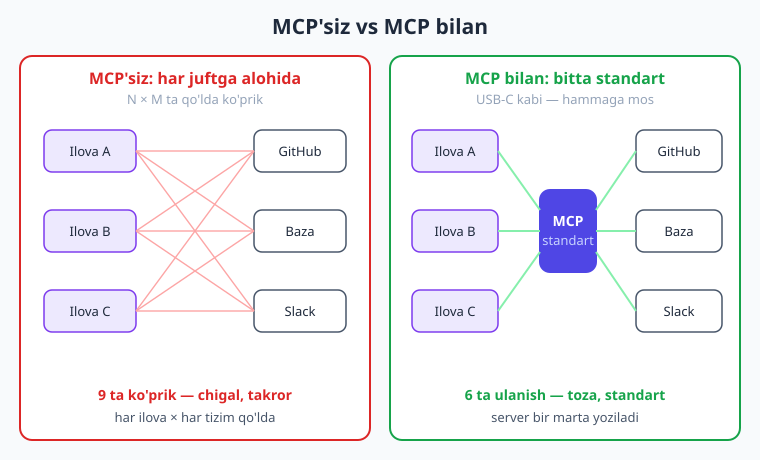
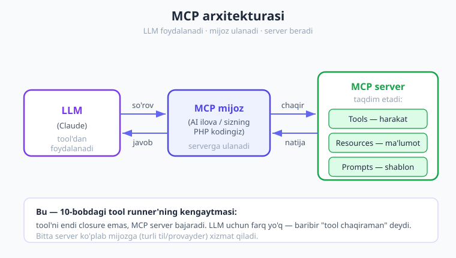
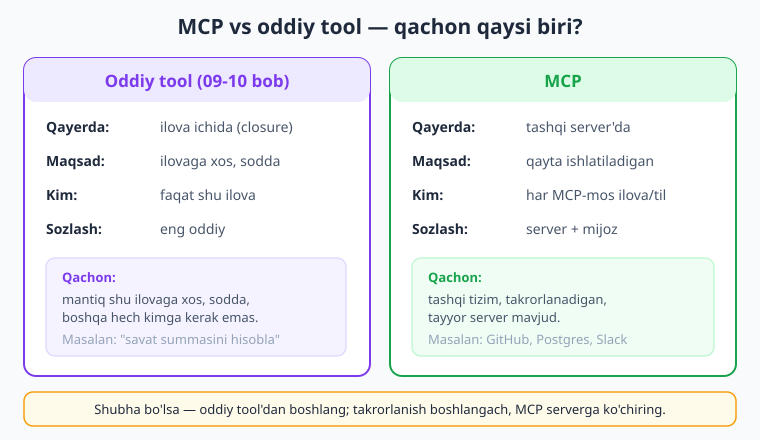

# 12 — MCP (Model Context Protocol)

[⬅️ Oldingi: 11 — Agentlar](./11-agentlar.md) · [🏠 Kitob boshi](./README.md) · [Keyingi: 13 — Embedding va semantik qidiruv ➡️](./13-embedding-semantik-qidiruv.md)

> **Bu bobda:** Oldingi boblarda har bir tool'ni o'z qo'limiz bilan yozdik (09-10) va ulardan agent qurdik (11). Endi savol tug'iladi: agar GitHub, ma'lumotlar bazasi, Slack va fayllar bilan ishlash kerak bo'lsa — har biriga, har bir ilovada, qaytadan tool yozaverishimiz kerakmi? **MCP (Model Context Protocol)** — aynan shu takrorlanishni yo'q qiladigan ochiq standart. Bu bobda MCP nima, nega "AI dunyosining USB-C'si" deyilishini, arxitekturasini, PHP SDK'dagi `BetaMcp` yordamida tayyor MCP serverlarni Claude'ga ulashni, remote MCP'ni va MCP qachon oddiy tool'dan afzalligini o'rganamiz.

---

## Nega bu bob muhim?

09 va 10-boblarda biz tool yozishni o'rgandik: ob-havo tool'i, kalkulyator, baza so'rovi. 11-bobda ulardan agent qurdik. Hammasi yaxshi ishladi. Ammo bitta muammo bor — va u real loyihalarda tez seziladi.

Tasavvur qiling, sizning kompaniyangizda **uchta** AI ilova bor:

- mijozlar uchun chatbot;
- ichki yordamchi (xodimlar uchun);
- hujjatlar tahlili tizimi.

Har uchalasiga ham **GitHub** bilan ishlash kerak (issue'larni o'qish), **ma'lumotlar bazasi** bilan (buyurtmalarni qidirish) va **fayl tizimi** bilan (hujjatlarni o'qish). Demak siz GitHub uchun tool'ni... **uch marta** yozasiz. Baza tool'ini — uch marta. Fayl tool'ini — uch marta. Va agar GitHub o'z API'sini o'zgartirsa — uchala joyni ham yangilaysiz.

Endi yana yomonroq: ertaga hamkasbingiz **Python**'da to'rtinchi ilova yozadi. U sizning PHP tool'laringizdan **umuman** foydalana olmaydi — hammasini noldan yozadi. Beshinchi ilova **TypeScript**'da bo'lsa — yana noldan.

Bu — aniq **takrorlanish** (duplication) muammosi. Har bir "AI ↔ tashqi tizim" jufti uchun alohida ko'prik yozilmoqda. Va har bir ko'prik o'sha ilovaga, o'sha tilga, o'sha provayderga **bog'lab** qo'yilgan.

> **Hayotiy o'xshatish.** Eski telefonlarni eslang: Nokia'ning o'z zaryadlovchisi, Samsung'ning boshqasi, Sony'ning yana boshqasi bor edi. Mehmonga borsangiz, "zaryadlovching bormi?" deb so'rardingiz — va ko'pincha mos kelmasdi. Keyin **USB-C** chiqdi: bitta standart shtekker — telefon, planshet, noutbuk, quloqchin — hammasiga mos. Endi bitta simni hamma joyga olib yurasiz. MCP — AI dunyosidagi aynan shu **USB-C**: tashqi tizimga ulanishning bitta standarti.

Bu bobda biz "har qurilmaga alohida zaryadlovchi" dunyosidan "bitta standart shtekker" dunyosiga o'tamiz.

---

## MCP nima?

**MCP (Model Context Protocol)** — bu AI ilovalarni tashqi tizimlar va tool'larga ulashning **ochiq standarti** (protokoli). U Anthropic tomonidan e'lon qilingan, lekin ochiq — istalgan kompaniya, istalgan til foydalanishi mumkin.

Asosiy g'oya juda sodda:

1. **Tashqi tizim egasi** (masalan, GitHub) bir marta **MCP server** yozadi. Bu server "men quyidagi tool'larni va ma'lumotlarni MCP standartida taqdim etaman" deydi.
2. **AI ilova** (siz yozadigan) **MCP mijoz** (client) sifatida o'sha serverga **ulanadi** — va darhol uning barcha tool'laridan foydalana oladi. O'zingiz hech narsa yozmaysiz.

Eng muhimi: server **bir marta** yoziladi, lekin **har qanday** MCP-mos AI ilova (qaysi tilda, qaysi provayderda bo'lishidan qat'i nazar) undan foydalana oladi. Aynan USB-C kabi — bitta server, cheksiz mijoz.

Quyidagi rasm "MCP'siz" va "MCP bilan" dunyolarni taqqoslaydi:



Chap tomonda (MCP'siz): har bir ilova har bir tashqi tizimga **alohida** simli ulanish — N×M ta ko'prik, hammasi qo'lda. O'ng tomonda (MCP bilan): har bir tashqi tizim bitta MCP server beradi, har bir ilova bitta MCP mijoz orqali ulanadi — N+M ta qism, hammasi standart.

!!! note "Eslatma"
    "Protokol" — bu ikki tomon o'zaro qanday gaplashishini belgilovchi **kelishuv** (qoidalar to'plami). Masalan, HTTP — brauzer va veb-server qanday gaplashishini belgilaydi. MCP — AI ilova va tool-server qanday gaplashishini belgilaydi. Standart bo'lgani uchun har ikki tomon bir-birini "tushunadi", garchi turli odamlar yozgan bo'lsa ham.

!!! tip "Maslahat"
    MCP'ni o'rganishda eng oson yo'l — uni 09-10 boblardagi tool'larning **tashqi, qayta ishlatiladigan** ko'rinishi deb tasavvur qilish. O'sha tool'lar — lekin endi ilovangiz ichida emas, alohida server'da yashaydi va hamma uchun ochiq.

---

## Arxitektura: server, mijoz, LLM

MCP'da uchta rol bor. Ularni aniq ajratib olaylik, chunki bu butun bobning asosi:

- **MCP server** — tool'lar, ma'lumot va shablonlar **taqdim etadi**. Masalan, GitHub MCP serveri "issue ochish", "PR ro'yxati", "repo qidirish" tool'larini beradi. Bu siz yozadigan ilova **emas** — odatda tashqi tomon (GitHub, jamoa) yozgan, tayyor.
- **MCP mijoz** (client) — server bilan **gaplashadi**. Bu sizning AI ilovangiz ichidagi qism. U serverga ulanadi, "qanday tool'laring bor?" deb so'raydi, kerakli tool'ni chaqiradi va natijani oladi.
- **LLM** (Claude) — mijoz orqali olingan tool'lardan **foydalanadi**. Model "GitHub'da issue ochay" deb qaror qiladi, mijoz buni MCP serverga uzatadi, server bajaradi, natija modelga qaytadi.

Oqim quyidagicha: **LLM → MCP mijoz → MCP server → (tashqi tizim) → orqaga**.



Diqqat qiling — bu 10-bobdagi tool runner'ning aynan **kengaytmasi**. O'sha yerda tool'ni funksiya (closure) bajarardi; bu yerda tool'ni **MCP server** bajaradi. LLM uchun esa farq yo'q: u baribir "tool chaqiraman" deydi, javob esa baribir tool_result bo'lib qaytadi. MCP shunchaki tool'ning **manbasini** (ilovangiz ichi → tashqi server) o'zgartiradi.

> **Hayotiy o'xshatish.** Restoranni tasavvur qiling. **Mijoz** (LLM) ovqat buyuradi. **Ofitsiant** (MCP mijoz) buyurtmani oshxonaga olib boradi. **Oshxona** (MCP server) ovqatni tayyorlaydi va qaytaradi. Mijoz oshxona ichida nima bo'layotganini bilmaydi — u faqat ofitsiant orqali gaplashadi. Va eng yaxshi tomoni: o'sha oshxona (bitta MCP server) bir vaqtning o'zida **ko'plab** ofitsiantlarga (ko'p AI ilovaga) xizmat qila oladi.

---

## MCP nima beradi: Tools, Resources, Prompts

MCP server uch xil narsa taqdim etishi mumkin. Har birini qisqacha ko'rib chiqaylik:

**1. Tools (tool'lar — harakat).** Bu — modelning **harakat** qiladigan vositasi: issue ochish, faylga yozish, baza so'rovini bajarish, xabar yuborish. Aynan 09-10 boblardagi tool tushunchasi, lekin server tomonida. Model "buni bajar" deydi, tool bajaradi va natija qaytaradi.

**2. Resources (resurslar — ma'lumot/kontekst).** Bu — modelga **kontekst** beradigan ma'lumot: fayl mazmuni, hujjat, baza yozuvi, log. Resource **harakat** emas — u shunchaki "mana sizga kerakli ma'lumot" deb beradi. Masalan, fayl-tizim MCP serveri `file:///hisobot.txt` resursini berishi mumkin — model uni o'qib, kontekst sifatida ishlatadi.

**3. Prompts (shablonlar — tayyor so'rovlar).** Bu — server tomonidan tayyorlangan **prompt shablonlari**. Masalan, "kodni tahlil qil" yoki "PR'ni ko'rib chiq" shabloni. Foydalanuvchi shablonni tanlaydi, server uni to'liq prompt'ga aylantirib beradi. Bu — promptlarni qayta ishlatishning qulay usuli (promptlarni boshqarish haqida 23-bobda batafsil).

!!! info "Qisqacha farq"
    **Tools** = model *qiladi* (harakat). **Resources** = model *o'qiydi* (ma'lumot). **Prompts** = foydalanuvchi *tanlaydi* (tayyor so'rov). Ko'pchilik MCP serverlar asosan **Tools** beradi — biz ham shu bobda asosan tool'larga e'tibor qaratamiz.

---

## Mavjud MCP serverlar — tayyor ekotizim

MCP'ning eng kuchli tomoni — siz hech narsa yozmasdan **tayyor** serverlardan foydalanishingiz mumkin. Allaqachon ko'plab serverlar mavjud (rasmiy va jamoa tomonidan):

| MCP server | Nima beradi |
|---|---|
| **Fayl tizimi** | Papkalardagi fayllarni o'qish/yozish/qidirish |
| **GitHub** | Issue, PR, repo, kod qidiruvi |
| **PostgreSQL / SQLite** | Bazaga so'rov yuborish, sxemani o'qish |
| **Slack** | Kanalga xabar yuborish, xabarlarni o'qish |
| **Veb qidiruv / fetch** | Internetdan ma'lumot olish, sahifa o'qish |
| **Google Drive, Notion, ...** | Hujjatlarni o'qish/qidirish |

G'oya juda kuchli: agar sizga GitHub bilan ishlash kerak bo'lsa — GitHub MCP serverini **ishlatasiz**, yozmaysiz. Agar bazaga ulanish kerak — Postgres MCP serverini ulaysiz. Sizning vazifangiz faqat **mijoz tomonini** sozlash — keyingi bo'limda aynan shuni qilamiz.

!!! tip "Maslahat"
    Yangi loyiha boshlashdan oldin har doim so'rang: "Bu integratsiya uchun tayyor MCP server bormi?" Agar bo'lsa — yarim ish allaqachon bajarilgan. Faqat juda maxsus, ilovangizga xos mantiq uchun o'z tool'ingizni yozasiz (buni quyida "MCP vs oddiy tool" bo'limida ko'ramiz).

---

## PHP'da MCP — `BetaMcp` bilan ulanish

Endi eng amaliy qismga o'tamiz. Claude PHP SDK'da MCP bilan ishlash uchun maxsus yordamchi klass bor: **`Anthropic\Lib\Tools\BetaMcp`**. U MCP serverdagi tool'larni avtomatik ravishda Claude tushunadigan **runnable tool**'larga aylantiradi — va siz ularni 10-bobdagi **tool runner** bilan to'g'ridan-to'g'ri ishlatasiz.

Buning uchun ikkita paket kerak:

```bash
composer require anthropic-ai/sdk
composer require guzzlehttp/guzzle    # SHART — PSR-18 HTTP mijoz
composer require mcp/sdk              # MCP mijoz (rasmiy PHP MCP SDK)
```

!!! note "Eslatma"
    `mcp/sdk` — bu MCP **mijozini** (va server qurish vositalarini) beradigan alohida, rasmiy PHP paketi. `anthropic-ai/sdk` ichidagi `BetaMcp` esa **ko'prik**: u `mcp/sdk` mijozidan olingan tool'larni Claude'ning tool runner'iga ulaydi. Ya'ni: `mcp/sdk` — serverga ulanadi, `BetaMcp` — Claude bilan bog'laydi.

### Umumiy oqim

To'rt qadam:

1. MCP mijoz yaratamiz va serverga **ulanamiz** (`Mcp\Client`).
2. Serverdan tool ro'yxatini olamiz (`$mcp->listTools()`).
3. `BetaMcp::tools(...)` bilan ularni Claude tool'lariga aylantiramiz.
4. Tool runner'ga beramiz — qolganini SDK qiladi (xuddi 10-bobdagidek).

Mana to'liq misol — bu yerda biz GitHub'ning hostlangan MCP serveriga ulanamiz va Claude'dan repodagi oxirgi issue'larni so'raymiz:

```php
<?php
require __DIR__ . '/vendor/autoload.php';

use Anthropic\Client as Anthropic;
use Anthropic\Lib\Tools\BetaMcp;
use Mcp\Client;
use Mcp\Client\Transport\HttpTransport;

// 1) MCP mijozni yaratib, GitHub MCP serveriga ulanamiz.
//    Token MUHIT O'ZGARUVCHISIDAN — kodga YOZMA!
$mcp = Client::builder()->build();
$mcp->connect(new HttpTransport(
    endpoint: 'https://api.githubcopilot.com/mcp/',
    headers: ['Authorization' => 'Bearer ' . getenv('GITHUB_TOKEN')],
));

// 2) Serverdan mavjud tool'lar ro'yxatini olamiz.
$tools = $mcp->listTools()->tools;
echo "Serverdan " . count($tools) . " ta tool olindi.\n";

// 3) Anthropic mijozini yaratamiz va MCP tool'larini Claude tool'lariga aylantiramiz.
$claude = new Anthropic(apiKey: getenv('ANTHROPIC_API_KEY'));

$runner = $claude->beta->messages->toolRunner(
    model: 'claude-opus-4-8',
    maxTokens: 4096,
    messages: [[
        'role' => 'user',
        'content' => 'github/github-mcp-server repozitoriyasidagi oxirgi 5 ta '
            . 'ochiq issue\'ni ro\'yxatla: raqami, sarlavhasi va kim ochgani.',
    ]],
    // MANA SEHR: MCP tool'lari -> Claude runnable tool'lari
    tools: BetaMcp::tools($tools, $mcp),
    maxIterations: 10,
);

// 4) Runner avtomatik loop'ni boshqaradi: Claude tool chaqiradi,
//    BetaMcp uni MCP serverga uzatadi, natija qaytadi — toza javob chiqquncha.
foreach ($runner as $message) {
    foreach ($message->content as $block) {
        if ($block->type === 'text' && $block->text !== '') {
            echo $block->text . "\n";
        } elseif ($block->type === 'tool_use') {
            echo "  [tool chaqirildi: {$block->name}]\n";
        }
    }
}

// 5) Ish tugagach ulanishni yopamiz.
$mcp->disconnect();
```

Bu kodning go'zalligi — siz **birorta ham** GitHub tool'ini yozmadingiz. `input_schema`, `description`, API chaqiruvi — hammasi GitHub MCP serverida tayyor. Siz faqat **uladingiz**. Va ertaga Slack MCP serveri kerak bo'lsa — xuddi shu to'rt qadam, faqat `endpoint` boshqacha.

!!! tip "Maslahat"
    `BetaMcp::tools($tools, $mcp)` — bu butun bobning yuragi. U MCP tool ro'yxatini olib, har birini `BetaRunnableTool`'ga aylantiradi (tool chaqirilganda u avtomatik `$mcp->callTool(...)` ni ishlatadi). Bitta MCP tool'ni alohida aylantirish uchun `BetaMcp::tool($tool, $mcp)` ham bor.

### Resource va prompt'larni ulash

`BetaMcp` faqat tool'lar bilan cheklanmaydi. Agar server **resource** (ma'lumot) bersa, uni Claude'ga kontekst sifatida ulashingiz mumkin:

```php
// MCP serverdan resursni o'qib, Claude content blokiga aylantiramiz.
$natija = $mcp->readResource('file:///hisobot.txt');
$blok   = BetaMcp::resourceToContent($natija);   // Claude content bloki

$message = $claude->messages->create(
    model: 'claude-opus-4-8',
    maxTokens: 1024,
    messages: [[
        'role' => 'user',
        'content' => [
            $blok,                                              // resurs (kontekst)
            ['type' => 'text', 'text' => 'Bu hisobotni qisqacha xulosa qil.'],
        ],
    ]],
);
```

Server bergan **prompt** shablonini esa `BetaMcp::message(...)` bilan to'g'ridan-to'g'ri `messages` massiviga aylantirasiz. Shunday qilib, `BetaMcp` MCP'ning uchala turini ham (tool, resource, prompt) Claude SDK shakliga "tarjima" qiladi — siz qo'lda format o'zgartirmaysiz.

!!! warning "Beta"
    Bu klasslar `Anthropic\Lib\Tools` va `$client->beta->...` ostida — ya'ni hali **beta** (rivojlanmoqda). Nomlar yoki imzolar SDK versiyasi bilan o'zgarishi mumkin. Aniq, eng so'nggi imzo uchun har doim rasmiy SDK hujjatiga va `vendor/anthropic-ai/sdk/examples/beta/mcp_tool_runner.php` namunasiga qarang. Bu bobdagi kod `anthropic-ai/sdk` v0.29.1 da tekshirilgan.

---

## Remote MCP — Claude API to'g'ridan ulanadi

Yuqorida biz MCP serverga **o'zimiz** (PHP mijoz orqali) ulandik. Ammo yana bir yo'l bor: Claude API'ning **o'zi** to'g'ridan-to'g'ri uzoq (remote) MCP serverga ulanishi mumkin. Bunda siz so'rovga `mcp_servers` parametrini qo'shasiz, qolganini Anthropic serveri qiladi.

SDK'da buning uchun `BetaRequestMCPServerURLDefinition` klassi bor:

```php
use Anthropic\Beta\Messages\BetaRequestMCPServerURLDefinition;

$server = BetaRequestMCPServerURLDefinition::with(
    name: 'github',
    url: 'https://api.githubcopilot.com/mcp/',
    authorizationToken: getenv('GITHUB_TOKEN'),   // server uchun token
);

// $server ni beta messages so'roviga mcpServers parametri sifatida berasiz —
// Claude serverning o'zi MCP serverga ulanib, tool'larni chaqiradi.
```

**Farqi qanday?** Oddiy `BetaMcp` yo'lida tool'ni **sizning PHP kodingiz** bajaradi (mijoz sizda). Remote MCP'da esa tool'ni **Anthropic serveri** bajaradi (mijoz ham bulutda) — sizning serveringiz tashqi tizimga ulanmaydi ham. Bu sozlashni soddalashtiradi, lekin tokeningiz Anthropic orqali o'tadi va siz tool bajarilishini kamroq nazorat qilasiz.

!!! note "Qaysi birini tanlash?"
    **Lokal MCP** (`BetaMcp` + `mcp/sdk`): tool'ni o'z serveringizda bajarasiz — to'liq nazorat, ichki/maxfiy serverlarga ulanish mumkin. **Remote MCP** (`mcp_servers` parametri): Anthropic ulanadi — sozlash oson, lekin faqat ommaviy/ruxsat berilgan serverlarga. Boshlash uchun ikkalasi ham yaxshi; nazorat kerak bo'lsa — lokal.

---

## O'z MCP serveringizni yozish (g'oya)

Hozirgacha biz tayyor serverlardan **foydalandik**. Ammo agar sizning kompaniyangizning maxsus tizimi bo'lsa (masalan, ichki CRM yoki ombor bazasi) va uni ko'p AI ilovaga ochmoqchi bo'lsangiz — o'zingiz MCP server yozasiz.

Konseptual jihatdan MCP server ikki narsani qiladi:

1. **Tool ro'yxatini e'lon qiladi** — "menda `mijoz_qidir`, `buyurtma_holati` degan tool'lar bor, har birining `input_schema`'si shunday".
2. **Tool'ni bajaradi** — mijoz `mijoz_qidir` ni chaqirsa, server bazaga so'rov yuboradi va natijani MCP formatida qaytaradi.

Eng muhim g'oya: MCP — **standart**, demak serverni **istalgan tilda** yozish mumkin. PHP'da (`mcp/sdk` server qismi bilan), Python'da, TypeScript'da — farqi yo'q. Bir marta yozilgan server **har qanday** MCP-mos AI ilovaga (qaysi tilda bo'lishidan qat'i nazar) xizmat qiladi. Aynan shu — MCP'ning butun qiymati: yozasiz bir marta, ishlatadi hamma.

!!! example "Soddalashtirilgan tasavvur"
    O'z MCP serveringiz — bu sizning 09-bobdagi tool'laringizni **alohida xizmatga** chiqarish. Ilgari tool'lar ilova ichida edi; endi ular HTTP orqali ochiq turuvchi serverda yashaydi va MCP qoidalariga ko'ra javob beradi. Server qurishning to'liq tafsiloti `mcp/sdk` hujjatida; bu bobda biz asosan **iste'molchi** (mijoz) tomonida ishladik, chunki amaliyotda 90% holatlarda siz tayyor serverdan foydalanasiz.

---

## MCP vs oddiy tool — qachon qaysi biri?

Bu — bobning eng muhim amaliy savoli. MCP "sehrli" emas; u **har doim** kerak emas. Ba'zan 09-10 boblardagi oddiy tool — to'g'riroq tanlov. Mana taqqoslash:



| Mezon | Oddiy tool (09-10 bob) | MCP |
|---|---|---|
| **Qayerda** | Ilovangiz ichida (funksiya/closure) | Tashqi server'da |
| **Maqsad** | Ilovaga **xos**, sodda mantiq | **Qayta ishlatiladigan**, standart integratsiya |
| **Kim ishlatadi** | Faqat shu ilova | Har qanday MCP-mos ilova/til |
| **Sozlash** | Eng oddiy — bir necha qator | Server + mijoz ulanishi |
| **Yangilash** | Kodni o'zgartirasiz | Server egasi yangilaydi, mijoz o'z-o'zidan oladi |
| **Misol** | "Buyurtma summasini hisobla" | "GitHub", "Postgres", "Slack" |

**Oddiy qoida:**

- **Oddiy tool** ishlating — agar mantiq **shu ilovaga xos**, sodda va boshqa hech kimga kerak bo'lmasa. Masalan, "savatdagi narxni hisobla", "foydalanuvchi tilini aniqla".
- **MCP** ishlating — agar integratsiya **tashqi tizimga** (GitHub, baza, Slack), **takrorlanadigan** (bir necha ilova/tilda kerak) va uchun **tayyor server mavjud** bo'lsa.

!!! tip "Maslahat"
    Shubha bo'lsa — oddiy tool'dan boshlang (sodda). Keyin "buni boshqa ilovada ham ishlatishim kerak" yoki "buni boshqa jamoa ham so'rayapti" deb sezsangiz — MCP serverga ko'chirasiz. Erta optimallashtirma; lekin takrorlanish boshlangach, MCP — to'g'ri javob.

---

## Xavfsizlik — MCP serverga ishonish

MCP qulay, lekin bir muhim haqiqatni unutmang: **MCP server sizning nomingizdan harakat qiladi.** U fayl o'qiydi, bazaga yozadi, xabar yuboradi. Agar siz **uchinchi tomon** (begona) MCP serverga ulansangiz — uning kodini siz nazorat qilmaysiz, lekin u sizning tokeningiz bilan ish qiladi.

Asosiy xavfsizlik qoidalari:

- **Faqat ishonchli serverga ulaning.** Begona, tekshirilmagan MCP serverga maxfiy token bermang. U so'ralgandan ko'proq narsa qilishi mumkin (masalan, ma'lumotni tashqariga yuborishi).
- **Eng kam ruxsat (least privilege).** Serverga faqat zarur ruxsatli token bering. GitHub tool'iga "faqat o'qish" yetsa — "yozish" tokenini bermang.
- **Kalit/token boshqaruvi.** Tokenni HECH QACHON kodga yozmang — har doim muhit o'zgaruvchisidan (`getenv(...)`). Bu butun kitobda takrorlangan qoida.
- **Tool natijalarini ishonchsiz deb biling.** MCP serverdan kelgan matn modelga **prompt injection** (zararli yo'riqnoma) olib kirishi mumkin. Server javobi — "ma'lumot", "buyruq" emas.
- **Inson tasdig'i (human-in-the-loop).** Xavfli, qaytarib bo'lmaydigan harakatlar (o'chirish, pul o'tkazish) uchun bajarishdan oldin foydalanuvchidan tasdiq so'rang (11-bobdagi agent printsipi).

!!! danger "Xavfsizlik"
    MCP serverga ulanish — unga sizning kalitingiz va imkoniyatlaringizni ishonib topshirish. Begona serverga ishonish — begona dasturni kompyuteringizda admin huquqi bilan ishga tushirishga o'xshaydi. Manbasini, egasini va ruxsatlarini har doim tekshiring. MCP va umumiy AI xavfsizligi 20-bobda batafsil ko'rib chiqiladi.

---

## Xulosa

- **Muammo:** har AI ilova uchun har tashqi tizimga (GitHub, baza, Slack, fayl) alohida tool yozish — takrorlanish, til/provayderga bog'liqlik. "Har qurilmaga alohida zaryadlovchi".
- **MCP (Model Context Protocol)** — AI'ni tashqi tizimlarga ulashning **ochiq standarti**. "USB-C": bitta standart, hamma narsaga mos. Server bir marta yoziladi, har qanday MCP-mos ilova ishlatadi.
- **Arxitektura:** MCP server (tool/resource/prompt **beradi**) ↔ MCP mijoz (ilovangiz, **ulanadi**) ↔ LLM (**foydalanadi**). Bu 10-bobdagi tool runner'ning kengaytmasi — tool manbasi tashqi serverga ko'chirilgan.
- **Uch tur:** **Tools** (harakat), **Resources** (ma'lumot/kontekst), **Prompts** (tayyor shablon). Ko'pchilik serverlar asosan tool beradi.
- **Tayyor ekotizim:** fayl tizimi, GitHub, Postgres, Slack, qidiruv va boshqa serverlar mavjud — yozmaysiz, ulaysiz.
- **PHP'da:** `Anthropic\Lib\Tools\BetaMcp` + `mcp/sdk`. `BetaMcp::tools($mcp->listTools()->tools, $mcp)` — MCP tool'larini Claude tool runner'iga aylantiradi. Resource/prompt uchun `resourceToContent`, `message`.
- **Remote MCP:** Claude API'ning o'zi `mcp_servers` (`BetaRequestMCPServerURLDefinition`) orqali to'g'ridan ulanishi — sozlash oson, nazorat kam.
- **MCP vs oddiy tool:** MCP — tashqi, qayta ishlatiladigan, standart integratsiya uchun; oddiy tool — ilovaga xos, sodda mantiq uchun. Shubha bo'lsa, oddiydan boshlang.
- **Xavfsizlik:** MCP server sizning nomingizdan ishlaydi — faqat ishonchli serverga ulaning, eng kam ruxsat, token muhit o'zgaruvchisida, server javobini ishonchsiz deb biling (20-bob).

---

## Amaliy mashqlar

1. **Tayyor serverni ulash (g'oya + skelet).** Fayl-tizim MCP serverini AI ilovaga ulashning to'rt qadamini (mijoz yaratish → ulanish → `listTools` → `BetaMcp::tools` → tool runner) qog'ozda yozing. Keyin yuqoridagi GitHub misolini asos qilib, `endpoint` va so'rovni fayl-tizim serveriga moslab kod skeletini yozing (token muhit o'zgaruvchisida bo'lsin).

2. **MCP vs oddiy tool — tahlil.** Quyidagi beshta vazifani "oddiy tool" yoki "MCP" deb tasniflang va har biriga sababini bir jumlada yozing: (a) savatdagi mahsulotlar summasini hisoblash; (b) GitHub'da issue ochish; (c) foydalanuvchi kiritgan sanani formatlash; (d) kompaniya Postgres bazasidan buyurtma qidirish; (e) Slack kanaliga ogohlantirish yuborish.

3. **Resource bilan kontekst.** `BetaMcp::resourceToContent(...)` ishlatadigan kod yozing: faraz qilingan MCP serverdan bitta hujjat resursini o'qib, uni Claude'ga "shu hujjatni 3 ta gapda xulosa qil" so'rovi bilan birga yuboring. (Haqiqiy serversiz — faqat oqim va to'g'ri SDK chaqiruvlari.)

4. **Lokal vs remote.** Bitta jadval tuzing: lokal MCP (`BetaMcp`) va remote MCP (`mcp_servers`) ni quyidagi mezonlar bo'yicha taqqoslang — (a) tool'ni kim bajaradi, (b) ichki/maxfiy serverga ulanish mumkinmi, (c) sozlash murakkabligi, (d) nazorat darajasi. Keyin "kompaniyaning ichki bazasiga ulanish kerak" holati uchun qaysi birini tanlashingizni asoslang.

5. **Xavfsizlik nazorati.** Begona (tekshirilmagan) MCP serverga ulanmoqchi bo'lgan hamkasbingizga 5 ta xavfsizlik savolini ro'yxatlang (masalan: "tokenga qancha ruxsat beryapmiz?", "server javobi modelga buyruq sifatida ketmasinmi?"). Har savol nega muhimligini qisqacha izohlang.

---

[⬅️ Oldingi: 11 — Agentlar](./11-agentlar.md) · [🏠 Kitob boshi](./README.md) · [Keyingi: 13 — Embedding va semantik qidiruv ➡️](./13-embedding-semantik-qidiruv.md)
