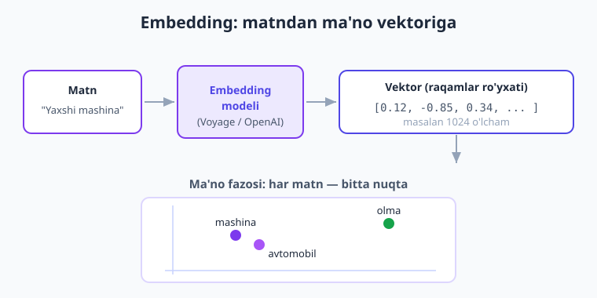
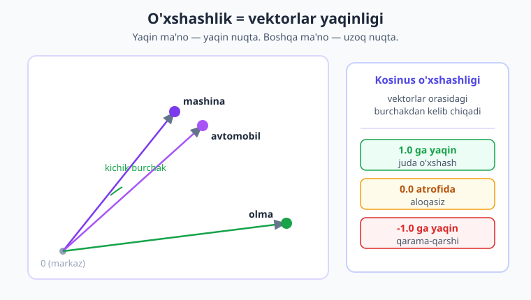
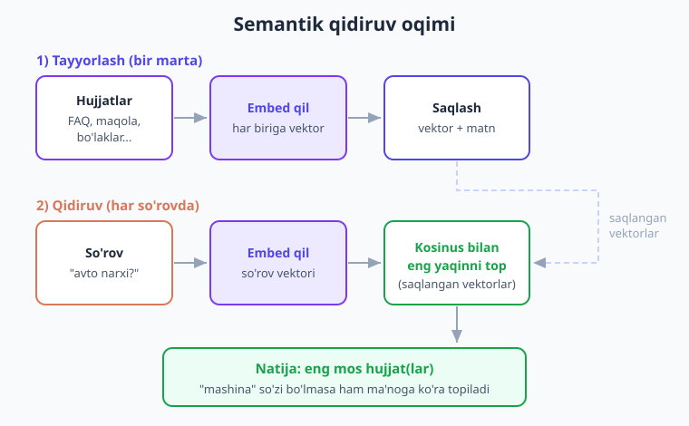

# 13 — Embedding va semantik qidiruv

[⬅️ Oldingi: 12 — MCP](./12-mcp.md) · [🏠 Kitob boshi](./README.md) · [Keyingi: 14 — Vektor bazalar ➡️](./14-vektor-bazalar.md)

> **Bu bobda:** "mashina" deb qidirgan odam "avtomobil" haqidagi maqolani topa olmasligi — oddiy kalit so'z qidiruvning eng katta kamchiligi. Biz **embedding** (matnni MA'NOsini ifodalovchi raqamlar vektoriga aylantirish) tushunchasini o'rganamiz, **kosinus o'xshashligi**ni PHP'da o'z qo'limiz bilan yozamiz, embeddingni qaysi provayderdan olishni ko'ramiz (**eslatma: Claude'da embedding endpoint YO'Q** — Voyage AI, OpenAI yoki lokal Ollama'dan olamiz), va vektor bazasiz, oddiy massivda ishlaydigan **semantik qidiruv** hamda FAQ qidiruv tizimini quramiz. Bu — keyingi boblardagi vektor baza (14) va RAG (15) ning poydevori.

---

## Muammo: kalit so'z qidiruv ma'noni tushunmaydi

Tasavvur qiling, kutubxonaga kirdingiz va kutubxonachiga aytdingiz: "Menga **mashina** haqida kitob kerak." Yaxshi kutubxonachi sizga avtomobillar, dvigatellar, hatto "avtotransport" haqidagi kitoblarni olib keladi — chunki u **ma'noni** tushunadi.

Endi tasavvur qiling, kutubxonachi o'rniga **so'zma-so'z izlovchi mashina** turibdi. U faqat muqovasida aniq "mashina" so'zi yozilgan kitoblarni topadi. "Avtomobil", "avtotransport", "yengil avto" — bularning hammasini u **chetga surib qo'yadi**, chunki ularda "mashina" so'zi yo'q.

Mana shu — odatdagi **kalit so'z qidiruv** (keyword search). SQL'dagi `LIKE '%mashina%'` yoki `MATCH ... AGAINST` aynan shunday ishlaydi: u **harflarni** taqqoslaydi, **ma'noni** emas.

```sql
-- Bu so'rov "avtomobil" so'zli qatorlarni TOPMAYDI
SELECT * FROM maqolalar WHERE matn LIKE '%mashina%';
```

Natija — foydalanuvchi izlagan narsasini topolmaydi, garchi javob ma'lumotlar bazasida **bor** bo'lsa ham. Muammoni sodda qilib shunday aytamiz: **lug'at mos kelmasa — qidiruv ishlamaydi.** Lekin odamlar bir narsani har xil so'z bilan ifodalaydi:

- "telefon o'chib qoldi" ↔ "smartfon zaryadi tugadi";
- "pul qaytarish" ↔ "to'lovni bekor qilish" ↔ "refund";
- "buyurtma qachon keladi" ↔ "yetkazib berish muddati".

Kalit so'z qidiruv bularni **boshqa-boshqa** narsa deb biladi. Bizga esa **ma'noga qarab** qidiruvchi tizim kerak. Aynan shuni **embedding** beradi.

!!! note "Eslatma"
    "Lug'at vs ma'no" muammosi — qidiruvning klassik dardi. Kalit so'z qidiruv tez va aniq (bir xil so'z bo'lsa), lekin u "mashina ≈ avtomobil" ekanini bilmaydi. Embedding esa aynan **ma'noni** o'lchaydi. Amalda ko'pincha ikkalasini **birga** ishlatishadi (gibrid qidiruv) — buni 14-bobda ko'ramiz.

---

## Embedding nima?

**Embedding** (o'qiladi: em-be-ding) — bu matnni **raqamlar ro'yxati**ga (vektorga) aylantirish, shunday qilib bu raqamlar matnning **ma'nosini** ifodalaydi.

Hayotiy o'xshatish bilan tushunamiz.

> **Hayotiy o'xshatish.** Tasavvur qiling, har bir so'zga **xaritadagi koordinata** (kenglik va uzunlik) beramiz. Yaqin ma'noli so'zlar — xaritada bir-biriga **yaqin** joylashadi. "Mashina" va "avtomobil" — qo'shni ko'chada; "olma" esa — butunlay boshqa shaharda. Endi "menga shu nuqtaga yaqin narsalarni top" desangiz, tizim ma'noga ko'ra topadi — xuddi xaritada eng yaqin do'konni topgandek.

Texnik ta'rif: embedding modeli matnni o'qiydi va uni **belgilangan o'lchamdagi** raqamlar vektoriga aylantiradi. Masalan, 1024 ta raqam:

```text
"Yaxshi mashina"  →  [0.12, -0.85, 0.34, 0.07, ..., -0.19]   (1024 ta raqam)
"Zo'r avtomobil"  →  [0.14, -0.81, 0.36, 0.05, ..., -0.21]   (juda yaqin raqamlar!)
"Shirin olma"     →  [-0.62, 0.40, -0.11, 0.88, ..., 0.33]   (butunlay boshqa)
```

E'tibor bering: "mashina" va "avtomobil" vektorlari bir-biriga **juda o'xshash**, "olma" esa **uzoq**. Mana shu butun fokusning siri: **yaqin ma'no → yaqin vektor.**



Bu raqamlar qayerdan keladi? Embedding modeli (alohida sun'iy intellekt modeli) millionlab matnda o'rganib, har matnga shunday koordinata beradiki, ma'no bo'yicha o'xshash matnlar yaqin tushadi. Biz buning **ichki ishini bilishimiz shart emas** — biz faqat "matn ber, vektor ol" deb ishlatamiz.

!!! tip "Maslahat"
    Embedding — bu LLM javobi (matn) EMAS. Bu — matnning **raqamli ifodasi**. Siz uni o'qib bo'lmaysiz (faqat raqamlar), lekin u bilan **hisob-kitob** qila olasiz: ikki vektor qanchalik yaqin ekanini o'lchash. Aynan shu — qidiruvning kaliti.

---

## Vektor va o'lcham

Yangi ikki atamani aniqlaymiz, chunki ular butun bob davomida uchraydi:

- **Vektor** (vector) — shunchaki **raqamlar ro'yxati** (PHP'da — `float` lar massivi: `[0.12, -0.85, 0.34, ...]`). Boshqa hech narsa emas.
- **O'lcham** (dimensions, qisqasi `dim`) — vektordagi raqamlar **soni**. Masalan, 1024 o'lchamli vektor — 1024 ta raqamdan iborat. Har bir embedding modeli o'z o'lchamiga ega (256, 512, 768, 1024, 1536, 3072 ...).

> **Hayotiy o'xshatish.** Xaritada nuqtani **2 ta** raqam belgilaydi: (kenglik, uzunlik) — bu 2 o'lchamli vektor. Endi tasavvur qiling, "ma'no xaritasi" 2 emas, **1024 o'lchamli** — ya'ni har nuqtani 1024 raqam belgilaydi. Buni ko'z bilan tasavvur qilib bo'lmaydi (biz 3 o'lchamgacha "ko'ramiz"), lekin matematika baribir ishlaydi: ikki nuqta orasidagi masofani hisoblay olamiz.

**O'xshashlik = yaqinlik.** Ikki matn qanchalik o'xshash bo'lsa, ularning vektorlari fazoda shunchalik yaqin turadi. "Qanchalik yaqin?" degan savolga raqamli javob beradigan o'lchov kerak — buni keyingi bo'limda ko'ramiz.

!!! warning "Ehtiyot bo'ling"
    Ikki vektorni faqat **bir xil model** bergan bo'lsa taqqoslash mumkin. Har model o'z "ma'no xaritasi"ni quradi — OpenAI vektori bilan Voyage vektorini taqqoslash mantiqsiz (turli o'lcham, turli fazo). Demak: **hujjatni va so'rovni doim bitta model bilan embed qiling.** Buni quyida yana ta'kidlaymiz.

---

## O'xshashlik o'lchovi: kosinus o'xshashligi

Ikki vektor qanchalik yaqinligini o'lchashning eng keng tarqalgan usuli — **kosinus o'xshashligi** (cosine similarity).

> **Hayotiy o'xshatish.** Markazda turibsiz va ikki do'stingiz turli tomonga qarab strelka (o'q) ko'rsatyapti. Agar ikkalasi deyarli **bir tomonga** qarasa — strelkalar orasidagi burchak kichik, ular "rozi". Agar har tomonga qarasa — burchak katta. Kosinus o'xshashligi aynan shu **burchak**ni o'lchaydi: vektorlar bir yo'nalishga qaratilganmi yoki yo'qmi.

Natija har doim **-1 dan +1 gacha** raqam bo'ladi:

| Qiymat | Ma'nosi |
|---|---|
| **1.0 ga yaqin** | Vektorlar bir yo'nalishda — matnlar **juda o'xshash** |
| **0.0 atrofida** | Vektorlar perpendikulyar — matnlar **aloqasiz** |
| **-1.0 ga yaqin** | Vektorlar qarama-qarshi — matnlar **zid** |



Amalda embedding vektorlari uchun deyarli har doim **0 dan 1 gacha** chiqadi: 0.9 — juda o'xshash, 0.3 — uncha o'xshamas. "Mashina" va "avtomobil" uchun, masalan, 0.85 chiqishi mumkin; "mashina" va "olma" uchun — 0.2.

### Kosinus o'xshashligini PHP'da yozish

Formulasi qo'rqitadi, lekin g'oyasi oddiy: **ikki vektorning nuqta ko'paytmasini ularning uzunliklari ko'paytmasiga bo'lamiz.** Buni uchta sodda qadamga ajratamiz: (1) mos raqamlarni ko'paytirib qo'shamiz, (2) har vektorning uzunligini topamiz, (3) bo'lamiz.

```php
<?php
/**
 * Ikki vektor orasidagi kosinus o'xshashligini hisoblaydi.
 * Natija: -1 (zid) ... 0 (aloqasiz) ... 1 (juda o'xshash).
 *
 * @param float[] $a Birinchi vektor
 * @param float[] $b Ikkinchi vektor (a bilan bir xil o'lchamda bo'lishi SHART)
 */
function kosinusOxshashlik(array $a, array $b): float
{
    if (count($a) !== count($b)) {
        throw new \InvalidArgumentException('Vektorlar bir xil o\'lchamda bo\'lishi kerak');
    }

    $nuqtaKopaytma = 0.0; // a va b ning mos raqamlari ko'paytmasi yig'indisi
    $uzunlikA = 0.0;      // a ning uzunligi (kvadrat)
    $uzunlikB = 0.0;      // b ning uzunligi (kvadrat)

    foreach ($a as $i => $qiymatA) {
        $qiymatB = $b[$i];
        $nuqtaKopaytma += $qiymatA * $qiymatB;
        $uzunlikA += $qiymatA * $qiymatA;
        $uzunlikB += $qiymatB * $qiymatB;
    }

    // Nol vektordan saqlanamiz (0 ga bo'lish xatosi)
    if ($uzunlikA == 0.0 || $uzunlikB == 0.0) {
        return 0.0;
    }

    return $nuqtaKopaytma / (sqrt($uzunlikA) * sqrt($uzunlikB));
}

// Sinab ko'ramiz (qo'lda yozilgan kichik vektorlar bilan)
$mashina   = [0.12, -0.85, 0.34];
$avtomobil = [0.14, -0.81, 0.36]; // mashinaga yaqin
$olma      = [-0.62, 0.40, -0.11]; // boshqa ma'no

echo kosinusOxshashlik($mashina, $avtomobil), "\n"; // ~0.99 — juda o'xshash
echo kosinusOxshashlik($mashina, $olma), "\n";      // manfiy/past — uzoq
```

Mana — semantik qidiruvning **yuragi** shu o'n qatorlik funksiya. Endi bizga faqat haqiqiy vektorlar kerak. Ularni qayerdan olamiz? Quyida ko'ramiz.

!!! note "Eslatma"
    Agar vektorlar oldindan **normallashtirilgan** bo'lsa (uzunligi 1 ga teng — ko'p model shunday qaytaradi), kosinus shunchaki **nuqta ko'paytmaga** soddalashadi. Biz universal bo'lsin uchun to'liq formulani qoldirdik — u har holatda to'g'ri ishlaydi.

---

## Embedding olish — Claude'da YO'Q, boshqa provayderdan olamiz

Endi eng muhim grounding faktini aniq aytamiz:

!!! danger "Muhim: Claude'da embedding endpoint yo'q"
    Anthropic'ning Claude modellari **matn yaratish** (chat, tool use, vision) uchun. Ularda **embedding endpoint YO'Q** — ya'ni Claude'dan "shu matnni vektorga aylantir" deb so'rab bo'lmaydi. Bu **xato emas, dizayn shunday.** Embedding uchun boshqa vositadan foydalanamiz.

Anthropic'ning o'zi embedding uchun quyidagilarni tavsiya qiladi:

1. **Voyage AI** — Anthropic rasman tavsiya etadigan embedding provayderi. Oddiy **HTTP API** (Guzzle/curl bilan chaqiramiz).
2. **OpenAI embeddings** — `openai-php/client` paketi orqali, `embeddings()->create([...])` metodi.
3. **Lokal (Ollama)** — kompyuteringizda ishlaydigan embedding modellari (masalan `nomic-embed-text`). Internet/pul kerak emas.
4. **PHP framework** — LLPhant yoki Neuron AI yuqoridagilarni **o'rab** beradi (17-bob).

> **Hayotiy o'xshatish.** Claude — zo'r **yozuvchi** (matn yozadi, savolga javob beradi). Embedding modeli esa — **arxivchi**: har hujjatga "kataloq raqami" (vektor) beradi, toki keyin tezda topish mumkin bo'lsin. Bular ikki xil ish; bittasi ikkinchisining o'rnini bosolmaydi. Shuning uchun ikki xil vositadan foydalanamiz.

### Variant A — Voyage AI (HTTP / Guzzle)

Voyage AI'ning rasmiy SDK'si PHP'da yo'q, lekin uning API'si oddiy HTTP `POST` — Guzzle bilan bemalol chaqiramiz. (Bu kitobda Guzzle allaqachon o'rnatilgan, 02-bobga qarang.)

```php
<?php
require __DIR__ . '/vendor/autoload.php';

use GuzzleHttp\Client as HttpClient;

/**
 * Matn(lar)ni Voyage AI HTTP API orqali embeddingga aylantiradi.
 * Bir nechta matnni BIRGA yuborish (batch) tez va arzon.
 *
 * @param string[] $matnlar Embedga aylantiriladigan matnlar
 * @return float[][]        Har matnga bitta vektor (float massivi)
 */
function voyageEmbed(array $matnlar): array
{
    $http = new HttpClient(['base_uri' => 'https://api.voyageai.com/']);

    // API kalitni MUHIT O'ZGARUVCHISIDAN olamiz — kodga YOZMAYMIZ!
    $kalit = getenv('VOYAGE_API_KEY');

    $javob = $http->post('v1/embeddings', [
        'headers' => [
            'Authorization' => 'Bearer ' . $kalit,
            'Content-Type'  => 'application/json',
        ],
        'json' => [
            'input' => $matnlar,
            // Model nomini sozlamadan olib qo'yamiz (versiyalar o'zgaradi):
            'model' => getenv('VOYAGE_EMBED_MODEL') ?: 'voyage-3',
        ],
    ]);

    $data = json_decode((string) $javob->getBody(), true);

    // Javob shakli: { "data": [ { "embedding": [...] }, ... ] }
    return array_map(fn(array $element) => $element['embedding'], $data['data']);
}

// Bitta matnni embed qilish — natija bitta vektor
[$vektor] = voyageEmbed(['Yaxshi mashina sotib oldim']);
echo 'O\'lcham: ', count($vektor), "\n"; // masalan 1024
```

!!! tip "Maslahat"
    Embedding modellarining aniq nomlari va o'lchamlari tez-tez yangilanadi. Shuning uchun model nomini **kodga qotirib yozmang** — `getenv('VOYAGE_EMBED_MODEL')` kabi sozlamadan oling. Bu kelajakda yangi modelga o'tishni bir qatorlik o'zgarishga aylantiradi.

### Variant B — OpenAI embeddings (`openai-php/client`)

OpenAI uchun tayyor PHP paketi bor — u embeddingni soddalashtiradi:

```bash
composer require openai-php/client
```

```php
<?php
require __DIR__ . '/vendor/autoload.php';

/**
 * Matn(lar)ni OpenAI embedding modeli orqali vektorga aylantiradi.
 *
 * @param string[] $matnlar
 * @return float[][]
 */
function openaiEmbed(array $matnlar): array
{
    // Kalit MUHIT O'ZGARUVCHISIDAN — kodga yozmaymiz!
    $client = \OpenAI::client(getenv('OPENAI_API_KEY'));

    $javob = $client->embeddings()->create([
        // Model nomini sozlamadan olamiz (text-embedding-3-* oilasi):
        'model' => getenv('OPENAI_EMBED_MODEL') ?: 'text-embedding-3-small',
        'input' => $matnlar,
    ]);

    // $javob->embeddings — har biri ->embedding (float massivi)
    return array_map(fn($e) => $e->embedding, $javob->embeddings);
}

[$vektor] = openaiEmbed(['Yaxshi mashina sotib oldim']);
echo 'O\'lcham: ', count($vektor), "\n";
```

### Variant C — Lokal (Ollama)

Agar internet/pul sarflamasdan, **o'z kompyuteringizda** embed qilmoqchi bo'lsangiz — Ollama (yoki LM Studio) o'rnatib, embedding modelini ishga tushirasiz. U ham oddiy HTTP API beradi (`localhost`):

```php
<?php
require __DIR__ . '/vendor/autoload.php';

use GuzzleHttp\Client as HttpClient;

/** Bitta matnni lokal Ollama embedding modeli orqali vektorga aylantiradi. */
function ollamaEmbed(string $matn): array
{
    $http = new HttpClient(['base_uri' => 'http://localhost:11434/']);

    $javob = $http->post('api/embeddings', [
        'json' => [
            'model'  => getenv('OLLAMA_EMBED_MODEL') ?: 'nomic-embed-text',
            'prompt' => $matn,
        ],
    ]);

    $data = json_decode((string) $javob->getBody(), true);
    return $data['embedding']; // float massivi
}
```

!!! info "Boshqa provayderda"
    Uchala variant ham bir xil g'oyani beradi: **matn kiritasiz — vektor olasiz.** Faqat chaqirish usuli farq qiladi. Shuning uchun amalda embeddingni **bitta funksiya** ortiga yashirish foydali (masalan `embed(array $matnlar): array`). Keyin Voyage/OpenAI/Ollama orasida o'tish — faqat shu funksiya ichidagi o'zgarish bo'ladi, qolgan kod tegmaydi. Bu "provayder-agnostik" yondashuv (17 va 19-boblarda batafsil).

---

## Semantik qidiruv g'oyasi

Embedding qo'limizda. Endi undan **qidiruv** quramiz. G'oya — to'rt qadam, va ularni ikki bosqichga ajratamiz:

**Tayyorlash (bir marta, oldindan):**

1. Barcha hujjatlarni (FAQ, maqola, mahsulot tavsifi...) **embed qilamiz** — har biriga vektor.
2. Vektorlarni matn bilan birga **saqlaymiz** (hozircha — oddiy massivda; keyin — vektor bazada, 14-bob).

**Qidiruv (har foydalanuvchi so'rovida):**

3. Foydalanuvchi so'rovini **embed qilamiz** — bitta so'rov vektori.
4. So'rov vektorini har bir saqlangan vektor bilan **kosinus orqali taqqoslaymiz** — eng yaqinini (yoki eng yaqin bir nechtasini) topamiz va qaytaramiz.



Diqqat qiling: tayyorlash **bir marta** bo'ladi (sekin/qimmat bo'lsa ham — bir martagina). Qidiruv esa **har so'rovda** sodir bo'ladi, lekin u faqat bitta embedding so'rovi + tez kosinus hisoblari — demak arzon va tez.

!!! note "Eslatma"
    Bu yerda biz vektorlarni oddiy PHP massivida saqlaymiz va har birini birma-bir taqqoslaymiz. Bu **o'nlab-yuzlab** hujjat uchun zo'r ishlaydi. Lekin minglab/millionlab hujjat bo'lsa — har so'rovda hammasini aylanib chiqish sekin bo'ladi. Shu yerda **vektor baza** kerak bo'ladi (tez yaqin-qidiruv uchun maxsus mo'ljallangan) — bu aynan **14-bob** mavzusi.

---

## Oddiy semantik qidiruv (vektor bazasiz, massivda)

Endi to'liq ishlaydigan misol yozamiz: bir nechta jumlani embed qilib saqlaymiz, so'ng so'rovga **eng o'xshashini** topamiz. Yuqoridagi `kosinusOxshashlik()` va `voyageEmbed()` (yoki istalgan `embed`) funksiyalaridan foydalanamiz.

```php
<?php
require __DIR__ . '/vendor/autoload.php';

// (kosinusOxshashlik va voyageEmbed funksiyalari yuqorida ta'riflangan deb olamiz)

// 1) TAYYORLASH — hujjatlarimiz (bilim bazasi)
$hujjatlar = [
    'Mashina haydash uchun haydovchilik guvohnomasi kerak.',
    'Olma va nok kabi mevalar vitaminga boy.',
    'Avtomobil dvigateli yoqilg\'ini harakatga aylantiradi.',
    'Pishloq sutdan tayyorlanadigan oziq-ovqat mahsuloti.',
];

// 2) Har bir hujjatni embed qilamiz (batch — birga yuboramiz, tez)
$hujjatVektorlari = voyageEmbed($hujjatlar);

// 3) QIDIRUV — foydalanuvchi so'rovi (diqqat: "avto" so'zi hujjatlarda YO'Q)
$sorov = 'Yengil avto qanday ishlaydi?';
[$sorovVektori] = voyageEmbed([$sorov]);

// 4) Har bir hujjat bilan o'xshashlikni hisoblaymiz
$natijalar = [];
foreach ($hujjatlar as $i => $hujjat) {
    $natijalar[] = [
        'matn'      => $hujjat,
        'oxshashlik' => kosinusOxshashlik($sorovVektori, $hujjatVektorlari[$i]),
    ];
}

// 5) O'xshashlik bo'yicha kamayish tartibida saralaymiz
usort($natijalar, fn($a, $b) => $b['oxshashlik'] <=> $a['oxshashlik']);

// 6) Eng yaxshi natijani ko'rsatamiz
echo "So'rov: {$sorov}\n\n";
foreach ($natijalar as $n) {
    printf("%.3f  %s\n", $n['oxshashlik'], $n['matn']);
}
```

Kutilgan natija — eng yuqorida **"Avtomobil dvigateli..."** jumlasi turadi, garchi so'rovda "avtomobil" emas, **"avto"** ishlatilgan bo'lsa ham. Kalit so'z qidiruv buni **topa olmas edi**; semantik qidiruv esa ma'noga qarab topdi. Mana embeddingning sehri.

!!! tip "Maslahat"
    Ko'pincha bizga faqat **eng yaqin bittasi** emas, **eng yaqin 3-5 tasi** kerak bo'ladi (top-K). Buning uchun saralangan massivdan `array_slice($natijalar, 0, 3)` bilan birinchi 3 tasini olasiz. RAG'da (15-bob) aynan shu "top-K eng mos bo'lak"ni Claude'ga kontekst sifatida beramiz.

---

## Embedding qayerda ishlatiladi?

Embedding faqat qidiruv uchun emas. Bir marta matnni "ma'no koordinatasi"ga aylantirib olsangiz, ko'p narsa imkonli bo'ladi:

- **Semantik qidiruv** — biz hozir qurganimiz: ma'noga qarab topish (so'z mos kelmasa ham).
- **RAG** (Retrieval-Augmented Generation) — eng mos hujjat bo'laklarini topib, ularni Claude'ga kontekst qilib berish, toki javob aniq va manbaga asoslangan bo'lsin (**15-bob** — butun bob shu haqda).
- **Klasterlash** (clustering) — o'xshash matnlarni guruhlarga ajratish (masalan, ming dona mijoz sharhini avtomatik mavzularga bo'lish).
- **Tavsiya** (recommendation) — "shunga o'xshash maqolalar/mahsulotlar" — foydalanuvchi ko'rgan narsaga yaqin vektorlarni ko'rsatish.
- **Dublikatlarni topish** — deyarli bir xil (lekin so'zlari boshqacha) yozuvlarni aniqlash (yuqori kosinus = ehtimol takror).
- **Klassifikatsiya** (classification) — yangi matnni qaysi toifaga tegishliligini topish (har toifaning "namuna" vektoriga eng yaqiniga qarab).

> **Hayotiy o'xshatish.** Embedding — bu matnlar uchun "manzil tizimi". Manzil bo'lgach, "yaqindagilarni top" (qidiruv), "shunga o'xshashni tavsiya qil", "bir mahallani guruhla" (klaster), "ikki bir xil manzilni aniqla" (dublikat) — hammasi oson bo'ladi. Hammasining negizida — bitta g'oya: **yaqin vektor = yaqin ma'no.**

---

## Amaliy maslahatlar

Embedding bilan ishlaganda quyidagilar xato qilmaslikka yordam beradi:

- **Bir xil model bilan embed qiling.** So'rovni va hujjatni **aynan bitta** model bilan vektorga aylantiring. Aks holda taqqoslash mantiqsiz (har model — boshqa fazo). Bu — eng ko'p qilinadigan xato.
- **Uzun matnni bo'laklang (chunking).** Embedding modellari cheklangan uzunlikni qabul qiladi va butun kitobni bitta vektorga "siqish" ma'noni yo'qotadi. Shuning uchun uzun hujjatni mantiqiy **bo'laklarga** (paragraf/bo'lim) ajratib, har bo'lakni alohida embed qiling. Chunking strategiyalari — **14 va 15-boblarda** batafsil.
- **Normalizatsiya haqida bilib qo'ying.** Ba'zi modellar normallashtirilgan (uzunligi 1) vektor qaytaradi — bunda kosinus = nuqta ko'paytma (tezroq). Bizning to'liq `kosinusOxshashlik()` ikkala holatda ham to'g'ri ishlaydi, demak xavotirsiz ishlatavering.
- **Narx — embedding arzon.** Embedding so'rovlari chat (matn yaratish) so'rovlaridan **ancha arzon**. Shu sabab minglab hujjatni embed qilish odatda byudjetga og'ir kelmaydi. Lekin baribir — hujjatlarni **bir marta** embed qilib, vektorlarni **saqlab** qo'ying (har safar qayta hisoblamang).
- **Vektorlarni saqlang, qayta hisoblamang.** Hujjat o'zgarmasa, uning vektori ham o'zgarmaydi. Bir marta hisoblab, faylga/bazaga yozib qo'ying. Faqat yangi/o'zgargan hujjatni qayta embed qiling.

!!! warning "Ehtiyot bo'ling"
    Hujjatlarni bir model bilan, so'rovni boshqa model bilan embed qilish — eng ko'p uchraydigan **jimgina xato**. Kod xato bermaydi, lekin natija bema'ni bo'ladi (hammasi past o'xshashlik). Agar qidiruv natijalari "g'alati" bo'lsa — birinchi navbatda **bir xil model ishlatilganini** tekshiring.

---

## To'liq misol: FAQ bo'yicha semantik qidiruv

Endi hammasini birlashtirib, amaliy bir narsa quramiz: **FAQ (tez-tez beriladigan savollar) bo'yicha qidiruv.** Foydalanuvchi savol yozadi (o'z so'zlari bilan), biz unga **eng mos FAQ yozuvini** topib beramiz — savol so'zlari aynan mos kelmasa ham.

Bu — qo'llab-quvvatlash bot/yordam markazlarining juda keng tarqalgan asosi. (Keyingi qadam — topilgan FAQ'ni Claude'ga berib, chiroyli javob yozdirish; bu — RAG, 15-bob.)

```php
<?php
require __DIR__ . '/vendor/autoload.php';

use GuzzleHttp\Client as HttpClient;

/** Kosinus o'xshashligi (yuqorida tushuntirilgan). */
function kosinusOxshashlik(array $a, array $b): float
{
    $nuqta = 0.0; $uzA = 0.0; $uzB = 0.0;
    foreach ($a as $i => $x) {
        $y = $b[$i];
        $nuqta += $x * $y;
        $uzA += $x * $x;
        $uzB += $y * $y;
    }
    if ($uzA == 0.0 || $uzB == 0.0) {
        return 0.0;
    }
    return $nuqta / (sqrt($uzA) * sqrt($uzB));
}

/** Matnlarni vektorga aylantiradi (Voyage AI HTTP API). */
function embed(array $matnlar): array
{
    $http = new HttpClient(['base_uri' => 'https://api.voyageai.com/']);
    $javob = $http->post('v1/embeddings', [
        'headers' => [
            'Authorization' => 'Bearer ' . getenv('VOYAGE_API_KEY'),
            'Content-Type'  => 'application/json',
        ],
        'json' => [
            'input' => $matnlar,
            'model' => getenv('VOYAGE_EMBED_MODEL') ?: 'voyage-3',
        ],
    ]);
    $data = json_decode((string) $javob->getBody(), true);
    return array_map(fn(array $e) => $e['embedding'], $data['data']);
}

/**
 * FAQ bo'yicha semantik qidiruvchi sodda klass.
 * Tayyorlashda FAQ savollarini embed qiladi; qidiruvda eng mosini topadi.
 */
final class FaqQidiruv
{
    /** @var float[][] Har FAQ savoliga mos vektor */
    private array $vektorlar = [];

    /**
     * @param array<int, array{savol: string, javob: string}> $faq
     */
    public function __construct(private readonly array $faq)
    {
        // Faqat SAVOLLARNI embed qilamiz (foydalanuvchi savol so'raydi)
        $savollar = array_map(fn($q) => $q['savol'], $faq);
        $this->vektorlar = embed($savollar);
    }

    /**
     * So'rovga eng mos FAQ yozuvlarini qaytaradi (top-K).
     *
     * @return array<int, array{savol: string, javob: string, oxshashlik: float}>
     */
    public function qidir(string $sorov, int $nechta = 3): array
    {
        // So'rovni embed qilamiz (FAQ bilan BIR XIL model orqali!)
        [$sorovVektori] = embed([$sorov]);

        $natijalar = [];
        foreach ($this->faq as $i => $yozuv) {
            $natijalar[] = [
                'savol'      => $yozuv['savol'],
                'javob'      => $yozuv['javob'],
                'oxshashlik' => kosinusOxshashlik($sorovVektori, $this->vektorlar[$i]),
            ];
        }

        // Kamayish tartibida saralab, eng yaxshi $nechta tasini olamiz
        usort($natijalar, fn($a, $b) => $b['oxshashlik'] <=> $a['oxshashlik']);
        return array_slice($natijalar, 0, $nechta);
    }
}

// --- Ishlatish ---
$faq = [
    ['savol' => 'Buyurtma qachon yetkaziladi?', 'javob' => 'Buyurtma 2-4 ish kunida yetkaziladi.'],
    ['savol' => 'To\'lovni qanday qaytaraman?',  'javob' => 'Profil > Buyurtmalar > Qaytarish tugmasi orqali.'],
    ['savol' => 'Parolni qanday tiklayman?',     'javob' => 'Kirish sahifasida "Parolni unutdim" havolasini bosing.'],
    ['savol' => 'Qaysi to\'lov usullari bor?',   'javob' => 'Karta, naqd va onlayn hamyonlar qabul qilinadi.'],
];

$qidiruv = new FaqQidiruv($faq);

// Foydalanuvchi BOSHQA so'zlar bilan so'raydi — "pulimni qaytarib oling"
$natija = $qidiruv->qidir('Pulimni qaytarib oling, mahsulot yoqmadi', nechta: 2);

foreach ($natija as $n) {
    printf("[%.3f] %s\n   -> %s\n\n", $n['oxshashlik'], $n['savol'], $n['javob']);
}
```

Foydalanuvchi "pulimni qaytarib oling" deb yozsa ham — tizim **"To'lovni qanday qaytaraman?"** yozuvini eng yuqoriga chiqaradi, garchi bir ham bir xil so'z ishlatilmagan bo'lsa. Bu — ma'no bo'yicha qidiruvning amaliy kuchi.

!!! example "Tekshirib ko'ring"
    `qidir()` ga ataylab FAQ'da umuman yo'q mavzudagi savol bering (masalan, "ob-havo qanday?"). Natijadagi eng yuqori o'xshashlik ham **past** (masalan 0.3 dan kichik) bo'lishini kuzating. Amalda bu foydali: agar eng yaxshi natija ham belgilangan **chegaradan past** bo'lsa, "Afsus, mos javob topilmadi" deb javob berish mumkin (xato top-K natija ko'rsatib qo'yishdan ko'ra yaxshi).

!!! note "Keyingi qadamlar"
    Bu misol vektorlarni **xotirada** (massivda) saqlaydi — har ishga tushganda qayta embed qilinadi. Real loyihada: (1) vektorlarni **bir marta** hisoblab, **vektor bazada** saqlaysiz (14-bob), (2) topilgan FAQ'ni Claude'ga berib, foydalanuvchi savoliga moslab **tabiiy javob** yozdirasiz (RAG, 15-bob). Mana shu ikki qadam — keyingi ikki bobning mavzusi.

---

## Xulosa

- **Kalit so'z qidiruv ma'noni tushunmaydi.** `LIKE`/`MATCH` faqat harflarni taqqoslaydi — "mashina" va "avtomobil"ni boshqa-boshqa deb biladi. Bu "lug'at vs ma'no" muammosi.
- **Embedding** — matnni **ma'nosini** ifodalovchi raqamlar vektoriga aylantirish. Yaqin ma'noli matnlar → yaqin vektorlar. Har matnga "ma'no fazosida koordinata" beramiz.
- **Vektor** — raqamlar ro'yxati; **o'lcham** — undagi raqamlar soni (masalan 1024). O'xshashlik = vektorlar yaqinligi.
- **Kosinus o'xshashligi** ikki vektor orasidagi burchakni o'lchaydi: 1.0 ga yaqin = juda o'xshash, 0 = aloqasiz. Uni PHP'da o'n qatorda yozdik.
- **Claude'da embedding endpoint YO'Q.** Embeddingni **Voyage AI** (HTTP/Guzzle — Anthropic tavsiyasi), **OpenAI** (`openai-php/client`) yoki **lokal Ollama** dan olamiz. Eng yaxshisi — bitta `embed()` funksiya ortiga yashirish.
- **Semantik qidiruv:** hujjatlarni embed qilib saqlash → so'rovni embed qilish → kosinus bilan eng yaqinini topish. O'nlab-yuzlab hujjat uchun oddiy massiv yetadi.
- **Asosiy maslahatlar:** so'rovni va hujjatni **bir xil model** bilan embed qiling; uzun matnni **bo'laklang** (chunking); vektorlarni **saqlang**, qayta hisoblamang; embedding **arzon**.
- **Qo'llanishi:** semantik qidiruv, RAG (15-bob), klasterlash, tavsiya, dublikat topish, klassifikatsiya. Hammasining negizida — "yaqin vektor = yaqin ma'no".

---

## Amaliy mashqlar

1. **Kosinus funksiyasi.** `kosinusOxshashlik()` ni qo'lda yozilgan kichik vektorlarda sinab ko'ring: `[1, 0, 0]` va `[1, 0, 0]` (kutiladi: 1.0), `[1, 0, 0]` va `[0, 1, 0]` (kutiladi: 0.0), `[1, 0]` va `[-1, 0]` (kutiladi: -1.0). Natijalar to'g'ri chiqdimi? Keyin har xil o'lchamdagi ikki vektor bering va xato (`InvalidArgumentException`) tashlanishini tekshiring.

2. **Embedding olish.** Yuqoridagi `voyageEmbed()` (yoki `openaiEmbed`) funksiyasini bitta `embed(array $matnlar): array` funksiyasiga "o'rab" yozing — ichida qaysi provayder ishlatilishini `getenv('EMBED_PROVAYDER')` ga qarab `match` bilan tanlasin. Maqsad: qolgan kod faqat `embed()` ni chaqirsin, provayder almashtirilsa boshqa joy o'zgarmasin.

3. **Massivda semantik qidiruv.** 5-6 ta turli mavzudagi jumla bering (sport, ovqat, texnika...). Ularni embed qilib saqlang. Keyin bitta so'rov bering va o'xshashlik bo'yicha **kamayish tartibida** chop eting. So'rov mavzusiga mos jumla eng yuqorida turibdimi — tekshiring. So'ng `array_slice` bilan faqat **top-3** ni ko'rsating.

4. **FAQ qidiruv + chegara.** `FaqQidiruv` klassiga `chegara` (masalan 0.5) parametrini qo'shing: agar eng yaxshi natijaning o'xshashligi chegaradan past bo'lsa, natija o'rniga "Mos javob topilmadi, operatorga ulaymizmi?" qaytarsin. Keyin FAQ'da bor savol va FAQ'da yo'q savol bilan sinab, ikki holatda turlicha javob chiqishini ko'ring.

5. **Dublikat topish.** 6-7 ta jumla bering, ulardan ikkitasi **bir xil ma'noda lekin boshqa so'zlar bilan** yozilgan bo'lsin ("buyurtma kechikdi" / "yetkazib berish kechikib qoldi"). Hammasini embed qilib, har juftlik orasidagi kosinusni hisoblang. O'xshashligi yuqori (masalan 0.85 dan katta) juftliklarni "ehtimoliy dublikat" deb chop eting.

---

[⬅️ Oldingi: 12 — MCP](./12-mcp.md) · [🏠 Kitob boshi](./README.md) · [Keyingi: 14 — Vektor bazalar ➡️](./14-vektor-bazalar.md)
