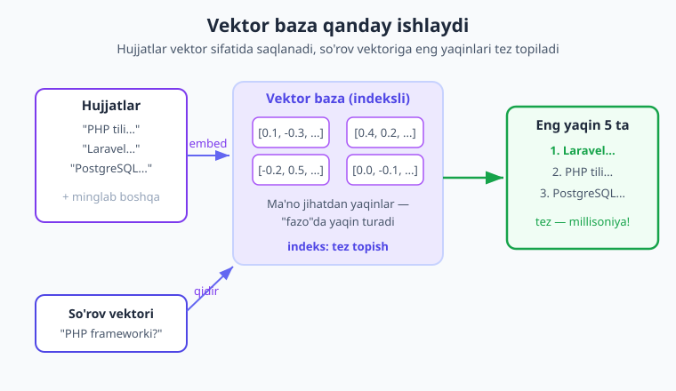
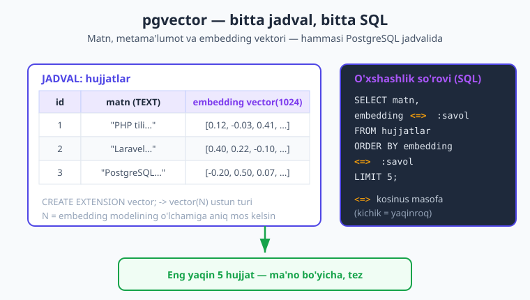
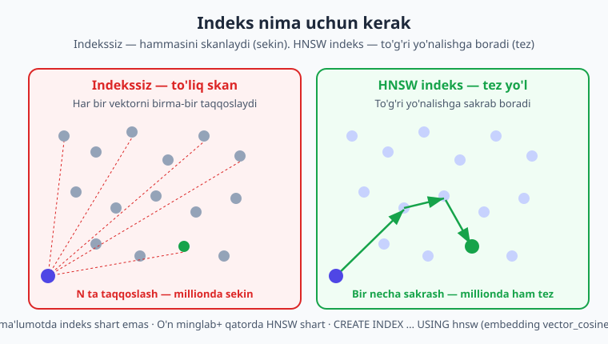

# 14 — Vektor bazalar

[⬅️ Oldingi: 13 — Embedding va semantik qidiruv](./13-embedding-semantik-qidiruv.md) · [🏠 Kitob boshi](./README.md) · [Keyingi: 15 — RAG ➡️](./15-rag.md)

> **Bu bobda:** 13-bobda biz matnni embedding (raqamlar vektori) ga aylantirib, ma'no bo'yicha qidirishni o'rgandik — lekin barcha vektorlarni PHP massivida saqlab, har birini birma-bir taqqoslagandik. Bu o'nlab hujjatda ishlaydi, ammo minglab/millionlab hujjatda **juda sekin** va xotiraga sig'maydi. Yechim — **vektor baza**: embeddinglarni saqlaydigan va eng yaqinlarini **tez** topadigan maxsus baza. Biz **pgvector** (PostgreSQL kengaytmasi) bilan jadval yaratamiz, vektorlarni PHP+PDO orqali saqlaymiz, `<=>` operatori bilan semantik qidiramiz, HNSW indeks bilan tezlashtirib, metama'lumot filtri bilan gibrid qidiruv quramiz — va oxirida to'liq "bilim bazasi" yozamiz.

---

## Nega bizga vektor baza kerak?

Eslang, 13-bobda biz nima qilgandik. Har bir hujjatni **embedding modeli** (Voyage/OpenAI/Ollama — 13-bob) yordamida **vektor** — ma'noni ifodalovchi raqamlar ro'yxati (masalan, 1024 ta raqam) — ga aylantirdik. Keyin foydalanuvchining savolini ham vektorga aylantirib, **kosinus o'xshashlik** bilan eng yaqin hujjatni topdik.

Bu yondashuv zo'r edi — lekin bitta katta muammosi bor. Biz hamma vektorlarni oddiy PHP **massivida** saqladik va qidiruvda **har bir** vektorni savol vektori bilan taqqosladik:

```php
// 13-bobdagi yondashuv (soddalashtirilgan)
$natijalar = [];
foreach ($hammaHujjatlar as $hujjat) {        // HAR hujjat bo'ylab...
    $oxshashlik = kosinus($savolVektori, $hujjat['vektor']); // ...har birini taqqoslaymiz
    $natijalar[] = ['matn' => $hujjat['matn'], 'ball' => $oxshashlik];
}
// keyin saralab, eng yaqin 5 tasini olamiz
```

10 ta hujjatda bu ko'z ochib yumguncha bajariladi. Lekin endi o'ylab ko'ring:

- **100 000 hujjat** bo'lsa-chi? Har savolda 100 000 ta taqqoslash — sekin.
- **1 000 000 hujjat** bo'lsa-chi? Hammasini xotiraga (RAM) yuklashning o'zi serverni qotiradi.
- Server **qayta ishga tushsa**, massiv yo'qoladi — embeddinglarni qaytadan hisoblash kerak (pul va vaqt).

Bu xuddi **katta kutubxonada kerakli kitobni topish** kabi. Agar kitoblar shunchaki uyib tashlangan bo'lsa, har safar **butun uyumni** birma-bir titkilashingizga to'g'ri keladi. Ammo aqlli kutubxonada kitoblar **mavzu bo'yicha** javonlarga joylangan — siz to'g'ri javonga borib, sekundlarda topasiz. **Vektor baza** — aynan shu "aqlli kutubxona": vektorlarni shunday tartibda saqlaydiki, savolga eng yaqinlarini hamma narsani titkilamasdan **tez** topadi.

> **Hayotiy o'xshatish.** Massivda qidirish — uydagi kitob uyumini varaqlash. Vektor baza — ma'no bo'yicha indekslangan kutubxona: to'g'ri javonga borasiz va darhol topasiz.

!!! note "Eslatma"
    Vektor baza ikki muammoni hal qiladi: (1) **doimiy saqlash** — embeddinglar diskda saqlanadi, server qayta ishga tushsa ham yo'qolmaydi; (2) **tez qidiruv** — maxsus indeks tufayli millionlab vektor ichidan ham eng yaqinlarini tez topadi.

---

## Vektor baza nima?

**Vektor baza** (vector database) — bu embeddinglarni (vektorlarni) saqlash va ular orasidan **o'xshashlik bo'yicha tez qidirish** uchun maxsus mo'ljallangan ma'lumotlar bazasi.

Oddiy bazada biz `WHERE narx = 100` yoki `WHERE ism = 'Ali'` kabi **aniq tenglik** bo'yicha qidiramiz. Vektor bazada esa savol boshqacha: *"berilgan vektorga **eng yaqin** vektorlarni topib ber"*. Bu — **yaqinlik qidiruvi** (similarity search), aniqrog'i **ANN** (Approximate Nearest Neighbor — taxminiy eng yaqin qo'shnilar).

!!! note "Eslatma"
    "Approximate" (taxminiy) so'ziga e'tibor bering. Katta bazada baza ba'zan **mutlaqo** eng yaqinini emas, **deyarli** eng yaqinini qaytaradi — buning evaziga qidiruv ming barobar tezlashadi. Amalda bu farq sezilmaydi: top-5 natija deyarli har doim to'g'ri keladi, lekin javob soniyalar emas, millisoniyalar ichida keladi.



Vektor baza ichida nima bo'lishini soddacha tasavvur qiling: har bir hujjat — ko'p o'lchovli "fazo"dagi bir nuqta. Ma'no jihatdan o'xshash hujjatlar bu fazoda **yaqin** turadi (13-bob). Savol kelganda, baza savol nuqtasiga eng yaqin nuqtalarni topadi — va buni butun fazoni tekshirmasdan, oldindan qurilgan **indeks** yordamida tez bajaradi.

---

## Qaysi vektor bazani tanlash?

Vektor saqlashning bir nechta yo'li bor. Mana asosiylari:

| Variant | Qisqacha | Kimga mos |
|---|---|---|
| **pgvector** | PostgreSQL'ning kengaytmasi — *mavjud* SQL bazangizga vektor qo'shadi | PHP loyihalar uchun **eng amaliy** — yangi server kerak emas |
| **Qdrant** | Vektorga ixtisoslashgan tez baza (Rust'da) | Juda katta hajm, ko'p qidiruv |
| **Pinecone** | Bulutli (managed) xizmat — siz server boshqarmaysiz | Tez boshlash, infratuzilma bilan shug'ullanmaslik |
| **Milvus** | Yirik miqyosli vektor baza | Millardlab vektor |
| **Weaviate** | Vektor + ma'lumot bazasi, GraphQL | Boy filtr/sxema |
| **Meilisearch** | Matn qidiruv + vektor (gibrid) | Sayt qidiruvi, kichik-o'rta loyiha |

Bu boblardan keyin siz hammasini o'rganmaysiz — biz **pgvector**'ga e'tibor qaratamiz. Nega aynan u?

- **Mavjud bazaga qo'shiladi.** Agar loyihangizda allaqachon PostgreSQL bor bo'lsa (PHP'da juda keng tarqalgan), siz **yangi server o'rnatmaysiz** — bitta `CREATE EXTENSION` yetadi.
- **Bitta baza, bitta SQL.** Hujjat matni, sanasi, kategoriyasi **va** vektori — hammasi bir jadvalda. Vektor qidiruvni oddiy `WHERE` filtri bilan birga, bitta SQL'da bajarasiz (bu — **gibrid qidiruv**, pastda ko'ramiz).
- **PHP bilan tabiiy.** PDO orqali to'g'ridan-to'g'ri ishlaydi — boshqa SDK yoki tarmoq xizmati shart emas.

!!! tip "Maslahat"
    Boshlash uchun deyarli har doim **pgvector**'dan boshlang. U yetarli ishlaganda murakkabroq (Qdrant, Pinecone) ga o'tasiz. "Eng oddiy yechimdan boshla, kerak bo'lganda murakkablashtir" — yaxshi muhandislik qoidasi. PostgreSQL asoslari bo'yicha `../db-dizayni/README.md` ga qarang.

!!! info "Boshqa provayderda"
    pgvector — provayderga bog'liq emas. Embeddingni Voyage, OpenAI yoki lokal model bilan hisoblashingiz mumkin (Claude'da embedding endpoint yo'q — 13-bob). Muhimi — vektor o'lchami (o'lchamlar soni) bazadagi ustun o'lchamiga **mos kelsin**. pgvector faqat raqamlarni saqlaydi — ular qaysi modeldan kelganini bilmaydi.

---

## pgvector'ni o'rnatish

pgvector — bu PostgreSQL'ga vektor turi va vektor operatorlarini qo'shadigan **kengaytma** (extension). U bazaga o'rnatilgandan keyin, qolgan ishni oddiy SQL bilan qilasiz.

Birinchi qadam — kengaytmani bazaga ulash. PostgreSQL'ga ulanib (masalan, `psql` yoki PHP orqali), bir marta quyidagini bajaring:

```sql
-- Bazaga vektor qo'llab-quvvatlashini qo'shamiz (bir marta)
CREATE EXTENSION IF NOT EXISTS vector;
```

`IF NOT EXISTS` — agar allaqachon o'rnatilgan bo'lsa, xato bermaydi. Shu bir qatordan keyin bazada `vector` degan yangi ustun turi paydo bo'ladi.

!!! note "Eslatma"
    `CREATE EXTENSION` ishlashi uchun pgvector serverda **o'rnatilgan** bo'lishi kerak. Bulutli PostgreSQL'larda (masalan, Supabase, Neon, AWS RDS) u odatda allaqachon mavjud — faqat yoqasiz. O'z serveringizda esa avval paketni o'rnatasiz (pgvector hujjatiga qarang). Bu — server sozlamasi, PHP kodi emas.

PHP tomonida ikki yo'l bor:

1. **To'g'ridan-to'g'ri SQL** (PDO bilan). Hech qanday qo'shimcha paket kerak emas — vektorni `'[1,2,3]'` ko'rinishidagi **matn** sifatida yuborasiz. Biz shu yondashuvni ishlatamiz, chunki u eng tushunarli va bog'liqliksiz.
2. **`pgvector/pgvector` Composer paketi** — vektor formatini avtomatik tayyorlaydigan kichik yordamchi:

```bash
# Ixtiyoriy yordamchi: vektorni qulay formatga o'tkazadi
composer require pgvector/pgvector
```

Bu paket vektorni qo'lda formatlash ishini biroz qisqartiradi, lekin **majburiy emas** — biz buni o'zimiz oson qilamiz. Avval to'g'ridan-to'g'ri SQL bilan ishni o'rganib olsangiz, paket "sehr"ga aylanmaydi.

---

## Jadval yaratish

Endi hujjatlarimizni saqlaydigan jadval yaratamiz. Unda uch narsa bo'ladi: hujjatning **raqami** (id), **matni**, va **embedding vektori**.

```sql
CREATE TABLE hujjatlar (
    id        BIGSERIAL PRIMARY KEY,   -- avtomatik o'suvchi raqam
    matn      TEXT NOT NULL,           -- hujjat matni (asl)
    embedding vector(1024)             -- embedding vektori (1024 o'lcham)
);
```

E'tibor bering: `vector(1024)` — bu pgvector qo'shgan yangi ustun turi. Qavs ichidagi **1024** — vektordagi raqamlar soni (o'lchamlar soni). Bu raqam embedding modelingiz qaysi o'lcham qaytarsa, **shunga teng** bo'lishi shart.

!!! warning "Ehtiyot bo'ling"
    `vector(N)` dagi **N — embedding modelingizning o'lchamiga aniq mos kelishi kerak**. Agar modelingiz 1536 o'lchovli vektor qaytarsa, lekin ustun `vector(1024)` bo'lsa, baza vektorni saqlashda **xato** beradi. O'lchamni modelingiz hujjatidan tekshiring (13-bob). Modelni o'zgartirsangiz (boshqa o'lcham), jadvalni ham qayta qurish kerak — chunki turli modellarning vektorlarini taqqoslab bo'lmaydi.

!!! tip "Maslahat"
    Bu yerda 1024 — shunchaki misol. Asl o'lchamni embedding modelingizdan oling va kod bo'ylab bir joyda **konstanta** sifatida saqlang (masalan, `const VEKTOR_OLCHAM = 1024;`), shunda kelajakda o'zgartirish oson bo'ladi.

---

## Vektorni saqlash (PHP + PDO)

Endi PHP'dan bazaga ulanib, hujjat saqlaymiz. Jarayon ikki bosqich: (1) hujjat matnini **embedding**ga aylantiramiz (13-bobdagidek), (2) matn va vektorni `INSERT` bilan bazaga yozamiz.

Avval PDO bilan PostgreSQL'ga ulanamiz. Ulanish ma'lumotlarini — xuddi API kalitidek — **kodga yozmaymiz**, muhit o'zgaruvchisidan olamiz:

```php
<?php
// Bazaga ulanish ma'lumotlari — muhit o'zgaruvchisidan (kodga yozmaymiz!)
$host = getenv('PG_HOST') ?: '127.0.0.1';
$port = getenv('PG_PORT') ?: '5432';
$db   = getenv('PG_DB')   ?: 'bilim_bazasi';
$user = getenv('PG_USER') ?: 'postgres';
$pass = getenv('PG_PASS') ?: '';

// PostgreSQL uchun DSN (ulanish satri)
$dsn = "pgsql:host={$host};port={$port};dbname={$db}";

$pdo = new PDO($dsn, $user, $pass, [
    PDO::ATTR_ERRMODE => PDO::ERRMODE_EXCEPTION,   // xatolarni istisno qilib tashlasin
]);
```

`PDO::ERRMODE_EXCEPTION` — bazada xato bo'lsa, PDO uni **istisno** (exception) sifatida tashlaydi, biz uni `try/catch` bilan ushlaymiz (8-bobdagi printsip).

Vektorni saqlash uchun bizga embedding kerak. Quyida embeddingni **olib beradigan** kichik yordamchi funksiya — bu 13-bobdagi mantiqning soddalashtirilgan ko'rinishi (modeldan vektor olib qaytaradi):

```php
<?php
require __DIR__ . '/vendor/autoload.php';

/**
 * Matnni embedding (float lar massivi) ga aylantiradi.
 * 13-bobdagi `embed()` (Voyage/OpenAI/Ollama) ni chaqiradi.
 *
 * @return float[]  Vektor (masalan, 1024 ta raqam)
 */
function embeddingOl(string $matn): array
{
    // 13-bobdagi embed() matnlar MASSIVINI olib, vektorlar massivini qaytaradi.
    // Bitta matn uchun massivga o'rab, birinchi vektorni olamiz.
    // (Eslatma: Claude'da embedding endpoint yo'q — embedding 13-bobda
    //  Voyage/OpenAI/Ollama dan olinadi.)
    return embed([$matn])[0]; // 13-bobdagi funksiya
}
```

Endi eng muhim qism: vektorni bazaga yozish. pgvector vektorni `'[1,2,3]'` ko'rinishidagi **matn** sifatida qabul qiladi — ya'ni kvadrat qavs ichida vergul bilan ajratilgan raqamlar. PHP massivini shu formatga o'tkazadigan kichik funksiya yozamiz:

```php
<?php
/**
 * PHP float massivini pgvector matn formatiga o'tkazadi: [1,2,3] -> "[1,2,3]".
 *
 * @param float[] $vektor
 */
function vektorniMatnga(array $vektor): string
{
    // Vergul bilan birlashtirib, kvadrat qavsga olamiz
    return '[' . implode(',', $vektor) . ']';
}
```

!!! note "Eslatma"
    Aynan shu formatlashni `pgvector/pgvector` paketi avtomatik qiladi. Lekin ko'rib turibsiz — bu atigi bir qator. Shuning uchun biz uni o'zimiz qilamiz: "sehr" yo'q, hammasi tushunarli.

Endi hammasini birlashtirib, hujjatni saqlaymiz. **Prepared statement** (tayyorlangan so'rov) ishlatamiz — bu SQL ineksiyadan himoya qiladi (qiymatlarni SQL'ga to'g'ridan-to'g'ri yopishtirmaymiz):

```php
<?php
/**
 * Bitta hujjatni embedding bilan birga bazaga saqlaydi.
 */
function hujjatSaqla(PDO $pdo, string $matn): void
{
    // 1) Matnni vektorga aylantiramiz
    $vektor = embeddingOl($matn);

    // 2) Vektorni pgvector formatiga o'tkazamiz
    $vektorMatn = vektorniMatnga($vektor);

    // 3) Prepared statement bilan saqlaymiz (SQL ineksiyadan himoya)
    $stmt = $pdo->prepare(
        'INSERT INTO hujjatlar (matn, embedding) VALUES (:matn, :embedding)'
    );
    $stmt->execute([
        ':matn'      => $matn,
        ':embedding' => $vektorMatn,   // "[0.12,-0.03,...]" matn sifatida
    ]);
}
```

Mana shunday — bir nechta hujjatni navbatma-navbat saqlaymiz:

```php
<?php
$hujjatlar = [
    'PHP — server tomonda ishlovchi mashhur dasturlash tili.',
    'Laravel — PHP uchun eng ommabop framework.',
    'PostgreSQL — kuchli, ochiq kodli relyatsion ma\'lumotlar bazasi.',
    'pgvector — PostgreSQL\'ga vektor qidiruvini qo\'shadigan kengaytma.',
];

foreach ($hujjatlar as $hujjat) {
    hujjatSaqla($pdo, $hujjat);
    echo "Saqlandi: {$hujjat}\n";
}
```

!!! warning "Ehtiyot bo'ling"
    Vektorni **hech qachon** SQL satriga to'g'ridan-to'g'ri yopishtirmang (`"... VALUES ('{$vektorMatn}')"`). Doim **prepared statement** (`:embedding` placeholder) ishlating — bu SQL ineksiyaning oldini oladi. Bu qoida vektor bo'lsin, oddiy matn bo'lsin — hammasiga taalluqli.

---

## O'xshashlik qidiruvi (SQL)

Endi eng qizig'i — **semantik qidiruv**. Savolni vektorga aylantirib, bazadan unga **eng yaqin** hujjatlarni so'raymiz. pgvector buni maxsus **masofa operatorlari** bilan beradi:

| Operator | Nomi | Ma'nosi | Qachon |
|---|---|---|---|
| `<=>` | **Kosinus masofa** | Yo'nalish (burchak) farqi | **Embedding uchun eng ko'p ishlatiladi** |
| `<->` | Evklid masofa (L2) | To'g'ri chiziqli masofa | Geometrik yaqinlik kerak bo'lsa |
| `<#>` | Ichki ko'paytma (manfiy) | Skalar ko'paytma | Ba'zi modellar uchun |

Eng kichik masofa — eng yaqin (eng o'xshash) degani. Shuning uchun natijalarni masofa bo'yicha **o'sish tartibida** (`ORDER BY ... ASC`) saralab, eng yaqin bir nechtasini olamiz.

> **Hayotiy o'xshatish.** `<=>` (kosinus masofa) — ikki o'q nuqtagan **yo'nalishi** qanchalik farq qiladi degani, ularning uzunligi emas. Embedding uchun aynan **ma'no yo'nalishi** muhim, shuning uchun kosinus eng mos keladi (13-bob).



Mana qidiruv SQL'i. `:savol` — bu savol vektori (yana matn formatida), `embedding <=> :savol` — har bir hujjatning savolga **masofasi**:

```sql
SELECT
    id,
    matn,
    embedding <=> :savol AS masofa   -- kosinus masofa (kichik = yaqin)
FROM hujjatlar
ORDER BY embedding <=> :savol        -- eng yaqindan boshlab saralash
LIMIT 5;                             -- faqat eng yaqin 5 tasi
```

Endi buni PHP'da to'liq bajaramiz. Jarayon: (1) savolni vektorga aylantiramiz, (2) so'rovni yuboramiz, (3) natijalarni o'qiymiz:

```php
<?php
/**
 * Savolga ma'no jihatdan eng yaqin hujjatlarni topadi.
 *
 * @return array<int, array{matn: string, masofa: float}>
 */
function semantikQidiruv(PDO $pdo, string $savol, int $necha = 5): array
{
    // 1) Savolni vektorga aylantiramiz
    $savolVektori = vektorniMatnga(embeddingOl($savol));

    // 2) Eng yaqin hujjatlarni so'raymiz (kosinus masofa <=>)
    $stmt = $pdo->prepare(
        'SELECT matn, embedding <=> :savol AS masofa
         FROM hujjatlar
         ORDER BY embedding <=> :savol
         LIMIT :necha'
    );
    // LIMIT uchun butun son sifatida bog'laymiz
    $stmt->bindValue(':savol', $savolVektori);
    $stmt->bindValue(':necha', $necha, PDO::PARAM_INT);
    $stmt->execute();

    // 3) Natijalarni qaytaramiz
    return $stmt->fetchAll(PDO::FETCH_ASSOC);
}
```

E'tibor bering: `:savol` ikki marta ishlatilgan (`SELECT` da ham, `ORDER BY` da ham), lekin biz uni **bir marta** bog'ladik (`bindValue`). PostgreSQL nomli parametrning takror ishlatilishiga ruxsat beradi — qulay.

Ishlatish — sodda:

```php
<?php
$natijalar = semantikQidiruv($pdo, 'PHP frameworki qaysi?');

foreach ($natijalar as $n) {
    // masofa kichik bo'lsa — yaqinroq (o'xshashroq)
    printf("[%.4f] %s\n", $n['masofa'], $n['matn']);
}
// Kutilgan natija: "Laravel — PHP uchun eng ommabop framework." eng yuqorida
// (kalit so'z bo'lmasa ham — ma'no bo'yicha topadi!)
```

Diqqat qiling — savolda "Laravel" so'zi **yo'q**, lekin baza uni topadi. Chunki qidiruv kalit so'z bo'yicha emas, **ma'no** bo'yicha (13-bob). Bu — semantik qidiruvning kuchi.

!!! tip "Maslahat"
    Agar **masofa** o'rniga **o'xshashlik** (1 = bir xil, 0 = umuman boshqa) kerak bo'lsa, kosinus uchun: `o'xshashlik = 1 - masofa`. Ya'ni `SELECT 1 - (embedding <=> :savol) AS oxshashlik`. Bu ko'pincha foydalanuvchiga ko'rsatishga qulayroq (foiz sifatida).

!!! question "Tekshirib ko'ring"
    Nega `ORDER BY embedding <=> :savol` da `ASC` (o'sish) ishlatamiz? Chunki `<=>` **masofa** qaytaradi — kichik masofa = yaqin. Eng yaqinni birinchi ko'rsatish uchun kichikdan kattaga saralaymiz (ASC — standart). Agar `1 - masofa` (o'xshashlik) ishlatsangiz, aksincha `DESC` kerak bo'lardi.

---

## Indeks — qidiruvni tezlashtirish

Yuqoridagi so'rov ishlaydi, lekin bir nozik joyi bor. Indekssiz, pgvector har savolda **butun jadvalni** skanlab, har bir qatorning masofasini hisoblaydi (bu — "ketma-ket skan"). Bir necha ming qatorda bu tez. Lekin yuz minglab/millionlab qatorda — **sekin**.

Yechim — **indeks**. Indeks vektorlarni shunday tartibga soladiki, baza hammasini tekshirmasdan, faqat **ehtimoliy yaqin** vektorlarni ko'radi. Bu — o'sha "kitoblarni javonga joylash" g'oyasi, faqat avtomatik.



pgvector ikki turdagi indeksni qo'llaydi:

- **HNSW** (Hierarchical Navigable Small World) — eng tez va aniq, lekin ko'proq xotira/qurish vaqti talab qiladi. **Ko'pincha tavsiya etiladi.**
- **IVFFlat** — kamroq xotira, lekin avval ma'lum miqdor ma'lumot kerak (o'qib, "klaster"larga bo'ladi). Juda katta, kam o'zgaruvchi ma'lumotda.

HNSW indeks yaratish — bitta SQL. **Muhim:** indeks qaysi masofa operatori uchun ekanini ko'rsatish kerak. Biz `<=>` (kosinus) ishlatamiz, demak `vector_cosine_ops`:

```sql
-- Kosinus masofa (<=>) uchun HNSW indeks
CREATE INDEX ON hujjatlar
USING hnsw (embedding vector_cosine_ops);
```

Shu indeksdan keyin yuqoridagi `ORDER BY embedding <=> :savol LIMIT 5` so'rovi **avtomatik** indeksdan foydalanadi — kodni o'zgartirish shart emas. PostgreSQL'ning o'zi indeksdan foydalanishni hal qiladi.

!!! note "Eslatma"
    Har masofa operatorining **o'z** indeks turi bor: kosinus uchun `vector_cosine_ops`, evklid (`<->`) uchun `vector_l2_ops`, ichki ko'paytma (`<#>`) uchun `vector_ip_ops`. Indeks operatori so'rovdagi operatorga **mos** bo'lishi shart — aks holda indeks ishlatilmaydi.

### Qachon indeks kerak?

- **Kam ma'lumot (bir necha ming qatorgacha):** indeks shart emas. To'liq skan ham yetarli tez, hatto aniqroq (taxminiy emas).
- **Ko'p ma'lumot (o'n minglab+):** indeks **shart**. Usiz har savol sekinlashadi.

!!! tip "Maslahat"
    Indeksni odatda **ma'lumotni yuklab bo'lgach** quring (bo'sh jadvalga emas) — bu tezroq quriladi va sifatliroq bo'ladi. Avval barcha hujjatlarni `INSERT` qiling, keyin `CREATE INDEX`. Yangi qatorlar qo'shilganda indeks avtomatik yangilanadi.

!!! warning "Ehtiyot bo'ling"
    HNSW indeks **taxminiy** (approximate) natija beradi — ya'ni juda kamdan-kam holda eng yaqin qatorni o'tkazib yuborishi mumkin. Aksariyat ilovalar (qidiruv, RAG) uchun bu mutlaqo muammosiz. Agar 100% aniq natija shart bo'lsa (kichik baza), indekssiz to'liq skan ishlating.

---

## Metama'lumot va gibrid qidiruv

Endi pgvector'ning eng kuchli tomoni. Hujjat faqat matn va vektordan iborat emas — unda **metama'lumot** ham bo'ladi: kategoriya, sana, muallif, til va h.k. pgvector hammasini **bir jadvalda** saqlagani uchun, oddiy `WHERE` filtrini vektor qidiruv bilan **birga** ishlatishingiz mumkin. Bu — **gibrid qidiruv**.

> **Hayotiy o'xshatish.** Kutubxonachiga: "menga *bolalar* bo'limidan, *2020-yildan keyin* chiqqan, *kosmos* haqidagi kitob kerak" deysiz. "Kosmos haqida" — ma'no qidiruvi (vektor). "Bolalar bo'limi" va "2020-yildan keyin" — aniq filtr (`WHERE`). Gibrid qidiruv ikkalasini birlashtiradi.

Avval jadvalga metama'lumot ustunlarini qo'shamiz:

```sql
CREATE TABLE hujjatlar (
    id         BIGSERIAL PRIMARY KEY,
    matn       TEXT NOT NULL,
    kategoriya TEXT,                 -- masalan: 'texnologiya', 'biznes'
    sana       DATE,                 -- hujjat sanasi
    embedding  vector(1024)
);
```

Endi qidiruvda **avval** oddiy filtr (`WHERE kategoriya = ...`), keyin qolganlar ichidan vektor bo'yicha eng yaqinlar:

```sql
SELECT matn, embedding <=> :savol AS masofa
FROM hujjatlar
WHERE kategoriya = :kategoriya          -- avval filtr
  AND sana >= :sanadan
ORDER BY embedding <=> :savol           -- keyin ma'no bo'yicha saralash
LIMIT 5;
```

PHP'da to'liq:

```php
<?php
/**
 * Gibrid qidiruv: kategoriya/sana filtri + ma'no (vektor) bo'yicha saralash.
 *
 * @return array<int, array{matn: string, masofa: float}>
 */
function gibridQidiruv(
    PDO $pdo,
    string $savol,
    string $kategoriya,
    string $sanadan,
    int $necha = 5
): array {
    $savolVektori = vektorniMatnga(embeddingOl($savol));

    $stmt = $pdo->prepare(
        'SELECT matn, embedding <=> :savol AS masofa
         FROM hujjatlar
         WHERE kategoriya = :kategoriya
           AND sana >= :sanadan
         ORDER BY embedding <=> :savol
         LIMIT :necha'
    );
    $stmt->bindValue(':savol', $savolVektori);
    $stmt->bindValue(':kategoriya', $kategoriya);
    $stmt->bindValue(':sanadan', $sanadan);
    $stmt->bindValue(':necha', $necha, PDO::PARAM_INT);
    $stmt->execute();

    return $stmt->fetchAll(PDO::FETCH_ASSOC);
}

// Ishlatish: faqat 'texnologiya' bo'limidan, 2024-yildan keyingilar ichidan
$natijalar = gibridQidiruv(
    $pdo,
    savol: 'sun\'iy intellekt qanday ishlaydi?',
    kategoriya: 'texnologiya',
    sanadan: '2024-01-01',
);
```

Gibrid qidiruv juda amaliy: foydalanuvchiga faqat **uning tiliga**, **uning bo'limiga** yoki **so'nggi** hujjatlarga mos natijani berasiz — ma'noni saqlagan holda.

!!! tip "Maslahat"
    Filtr juda tor bo'lsa (masalan, `WHERE kategoriya = 'kam-uchraydigan'`) va indeks bilan birga ishlatilsa, ba'zan natija kamayib qolishi mumkin (HNSW filtrdan keyin yetarli nomzod topa olmasligi mumkin). Bunday hollarda `LIMIT` ni kattaroq qo'yib, keyin PHP'da kesish yoki PostgreSQL/pgvector versiyangiz hujjatidagi filtrlash maslahatlarini ko'ring.

---

## Qachon vektor baza kerak (va qachon kerak emas)?

Har bir vosita o'z o'rnida foydali. Vektor baza ham har joyda emas.

**Vektor baza KERAK:**

- Ko'p hujjat bor (yuzlab, minglab, undan ko'p);
- **Semantik qidiruv** kerak (ma'no bo'yicha, kalit so'z emas);
- **RAG** quryapsiz (15-bob) — modelga tegishli hujjatlarni topib berish;
- Embeddinglar **doimiy** saqlanishi kerak (server qayta ishga tushganda yo'qolmasin);
- Qidiruv **tez** bo'lishi shart (foydalanuvchi kutmasin).

**Vektor baza KERAK EMAS:**

- Ma'lumot **oz** (o'nlab hujjat) — 13-bobdagi oddiy massiv qidiruvi yetarli;
- Embedding bir martalik, saqlanmaydi;
- Qidiruv **aniq tenglik/kalit so'z** bo'yicha (oddiy `WHERE` yoki `LIKE` yetadi);
- Prototip/o'rganish bosqichi — avval massivda sinab ko'ring, keyin kerak bo'lsa pgvector'ga o'ting.

!!! note "Eslatma"
    "Kichikdan boshla" qoidasi. O'nlab hujjatda massiv qidiruvi (13-bob) bilan boshlang — sodda va bog'liqliksiz. Hujjatlar soni o'sib, qidiruv sekinlashganda yoki saqlash kerak bo'lganda, pgvector'ga o'ting. Vaqtidan oldin murakkablashtirmang.

---

## To'liq misol: "bilim bazasi"

Endi hamma narsani bitta amaliy misolga jamlaymiz — kichik **bilim bazasi**. Bu klass: (1) jadval va indeksni tayyorlaydi, (2) hujjat qo'shadi, (3) semantik qidiradi. Bu — 15-bobdagi RAG ning poydevori.

```php
<?php
require __DIR__ . '/vendor/autoload.php';

/**
 * pgvector asosidagi sodda bilim bazasi.
 * Hujjatlarni embedding bilan saqlaydi va ma'no bo'yicha qidiradi.
 */
final class BilimBazasi
{
    public function __construct(
        private readonly PDO $pdo,
        private readonly int $olcham = 1024,   // embedding o'lchami
    ) {}

    /**
     * Jadval va kengaytmani tayyorlaydi (bir marta chaqiriladi).
     */
    public function tayyorla(): void
    {
        // Kengaytmani yoqamiz (bir marta)
        $this->pdo->exec('CREATE EXTENSION IF NOT EXISTS vector');

        // Jadval (matn + metama'lumot + vektor)
        $this->pdo->exec(
            "CREATE TABLE IF NOT EXISTS bilim (
                id         BIGSERIAL PRIMARY KEY,
                matn       TEXT NOT NULL,
                kategoriya TEXT,
                embedding  vector({$this->olcham})
            )"
        );

        // HNSW indeks (kosinus masofa uchun)
        $this->pdo->exec(
            'CREATE INDEX IF NOT EXISTS bilim_embedding_idx
             ON bilim USING hnsw (embedding vector_cosine_ops)'
        );
    }

    /**
     * Hujjatni embedding bilan birga qo'shadi.
     */
    public function qosh(string $matn, ?string $kategoriya = null): void
    {
        $vektor = vektorniMatnga($this->embedding($matn));

        $stmt = $this->pdo->prepare(
            'INSERT INTO bilim (matn, kategoriya, embedding)
             VALUES (:matn, :kategoriya, :embedding)'
        );
        $stmt->execute([
            ':matn'       => $matn,
            ':kategoriya' => $kategoriya,
            ':embedding'  => $vektor,
        ]);
    }

    /**
     * Savolga ma'no jihatdan eng yaqin hujjatlarni qaytaradi.
     * Ixtiyoriy kategoriya filtri bilan (gibrid qidiruv).
     *
     * @return array<int, array{matn: string, oxshashlik: float}>
     */
    public function qidir(string $savol, int $necha = 5, ?string $kategoriya = null): array
    {
        $savolVektori = vektorniMatnga($this->embedding($savol));

        // 1 - masofa = o'xshashlik (foydalanuvchiga qulayroq)
        $sql = 'SELECT matn, 1 - (embedding <=> :savol) AS oxshashlik
                FROM bilim';
        if ($kategoriya !== null) {
            $sql .= ' WHERE kategoriya = :kategoriya';
        }
        $sql .= ' ORDER BY embedding <=> :savol LIMIT :necha';

        $stmt = $this->pdo->prepare($sql);
        $stmt->bindValue(':savol', $savolVektori);
        if ($kategoriya !== null) {
            $stmt->bindValue(':kategoriya', $kategoriya);
        }
        $stmt->bindValue(':necha', $necha, PDO::PARAM_INT);
        $stmt->execute();

        return $stmt->fetchAll(PDO::FETCH_ASSOC);
    }

    /**
     * Matnni vektorga aylantiradi (13-bobdagi embedding mantiqi).
     *
     * @return float[]
     */
    private function embedding(string $matn): array
    {
        // 13-bobdagi embed() — matnlar massivini olib, vektorlar massivini
        // qaytaradi (Voyage/OpenAI/Ollama). Bitta matn uchun [0] ni olamiz.
        return embed([$matn])[0];
    }
}
```

Ishlatish — toza va sodda:

```php
<?php
$pdo = new PDO(
    'pgsql:host=127.0.0.1;port=5432;dbname=bilim_bazasi',
    getenv('PG_USER') ?: 'postgres',
    getenv('PG_PASS') ?: '',
    [PDO::ATTR_ERRMODE => PDO::ERRMODE_EXCEPTION],
);

$baza = new BilimBazasi($pdo);
$baza->tayyorla();   // jadval + indeks (bir marta)

// Bilim qo'shamiz
$baza->qosh('PHP — server tomonda ishlovchi dasturlash tili.', 'texnologiya');
$baza->qosh('Laravel — PHP uchun eng ommabop framework.', 'texnologiya');
$baza->qosh('Plov — o\'zbek milliy taomi.', 'oshxona');

// Ma'no bo'yicha qidiramiz
$natijalar = $baza->qidir('PHP frameworki haqida ayt', necha: 3);

foreach ($natijalar as $n) {
    printf("[%.1f%%] %s\n", $n['oxshashlik'] * 100, $n['matn']);
}
// Eng yuqorida "Laravel ..." chiqadi — kalit so'z mos kelmasa ham, ma'no mos!
```

Mana shu — **doimiy**, **tez** va **gibrid filtr**li bilim bazasi. 15-bobda biz buni RAG bilan bog'laymiz: foydalanuvchi savol berganda, baza tegishli hujjatlarni topadi, ularni Claude'ga **kontekst** sifatida beramiz, va model **aniq, manbaga asoslangan** javob beradi.

!!! info "Boshqa provayderda"
    Bu klassda bazaga bog'liq qism (pgvector) provayderdan **mustaqil**. Embeddingni Voyage o'rniga OpenAI yoki lokal model bilan hisoblasangiz ham, faqat `embedding()` metodini o'zgartirasiz — qolgan SQL/qidiruv mantiqi o'zgarmaydi (13-bob). Faqat o'lchamlar soni mos kelishini unutmang.

---

## Xulosa

- **Massiv qidiruvi cheklangan.** 13-bobdagi PHP massivida qidiruv o'nlab hujjatda ishlaydi, lekin minglab/millionlab hujjatda sekin va xotiraga sig'maydi. Yechim — vektor baza.
- **Vektor baza** — embeddinglarni saqlash va o'xshashlik bo'yicha **tez** qidirish uchun maxsus baza. "Ma'no bo'yicha indekslangan kutubxona": to'g'ri javonga borib, darhol topadi.
- **pgvector** PHP uchun eng amaliy — mavjud PostgreSQL'ga `CREATE EXTENSION vector` bilan qo'shiladi. Matn, metama'lumot va vektor bir jadvalda; yangi server kerak emas.
- **Saqlash** — embeddingni `vector(N)` ustunga `'[1,2,3]'` matn formatida, prepared statement bilan (SQL ineksiyadan himoya). N modelning o'lchamiga aniq mos bo'lsin.
- **Qidiruv** — masofa operatorlari: `<=>` (kosinus, embedding uchun eng ko'p), `<->` (evklid), `<#>` (ichki ko'paytma). `ORDER BY embedding <=> :savol LIMIT 5` — eng yaqin 5 ta.
- **Indeks** — katta ma'lumotda **HNSW** (`vector_cosine_ops`) qidiruvni keskin tezlashtiradi. Kichik ma'lumotda shart emas. Indeks operatori so'rov operatoriga mos bo'lsin.
- **Gibrid qidiruv** — vektor qidiruvni oddiy `WHERE` (kategoriya, sana) bilan birga ishlatish — pgvector'ning katta afzalligi.
- **Qachon kerak** — ko'p hujjat, semantik qidiruv, RAG, doimiy saqlash. **Kerak emas** — oz ma'lumot (massiv yetadi), aniq kalit so'z qidiruvi. Kichikdan boshlang.

---

## Amaliy mashqlar

1. **Jadval va kengaytma.** PostgreSQL'da `CREATE EXTENSION vector` bajaring va `maqolalar (id, sarlavha TEXT, matn TEXT, embedding vector(1024))` jadvalini yarating. Embedding o'lchamini o'zingiz ishlatadigan modelga moslang (modelni 13-bobdan tanlang) — o'lcham nega aniq mos kelishi kerakligini bir jumlada izohlang.

2. **Vektor saqlash.** PHP+PDO bilan 5 ta qisqa hujjatni (har xil mavzu) embedding bilan bazaga saqlovchi skript yozing. `vektorniMatnga()` yordamchisidan foydalaning va `INSERT` ni **prepared statement** bilan qiling. Vektorni SQL satriga to'g'ridan-to'g'ri yozsangiz qanday xavf paydo bo'lishini izohlang.

3. **O'xshashlik qidiruvi.** `semantikQidiruv()` ga o'xshash funksiya yozing, lekin masofa o'rniga **o'xshashlik foizini** (`1 - (embedding <=> :savol)`) qaytarsin va natijalarni `[92.3%] matn` ko'rinishida chop etsin. Savolda mavjud hujjatdagi **kalit so'z bo'lmasin** — baribir to'g'ri hujjat topiladimi, kuzating.

4. **Indeks.** 2-mashqdagi jadvalga HNSW indeks (`vector_cosine_ops`) qo'shing. Keyin tushuntiring: indekssiz qidiruv 1000 ta qatorda va 1 000 000 ta qatorda qanday farq qiladi? Indeksni qachon — ma'lumotni yuklashdan oldin yoki keyin qurish yaxshi va nega?

5. **Gibrid filtr.** Jadvalga `til TEXT` ustunini qo'shing (masalan, `'uz'`, `'en'`). `gibridQidiruv()` ni shunday yozingki, faqat berilgan tildagi hujjatlar ichidan ma'no bo'yicha eng yaqinini topsin. Bu real ilovada nima uchun foydali ekanini bir misol bilan tushuntiring.

---

[⬅️ Oldingi: 13 — Embedding va semantik qidiruv](./13-embedding-semantik-qidiruv.md) · [🏠 Kitob boshi](./README.md) · [Keyingi: 15 — RAG ➡️](./15-rag.md)
