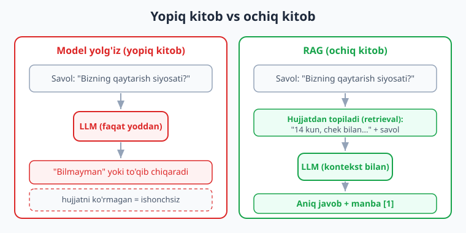
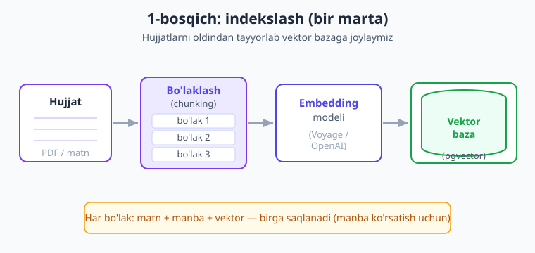
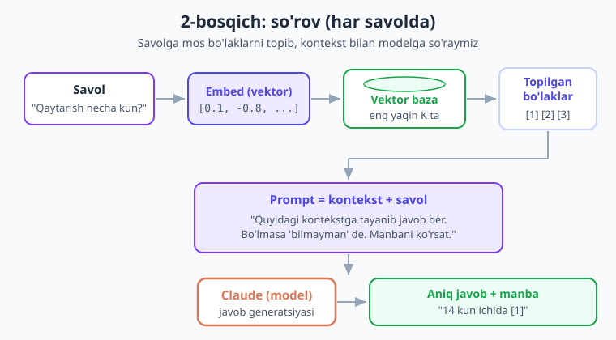

# 15 — RAG (Retrieval-Augmented Generation)

[⬅️ Oldingi: 14 — Vektor bazalar](./14-vektor-bazalar.md) · [🏠 Kitob boshi](./README.md) · [Keyingi: 16 — Kesh va xarajat ➡️](./16-kesh-xarajat.md)

> **Bu bobda:** model faqat o'rgatilgan paytda bilgan narsasini biladi — **sizning** hujjatlaringizni (kompaniya bazasi, ichki qoidalar, yangi xabarlar) bilmaydi. Yechim — **RAG** (Retrieval-Augmented Generation): javob berishdan oldin tegishli hujjatlarni **topib**, promptga **qo'shib**, keyin modelga javob qildirish. Bu bob 13-bobdagi **embedding** va 14-bobdagi **vektor baza** ni birlashtirib, to'liq ishlaydigan "o'z hujjatlaringiz bo'yicha savol-javob" tizimini PHP'da quradi. Bu — kitobning eng amaliy boblaridan biri.

---

## Muammo: model sizning hujjatlaringizni bilmaydi

Tasavvur qiling, juda bilimdon do'stingiz bor — tarixni, fanni, dunyo voqealarini biladi. Lekin u **sizning kompaniyangizda** ishlamaydi. Shuning uchun undan "Bizning qaytarish siyosatimiz qanday?" yoki "5-mahsulotning kafolat muddati qancha?" deb so'rasangiz — u javob bera olmaydi. Chunki bu ma'lumot uning boshida yo'q.

LLM ham xuddi shunday. U **o'rgatilgan paytda** (training) ko'rgan ulkan matn ummonidan bilim oladi. Lekin:

- U **sizning** ichki hujjatlaringizni ko'rmagan (ular maxfiy yoki internetda yo'q);
- U o'rgatilgandan **keyin** paydo bo'lgan yangi ma'lumotni bilmaydi;
- U sizning bazangizdagi mijoz buyurtmasini, narxni, qoidani bilmaydi.

To'g'ridan-to'g'ri so'rasangiz, ikki yomon natija bo'lishi mumkin:

1. **"Bilmayman"** deydi — bu hali yaxshi (rostgo'y);
2. **To'qib chiqaradi** (hallyutsinatsiya, 8-bob) — ishonch bilan **noto'g'ri** javob beradi. Bu xavfliroq.

> **Hayotiy o'xshatish — imtihon.** LLM'dan to'g'ridan so'rash — bu o'quvchini **yopiq kitob** imtihoniga qo'yishga o'xshaydi: faqat yodida qolgan narsani aytadi, esidan chiqqanini "taxmin" qiladi. RAG esa — **ochiq kitob** imtihoni: o'quvchiga avval kerakli sahifalarni topib beramiz, keyin javob yozsin deymiz. Natija — aniqroq, ishonchliroq.

!!! note "Eslatma"
    "Hallyutsinatsiya" (hallucination) — model ishonch bilan noto'g'ri narsa aytishi (8-bobda ko'rgandik). U HTTP xato emas — javob 200 (muvaffaqiyat) kodi bilan keladi, lekin mazmuni xato. RAG aynan shu muammoni kamaytirishning eng kuchli usullaridan biri: model "boshidan" emas, **sizning hujjatingizdan** javob beradi.

---

## RAG nima?

**RAG** — bu **Retrieval-Augmented Generation**, ya'ni "topib-boyitilgan generatsiya". Uch so'zni alohida tushunamiz:

- **Retrieval** (topish) — savolga tegishli hujjat bo'laklarini **qidirib topish**;
- **Augmented** (boyitilgan) — topilgan matnni **promptga qo'shish** (kontekst sifatida);
- **Generation** (generatsiya) — model shu kontekstga tayanib **javob yozish**.

Boshqacha aytganda: model javob berishdan **oldin** biz unga "shpargalka" beramiz — savolga aloqador hujjat parchalarini. Model endi yoddan emas, **ko'z oldidagi matndan** javob beradi.

> **Hayotiy o'xshatish — shpargalka.** Imtihon oldidan ustoz sizga shunday dedi: "Mana, faqat shu ikki sahifani o'qib javob ber, boshqasini o'ylab topma." Siz aniq, manbaga asoslangan javob yozasiz. RAG ham modelga shunday "ruxsat etilgan shpargalka" beradi.

Bu juda oddiy g'oya, lekin natijasi kuchli: arzon, yangilanadigan va manbaga asoslangan AI yordamchi.



---

## RAG vs fine-tuning vs uzun kontekst

Modelga "yangi bilim" berishning uch yo'li bor. Qaysi birini tanlash kerak? Mana qisqa taqqoslash:

| Yondashuv | Qanday ishlaydi | Afzalligi | Kamchiligi |
|---|---|---|---|
| **RAG** | Hujjatni topib, promptga qo'shamiz | Ma'lumot **yangilanadi** (faylni o'zgartirasiz), **manba** ko'rsatadi, **arzon**, kod oddiy | Qidiruv sifatiga bog'liq; har so'rovda kontekst tokeni sarflanadi |
| **Fine-tuning** (qayta o'rgatish) | Modelni o'z ma'lumotingizda qayta o'rgatamiz | Model uslubni/sohani "o'zlashtiradi" | Qimmat, sekin, **yangi ma'lumotda qaytadan** o'rgatish kerak, manba yo'q |
| **Uzun kontekst** | Butun hujjatni har so'rovda promptga tiqamiz | Sodda (qidiruv yo'q) | Katta hujjatlar sig'maydi (1M token ham chegara), har so'rov **qimmat va sekin** |

**Xulosa:** ko'pchilik amaliy vaziyatda — **RAG eng yaxshi tanlov**. Sababi:

- **Yangilanadi:** yangi qoida chiqdi — hujjatni yangilaysiz, modelni qayta o'rgatish shart emas.
- **Manba ko'rsatadi:** "bu javob 3-hujjatdan" deya olasiz (ishonch).
- **Arzon:** faqat tegishli **bo'laklarni** yuborasiz, butun bazani emas.
- **Maxfiy:** ma'lumotingiz modelga "singib ketmaydi" — o'zingizda qoladi.

!!! tip "Maslahat"
    Fine-tuning kerak bo'ladi, **lekin boshqacha maqsadda**: modelga aniq **uslub** yoki **format** o'rgatish uchun (masalan, doim ma'lum tonda javob bersin). **Faktlar/bilim** uchun esa — deyarli har doim RAG. Ko'pincha ularni birlashtirish ham mumkin.

---

## RAG quvuri — ikki bosqich

RAG ikki alohida bosqichdan iborat. Buni adashtirmaslik muhim:

1. **Indekslash** (bir marta, oldindan) — hujjatlaringizni tayyorlab, vektor bazaga joylash. Buni AI yordamchisi ishga tushishidan **oldin** qilasiz (yangi hujjat qo'shilganda takrorlaysiz).
2. **So'rov** (har savolda) — foydalanuvchi savol berganda, tegishli bo'laklarni topib, javob qaytarish.

> **Hayotiy o'xshatish — kutubxona.** Indekslash — kutubxonachi kitoblarni javonlarga **tartiblab joylashtirishi** (bir marta). So'rov — kimdir "biologiya haqida kitob bormi?" deganda, kutubxonachi **darhol tegishli javonga borishi** (har safar). Tartiblamasangiz, qidirish imkonsiz.

Endi har ikkala bosqichni alohida quramiz.

---

## 1-bosqich: indekslash

Indekslash to'rt qadamdan iborat:

1. **O'qish** — hujjatni (matn fayl, PDF, baza) matnga aylantirish.
2. **Bo'laklash (chunking)** — uzun matnni kichik bo'laklarga ajratish.
3. **Embed qilish** — har bo'lakni vektorga (raqamlar ro'yxati) aylantirish (13-bob).
4. **Saqlash** — bo'lak + uning vektorini vektor bazaga yozish (14-bob).



### Hujjatni o'qish

Eng oddiy holat — matn fayl. PHP'da bu bir qator:

```php
<?php
// Matn faylni o'qiymiz
$matn = file_get_contents('hujjatlar/qaytarish-siyosati.txt');
```

PDF, Word yoki HTML uchun maxsus kutubxonalar kerak (masalan, `smalot/pdfparser` PDF uchun). Frameworklar (LLPhant, 17-bob) bu o'qishni o'zi qiladi. Hozir biz **tushuncha** uchun matndan boshlaymiz — qaysi formatdan kelishi muhim emas, oxir-oqibat sizda **matn** bo'ladi.

---

## Chunking (bo'laklash) — eng muhim qadam

Nega hujjatni **bo'laklarga** bo'lamiz? Uchta sabab:

1. **Sig'im.** Butun 50 sahifalik hujjatni har so'rovda promptga tiqib bo'lmaydi (qimmat, sekin, ba'zan sig'maydi ham).
2. **Aniqlik.** Foydalanuvchi bitta savol beradi — bunga butun hujjat emas, **bir-ikki paragraf** kerak. Kichik bo'lak = aniqroq qidiruv.
3. **Embedding sifati.** Embedding model qisqa, bir mavzuli matnni yaxshiroq "tushunadi". Uzun, ko'p mavzuli matnning vektori "loyqa" bo'ladi.

> **Hayotiy o'xshatish — kitobni qismlarga bo'lish.** Butun kitobni bitta "mavzu" deb belgilab bo'lmaydi — unda yuzlab mavzu bor. Shuning uchun kitob **boblar va paragraflarga** bo'linadi. Keyin "bu savol qaysi paragrafda?" deb topish oson. Chunking — xuddi shu: hujjatni qidirsa bo'ladigan kichik bo'laklarga ajratish.

### Bo'lak hajmi va ustma-ustlik (overlap)

Ikki muhim sozlama:

- **Bo'lak hajmi** — bitta bo'lak qancha belgi/token bo'lsin. Juda kichik — kontekst yo'qoladi (yarim jumla). Juda katta — aniqlik tushadi. Amaliy boshlang'ich: **~500–1000 belgi** (taxminan 1–3 paragraf).
- **Ustma-ustlik (overlap)** — qo'shni bo'laklar bir-birining **chekkasini** biroz takrorlasin. Nega? Chunki muhim jumla aynan bo'lak chegarasiga to'g'ri kelib, ikkiga bo'linib qolmasin. Odatda **~10–20%** ustma-ustlik (masalan, 1000 belgilik bo'lakda ~150 belgi).

!!! warning "Ehtiyot bo'ling"
    Eng yomon chunking — matnni **ko'r-ko'rona** har 1000-belgida kesish. U jumlani, hatto so'zni o'rtasidan kesib tashlaydi. Yaxshiroq: **paragraf yoki jumla chegarasida** kesish. Eng yaxshisi — sarlavhalar/bo'limlar bo'yicha (matn tuzilishini hurmat qilish).

Mana paragraf chegarasini hurmat qiluvchi, ustma-ustlikli chunking funksiyasi. U avval matnni paragraflarga bo'ladi, keyin ularni hajm chegarasigacha to'playdi; juda uzun paragrafni esa ustma-ustlik bilan kesadi:

```php
<?php
/**
 * Matnni paragraf chegarasini hurmat qilib bo'laklarga ajratadi.
 *
 * @param string $matn      Bo'linadigan to'liq matn
 * @param int    $maxBelgi  Bitta bo'lakning eng katta hajmi (belgida)
 * @param int    $ustmaUst  Ustma-ustlik (juda uzun paragraf kesilganda)
 * @return string[]         Matn bo'laklari
 */
function bolaklarga(string $matn, int $maxBelgi = 1000, int $ustmaUst = 150): array
{
    // Ortiqcha bo'sh joylarni tozalaymiz, paragraflarga bo'lamiz
    $matn = trim(preg_replace('/[ \t]+/', ' ', $matn));
    $paragraflar = preg_split('/\n\s*\n/', $matn) ?: [];

    $bolaklar = [];
    $joriy = ''; // hozir to'planayotgan bo'lak

    foreach ($paragraflar as $p) {
        $p = trim($p);
        if ($p === '') {
            continue;
        }

        // Paragraf joriy bo'lakka sig'sa — qo'shamiz
        if (mb_strlen($joriy) + mb_strlen($p) + 1 <= $maxBelgi) {
            $joriy = $joriy === '' ? $p : $joriy . "\n" . $p;
        } else {
            // Sig'masa — joriy bo'lakni yakunlaymiz
            if ($joriy !== '') {
                $bolaklar[] = $joriy;
            }
            // Paragrafning o'zi chegaradan kichik bo'lsa — yangi bo'lak boshi
            if (mb_strlen($p) <= $maxBelgi) {
                $joriy = $p;
            } else {
                // Juda uzun paragraf — uni ustma-ustlik bilan kesamiz
                foreach (uzunMatniKes($p, $maxBelgi, $ustmaUst) as $qism) {
                    $bolaklar[] = $qism;
                }
                $joriy = '';
            }
        }
    }
    if ($joriy !== '') {
        $bolaklar[] = $joriy; // oxirgi bo'lakni unutmaymiz
    }
    return $bolaklar;
}

/**
 * Juda uzun matnni ustma-ustlik bilan teng qismlarga kesadi.
 */
function uzunMatniKes(string $matn, int $maxBelgi, int $ustmaUst): array
{
    $natija = [];
    $uzunlik = mb_strlen($matn);
    $boshi = 0;

    while ($boshi < $uzunlik) {
        $natija[] = trim(mb_substr($matn, $boshi, $maxBelgi));
        if ($boshi + $maxBelgi >= $uzunlik) {
            break;
        }
        // Keyingi bo'lak orqaga "ustma-ust" qaytadi
        $boshi += ($maxBelgi - $ustmaUst);
    }
    return $natija;
}
```

E'tibor bering: `mb_strlen` va `mb_substr` ishlatdik (oddiy `strlen` emas), chunki o'zbek/kirill harflari ko'p baytli — `strlen` ularni xato sanaydi. Matn bilan ishlaganda **doim** `mb_` funksiyalarini ishlating.

!!! tip "Maslahat"
    Bo'lak hajmini **soha**ga moslab tanlang. FAQ (savol-javob) uchun kichik bo'lak (har savol-javob = 1 bo'lak) zo'r. Uzun maqola/qo'llanma uchun kattaroq bo'lak (paragraf/bo'lim) yaxshiroq. Eng yaxshi yo'l — sinab ko'rib, qidiruv sifatini baholash (21-bob — baholash).

---

## Har bo'lakni embed qilish va saqlash

Endi har bo'lakni **vektorga** aylantiramiz (13-bob — embedding) va vektor bazaga yozamiz (14-bob). Eslatma: Anthropic'ning o'z embedding modeli yo'q — embedding uchun **Voyage AI** yoki **OpenAI** kabi xizmatdan foydalanamiz (13-bobda ko'rgandek). Mana bo'lakni vektorga aylantiruvchi yordamchi (13-bobdan):

```php
<?php
/**
 * Matnni embedding (vektor) ga aylantiradi.
 * Bu yerda Voyage AI namuna; OpenAI yoki boshqa provayder ham bo'ladi (13-bob).
 */
function embed(string $matn): array
{
    $kalit = getenv('VOYAGE_API_KEY'); // kalitni MUHITDAN olamiz!
    $ch = curl_init('https://api.voyageai.com/v1/embeddings');
    curl_setopt_array($ch, [
        CURLOPT_RETURNTRANSFER => true,
        CURLOPT_POST => true,
        CURLOPT_HTTPHEADER => [
            'Content-Type: application/json',
            'Authorization: Bearer ' . $kalit,
        ],
        CURLOPT_POSTFIELDS => json_encode([
            'model' => 'voyage-3',
            'input' => $matn,
        ]),
    ]);
    $javob = curl_exec($ch);
    curl_close($ch);
    $data = json_decode($javob, true);

    return $data['data'][0]['embedding'] ?? []; // raqamlar ro'yxati
}
```

Endi indekslashni to'liq bog'laymiz — hujjat o'qib, bo'laklab, har bo'lakni embed qilib, **pgvector** bazasiga yozamiz (14-bob). Avval baza jadvalini eslaylik (14-bobdan):

```sql
-- pgvector kengaytmasi (14-bob)
CREATE EXTENSION IF NOT EXISTS vector;

CREATE TABLE hujjatlar (
    id     BIGSERIAL PRIMARY KEY,
    matn   TEXT NOT NULL,           -- bo'lak matni
    manba  TEXT NOT NULL,           -- qaysi fayldan (citation uchun)
    vektor vector(1024)             -- embedding (Voyage voyage-3 = 1024 o'lcham)
);
```

Indekslash funksiyasi:

```php
<?php
/**
 * Bitta hujjatni bo'laklab, embed qilib, pgvector bazasiga yozadi.
 */
function pgIndeksla(PDO $pdo, string $matn, string $manba): void
{
    $stmt = $pdo->prepare(
        'INSERT INTO hujjatlar (matn, manba, vektor)
         VALUES (:matn, :manba, :vektor)'
    );

    foreach (bolaklarga($matn) as $bolak) {
        $vektor = embed($bolak); // bo'lakni vektorga aylantiramiz

        $stmt->execute([
            ':matn'   => $bolak,
            ':manba'  => $manba,
            // pgvector matn ko'rinishini kutadi: '[0.1,0.2,...]'
            ':vektor' => '[' . implode(',', $vektor) . ']',
        ]);
    }
}

// Ishlatish: barcha hujjatlarni indekslaymiz (bir marta)
$pdo = new PDO(
    'pgsql:host=localhost;port=5432;dbname=ragdb',
    getenv('PG_USER'),
    getenv('PG_PASS'),
    [PDO::ATTR_ERRMODE => PDO::ERRMODE_EXCEPTION],
);

foreach (glob('hujjatlar/*.txt') as $fayl) {
    $matn = file_get_contents($fayl);
    pgIndeksla($pdo, $matn, basename($fayl)); // manba = fayl nomi
    echo "Indekslandi: " . basename($fayl) . "\n";
}
```

Mana shu! Endi bazangizda har bo'lak — matni, manbasi va vektori bilan — saqlandi. Indekslash tugadi. Bu kodni **bir marta** (yoki yangi hujjat qo'shilganda) ishga tushirasiz.

!!! note "Eslatma"
    Indekslash **vaqt va pul** talab qiladi (har bo'lak uchun embedding so'rovi). Shuning uchun uni **oldindan**, alohida skript (yoki Laravel'da queue job, 18-bob) sifatida bajaring — foydalanuvchi savol berganda emas. Bir marta indekslab qo'ysangiz, minglab savolga tez javob berasiz.

---

## 2-bosqich: so'rov (savol-javob)

Indeks tayyor. Endi foydalanuvchi savol berganda nima bo'ladi? Besh qadam:

1. **Savolni embed qilish** — savolni ham vektorga aylantiramiz (xuddi bo'laklar kabi).
2. **Eng yaqin bo'laklarni topish** — vektor bazada savol vektoriga **eng yaqin** bo'laklarni qidiramiz (14-bob).
3. **Promptni qurish** — topilgan bo'laklarni **kontekst** sifatida promptga qo'shamiz.
4. **Modelga yuborish** — kontekst + savolni Claude'ga beramiz.
5. **Javobni qaytarish** — model kontekstga tayanib javob beradi.



### Eng yaqin bo'laklarni topish

Savolni embed qilib, pgvector'da eng yaqin bo'laklarni qidiramiz. Kosinus masofasi operatori `<=>` (14-bob) — eng yaqin (kichik masofa) birinchi keladi:

```php
<?php
/**
 * Savolga eng yaqin K ta bo'lakni pgvector bazasidan topadi.
 *
 * @return array<int, array{matn: string, manba: string, oxshashlik: float}>
 */
function pgTopish(PDO $pdo, string $savol, int $k = 3): array
{
    // 1) Savolni ham vektorga aylantiramiz
    $vektor = '[' . implode(',', embed($savol)) . ']';

    // 2) <=> kosinus masofasi: kichik masofa = yaqinroq (14-bob)
    //    1 - masofa = o'xshashlik (1.0 ga yaqin = juda o'xshash)
    $stmt = $pdo->prepare(
        'SELECT matn, manba, 1 - (vektor <=> :v1) AS oxshashlik
         FROM hujjatlar
         ORDER BY vektor <=> :v2
         LIMIT :k'
    );
    $stmt->bindValue(':v1', $vektor);
    $stmt->bindValue(':v2', $vektor);
    $stmt->bindValue(':k', $k, PDO::PARAM_INT);
    $stmt->execute();

    return $stmt->fetchAll(PDO::FETCH_ASSOC);
}
```

Bu funksiya savolga eng mos **3 ta** bo'lakni qaytaradi — har biri matni, manbasi va o'xshashlik bali bilan. Aynan shularni endi modelga "shpargalka" qilib beramiz.

---

## Promptni qurish — hallyutsinatsiyani kamaytirish

Endi eng nozik qism: topilgan bo'laklarni shunday promptga qo'shamizki, model **faqat** shu kontekstga tayansin va undan tashqariga chiqmasin. Sehrli formula:

```text
Quyidagi KONTEKSTga tayanib javob ber.
Agar javob kontekstda bo'lmasa, "bilmayman" deb ayt — to'qib chiqarma.

Kontekst:
{topilgan bo'laklar}

Savol: {foydalanuvchi savoli}
```

Bu ko'rsatma uch narsani qiladi:

1. Modelni **kontekstga bog'laydi** ("faqat shunga tayan");
2. **"Bilmayman" ga ruxsat** beradi (8-bob — bu hallyutsinatsiyani keskin kamaytiradi);
3. Modelni **to'qishdan tiyadi** ("to'qib chiqarma").

PHP'da topilgan bo'laklardan kontekst matni quramiz:

```php
<?php
$topilgan = pgTopish($pdo, $savol, 3);

// Topilgan bo'laklarni raqamlab, manbasi bilan kontekstga jamlaymiz
$kontekst = '';
foreach ($topilgan as $n => $b) {
    $raqam = $n + 1;
    $kontekst .= "[{$raqam}] (manba: {$b['manba']})\n{$b['matn']}\n\n";
}
```

E'tibor bering: har bo'lakni **`[1]`, `[2]`** deb raqamladik va manbasini qo'shdik. Bu — keyinroq **manba ko'rsatish** (citation) uchun. Model "bu javob [2] dan" deya oladi.

---

## Modelga yuborish — to'liq RAG savol-javob funksiyasi

Endi system promptda qoidani aytib, kontekst + savolni Claude'ga yuboramiz:

```php
<?php
require __DIR__ . '/vendor/autoload.php';

use Anthropic\Client;

/**
 * RAG savol-javob: bazadan topib, kontekst bilan Claude'ga so'raydi.
 */
function ragSora(Client $client, PDO $pdo, string $savol): string
{
    // 1) Eng yaqin bo'laklarni topamiz
    $topilgan = pgTopish($pdo, $savol, 3);

    // 2) Kontekstni quramiz (raqam + manba bilan)
    $kontekst = '';
    foreach ($topilgan as $n => $b) {
        $raqam = $n + 1;
        $kontekst .= "[{$raqam}] (manba: {$b['manba']})\n{$b['matn']}\n\n";
    }

    // 3) System prompt — modelni kontekstga bog'laydi
    $system = "Sen yordamchi assistantsan. Faqat QUYIDAGI kontekstga "
        . "tayanib javob ber. Agar javob kontekstda bo'lmasa, "
        . "'Bu haqda hujjatlarda ma'lumot topilmadi' deb ayt — "
        . "hech qachon faktni to'qib chiqarma. "
        . "Javobing oxirida foydalangan manbani [raqam] bilan ko'rsat.";

    // 4) Kontekst + savolni yuboramiz
    $message = $client->messages->create(
        model: 'claude-opus-4-8',
        maxTokens: 1024,
        system: $system,
        messages: [[
            'role'    => 'user',
            'content' => "Kontekst:\n\n{$kontekst}\nSavol: {$savol}",
        ]],
    );

    // 5) Javobni qaytaramiz
    return $message->content[0]->text;
}
```

Ishlatish — bir qator:

```php
$client = new Client(apiKey: getenv('ANTHROPIC_API_KEY'));

echo ragSora($client, $pdo, "Mahsulotni necha kun ichida qaytarsa bo'ladi?");
// Model bazadagi "qaytarish siyosati" bo'lagini topib, aniq javob beradi: "[1]"
```

Mana shu — to'liq ishlaydigan RAG! Endi modelingiz **sizning** hujjatlaringiz bo'yicha javob beradi.

!!! tip "Maslahat"
    Kontekstni **savoldan oldin** qo'ying (yuqoridagidek). Model ketma-ketlikni shunday yaxshiroq tushunadi: "mana ma'lumot... endi shu asosida shu savolga javob ber". Bundan tashqari, katta o'zgarmas kontekstni **prompt caching** bilan keshlab, xarajatni keskin kamaytirish mumkin (16-bob).

---

## Manba ko'rsatish (citations)

RAG'ning eng kuchli afzalligi — **manba ko'rsata olish**. Foydalanuvchi "buni qayerdan oldingiz?" deganda, "bu javob `qaytarish-siyosati.txt` hujjatining 1-bo'lagidan" deya olasiz. Bu — **ishonch**.

Biz buni allaqachon qildik: kontekstda har bo'lakni `[1] (manba: fayl.txt)` deb raqamladik va system promptda "manbani [raqam] bilan ko'rsat" dedik. Model endi javob oxirida `[1]` yozadi, siz esa qaysi faylga to'g'ri kelishini bilasiz:

```php
<?php
// Javob bilan birga manbalar ro'yxatini ham ko'rsatamiz
$javob = ragSora($client, $pdo, $savol);
$topilgan = pgTopish($pdo, $savol, 3);

echo $javob . "\n\n--- Manbalar ---\n";
foreach ($topilgan as $n => $b) {
    printf("[%d] %s (o'xshashlik: %.2f)\n", $n + 1, $b['manba'], $b['oxshashlik']);
}
```

!!! note "Eslatma"
    Manba ko'rsatish nafaqat ishonch beradi, balki **xatoni topishga** ham yordam beradi. Agar model noto'g'ri javob bersa, qaysi bo'lakdan kelganini ko'rib, hujjatni tuzatishingiz mumkin. Manba — RAG'ni "qora quti" bo'lishdan saqlaydi.

---

## To'liq RAG ilova — kitobning yuragi

Endi hammasini bitta, o'zi yetarli faylga jamlaymiz: **xotirada** ishlaydigan to'liq RAG (vektor bazasiz, tushunish uchun eng sodda variant). Bu real loyiha uchun emas (har ishga tushishda qaytadan indekslaydi), lekin **butun RAG g'oyasini bir faylda** ko'rsatadi — indekslash + qidirish + javob.

Bu yerda vektor bazani **xotiradagi massiv** bilan, qidiruvni esa **kosinus o'xshashligi** (13-bob) bilan qilamiz. Real loyihada esa pgvector ishlatasiz (yuqorida ko'rdik).

```php
<?php
require __DIR__ . '/vendor/autoload.php';

use Anthropic\Client;

/**
 * Xotirada ishlaydigan to'liq RAG: indekslash + qidirish.
 */
class XotiraRag
{
    /** @var array<int, array{matn: string, manba: string, vektor: array}> */
    private array $bolaklar = [];

    /** Hujjatni bo'laklab, embed qilib, xotiraga qo'shadi (indekslash). */
    public function qoshHujjat(string $matn, string $manba): void
    {
        foreach (bolaklarga($matn) as $bolak) {
            $this->bolaklar[] = [
                'matn'   => $bolak,
                'manba'  => $manba,
                'vektor' => embed($bolak),
            ];
        }
    }

    /** Savolga eng yaqin K ta bo'lakni topadi (qidirish). */
    public function topish(string $savol, int $k = 3): array
    {
        $savolVektor = embed($savol);

        // Har bo'lak bilan o'xshashlikni hisoblaymiz
        $ballar = [];
        foreach ($this->bolaklar as $i => $b) {
            $ballar[$i] = kosinus($savolVektor, $b['vektor']);
        }
        arsort($ballar); // o'xshashlik bo'yicha kamayuvchi tartib

        // Eng yuqori K tasini olamiz
        $natija = [];
        foreach (array_slice(array_keys($ballar), 0, $k) as $i) {
            $natija[] = $this->bolaklar[$i] + ['ball' => $ballar[$i]];
        }
        return $natija;
    }
}

/** Kosinus o'xshashligi (13-bob): 1.0 ga yaqin = juda o'xshash. */
function kosinus(array $a, array $b): float
{
    $skalyar = 0.0;
    $normA = 0.0;
    $normB = 0.0;
    foreach ($a as $i => $v) {
        $skalyar += $v * $b[$i];
        $normA  += $v * $v;
        $normB  += $b[$i] * $b[$i];
    }
    if ($normA == 0.0 || $normB == 0.0) {
        return 0.0;
    }
    return $skalyar / (sqrt($normA) * sqrt($normB));
}
```

Va asosiy ishlatish — indekslab, savol berib, javob olamiz:

```php
<?php
$client = new Client(apiKey: getenv('ANTHROPIC_API_KEY'));
$rag = new XotiraRag();

// 1) INDEKSLASH — hujjatlarni xotiraga joylaymiz
$rag->qoshHujjat(
    "Bizning do'kon mahsulotni xarid sanasidan boshlab 14 kun ichida "
    . "qaytarib olishadi. Mahsulot ishlatilmagan va o'ramida bo'lishi shart. "
    . "Chek talab qilinadi.",
    'qaytarish-siyosati.txt',
);
$rag->qoshHujjat(
    "Yetkazib berish Toshkent bo'ylab 1-2 kun, viloyatlarga 3-5 kun. "
    . "50 ming so'mdan yuqori buyurtmalarga yetkazish bepul.",
    'yetkazish.txt',
);

// 2) SO'ROV — foydalanuvchi savoli
$savol = "Mahsulotni necha kun ichida qaytarsa bo'ladi?";

$topilgan = $rag->topish($savol, 2);

// 3) Kontekst quramiz
$kontekst = '';
foreach ($topilgan as $n => $b) {
    $kontekst .= "[" . ($n + 1) . "] (manba: {$b['manba']})\n{$b['matn']}\n\n";
}

// 4) Modelga yuboramiz
$message = $client->messages->create(
    model: 'claude-opus-4-8',
    maxTokens: 512,
    system: "Faqat berilgan kontekstga tayanib javob ber. "
        . "Kontekstda javob bo'lmasa 'ma'lumot topilmadi' de. "
        . "Manbani [raqam] bilan ko'rsat.",
    messages: [[
        'role'    => 'user',
        'content' => "Kontekst:\n\n{$kontekst}\nSavol: {$savol}",
    ]],
);

// 5) Javob
echo $message->content[0]->text . "\n\n--- Manbalar ---\n";
foreach ($topilgan as $n => $b) {
    printf("[%d] %s (%.2f)\n", $n + 1, $b['manba'], $b['ball']);
}
```

Bu kod (yuqoridagi `bolaklarga`, `uzunMatniKes`, `embed` funksiyalari bilan birga) — **butun RAG tizimining yuragi**. Indekslash, semantik qidiruv va kontekstli javob — hammasi bir joyda. Kodning hammasi `php -l` bilan tekshirilgan.

!!! example "To'liq oqim qisqacha"
    1. `qoshHujjat()` — hujjatni bo'laklab, har bo'lakni vektorga aylantirib saqlaydi (**indekslash**).
    2. `topish()` — savolni vektorga aylantirib, eng yaqin bo'laklarni topadi (**qidirish**).
    3. Kontekst qurib, system prompt bilan Claude'ga yuboramiz (**javob**).
    Natija — model **sizning** hujjatlaringizdan, manba ko'rsatib javob beradi.

---

## RAG sifatini yaxshilash

Birinchi RAG ishlaydi, lekin "yaxshi" RAG — alohida san'at. Mana eng ta'sirli yaxshilashlar:

- **Yaxshi chunking.** Sifatning yarmi shu yerda. Paragraf/sarlavha chegarasini hurmat qiling, hajm va ustma-ustlikni soha uchun sozlang. Yomon bo'lak — yomon javob.
- **K ni sozlash.** Nechta bo'lak olish (`k`)? Kam (1-2) — kontekst yetmasligi mumkin. Ko'p (10+) — "shovqin" qo'shiladi, model chalg'iydi, xarajat oshadi. Boshlang'ich — **3-5**.
- **Qayta tartiblash (reranking).** Avval vektor bilan **20** ta nomzod oling, keyin ularni aniqroq model (yoki Claude'ning o'zi) bilan **qayta baholab**, eng yaxshi 3 tasini tanlang. Bu aniqlikni keskin oshiradi.
- **Gibrid qidiruv.** Faqat semantik (vektor) qidiruv ba'zan aniq atamani (mahsulot kodi, ism) o'tkazib yuboradi. **Kalit so'z qidiruvi** (oddiy matn izlash, masalan PostgreSQL `tsvector`) bilan birlashtirsangiz — eng kuchli natija.
- **O'xshashlik chegarasi.** Eng yaqin bo'lak ham juda uzoq bo'lsa (past o'xshashlik), uni umuman **olmang** — "ma'lumot topilmadi" deng. Bu noto'g'ri kontekst asosida javob berishni oldini oladi.

!!! tip "Maslahat"
    RAG'ni "bir marta yozib qo'yib bo'lmaydi" — uni **baholash** kerak. Bir nechta namuna savol-javob tayyorlang, RAG'ingiz to'g'ri javob beryaptimi tekshiring. Chunking, K, prompt'ni o'zgartirib, qaysi biri yaxshiroq ekanini o'lchang. Bu — 21-bob (testlash va baholash) mavzusi.

!!! warning "Ehtiyot bo'ling"
    RAG hallyutsinatsiyani **kamaytiradi**, lekin **butunlay yo'q qilmaydi**. Model baribir kontekstni noto'g'ri talqin qilishi mumkin. Muhim sohada (tibbiyot, huquq, moliya) javobni **odam tasdiqlasin** va foydalanuvchini ogohlantiring (8-bob).

---

## Framework bilan RAG (qisqa)

Biz RAG'ni "qo'lda" — bosqichma-bosqich — qurib chiqdik. Bu eng yaxshi **o'rganish** yo'li: har bo'lak nima qilishini bilasiz. Lekin real loyihada PHP GenAI **frameworklari** tayyor RAG quvurini beradi:

- **LLPhant** (`composer require theodo-group/llphant`) — hujjat o'qish (PDF/matn), chunking, embedding, vektor baza (pgvector, Qdrant...) va so'rovni bitta API ostida beradi.
- **Neuron AI** (`composer require neuron-core/neuron-ai`) — agentik framework; RAG, vektor store va workflow'ni qo'llab-quvvatlaydi, provayderni bir qatorda almashtirish mumkin.

Bu frameworklar — siz hozir tushungan **aynan shu bosqichlarni** avtomatlashtiradi (o'qish → chunk → embed → saqlash → topish → prompt). Tushunchani bilganingiz uchun endi ularni ishonch bilan ishlatasiz va kerak bo'lganda sozlay olasiz. Batafsil 17-bobda ko'ramiz.

!!! info "Boshqa provayderda"
    RAG g'oyasi **provayderga bog'liq emas**. Embedding'ni OpenAI yoki Gemini'dan, javobni Claude yoki GPT'dan olishingiz mumkin — quvur bir xil qoladi. Hatto turli provayderni aralashtirish ham mumkin (embedding — Voyage, javob — Claude). 19-bobda provayder almashtirish ko'rsatiladi.

---

## Xulosa

- **Muammo:** LLM faqat o'rgatilgan paytda bilgan narsasini biladi — **sizning** hujjatlaringizni (ichki qoidalar, baza, yangi xabar) bilmaydi. To'g'ridan so'rasangiz — "bilmayman" yoki to'qib chiqaradi (hallyutsinatsiya).
- **RAG** (Retrieval-Augmented Generation) — javob berishdan oldin tegishli hujjatlarni **topib** (retrieval), promptga **qo'shib** (augment), keyin model **javob beradi** (generation). "Ochiq kitob imtihoni" / "modelga shpargalka berish".
- **RAG vs fine-tuning vs uzun kontekst:** ko'pchilik holatda RAG eng yaxshi — yangilanadi, manba ko'rsatadi, arzon, fine-tuning shart emas, ma'lumot maxfiy qoladi.
- **Ikki bosqich:** (1) **indekslash** (bir marta): o'qish → chunking → embed → vektor bazaga saqlash; (2) **so'rov** (har savolda): savolni embed → eng yaqin bo'laklarni topish → prompt+kontekst → model → javob.
- **Chunking** — sifatning yarmi: paragraf/jumla chegarasini hurmat qil, hajm (~500-1000 belgi) va ustma-ustlik (~10-20%) ni sozla, `mb_` funksiyalarini ishlat.
- **Prompt qurish:** "faqat kontekstga tayan, kontekstda yo'q bo'lsa 'bilmayman' de, to'qima" — hallyutsinatsiyani keskin kamaytiradi.
- **Manba ko'rsatish (citations)** — bo'laklarni raqamlab, manbasini saqlab, "[raqam] bilan ko'rsat" deng: ishonch va xatoni topish.
- **Sifatni yaxshilash:** yaxshi chunking, K ni sozlash, reranking, gibrid qidiruv, o'xshashlik chegarasi. Frameworklar (LLPhant, Neuron AI — 17-bob) tayyor RAG quvurini beradi.

---

## Amaliy mashqlar

1. **Chunking funksiyasini sinash.** `bolaklarga()` funksiyasini oling va uzun matnni (masalan, shu bobni) unga bering. (a) Bo'laklar sonini va har birining uzunligini chop eting. (b) `maxBelgi` ni 500 va 2000 qilib o'zgartirib, natija qanday farq qilishini kuzating. (c) Bo'laklar paragraf chegarasida kesilganini tekshiring.

2. **Indekslash skripti.** `hujjatlar/` papkasiga 3-4 ta `.txt` fayl qo'ying (masalan: qaytarish siyosati, yetkazish, kafolat). Ularni bo'laklab, embed qilib (yoki embeddingni soxta/random vektor bilan almashtirib — kalit bo'lmasa), `XotiraRag` ga indekslang. Nechta bo'lak hosil bo'lganini chop eting.

3. **RAG savol-javob.** 2-mashqdagi indekslangan RAG'ga bir nechta savol bering: (a) javobi hujjatda **bor** savol, (b) javobi hujjatda **yo'q** savol. Model birinchisiga aniq javob, ikkinchisiga "ma'lumot topilmadi" deyaptimi — tekshiring. Agar to'qib chiqarsa, system prompt'ni kuchaytiring.

4. **Manba ko'rsatish.** `ragSora()` ni shunday o'zgartiringki, javob ostida har bir foydalanilgan manba nomi va o'xshashlik bali (`%.2f`) ko'rsatilsin. Keyin: eng yaqin bo'lakning o'xshashligi 0.5 dan past bo'lsa, modelga umuman bormay, darhol "Ishonchli ma'lumot topilmadi" qaytaring (o'xshashlik chegarasi).

5. **Sifatni taqqoslash.** Bitta savol uchun `k = 1`, `k = 3` va `k = 5` bilan RAG'ni ishga tushiring. Har holatda model javobi va sarflangan kontekst hajmi (taxminan) qanday farq qiladi? Sizning savolingiz uchun qaysi `k` eng yaxshi balansni beradi — yozib qo'ying.

---

[⬅️ Oldingi: 14 — Vektor bazalar](./14-vektor-bazalar.md) · [🏠 Kitob boshi](./README.md) · [Keyingi: 16 — Kesh va xarajat ➡️](./16-kesh-xarajat.md)
