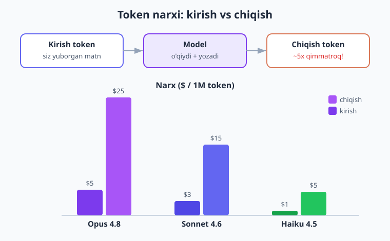
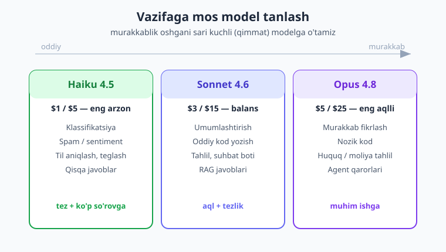
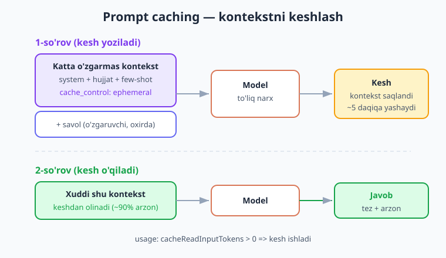

# 16 — Kesh va xarajat optimizatsiyasi

[⬅️ Oldingi: 15 — RAG](./15-rag.md) · [🏠 Kitob boshi](./README.md) · [Keyingi: 17 — Frameworklar ➡️](./17-frameworklar.md)

> **Bu bobda:** AI so'rovlari pul turadi — har bir so'z (token) uchun to'laysiz, va foydalanuvchilar ko'paygan sari hisob ham o'sadi. Biz xarajatni **sifatni saqlab** kamaytirishni o'rganamiz: so'rov narxini hisoblash, har vazifaga **to'g'ri model** tanlash (Haiku/Sonnet/Opus), **prompt caching** (Anthropic tomonidagi kesh — takror so'rovda ~90% arzon), **o'z keshingiz** (bir xil so'rovga API'ga umuman bormaslik), **Batch API** (50% arzon), va token tejash texnikalari. Oxirida hammasini birlashtirgan "ishonchli + arzon so'rov" o'ramini yozamiz.

---

## Nega bu bob muhim? — "Har so'z pul"

Tasavvur qiling, sizda taksi bor. Har bir kilometr uchun pul to'laysiz. Bitta yo'lovchini tashisangiz — arzon. Lekin kuniga ming yo'lovchi bo'lsa va siz har birini **eng uzun yo'l** bilan, **eng qimmat mashinada** olib borsangiz — oy oxirida hisob osmonga chiqadi.

AI bilan ishlash ham aynan shunday. Har bir so'rov **pul turadi** — to'lov **token** (ya'ni matnning AI o'qiydigan/yozadigan eng kichik bo'lakchasi) hisobida ketadi. Bitta test so'rovi deyarli bepul tuyuladi. Lekin ilovangizni ming kishi ishlatsa, har biri kuniga o'nlab so'rov yuborsa — hisob jiddiy raqamga aylanadi.

Yaxshi yangilik: ko'p hollarda siz **bir xil sifatni** ancha **arzonroqqa** olishingiz mumkin. Buning siri — bir nechta oddiy texnika:

- Har vazifaga **to'g'ri model** (oddiy ishga arzon model);
- O'zgarmas katta kontekstni **keshlash** (ikki marta pul to'lamaslik);
- Takror so'rovga API'ga **umuman bormaslik**;
- Shoshilmaydigan ko'p so'rovni **Batch** bilan yuborish.

Bu bob — "**sifatni saqlab xarajatni kamaytirish**" san'ati. Birorta foydalanuvchi farqini sezmaydi, lekin sizning hisobingiz bir necha barobar kichrayadi.

!!! note "Eslatma"
    Optimizatsiya — bu "arzon model ishlat, tamom" degani emas. Bu — **har ishga mosini** tanlash. Murakkab, muhim ishga kuchli (qimmat) model; oddiy, ko'p takrorlanadigan ishga arzon model. Maqsad: pulni faqat **kerakli joyga** sarflash.

---

## Token va narx — pul qayerga ketadi

Avval pulni **nima** yeyishini aniq bilaylik. To'lov ikki qismdan iborat:

- **Kirish tokeni** (input) — siz **yuborgan** hamma narsa: system prompt, suhbat tarixi, foydalanuvchi savoli, RAG kontnteksti, tool ta'riflari. Bularning hammasi tokenga aylanadi va hisoblanadi.
- **Chiqish tokeni** (output) — model **yozgan** javob.

Muhim nuqta: **chiqish tokeni kirishdan qimmatroq** (odatda ~5 barobar). Sababi — javob yozish (generatsiya) modelga ko'proq hisob-kitob talab qiladi. Demak uzun javob — qimmat javob.



Mana joriy narxlar (1 million token uchun, dollarda):

| Model | Kirish ($/1M) | Chiqish ($/1M) | Qachon |
|---|---|---|---|
| **Claude Opus 4.8** | $5 | $25 | Murakkab/muhim ish — eng aqlli |
| **Claude Sonnet 4.6** | $3 | $15 | O'rta ish — aql va tezlik balansi |
| **Claude Haiku 4.5** | $1 | $5 | Oddiy/ko'p ish — eng tez va arzon |

Bir nazar tashlang: Opus chiqishi (`$25`) Haiku chiqishidan (`$5`) **5 barobar** qimmat. Agar bitta vazifani **ikkala** model ham yaxshi bajara olsa — Haiku tanlash xuddi shu natijani 5 barobar arzonga beradi.

!!! tip "Maslahat"
    "1 million token" katta tuyuladi, lekin tez tugaydi. Taxminan **1 token ≈ 0.75 so'z** (o'zbekcha/inglizcha o'rtacha). Ya'ni 1M token ≈ 750 000 so'z. Uzun system prompt + uzun suhbat tarixi har so'rovda qayta yuborilsa — tokenlar tez yig'iladi.

### So'rov narxini hisoblash (PHP)

Har bir javobda model `usage` (foydalanish) ma'lumotini qaytaradi — necha token sarflanganini aniq aytadi. Shundan narxni o'zimiz hisoblashimiz mumkin. Avval narx jadvalini kod sifatida yozamiz:

```php
<?php

// 1 million token uchun narx (dollarda). Manba: model narx jadvali.
const NARX = [
    'claude-opus-4-8'   => ['kirish' => 5.00,  'chiqish' => 25.00],
    'claude-sonnet-4-6' => ['kirish' => 3.00,  'chiqish' => 15.00],
    'claude-haiku-4-5'  => ['kirish' => 1.00,  'chiqish' => 5.00],
];

/**
 * Berilgan model va token sonidan so'rov narxini hisoblaydi (dollarda).
 */
function sorovNarxi(string $model, int $kirishTok, int $chiqishTok): float
{
    $n = NARX[$model] ?? NARX['claude-opus-4-8']; // noma'lum model -> Opus narxi

    // Narx 1M token uchun berilgan, shuning uchun 1_000_000 ga bo'lamiz
    return ($kirishTok  / 1_000_000) * $n['kirish']
         + ($chiqishTok / 1_000_000) * $n['chiqish'];
}
```

Endi real javobdan `usage` ni olib, narxni chiqaramiz. `$message->usage` da `inputTokens` (kirish) va `outputTokens` (chiqish) bor:

```php
require __DIR__ . '/vendor/autoload.php';

use Anthropic\Client;

$client = new Client(apiKey: getenv('ANTHROPIC_API_KEY'));

$model = 'claude-opus-4-8';
$message = $client->messages->create(
    model: $model,
    maxTokens: 1024,
    messages: [['role' => 'user', 'content' => 'O\'zbekiston haqida bir abzas yoz.']],
);

// usage — model qancha token sarflaganini aytadi
$kirish  = $message->usage->inputTokens;   // siz yuborgan tokenlar
$chiqish = $message->usage->outputTokens;  // model yozgan tokenlar

$narx = sorovNarxi($model, $kirish, $chiqish);

printf(
    "Model: %s | kirish: %d tok | chiqish: %d tok | narx: $%.6f\n",
    $model, $kirish, $chiqish, $narx
);
```

E'tibor bering — narx **juda kichik** ($0.00... ko'rinishida) chiqadi. Bu sizni aldamasin: bitta so'rov arzon, lekin **million so'rov** — bu allaqachon jiddiy hisob. Aynan shuning uchun har bir so'rovning narxini bilish va kamaytirish muhim.

!!! tip "Maslahat"
    So'rovni **yubormasdan oldin** ham token sonini bilib olsangiz bo'ladi: `$client->messages->countTokens(model: ..., messages: ...)` — bu so'rov **kirish** tokenini sanaydi (deyarli bepul). Promptingiz juda uzun bo'lib ketmaganini tekshirish uchun foydali.

---

## Model tanlash — eng katta tejamkorlik

Endi eng kuchli texnikadan boshlaymiz. Sababi oddiy: model narxini **5 barobar** kamaytirish (Opus → Haiku) odatda **boshqa hamma optimizatsiyadan ko'ra ko'proq** pul tejaydi.

Hayotiy o'xshatish: mixni devorga qoqish uchun sizga bolg'a kerak — **elektr perforatori** emas. Perforator kuchliroq, lekin mix uchun ortiqcha, qimmat va shovqinli. To'g'ri asbob — **vazifaga mos** asbob.

Modellar ham shunday. Har biriga o'z o'rni bor:



| Vazifa turi | Misol | Tavsiya model |
|---|---|---|
| **Oddiy / ko'p takrorlanadigan** | Klassifikatsiya (spam/spam emas), qisqa javob, til aniqlash, teglash, sentiment | **Haiku 4.5** (arzon, tez) |
| **O'rta** | Matn umumlashtirish, oddiy kod yozish, tahlil, suhbat boti | **Sonnet 4.6** (balans) |
| **Murakkab / muhim** | Murakkab fikrlash, nozik kod, huquqiy/moliyaviy tahlil, agent qarorlari | **Opus 4.8** (eng aqlli) |

Asosiy g'oya — **"mix" (aralash) strategiyasi**: bitta ilovada **bir nechta model** ishlatish. Har bir so'rovni avval "bu qanchalik murakkab?" deb baholaysiz, keyin mos modelga yuborasiz.

Mana sodda "model tanlovchi" — vazifa turiga qarab model ID qaytaradi:

```php
<?php

/**
 * Vazifa turiga qarab eng tejamkor mos modelni tanlaydi.
 */
function modelTanla(string $vazifa): string
{
    return match ($vazifa) {
        // Oddiy, ko'p takrorlanadigan ishlar -> eng arzon
        'klassifikatsiya', 'teglash', 'til-aniqlash', 'qisqa' => 'claude-haiku-4-5',

        // O'rta murakkablik -> balans
        'umumlashtirish', 'kod', 'tahlil', 'suhbat' => 'claude-sonnet-4-6',

        // Murakkab/muhim (default) -> eng aqlli
        default => 'claude-opus-4-8',
    };
}

// Misol: spam tekshirish — oddiy vazifa, Haiku yetarli
$model = modelTanla('klassifikatsiya'); // 'claude-haiku-4-5'
```

Va uni so'rovda ishlatamiz:

```php
use Anthropic\Client;

$client = new Client(apiKey: getenv('ANTHROPIC_API_KEY'));

// Spam tekshirish — Haiku yetarli (5 barobar arzon!)
$message = $client->messages->create(
    model: modelTanla('klassifikatsiya'),
    maxTokens: 10, // javob qisqa: "spam" yoki "toza" — maxTokens kichik
    system: 'Faqat bitta so\'z javob ber: "spam" yoki "toza".',
    messages: [['role' => 'user', 'content' => 'TABRIKLAYMIZ! Siz $1000 yutdingiz!!!']],
);

echo $message->content[0]->text; // "spam"
```

!!! example "Tejamkorlik hisobi"
    Tasavvur qiling, kuniga **100 000** ta sharhni spam-tekshirasiz. Har biri ~100 token kirish + 5 token chiqish.
    
    - **Opus** bilan: (100 × $5 + 5 × $25) / 1M × 100 000 ≈ **$62.5/kun**.
    - **Haiku** bilan: (100 × $1 + 5 × $5) / 1M × 100 000 ≈ **$12.5/kun**.
    
    Bir xil vazifa, **5 barobar** farq. Oyiga bu $1500 vs $375. Boshqa hech narsa o'zgartirmay, **faqat model tanlab** $1100/oy tejadingiz.

!!! warning "Ehtiyot bo'ling"
    "Arzon model = doim yaxshi" deb o'ylamang. Agar Haiku murakkab vazifani **yomon** bajarsa, siz qayta so'rov yuborasiz, foydalanuvchi noroziligi, xato qarorlar — bu puldan ham qimmat. Qoida: **eng arzon model bilan boshlang, lekin sifat yetarli ekanini tekshiring** (21-bob — baholash). Yetmasa — bir pog'ona yuqoriga ko'taring.

---

## Prompt caching — bir narsani ikki marta to'lamaslik

Bu — eng kam tanilgan, lekin eng kuchli tejamkorlik usullaridan biri. Va u Anthropic tomonida ishlaydi (sizga deyarli ish yo'q).

**Muammo.** Ko'p ilovalarda har so'rovda **bir xil katta kontekst** qayta yuboriladi:

- Uzun system prompt (botning yo'riqnomasi);
- Katta hujjat (foydalanuvchi shu hujjat bo'yicha savol bermoqda);
- Ko'p few-shot misollar (modelga "namuna" ko'rsatish — 3-bob).

Tasavvur qiling: har savolda 50 sahifalik qo'llanmani **boshidan oxirigacha** modelga qayta yuborasiz. Bu — har safar bir kitobni qaytadan o'qib chiqishga to'lash. Ahmoqlik, to'g'rimi?

**Yechim — prompt caching.** Anthropic katta o'zgarmas qismni **keshlab** qo'yadi. Keyingi so'rovda **xuddi shu** kontekst kelsa, model uni qaytadan "o'qimaydi" — keshdan oladi. Natijada o'sha qism uchun **~90% arzon** to'laysiz.



### Qanday ishlaydi — prefiks mos kelishi

Kesh **prefiks** (boshlanish qism) bo'yicha ishlaydi. Ya'ni so'rovning **boshidagi** qism aynan o'sha bo'lsa, u keshdan olinadi. Shuning uchun **muhim qoida**:

> **Barqaror (o'zgarmas) kontentni OLDINGA, o'zgaruvchini ORQAGA qo'ying.**

Tartib: `[katta o'zgarmas hujjat / system / few-shot]` → keyin → `[foydalanuvchining har xil savoli]`. Shunda o'zgarmas qism doim keshda qoladi, faqat oxirgi (kichik) savol "yangi" hisoblanadi.

### To'liq misol

Keshlamoqchi bo'lgan bo'lakka `cache_control` belgisini qo'yamiz. Mana katta hujjatni keshlab, undan savol so'rash:

```php
<?php
require __DIR__ . '/vendor/autoload.php';

use Anthropic\Client;

$client = new Client(apiKey: getenv('ANTHROPIC_API_KEY'));

// Katta o'zgarmas hujjat (har so'rovda bir xil — keshlanadi)
$qollanma = file_get_contents('mahsulot-qollanmasi.txt'); // masalan, 20 sahifa

$message = $client->messages->create(
    model: 'claude-opus-4-8',
    maxTokens: 1024,
    // system'ni BLOKLAR massivi qilamiz, oxirgi blokka cache_control qo'yamiz
    system: [
        [
            'type' => 'text',
            'text' => 'Sen mahsulot bo\'yicha yordamchisan. Faqat qo\'llanmaga asoslan.',
        ],
        [
            'type' => 'text',
            'text' => $qollanma,
            // ANA SHU blok keshlanadi (katta va o'zgarmas)
            'cache_control' => ['type' => 'ephemeral'],
        ],
    ],
    // Faqat shu qism har safar o'zgaradi (kichik) — keshlanmaydi
    messages: [['role' => 'user', 'content' => 'Kafolat muddati qancha?']],
);

echo $message->content[0]->text;
```

Bu yerda nima bo'ldi:

1. **Birinchi so'rov:** Anthropic `$qollanma` ni keshga **yozadi** (bir martalik kichik qo'shimcha haq). Javob qaytadi.
2. **Keyingi so'rov** (xuddi shu qo'llanma, boshqa savol): qo'llanma keshdan **o'qiladi** — bu qism uchun ~90% arzon!

`'cache_control' => ['type' => 'ephemeral']` — "ephemeral" (qisqa muddatli) degani: kesh **~5 daqiqa** yashaydi (har ishlatilganda muddat yangilanadi). Faol suhbat davom etsa — keshda qoladi.

!!! tip "Maslahat"
    Nimani keshlash mantiqiy? **Katta va o'zgarmas** narsalarni: uzun system prompt, hujjat/qo'llanma, RAG kontnteksti (15-bob), ko'p few-shot misol, tool ta'riflari. Kichik yoki har safar o'zgaradigan narsani keshlash foyda bermaydi (kesh yozish ham ozgina pul turadi). Qoida: keshlash faqat **takror ishlatiladigan, kattaroq** kontent uchun.

!!! warning "Ehtiyot bo'ling"
    Keshlangan blokdan **keyingi** har qanday o'zgarish keshni "buzadi" — prefiks endi mos kelmaydi. Shuning uchun o'zgaruvchi qismni (foydalanuvchi savoli) **doim eng oxirga** qo'ying. Agar o'zgarmas hujjatdan **oldin** har safar boshqa narsa qo'ysangiz, kesh hech qachon ishlamaydi.

### Cache hit'ni tekshirish — kesh ishlayaptimi?

Kesh haqiqatan ishlayotganini bilish uchun yana `usage` ga qaraymiz. Unda ikki qo'shimcha maydon bor:

- **`cacheCreationInputTokens`** — keshga **yangi yozilgan** tokenlar (birinchi so'rovda > 0);
- **`cacheReadInputTokens`** — keshdan **o'qilgan** tokenlar (takror so'rovda > 0 — ana shu arzon!).

```php
$u = $message->usage;

printf(
    "Oddiy kirish: %d | Keshga yozildi: %d | Keshdan o'qildi: %d\n",
    $u->inputTokens,
    $u->cacheCreationInputTokens ?? 0,
    $u->cacheReadInputTokens ?? 0,
);

// Birinchi so'rov:  ...Keshga yozildi: 5200 | Keshdan o'qildi: 0
// Ikkinchi so'rov:  ...Keshga yozildi: 0    | Keshdan o'qildi: 5200  <- kesh ishladi!
```

Agar ikkinchi so'rovda `cacheReadInputTokens` katta raqam ko'rsatsa — **tabriklaymiz**, kesh ishlayapti va siz o'sha tokenlar uchun atigi ~10% to'layapsiz.

!!! note "Eslatma"
    Kesh **o'qish** odatdagi kirish tokeni narxining ~**10%** ini turadi (90% chegirma). Kesh **yozish** esa odatdagidan biroz qimmatroq (~25% qo'shimcha), lekin bu **bir martalik**. Demak kesh faqat **kamida 2 marta** ishlatiladigan kontent uchun foydali — bir martalik so'rovda keshlashning ma'nosi yo'q.

---

## Token tejash texnikalari

Modeldan oldin promptning **o'zini** ham tejamkor qilish mumkin. Har bir ortiqcha token — pul. Mana amaliy usullar:

1. **Promptni qisqa va aniq tuting.** "Iltimos, juda yaxshilik qilib, agar imkoningiz bo'lsa..." kabi ortiqcha so'zlar token yeydi, sifatga ta'sir qilmaydi. To'g'ridan-to'g'ri yozing.

2. **Faqat kerakli kontekstni yuboring.** RAG'da (15-bob) eng mos **3-5** bo'lakni yuboring, 50 tasini emas. Ortiqcha kontekst — ortiqcha kirish tokeni va ko'pincha **yomonroq** javob (model chalg'iydi).

3. **`maxTokens` ni cheklang.** Javob qancha uzun bo'lishini siz boshqarasiz. Spam tekshirish uchun `maxTokens: 10` yeting — model uzun esse yozolmaydi (va siz uzun javobga to'lamaysiz).

   ```php
   // Klassifikatsiya: javob bir so'z -> maxTokens kichik
   $message = $client->messages->create(
       model: 'claude-haiku-4-5',
       maxTokens: 10,  // chiqish tokenini cheklaymiz = arzon
       messages: [['role' => 'user', 'content' => 'Bu ijobiymi yoki salbiy: "Zo\'r mahsulot!"']],
   );
   ```

4. **Ortiqcha few-shot misollarni olib tashlang.** 10 ta misol o'rniga 2-3 ta yaxshi tanlangan misol ko'pincha **bir xil** natija beradi, lekin ancha arzon. Har bir misol — qayta-qayta yuboriladigan kirish tokeni.

5. **Qisqa javob so'rang.** Promptda "qisqa, faqat asosiy fikrni ayt" desangiz — model kamroq chiqish tokeni yozadi (chiqish qimmat, esingizdami?).

6. **Suhbat tarixini cheklang.** Uzun suhbatda har so'rov butun tarixni qayta yuboradi (4-bob). Eski xabarlarni **umumlashtirib** qisqartiring yoki faqat oxirgi N tasini saqlang.

!!! tip "Maslahat"
    "Qisqa prompt" sifatni pasaytirmaydi — aksincha, ko'pincha **yaxshilaydi**. Model aniq, qisqa ko'rsatmaga yaxshiroq amal qiladi. Suvli, uzun prompt esa modelni chalg'itadi. Tejamkorlik va sifat bu yerda **bir yo'nalishda**.

---

## Batch API — shoshilmaydigan ko'p so'rov uchun

Hayotiy o'xshatish: bir dona xat yuborish uchun kuryerga pul to'laysiz (tez, lekin qimmat). Lekin **ming dona** xatni bir vaqtda pochtaga topshirsangiz — har biri ancha arzon, faqat yetkazib berish biroz sekinroq. **Batch** (to'plam) — aynan shu.

**Batch API** — bir vaqtda **ko'p so'rovni** bitta to'plam qilib yuborish. Evaziga:

- **50% arzon** (yarim narx!);
- Lekin **darhol emas** — natija 24 soatgacha vaqt olishi mumkin (odatda ancha tezroq).

Demak Batch — **real vaqt shart bo'lmagan** ishlar uchun:

- Ming dona sharhni ommaviy tahlil qilish;
- Katta hujjatlar to'plamini umumlashtirish/teglash;
- Tungi paytda hisobot generatsiya qilish;
- Ma'lumotlar bazasini ommaviy boyitish (har yozuvga tavsif yozish).

Batch oqimi uch qadam: **yuborish → kutish → natija olish**.

### 1-qadam: to'plam yuborish

Har bir so'rovga **`customID`** (sizning belgingiz — natijada qaysi javob qaysi so'rovga tegishli ekanini bilish uchun) va odatdagi `params` (model, maxTokens, messages) beramiz:

```php
<?php
require __DIR__ . '/vendor/autoload.php';

use Anthropic\Client;

$client = new Client(apiKey: getenv('ANTHROPIC_API_KEY'));

// Tahlil qilinadigan sharhlar (real loyihada bazadan keladi)
$sharhlar = [
    'sharh-1' => 'Mahsulot zo\'r, juda mamnunman!',
    'sharh-2' => 'Yetkazib berish kechikdi, hafsalam pir bo\'ldi.',
    'sharh-3' => 'O\'rtacha, narxiga yarasha.',
];

// Har sharh uchun bitta so'rov yasaymiz
$requests = [];
foreach ($sharhlar as $id => $matn) {
    $requests[] = [
        'customID' => $id, // natijada shu belgi bilan topamiz
        'params' => [
            'model' => 'claude-haiku-4-5', // ommaviy ish -> arzon model
            'maxTokens' => 10,
            'system' => 'Bitta so\'z javob ber: ijobiy / salbiy / neytral.',
            'messages' => [['role' => 'user', 'content' => $matn]],
        ],
    ];
}

// To'plamni yuboramiz (yarim narxda!)
$batch = $client->messages->batches->create(requests: $requests);

echo "Batch yuborildi. ID: {$batch->id}\n";
echo "Holati: {$batch->processingStatus}\n"; // 'in_progress' ...
```

### 2-qadam: kutish (holatni tekshirish)

Batch darhol tayyor bo'lmaydi. ID bo'yicha holatni **vaqti-vaqti bilan** tekshiramiz:

```php
// Batch holatini tekshirish (poll qilish)
$holat = $client->messages->batches->retrieve($batch->id);

echo "Holat: {$holat->processingStatus}\n";
// 'in_progress' -> hali ishlanyapti
// 'ended'       -> tayyor, natija olsa bo'ladi

if ($holat->processingStatus === 'ended') {
    echo "Tayyor! Natijani olamiz.\n";
}
```

!!! tip "Maslahat"
    Real loyihada holatni cheksiz sikl'da emas, **navbatdagi vazifa** (cron/queue) sifatida tekshiring: masalan, har 5 daqiqada bir marta. Bot ishlab tursin, natija kelganda qayta ishlasin. Batch'ni "yubordim-kutib turaman" deb butun skriptni bloklamang.

### 3-qadam: natijalarni o'qish

Tayyor bo'lgach, natijalarni oqim (stream) sifatida o'qiymiz. Har natija o'zining `customID` si bilan keladi — shundan qaysi so'rovga tegishli ekanini bilamiz:

```php
// Natijalarni o'qiymiz (har biri customID bilan)
foreach ($client->messages->batches->resultsStream($batch->id) as $natija) {
    $id = $natija->customID; // 'sharh-1', 'sharh-2' ...

    // result turi 'succeeded' bo'lsa — javob ichida
    if ($natija->result->type === 'succeeded') {
        $javob = $natija->result->message->content[0]->text;
        echo "{$id}: {$javob}\n";
        // sharh-1: ijobiy
        // sharh-2: salbiy
        // sharh-3: neytral
    } else {
        // 'errored' / 'canceled' / 'expired' — bu so'rov muvaffaqiyatsiz
        echo "{$id}: xato ({$natija->result->type})\n";
    }
}
```

Mana shu — ming dona sharhni **yarim narxda** tahlil qildingiz. Real vaqt kerak emas edi (hisobot ertaga ham yaraydi), demak Batch ideal tanlov.

!!! info "Boshqa provayderda"
    Ko'p provayderlarda (OpenAI va boshqa) ham **Batch API** bor va g'oya bir xil: real vaqt shart bo'lmaganda 50% arzon. Tushuncha provayderga bog'liq emas — faqat metod nomlari farq qiladi (19-bob).

---

## O'z keshingiz — API'ga umuman bormaslik

Prompt caching Anthropic tomonida edi va so'rov baribir **yuboriladi** (faqat arzonroq). Lekin agar **aynan bir xil** so'rov takrorlansa, undan ham yaxshisi bor: **API'ga umuman bormaslik.** Javobni o'zingizda saqlab, takror so'rovda saqlangandan qaytarasiz — **0 token, 0 kechikish, 0 pul**.

Hayotiy o'xshatish: bir savolga javobni topib, qog'ozga yozib qo'yasiz. Keyingi safar **xuddi shu** savol kelsa — qaytadan o'ylamaysiz, qog'ozdagini o'qiysiz. Tez va bepul.

Bu ayniqsa foydali bo'lgan holatlar:

- Ko'p foydalanuvchi **bir xil** savolni beradi (FAQ, mashhur so'rov);
- Bir xil hujjatni qayta-qayta tahlil qilish;
- Test/ishlab chiqish davrida bir so'rovni qayta-qayta yuborish.

### Hash bo'yicha kesh

G'oya: so'rovni (model + system + savol) **hash** qilib, unikal kalit yasaymiz. Shu kalit bo'yicha javobni saqlaymiz. Takror so'rov kelsa — avval keshni tekshiramiz.

```php
<?php
require __DIR__ . '/vendor/autoload.php';

use Anthropic\Client;

/**
 * So'rovning unikal kalitini yasaydi.
 * Model yoki system yoki savol o'zgarsa — kalit ham o'zgaradi (yangi javob).
 */
function keshKalit(string $model, string $system, string $savol): string
{
    return hash('sha256', $model . '|' . $system . '|' . $savol);
}

/**
 * Keshlangan so'rov: bir xil savolga API'ga BORMAYDI, saqlangandan qaytaradi.
 *
 * @param int $umrSoniya  Kesh qancha amal qiladi (standart: 1 kun)
 */
function keshliJavob(
    Client $client,
    string $savol,
    string $model = 'claude-opus-4-8',
    string $system = '',
    int $umrSoniya = 86400,
): string {
    $kalit = keshKalit($model, $system, $savol);
    $fayl  = sys_get_temp_dir() . "/llm_kesh_{$kalit}.json";

    // 1) Kesh bor va eskirmaganmi? -> uni qaytaramiz (API'ga BORMAYMIZ)
    if (is_file($fayl) && (time() - filemtime($fayl)) < $umrSoniya) {
        $saqlangan = json_decode(file_get_contents($fayl), true);
        error_log("kesh: javob keshdan olindi (0 token sarflandi)");
        return $saqlangan['javob'];
    }

    // 2) Kesh yo'q -> API'ga so'rov yuboramiz
    $message = $client->messages->create(
        model: $model,
        maxTokens: 1024,
        system: $system !== '' ? $system : null,
        messages: [['role' => 'user', 'content' => $savol]],
    );
    $javob = $message->content[0]->text;

    // 3) Javobni keshga yozamiz (keyingi takror so'rov uchun)
    file_put_contents($fayl, json_encode([
        'javob' => $javob,
        'model' => $model,
        'vaqt'  => date('c'),
    ]));

    return $javob;
}
```

Ishlatish juda oddiy:

```php
$client = new Client(apiKey: getenv('ANTHROPIC_API_KEY'));

// Birinchi marta -> API'ga boradi, javobni keshga yozadi
$j1 = keshliJavob($client, 'O\'zbekiston poytaxti qaysi?');

// Ikkinchi marta (xuddi shu savol) -> API'ga BORMAYDI, keshdan oladi!
$j2 = keshliJavob($client, 'O\'zbekiston poytaxti qaysi?');

echo $j1; // ikkalasi bir xil, lekin ikkinchisi 0 token sarfladi
```

!!! tip "Maslahat"
    Bu yerda **fayl** keshini ko'rsatdik (oddiy va bog'liqliksiz). Real loyihada esa **Redis** (tez, xotirada) yoki **DB jadvali** ishlatasiz. Laravel'da bu yanada osonroq — `Cache::remember($kalit, $umr, fn() => ...)` bitta qatorda hammasini qiladi (18-bob).

!!! warning "Ehtiyot bo'ling"
    O'z keshingiz faqat **aynan bir xil** (deterministik) so'rovlar uchun mos. Agar javob **shaxsiy** (foydalanuvchiga xos) yoki **vaqtga bog'liq** ("bugungi ob-havo") bo'lsa, eski javobni qaytarish **xato** bo'ladi. Bunday hollarda yo keshlamang, yo kalitga foydalanuvchi/sana qo'shing, yo `umrSoniya` ni qisqa qiling.

### Prompt caching vs o'z kesh — qaysi biri?

Bu ikkisi **raqobatchi emas** — birga ishlaydi:

| | **Prompt caching** (Anthropic) | **O'z keshingiz** (Redis/fayl) |
|---|---|---|
| Nima keshlanadi | Katta o'zgarmas **prefiks** (system/hujjat) | **To'liq javob** |
| So'rov yuboriladimi? | **Ha** (lekin ~90% arzon) | **Yo'q** (umuman bormaydi) |
| Qachon | Har xil savol, lekin bir xil katta kontekst | **Aynan bir xil** so'rov takrorlanadi |
| Tejash | Kirish tokenining katta qismi | **Hamma narsa** (100%) |

Eng yaxshisi — **ikkalasini** ishlatish: bir xil so'rovga o'z kesh; har xil savolga (lekin bir xil hujjat) prompt caching.

---

## Xarajatni kuzatish

Optimizatsiya — bir martalik ish emas. Xarajatni doimiy **kuzatib** turish kerak, aks holda "qayerda pul oqyapti?" deganda javob topa olmaysiz.

Asosiy g'oyalar:

1. **Har so'rov narxini log qiling.** Yuqoridagi `sorovNarxi()` bilan har so'rovdan keyin narx, model va token sonini yozing:

   ```php
   $u = $message->usage;
   $narx = sorovNarxi($model, $u->inputTokens, $u->outputTokens);

   error_log(json_encode([
       'vaqt'    => date('c'),
       'model'   => $model,
       'kirish'  => $u->inputTokens,
       'chiqish' => $u->outputTokens,
       'narx'    => round($narx, 6),
   ]));
   ```

2. **Foydalanuvchi/kun bo'yicha jamlang.** Logni yig'ib, "qaysi foydalanuvchi eng ko'p sarflaydi?", "qaysi kun qimmat?", "qaysi model ko'p ishlatiladi?" degan savollarga javob bering. Shunda qayerni optimizatsiya qilishni bilasiz.

3. **Byudjet chegarasi va ogohlantirish.** Kunlik/oylik chegara qo'ying. Chegaraga yaqinlashganda o'zingizga ogohlantirish (email/Telegram) yuboring. Bir foydalanuvchi (yoki xato sikl) butun byudjetni yeb qo'yishining oldini oladi.

```php
// Sodda kunlik xarajat hisoblagich (real loyihada bazada saqlanadi)
function kunlikXarajatQoshish(float $narx, float $kunlikChegara = 50.0): void
{
    $fayl = sys_get_temp_dir() . '/xarajat_' . date('Y-m-d') . '.txt';
    $joriy = is_file($fayl) ? (float) file_get_contents($fayl) : 0.0;
    $joriy += $narx;
    file_put_contents($fayl, (string) $joriy);

    if ($joriy > $kunlikChegara) {
        error_log("OGOHLANTIRISH: kunlik byudjet oshdi! (\${$joriy})");
        // Bu yerda email/Telegram ogohlantirish yuboriladi
    }
}
```

!!! info "22-bobga ishora"
    Bu yerda eng sodda kuzatuvni ko'rsatdik. **Production**da esa to'liq monitoring kerak: real-vaqt dashboard, model bo'yicha taqsimot grafigi, anomaliya aniqlash (xarajat to'satdan oshsa), avtomatik alert. Buni **22-bob** (production kuzatuv) da batafsil ko'ramiz.

---

## Optimizatsiya checklisti

Ilovangizni xarajat jihatdan tekshirish uchun shu ro'yxatni belgilab chiqing:

- [ ] **Model tanlash** — har vazifaga mosi (oddiy ishga Haiku, murakkabiga Opus). Eng katta tejamkorlik shu yerda.
- [ ] **Prompt caching** — katta o'zgarmas kontekst (system/hujjat/few-shot) `cache_control` bilan keshlangan; o'zgaruvchi qism eng oxirda.
- [ ] **O'z kesh** — aynan takrorlanadigan so'rovlar saqlanadi, API'ga bormaydi (Redis/fayl/DB).
- [ ] **Batch** — shoshilmaydigan ommaviy so'rovlar Batch orqali (50% arzon).
- [ ] **Qisqa prompt** — ortiqcha so'z yo'q, faqat kerakli kontekst (RAG'da 3-5 bo'lak).
- [ ] **`maxTokens`** — javob uzunligi vazifaga mos cheklangan (klassifikatsiyaga kichik).
- [ ] **Few-shot** — faqat kerakli (2-3) misol, ortiqchasi olib tashlangan.
- [ ] **Monitoring** — har so'rov narxi log qilinadi, byudjet chegarasi/ogohlantirish bor (22-bob).

---

## To'liq misol: "ishonchli + arzon" so'rov o'rami

Endi hammasini bitta funksiyaga jamlaymiz. Bu `arzonSora()` o'rami uchta optimizatsiyani birlashtiradi:

1. **O'z kesh** — aynan takror so'rov API'ga bormaydi;
2. **Model tanlash** — vazifaga mos model;
3. **Prompt caching** — katta o'zgarmas system kontekst keshlanadi.

Va har so'rov narxini ham hisoblab log'ga yozadi.

```php
<?php
require __DIR__ . '/vendor/autoload.php';

use Anthropic\Client;

const NARX = [
    'claude-opus-4-8'   => ['kirish' => 5.00, 'chiqish' => 25.00],
    'claude-sonnet-4-6' => ['kirish' => 3.00, 'chiqish' => 15.00],
    'claude-haiku-4-5'  => ['kirish' => 1.00, 'chiqish' => 5.00],
];

function sorovNarxi(string $model, int $kirish, int $chiqish): float
{
    $n = NARX[$model] ?? NARX['claude-opus-4-8'];
    return ($kirish / 1_000_000) * $n['kirish']
         + ($chiqish / 1_000_000) * $n['chiqish'];
}

function modelTanla(string $vazifa): string
{
    return match ($vazifa) {
        'oddiy', 'klassifikatsiya' => 'claude-haiku-4-5',
        'orta', 'tahlil'          => 'claude-sonnet-4-6',
        default                    => 'claude-opus-4-8',
    };
}

/**
 * Arzon va ishonchli so'rov: o'z kesh + model tanlash + prompt caching.
 *
 * @param string $vazifa     Vazifa turi (model tanlash uchun)
 * @param string $savol      Foydalanuvchi savoli (o'zgaruvchi qism)
 * @param string $kontekst   Katta o'zgarmas kontekst (keshlanadi; ixtiyoriy)
 */
function arzonSora(
    Client $client,
    string $vazifa,
    string $savol,
    string $kontekst = '',
    int $umrSoniya = 86400,
): string {
    $model = modelTanla($vazifa);

    // 1) O'Z KESH: aynan shu (model+vazifa+kontekst+savol) bo'lganmi?
    $kalit = hash('sha256', $model . '|' . $kontekst . '|' . $savol);
    $fayl  = sys_get_temp_dir() . "/llm_kesh_{$kalit}.json";

    if (is_file($fayl) && (time() - filemtime($fayl)) < $umrSoniya) {
        error_log("arzonSora: keshdan (0 token, 0 pul)");
        return json_decode(file_get_contents($fayl), true)['javob'];
    }

    // 2) PROMPT CACHING: katta kontekstni system blokda keshlaymiz
    $system = [['type' => 'text', 'text' => 'Sen foydali, aniq yordamchisan.']];
    if ($kontekst !== '') {
        $system[] = [
            'type' => 'text',
            'text' => $kontekst,
            'cache_control' => ['type' => 'ephemeral'], // o'zgarmas qism keshlanadi
        ];
    }

    // 3) MODEL TANLOVI bilan so'rov
    $message = $client->messages->create(
        model: $model,
        maxTokens: 1024,
        system: $system,
        messages: [['role' => 'user', 'content' => $savol]], // o'zgaruvchi -> oxirda
    );
    $javob = $message->content[0]->text;

    // 4) NARX hisoblash va log
    $u = $message->usage;
    $narx = sorovNarxi($model, $u->inputTokens, $u->outputTokens);
    error_log(json_encode([
        'model'    => $model,
        'kirish'   => $u->inputTokens,
        'chiqish'  => $u->outputTokens,
        'keshdan'  => $u->cacheReadInputTokens ?? 0,
        'narx'     => round($narx, 6),
    ]));

    // 5) O'z keshga yozamiz
    file_put_contents($fayl, json_encode(['javob' => $javob, 'model' => $model]));

    return $javob;
}
```

Ishlatish:

```php
$client = new Client(apiKey: getenv('ANTHROPIC_API_KEY'));

$qollanma = file_get_contents('qollanma.txt'); // katta, o'zgarmas

// Oddiy savol -> Haiku, kontekst keshlanadi, takrorda keshdan
$javob = arzonSora(
    $client,
    vazifa: 'orta',
    savol: 'Kafolat muddati qancha?',
    kontekst: $qollanma,
);

echo $javob;
```

Mana shu — **production darajasidagi tejamkor** so'rov. Birinchi so'rov: to'g'ri model + keshlangan kontekst. Takror so'rov: API'ga umuman bormaydi. Va har so'rov narxi log'da — kuzatish uchun tayyor. Sifat o'sha, hisob esa bir necha barobar kichik.

!!! note "Eslatma"
    Bu `arzonSora()` ni 8-bobdagi `soraber()` (retry + fallback) bilan **birlashtirsangiz** — bitta o'ramda **ishonchli ham, arzon ham, kuzatiladigan ham** so'rovga ega bo'lasiz. Real loyihada aynan shunday qilasiz: hammasini bitta `LlmService` klassiga jamlaysiz (18-bob — Laravel).

---

## Xulosa

- **Har so'z pul.** To'lov token bo'yicha: **kirish** (siz yuborgan hamma narsa) + **chiqish** (model javobi). Chiqish ~5 barobar qimmatroq. Bitta so'rov arzon, million so'rov — jiddiy hisob.
- **Model tanlash — eng katta tejamkorlik.** Oddiy/ko'p ishga Haiku ($1/$5), o'rtaga Sonnet ($3/$15), murakkab/muhimga Opus ($5/$25). "Mix" strategiyasi: har so'rovga mosini. Opus → Haiku = 5 barobar arzon.
- **Prompt caching** — katta o'zgarmas kontekstni (`cache_control: ephemeral`) keshlash, takror so'rovda o'sha qism ~90% arzon. Qoida: barqaror kontent oldinda, o'zgaruvchi savol oxirda. `usage->cacheReadInputTokens` bilan tekshiring.
- **O'z keshingiz** — aynan takror so'rovga API'ga **umuman bormaslik** (hash bo'yicha Redis/fayl/DB). 100% tejash. Faqat deterministik (shaxssiz, vaqtga bog'liq bo'lmagan) so'rovlarga.
- **Batch API** — shoshilmaydigan ommaviy so'rovlar uchun **50% arzon** (24 soatgacha kutadi). Oqim: yuborish → holatni kutish → natija (har biri `customID` bilan).
- **Token tejash** — qisqa prompt, faqat kerakli kontekst, `maxTokens` cheklash, ortiqcha few-shot olib tashlash, qisqa javob so'rash, suhbat tarixini qisqartirish. Tejamkorlik va sifat ko'pincha bir yo'nalishda.
- **Kuzatish shart** — har so'rov narxini log qiling, foydalanuvchi/kun bo'yicha jamlang, byudjet chegarasi/ogohlantirish qo'ying (22-bob — to'liq monitoring).

---

## Amaliy mashqlar

1. **Narx kalkulyatori.** `sorovNarxi()` funksiyasini yozing va uchta model uchun bir xil so'rov narxini taqqoslang: kirish 2000 token, chiqish 500 token deb oling. Har model uchun narxni chiqaring va "Opus Haikudan necha barobar qimmat?" degan savolga javob bering.

2. **Model tanlovchi.** `modelTanla()` ni kengaytiring: kamida 6 ta vazifa turini qo'shing (klassifikatsiya, umumlashtirish, kod, tarjima, murakkab tahlil, suhbat). Har biriga mos modelni `match` bilan tanlang va tanlovingizni izoh bilan asoslang (nega aynan shu model?).

3. **Prompt caching.** Katta matnni (masalan, bir maqolani fayldan) `system` blokiga `cache_control: ephemeral` bilan qo'ying va undan **ikkita har xil** savol so'rang. Har ikki javobdan keyin `usage->cacheCreationInputTokens` va `usage->cacheReadInputTokens` ni chop eting. Birinchi va ikkinchi so'rovda raqamlar qanday farq qilishini tushuntiring.

4. **O'z kesh.** `keshliJavob()` funksiyasini yozing (hash bo'yicha fayl-kesh). Bir savolni **ikki marta** so'rang va `error_log()` orqali ikkinchi marta API'ga bormaganini ko'rsating. Keyin `umrSoniya` ni 1 soniya qilib, biroz kutib qayta so'rang — endi kesh eskirgani uchun yana API'ga borishini kuzating.

5. **Batch tahlil.** Kamida 5 ta sharhdan iborat massiv yarating va ularning sentimentini (ijobiy/salbiy/neytral) **Batch API** orqali aniqlang. Har so'rovga unikal `customID` bering, batchni yuboring, holatni tekshiring, natijalarni `customID` bo'yicha chop eting. Nega bu yerda Batch (oddiy so'rov emas) to'g'ri tanlov ekanini bir jumlada yozing.

---

[⬅️ Oldingi: 15 — RAG](./15-rag.md) · [🏠 Kitob boshi](./README.md) · [Keyingi: 17 — Frameworklar ➡️](./17-frameworklar.md)
