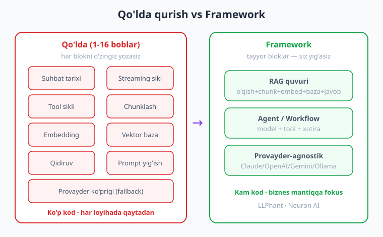
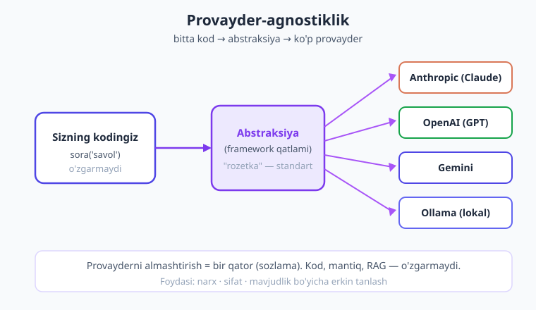
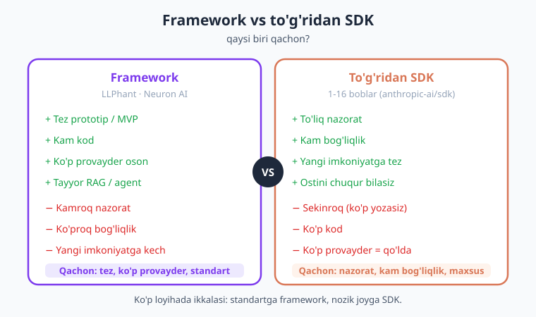

# 17 — PHP GenAI frameworklari (LLPhant, Neuron AI)

[⬅️ Oldingi: 16 — Kesh va xarajat](./16-kesh-xarajat.md) · [🏠 Kitob boshi](./README.md) · [Keyingi: 18 — Laravel integratsiya ➡️](./18-laravel-integratsiya.md)

> **Bu bobda:** 1-16 boblarda biz suhbatni, tool chaqirishni, RAG quvurini, embeddingni — hammasini **qo'lda**, asosiy SDK ustida qurdik. Bu o'rgatuvchi, lekin katta loyihada **takrorlanishni** keltiradi. Endi tanishamiz: **PHP GenAI frameworklari** — tayyor bloklardan tuzilgan "konstruktor", LangChain (Python/JS) ning PHP olamidagi ekvivalentlari. Ikkitasini ko'ramiz: **LLPhant** (RAG/quvur uslubi) va **Neuron AI** (agentlar/workflow). Asosiy g'oya — **provayder-agnostiklik** (bitta kod, ko'p provayder) va **kam kod bilan ko'p ish**. Eng muhim savol: *qachon framework, qachon to'g'ridan SDK?* — buni aniq jadval bilan hal qilamiz.

---

## Muammo: hammasini qo'lda qurdik

Avvalgi 16 bobni bir nazardan o'tkazaylik. Biz nima yasadik?

- **Suhbat** (4-bob) — `messages` massivini o'zimiz to'ldirdik, tarixni o'zimiz saqladik.
- **Streaming** (5-bob) — hodisalarni o'zimiz aylanma (loop) bilan o'qidik.
- **Tool calling** (9–10-bob) — tool ta'rifini, chaqiruv-natija siklini o'zimiz yozdik.
- **RAG** (13–15-bob) — hujjatni bo'laklarga bo'lish, embedding, vektor bazaga yozish, qidirish, promptga qo'shish — **har bir qadamni o'zimiz** qurdik.
- **Kesh va xarajat** (16-bob) — narx hisoblash, kesh, model tanlash — yana o'zimiz.

Bu yondashuvning **kuchli tomoni** bor: siz har bir g'ildirakni o'z qo'lingiz bilan yasadingiz, demak ostida nima borligini **tushunasiz**. Kitob aynan shuning uchun shunday tuzilgan — avval poydevor.

Lekin endi bir necha **haqiqiy** muammo paydo bo'ladi:

1. **Takrorlanish.** Har yangi loyihada xuddi shu RAG quvurini, xuddi shu tool siklini qaytadan yozasiz. Bu — vaqt va xato.
2. **Provayderga bog'lanish.** Bizning kodimiz `Anthropic\Client` ga to'g'ridan bog'langan. Ertaga "Gemini'ga o'tamiz" desangiz — o'nlab joyni o'zgartirasiz.
3. **Standart bloklar o'zi yo'q.** Hujjat o'qish (PDF/Word), bo'laklarga bo'lish, ko'p hil vektor bazaga ulanish — har birini noldan yozish ko'p mehnat.

> **Hayotiy o'xshatish — mebel.** Avvalgi boblar — bu "har taxtani o'zingiz yo'nib, mix qoqib stol yasash". Buni o'rganish zarur: yog'och qanday ishlashini bilasiz. Lekin har safar shunday qilsangiz — sekin. **Framework** — bu tayyor, o'lchovli **mebel bloklari**: tortma, oyoq, qopqoq — siz faqat yig'asiz. Tezroq, lekin ichida nima borligini avval bilganingiz uchun, sinsa ham tuzata olasiz.

!!! note "Eslatma"
    Bu bobda biz frameworklarni **kontseptual** ko'rsatamiz — umumiy oqim va g'oyani. LLPhant va Neuron AI tez rivojlanmoqda va aniq metod nomlari versiyadan versiyaga o'zgaradi. Shuning uchun **aniq API imzosini yoddan yozmaymiz** — o'rniga oqimni tushuntiramiz va har doim **rasmiy hujjatga** ishora qilamiz. Asosiy SDK kodi (taqqoslash uchun) esa — 1-16 boblardagi tasdiqlangan API.

---

## Framework nima beradi?

**Framework** (bu kontekstda — GenAI framework) — bu LLM ilovasi uchun **tayyor, qayta ishlatiladigan bloklar to'plami**. U sizga bir necha narsani beradi:

- **Provayder-agnostik abstraktsiya** — bitta kod yozasiz, ostida Claude, OpenAI, Gemini yoki lokal (Ollama) ishlashi mumkin. Provayderni almashtirish — bir-ikki qator.
- **Tayyor RAG quvuri** — hujjat o'qish → bo'laklarga bo'lish → embedding → vektor bazaga yozish → qidirish — hammasi tayyor zveno sifatida.
- **Agent / workflow** — model + tool + xotira + qaror siklini o'zi boshqaradigan tayyor mexanizm (11-bobdagi agentni eslang — endi tayyor).
- **Vektor store ulanishi** — pgvector, Qdrant, Pinecone, Meilisearch va boshqalarga tayyor "ulagich"lar.
- **Hujjat o'qish** — PDF, Word, matn, veb-sahifani o'qib, tozalab, bo'laklarga ajratuvchi yordamchilar.
- **Xotira va chat history** — suhbat tarixini saqlash/yuklash tayyor.

Boshqacha aytganda: 1-16 boblarda **qo'lda** yozgan narsalaringizning ko'pini framework **tayyor** beradi.



!!! tip "Maslahat"
    Framework — kod **yozmaslik** uchun emas, **kamroq** yozish va **standart** narsalarga vaqt sarflamaslik uchun. Siz biznes mantiqqa (sizning ilovangizga xos qism) e'tibor berasiz, "g'ildirak"ni qayta ixtiro qilmaysiz.

### Framework ichidagi tushunchalar — atamalar lug'ati

Frameworklarning hujjatlarini o'qishni boshlaganingizda, bir nechta takrorlanadigan atama uchraydi. Ularni avval tushunib oling — bularning **hammasini** biz allaqachon qo'lda ko'rganmiz, faqat endi yangi nom bilan:

- **Provider / driver (provayder/drayver)** — qaysi LLM bilan gaplashishni belgilaydigan qism (Claude, OpenAI, Gemini, Ollama). Biz buni `Anthropic\Client` deb yozgandik (2-bob).
- **Chain / pipeline (zanjir/quvur)** — qadamlarni ketma-ket ulash: kirish → qadam1 → qadam2 → chiqish. RAG quvuri (15-bob) — aynan shu.
- **Loader / splitter (yuklovchi/bo'luvchi)** — hujjatni o'qib (PDF/Word/matn), kichik bo'laklarga (chunk) ajratuvchi qism (15-bobda qo'lda yozdik).
- **Embedder (embeddinglovchi)** — matnni vektorga aylantiruvchi (13-bob).
- **Vector store (vektor ombor)** — vektorlarni saqlab, o'xshashlik bo'yicha qidiradigan baza ulagichi (14-bob — pgvector).
- **Retriever (topuvchi)** — savolga eng mos bo'laklarni topib beruvchi (RAG'ning "R" qismi).
- **Agent / tool** — model + vositalar + qaror sikli (9–11-bob).
- **Memory (xotira)** — suhbat tarixi va holatni saqlash (4-bob).

> **Hayotiy o'xshatish — yangi til, eski tushuncha.** Bu xuddi bir hunarni o'rganib bo'lib, keyin uni boshqa shevada eshitishga o'xshaydi. "Bo'laklash" endi "splitter", "vektor baza" endi "vector store" deyiladi — lekin ish **o'sha**. Siz qo'lda o'rganganingiz uchun yangi nomlarni tez tanib olasiz.

!!! note "Eslatma"
    Aynan shu sabab kitob frameworkni **oxirida** o'rgatadi. Agar siz birinchi kundan frameworkni ishlatib boshlaganingizda, "retriever" yoki "vector store" so'zlari sehrli qutilarday tuyulardi. Endi esa ularning ichida nima borligini bilasiz — bu sizni frameworkning **xo'jayini** qiladi, quli emas.

---

## LLPhant — LangChain uslubidagi framework

**LLPhant** — PHP uchun GenAI frameworki, g'oyasi va tuzilishi bilan mashhur **LangChain** (Python/JS) ga o'xshaydi. U ayniqsa **RAG** va **quvur** (pipeline) uslubidagi ishlar uchun kuchli.

O'rnatish (Composer orqali):

```bash
composer require theodo-group/llphant
```

LLPhant qo'llab-quvvatlaydigan provayderlar (jumladan): **OpenAI, Anthropic (Claude), Mistral, Ollama** (lokal). Ya'ni siz Claude'da yozgan kodni keyinroq OpenAI yoki lokal modelga osongina o'tkaza olasiz.

Asosiy imkoniyatlari:

- **Chat** — oddiy suhbat (bizning 4-bobdagi ish, lekin abstraksiya orqali).
- **Embedding** — matnni vektorga aylantirish (13-bob).
- **RAG quvuri** — hujjat o'qish (PDF/Word/matn) → bo'laklarga bo'lish (chunk) → embedding → vektor bazaga yozish → savol bo'yicha qidirish → javob (15-bobning **hammasi** bitta quvurda).
- **Agent / tool** — modelga vositalar berish va sikl.

> **Hayotiy o'xshatish — RAG "konvent lentasi".** 15-bobda biz hujjatni qo'lda bo'laklab, qo'lda embedding qilib, qo'lda bazaga yozdik. LLPhant — bu **konveyer lentasi**: bir uchidan hujjatni qo'yasiz, lenta o'zi bo'laklaydi, embeddinglaydi, saqlaydi. Ikkinchi uchidan savol berasiz — javob chiqadi. Siz lentani **sozlaysiz**, har detalni qo'lda surmaysiz.

### Kontseptual misol (LLPhant — RAG oqimi)

!!! warning "Ehtiyot bo'ling — bu kontseptual oqim"
    Quyidagi kod **g'oyani** ko'rsatadi, aniq metod nomlari emas. LLPhant versiyalari orasida klass/metod nomlari o'zgaradi. **Aniq API uchun har doim [LLPhant rasmiy hujjatiga](https://github.com/theodo-group/LLPhant) qarang.** Bu yerda muhimi — **necha bosqich** va **necha qator** kodda RAG quvuri yig'ilishini ko'rish.

Quyida RAG quvurining **kontseptual** ko'rinishi (LLPhant uslubida — taxminiy):

```php
<?php
require __DIR__ . '/vendor/autoload.php';

// DIQQAT: bu KONTSEPTUAL oqim — aniq klass nomlari uchun LLPhant hujjatiga qarang.
// G'oya: hujjatni o'qish -> bo'laklash -> embedding -> vektor baza -> savol -> javob.

// 1) Hujjatni o'qib, bo'laklarga ajratamiz (PDF/matn -> kichik bo'laklar)
$bolaklar = hujjatniOqibBolakla('qollanma.pdf');

// 2) Vektor bazaga yozamiz (embedding avtomatik — framework qiladi)
$vektorBaza = vektorBazaYarat();        // masalan, pgvector ulagichi
$vektorBaza->saqla($bolaklar);          // embedding + yozish bitta qadamda

// 3) RAG so'rovi: savol -> tegishli bo'laklar topiladi -> javob yoziladi
$rag = ragQuvurYarat($vektorBaza);      // provayder: Claude/OpenAI/Ollama
$javob = $rag->sora('Qaytarish siyosatimiz qanday?');

echo $javob;
```

Buni 15-bob bilan solishtiring: u yerda biz **yuzlab qator** yozgandik (chunklash, embedding sikli, baza sxemasi, qidiruv SQL, prompt yig'ish). LLPhant bilan **o'sha mantiq** bir necha qatorga jamlanadi. Sehr yo'q — framework ostida **xuddi 15-bobdagi** ishni bajaradi, faqat siz uchun.

!!! info "Boshqa provayderda"
    LLPhant'da provayderni almashtirish — bu odatda **konfiguratsiya/klass** o'zgarishi. Misol RAG mantiqi o'zgarmaydi; faqat "qaysi model" qismi boshqasiga almashadi. Bu — provayder-agnostiklikning amaliy foydasi.

---

## Neuron AI — agentik framework

**Neuron AI** — PHP uchun **agentik** (agentlarga yo'naltirilgan) framework. Agar LLPhant ko'proq "RAG/quvur" haqida bo'lsa, Neuron AI ko'proq **agent, workflow va tool** haqida.

O'rnatish:

```bash
composer require neuron-core/neuron-ai
```

Qo'llab-quvvatlaydigan provayderlar (jumladan): **OpenAI, Anthropic (Claude), Gemini, Mistral**. Uning bayroqdor xususiyati — **provayderni bir qatorda almashtirish**: agentingizning mantiqi o'zgarmaydi, faqat "qaysi provayder" satri almashadi.

Asosiy imkoniyatlari:

- **Agent** — model + tool + qaror sikli (11-bobdagi agent g'oyasi, tayyor).
- **RAG** — hujjatlar bo'yicha savol-javob.
- **Workflow** — bir necha qadamdan iborat murakkab oqim (qadamlar ketma-ketligi, shartlar, tarmoqlanish).
- **Vektor store** — vektor bazalarga ulanish.
- **Xotira (memory) va chat history** — suhbat va holatni saqlash.

> **Hayotiy o'xshatish — yordamchi-xodim.** Neuron AI agenti — bu "vazifa beradigan xodim" kabi: unga maqsad va bir nechta **asbob** (tool) berasiz, u o'zi qaror qiladi — qaysi asbobni qachon ishlatish, qachon to'xtash. Siz har qadamni buyurmaysiz — natijani so'raysiz.

### Kontseptual misol (Neuron AI — agent oqimi)

!!! warning "Ehtiyot bo'ling — bu kontseptual oqim"
    Quyidagi kod **g'oyani** ko'rsatadi, aniq imzolar emas. **Aniq API uchun [Neuron AI rasmiy hujjatiga](https://docs.neuron-ai.dev) qarang.** Bu yerda muhimi — agent qanday **tuziladi** va provayder qanday **almashtirilishi** mumkinligi.

```php
<?php
require __DIR__ . '/vendor/autoload.php';

// DIQQAT: KONTSEPTUAL oqim — aniq klass/metod nomlari uchun Neuron AI hujjatiga qarang.
// G'oya: agentga provayder + tool berasiz, u o'zi qaror qilib, javob qaytaradi.

// 1) Agent yaratamiz va provayderni belgilaymiz (bu yer almashtiriladigan QATOR)
$agent = agentYarat()
    ->provayder('anthropic', 'claude-opus-4-8')   // <- ertaga 'openai'/'gemini' qilib o'zgartirasiz
    ->tool(obHavoTool())                           // 9-10-bobdagi tool g'oyasi, tayyor shaklda
    ->xotira(suhbatXotirasi());                    // chat history avtomatik

// 2) Foydalanuvchi savolini beramiz — agent o'zi tool chaqiradi, javob qaytaradi
$javob = $agent->sora('Toshkentda ob-havo qanday? Issiqmi?');

echo $javob;
```

E'tibor bering: `provayder('anthropic', ...)` qatorini `provayder('openai', ...)` ga o'zgartirsangiz — qolgan mantiq **o'zgarmaydi**. Bu — agentik frameworkning kuchi: siz **nima qilish** kerakligini yozasiz, **qaysi model bilan** — bu sozlama bo'lib qoladi.

---

## Provayder-agnostiklik — eng katta g'oya

Frameworklarning markaziy va'dasi — **provayder-agnostiklik** (provider-agnostic). Bu nima degani?

Sizning kodingiz to'g'ridan-to'g'ri `Anthropic\Client` ga emas, balki **abstraksiyaga** (umumiy interfeysga) tayanadi. Framework ostida "qaysi provayder" deganni sozlama bilan hal qiladi. Natijada **bitta kod** turli provayderlar bilan ishlaydi.



> **Hayotiy o'xshatish — rozetka.** Uyingizdagi rozetka — standart. Telefon, choynak, noutbuk — har xil qurilma, lekin hammasi **o'sha rozetkaga** ulanadi. Abstraksiya — shu rozetka. Provayder (Claude, OpenAI, Gemini) — turli qurilma. Siz "qurilma"ni almashtirasiz, lekin "rozetka" (kodingiz) o'zgarmaydi.

**Nega bu muhim?** Uchta amaliy sabab:

1. **Narx.** Ertaga boshqa provayder o'sha sifatni arzonroqqa bersa — bir qatorda o'tasiz (16-bobdagi tejamkorlik g'oyasi).
2. **Sifat.** Bir vazifada bir model, boshqasida boshqasi yaxshiroq bo'lishi mumkin — sinab ko'rish oson.
3. **Mavjudlik.** Bir provayderda uzilish (yoki tezkorlik cheklovi) bo'lsa — boshqasiga o'tib qolasiz. 8-bobdagi "fallback" g'oyasi, ammo provayder darajasida.

!!! note "Eslatma"
    Provayder-agnostiklik — frameworksiz ham mumkin. 8-bobda biz `soraber()` da fallback yozgandik. Lekin framework buni **standart** qiladi: siz bu mexanizmni har safar qaytadan yozmaysiz. Bu — frameworkning asosiy qulayligi.

### Amaliy senariy — provayderni almashtirish

Buni hayotiy misol bilan ko'raylik. Tasavvur qiling, ilovangiz Claude bilan ishlayapti. Bir kun kelib quyidagilardan biri yuz beradi:

- Boshqaruv "xarajatni kamaytiramiz, ko'p so'rovni arzonroq provayderga o'tkazamiz" deydi;
- Yangi loyihada mijoz "biz lokal model (Ollama) ishlatamiz, ma'lumot tashqariga chiqmasin" deydi;
- Bitta vazifada boshqa provayder sezilarli yaxshiroq natija beryapti.

**Frameworksiz** (to'g'ridan SDK) bu o'zgarish nimani talab qiladi? Kodingizda `Anthropic\Client`, `messages->create(...)`, `$message->content[0]->text` kabi **Anthropic'ga xos** chaqiruvlar **ko'p joyda** tarqalgan. Har birini topib, yangi provayderning shakliga moslashtirasiz. Bu — xatoga moyil, sekin ish (agar 8-bobdagidek interfeys orqali yozmagan bo'lsangiz).

**Framework bilan** esa o'zgarish odatda **bitta joyda** — sozlamada bo'ladi. Mantiqiy farqni quyidagi jadval ko'rsatadi:

| Vazifa | Frameworksiz (tarqoq SDK) | Framework bilan |
|---|---|---|
| Provayderni topish | Ko'p faylda `Anthropic\Client` | Bitta sozlama qatori |
| Chaqiruv shakli | Har provayderda boshqacha | Abstraksiya bir xil saqlaydi |
| Javobni o'qish | `content[0]->text` (Anthropic) | Framework yagona shaklga keltiradi |
| Xato xavfi | Yuqori (ko'p joy) | Past (bir joy) |

!!! warning "Ehtiyot bo'ling"
    Almashtirish "bir qator" bo'lsa-da, **natijalar bir xil bo'lmaydi.** Har model boshqacha "fikrlaydi" — promptingiz Claude uchun sozlangan bo'lsa, OpenAI'da boshqacha javob berishi mumkin. Provayderni almashtirgach, **har doim qayta sinang** (21-bob — testlash va baholash). Framework kodni almashtirishni osonlashtiradi, lekin **sifatni** baribir siz tekshirasiz.

---

## Framework bilan RAG — 15-bobni qayta ko'ramiz

Eng yaxshi farqni RAG misolida ko'ramiz, chunki 15-bobda biz uni **to'liq qo'lda** qurgandik. Eslaylik, 15-bobda RAG quvuri quyidagi qadamlardan iborat edi:

| Qadam | 15-bobda (qo'lda) |
|---|---|
| Hujjatni o'qish | `file_get_contents`, tozalash — o'zimiz |
| Bo'laklash (chunk) | bo'lakka bo'lish mantiqini o'zimiz yozdik |
| Embedding | har bo'lak uchun embedding so'rovi — sikl, o'zimiz |
| Vektor bazaga yozish | pgvector sxemasi, `INSERT` — o'zimiz |
| Qidirish | o'xshashlik SQL (`<=>`) — o'zimiz |
| Promptga qo'shish | topilgan bo'laklarni promptga yig'ish — o'zimiz |
| Javob | `messages->create(...)` — o'zimiz |

Bu — kuchli o'rganish, lekin har loyihada qaytariladigan **ko'p kod**. Framework bilan bu **o'sha qadamlar** tayyor zvenolarga aylanadi:

```php
<?php
// KONTSEPTUAL — framework bilan RAG (g'oya, aniq API uchun hujjatga qarang)

$baza = vektorBazaYarat();                 // ulagich (pgvector/Qdrant/...)
$baza->saqla(hujjatniOqibBolakla('faq.pdf'));   // o'qish + chunk + embedding + yozish

$rag   = ragQuvurYarat($baza);             // qidirish + prompt + model — tayyor
$javob = $rag->sora('Kafolat muddati qancha?');
echo $javob;
```

Diqqat — bu **sehr emas**. Framework ostida **aynan 15-bobdagi** qadamlarni bajaradi. Siz ularni endi tushunasiz, demak framework noto'g'ri javob bersa yoki sekin ishlasa — **qayerda muammo borligini** bilasiz. Aynan shuning uchun kitob avval qo'lda qurishni o'rgatdi.

!!! tip "Maslahat"
    Framework RAG'ni qisqartiradi, lekin **sifatni** baribir siz nazorat qilasiz: bo'lak o'lchami (chunk size), nechta bo'lak topish (top-k), prompt shakli (15-bob). Bular framework'da ham **sozlama** sifatida turadi — ularni 13–15-boblardagi tushuncha bilan to'g'ri qo'yasiz.

---

## Framework vs to'g'ridan SDK — qaysi biri qachon?

Bu — bu bobning **eng muhim** qismi. Framework har doim yaxshi emas; to'g'ridan SDK (1-16 boblardagi yo'l) ham har doim yaxshi emas. Tanlov vaziyatga bog'liq.



| Mezon | **Framework** (LLPhant / Neuron AI) | **To'g'ridan SDK** (1-16 boblar) |
|---|---|---|
| **Tezlik (prototip)** | Tez — tayyor bloklar | Sekinroq — o'zingiz yozasiz |
| **Kod miqdori** | Kam | Ko'proq |
| **Ko'p provayder** | Oson (abstraksiya tayyor) | Qo'lda qilasiz (8-bob fallback) |
| **Tayyor RAG/agent** | Bor | O'zingiz qurasiz |
| **To'liq nazorat** | Kamroq (framework qoidalari) | To'liq — har detalni boshqarasiz |
| **Bog'liqlik (dependency)** | Ko'proq (framework + uning paketlari) | Kam (faqat SDK) |
| **Yangi imkoniyatga kirish** | Kutish kerak (framework qo'shguncha) | Darhol (SDK yangilanishi bilan) |
| **O'rganish chuqurligi** | Yuzaki bo'lib qolishi mumkin | Chuqur — ostini bilasiz |

**Qachon framework?**

- Tez prototip / MVP kerak;
- Standart RAG yoki agent quvuri yetarli;
- Bir necha provayderni qo'llab-quvvatlash kerak;
- Jamoa katta, "g'ildirak"ni qayta ixtiro qilishni xohlamaysiz.

**Qachon to'g'ridan SDK?**

- Har detalni to'liq nazorat qilish kerak (maxsus mantiq, nostandart oqim);
- Bog'liqlikni minimal saqlamoqchisiz;
- Provayderning **eng yangi** imkoniyatiga (masalan, Opus 4.8 ning yangi `outputConfig`/`thinking`) darhol kirish kerak;
- Ilovangiz bitta provayderga qurilgan va ko'chirish rejada yo'q.

!!! note "Eslatma"
    Tanlov "yo u, yo bu" emas. Ko'p loyihada **ikkalasi** ham bo'ladi: oddiy RAG uchun framework, maxsus, nozik joy uchun to'g'ridan SDK. Muhimi — har birining kuchli/zaif tomonini bilib, ongli tanlash.

---

## Framework tanlash: LLPhant yoki Neuron AI?

Ikkalasi ham yaxshi — tanlov ishingiz xususiyatiga bog'liq:

- **LLPhant** — agar asosiy ishingiz **RAG** va **hujjat bilan ishlash** bo'lsa (savol-javob baza, qo'llanma chatboti). LangChain'dan kelganlar uchun tanish uslub.
- **Neuron AI** — agar asosiy ishingiz **agent**, **tool**, **workflow** (ko'p qadamli avtomatlashtirish) bo'lsa, va provayderni juda oson almashtirmoqchi bo'lsangiz.

> **Hayotiy o'xshatish — asboblar do'koni.** LLPhant — bu yaxshi jihozlangan "kutubxona/arxiv" tizimi: hujjatlarni saqlash, izlash, javob topish uchun. Neuron AI — bu "robot-yordamchi" qurish to'plami: vazifani o'zi bajaradigan agent uchun. Ikkalasi ham foydali, lekin har xil ish uchun.

**Boshqalar (qisqa eslatma).** PHP olamida boshqa kichik kutubxonalar ham bor (alohida provayder mijozlari — masalan `openai-php/client`, 19-bobda), va Symfony AI kabi yangi tashabbuslar paydo bo'lmoqda. Bu maydon **tez o'zgaryapti** — yangi paketlar chiqadi, eskisi to'xtaydi. Shuning uchun tanlashdan oldin paketning **faolligini** (yangilanishlar, GitHub yulduzlari, jamoa) tekshiring.

!!! tip "Maslahat"
    Framework tanlashda **3 narsani** ko'ring: (1) sizga kerak provayderni qo'llab-quvvatlaydimi; (2) sizga kerak vektor baza uchun ulagichi bormi; (3) loyiha **faolmi** (oxirgi commit, ochiq muammolar). Eskirgan framework — kelajakdagi muammo.

---

## Ogohlantirish: framework — qora quti emas

Framework qulay, lekin bir necha **xavfini** unutmang:

1. **Qora quti tuzog'i.** Agar siz frameworkni faqat "ishlatib" qolsangiz va ostida nima borligini bilmasangiz — muammo chiqqanda (sekin javob, noto'g'ri natija, qimmat hisob) **nima qilishni bilmaysiz**. Aynan shuning uchun kitob avval qo'lda o'rgatdi: framework — bu **siz biladigan** narsaning qisqartmasi bo'lsin, **bilmaydigan** narsaning yashirinchasi emas.
2. **Bog'liqlik (dependency).** Framework — bu sizning loyihangizga qo'shilgan katta tashqi paket (yana o'z bog'liqliklari bilan). U yangilanmay qolsa, xavfsizlik teshigi chiqsa yoki sizga kerak provayderni tashlasa — siz bilan bog'lab qolasiz.
3. **Eskirish xavfi.** Bu maydon juda tez o'zgaryapti. Bugun mashhur framework ertaga to'xtab qolishi mumkin. To'g'ridan SDK esa odatda provayderning o'zi tomonidan qo'llab-quvvatlanadi.
4. **Abstraksiya narxi.** Abstraksiya — qulaylik, lekin u provayderning **eng yangi**, o'ziga xos imkoniyatiga (masalan, Claude'ning `thinking: adaptive`) kirishni qiyinlashtirishi yoki kechiktirishi mumkin.

!!! danger "Xavfsizlik"
    Frameworkdan foydalansangiz ham, **xavfsizlik qoidalari o'zgarmaydi**: API kalitni hech qachon kodga yozmang — muhit o'zgaruvchisidan (`getenv('ANTHROPIC_API_KEY')`) oling. Framework kalitni odatda **konfiguratsiya** orqali oladi — uni ham `.env` dan bering, kodga emas. Foydalanuvchi kiritgan matnga ishonmang (20-bob — prompt injection framework'da ham muammo).

---

## To'liq misol: to'g'ridan SDK (taqqoslash uchun)

Frameworkning qadrini his qilish uchun, **o'sha** oddiy ishni — bitta savol-javobni — bizning **tasdiqlangan, ishlaydigan** asosiy SDK kodi bilan ko'rsatamiz. Bu — frameworkning ostida turadigan "haqiqiy" qatlam. 2-bobdagi birinchi so'rovni eslang:

```php
<?php
require __DIR__ . '/vendor/autoload.php';

use Anthropic\Client;

// API kalit MUHIT O'ZGARUVCHISIDAN — kodga yozma!
$client = new Client(apiKey: getenv('ANTHROPIC_API_KEY'));

$message = $client->messages->create(
    model: 'claude-opus-4-8',
    maxTokens: 1024,
    system: 'Sen foydali PHP yordamchisisan. O\'zbek tilida qisqa javob ber.',
    messages: [
        ['role' => 'user', 'content' => 'RAG nima? Bir jumlada tushuntir.'],
    ],
);

// Javob bloklaridan matnni o'qiymiz
echo $message->content[0]->text;
```

Bu — to'liq nazorat: har parametr (`model`, `maxTokens`, `system`) sizning qo'lingizda, hech qanday qatlam yashirmaydi. Framework esa **shu kabi** chaqiruvni o'rab, sizdan "qaysi model" va "qaysi savol"ni so'raydi, qolganini o'zi qiladi.

Endi g'oyaviy taqqoslash. **To'g'ridan SDK** bilan ko'p provayderni qo'llab-quvvatlash uchun siz 8-bobdagidek qo'lda "ko'prik" yozasiz:

```php
<?php
// KONTSEPTUAL — frameworksiz provayder-agnostiklik (8-bob fallback g'oyasi)
// Har provayder uchun bitta umumiy interfeys yozasiz va ichini o'zingiz to'ldirasiz.

interface LlmProvayder
{
    public function sora(string $savol): string;
}

// Claude uchun amalga oshirish (tasdiqlangan SDK ichida)
final class ClaudeProvayder implements LlmProvayder
{
    public function __construct(private Client $client) {}

    public function sora(string $savol): string
    {
        $m = $this->client->messages->create(
            model: 'claude-opus-4-8',
            maxTokens: 1024,
            messages: [['role' => 'user', 'content' => $savol]],
        );
        return $m->content[0]->text;
    }
}

// OpenAI/Gemini uchun ham xuddi shunday klass yozasiz (har biri o'z SDK'si bilan).
// Ilovangiz LlmProvayder interfeysiga tayanadi -> provayderni almashtirish oson.
```

Mana shu interfeys + amalga oshirish g'oyasi — frameworkning ostidagi **asosiy fikr**. Framework aynan shuni siz uchun **tayyor** beradi (ko'p provayder uchun klasslarni o'zi yozib qo'ygan). Demak: agar sizga bittagina provayder kerak bo'lsa — to'g'ridan SDK soddaroq; agar ko'p provayder va tayyor RAG/agent kerak bo'lsa — framework vaqtingizni tejaydi.

!!! example "Misol — qaror"
    "Bizning kompaniya FAQ'i bo'yicha chatbot kerak, faqat Claude bilan, lekin nozik prompt sozlash bilan" → **to'g'ridan SDK** (15-bob RAG + maxsus prompt). "Bir necha provayderni sinab ko'radigan, tez prototip, standart RAG" → **framework** (LLPhant). "Ko'p qadamli avtomatlashtirish, agent, tool" → **framework** (Neuron AI).

---

## Xulosa

- **Muammo:** 1-16 boblarda biz suhbat, tool, RAG, kesh — hammasini **qo'lda** qurdik. Bu o'rganish uchun zarur, lekin katta loyihada **takrorlanish** va **provayderga bog'lanish** keltiradi.
- **Framework** — tayyor, qayta ishlatiladigan bloklar: provayder-agnostik abstraktsiya, tayyor RAG quvuri, agent/workflow, vektor store ulanishi, hujjat o'qish, xotira. "Har taxtani o'zi yo'nish" o'rniga "tayyor mebel yig'ish".
- **LLPhant** (`theodo-group/llphant`) — LangChain uslubidagi framework; OpenAI/Anthropic/Mistral/Ollama; ayniqsa **RAG** va hujjat bilan ishlash uchun kuchli.
- **Neuron AI** (`neuron-core/neuron-ai`) — **agentik** framework; OpenAI/Anthropic/Gemini/Mistral; **provayderni bir qatorda almashtirish**, agent, workflow, vektor store, xotira.
- **Provayder-agnostiklik** — markaziy g'oya: kod abstraksiyaga tayanadi, provayderni almashtirish bir qator bo'ladi. Foydasi: narx, sifat, mavjudlik bo'yicha erkin almashtirish.
- **Framework vs SDK:** framework — tez prototip, kam kod, ko'p provayder, tayyor RAG; to'g'ridan SDK — to'liq nazorat, kam bog'liqlik, yangi imkoniyatga tez kirish. Tanlov vaziyatga bog'liq, ko'pincha **ikkalasi** ishlatiladi.
- **Ogohlantirish:** framework — qora quti emas. Ostida nima borligini bilish kerak (shuning uchun avval qo'lda o'rgandik). Bog'liqlik va eskirish xavfini, abstraksiya narxini hisobga oling. Xavfsizlik (kalit, injection) framework'da ham o'z kuchida.

---

## Amaliy mashqlar

1. **LLPhant bilan RAG (kontseptual reja).** Bir A4 hujjatni (masalan, kompaniya FAQ'i) RAG bazaga aylantirish uchun LLPhant quvurining qadamlarini **ketma-ket** yozib chiqing (o'qish → bo'laklash → embedding → saqlash → so'rov). Har qadam yonida 15-bobdagi **qo'lda** ekvivalentini ko'rsating. Xulosa: necha qator "qo'lda" kod framework'da necha qatorga qisqaradi? (Kodni LLPhant **rasmiy hujjati** bo'yicha aniqlashtiring — yoddan yozmang.)

2. **Neuron AI agenti (kontseptual reja).** Bir agent loyihalang: maqsadi — foydalanuvchi savoliga javob berib, kerak bo'lsa **ob-havo** va **valyuta kursi** toollarini chaqirsin. Agar tuzilishini chizing (provayder → tool'lar → xotira) va 11-bobdagi qo'lda agent loop bilan solishtiring. Provayderni `anthropic` dan boshqasiga o'zgartirsangiz, qaysi qator(lar) o'zgaradi?

3. **Framework vs SDK tahlil.** Uchta turli loyiha tasvirlang: (a) bitta provayderli nozik chatbot; (b) ko'p provayderli tez MVP; (c) ko'p qadamli avtomatlashtirish agenti. Har biri uchun **framework**mi yoki **to'g'ridan SDK**mi to'g'ri ekanini tanlang va bu bobdagi jadval mezonlari (tezlik, nazorat, bog'liqlik, yangi imkoniyat) bilan qaroringizni asoslang.

4. **Provayder almashtirish (o'z interfeysingiz).** Frameworksiz, to'g'ridan SDK ustida `LlmProvayder` interfeysini yozing (`sora(string): string`) va kamida **ikkita** amalga oshirish bering: `ClaudeProvayder` (tasdiqlangan SDK bilan, ishlaydigan) hamda bitta "soxta" `EchoProvayder` (savolni qaytaradigan — test uchun). Ilovangiz faqat interfeysga tayansin. Endi: bir joyni o'zgartirib provayderni almashtirib ko'ring. Bu mashq frameworkning ostidagi g'oyani his qildiradi.

5. **Framework faolligini baholash.** LLPhant va Neuron AI ning GitHub sahifalarini ochib, har biri uchun: oxirgi commit sanasi, ochiq muammolar soni, qo'llab-quvvatlanadigan provayderlar va vektor bazalar ro'yxatini yozib chiqing. Shu ma'lumotga tayanib, "agar bugun loyiha boshlasam, qaysisini tanlardim va nega?" degan savolga bir paragraf javob yozing.

---

[⬅️ Oldingi: 16 — Kesh va xarajat](./16-kesh-xarajat.md) · [🏠 Kitob boshi](./README.md) · [Keyingi: 18 — Laravel integratsiya ➡️](./18-laravel-integratsiya.md)
