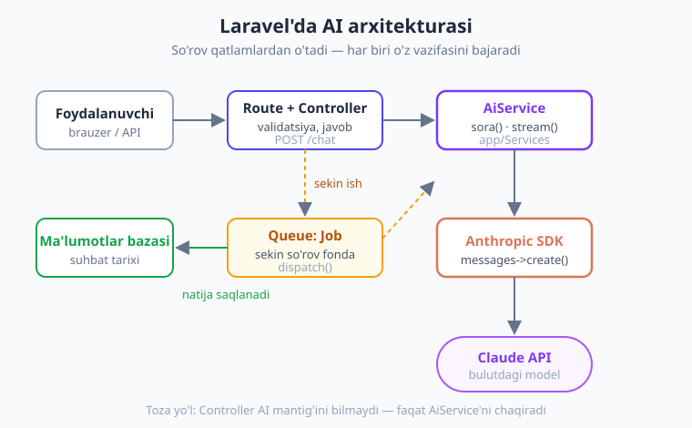
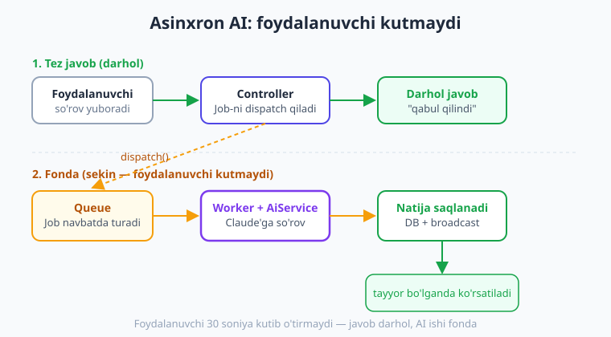
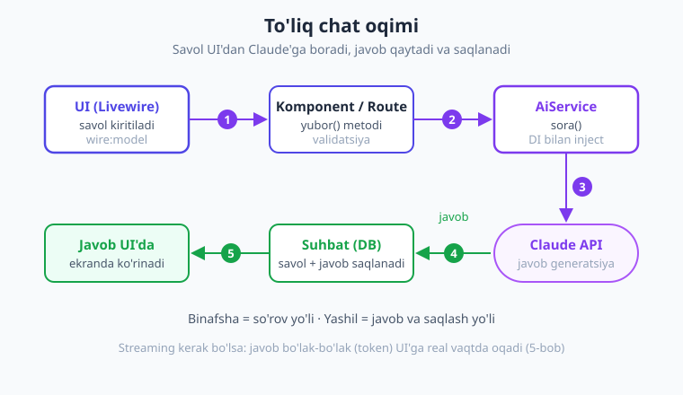

# 18 — Laravel'ga integratsiya

[⬅️ Oldingi: 17 — Frameworklar](./17-frameworklar.md) · [🏠 Kitob boshi](./README.md) · [Keyingi: 19 — Boshqa provayderlar ➡️](./19-boshqa-provayderlar.md)

> **Bu bobda:** endigacha biz AI'ni alohida PHP skriptlarda o'rgandik. Endi uni **haqiqiy Laravel ilovasiga** professional tarzda joylashtiramiz. Siz **AiService** (toza service klass), uni **service container**'ga bog'lash, **Controller + Route**, **streaming endpoint**, eng muhimi — sekin so'rovni foydalanuvchini kuttirmasdan bajaradigan **Queue (navbat) Job**, suhbatlarni **bazada saqlash**, Eloquent model atributini AI bilan to'ldirish va oddiy **Livewire chat** UI'sini o'rganasiz. Oxirida hammasini birlashtirgan ishlaydigan "AI yordamchi" skeletini yig'amiz.

---

## Nega Laravel'da AI? — "AI bir xizmatdir"

Tasavvur qiling, restoran ochdingiz. Sizda **oshpaz** bor — u taom tayyorlaydi. Lekin oshpaz mehmonni kutib olmaydi, hisob-kitobni ham yuritmaydi, idishni ham yuvmaydi. Uning bitta vazifasi bor: **taom pishirish**. Ofitsiant, kassir, oshxona — har biri o'z ishini qiladi, oshpazga faqat buyurtma yetkaziladi.

Laravel ilovangizda **AI ham xuddi shunday oshpaz**. Uning ishi — savolga aqlli javob berish. U brauzer so'rovini o'qimasligi, ma'lumotlar bazasi bilan ishlamasligi, foydalanuvchini autentifikatsiya qilmasligi kerak. Bularning hammasi Laravel'ning o'z qatlamlari (Controller, Model, Middleware) zimmasida. AI esa **alohida, toza xizmat** (service) bo'lib turadi va kerak bo'lganda chaqiriladi.

Bu bob — kitobning 1-16 boblaridagi bilimingizni (so'rov yuborish, streaming, strukturali chiqish, tool use, RAG) **Laravel arxitekturasiga to'g'ri joylashtirish** haqida. Yangi AI tushunchasi deyarli yo'q — biz bilganlarimizni **toza, kengaytiriladigan, sinaladigan** tarzda tashkil qilamiz.

> **Hayotiy o'xshatish.** AiService — oshpaz. Controller — ofitsiant (buyurtmani oladi, taomni keltiradi). Queue Job — "katta to'y buyurtmasi": ofitsiant mehmonni kuttirmaydi, oshpaz uni fonda tayyorlaydi va tayyor bo'lganda xabar beradi. Ma'lumotlar bazasi — daftarcha: kim nima buyurtma qilgani yozib boriladi.



!!! note "Eslatma"
    Bu bob Laravel asoslarini bilasiz deb hisoblaydi (route, controller, Eloquent, service container, queue tushunchalari). Agar Laravel'ni hali bilmasangiz, avval [Laravel kitobini](../laravel/README.md) ko'rib chiqing. Bu yerda **Laravel 11/12** konvensiyalaridan foydalanamiz.

---

## 1. O'rnatish va konfiguratsiya

Avvalo Laravel loyihangizga Anthropic SDK'ni va Guzzle'ni o'rnatamiz. (2-bobdan eslang: SDK PSR-18 HTTP-mijoz talab qiladi, shuning uchun Guzzle **shart**.)

```bash
composer require anthropic-ai/sdk guzzlehttp/guzzle
```

API kalitni **hech qachon** kodga yozmaymiz. Laravel'da to'g'ri joy — `.env` fayli:

```text
# .env faylida (bu fayl git'ga tushmaydi — .gitignore'da bo'ladi)
ANTHROPIC_API_KEY=sk-ant-...
```

Laravel konvensiyasiga ko'ra, `.env` qiymatlarini to'g'ridan-to'g'ri `env()` bilan **faqat config fayllarida** o'qiymiz, qolgan hamma joyda esa `config()` orqali. Sababi: production'da Laravel konfiguratsiyani keshlaydi (`php artisan config:cache`) — agar siz kod ichida `env()` ishlatsangiz, kesh yoqilgach **`null` qaytadi**. Buni eslab qoling, bu juda keng tarqalgan xato.

Shuning uchun kalitni `config/services.php` ga qo'shamiz (Laravel'da tashqi xizmatlar uchun standart joy):

```php
// config/services.php
return [
    // ... boshqa xizmatlar (mailgun, stripe, ...) ...

    'anthropic' => [
        'key'   => env('ANTHROPIC_API_KEY'),
        'model' => env('ANTHROPIC_MODEL', 'claude-opus-4-8'),
    ],
];
```

Endi kodning istalgan joyida kalitni shunday o'qiymiz:

```php
$kalit = config('services.anthropic.key');
$model = config('services.anthropic.model');
```

!!! warning "Ehtiyot bo'ling"
    Kod ichida `env('ANTHROPIC_API_KEY')` ishlatmang — faqat `config()`. `.env`'ni o'zgartirsangiz `php artisan config:clear` bilan keshni tozalang. Va `.env` faylini **hech qachon** git'ga yuklamang.

---

## 2. Service klass — toza arxitektura

Endi AI bilan ishlash mantig'ini bitta joyga jamlaymiz: **AiService**. Bu — bizning "oshpazimiz". Hamma AI chaqiruvlari shu yerdan o'tadi.

> **Hayotiy o'xshatish.** AiService — uy elektr shchitidagi yagona kalit. Butun uyni bitta joydan boshqarasiz. Ertaga "oshpaz"ni almashtirmoqchi bo'lsangiz (masalan Claude o'rniga boshqa model), faqat shu yerni o'zgartirasiz — Controller, Job, Livewire'ga tegmaysiz.

Service klass `app/Services` papkasida turadi. Uni qo'lda yaratamiz (`app/Services/AiService.php`):

```php
<?php

namespace App\Services;

use Anthropic\Client;

final class AiService
{
    // Client'ni tashqaridan (konstruktor orqali) olamiz — bu "dependency injection".
    // Service o'zi Client yaratmaydi, kim chaqirsa tayyorini beradi (sinash osonlashadi).
    public function __construct(private Client $client) {}

    /**
     * Oddiy savol-javob: matn so'rab, matn javob qaytaradi.
     */
    public function sora(string $savol, ?string $tizim = null): string
    {
        // create() nomli argumentlarini massiv ko'rinishida yig'amiz (system ixtiyoriy)
        $params = [
            'model'     => config('services.anthropic.model'),
            'maxTokens' => 1024,
            'messages'  => [['role' => 'user', 'content' => $savol]],
        ];
        if ($tizim !== null) {
            $params['system'] = $tizim;   // system prompt — modelga rol/ko'rsatma
        }

        $message = $this->client->messages->create(...$params);

        // Javob bloklaridan faqat matnni yig'amiz
        $matn = '';
        foreach ($message->content as $block) {
            if ($block->type === 'text') {
                $matn .= $block->text;
            }
        }
        return $matn;
    }

    /**
     * Streaming: javobni bo'lak-bo'lak (token) qaytaradigan generator (5-bob).
     */
    public function streaming(string $savol): \Generator
    {
        $stream = $this->client->messages->createStream(
            model:     config('services.anthropic.model'),
            maxTokens: 1024,
            messages:  [['role' => 'user', 'content' => $savol]],
        );

        foreach ($stream as $event) {
            if ($event->type === 'content_block_delta'
                && ($event->delta->type ?? '') === 'text_delta') {
                yield $event->delta->text;   // har bo'lakni chaqiruvchiga uzatamiz
            }
        }
    }
}
```

Diqqat qiling: AiService **Laravel'ni deyarli bilmaydi** — u faqat `config()` helper'ini ishlatadi va SDK Client'iga tayanadi. Bu uni **mustaqil va sinaladigan** qiladi.

!!! tip "Maslahat"
    `messages->create(...$params)` — bu PHP **spread** operatori (`...`). Massiv kalitlari (`model`, `maxTokens`, `messages`, `system`) nomli argumentlarga aylanadi. Shuning uchun `system`ni shartli qo'sha olamiz. Bu — grounding 5.3'dagi nomli argumentlarni dinamik yig'ishning toza usuli.

`extract()` (strukturali ajratish — 6-bob) kabi metodlarni ham shu klassga qo'shishingiz mumkin: `outputConfig: ['format' => Maqola::class]` bilan. Klass kengaytiriladi, lekin har bir metod bitta aniq vazifani bajaradi.

---

## 3. Service container'ga bog'lash

Hozir muammo bor: AiService konstruktori `Client` so'raydi, lekin Laravel `Client`ni qanday yasashni (API kalit bilan) bilmaydi. Buni Laravel'ning **service container**'iga **o'rgatamiz**.

> **Hayotiy o'xshatish.** Service container — bu zavod menejeri. "Menga AiService kerak" desangiz, u avtomatik kerakli qismlarni (Client, kalit) yig'ib, tayyor AiService'ni beradi. Siz har safar qo'lda yig'ishingiz shart emas.

Bog'lashni `app/Providers/AppServiceProvider.php`'ning `register()` metodida qilamiz. **Singleton** sifatida bog'laymiz — ya'ni butun so'rov davomida **bitta** nusxa yaratiladi va qayta ishlatiladi (har chaqiruvda yangi Client yasash shart emas):

```php
<?php

namespace App\Providers;

use Anthropic\Client;
use App\Services\AiService;
use Illuminate\Support\ServiceProvider;

class AppServiceProvider extends ServiceProvider
{
    public function register(): void
    {
        // AiService so'ralganda — uni kalitli Client bilan yasab beramiz (bir marta).
        $this->app->singleton(AiService::class, function ($app) {
            $client = new Client(apiKey: config('services.anthropic.key'));
            return new AiService($client);
        });
    }

    public function boot(): void
    {
        //
    }
}
```

Endi Laravel'ning istalgan joyida — Controller, Job, Livewire komponent, Artisan buyruq — AiService'ni **konstruktor yoki metod orqali so'rasangiz**, container uni tayyor holda beradi. Buni **avtomatik inject** (autowiring) deyiladi:

```php
// Masalan, Controller konstruktorida:
public function __construct(private AiService $ai) {}
// Laravel $ai'ni o'zi yasab beradi — kalit bilan, tayyor.
```

!!! note "Eslatma"
    `singleton` bilan `bind` farqi: `bind` har so'raganda **yangi** nusxa yasaydi; `singleton` esa **bitta**ni qayta ishlatadi. AiService holatsiz (stateless) bo'lgani uchun singleton mos va biroz tejamkor.

---

## 4. Controller va Route — AI endpoint

Endi AI'ga so'rov qabul qiladigan endpoint yasaymiz. Controller'ning vazifasi sodda: **so'rovni tekshir → AiService'ni chaqir → javobni qaytar**. AI mantig'i unda yo'q — u faqat "ofitsiant".

`app/Http/Controllers/ChatController.php`:

```php
<?php

namespace App\Http\Controllers;

use App\Services\AiService;
use Illuminate\Http\Request;
use Illuminate\Http\JsonResponse;

class ChatController extends Controller
{
    // AiService konstruktorga inject qilinadi (3-bo'limdagi singleton'dan keladi)
    public function __construct(private AiService $ai) {}

    public function sora(Request $request): JsonResponse
    {
        // 1) Kirishni tekshiramiz — bo'sh yoki haddan tashqari uzun so'rovni rad etamiz
        $validated = $request->validate([
            'savol' => ['required', 'string', 'min:1', 'max:4000'],
        ]);

        // 2) AiService'ni chaqiramiz (oshpazga buyurtma)
        $javob = $this->ai->sora(
            savol: $validated['savol'],
            tizim: 'Sen foydali yordamchisan. Doim o\'zbek tilida, qisqa va aniq javob ber.',
        );

        // 3) JSON javob qaytaramiz
        return response()->json([
            'savol' => $validated['savol'],
            'javob' => $javob,
        ]);
    }
}
```

Route'ni `routes/web.php` (yoki API uchun `routes/api.php`) ga qo'shamiz:

```php
use App\Http\Controllers\ChatController;

Route::post('/chat', [ChatController::class, 'sora'])->name('chat.sora');
```

Ko'rib turganingizdek, Controller juda **yupqa** (thin). Hamma og'ir ish AiService'da. Bu — toza Laravel arxitekturasining belgisi.

!!! warning "Ehtiyot bo'ling"
    AI so'rovi sekin bo'lishi mumkin (bir necha soniya). Agar javob darhol kerak bo'lsa, sinxron (yuqoridagi kabi) yaxshi. Lekin **uzun tahlil/generatsiya** uchun foydalanuvchini kuttirish yomon tajriba — buni 7-bo'limda Queue bilan hal qilamiz.

---

## 5. Streaming Laravel'da — jonli javob

5-bobda streaming'ni o'rgangandik: javob bo'lak-bo'lak keladi, foydalanuvchi "yozilayotgan" matnni real vaqtda ko'radi (xuddi ChatGPT kabi). Laravel'da buni `response()->stream(...)` bilan, **SSE** (Server-Sent Events) formatida beramiz.

> **Hayotiy o'xshatish.** Oddiy javob — pochta xati: hammasi tayyor bo'lguncha kutasiz, keyin to'liq olasiz. Streaming — telefon suhbati: gap aytilgani sari eshitasiz, oxirini kutmaysiz.

`ChatController`'ga streaming metodini qo'shamiz:

```php
use Symfony\Component\HttpFoundation\StreamedResponse;

public function streaming(Request $request): StreamedResponse
{
    $validated = $request->validate([
        'savol' => ['required', 'string', 'max:4000'],
    ]);

    return response()->stream(function () use ($validated) {
        // AiService streaming generatorini aylantiramiz
        foreach ($this->ai->streaming($validated['savol']) as $bolak) {
            // SSE formati: "data: <matn>\n\n"
            echo 'data: ' . json_encode(['matn' => $bolak]) . "\n\n";

            // Bufferni darhol brauzerga uzatamiz (kutmasdan)
            ob_flush();
            flush();
        }
        // Tugaganini bildiramiz
        echo "data: [DONE]\n\n";
    }, 200, [
        'Content-Type'      => 'text/event-stream',
        'Cache-Control'     => 'no-cache',
        'X-Accel-Buffering' => 'no',   // nginx bufferlamasin
    ]);
}
```

Route:

```php
Route::post('/chat/stream', [ChatController::class, 'streaming'])->name('chat.stream');
```

Brauzer tomonida JavaScript `EventSource` yoki `fetch` bilan `text/event-stream`'ni o'qiydi va har "data:" bo'lagini ekranga qo'shib boradi.

!!! tip "Maslahat"
    Streaming'da `php artisan serve` ba'zan bufferlaydi. Production'da nginx/php-fpm sozlamalari (`fastcgi_buffering off;`) muhim. `X-Accel-Buffering: no` sarlavhasi nginx'ga oqimni darhol uzatishni aytadi.

---

## 6. Queue bilan asinxron — eng muhim qism

Mana eng amaliy va muhim bo'lim. Tasavvur qiling: foydalanuvchi 50 sahifalik hujjat yuborib "buni qisqacha tahlil qil" deydi. Bu AI uchun **20-40 soniya** ketishi mumkin. Agar buni Controller ichida sinxron qilsangiz:

- Foydalanuvchi 40 soniya oq ekranga qarab kutadi (yomon!);
- HTTP so'rov **timeout**ga uchrashi mumkin (server 30s da uzadi);
- Server bir so'rov bilan "band" bo'lib qoladi.

Yechim — **Queue (navbat)**. So'rovni darhol qabul qilamiz, og'ir ishni **fonda** (background) bajaramiz, foydalanuvchiga esa "qabul qilindi, tayyor bo'lganda ko'rsatamiz" deymiz.

> **Hayotiy o'xshatish.** Kimyoviy tozalash (ximchistka) ga ko'ylak topshirasiz. Sizni tozalanguncha do'konda ushlab turishmaydi — kvitansiya berib, "ertaga keling" deyishadi. Tozalash **fonda** bo'ladi. Queue — aynan shu kvitansiya tizimi.



### Job yaratish

Artisan bilan Job klassini yasaymiz:

```bash
php artisan make:job AiTahlilJob
```

Bu `app/Jobs/AiTahlilJob.php` faylini yaratadi. Uni to'ldiramiz. Job — "fonda bajariladigan bitta vazifa". Unga kerakli ma'lumotni (matn, foydalanuvchi ID) **konstruktor orqali** beramiz, og'ir ishni esa `handle()` metodida bajaramiz:

```php
<?php

namespace App\Jobs;

use App\Models\Tahlil;
use App\Services\AiService;
use Illuminate\Bus\Queueable;
use Illuminate\Contracts\Queue\ShouldQueue;
use Illuminate\Foundation\Bus\Dispatchable;
use Illuminate\Queue\InteractsWithQueue;
use Illuminate\Queue\SerializesModels;

class AiTahlilJob implements ShouldQueue
{
    use Dispatchable, InteractsWithQueue, Queueable, SerializesModels;

    // Job qancha urinishda qayta ishlatilsin va har biri necha soniyada timeout bo'lsin
    public int $tries = 3;       // xato bo'lsa 3 marta urinadi
    public int $timeout = 120;   // bitta ish 120 soniyagacha (uzun AI uchun)

    // Kerakli ma'lumotni konstruktorda olamiz (bu navbatga serializatsiya bo'ladi)
    public function __construct(
        public int $tahlilId,
        public string $matn,
    ) {}

    /**
     * Bu metod fonda (worker tomonidan) bajariladi.
     * AiService konstruktorga emas, handle()'ga inject qilinadi — Laravel uni
     * container'dan o'zi yasab beradi.
     */
    public function handle(AiService $ai): void
    {
        // 1) Og'ir AI ishi — fonda, foydalanuvchi buni kutmaydi
        $natija = $ai->sora(
            savol: "Quyidagi matnni qisqacha (3-5 gap) tahlil qil:\n\n" . $this->matn,
            tizim: 'Sen tahlilchisan. O\'zbek tilida aniq xulosa ber.',
        );

        // 2) Natijani bazaga yozamiz — foydalanuvchi keyin shu yozuvni ko'radi
        $tahlil = Tahlil::find($this->tahlilId);
        if ($tahlil !== null) {
            $tahlil->update([
                'natija' => $natija,
                'holat'  => 'tayyor',
            ]);
        }

        // 3) (Ixtiyoriy) real-vaqt bildirish: broadcast/notification yuborish mumkin
        //    broadcast(new TahlilTayyor($tahlil));
    }
}
```

!!! note "Eslatma"
    `handle(AiService $ai)` — Laravel **metod injeksiyasi**. Job navbatga saqlanganda faqat konstruktor xossalari (`tahlilId`, `matn`) serializatsiya bo'ladi; `AiService` esa worker ishga tushganda container'dan yangi yasaladi. Shuning uchun AiService'ni konstruktorga emas, `handle()`'ga so'raymiz.

### Job'ni dispatch qilish (Controller'dan)

Endi Controller og'ir ishni o'zi qilmaydi — Job'ni **navbatga tashlaydi** (`dispatch`) va darhol javob qaytaradi:

```php
// ChatController (yoki alohida TahlilController) ichida:
use App\Jobs\AiTahlilJob;
use App\Models\Tahlil;

public function tahlilBoshla(Request $request)
{
    $validated = $request->validate([
        'matn' => ['required', 'string', 'max:50000'],
    ]);

    // 1) "Kvitansiya" yozuvini yaratamiz — holati "kutilmoqda"
    $tahlil = Tahlil::create([
        'user_id' => $request->user()?->id,
        'matn'    => $validated['matn'],
        'holat'   => 'kutilmoqda',
    ]);

    // 2) Og'ir ishni navbatga tashlaymiz — bu DARHOL qaytadi (kutmaydi!)
    AiTahlilJob::dispatch($tahlil->id, $validated['matn']);

    // 3) Foydalanuvchiga "qabul qilindi" deymiz (HTTP 202 Accepted)
    return response()->json([
        'tahlil_id' => $tahlil->id,
        'holat'     => 'kutilmoqda',
        'xabar'     => 'So\'rovingiz qabul qilindi. Tayyor bo\'lganda ko\'rsatiladi.',
    ], 202);
}
```

Foydalanuvchi keyin holatni so'rab turadi (polling) yoki broadcast orqali tayyor bo'lganda xabar oladi. Eng muhimi — **u kutib o'tirmaydi**.

### Worker'ni ishga tushirish

Navbatdagi Job'lar o'z-o'zidan bajarilmaydi — ularni **worker** (ishchi jarayon) bajaradi:

```bash
# Lokal sinash uchun:
php artisan queue:work

# Aniq navbatni va urinishni belgilab:
php artisan queue:work --tries=3 --timeout=120
```

`.env`'da navbat drayverini tanlaysiz (`QUEUE_CONNECTION`): lokal uchun `database` (oddiy), production uchun `redis` (tez). `database` drayveri uchun `php artisan queue:table` + migratsiya kerak.

!!! warning "Ehtiyot bo'ling"
    Production'da worker doim ishlab turishi kerak — buni **Supervisor** (Linux) yoki Laravel Horizon (Redis bilan) boshqaradi. Kod o'zgartirsangiz `php artisan queue:restart` bilan worker'larni qayta yuklang, aks holda eski kod ishlayveradi.

!!! tip "Maslahat"
    AI Job'lari uchun `$timeout`ni model javobidan uzunroq qo'ying (masalan 120s), `$tries`ni esa 2-3 ga — rate limit (429) yoki vaqtincha xato bo'lsa SDK va Job qayta urinadi. Xatoni `failed()` metodida ushlab, yozuv holatini `'xato'` ga o'zgartiring.

---

## 7. UI — Livewire bilan chat interfeysi

Endi foydalanuvchi ko'radigan qismni yasaymiz. Eng oson yo'l — **Livewire** (Laravel'ning interaktiv komponent kutubxonasi): JavaScript yozmasdan, PHP komponentda jonli interfeys. (Agar Livewire'ni bilmasangiz — [Laravel-Livewire kitobiga](../laravel/README.md) qarang; bu yerda kontseptual skelet beramiz.)

> **Hayotiy o'xshatish.** Livewire — bu "PHP bilan yozilgan jonli forma". Tugma bosilganda sahifa qayta yuklanmaydi — faqat kerakli qism yangilanadi, lekin mantiq baribir PHP'da qoladi.

Komponent yasaymiz:

```bash
php artisan make:livewire Chat
```

Komponent klassi (`app/Livewire/Chat.php`). AiService bu yerga ham inject qilinadi — `boot()` yoki metod orqali:

```php
<?php

namespace App\Livewire;

use App\Services\AiService;
use App\Models\Suhbat;
use Livewire\Component;

class Chat extends Component
{
    public string $savol = '';        // input'ga bog'lanadi (wire:model)
    public array  $xabarlar = [];     // ekrandagi suhbat tarixi

    public function yubor(AiService $ai): void
    {
        // Kirishni tekshiramiz
        $this->validate([
            'savol' => ['required', 'string', 'min:1', 'max:4000'],
        ]);

        $savol = $this->savol;
        $this->savol = '';                          // input'ni tozalaymiz
        $this->xabarlar[] = ['rol' => 'user', 'matn' => $savol];

        // AiService'ni chaqiramiz (sinxron — qisqa savol uchun mos)
        $javob = $ai->sora($savol, 'Sen foydali yordamchisan. O\'zbek tilida javob ber.');

        $this->xabarlar[] = ['rol' => 'ai', 'matn' => $javob];

        // (Ixtiyoriy) suhbatni bazaga saqlash (9-bo'lim)
        Suhbat::create([
            'user_id' => auth()->id(),
            'savol'   => $savol,
            'javob'   => $javob,
        ]);
    }

    public function render()
    {
        return view('livewire.chat');
    }
}
```

Blade shabloni (`resources/views/livewire/chat.blade.php`) — oddiy chat ko'rinishi:

```html
<div>
    {{-- Suhbat tarixi --}}
    <div class="suhbat">
        @foreach ($xabarlar as $x)
            <div class="xabar {{ $x['rol'] }}">
                <strong>{{ $x['rol'] === 'user' ? 'Siz' : 'AI' }}:</strong>
                {{ $x['matn'] }}
            </div>
        @endforeach
    </div>

    {{-- Savol kiritish formasi --}}
    <form wire:submit="yubor">
        <input type="text" wire:model="savol" placeholder="Savolingizni yozing..." />
        <button type="submit" wire:loading.attr="disabled">Yuborish</button>

        {{-- AI o'ylayotganda ko'rsatiladi --}}
        <span wire:loading>AI o'ylayapti...</span>
    </form>

    {{-- Validatsiya xatosi --}}
    @error('savol') <p class="xato">{{ $message }}</p> @enderror
</div>
```

Endi sahifaga `<livewire:chat />` yozsangiz — ishlaydigan chat! Tugma bosilganda `yubor()` ishlaydi, AI javobi keladi va ekranga qo'shiladi — sahifa qayta yuklanmaydi.

!!! note "Eslatma"
    Bu **sinxron** Livewire chaqiruvi — qisqa savollar uchun yaxshi. Uzun ish yoki streaming kerak bo'lsa, Job (6-bo'lim) + `wire:poll` (holatni so'rab turish) yoki broadcast bilan birlashtiring. Blade+vanilla JS (`fetch` + SSE) yo'li ham bor — 5-bo'limdagi streaming endpoint'ni ishlatadi.

---

## 8. Ma'lumotlar bazasi — suhbatlarni saqlash

Yaxshi chat ilovasi suhbatlarni **eslab qoladi**: foydalanuvchi tarixini ko'rishi, davom ettirishi mumkin. Buni Eloquent model + migratsiya bilan qilamiz.

> **Hayotiy o'xshatish.** Suhbat jadvali — chatning daftari: kim, qachon, nima so'radi va AI nima javob berdi — hammasi yozib boriladi.

Model va migratsiyani birga yasaymiz:

```bash
php artisan make:model Suhbat -m
```

Migratsiya (`database/migrations/...create_suhbats_table.php`):

```php
public function up(): void
{
    Schema::create('suhbats', function (Blueprint $table) {
        $table->id();
        $table->foreignId('user_id')->nullable()->constrained()->cascadeOnDelete();
        $table->text('savol');
        $table->longText('javob');
        $table->unsignedInteger('kirish_token')->nullable();   // xarajat kuzatuvi (16-bob)
        $table->unsignedInteger('chiqish_token')->nullable();
        $table->timestamps();
    });
}
```

Model (`app/Models/Suhbat.php`):

```php
<?php

namespace App\Models;

use Illuminate\Database\Eloquent\Model;
use Illuminate\Database\Eloquent\Relations\BelongsTo;

class Suhbat extends Model
{
    // Massiv bilan yaratishga ruxsat berilgan ustunlar
    protected $fillable = [
        'user_id', 'savol', 'javob', 'kirish_token', 'chiqish_token',
    ];

    // Har suhbat bitta foydalanuvchiga tegishli
    public function user(): BelongsTo
    {
        return $this->belongsTo(User::class);
    }
}
```

Migratsiyani ishga tushiramiz:

```bash
php artisan migrate
```

Endi suhbatni saqlash va o'qish oddiy Eloquent:

```php
// Saqlash:
Suhbat::create([
    'user_id' => auth()->id(),
    'savol'   => $savol,
    'javob'   => $javob,
]);

// Foydalanuvchi tarixini olish (oxirgilar avval):
$tarix = Suhbat::where('user_id', auth()->id())
    ->latest()
    ->limit(50)
    ->get();
```

!!! tip "Maslahat"
    `kirish_token`/`chiqish_token` ustunlarini AI javobining `usage` ma'lumotidan to'ldiring (16-bobdagi xarajat hisoblash). Shunda har foydalanuvchi qancha AI "iste'mol qilgan"ini va sizga qancha turganini bilasiz.

---

## 9. Eloquent + AI — atributni avtomatik to'ldirish

Ko'p hollarda AI'ni "fon"da ishlatish qulay: masalan, blog posti saqlanganda uning **qisqa xulosasini** AI avtomatik yozsin. Bunda foydalanuvchi hech narsa qilmaydi — model saqlangani zahoti AI ishga tushadi.

Buning toza yo'li — Eloquent **observer** (kuzatuvchi): model hodisalariga (yaratilganda, yangilanganda) "quloq soladi".

> **Hayotiy o'xshatish.** Observer — kotib. Hujjat (post) yaratilishi bilan kotib avtomatik unga qisqacha annotatsiya yozadi. Yozuvchi buni so'rashi shart emas — o'z-o'zidan bo'ladi.

Observer yasaymiz:

```bash
php artisan make:observer PostObserver --model=Post
```

`app/Observers/PostObserver.php` ichida — post yaratilganda xulosa Job'ini dispatch qilamiz (AI sekin bo'lgani uchun fonda!):

```php
<?php

namespace App\Observers;

use App\Models\Post;
use App\Jobs\PostXulosaJob;

class PostObserver
{
    // Post bazaga yangi yozilganda chaqiriladi
    public function created(Post $post): void
    {
        // Xulosani to'g'ridan-to'g'ri bu yerda EMAS — fonda Job orqali yozamiz
        // (saqlash sekin bo'lmasligi va so'rov tez tugashi uchun)
        PostXulosaJob::dispatch($post->id);
    }
}
```

`PostXulosaJob` (6-bo'limdagi Job qolipida) AiService bilan xulosa yozadi va postni yangilaydi:

```php
public function handle(AiService $ai): void
{
    $post = Post::find($this->postId);
    if ($post === null) {
        return;
    }

    $xulosa = $ai->sora(
        savol: "Quyidagi maqolaga 1-2 gaplik qisqa xulosa yoz:\n\n" . $post->matn,
        tizim: 'Sen muharrirsan. Qisqa, jozibali xulosa yoz. O\'zbek tilida.',
    );

    $post->update(['xulosa' => $xulosa]);
}
```

Observer'ni `AppServiceProvider`'ning `boot()` metodida ro'yxatdan o'tkazamiz (Laravel 11/12'da `Post` modeliga `#[ObservedBy(PostObserver::class)]` atributini ham qo'yish mumkin):

```php
use App\Models\Post;
use App\Observers\PostObserver;

public function boot(): void
{
    Post::observe(PostObserver::class);
}
```

!!! warning "Ehtiyot bo'ling"
    AI chaqiruvini **observer ichida to'g'ridan-to'g'ri** qilmang — model saqlash juda sekinlashadi va xato bo'lsa saqlash ham buziladi. Doim **Job orqali fonda** qiling. AI — sekin va ishonchsiz tashqi xizmat; uni asosiy oqimdan ajrating.

!!! info "Boshqa provayderda"
    Bu arxitektura (Service + Provider + Job + Observer) provayderga bog'liq emas. Claude o'rniga OpenAI yoki lokal model ishlatmoqchi bo'lsangiz, faqat **AiService ichini** o'zgartirasiz — Controller, Job, Observer'ga tegmaysiz. 19-bobda buni ko'ramiz.

---

## 10. To'liq misol — "AI yordamchi" skeleti

Endi hammasini birlashtiramiz. Quyida — kichik, lekin **to'liq** "AI yordamchi" oqimi: foydalanuvchi savol beradi, qisqa savolga darhol javob oladi, uzun tahlilni esa fonda Job bajaradi, hamma suhbat saqlanadi.



**Qismlarni eslaylik (har biri yuqorida batafsil):**

| Qism | Fayl | Vazifa |
|---|---|---|
| Konfiguratsiya | `config/services.php` | API kalit + model (`config()` orqali) |
| Service | `app/Services/AiService.php` | AI chaqiruvlari (sora, streaming) |
| Provider | `AppServiceProvider::register()` | AiService'ni singleton bog'lash |
| Controller | `app/Http/Controllers/ChatController.php` | Validatsiya + AiService chaqirish |
| Job | `app/Jobs/AiTahlilJob.php` | Sekin ishni fonda bajarish |
| Model | `app/Models/Suhbat.php` | Suhbatni saqlash |
| UI | `app/Livewire/Chat.php` | Foydalanuvchi interfeysi |

**Toza arxitekturaning afzalligi.** E'tibor bering: AI mantig'i **faqat bitta joyda** — AiService'da. Controller, Job, Livewire, Observer — hammasi shuni chaqiradi. Bu degani:

- **Almashtirish oson:** modelni yoki hatto provayderni o'zgartirsangiz, faqat AiService'ga tegasiz.
- **Sinash oson:** testda AiService'ni "soxta" (mock) bilan almashtirib, API'ga real bormay sinaysiz (21-bob).
- **Xavfsiz:** API kalit bitta joyda (`config`), kodda hech qachon yozilmagan.
- **Tez:** sekin so'rovlar foydalanuvchini kuttirmaydi (Queue), tez so'rovlar darhol javob beradi.

**Oqim qisqacha:**

1. Foydalanuvchi Livewire chatda savol yozadi → `yubor()`.
2. Komponent validatsiya qiladi, AiService'ni chaqiradi (qisqa savol → darhol).
3. AiService Claude'ga so'rov yuboradi (`messages->create`), javobni qaytaradi.
4. Javob ekranga chiqadi **va** `Suhbat` modeliga saqlanadi.
5. Agar so'rov uzun bo'lsa (masalan hujjat tahlili) → `AiTahlilJob::dispatch()` → fonda bajariladi → tayyor bo'lganda foydalanuvchi ko'radi.

```php
// Eng qisqa "ishlaydigan" yadro (Livewire komponentdan):
public function yubor(AiService $ai): void
{
    $this->validate(['savol' => ['required', 'string', 'max:4000']]);

    $javob = $ai->sora($this->savol, 'Sen yordamchisan. O\'zbek tilida javob ber.');

    $this->xabarlar[] = ['rol' => 'user', 'matn' => $this->savol];
    $this->xabarlar[] = ['rol' => 'ai',   'matn' => $javob];

    Suhbat::create([
        'user_id' => auth()->id(),
        'savol'   => $this->savol,
        'javob'   => $javob,
    ]);

    $this->savol = '';
}
```

!!! example "Misol"
    Bu skeletni kengaytirib, RAG (15-bob) qo'shsangiz — "o'z hujjatlaringiz bo'yicha javob beruvchi yordamchi" bo'ladi: AiService savoldan oldin tegishli hujjatlarni vektor bazadan (14-bob) topib, kontekstga qo'shadi. Arxitektura o'zgarmaydi — faqat AiService ichida bir qadam ko'payadi.

---

## Xulosa

- **AI — bir xizmat (service).** Laravel'da AI mantig'ini alohida **AiService** klassiga jamlang; Controller/Job/UI faqat uni chaqirsin. Bu — toza, sinaladigan, almashtiriladigan arxitektura.
- **Konfiguratsiya to'g'ri joyda.** API kalit `.env` → `config/services.php` → kodda `config('services.anthropic.key')`. Kod ichida `env()` ishlatmang (config kesh `null` qaytaradi).
- **Service container.** AiService'ni `AppServiceProvider`'da `singleton` bilan bog'lang; Laravel uni avtomatik (autowiring) inject qiladi — Controller, Job, Livewire'ga.
- **Controller yupqa bo'lsin.** Validatsiya + AiService chaqirish + javob. AI mantig'i unda emas.
- **Sekin so'rov = Queue.** Uzun tahlil/generatsiyani **Job** bilan fonda bajaring (`dispatch()`); foydalanuvchini kuttirmang. Natijani DB'ga yozing yoki broadcast qiling.
- **Eloquent bilan saqlang.** Suhbatlarni model+migratsiya bilan saqlang, foydalanuvchiga bog'lang; token sonini ham yozing (xarajat kuzatuvi).
- **Observer + Job bilan avtomatlashtiring.** Model atributini (post xulosasi) AI bilan avtomatik to'ldiring — lekin doim **fonda Job orqali**, observer ichida to'g'ridan-to'g'ri emas.
- **Provayder-agnostik.** Butun arxitektura provayderdan mustaqil — modelni/provayderni almashtirsangiz faqat AiService o'zgaradi (19-bob).

## Amaliy mashqlar

1. **AiService yarating.** Yangi (yoki mavjud) Laravel loyihada `app/Services/AiService.php` klassini yozing: `sora()` va `streaming()` metodlari bilan. Uni `AppServiceProvider`'da singleton qilib bog'lang va kalitni `config/services.php`'dan o'qing. Bitta Artisan buyruq (`php artisan make:command`) yoki tinker bilan `sora()`ni sinab ko'ring.

2. **Asinxron Job.** `AiTahlilJob` yarating: konstruktorda matn va yozuv ID'sini oling, `handle(AiService $ai)`'da uzun matnni tahlil qiling va natijani bazaga yozing. `$tries` va `$timeout`ni belgilang. Controller'dan `dispatch()` qilib, `php artisan queue:work` bilan ishlatib ko'ring.

3. **Chat endpoint.** `POST /chat` route va `ChatController::sora()` yozing: `$request->validate` bilan savolni tekshiring (`max:4000`), AiService'ni chaqiring, JSON javob qaytaring. Bo'sh va haddan tashqari uzun so'rovlar to'g'ri rad etilishini sinang.

4. **Suhbat saqlash.** `Suhbat` modeli + migratsiya yarating (`user_id`, `savol`, `javob`, token ustunlari). Har AI javobidan keyin suhbatni saqlang. Foydalanuvchining oxirgi 20 suhbatini ko'rsatadigan sahifa qiling.

5. **Livewire chat UI.** `Chat` Livewire komponentini yozing: `savol` (wire:model), `xabarlar` massivi, `yubor()` metodi. AI o'ylayotganda `wire:loading` bilan "AI o'ylayapti..." ko'rsating. Bonus: uzun so'rovni Job + `wire:poll` bilan asinxron qiling.

---

[⬅️ Oldingi: 17 — Frameworklar](./17-frameworklar.md) · [🏠 Kitob boshi](./README.md) · [Keyingi: 19 — Boshqa provayderlar ➡️](./19-boshqa-provayderlar.md)
