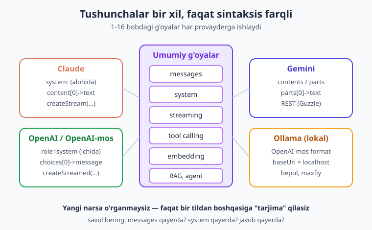
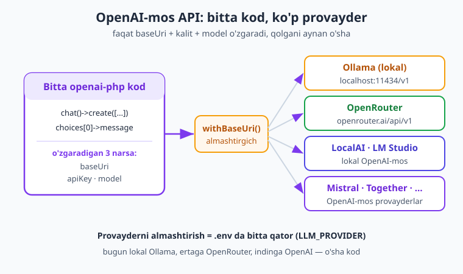
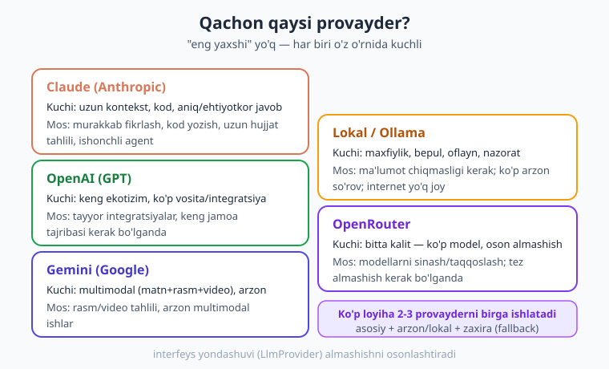

# 19 — Boshqa provayderlar (OpenAI / Gemini / Ollama)

[⬅️ Oldingi: 18 — Laravel integratsiya](./18-laravel-integratsiya.md) · [🏠 Kitob boshi](./README.md) · [Keyingi: 20 — Xavfsizlik ➡️](./20-xavfsizlik.md)

> **Bu bobda:** shu paytgacha hamma kodni **Claude** (Anthropic) bilan yozdik. Endi kitobni **provayder-agnostik** qilamiz — ya'ni o'rgangan tushunchalaringizni (messages, system, streaming, tool calling, embedding) **boshqa AI provayderlariga** ham ko'chiramiz: **OpenAI**, **Gemini** (Google), **Ollama** (kompyuteringizdagi lokal model), **OpenRouter** (bitta kalit — ko'p model). Eng muhim g'oya: **g'oyalar bir xil, faqat sintaksis farqli.** Va "OpenAI-mos API" sehri tufayli ko'p provayderni **bitta kod** bilan ishlatish mumkin. Oxirida o'z `LlmProvider` interfeysingizni yozib, ilovangizni istalgan provayderga ulanadigan qilamiz.

---

## Nega bitta provayder yetarli emas?

Tasavvur qiling, sizda do'kon bor va siz **faqat bitta** yetkazib beruvchidan mahsulot olasiz. Bir kuni u narxni ikki barobar oshiradi. Yoki bayram kunlari yetkazib bera olmaydi. Yoki sizga kerak bo'lgan yangi mahsulotni umuman sotmaydi. Siz unga **butunlay bog'lanib qolgansiz** — bu xavfli holat. Aqlli savdogar har doim bir nechta yetkazib beruvchini biladi.

AI provayderlari bilan ham aynan shunday. Claude — ajoyib vosita, lekin **yagona** emas. Real loyihada bir nechta sababga ko'ra boshqa provayderlar kerak bo'ladi:

- **Narx.** Bir vazifani bir provayder arzonroq bajaradi. Oddiy ko'p so'rovni arzon modelga, murakkabini kuchli modelga yo'naltirsangiz — pul tejaysiz (16-bobni eslang).
- **Sifat.** Har provayder boshqacha kuchli: biri kodda, biri rasm tahlilida, biri uzun matnda yaxshiroq. Vazifaga mosini tanlash mumkin.
- **Tezlik.** Ba'zi modellar tezroq javob beradi — chat-bot uchun muhim.
- **Mavjudlik (rate limit).** Bitta provayder vaqtincha ishlamay qolsa yoki so'rov chegarasiga (rate limit) yetsa, ilovangiz **to'xtab qolmasligi** kerak — boshqasiga o'tib ketadi (8-bobdagi **fallback** g'oyasi, endi provayderlar orasida).
- **Maxfiylik.** Ba'zan ma'lumot kompyuterdan **chiqmasligi** kerak (tibbiy, moliyaviy, davlat). Bunda **lokal model** (Ollama) — internetga umuman bormaydi.
- **Funksiya farqi.** Biror provayderda kerakli imkoniyat boshqasida yo'q bo'lishi mumkin.

Bularning hammasi bitta katta g'oyaga olib keladi: **vendor lock-in** (yagona sotuvchiga bog'lanib qolish) — dushman. Kodingiz shunday yozilsinki, provayderni almashtirish **bir necha qatorda** bo'lsin, butun ilovani qayta yozmasdan.

> **Hayotiy o'xshatish.** Quvvat manbai. Telefoningiz faqat bitta zaryadlovchiga moslangan bo'lsa va u sinsa — telefon o'lik. Lekin USB-C standartiga moslangan bo'lsa, istalgan zaryadlovchi ishlaydi. Biz ilovamizni "USB-C" qilamiz: standart **interfeys**, orqasida istalgan provayder.

!!! note "Eslatma"
    Bu bob sizni Claude'dan voz kechishga undamaydi. Aksincha — Claude'ni asosiy qilib qoldiramiz, lekin yoningizda boshqa variantlar bo'lishini ta'minlaymiz. Eng yaxshi arxitektura — bitta provayderga "yopishib" qolmagan arxitektura.

---

## Eng muhim g'oya: tushunchalar bir xil

Bu kitobning 1–16 boblarida siz juda ko'p narsa o'rgandingiz: `messages` massivi, `system` prompt, suhbat tarixi, streaming, structured output, tool calling, embedding, RAG. Yangilik shundaki — **bularning HAMMASI har bir jiddiy LLM provayderida bor.** Faqat kod yozilishi (sintaksis) biroz farq qiladi.

Ya'ni siz **yangi narsa o'rganishingiz shart emas** — faqat bir tildan boshqa tilga "tarjima" qilasiz. G'oya o'sha-o'sha.



Mana taqqoslash jadvali — diqqat qiling, **ustunlar deyarli bir xil**:

| Tushuncha | Claude (Anthropic) | OpenAI / OpenAI-mos |
|---|---|---|
| Suhbat | `messages: [['role'=>'user', ...]]` | `'messages' => [['role'=>'user', ...]]` |
| Tizim ko'rsatma | `system:` (top-level) | `messages` ichida `['role'=>'system']` |
| Javob matni | `$msg->content[0]->text` | `$res->choices[0]->message->content` |
| Streaming | `createStream(...)` | `chat()->createStreamed(...)` |
| Embedding | embedding modeli | `embeddings()->create(...)` |
| Tool calling | `tools:` + `input_schema` | `'tools'` + `function`/`parameters` |
| Maksimal token | `maxTokens:` | `'max_tokens'` |

Ko'ryapsizmi? Faqat ikkita asosiy farq bor:

1. **Tizim ko'rsatma joyi.** Claude'da `system` alohida parametr; OpenAI'da u `messages` ning birinchi elementi (`role => 'system'`).
2. **Javobni o'qish yo'li.** Claude — `content` bloklari; OpenAI — `choices[0].message.content`.

Qolgan hamma narsa — o'sha tushunchalar. 1-bobdagi "LLM matnni davom ettiradi", 3-bobdagi prompt san'ati, 4-bobdagi suhbat tarixi, 9-bobdagi tool g'oyasi — hammasi har joyda ishlaydi. Shuning uchun bu kitobni Claude'da o'rganganingiz **isrof emas** — bu universal bilim.

!!! tip "Maslahat"
    Yangi provayderga o'tganingizda "men hech narsa bilmayman" deb qo'rqmang. Avval o'zingizdan so'rang: "bu yerda `messages` qayerda? `system` qayerda? javob qayerda?" — uchta savolga javob topdingizmi, asosiy ishni bilasiz.

---

## OpenAI

OpenAI — Claude'dan keyingi eng mashhur provayderlardan biri (GPT modellari). PHP'da rasmiy emas, lekin keng ishlatiladigan jamoa paketi bor: `openai-php/client`.

### O'rnatish

```bash
composer require openai-php/client
```

### Klient va birinchi so'rov

Claude SDK'dagi `new Client(apiKey: ...)` ga juda o'xshash. Bu yerda statik `OpenAI::client(...)` ishlatamiz. **Kalitni hech qachon kodga yozmang** — muhit o'zgaruvchisidan oling (xavfsizlik, har bobda takrorlaymiz).

```php
<?php
require __DIR__ . '/vendor/autoload.php';

// API kalit muhit o'zgaruvchisidan (kodga YOZMA!)
$client = OpenAI::client(getenv('OPENAI_API_KEY'));

$response = $client->chat()->create([
    'model'    => getenv('OPENAI_MODEL'),   // model nomini sozlamadan ol
    'messages' => [
        ['role' => 'user', 'content' => 'Salom! O\'zbek tilida qisqa javob ber.'],
    ],
]);

// Javob matni: choices[0] -> message -> content
echo $response->choices[0]->message->content;
```

Claude bilan solishtiring (5-bob): u yerda `$client->messages->create(model: ..., messages: ...)` edi va javob `$msg->content[0]->text`. Bu yerda `$client->chat()->create([...])` va javob `$res->choices[0]->message->content`. **G'oya bir xil — yozilishi boshqacha.**

!!! warning "Ehtiyot bo'ling"
    Aniq model nomini (versiyasini) kodga **qattiq yozmang** — modellar tez yangilanadi va eski nom bir kun ishlamay qolishi mumkin. Doim **sozlamadan** oling: `getenv('OPENAI_MODEL')`. Shunda model almashtirish — kod emas, `.env` faylini tahrirlash.

### System prompt

OpenAI'da alohida `system` parametri yo'q — uni `messages` ning **birinchi** elementi sifatida qo'yasiz:

```php
$response = $client->chat()->create([
    'model'    => getenv('OPENAI_MODEL'),
    'messages' => [
        ['role' => 'system', 'content' => 'Sen foydali PHP yordamchisisan. Doim o\'zbek tilida, qisqa javob ber.'],
        ['role' => 'user',   'content' => 'PDO nima?'],
    ],
]);

echo $response->choices[0]->message->content;
```

Claude'da bu `system:` top-level parametr edi (5-bob). Bu yagona jiddiy farq — esda tuting: **Claude'da system alohida, OpenAI'da messages ichida.**

### Streaming (jonli oqim)

5-bobda Claude streaming'ini o'rgandingiz — javob so'zma-so'z keladi. OpenAI'da ham bor, `createStreamed`:

```php
$stream = $client->chat()->createStreamed([
    'model'    => getenv('OPENAI_MODEL'),
    'messages' => [['role' => 'user', 'content' => 'Qisqa hikoya yoz']],
]);

foreach ($stream as $chunk) {
    // har bo'lak (chunk) ichida delta -> content qism javob keladi
    echo $chunk->choices[0]->delta->content ?? '';
    flush();   // brauzerga darhol uzatish
}
```

Claude'da `createStream(...)` edi va siz `content_block_delta` hodisalarini tekshirardingiz. OpenAI'da `createStreamed(...)` va bo'lak `->choices[0]->delta->content`. **Yana o'sha g'oya** — javobni qism-qism olish.

### Embedding (vektorga aylantirish)

13-bobda embedding'ni o'rgandingiz — matnni raqamlar ro'yxatiga (vektor) aylantirish, semantik qidiruv uchun. OpenAI'da:

```php
$response = $client->embeddings()->create([
    'model' => getenv('OPENAI_EMBED_MODEL'),
    'input' => 'PHP — server tomonida ishlaydigan dasturlash tili.',
]);

$vektor = $response->embeddings[0]->embedding;  // float'lar massivi
echo 'Vektor o\'lchami: ' . count($vektor) . PHP_EOL;
```

Bu vektorni xuddi 14-bobdagi kabi pgvector yoki boshqa vektor bazaga saqlab, 15-bobdagi RAG quvurini qurishingiz mumkin — **butun arxitektura o'zgarmaydi**, faqat embedding manbasi boshqa.

### Function calling (tool use)

9–10-boblarda tool calling g'oyasini o'rgandingiz: modelga "asbob" berasiz, model qachon ishlatishni o'zi hal qiladi. OpenAI'da format biroz boshqacha — `function` ichiga o'raladi:

```php
$tools = [[
    'type' => 'function',
    'function' => [
        'name'        => 'ob_havo',
        'description' => 'Berilgan shahar uchun joriy ob-havoni qaytaradi.',
        'parameters'  => [   // Claude'dagi input_schema o'rnida
            'type'       => 'object',
            'properties' => ['shahar' => ['type' => 'string', 'description' => 'Shahar nomi']],
            'required'   => ['shahar'],
        ],
    ],
]];

$response = $client->chat()->create([
    'model'    => getenv('OPENAI_MODEL'),
    'messages' => [['role' => 'user', 'content' => 'Toshkentda ob-havo qanday?']],
    'tools'    => $tools,
]);

// Agar model toolni chaqirmoqchi bo'lsa -> choices[0]->message->toolCalls bo'sh emas
$toolCalls = $response->choices[0]->message->toolCalls;
if ($toolCalls) {
    foreach ($toolCalls as $call) {
        $nomi    = $call->function->name;            // 'ob_havo'
        $arglar  = json_decode($call->function->arguments, true);  // ['shahar' => 'Toshkent']
        echo "Model chaqirmoqchi: {$nomi}(" . json_encode($arglar) . ")\n";
        // Bu yerda haqiqiy funksiyani bajarib, natijani role=tool xabar bilan qaytarasiz
    }
}
```

Solishtiring (9-bob): Claude'da `input_schema` edi, bu yerda `parameters`; Claude'da `$msg->content` ichida `tool_use` bloki, bu yerda `message->toolCalls`. Tafsilot boshqa, **mexanizm bir xil**: model "qaysi asbobni, qanday argument bilan" deydi, siz bajarib, natijani qaytarasiz, model yakuniy javob yozadi (manual loop — 9-bob).

!!! info "Boshqa provayderda"
    Claude'da `BetaRunnableTool` + `toolRunner` avtomatik loop bor edi (10-bob). OpenAI paketida bunday tayyor "runner" yo'q — loopni o'zingiz yozasiz (9-bobdagi manual loop kabi). Lekin natija bir xil.

---

## Gemini (Google)

**Gemini** — Google'ning AI modeli. Ayniqsa **multimodal** ishlarda (matn + rasm + video birga) kuchli va ko'p hollarda arzon. PHP'da turli jamoa paketlari bor, lekin eng ishonchli va o'rganishga oson yo'l — to'g'ridan-to'g'ri **REST API** ga `Guzzle` (8-bobda ko'rgan HTTP mijoz) bilan murojaat qilish. Bu sizga "ostida nima bo'layotganini" ham ko'rsatadi.

G'oya bari bir o'sha: so'rov ichida **kontent** (sizning xabaringiz) yuborasiz, javobda **matn** olasiz. Faqat maydon nomlari biroz boshqacha (`contents`, `parts`, `text`):

```php
<?php
require __DIR__ . '/vendor/autoload.php';

use GuzzleHttp\Client as HttpClient;

$apiKey = getenv('GEMINI_API_KEY');     // kalit muhit o'zgaruvchisidan
$model  = getenv('GEMINI_MODEL');        // model nomini sozlamadan ol

$http = new HttpClient([
    'base_uri' => 'https://generativelanguage.googleapis.com/',
]);

$response = $http->post("v1beta/models/{$model}:generateContent", [
    'headers' => ['x-goog-api-key' => $apiKey],
    'json'    => [
        'contents' => [
            [
                'role'  => 'user',
                'parts' => [['text' => 'Salom! O\'zbek tilida bir jumla bilan o\'zingni tanishtir.']],
            ],
        ],
    ],
]);

$data = json_decode((string) $response->getBody(), true);

// Javob matni: candidates[0] -> content -> parts[0] -> text
echo $data['candidates'][0]['content']['parts'][0]['text'] ?? '(javob yo\'q)';
```

Tuzilmani solishtiring: Claude/OpenAI'da `messages`/`role`/`content` bor edi — Gemini'da `contents`/`role`/`parts`. Boshqacha so'zlar, **o'sha g'oya**: rolga ega xabarlar ro'yxati, javobda matn.

!!! tip "Maslahat"
    Gemini multimodalda kuchli — bir so'rovda matn va rasmni birga yuborib, "bu rasmda nima yozilgan?" deb so'rashingiz mumkin (7-bobdagi vision g'oyasi). `parts` massiviga matn bilan birga `inline_data` (base64 rasm) qo'shasiz. Tafsilotlar Google hujjatlarida; muhimi — **vision tushunchasi o'sha**.

!!! warning "Ehtiyot bo'ling"
    REST API endpoint manzillari va versiyalari (`v1beta` kabi) vaqt o'tib o'zgarishi mumkin. Aniq manzilni doim provayderning **joriy hujjatidan** tasdiqlang. Shu sababli model nomini va versiyani **sozlamada** saqlash yana foydali.

---

## Ollama — kompyuteringizdagi lokal model

Endi eng qiziq qismi. Shu paytgacha hamma model **internetda**, boshqa kompaniya serverida edi — siz so'rov yuborardingiz, pul to'lardingiz, ma'lumotingiz tashqariga chiqardi. **Ollama** esa modelni **to'g'ridan-to'g'ri sizning kompyuteringizda** ishlatadi.

Bu nimani anglatadi:

- **Pul yo'q** — so'rov bepul, qancha xohlasangiz ishlating.
- **Internet shart emas** — oflayn ishlaydi (model bir marta yuklab olingach).
- **Maxfiylik** — ma'lumot kompyuterdan **chiqmaydi**. Tibbiy, moliyaviy, shaxsiy ma'lumotlar uchun ideal.
- **To'liq nazorat** — qaysi modelni, qachon ishlatishni o'zingiz hal qilasiz.

Evaziga: kuchli modellar yaxshi kompyuter (ko'p RAM, video karta) talab qiladi va bulutdagi eng kuchli modellardan ko'pincha sifatda pastroq. Lekin oddiy-o'rta vazifalar va maxfiylik talab qiladigan ishlar uchun — ajoyib yechim.

Avval Ollama'ni o'rnatasiz (`ollama.com`) va terminalda modelni ishga tushirasiz:

```bash
ollama run llama3.2     # modelni yuklab oladi va ishga tushiradi (nom misol uchun)
```

### Sehr: Ollama OpenAI-mos API beradi

Eng zo'r tomoni shundaki, Ollama **OpenAI bilan bir xil formatdagi** API ochadi — `http://localhost:11434/v1` manzilida. Demak siz **o'sha `openai-php/client` paketini** ishlatasiz, faqat **manzilni (`baseUri`)** o'zgartirasiz! Yangi paket o'rganish kerak emas.

```php
<?php
require __DIR__ . '/vendor/autoload.php';

// OpenAI paketini ishlatamiz, lekin manzilni LOKAL Ollama'ga yo'naltiramiz
$client = OpenAI::factory()
    ->withApiKey('ollama')                          // lokalda kalit shart emas — istalgan matn
    ->withBaseUri('http://localhost:11434/v1')      // bu yer butun sirini ochadi
    ->make();

$response = $client->chat()->create([
    'model'    => getenv('OLLAMA_MODEL'),   // masalan, terminalda yuklagan modelingiz
    'messages' => [
        ['role' => 'user', 'content' => 'Salom! O\'zbek tilida qisqa salomlash.'],
    ],
]);

echo $response->choices[0]->message->content;
```

Diqqat qiling: bu kod **yuqoridagi OpenAI misoli bilan deyarli bir xil**. Faqat ikki o'zgarish: `withBaseUri(...)` lokal manzilga va kalit muhim emas. So'rovning qolgani — `chat()->create([...])`, javob — `choices[0]->message->content` — **aynan o'sha**. Mana shu "OpenAI-mos API" kuchi.

!!! note "Eslatma"
    **LM Studio** va **LocalAI** ham xuddi shunday — kompyuteringizda lokal model ishlatadi va OpenAI-mos API beradi. Ularda ham faqat `baseUri` ni mos manzilga (masalan, LM Studio `http://localhost:1234/v1`) o'zgartirasiz. Tushuncha bir xil.

---

## OpenRouter — bitta kalit, ko'p model

**OpenRouter** — o'ziga xos "AI bozori". Bitta hisob va bitta API kalit ochasiz, lekin orqasida **o'nlab provayder** modellariga (Claude, GPT, Gemini, ochiq modellar...) kira olasiz. Modelni almashtirish — faqat `model` maydonini o'zgartirish.

Bu **sinash** va **almashish** uchun ajoyib: bitta vazifani turli modellarda sinab, qaysi biri yaxshi/arzon ekanini tez topasiz, hisoblar va integratsiyalar bilan ovora bo'lmasdan.

Va yana — OpenRouter ham **OpenAI-mos**. Demak yana o'sha paket, faqat boshqa `baseUri` va kalit:

```php
<?php
require __DIR__ . '/vendor/autoload.php';

$client = OpenAI::factory()
    ->withApiKey(getenv('OPENROUTER_API_KEY'))      // kalit muhit o'zgaruvchisidan
    ->withBaseUri('https://openrouter.ai/api/v1')   // OpenRouter manzili
    ->withHttpHeader('HTTP-Referer', 'https://mening-saytim.uz')  // ixtiyoriy — ilovangiz manzili
    ->make();

$response = $client->chat()->create([
    'model'    => getenv('OPENROUTER_MODEL'),   // OpenRouter formatidagi model nomi
    'messages' => [
        ['role' => 'user', 'content' => 'Bir jumlada o\'zingni tanishtir.'],
    ],
]);

echo $response->choices[0]->message->content;
```

Yana **bir xil kod** — faqat `baseUri`, kalit va `model`. Sezdingizmi qancha narsa takrorlanyapti? Bu bizni keyingi katta g'oyaga olib keladi.

---

## "OpenAI-mos API" — bitta kod, ko'p provayder

Endi naqsh aniq ko'rinadi. Ollama, OpenRouter, LocalAI, LM Studio, va boshqa ko'p provayder (Mistral, Together, Groq...) **OpenAI formatini** qo'llab-quvvatlaydi. Bu **standart** vazifasini bajaradi.

Buning amaliy ma'nosi katta: siz **bitta** `openai-php` kod yozasiz, va **faqat uchta narsa** o'zgaradi — `baseUri`, `apiKey`, `model`. Qolgani aynan o'sha.



Buni amalda ko'rsataylik — bitta funksiya, sozlamaga qarab **istalgan** OpenAI-mos provayderga ulanadi:

```php
<?php
require __DIR__ . '/vendor/autoload.php';

use OpenAI\Client;

/**
 * Sozlamaga qarab istalgan OpenAI-mos provayderga klient yaratadi.
 * Faqat baseUri + kalit o'zgaradi, qolgan kod hamma joyda bir xil.
 */
function provayderKlienti(string $baseUri, string $apiKey): Client
{
    return OpenAI::factory()
        ->withApiKey($apiKey)
        ->withBaseUri($baseUri)
        ->make();
}

// Bir xil so'rov yuboruvchi yordamchi — provayder qaysi bo'lishidan qat'i nazar
function sora(Client $client, string $model, string $savol): string
{
    $res = $client->chat()->create([
        'model'    => $model,
        'messages' => [['role' => 'user', 'content' => $savol]],
    ]);

    return $res->choices[0]->message->content ?? '';
}

// Endi provayderni TANLASH — masalan, sozlamadan keladi:
$qaysi = getenv('LLM_PROVIDER') ?: 'ollama';   // 'ollama' | 'openrouter' | 'openai'

[$baseUri, $apiKey, $model] = match ($qaysi) {
    'ollama'     => ['http://localhost:11434/v1',   'ollama',                      getenv('OLLAMA_MODEL')],
    'openrouter' => ['https://openrouter.ai/api/v1', getenv('OPENROUTER_API_KEY'), getenv('OPENROUTER_MODEL')],
    'openai'     => ['https://api.openai.com/v1',    getenv('OPENAI_API_KEY'),     getenv('OPENAI_MODEL')],
    default      => throw new InvalidArgumentException("Noma'lum provayder: {$qaysi}"),
};

$client = provayderKlienti($baseUri, $apiKey);
echo sora($client, $model, 'PHP nima ekanini bir jumlada ayt.');
```

Bu kodning go'zalligi: provayderni almashtirish uchun siz **birorta ham qatorni o'zgartirmaysiz**. Faqat `.env` da `LLM_PROVIDER=openrouter` deb yozasiz — tamom. Bugun lokal Ollama'da, ertaga OpenRouter'da, indinga OpenAI'da — o'sha kod.

!!! warning "Ehtiyot bo'ling"
    "OpenAI-mos" degani — **deyarli** mos. Ba'zi nozik imkoniyatlar (ayrim tool format tafsilotlari, ba'zi parametrlar) har provayderda to'liq qo'llab-quvvatlanmasligi mumkin. Oddiy chat, streaming, embedding — deyarli har joyda ishlaydi. Murakkab imkoniyatni ishlatishdan oldin sinab ko'ring.

!!! info "Boshqa provayderda"
    **Claude** bu standart ro'yxatiga to'liq kirmaydi — Claude'da o'zining rasmiy SDK'si (`anthropic-ai/sdk`) bor va format biroz boshqacha (`system` alohida, `content` bloklar). Shuning uchun Claude'ni umumiy abstraksiyaga qo'shish uchun keyingi bo'limdagi **o'z interfeysingiz** yondashuvi kerak bo'ladi.

---

## O'z provayder-agnostik abstraksiyangiz

OpenAI-mos naqsh ajoyib, lekin Claude (rasmiy SDK) va Gemini (REST) uni to'liq qo'llamaydi. **Hamma** provayderni — Claude'ni ham — bitta umumiy yo'l bilan ishlatish uchun eng kuchli yechim: **o'z interfeysingizni** yozish.

G'oya (dasturlash arxitekturasidan tanish bo'lsa): ilovangiz **aniq provayderga emas, balki interfeysga** tayanadi. Har provayder uchun shu interfeysni amalga oshiradigan kichik klass yozasiz. Provayderni almashtirish = boshqa klassni ulash, ilovaning qolgan qismiga tegmasdan.

```php
<?php

/**
 * Har qanday LLM provayder shu interfeysni amalga oshiradi.
 * Ilovamiz FAQAT shu interfeysni biladi — qaysi provayder ortda turganini emas.
 */
interface LlmProvider
{
    /** Foydalanuvchi xabariga (ixtiyoriy tizim ko'rsatma bilan) matn javob qaytaradi. */
    public function javob(string $foydalanuvchi, string $tizim = ''): string;
}
```

Endi **Claude** uchun implementatsiya (rasmiy SDK bilan, 5-bobdagi kod):

```php
<?php

use Anthropic\Client as AnthropicClient;

final class ClaudeProvider implements LlmProvider
{
    public function __construct(
        private AnthropicClient $client,
        private string $model,        // sozlamadan, masalan 'claude-opus-4-8'
    ) {}

    public function javob(string $foydalanuvchi, string $tizim = ''): string
    {
        // Claude'da system ALOHIDA parametr (top-level)
        $params = [
            'model'     => $this->model,
            'maxTokens' => 1024,
            'messages'  => [['role' => 'user', 'content' => $foydalanuvchi]],
        ];
        if ($tizim !== '') {
            $params['system'] = $tizim;
        }

        $msg = $this->client->messages->create(...$params);

        return $msg->content[0]->text;   // Claude javobi: content bloklari
    }
}
```

Endi **OpenAI** (yoki istalgan OpenAI-mos: Ollama, OpenRouter...) uchun implementatsiya:

```php
<?php

use OpenAI\Client as OpenAiClient;

final class OpenAiProvider implements LlmProvider
{
    public function __construct(
        private OpenAiClient $client,
        private string $model,
    ) {}

    public function javob(string $foydalanuvchi, string $tizim = ''): string
    {
        // OpenAI'da system messages ICHIDA (birinchi element)
        $messages = [];
        if ($tizim !== '') {
            $messages[] = ['role' => 'system', 'content' => $tizim];
        }
        $messages[] = ['role' => 'user', 'content' => $foydalanuvchi];

        $res = $this->client->chat()->create([
            'model'    => $this->model,
            'messages' => $messages,
        ]);

        return $res->choices[0]->message->content ?? '';   // OpenAI javobi: choices
    }
}
```

Diqqat: ikkala klass ham **bir xil `javob()` metodiga** ega — tashqaridan ular **bir xil ko'rinadi**. Provayderlar orasidagi farq (system qayerda, javob qayerda) klass ichiga "yashiringan". Ilova bu farqni umuman bilmaydi.

!!! tip "Maslahat"
    Bu — klassik **Strategiya (Strategy)** dizayn namunasi: bir vazifani bajarishning bir nechta yo'li, hammasi bir interfeys ortida. 17-bobdagi tayyor frameworklar (LLPhant, Neuron AI) aynan shuni siz uchun qiladi — agar o'zingiz yozishni xohlamasangiz, ulardan foydalanasiz. Lekin "ostida nima bo'layotganini" bilish — qimmatli.

---

## To'liq misol: bir vazifa, ikki provayder, oson almashish

Hammasini birlashtiraylik. Ilovamiz **faqat `LlmProvider` interfeysiga** tayanadi. Sozlamaga qarab Claude yoki OpenAI provayderini ulaymiz — qolgan kod o'zgarmaydi.

```php
<?php
require __DIR__ . '/vendor/autoload.php';

use Anthropic\Client as AnthropicClient;
use OpenAI\Client as OpenAiClient;

// (LlmProvider interfeysi va ikki implementatsiya yuqorida ta'riflangan deb olamiz)

/**
 * Sozlamaga qarab to'g'ri provayderni TANLAYDI va ulaydi.
 * Ilova faqat qaytgan LlmProvider'ni biladi — ichini emas.
 */
function provayderYarat(string $qaysi): LlmProvider
{
    return match ($qaysi) {
        'claude' => new ClaudeProvider(
            new AnthropicClient(apiKey: getenv('ANTHROPIC_API_KEY')),
            getenv('ANTHROPIC_MODEL') ?: 'claude-opus-4-8',
        ),
        'openai' => new OpenAiProvider(
            OpenAI::client(getenv('OPENAI_API_KEY')),
            getenv('OPENAI_MODEL'),
        ),
        // Ollama ham OpenAiProvider — faqat boshqa baseUri'li klient bilan!
        'ollama' => new OpenAiProvider(
            OpenAI::factory()
                ->withApiKey('ollama')
                ->withBaseUri('http://localhost:11434/v1')
                ->make(),
            getenv('OLLAMA_MODEL'),
        ),
        default  => throw new InvalidArgumentException("Noma'lum provayder: {$qaysi}"),
    };
}

// --- Ilovaning ASOSIY mantig'i — provayderdan MUTLAQO bexabar ---
function maqolaXulosaQil(LlmProvider $llm, string $matn): string
{
    return $llm->javob(
        foydalanuvchi: "Quyidagi matnni 2 jumlada xulosa qil:\n\n{$matn}",
        tizim: 'Sen aniq va qisqa xulosa yozadigan muharrirsan. Doim o\'zbek tilida.',
    );
}

// --- Ishlatish: provayderni FAQAT shu yerda tanlaymiz ---
$qaysi = getenv('LLM_PROVIDER') ?: 'claude';   // 'claude' | 'openai' | 'ollama'
$llm   = provayderYarat($qaysi);

$matn = 'PHP — server tomonida ishlaydigan, veb-saytlar uchun mashhur dasturlash tili. '
      . 'U ma\'lumotlar bazasi bilan ishlaydi, HTML generatsiya qiladi va katta ekotizimga ega.';

echo "Provayder: {$qaysi}\n";
echo maqolaXulosaQil($llm, $matn) . "\n";
```

Mana shu — provayder-agnostik ilova. `maqolaXulosaQil()` funksiyasi **Claude'mi, OpenAI'mi, Ollama'mi — bilmaydi va bilishi shart emas**. Almashtirish uchun `.env` da bitta qatorni o'zgartirasiz: `LLM_PROVIDER=ollama`. Bugun bulutdagi Claude, ertaga maxfiylik uchun lokal Ollama — o'sha kod, o'zgartirishsiz.

!!! example "Misol"
    Real loyihada bu naqsh oltin: oddiy/ko'p so'rovlarni arzon yoki lokal provayderga, murakkab/muhimlarini Claude'ga yo'naltirasiz. Yoki 8-bobdagi **fallback** ni provayderlar orasida qo'llaysiz — asosiy provayder ishlamasa, ikkinchisiga avtomatik o'tasiz. Interfeys buni osonlashtiradi.

---

## Qachon qaysi provayder?

Endi amaliy savol: **qachon qaysisini tanlash?** Bitta "eng yaxshi" provayder yo'q — har biri o'z o'rnida kuchli. Mana yo'riqnoma:



| Provayder | Kuchli tomoni | Qachon mos |
|---|---|---|
| **Claude** (Anthropic) | Uzun kontekst, kod, ehtiyotkor/aniq javob, agentlar | Murakkab fikrlash, kod yozish, uzun hujjat tahlili, ishonchli agent |
| **OpenAI** (GPT) | Keng ekotizim, ko'p vosita/integratsiya, mashhur | Tayyor integratsiyalar, keng jamoa tajribasi kerak bo'lganda |
| **Gemini** (Google) | Multimodal (matn+rasm+video), ko'pincha arzon | Rasm/video tahlili, arzon multimodal ishlar |
| **Lokal / Ollama** | Maxfiylik, bepul, oflayn, to'liq nazorat | Ma'lumot chiqmasligi kerak; ko'p arzon so'rov; internet yo'q joy |
| **OpenRouter** | Bitta kalit — ko'p model, oson almashish | Modellarni sinash/taqqoslash; tez almashish kerak bo'lganda |

Amaliy maslahat: ko'p loyiha **ikki-uch provayderni** birga ishlatadi. Masalan:

- **Asosiy** — Claude (murakkab, sifat muhim ishlar uchun);
- **Arzon/ommaviy** — lokal Ollama yoki arzon model (oddiy klassifikatsiya, teglash);
- **Zaxira (fallback)** — boshqa provayder (asosiysi ishlamay qolsa).

Interfeys yondashuvi aynan shuni osonlashtiradi.

---

## Migratsiya: provayderni almashtirganda nima o'zgaradi?

Aytaylik, ilovangiz Claude'da yozilgan va siz OpenAI'ga (yoki teskari) ko'chmoqchisiz. Nima e'tibor talab qiladi?

**O'zgaradi:**

- **Model nomi.** Har provayderda boshqa (sozlamadan oling — `getenv`, kodga yozmang).
- **System joyi.** Claude — alohida `system`; OpenAI — `messages` ichida.
- **Javobni o'qish.** Claude — `content[0]->text`; OpenAI — `choices[0]->message->content`.
- **Tool format.** Claude — `input_schema`; OpenAI — `function`/`parameters`.
- **Narx va limit.** Har provayderda boshqa — byudjet va rate limitni qayta hisoblang.
- **Maxsus imkoniyatlar.** Biror provayderdagi nozik funksiya boshqasida bo'lmasligi mumkin.

**O'zgarmaydi (eng muhimi!):**

- **G'oya.** Prompt san'ati (3-bob), suhbat tarixi (4-bob), tool calling mantig'i (9-bob), RAG arxitekturasi (15-bob) — hammasi o'sha. Siz qaytadan o'rganmaysiz.
- **Ilova mantig'i.** Agar interfeys ortida yozgan bo'lsangiz — ilovaning asosiy qismi umuman tegmaydi.

!!! tip "Maslahat"
    Migratsiyani osonlashtirishning eng yaxshi yo'li — **boshidanoq** interfeys ortida yozish (yuqoridagi `LlmProvider`). Shunda "migratsiya" deyarli yo'qoladi: yangi provayder uchun bitta kichik klass yozasiz, `.env` ni o'zgartirasiz — tamom. Boshidan bitta provayderga "yopishib" yozsangiz — keyin azob.

---

## Xulosa

- **Vendor lock-in — dushman.** Bitta provayderga butunlay bog'lanib qolmang. Narx, sifat, tezlik, mavjudlik (rate limit), maxfiylik va funksiya farqi — bularning hammasi bir nechta provayderni bilishni talab qiladi.
- **Tushunchalar bir xil, sintaksis farqli.** `messages`, `system`, streaming, tool calling, embedding — har jiddiy LLM provayderida bor. 1–16 boblardagi g'oyalar **hammasiga** ishlaydi; faqat yozilishini "tarjima" qilasiz.
- **OpenAI** — `openai-php/client`, `$client->chat()->create([...])`, javob `choices[0]->message->content`. System — `messages` ichida. Streaming, embedding, tool calling bor.
- **Gemini** — REST API (Guzzle bilan); `contents`/`parts` tuzilmasi; multimodal kuchli, ko'pincha arzon.
- **Ollama / lokal modellar** — kompyuteringizda ishlaydi: bepul, oflayn, **maxfiy** (ma'lumot chiqmaydi). OpenAI-mos API beradi — o'sha `openai-php` kod, faqat `baseUri` lokal manzilga. LM Studio, LocalAI ham shunday.
- **OpenRouter** — bitta kalit, ko'p model; OpenAI-mos (`baseUri` o'zgaradi); modellarni sinash/almashish uchun ideal.
- **"OpenAI-mos" sehri** — ko'p provayder (Ollama, OpenRouter, LocalAI, Mistral...) OpenAI formatini qo'llaydi. Bitta kod, faqat `baseUri`+kalit+`model` o'zgaradi.
- **O'z `LlmProvider` interfeysingiz** — barcha provayderni (Claude ham) bitta umumiy yo'l bilan ishlatish va osongina almashtirishning eng kuchli usuli. Ilova interfeysga tayanadi, aniq provayderga emas.
- **Boshidan abstraksiya bilan yozing** — keyin migratsiya deyarli yo'qoladi: yangi klass + `.env` o'zgarishi.

---

## Amaliy mashqlar

1. **OpenAI bilan so'rov.** `openai-php/client` ni o'rnating va sodda skript yozing: foydalanuvchi savolini olib, OpenAI'ga yuboring va javobni chop eting. Model nomini `getenv('OPENAI_MODEL')` dan oling, kalitni **hech qachon kodga yozmang**. So'ng `system` xabar qo'shib, modelni "doim o'zbekcha, qisqa javob ber" ga sozlang. Claude'dagi (5-bob) o'sha vazifa bilan kodni yonma-yon qo'yib, qaysi ikki joy farq qilishini aniqlang.

2. **Lokal Ollama.** Ollama'ni o'rnating, biror modelni `ollama run ...` bilan ishga tushiring. Keyin `openai-php` ni `withBaseUri('http://localhost:11434/v1')` bilan sozlab, unga so'rov yuboring. Bir savolni avval bulutdagi provayderga, keyin lokal Ollama'ga yuboring — javob sifatini va tezligini taqqoslang. Lokal modelning qaysi afzalligi siz uchun eng muhim ekanini bir jumlada yozing.

3. **OpenRouter sinovi.** OpenRouter hisobi oching, `baseUri` ni `https://openrouter.ai/api/v1` ga sozlang. Bir xil savolni **uchta har xil** modelga (faqat `model` maydonini o'zgartirib) yuboring va javoblarni taqqoslang. Bu usul "har model uchun alohida hisob/integratsiya" ga nisbatan qanday vaqt tejashini tushuntiring.

4. **Provayder-agnostik interfeys.** `LlmProvider` interfeysini va `ClaudeProvider` + `OpenAiProvider` (yoki `OllamaProvider`) implementatsiyalarini yozing. `provayderYarat()` funksiyasi `getenv('LLM_PROVIDER')` ga qarab to'g'ri klassni qaytarsin. Bir vazifani (masalan, matnni xulosa qilish) yozing va uni **ikkala** provayderda almashtirib ishlating — ilova mantig'iga tegmasdan.

5. **Provayderlar orasida fallback.** 8-bobdagi retry/fallback g'oyasini provayderlar orasiga ko'chiring: `LlmProvider` ro'yxatini (masalan, `[claude, ollama]`) oling; birinchisi xato bersa (`APIException`), ikkinchisiga avtomatik o'ting. Test qilish uchun birinchi provayderga ataylab noto'g'ri kalit bering va ikkinchisi ishga tushganini kuzating. Nega provayder-darajadagi fallback "ilova hech qachon to'xtamasin" maqsadiga xizmat qilishini tushuntiring.

---

[⬅️ Oldingi: 18 — Laravel integratsiya](./18-laravel-integratsiya.md) · [🏠 Kitob boshi](./README.md) · [Keyingi: 20 — Xavfsizlik ➡️](./20-xavfsizlik.md)
