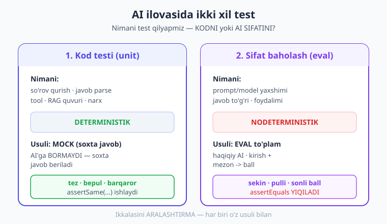
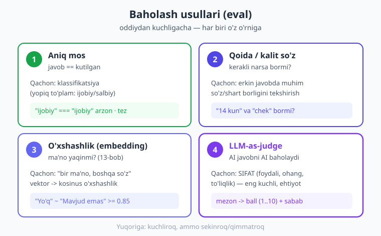
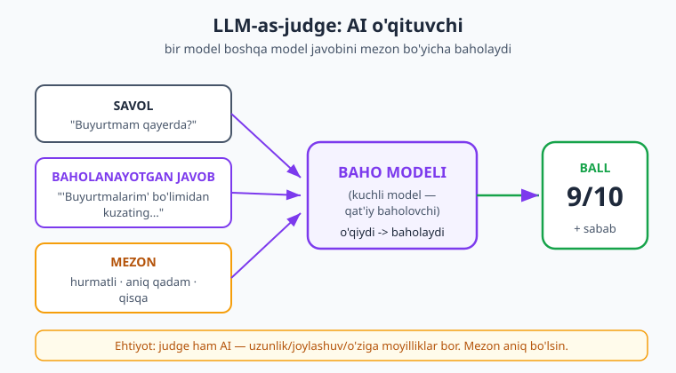

# 21 — Testlash va baholash

[⬅️ Oldingi: 20 — Xavfsizlik](./20-xavfsizlik.md) · [🏠 Kitob boshi](./README.md) · [Keyingi: 22 — Production va kuzatuv ➡️](./22-production-kuzatuv.md)

> **Bu bobda:** AI ilovasini qanday test qilamiz? Muammo shundaki, AI chiqishi **nodeterministik** — bir savolga har safar boshqacha javob bo'lishi mumkin, shuning uchun oddiy `assertEquals('kutilgan', $javob)` ishlamaydi. Biz ikki narsani **ajratamiz**: (1) **kodingiz** — so'rov qurish, javob parse, tool, RAG quvuri — buni mock bilan oddiy unit test qilamiz; (2) **prompt/chiqish sifati** — buni **baholash** (eval) bilan o'lchaymiz. Baholashning to'rt usulini ko'ramiz (aniq mos, qoida/kalit so'z, o'xshashlik, LLM-as-judge), eval to'plam quramiz, A/B taqqoslaymiz va hammasini CI'ga qo'yiladigan kichik eval skriptiga jamlaymiz.

---

## Nega bu bob boshqacha? — "Bir savol, har xil to'g'ri javob"

Tasavvur qiling, siz **matematika** o'qituvchisisiz. O'quvchidan "2 + 2 = ?" deb so'rasangiz — javob doim aniq: 4. To'g'ri yoki noto'g'ri, boshqa gap yo'q. Buni tekshirish oson: javob 4 bo'lsa — o'tdi.

Endi siz **adabiyot** o'qituvchisisiz. O'quvchidan "Kuz haqida insho yoz" deb so'rasangiz — bitta "to'g'ri" javob yo'q. Bir o'quvchi yomg'ir haqida, boshqasi sariq barglar haqida yozadi. Ikkalasi ham **to'g'ri** bo'lishi mumkin. Endi tekshirish qiyin: aniq matnni emas, **sifatni** baholaysiz — mavzuga mosmi, mantiqlimi, xatosizmi?

AI ilovasini test qilish ham aynan shunday ikki dunyoga bo'linadi.

Oddiy dasturda hamma narsa "matematika" kabi: `2 + 2` har doim `4`. Shuning uchun oddiy test shunday bo'ladi:

```php
// Oddiy (deterministik) kod — javob doim bir xil
assertEquals(4, qoshish(2, 2)); // har safar o'tadi
```

Lekin AI bilan:

```php
// AI chiqishi — har safar boshqacha bo'lishi mumkin!
$javob = $client->messages->create(/* "Salom de" */);
assertEquals('Salom!', $javob); // ❌ XATO yondashuv — javob "Assalomu alaykum!"
                                //    yoki "Salom, qanday yordam bera olaman?" bo'lishi mumkin
```

Bu test bugun o'tib, ertaga **yiqilishi** mumkin — kod o'zgarmasa ham. Sababi: AI chiqishi **nodeterministik** (ya'ni bir xil kirishga har safar bir xil chiqish bermaydi). Demak AI ilovasini test qilish — oddiy dasturni test qilishdan **boshqacha** bo'lishi kerak.

> **Hayotiy o'xshatish.** Oshpazni ikki xil tekshirish mumkin. Birinchisi: "Pichoqni to'g'ri ushladimi? Pechni 180 darajaga qo'ydimi?" — bu aniq, ha/yo'q (kodni test qilish). Ikkinchisi: "Taom mazaliroqmi? Tuzi yetarlimi?" — bu sifat, baho bilan (eval). Ikkalasi ham kerak, lekin ular **boshqa** usul talab qiladi.

---

## Ikki narsani ajrating: kod vs sifat

Bu bobning eng muhim g'oyasi — **nimani test qilayotganingizni aniq bilish**. AI ilovasida ikki butunlay boshqa narsa bor:

| Test turi | Nimani tekshiradi | Deterministikmi? | Usuli |
|---|---|---|---|
| **Kod testi** | So'rov to'g'ri qurildimi, javob to'g'ri parse bo'ldimi, tool ishladimi, RAG quvuri to'g'rimi | **Ha** (mock bilan) | Oddiy unit test (PHPUnit) |
| **Sifat baholash (eval)** | Prompt/model yaxshi javob beradimi, javob to'g'rimi/foydalimi | **Yo'q** (haqiqiy AI) | Eval to'plam + baholash mezoni |



Bu farqni tushunish — kalit. Ko'p odam birinchi marta AI'ni test qilmoqchi bo'lganda ikkalasini **aralashtirib** yuboradi: yo haqiqiy API'ga so'rov yuborib aniq matnni kutadi (har safar yiqiladi), yo umuman test yozmaydi ("AI'ni test qilib bo'lmaydi-ku").

To'g'ri yondashuv:

- **Kodingizning 90%** — AI **emas**. So'rovni qurish, JSON'ni parse qilish, tool funksiyangiz, RAG'da hujjat bo'laklash, narx hisoblash, xatoni qayta urinish. Bularning hammasi **oddiy, deterministik kod** — oddiy unit test bilan, AI'ga **umuman tegmasdan** test qilinadi (mock bilan).
- **Faqat AI chiqishining sifati** — eval bilan o'lchanadi. Bu sekinroq, pul turadi (haqiqiy so'rov), nodeterministik — shuning uchun alohida, kamroq ishlatiladi.

!!! tip "Maslahat"
    Birinchi savol har doim: "Bu test **kodni** sinayaptimi yoki **AI sifatini**?" Agar kodni — mock ishlat, haqiqiy API'ga borma. Agar sifatni — eval to'plam yoz. Ikkalasini bir testda aralashtirma.

---

## 1-qism: Kodni test qilish (mock bilan)

Boshlaylik eng oddiy va eng muhim qismdan — **kodingizni** test qilish. Bu yerda AI'ga **umuman bormaymiz**. O'rniga API'ni **mock** qilamiz (ya'ni soxta, oldindan tayyorlangan javob qaytaradigan o'rinbosar).

> **Hayotiy o'xshatish.** Aktyor mashqida ("repetitsiya") chinakam o'q ishlatilmaydi — soxta (mock) qurol bilan mashq qilinadi. Aktyor harakatini sinash uchun chinakam o'q kerak emas. Xuddi shunday: kodingiz so'rovni to'g'ri qurib, javobni to'g'ri parse qilishini sinash uchun chinakam (pulli, sekin, beqaror) AI so'rov kerak emas — soxta javob yetarli.

### Nega mock?

Agar har bir testda haqiqiy API'ga so'rov yuborsangiz:

- **Sekin** — har test bir necha soniya;
- **Pul turadi** — har test token sarflaydi;
- **Beqaror** — javob har safar boshqacha, test goh o'tadi goh yiqiladi;
- **Internetga bog'liq** — internet yo'q bo'lsa testlar ishlamaydi.

Mock bularning hammasini hal qiladi: testlar **bir zumda**, **bepul**, **barqaror** ishlaydi.

### Testlab bo'ladigan kod yozish

Mock qilish uchun kodingiz **to'g'ri tuzilgan** bo'lishi kerak. Sir: AI mijozini funksiya/klass **ichida** yaratmang, balki uni **tashqaridan bering** (buni "dependency injection" — bog'liqlikni kiritish deyiladi). Shunda testda haqiqiy mijoz o'rniga soxtasini bera olasiz.

Avvalo, AI javobidan teglarni ajratib oluvchi oddiy kodimiz bo'lsin. Bu kod AI javobini **parse** qiladi — aynan shu bizning kodimiz, biz uni test qilmoqchimiz:

```php
<?php

// Bizning kodimiz: AI javobidan vergul bilan ajratilgan teglarni
// toza massivga aylantiradi. Bu DETERMINISTIK — AI emas, oddiy mantiq.
function teglarniAjrat(string $xomJavob): array
{
    // "PHP, web , Backend," -> ['PHP', 'web', 'Backend']
    $bolaklar = explode(',', $xomJavob);
    $teglar = [];
    foreach ($bolaklar as $tag) {
        $tozalangan = trim($tag);          // ortiqcha bo'shliqlarni olib tashlaymiz
        if ($tozalangan !== '') {          // bo'sh bo'laklarni tashlaymiz
            $teglar[] = mb_strtolower($tozalangan);
        }
    }
    return $teglar;
}
```

Bu funksiya AI bilan **hech qanday aloqasi yo'q** — u shunchaki matnni qayta ishlaydi. Demak uni eng oddiy unit test bilan to'liq sinash mumkin:

```php
<?php
use PHPUnit\Framework\TestCase;

final class TeglarTest extends TestCase
{
    public function test_teglarni_tozalab_ajratadi(): void
    {
        // Kirish — AI qaytarishi mumkin bo'lgan "iflos" matn
        $natija = teglarniAjrat('PHP, web , Backend,');

        // Bu DETERMINISTIK — har safar aynan shu natija
        $this->assertSame(['php', 'web', 'backend'], $natija);
    }

    public function test_bosh_javobda_bosh_massiv(): void
    {
        $this->assertSame([], teglarniAjrat('   '));
    }
}
```

Diqqat: bu yerda `assertSame` (aniq mos) **to'g'ri** ishlaydi, chunki biz AI'ni emas, **o'z kodimizni** test qilyapmiz — u deterministik.

### Servis va mock

Endi haqiqiy holat: bizda AI mijozini **ishlatadigan** servis bor. Masalan, postga tegishli teglar oladigan servis. Uni shunday yozamiz — mijoz **tashqaridan** beriladi:

```php
<?php

use Anthropic\Client;

// AI mijozini ABSTRAKT interfeys orqali olamiz. Servis SDK'ning aniq
// klassiga emas, SHU interfeysga tayanadi — shuning uchun testda uni oson
// mock qilamiz (SDK Client'ning xususiyatlari qat'iy tiplangan, uni to'g'ridan
// mock qilib bo'lmaydi). Bu, qo'shimcha, provayder almashtirishni osonlashtiradi.
interface LlmMijoz
{
    public function javob(string $system, string $user): string;
}

// Haqiqiy implementatsiya — Anthropic SDK'ni o'raydi.
final class AnthropicMijoz implements LlmMijoz
{
    public function __construct(private Client $client) {}

    public function javob(string $system, string $user): string
    {
        $message = $this->client->messages->create(
            model: 'claude-haiku-4-5',
            maxTokens: 256,
            system: $system,
            messages: [['role' => 'user', 'content' => $user]],
        );
        return $message->content[0]->text;
    }
}

// Servis AI mijozini KONSTRUKTORDA, interfeys orqali oladi (dependency injection).
final class TegServis
{
    public function __construct(private LlmMijoz $llm) {}

    /** @return string[] */
    public function teglarOl(string $matn): array
    {
        $xom = $this->llm->javob(
            'Matnga 3 ta tegni FAQAT vergul bilan ajratib qaytar. Boshqa hech narsa.',
            $matn,
        );

        // Javobni parse qilamiz — bu BIZNING kodimiz, test qilmoqchimiz
        return teglarniAjrat($xom);
    }
}
```

Endi testda: haqiqiy `Client` o'rniga **soxta** mijoz beramiz. Bu soxta mijoz oldindan tayyorlangan javobni qaytaradi — internetga ham, pulga ham hojat yo'q:

```php
<?php
use PHPUnit\Framework\TestCase;

final class TegServisTest extends TestCase
{
    public function test_javobni_toza_teglarga_aylantiradi(): void
    {
        // 1) LlmMijoz interfeysini mock qilamiz: javob() oldindan tayyorlangan
        //    matnni qaytarsin — internetga ham, pulga ham hojat yo'q.
        $soxta = $this->createMock(LlmMijoz::class);
        $soxta->method('javob')->willReturn('PHP, Backend , Web');

        // 2) Servisga haqiqiy emas, MOCK mijozni beramiz
        $servis = new TegServis($soxta);
        $natija = $servis->teglarOl('PHP haqida maqola');

        // 3) Endi DETERMINISTIK tekshiramiz — kod javobni to'g'ri parse qildimi?
        $this->assertSame(['php', 'backend', 'web'], $natija);
    }
}
```

Mana shu — AI ilovasini test qilishning **eng muhim** turi. Biz tekshirdik: kodimiz AI javobini to'g'ri **parse** qiladimi. Haqiqiy AI'ga **bormadik** — test bir zumda, bepul, barqaror. AI har safar boshqacha javob bersa ham, bizning **parse mantig'imiz** o'zgarmaydi, demak bu test ishonchli.

!!! note "Nega o'z interfeysimiz?"
    Diqqat qiling: servisni to'g'ridan SDK'ning `Anthropic\Client` klassiga emas, **o'z `LlmMijoz` interfeysimizga** tayantirdik. Sababi ikki xil: (1) SDK Client'ning xususiyatlari qat'iy tiplangan, uni "soxta" obyekt bilan almashtirib bo'lmaydi — interfeysni esa bir qatorda mock qilamiz; (2) bu provayderni almashtirishni ham osonlashtiradi — ertaga OpenAI'ga o'tsangiz, faqat yangi `OpenAiMijoz implements LlmMijoz` yozasiz, servis o'zgarmaydi (19-bobdagi "provayder-agnostik" g'oya).

!!! tip "Maslahat"
    Mock bilan **xato** holatlarni ham sinang: API `APIException` (429 rate limit) tashlasa, kodingiz to'g'ri qayta uringaymi yoki fallback'ga o'tadimi (8-bob)? Mock'ga `willThrowException(...)` berib, ishonchlilik mantig'ingizni AI'ga tegmasdan test qilasiz.

---

## Strukturali chiqishni test qilish

Eslang, 6-bobda **strukturali chiqish** (JSON) ni o'rgangandik — model erkin matn emas, aniq tuzilishdagi ma'lumot qaytaradi. Bu testlash uchun **sovg'a**: erkin matn nodeterministik, lekin **tuzilish** (struktura) deterministik tekshiriladi.

Mana farq. Erkin javobni tekshirish qiyin:

```text
"Bu maqolaning sarlavhasi 'PHP asoslari', muallifi Ali..." ← har safar boshqacha so'z tartibi
```

Lekin strukturali javobda **maydonlar** bor — ularni aniq tekshira olamiz:

```php
<?php

// AI strukturali (JSON) chiqish berdi deylik — uni parse qildik:
$natija = [
    'sarlavha' => 'PHP asoslari',
    'narx'     => 50000,
    'mavjud'   => true,
];

// SHAKL (struktura) DETERMINISTIK — uni aniq tekshiramiz:
function strukturaToriqmi(array $data): bool
{
    // Kerakli maydonlar bormi?
    if (!isset($data['sarlavha'], $data['narx'], $data['mavjud'])) {
        return false;
    }
    // Turlari to'g'rimi?
    if (!is_string($data['sarlavha'])) return false;
    if (!is_int($data['narx']) || $data['narx'] < 0) return false;
    if (!is_bool($data['mavjud'])) return false;

    return true;
}
```

Test bo'lsa oddiy va barqaror:

```php
<?php
use PHPUnit\Framework\TestCase;

final class StrukturaTest extends TestCase
{
    public function test_toliq_javob_otadi(): void
    {
        $data = ['sarlavha' => 'PHP', 'narx' => 50000, 'mavjud' => true];
        $this->assertTrue(strukturaToriqmi($data));
    }

    public function test_narx_yoq_bolsa_yiqiladi(): void
    {
        $data = ['sarlavha' => 'PHP', 'mavjud' => true]; // narx yo'q
        $this->assertFalse(strukturaToriqmi($data));
    }

    public function test_narx_manfiy_bolsa_yiqiladi(): void
    {
        $data = ['sarlavha' => 'PHP', 'narx' => -10, 'mavjud' => true];
        $this->assertFalse(strukturaToriqmi($data));
    }
}
```

Diqqat qiling: **mazmun** (sarlavha aynan "PHP asoslari"mi) nodeterministik bo'lsa-da, **shakl** (kerakli maydonlar bormi, turlari to'g'rimi) doim aniq. Strukturali chiqish AI testini ancha **oddiy** qiladi — shuning uchun mumkin bo'lganda strukturali chiqishni afzal ko'ring.

!!! tip "Maslahat"
    6-bobdagi SDK'ning strukturali chiqishi (`outputConfig: ['format' => Klass::class]`, `->parsed`) javobni **avtomatik** validatsiya qiladi: agar model sxemaga mos JSON qaytarmasa, parse qadami xato tashlaydi. Ya'ni bir qism "struktura testi" siz uchun **ichida** allaqachon bajariladi. Sizning testingiz esa biznes qoidalarini (narx manfiy emas, sana o'tmishda emas...) qo'shimcha tekshiradi.

---

## 2-qism: Baholash (eval) — "AI imtihoni"

Endi ikkinchi dunyoga o'tamiz: AI chiqishining **sifatini** o'lchash. Buni inglizchada **eval** (evaluation — baholash) deyiladi.

> **Hayotiy o'xshatish.** Eval — bu AI uchun **imtihon**. O'qituvchi imtihonni shunday tuzadi: bir to'plam **savol** (kirish) tayyorlaydi, har biriga **kutilgan javob yoki baholash mezoni** belgilaydi, keyin o'quvchi javoblarini shu mezon bo'yicha **baholaydi** va umumiy **ball** chiqaradi. Eval ham aynan shu: AI'ga test savollarini beramiz, javoblarini mezon bo'yicha baholaymiz, sifat ballini olamiz.

Eval nima uchun kerak?

- **Promptni yaxshilash.** Promptingizni o'zgartirdingiz — yaxshilandimi yoki yomonlashdimi? Eval ball aytadi.
- **Model tanlash.** Haiku yetarlimi yoki Opus kerakmi? Eval to'plamda ikkalasini taqqoslaysiz (16-bob — xarajat).
- **Regress (orqaga ketishni) tutish.** Bir narsani tuzatib, boshqasini buzdingizmi? Eval avval ishlagan misollarni qayta tekshiradi.

Eng muhim nuqta: **"yaxshi tuyuldi" — bu metrik emas.** Promptni qo'lda 2-3 marta sinab "zo'r ishlayapti" deyish — aldamchi. Eval — bu **sonli, takrorlanadigan** o'lchov.

### Eval'ning anatomiyasi

Har bir eval — bu **test holatlari** (test case) ro'yxati. Har holat:

- **Kirish** (input) — AI'ga beriladigan savol/topshiriq;
- **Kutilgan natija yoki mezon** — to'g'ri javob qanday bo'lishi kerak;
- **Baholash usuli** — javobni mezon bilan qanday solishtiramiz.

```php
<?php

// Eval to'plami — savol + kutilgan natija juftliklari.
// Bu sizning "imtihon savollaringiz".
$evalToplam = [
    ['kirish' => 'Bu mahsulot zo\'r, juda mamnunman!',      'kutilgan' => 'ijobiy'],
    ['kirish' => 'Yetkazib berish kechikdi, asabim buzildi', 'kutilgan' => 'salbiy'],
    ['kirish' => 'Mahsulot keldi, qadog\'i butun edi',        'kutilgan' => 'neytral'],
    // ... real loyihada 20-100+ holat
];
```

---

## Baholash usullari — javobni mezon bilan solishtirish

To'rt asosiy usul bor — eng oddiyidan eng kuchligiga. Har birining o'z o'rni bor.



### 1-usul: Aniq mos (klassifikatsiya uchun)

Eng oddiy. Faqat **cheklangan javoblar** bo'lganda ishlaydi — masalan klassifikatsiya (ijobiy/salbiy/neytral, spam/spam-emas, kategoriya). Javob faqat shu to'plamdan bo'ladi, shuning uchun aniq solishtirish mumkin.

```php
<?php

// "ijobiy" == "ijobiy" ? Oddiy.
function anaqMos(string $javob, string $kutilgan): bool
{
    return mb_strtolower(trim($javob)) === mb_strtolower(trim($kutilgan));
}
```

Bu usul **faqat** javoblar to'plami yopiq bo'lganda yaroqli. Erkin matnga (insho, javob, xulosa) **ishlamaydi** — chunki bir xil ma'noni minglab xil so'z bilan ifodalash mumkin.

### 2-usul: Qoida / kalit so'z (javobda kerakli narsa bormi)

Erkin javobda **muhim narsa bor-yo'qligini** tekshiramiz. Aniq matn emas, balki ma'lum kalit so'z/shart bormi.

```php
<?php

// Javobda kerakli kalit so'zlarning HAMMASI bormi?
function kalitSozBor(string $javob, array $kerakli): bool
{
    $past = mb_strtolower($javob);
    foreach ($kerakli as $soz) {
        if (!str_contains($past, mb_strtolower($soz))) {
            return false; // bittasi yo'q bo'lsa — yiqildi
        }
    }
    return true;
}

// Misol: qaytarish siyosati javobida "14 kun" va "chek" eslatilishi SHART
$ok = kalitSozBor($aiJavob, ['14 kun', 'chek']);
```

Qoidalar boshqa narsalarni ham tekshirishi mumkin: javob juda uzun emasmi (`mb_strlen`), taqiqlangan so'z **yo'qmi** (xavfsizlik), formatga mosmi (telefon raqami, sana). Bu — arzon, tez, deterministik tekshiruv.

### 3-usul: O'xshashlik (embedding bilan)

Ba'zan javob **boshqa so'z** bilan, lekin **bir xil ma'no** bilan bo'lishi mumkin: "Mavjud emas" va "Hozir yo'q" — bir ma'no, boshqa so'z. Aniq mos bularni "xato" deydi, kalit so'z ham qiyin. Yechim — **embedding** (13-bob): ikkala matnni vektorga aylantirib, **ma'no yaqinligini** o'lchaymiz.

```php
<?php

// 13-bobdagi kosinus o'xshashligi: -1..1 (1 = bir xil ma'no)
function kosinusOxshashlik(array $a, array $b): float
{
    $nuqta = 0.0; $normA = 0.0; $normB = 0.0;
    foreach ($a as $i => $v) {
        $nuqta += $v * $b[$i];
        $normA += $v * $v;
        $normB += $b[$i] * $b[$i];
    }
    return $nuqta / (sqrt($normA) * sqrt($normB));
}

// Javob va kutilgan javobni embedding'ga aylantirib o'xshashlikni o'lchaymiz.
// Agar o'xshashlik > 0.85 bo'lsa — "to'g'ri" deb hisoblaymiz (chegarani o'zingiz tanlaysiz).
$oxshashlik = kosinusOxshashlik($javobVektor, $kutilganVektor);
$toryri = $oxshashlik >= 0.85;
```

Bu usul "bir xil ma'no, boshqa so'z" muammosini hal qiladi — savol-javob, qisqacha xulosa kabi erkin javoblar uchun ayni muddao. Kamchilik: embedding so'rovi pul/vaqt turadi, va chegara (`0.85`) tajriba bilan tanlanadi.

### 4-usul: LLM-as-judge — bu alohida muhim, pastda batafsil.

---

## LLM-as-judge: bir modeldan boshqasini baholashni so'rash

Eng kuchli usul. G'oya oddiy: **bir AI modeldan boshqa AI javobini baholashni so'raymiz**. Inson o'qituvchi kabi, model javobni mezon bo'yicha o'qib, **ball** qo'yadi.

> **Hayotiy o'xshatish.** Imtihonni o'qituvchi tekshiradi. Inshoni "to'g'ri/noto'g'ri" deb avtomatik baholab bo'lmaydi — o'qituvchi o'qib, mezon (mavzuga mos, mantiqli, savodli) bo'yicha baho qo'yadi. LLM-as-judge — bu **AI o'qituvchi**: u boshqa AI javobini o'qib, mezon bo'yicha ball beradi.



Bu usul boshqalar uddalay olmagan narsani qiladi: **sifatni** (nafaqat "to'g'ri/noto'g'ri", balki "qanchalik yaxshi") baholaydi — foydalilik, ohang, to'liqlik, aniqlik. Kalit so'z yoki o'xshashlik buni o'lchay olmaydi.

### To'liq misol

Baholashni **strukturali chiqish** (6-bob) bilan qilamiz — judge'dan aniq formatda ball + izoh so'raymiz, shunda parse qilish oson va ishonchli. Avval baho modeli o'qib qaytaradigan natija shaklini ta'riflaymiz:

```php
<?php
require __DIR__ . '/vendor/autoload.php';

use Anthropic\Client;
use Anthropic\Lib\Contracts\StructuredOutputModel;
use Anthropic\Lib\Concerns\StructuredOutputModelTrait;

// Judge qaytaradigan baho shakli (strukturali chiqish — 6-bob)
class Baho implements StructuredOutputModel
{
    use StructuredOutputModelTrait;

    public int $ball;       // 1..10
    public string $sabab;   // nega aynan shu ball
}
```

Endi judge funksiyasini yozamiz. Diqqat: judge'ga **savol**, **baholanayotgan javob** va aniq **mezon** beramiz:

```php
<?php

// Bir AI javobini boshqa AI bilan baholaymiz.
function llmBaho(Client $client, string $savol, string $javob, string $mezon): Baho
{
    // Judge uchun system prompt — qat'iy, mezonli baholovchi rolini beramiz
    $system = <<<TXT
    Sen qat'iy, adolatli baholovchisan. Senga SAVOL, JAVOB va MEZON beriladi.
    Javobni FAQAT mezon bo'yicha 1 dan 10 gacha baholab, qisqa sabab yoz.
    1 = mezonga umuman mos emas. 10 = mezonni mukammal qondiradi.
    Xushomad qilma, qattiqqo'l bo'l.
    TXT;

    $foydalanuvchi = <<<TXT
    SAVOL:
    {$savol}

    BAHOLANAYOTGAN JAVOB:
    {$javob}

    MEZON:
    {$mezon}
    TXT;

    $message = $client->messages->create(
        model: 'claude-opus-4-8',   // baholovchi KUCHLI model bo'lgani ma'qul
        maxTokens: 512,
        system: $system,
        messages: [['role' => 'user', 'content' => $foydalanuvchi]],
        outputConfig: ['format' => Baho::class],   // strukturali baho
    );

    return $message->content[0]->parsed;   // Baho obyekti: ->ball, ->sabab
}
```

Ishlatish:

```php
<?php
$client = new Client(apiKey: getenv('ANTHROPIC_API_KEY'));

$baho = llmBaho(
    $client,
    savol: 'Mijoz: "Buyurtmam qayerda?" — javob yoz.',
    javob: 'Buyurtmangizni "Mening buyurtmalarim" bo\'limidan kuzatishingiz mumkin. Yordam kerak bo\'lsa, yozing.',
    mezon: 'Javob hurmatli bo\'lsin, aniq qadam ko\'rsatsin, qisqa bo\'lsin.',
);

echo "Ball: {$baho->ball}/10\n";
echo "Sabab: {$baho->sabab}\n";
```

Bu — juda kuchli. Lekin **ehtiyot** bilan ishlatish kerak.

!!! warning "Ehtiyot bo'ling"
    LLM-as-judge ham AI — u ham **xato qilishi** mumkin va o'z **noxolisliklariga** ega:

    - **Uzunlikka moyillik** — judge uzunroq javobni "yaxshiroq" deb baholashga moyil (uzun = sifatli emas).
    - **Joylashuvga moyillik** — ikki javobni taqqoslashda birinchi (yoki oxirgi) berilganni afzal ko'rishi mumkin.
    - **O'ziga moyillik** — model o'z uslubidagi javobni yuqori baholashi mumkin.

    Yumshatish: mezonni **aniq** yozing (raqamli, tekshiriladigan), judge'ga **kuchli** model bering, muhim qarorlarda judge bahosini **inson** bilan tasdiqlang. LLM-as-judge — qo'shimcha asbob, **yagona haqiqat** emas.

!!! tip "Maslahat"
    Judge'ni o'zini **kalibrlang**: bir nechta misolni **siz** ham baholang (qo'lda) va judge bahosi bilan solishtiring. Agar judge sizning bahoyingizga yaqin bo'lsa — unga ishonsa bo'ladi. Ajralib ketsa — mezonni aniqlashtiring yoki promptni tuzating.

---

## Eval to'plam qurish va regress

Eval to'plami — sizning **eng qimmatli boyligingiz**. Uni qanday quramiz?

1. **Real misollardan boshlang.** O'ylab topilgan emas, haqiqiy foydalanuvchi savollarini to'plang (log'dan, qo'llab-quvvatlash yozishmalaridan). Real misollar real muammolarni ochadi.
2. **Qiyin holatlarni qo'shing.** Faqat oson emas — chegaraviy, chalkash, "tuzoq" savollar (bo'sh kirish, juda uzun, ikki tilli, provokatsion). Aynan shular xatoni ochadi.
3. **Xato topilganda — eval'ga qo'shing.** Production'da xato javob ko'rdingizmi? Uni darhol eval to'plamga **yangi holat** qilib qo'shing. Shunda u **boshqa qaytmaydi** (regress himoyasi).
4. **Har o'zgarishda qayta yuriting.** Prompt yoki modelni o'zgartirdingizmi — butun eval to'plamni qayta ishga tushiring.

> **Hayotiy o'xshatish.** Eval to'plam — bu kasallik tarixi. Shifokor har gal davolaganda kasallik tarixiga yozadi. Yangi dori bersa, eski muammolar qaytmaganini ham tekshiradi. Eval ham shunday: har topilgan xato — yangi yozuv; har o'zgarishda butun "tarix" qayta tekshiriladi.

**Regress** — bu eng muhim foyda. Tasavvur qiling, promptni "javob qisqaroq bo'lsin" deb o'zgartirdingiz. Javoblar qisqardi — zo'r. Lekin balki endi ba'zi javoblar **muhim ma'lumotni tushirib qoldiryapti**? Eval to'plam buni darhol ko'rsatadi: avval o'tgan misollar endi yiqilsa — siz regress (orqaga ketish) qilgansiz.

!!! note "Eslatma"
    Eval to'plamni **versiya nazoratida** (git) saqlang — oddiy JSON yoki PHP massiv fayli sifatida. Shunda u kod bilan birga rivojlanadi va o'zgarishlar tarixi ko'rinadi.

---

## A/B taqqoslash — qaysi prompt/model yaxshiroq?

Eval to'plam tayyor bo'lsa, **ikki variantni** (A va B) **bir xil to'plamda** ishga tushirib, ballarni solishtirasiz. Bu — "yaxshi tuyuldi" o'rniga **sonli** qaror.

> **Hayotiy o'xshatish.** Ikki retsept — qaysi biri mazaliroq? Bir necha kishiga **ikkalasini ham** tatib ko'rtirib, ballarini yig'asiz. "Menimcha A yaxshiroq" emas — "A: 8.2, B: 7.1 ball" degan aniq natija. A/B eval ham aynan shu.

```php
<?php

// Bir eval to'plamda ikki promptni solishtiramiz va o'rtacha ballni chiqaramiz.
function abTaqqoslash(Client $client, array $toplam, string $promptA, string $promptB): array
{
    $ballA = 0.0;
    $ballB = 0.0;

    foreach ($toplam as $holat) {
        // A varianti
        $javobA = $client->messages->create(
            model: 'claude-haiku-4-5', maxTokens: 256,
            system: $promptA,
            messages: [['role' => 'user', 'content' => $holat['kirish']]],
        )->content[0]->text;

        // B varianti — AYNI savol, boshqa prompt
        $javobB = $client->messages->create(
            model: 'claude-haiku-4-5', maxTokens: 256,
            system: $promptB,
            messages: [['role' => 'user', 'content' => $holat['kirish']]],
        )->content[0]->text;

        // Har ikkalasini judge bilan baholaymiz (yoki kalit so'z/o'xshashlik bilan)
        $ballA += llmBaho($client, $holat['kirish'], $javobA, $holat['mezon'])->ball;
        $ballB += llmBaho($client, $holat['kirish'], $javobB, $holat['mezon'])->ball;
    }

    $n = count($toplam);
    return [
        'A_ortacha' => round($ballA / $n, 2),
        'B_ortacha' => round($ballB / $n, 2),
        'galib'     => $ballA > $ballB ? 'A' : ($ballB > $ballA ? 'B' : 'durang'),
    ];
}
```

Natija: `['A_ortacha' => 8.2, 'B_ortacha' => 7.1, 'galib' => 'A']`. Endi qaysi promptni production'ga chiqarish — **fikr** emas, **dalil**.

!!! tip "Maslahat"
    A/B'ni faqat promptga emas, **modelga** ham qo'llang (16-bob): Haiku bilan Opus'ni bir eval to'plamda solishtiring. Ko'pincha Haiku ball Opus'dan biroz past bo'ladi, lekin **5 barobar arzon**. Agar Haiku bahosi yetarli bo'lsa — pulni tejaysiz. Eval bu qarorni **raqam bilan** beradi.

---

## Test piramidasi — AI uchun

An'anaviy dasturda **test piramidasi** bor: pastda ko'p (tez, arzon) unit test, o'rtada kamroq integratsiya testi, tepada juda kam (sekin, qimmat) qo'lda/E2E test. AI ilovasida ham xuddi shunday — faqat o'rta qatlam **eval**ga aylanadi.

| Qatlam | Nima | Qancha | Tezligi | Qachon yuriydi |
|---|---|---|---|---|
| **Pastki: Unit (kod)** | So'rov qurish, parse, tool, RAG mantig'i — mock bilan | **Ko'p** | Bir zumda | Har commit'da (CI) |
| **O'rta: Eval (sifat)** | Prompt/model sifati — eval to'plam, baholash | O'rtacha | Sekin, pulli | Prompt/model o'zgarganda |
| **Yuqori: Qo'lda** | Eng qiyin, nozik holatlar — inson ko'zi | **Kam** | Eng sekin | Katta relizdan oldin |

Asosiy g'oya o'sha: **ko'p arzon (kod), kam qimmat (qo'lda)**. Kodingizning katta qismi AI emas — uni mock bilan to'liq, tez, bepul qoplang. Eval'ni nuqtali, muhim oqimlarga ishlating. Qo'lda tekshiruvni faqat eng qiyin holatlarga saqlang.

!!! tip "Maslahat"
    **Unit testlarni** (mock — bepul, tez) har commit'da CI'da yuriting. **Eval**ni (pulli, sekin) har commit'da emas — prompt/model o'zgarganda yoki kunlik/haftalik jadval bilan yuriting. Shunda CI tez qoladi, lekin sifat ham nazoratda bo'ladi.

---

## To'liq misol: kichik eval skript

Endi hammasini birlashtiramiz — kichik, ishlaydigan eval skript. U **klassifikator promptini** eval to'plamda baholaydi: **aniqlik foizini** (aniq mos bilan) hisoblaydi va bir misolni **LLM-judge** bilan sifat jihatdan baholaydi.

Avval eval to'plam va aniqlikni hisoblovchi qism. Bu funksiya AI'ga so'rov yuborib, javobni kutilgan bilan solishtiradi:

```php
<?php
require __DIR__ . '/vendor/autoload.php';

use Anthropic\Client;

$client = new Client(apiKey: getenv('ANTHROPIC_API_KEY'));

// 1) Eval to'plam — sentiment klassifikatori uchun (kirish + kutilgan)
$toplam = [
    ['kirish' => 'Bu mahsulot ajoyib, juda mamnunman!',     'kutilgan' => 'ijobiy'],
    ['kirish' => 'Yetkazib berish kechikdi, asabim buzildi', 'kutilgan' => 'salbiy'],
    ['kirish' => 'Mahsulot keldi, qadog\'i butun',            'kutilgan' => 'neytral'],
    ['kirish' => 'Hech qachon bu yerdan olmayman, dahshat',   'kutilgan' => 'salbiy'],
    ['kirish' => 'Narxi arzon, sifati ham yaxshi ekan',       'kutilgan' => 'ijobiy'],
];

// Klassifikator prompti — biz baholayotgan PROMPT
$prompt = 'Matn sentimentini ANIQ bitta so\'z bilan ayt: ijobiy, salbiy yoki neytral. '
        . 'Boshqa hech narsa yozma.';
```

Endi to'plamni yurib, har bir holat uchun AI javobini olib, aniq mos bilan tekshiramiz va aniqlik foizini chiqaramiz:

```php
<?php

// 2) To'plamni baholaymiz: aniqlik (to'g'ri / jami)
$toryri = 0;
$jami = count($toplam);

foreach ($toplam as $holat) {
    $javob = $client->messages->create(
        model: 'claude-haiku-4-5',   // klassifikatsiya — arzon model yetadi
        maxTokens: 16,
        system: $prompt,
        messages: [['role' => 'user', 'content' => $holat['kirish']]],
    )->content[0]->text;

    // Klassifikatsiya — ANIQ MOS to'g'ri usul (javoblar yopiq to'plam)
    $javobToza = mb_strtolower(trim($javob));
    $mos = ($javobToza === $holat['kutilgan']);
    if ($mos) {
        $toryri++;
    }

    $belgi = $mos ? 'OK ' : 'XATO';
    echo "[{$belgi}] \"{$holat['kirish']}\" -> {$javobToza} (kutilgan: {$holat['kutilgan']})\n";
}

$aniqlik = round($toryri / $jami * 100, 1);
echo "\nAniqlik: {$toryri}/{$jami} = {$aniqlik}%\n";
```

Chiqish taxminan shunday bo'ladi:

```text
[OK ] "Bu mahsulot ajoyib, juda mamnunman!" -> ijobiy (kutilgan: ijobiy)
[OK ] "Yetkazib berish kechikdi, asabim buzildi" -> salbiy (kutilgan: salbiy)
[OK ] "Mahsulot keldi, qadog'i butun" -> neytral (kutilgan: neytral)
[OK ] "Hech qachon bu yerdan olmayman, dahshat" -> salbiy (kutilgan: salbiy)
[OK ] "Narxi arzon, sifati ham yaxshi ekan" -> ijobiy (kutilgan: ijobiy)

Aniqlik: 5/5 = 100.0%
```

Mana shu — **sonli, takrorlanadigan** sifat o'lchovi. Endi promptni o'zgartirsangiz va aniqlik 100% dan 80% ga tushsa — darhol bilasiz. Aksincha, oshsa — yaxshilaganingizga **dalilingiz** bor.

Va nihoyat, erkin javob (klassifikatsiya emas) uchun bir misolni **LLM-judge** bilan baholaymiz — yuqorida yozgan `llmBaho()` ni ishlatib:

```php
<?php

// 3) Erkin javob sifatini LLM-judge bilan o'lchaymiz
$javob = 'Buyurtmangizni "Mening buyurtmalarim" bo\'limida kuzatishingiz mumkin. '
       . 'Hali ham savol bo\'lsa, bemalol yozing.';

$baho = llmBaho(
    $client,
    savol: 'Mijoz: "Buyurtmam qayerda?" — yordamchi javobi.',
    javob: $javob,
    mezon: 'Hurmatli ohang, aniq keyingi qadam, ortiqcha so\'zsiz.',
);

echo "Sifat bahosi: {$baho->ball}/10 — {$baho->sabab}\n";
```

Diqqat qiling, biz **ikkala** usulni qo'lladik: klassifikatsiyaga **aniq mos** (aniqlik foizi), erkin javobga **LLM-judge** (sifat balli). To'g'ri usulni topshiriqqa qarab tanlash — eval'ning kaliti.

!!! note "Eslatma"
    Bu skriptni biroz kengaytirib (natijani JSON'ga yozish, oldingi natija bilan solishtirish, chegaradan past bo'lsa xato kod qaytarish) to'g'ridan-to'g'ri **CI**ga (GitHub Actions va h.k.) qo'yish mumkin: prompt o'zgarganda quvur eval'ni avtomatik yuradi va aniqlik tushib ketsa **build'ni yiqitadi**. Bu — "doimiy baholash" (continuous evaluation).

---

## Xulosa

- **AI chiqishi nodeterministik** — bir savolga har xil to'g'ri javob bo'lishi mumkin. Shuning uchun erkin javobga oddiy `assertEquals` **ishlamaydi**; AI testi an'anaviy testdan boshqacha bo'lishi kerak.
- **Ikki narsani ajrating.** (1) **Kod** (so'rov qurish, parse, tool, RAG) — deterministik, oddiy unit test; (2) **sifat** (prompt/chiqish) — eval bilan o'lchanadi. Aralashtirmang.
- **Kodni mock bilan test qiling.** AI mijozni tashqaridan bering (dependency injection), testda haqiqiy o'rniga soxta (mock) javob bering — tez, bepul, barqaror, internetsiz. Kodingizning katta qismi AI emas.
- **Strukturali chiqish (6-bob) testni osonlashtiradi.** Mazmun nodeterministik bo'lsa-da, **shakl** (maydonlar, turlari) deterministik tekshiriladi.
- **Eval — AI imtihoni:** test to'plami (kirish + kutilgan/mezon) + avtomatik baholash + sonli ball. "Yaxshi tuyuldi" — metrik emas.
- **To'rt baholash usuli:** aniq mos (klassifikatsiya), qoida/kalit so'z (kerakli narsa bormi), o'xshashlik (embedding — bir ma'no boshqa so'z, 13-bob), **LLM-as-judge** (model boshqa javobni mezon bo'yicha baholaydi).
- **LLM-as-judge kuchli, lekin ehtiyot:** uzunlik/joylashuv/o'ziga moyilliklar bor; mezonni aniq yozing, judge'ga kuchli model bering, muhim qarorni inson bilan tasdiqlang.
- **Eval to'plamni o'stiring (regress):** real misollar + qiyin holatlar + har topilgan xato yangi holat sifatida. Har prompt/model o'zgarishida qayta yuriting. A/B bilan ikki variantni **sonli** solishtiring. Test piramidasi: ko'p unit (CI'da), o'rta eval, kam qo'lda.

---

## Amaliy mashqlar

1. **Kod mock testi.** `teglarniAjrat()` kabi o'z parse funksiyangizni yozing (masalan, AI javobidan birinchi qatordagi sarlavhani ajratib oluvchi). Keyin uni ishlatadigan `SarlavhaServis` yozing (mijoz konstruktorda) va PHPUnit'da `Client`'ni **mock** qilib, soxta javob bilan parse mantig'ini tekshiring. Haqiqiy API'ga **bormang**.

2. **Strukturali test.** Mahsulot ma'lumoti uchun `strukturaToriqmi()` ga o'xshash validator yozing (kerakli maydonlar: `nom`, `narx`, `sklad_soni`; qoidalar: `narx > 0`, `sklad_soni >= 0`). Kamida 4 ta test holati yozing: to'liq to'g'ri, bir maydon yetishmaydi, narx manfiy, sklad_soni manfiy. Qaysi holatlar o'tishi/yiqilishini oldindan ayting.

3. **Eval to'plam + aniqlik.** Kamida 8 ta holatli eval to'plam tuzing (masalan, savolni "texnik/sotuv/shikoyat" kategoriyaga ajratuvchi klassifikator). Yuqoridagi eval skriptini moslang, har holatni aniq mos bilan tekshiring va aniqlik foizini chiqaring. Keyin promptni biroz o'zgartiring va aniqlik o'zgarganini kuzating.

4. **LLM-judge.** `llmBaho()` ni ishlatib, bitta erkin javobni **uch xil mezon** bilan baholang (masalan: faqat "qisqalik", faqat "hurmatlilik", faqat "aniqlik"). Ballar qanday farq qilishini va nega farq qilishini izohlang. Keyin judge bahosini o'zingiz qo'ygan baho bilan solishtiring (kalibrlash).

5. **A/B taqqoslash.** `abTaqqoslash()` ni ishlatib, bir vazifa uchun ikki promptni (yoki bir promptni Haiku va Sonnet modellarida) bir eval to'plamda solishtiring. O'rtacha ballarni chiqaring va g'olibni e'lon qiling. Natijaga qarab: qaysi variantni production'ga chiqargan bo'lardingiz va nega (sifat vs xarajat)?

---

[⬅️ Oldingi: 20 — Xavfsizlik](./20-xavfsizlik.md) · [🏠 Kitob boshi](./README.md) · [Keyingi: 22 — Production va kuzatuv ➡️](./22-production-kuzatuv.md)
