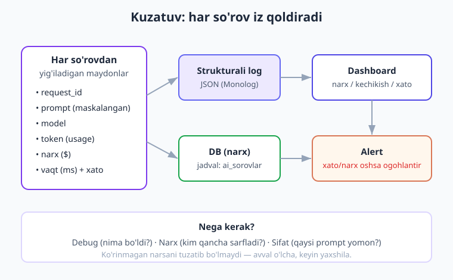
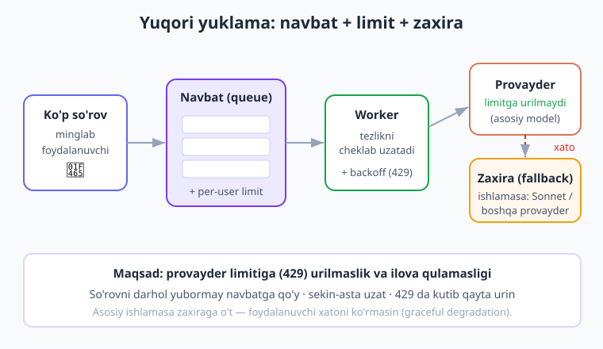
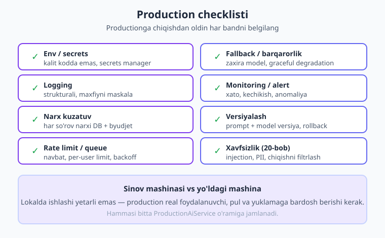

# 22 — Production va kuzatuv

[⬅️ Oldingi: 21 — Testlash va baholash](./21-testlash-baholash.md) · [🏠 Kitob boshi](./README.md) · [Keyingi: 23 — Promptlarni boshqarish ➡️](./23-promptlarni-boshqarish.md)

> **Bu bobda:** ilovangiz lokal kompyuterda ishladi — endi uni **production**ga (real foydalanuvchilarga) chiqaramiz. Bu yerda hamma narsa o'zgaradi: real pul ketadi, ishonchlilik shart, yuklama o'sadi. Biz oldingi 21 bobdagi g'oyalarni (konfiguratsiya, xato boshqaruvi, kesh, xavfsizlik, fallback) bitta **production tizimi**ga jamlaymiz: har so'rovni **log** qilamiz, narxini **DB**da kuzatamiz, **rate limit** va **navbat** bilan provayderga urilmaymiz, **monitoring va alert** o'rnatamiz, va `ProductionAiService` o'ramini yozamiz. Maqsad — ilova **ishonchli, arzon va kuzatiladigan** bo'lsin.

---

## Nega bu bob muhim? — "Sinov mashinasi vs yo'ldagi mashina"

Tasavvur qiling, ishlab chiqaruvchi yangi mashinani **sinov maydonchasida** sinaydi. U yerda yo'l silliq, boshqa mashina yo'q, hech kim shoshmaydi. Mashina a'lo ketadi.

Lekin shu mashina **haqiqiy yo'l**ga chiqsa — vaziyat butunlay boshqacha bo'ladi: tirbandlik, yomg'ir, beparvo haydovchilar, uzoq masofa. Sinovda zo'r ko'ringan mashina yo'lda buzilib qolishi mumkin. Shuning uchun ishlab chiqaruvchi mashinaga **xavfsizlik tizimlari** (tormoz, signal, dvigatel datchiklari, ogohlantirish lampochkalari) qo'shadi.

AI ilovasi ham aynan shunday. Sizning kompyuteringizda u zo'r ishlaydi: bitta foydalanuvchi (siz), bitta so'rov, internet barqaror, pul muammosi yo'q. Lekin **production** — bu real yo'l:

- **Real foydalanuvchilar** — mingta odam bir vaqtda so'rov yuborishi mumkin.
- **Real pul** — har so'rov tokenga, ya'ni pulga aylanadi (16-bob). Bitta xatolik hisobni osmonga chiqarishi mumkin.
- **Ishonchlilik** — provayder vaqtincha ishlamasa, internet uzilsa, ilova **qulamasligi** kerak.
- **Masshtab** — yuklama o'sgani sayin provayder limitiga (429) urilasiz.

Demak AI ilovani productionga chiqarish faqat "kod tayyor" degani emas. U **datchiklar** (logging), **lampochkalar** (monitoring/alert), **tormoz** (rate limit), va **zaxira g'ildirak** (fallback) bilan jihozlangan bo'lishi kerak.

> **Hayotiy o'xshatish.** Production AI ilova — bu uzoq safarga chiqayotgan mashina. Sizga faqat dvigatel (model) emas, balki yoqilg'i datchigi (narx kuzatuvi), spidometr (kechikish), "tekshir dvigatel" lampochkasi (alert) va zaxira g'ildirak (fallback) ham kerak. Bularsiz safar xavfli.



!!! note "Eslatma"
    Bu bob — **yangi g'oya o'rgatmaydi**, balki kitob davomida o'rganganlaringizni (8-bob xato/fallback, 16-bob kesh/narx, 20-bob xavfsizlik, 18-bob Laravel/queue) bitta **production tizimi**ga **jamlaydi**. Buni "tashqi qatlam" deb tasavvur qiling: kodingiz atrofiga himoya va kuzatuv o'rab olasiz.

---

## 1. Konfiguratsiya — kalit va sozlamalar joyi

Birinchi qoida: **hech narsa kodda qattiq yozilmasin**. Na API kalit, na model nomi, na maxTokens. Sababi oddiy — bularni o'zgartirish uchun har safar kodni qayta deploy qilish kerak bo'lmasin, va eng muhimi — **kalit kodda tursa, GitHub'ga tushib ketadi** (20-bob).

To'g'ri yondashuv — **muhit o'zgaruvchisi** (environment variable). Dev'da `.env` faylida, productionda esa **secrets manager**da (AWS Secrets Manager, Vault, yoki hosting panelidagi "Environment Variables").

Avval konfiguratsiyani bitta **klass**ga jamlaymiz. Bu — barcha sozlamalarni bir joyda saqlaydi va xato bo'lsa darhol aytadi:

```php
<?php

final class AiKonfig
{
    public function __construct(
        public readonly string $apiKalit,
        public readonly string $model,
        public readonly int $maxTokens,
        public readonly string $muhit,       // dev | staging | prod
        public readonly float $kunlikByudjet, // dollarda
    ) {}

    // Hamma sozlamani muhit o'zgaruvchisidan o'qiymiz
    public static function muhitdan(): self
    {
        $kalit = getenv('ANTHROPIC_API_KEY');
        if ($kalit === false || $kalit === '') {
            // Kalit yo'q bo'lsa darhol qulaymiz — yashirin xatodan ko'ra ochiq xato yaxshi
            throw new \RuntimeException('ANTHROPIC_API_KEY o\'rnatilmagan!');
        }

        return new self(
            apiKalit: $kalit,
            model: getenv('AI_MODEL') ?: 'claude-opus-4-8',
            maxTokens: (int) (getenv('AI_MAX_TOKENS') ?: 1024),
            muhit: getenv('APP_ENV') ?: 'dev',
            kunlikByudjet: (float) (getenv('AI_KUNLIK_BYUDJET') ?: 10.0),
        );
    }
}
```

Endi `.env` fayli (dev uchun — bu fayl **`.gitignore`**ga qo'shilgan bo'lishi shart):

```bash
# .env — HECH QACHON git'ga tushmasin!
ANTHROPIC_API_KEY=sk-ant-...
AI_MODEL=claude-opus-4-8
AI_MAX_TOKENS=1024
APP_ENV=dev
AI_KUNLIK_BYUDJET=10.0
```

E'tibor bering: **model va parametrlar ham sozlanadigan**. Bu juda muhim — masalan, productionda byudjet kam bo'lsa, kodga tegmasdan `AI_MODEL=claude-haiku-4-5` qilib arzon modelga o'tasiz. Yoki yangi model chiqsa — bir qator o'zgartirish bilan o'tasiz.

> **Hayotiy o'xshatish.** Konfiguratsiya — mashinaning boshqaruv paneli. Tezlikni, isitgichni, chiroqni siz dvigatelni qayta yig'masdan, panelda boshqarasiz. Sozlamalar ham kodga tegmasdan tashqaridan o'zgaradi.

### Muhitlar: dev / staging / prod

Yaxshi loyihada **uchta muhit** bo'ladi:

| Muhit | Maqsad | Misol sozlama |
|---|---|---|
| **dev** | Sizning kompyuteringiz — ishlab chiqish | `.env` fayl, arzon model, ko'p log |
| **staging** | Productionga o'xshash sinov muhiti | alohida kalit, real model, test ma'lumot |
| **prod** | Real foydalanuvchilar | secrets manager, alert yoniq, byudjet qattiq |

Har muhitning **alohida kaliti** bo'lgani ma'qul — shunda staging'dagi test productiondagi byudjetni yemaydi va aralashib ketmaydi.

!!! warning "Ehtiyot bo'ling"
    `.env` faylini **hech qachon** git'ga qo'shmang. `.gitignore`da `.env` borligini tekshiring. Productionda esa `.env` fayl emas, hostingning **secrets** mexanizmidan foydalaning — fayl serverda ham o'g'irlanishi mumkin.

---

## 2. Logging va observability — eng muhim qism

Production ilovada **eng katta muammo** — nima bo'layotganini ko'rmaslik. Foydalanuvchi "javob yomon edi" deydi, lekin siz qaysi prompt yuborilganini, qaysi model javob berganini, qancha vaqt ketganini bilmaysiz. Bu — qorong'i xonada mashina haydashga o'xshaydi.

**Observability** (kuzatiluvchanlik) — bu ilovaning **ichida** nima bo'layotganini tashqaridan ko'ra olish qobiliyati. Buning asosi — **logging** (har voqeani yozib borish).

Har AI so'rovi uchun quyidagilarni log qilamiz:

- **request_id** — har so'rovga unikal raqam (xatoni izlash uchun);
- **prompt** — yuborilgan savol (**maxfiy ma'lumotni maskalab** — 20-bob);
- **model** — qaysi model ishladi;
- **token (usage)** — kirish/chiqish token soni;
- **narx** — bu so'rov necha dollar turdi;
- **vaqt** — necha millisekund ketdi;
- **xato** — agar xato bo'lsa, nima xato.

Nega bularni log qilamiz? Uch sabab:

1. **Debug** — biror narsa buzilsa, `request_id` bo'yicha aniq nima bo'lganini topasiz.
2. **Narx** — kim, qancha sarflayotganini bilasiz va byudjetni boshqarasiz.
3. **Sifat** — qaysi promptlar yomon javob beradi, qaysi modellar tez ishlaydi — buni ko'rib yaxshilaysiz.

### Strukturali log (JSON)

Oddiy matn log (`error_log("Xato bo'ldi")`) yomon — uni keyin **qidirish va filtrlash qiyin**. To'g'ri yo'l — **strukturali log**: har yozuv **JSON** ko'rinishida, maydonlari aniq. Shunda "bugun Opus modelidagi xatolarni ko'rsat" degan so'rovni dastur bajaradi.

PHP'da eng mashhur logging kutubxonasi — **Monolog** (Laravel ham shuni ishlatadi). Avval o'rnatamiz:

```bash
composer require monolog/monolog
```

Endi JSON ko'rinishida log yozadigan logger sozlaymiz:

```php
use Monolog\Logger;
use Monolog\Handler\StreamHandler;
use Monolog\Formatter\JsonFormatter;

// "ai" nomli logger, faylga yozadi
$logger = new Logger('ai');
$handler = new StreamHandler(__DIR__ . '/storage/ai.log', Logger::INFO);
$handler->setFormatter(new JsonFormatter()); // har satr — JSON
$logger->pushHandler($handler);

// Misol log yozuvi:
$logger->info('ai_sorov', [
    'request_id'    => 'a1b2c3d4',
    'model'         => 'claude-opus-4-8',
    'kirish_token'  => 1200,
    'chiqish_token' => 300,
    'narx'          => 0.0135,
    'davomiylik_ms' => 850,
]);
```

Agar Monolog'siz, sof PHP bilan ishlamoqchi bo'lsangiz — `error_log` + `json_encode` ham yetadi:

```php
function aiLog(array $maydon): void
{
    // JSON_UNESCAPED_UNICODE — o'zbekcha harflar buzilmasin
    error_log(json_encode($maydon, JSON_UNESCAPED_UNICODE));
}
```

### Maxfiy ma'lumotni maskalash

Eng muhim qoida: **maxfiy ma'lumotni log'ga to'liq yozmang**. Foydalanuvchi promptida email, telefon, karta raqami bo'lishi mumkin (20-bob). Log fayli o'g'irlansa — bu ma'lumot ochiq qoladi. Shuning uchun log'dan oldin **maskalaymiz**:

```php
function maskala(string $matn): string
{
    // email -> [email]
    $matn = preg_replace('/[\w.+-]+@[\w-]+\.[\w.-]+/', '[email]', $matn) ?? $matn;
    // 9+ raqamli ketma-ketlik (karta/telefon) -> [raqam]
    $matn = preg_replace('/\b\d{9,}\b/', '[raqam]', $matn) ?? $matn;
    return $matn;
}

// "ali@test.uz, karta 1234567890123" -> "[email], karta [raqam]"
```

!!! danger "Xavfsizlik"
    Log'da to'liq prompt saqlash — eng keng tarqalgan ma'lumot sizishi sababi. Foydalanuvchi parol, karta yoki shaxsiy ma'lumot kiritsa, u log faylida abadiy qoladi. **Doim maskalang** yoki promptning faqat birinchi qismini (masalan 200 belgi) saqlang. To'liq qoidalar — 20-bobda.

---

## 3. Xarajat kuzatuvi — har so'rov narxini saqlash

Log fayli yaxshi, lekin "bu oy AI'ga qancha sarfladim?" yoki "qaysi foydalanuvchi eng ko'p sarfladi?" degan savolga javob berish uchun bizga **DB** kerak. 16-bobda har so'rov narxini hisoblashni o'rgangandik (`usage` -> narx). Endi shu narxni **saqlaymiz va jamlaymiz**.

Avval narx hisoblash funksiyasini eslaylik (16-bobdan):

```php
const NARX = [
    'claude-opus-4-8'   => ['kirish' => 5.00, 'chiqish' => 25.00],
    'claude-sonnet-4-6' => ['kirish' => 3.00, 'chiqish' => 15.00],
    'claude-haiku-4-5'  => ['kirish' => 1.00, 'chiqish' => 5.00],
];

function sorovNarxi(string $model, int $kirishTok, int $chiqishTok): float
{
    $n = NARX[$model] ?? NARX['claude-opus-4-8'];
    return ($kirishTok / 1_000_000) * $n['kirish']
         + ($chiqishTok / 1_000_000) * $n['chiqish'];
}
```

Endi DB jadvalini yaratamiz. Bu yerda misol uchun **SQLite** (eng sodda, faylda saqlanadi), lekin productionda **MySQL/PostgreSQL** ishlatasiz — kod deyarli bir xil:

```php
function dbOch(string $yol = 'storage/ai.sqlite'): \PDO
{
    $pdo = new \PDO('sqlite:' . $yol);
    $pdo->setAttribute(\PDO::ATTR_ERRMODE, \PDO::ERRMODE_EXCEPTION);

    $pdo->exec('CREATE TABLE IF NOT EXISTS ai_sorovlar (
        id INTEGER PRIMARY KEY AUTOINCREMENT,
        request_id    TEXT,
        foydalanuvchi TEXT,
        model         TEXT,
        kirish_token  INTEGER,
        chiqish_token INTEGER,
        narx          REAL,
        davomiylik_ms INTEGER,
        xato          TEXT,
        sana          TEXT
    )');
    return $pdo;
}
```

Har so'rovdan keyin bitta qator qo'shamiz:

```php
function narxSaqla(\PDO $pdo, array $q): void
{
    $stmt = $pdo->prepare('INSERT INTO ai_sorovlar
        (request_id, foydalanuvchi, model, kirish_token, chiqish_token,
         narx, davomiylik_ms, xato, sana)
        VALUES (:rid, :fo, :mo, :ki, :ch, :na, :dav, :xa, :sa)');
    $stmt->execute([
        ':rid' => $q['request_id'],  ':fo'  => $q['foydalanuvchi'],
        ':mo'  => $q['model'],       ':ki'  => $q['kirish_token'],
        ':ch'  => $q['chiqish_token'], ':na' => $q['narx'],
        ':dav' => $q['davomiylik_ms'], ':xa' => $q['xato'],
        ':sa'  => $q['sana'],
    ]);
}
```

### Jamlash va byudjet chegarasi

Endi DB'da ma'lumot bor — savollarga javob bera olamiz. Masalan, **bugungi jami xarajat**:

```php
function kunlikJami(\PDO $pdo, string $sana): float
{
    $stmt = $pdo->prepare(
        'SELECT COALESCE(SUM(narx), 0) FROM ai_sorovlar WHERE sana LIKE :s'
    );
    $stmt->execute([':s' => $sana . '%']);  // '2026-06-15%'
    return (float) $stmt->fetchColumn();
}
```

Va eng muhimi — **byudjet chegarasi**. So'rov yuborishdan **oldin** bugungi jami xarajatni tekshirib, byudjet tugagan bo'lsa to'xtatamiz (16-bobdagi g'oyaning production versiyasi):

```php
$bugun = date('Y-m-d');
$jami = kunlikJami($pdo, $bugun);

if ($jami >= $konfig->kunlikByudjet) {
    // Byudjet tugadi — so'rov yubormaymiz, ogohlantiramiz
    aiLog(['daraja' => 'warning', 'xabar' => 'Kunlik byudjet tugadi', 'jami' => $jami]);
    throw new \RuntimeException('Kunlik AI byudjeti tugadi.');
}
```

Foydalanuvchi/kun/feature bo'yicha jamlash ham xuddi shu naqsh — `GROUP BY` bilan:

```php
// Har foydalanuvchi bugun qancha sarfladi (eng ko'p sarflaganlar tepada)
$stmt = $pdo->query(
    'SELECT foydalanuvchi, SUM(narx) AS jami, COUNT(*) AS soni
     FROM ai_sorovlar
     WHERE sana LIKE \'' . date('Y-m-d') . '%\'
     GROUP BY foydalanuvchi
     ORDER BY jami DESC'
);
```

> **Hayotiy o'xshatish.** Xarajat kuzatuvi — yoqilg'i hisoblagich. Mashinada qancha benzin yoqayotganingizni ko'rmasangiz, bak to'satdan bo'shab qoladi. AI'da ham — har so'rov narxini saqlamasangiz, oy oxiridagi hisob siz uchun "syurpriz" bo'ladi.

!!! tip "Maslahat"
    Bu ma'lumotdan oddiy **dashboard** yasash oson: bitta sahifa, kunlik xarajat grafigi, top-10 foydalanuvchi, o'rtacha kechikish. Laravel'da bu — bitta controller + Blade sahifa. Boshlanishiga hatto oddiy SQL so'rov natijasini HTML jadvalda ko'rsatish ham yetadi.

---

## 4. Monitoring va alert — muammoni o'zingiz bilan birinchi biling

Logging — voqealarni **yozib boradi**. Monitoring — ularni **kuzatib turadi** va biror narsa noto'g'ri ketsa **sizni ogohlantiradi**. Farqi: logni siz qidirasiz; alert sizni **o'zi topadi**.

Production'da quyidagilarni kuzatib turish kerak:

- **Xato darajasi** (error rate) — so'rovlarning necha foizi xato bilan tugayapti? Odatda < 1%. To'satdan 10% bo'lsa — nimadir buzilgan.
- **Kechikish** (latency) — so'rovlar qancha vaqt olyapti? Sekinlashsa — provayder yoki tarmoq muammosi.
- **Token sarfi** — kutilmaganda oshib ketdimi? (Masalan, kimdir promptga ulkan matn yuboryapti.)
- **Anomaliya** — har qanday g'ayrioddiy o'zgarish (so'rov soni 10 barobar oshdi).

DB'dagi ma'lumotdan shu metrikalarni hisoblaymiz:

```php
function metrikalar(\PDO $pdo, string $sana): array
{
    $stmt = $pdo->prepare('SELECT
        COUNT(*) AS jami,
        SUM(CASE WHEN xato IS NOT NULL THEN 1 ELSE 0 END) AS xatolar,
        AVG(davomiylik_ms) AS ort_kechikish,
        SUM(narx) AS jami_narx
        FROM ai_sorovlar WHERE sana LIKE :s');
    $stmt->execute([':s' => $sana . '%']);
    $r = $stmt->fetch(\PDO::FETCH_ASSOC);

    $jami = (int) ($r['jami'] ?? 0);
    $xatolar = (int) ($r['xatolar'] ?? 0);

    return [
        'jami_sorov'    => $jami,
        'xato_foiz'     => $jami > 0 ? round($xatolar / $jami * 100, 1) : 0.0,
        'ort_kechikish' => round((float) ($r['ort_kechikish'] ?? 0)),
        'jami_narx'     => round((float) ($r['jami_narx'] ?? 0), 4),
    ];
}
```

Endi **alert** — metrika chegaradan oshsa, sizga xabar yuboramiz (email, Telegram, Slack):

```php
$m = metrikalar($pdo, date('Y-m-d'));

if ($m['xato_foiz'] > 5.0) {
    ogohlantir("⚠️ AI xato darajasi yuqori: {$m['xato_foiz']}%");
}
if ($m['jami_narx'] > $konfig->kunlikByudjet * 0.8) {
    ogohlantir("💰 Byudjetning 80% sarflandi: \${$m['jami_narx']}");
}

function ogohlantir(string $xabar): void
{
    // Bu yerda Telegram/Slack/email API'ga yuborasiz.
    // Eng sodda: error_log + admin emailga.
    error_log('[ALERT] ' . $xabar);
    // mail('admin@sayt.uz', 'AI alert', $xabar);
}
```

Bu funksiyani **cron** (rejalashtirilgan vazifa) orqali har 5-10 daqiqada chaqirasiz — shunda muammoni foydalanuvchidan oldin bilasiz.

!!! info "Boshqa provayderda"
    Provayderning **o'zi ham ishlamay** qolishi mumkin. Anthropic, OpenAI va boshqalar **status sahifasi** (status page) yuritadi — u yerda servis holatini ko'rsatadi. Productionda bu sahifalarni kuzatish (yoki RSS/webhookiga ulanish) tavsiya etiladi — shunda "bizning kod buzildi" deb behuda vaqt sarflamaysiz, aslida provayder tomonda muammo bo'lsa.

> **Hayotiy o'xshatish.** Alert — mashinadagi "tekshir dvigatel" lampochkasi. U yonganda hali mashina yurib turibdi, lekin yashirin muammo bor — uni e'tiborsiz qoldirsangiz, keyinroq yo'l o'rtasida to'xtab qolasiz. Alert sizga **vaqtida** ogohlantiradi.

---

## 5. Latency (kechikish) boshqaruvi — foydalanuvchi kutmasin

AI so'rovlari sekin bo'lishi mumkin — model uzun javobni yozishi bir necha soniya oladi. Foydalanuvchi 5 soniya bo'sh ekranga qarab o'tirsa — ketib qoladi. Latency boshqaruvi — javobni **tezroq** yoki hech bo'lmaganda **tezroq his qildirish**.

Bir necha usul (ko'pi avvalgi boblardan):

- **Streaming** (5-bob) — eng kuchli usul. Javobni to'liq kutmay, **so'z-so'z** ko'rsatasiz. Real tezlik o'zgarmaydi, lekin foydalanuvchi darhol harakat ko'radi va kutgandek his qilmaydi.
- **Kichik model** — oddiy ishga **Haiku** (16-bob) ishlatish: u Opus'dan ancha tez. Murakkab ish uchungina kuchli modelga o'ting.
- **Prompt caching** (16-bob) — katta o'zgarmas kontekst keshlangach, takror so'rov tezroq ham, arzonroq ham bo'ladi.
- **Parallel / queue** — bir nechta mustaqil so'rovni ketma-ket emas, **parallel** yuboring; foydalanuvchini kutdirmaslik uchun og'ir ishni **navbatga** (queue) qo'yib, natijani keyin yetkazing.

Misol — uzun javob uchun streaming (5-bobdan, production'da `flush()` bilan):

```php
$stream = $client->messages->createStream(
    model: 'claude-opus-4-8',
    maxTokens: 1024,
    messages: [['role' => 'user', 'content' => $savol]],
);

foreach ($stream as $event) {
    if ($event->type === 'content_block_delta'
        && ($event->delta->type ?? '') === 'text_delta') {
        echo $event->delta->text;
        flush(); // foydalanuvchiga darhol ko'rsat
    }
}
```

!!! tip "Maslahat"
    Eng arzon "tezlik" — to'g'ri **idrok**. Foydalanuvchi 3 soniya streaming javobni o'qib turgani, 3 soniya bo'sh ekranga qarab turganidan ancha yaxshi. Iloji bo'lsa, har doim streaming ishlating — bu foydalanuvchi tajribasini tubdan yaxshilaydi.

---

## 6. Fallback va barqarorlik — AI yiqilsa ilova qulamasin

Production'ning oltin qoidasi: **AI ishlamasa ham ilova ishlashi kerak**. Provayder vaqtincha tushib qolishi, model deprecate bo'lishi, limitga urilish — bularning hammasi **bo'ladi**. Tayyor bo'lish kerak.

8-bobda biz `fallbackSora()` ni yozgandik. Endi uni production kontekstida ko'ramiz. Asosiy model ishlamasa — **zaxira modelga** o'tamiz:

```php
use Anthropic\Core\Exceptions\APIException;

function fallbackSora(Client $client, array $modellar, array $messages): string
{
    $oxirgiXato = null;
    foreach ($modellar as $model) {
        try {
            $message = $client->messages->create(
                model: $model,
                maxTokens: 1024,
                messages: $messages,
            );
            return $message->content[0]->text; // ishladi — qaytaramiz
        } catch (APIException $e) {
            $oxirgiXato = $e;
            aiLog(['daraja' => 'warning', 'xabar' => "'{$model}' ishlamadi, zaxiraga o'tamiz"]);
            continue; // keyingi modelni sinaymiz
        }
    }
    throw $oxirgiXato ?? new \RuntimeException('Hech bir model ishlamadi');
}

// Opus ishlamasa -> Sonnet, u ham ishlamasa -> Haiku
$javob = fallbackSora($client, [
    'claude-opus-4-8',
    'claude-sonnet-4-6',
    'claude-haiku-4-5',
], [['role' => 'user', 'content' => 'Salom']]);
```

Zaxira faqat **bitta provayder ichida** emas — boshqa **provayderga** ham o'tishi mumkin (Claude ishlamasa -> OpenAI; 19-bob). Buning uchun kodingiz provayderga **bog'lanmagan** (abstraksiya orqali) bo'lishi kerak.

### Graceful degradation — yumshoq pasayish

Ba'zan **hech bir** model ishlamaydi. Bu holda ham ilova **butunlay qulamasligi** kerak. Bu — **graceful degradation** ("yumshoq pasayish"): AI qismi ishlamasa, ilovaning qolgan qismi ishlashda davom etadi.

Misol — AI tavsiya tizimi ishlamasa, oddiy (AI'siz) ro'yxat ko'rsatamiz:

```php
try {
    $tavsiyalar = $aiService->tavsiyaBer($foydalanuvchi);
} catch (\Throwable $e) {
    aiLog(['daraja' => 'error', 'xabar' => 'AI tavsiya ishlamadi', 'xato' => $e->getMessage()]);
    // AI yiqildi — lekin foydalanuvchi bo'sh sahifa ko'rmasin:
    $tavsiyalar = $oddiyMashhurMahsulotlar; // zaxira: oddiy mashhurlar ro'yxati
}
```

> **Hayotiy o'xshatish.** Fallback — mashinadagi zaxira g'ildirak. Asosiy g'ildirak teshilsa, safar to'xtamaydi — zaxirani qo'yib davom etasiz. Graceful degradation esa — navigator ishlamay qolsa ham mashinani haydashda davom etasiz, shunchaki yo'lni o'zingiz topasiz.



---

## 7. Rate limit boshqaruvi — provayder limitiga urilmaslik

Provayderlar **rate limit** qo'yadi: daqiqada nechta so'rov va token yuborishingiz mumkinligini cheklaydi. Limitdan oshsangiz — **429** xatosi (8-bob). Yuklama o'sgan sari bunga tez-tez urilasiz.

Boshqaruvning bir necha qatlami:

1. **Navbat (queue)** — barcha so'rovni darhol yubormay, **navbatga** qo'yasiz. Worker ularni **bir tekis** uzatadi — limitga urilmaslik uchun (18-bobdagi Laravel queue).
2. **Per-user limit** — bitta foydalanuvchi cheksiz so'rov yubormasin. Masalan: daqiqada 10 so'rov.
3. **Backoff** — 429 kelsa, **kutib qayta urinish** (8-bobdagi exponential backoff). SDK buni **avtomatik** ham qiladi.
4. **Bir nechta kalit/workspace** — juda katta yuklamada bir nechta API kaliti orasida taqsimlash mumkin.

Oddiy per-user limit (fayl/Redis bilan — bu yerda APCu yoki oddiy hisoblagich misol):

```php
// Foydalanuvchi daqiqasiga 10 so'rovdan oshmasin
function limitTekshir(\PDO $pdo, string $foydalanuvchi, int $maks = 10): void
{
    $stmt = $pdo->prepare(
        'SELECT COUNT(*) FROM ai_sorovlar
         WHERE foydalanuvchi = :fo AND sana >= :vaqt'
    );
    $stmt->execute([
        ':fo'   => $foydalanuvchi,
        ':vaqt' => date('Y-m-d H:i:s', time() - 60), // oxirgi 60 soniya
    ]);

    if ((int) $stmt->fetchColumn() >= $maks) {
        throw new \RuntimeException('Juda ko\'p so\'rov — biroz kuting.');
    }
}
```

SDK'ning avtomatik backoff'ini eslaylik (8-bob) — klient yaratganda urinish sonini sozlash mumkin. Lekin asosiy himoya — so'rovlarni **navbat** orqali bir tekis uzatish. Laravel'da bu — Job + Queue (18-bob); sof PHP'da — oddiy DB navbati va cron worker.

!!! warning "Ehtiyot bo'ling"
    Foydalanuvchidan keladigan so'rovni **to'g'ridan-to'g'ri** Claude'ga yuborish — yuqori yuklamada xavfli. Yuz kishi bir vaqtda tugma bossa, yuz so'rov bir zumda ketadi va 429 olasiz. **Navbat** — eng ishonchli yechim: so'rov tezligini siz nazorat qilasiz, provayder emas.

---

## 8. Versiyalash — o'zgarishni kuzatish va rollback

Promptlar va modellar **vaqt o'tib o'zgaradi**. Siz promptni yaxshilaysiz, model yangilanadi yoki eskisi deprecate bo'ladi. Muammo shundaki — yangi prompt **yomonroq** ishlashi ham mumkin. Shuning uchun **qaysi versiya** ishlatilganini bilish va kerak bo'lsa **orqaga qaytarish** (rollback) muhim.

Eng sodda yechim — har so'rov log'iga **prompt versiyasi** va **model versiyasi**ni qo'shish:

```php
const PROMPT_VERSIYA = 'sys-v3'; // system promptni o'zgartirganda oshiramiz

function versiyaliMeta(string $promptVer, string $model): array
{
    return ['prompt_versiya' => $promptVer, 'model_versiya' => $model];
}

// Har log/DB yozuvga qo'shiladi:
aiLog([
    'request_id'    => $requestId,
    'prompt_versiya' => PROMPT_VERSIYA,
    'model'         => 'claude-opus-4-8',
    // ...
]);
```

Endi log'ga qarab "v3 promptga o'tgandan keyin sifat tushdimi?" degan savolga javob bera olasiz. Yomon bo'lsa — `sys-v2`ga **rollback** qilasiz (kodda bir qatorni o'zgartirib). Promptlarni jiddiy boshqarish (A/B test, markazlashtirilgan saqlash) — **23-bobning** mavzusi.

!!! note "Eslatma"
    Model **deprecate** bo'lishi (eskirib, o'chirilishi) ham bo'ladi. Shuning uchun model nomi konfiguratsiyada (1-bo'lim) bo'lgani muhim — yangi modelga o'tish bir qatorni o'zgartirishga aylanadi. Migratsiyadan oldin yangi modelni **staging**da sinab ko'ring (21-bob — baholash).

---

## 9. Deploy — ilovani productionga chiqarish

Endi hamma narsa tayyor — ilovani serverga **deploy** qilamiz. AI ilova deploy'i oddiy PHP ilovasidan deyarli farq qilmaydi, faqat bir necha qo'shimcha nuqta bor. Qisqa checklist (Laravel/PHP misolida):

```bash
# 1. Kodni serverga olib chiqish
git pull origin main

# 2. Bog'liqliklarni o'rnatish (dev paketlarsiz, optimallashtirilgan)
composer install --no-dev --optimize-autoloader

# 3. Muhit o'zgaruvchilari (secrets manager / hosting paneli) — .env EMAS
#    ANTHROPIC_API_KEY, AI_MODEL, APP_ENV=prod ... o'rnatilgan bo'lsin

# 4. Laravel bo'lsa: konfiguratsiyani keshlash
php artisan config:cache

# 5. DB migratsiyasi (ai_sorovlar jadvali yaratilsin)
php artisan migrate --force

# 6. Queue worker'ni ishga tushirish (so'rovlarni navbatdan uzatadi)
php artisan queue:work --tries=3
```

Bir necha muhim nuqta:

- **Queue worker** — fonda doim ishlab turishi kerak (supervisor yoki systemd bilan boshqariladi). U o'lib qolsa, navbatdagi so'rovlar bajarilmaydi.
- **Env** — productionda kalitni `.env` faylda emas, hostingning **secrets** mexanizmida saqlang.
- **Monitoring ulash** — deploy'dan keyin alert va dashboard ishlayotganini tekshiring. Eng yomon vaziyat — muammo bor, lekin alert ishlamaydi.

!!! tip "Maslahat"
    Deploy'dan keyin **staging**da hammani sinab ko'rmasdan productionga chiqarmang. Bitta noto'g'ri konfiguratsiya (masalan, byudjet `0`, yoki noto'g'ri model nomi) productionda real pul va xatolarga aylanadi. "O'lchab kes, bir marta kes."

---

## 10. Production checklisti

Productionga chiqishdan oldin shu ro'yxatdan o'ting. Har band — alohida bo'lim sifatida yuqorida ko'rib chiqildi:



- [ ] **Env / secrets** — API kalit kodda emas, muhit o'zgaruvchisida (prod'da secrets manager). `.env` git'da yo'q.
- [ ] **Logging** — har so'rov strukturali (JSON) log'ga yoziladi; maxfiy ma'lumot maskalanadi.
- [ ] **Narx kuzatuvi** — har so'rov narxi DB'da; foydalanuvchi/kun bo'yicha jamlanadi; byudjet chegarasi bor.
- [ ] **Rate limit / queue** — so'rovlar navbat orqali; per-user limit; 429'da backoff.
- [ ] **Fallback / barqarorlik** — zaxira model/provayder; AI yiqilsa graceful degradation.
- [ ] **Monitoring / alert** — xato darajasi, kechikish, narx kuzatiladi; chegaradan oshsa ogohlantirish.
- [ ] **Versiyalash** — prompt va model versiyasi har yozuvda; rollback imkoni.
- [ ] **Xavfsizlik (20-bob)** — prompt injection himoyasi, PII filtrlash, chiqishni tekshirish.

!!! question "Tekshirib ko'ring"
    Ilovangiz uchun shu ro'yxatdagi nechta band tayyor? Eng kamida **env/secrets**, **logging** va **narx kuzatuvi** bo'lmasa — productionga chiqmang. Bular — minimal "xavfsizlik kamari".

---

## 11. To'liq misol: `ProductionAiService`

Endi hamma narsani **bitta o'ram**ga jamlaymiz. Bu `ProductionAiService` quyidagilarni birlashtiradi: byudjet tekshiruvi -> so'rov -> `usage`/narx hisoblash -> log -> DB'ga saqlash -> xato boshqaruvi. Real loyihada AI bilan ishlash **shu bitta darvoza** orqali o'tadi:

```php
use Anthropic\Client;
use Anthropic\Core\Exceptions\APIException;

final class ProductionAiService
{
    public function __construct(
        private readonly Client $client,
        private readonly \PDO $pdo,
        private readonly AiKonfig $konfig,
    ) {}

    public function sora(string $savol, string $foydalanuvchi = 'anonim'): string
    {
        $requestId = bin2hex(random_bytes(8)); // unikal iz
        $boshlandi = microtime(true);

        // 1) Byudjet tekshiruvi — tugagan bo'lsa so'rov yubormaymiz
        $bugun = date('Y-m-d');
        if (kunlikJami($this->pdo, $bugun) >= $this->konfig->kunlikByudjet) {
            aiLog(['daraja' => 'warning', 'xabar' => 'Byudjet tugadi']);
            throw new \RuntimeException('Kunlik AI byudjeti tugadi.');
        }

        $model = $this->konfig->model;
        $xato = null;
        $narx = 0.0; $kirish = 0; $chiqish = 0; $natija = '';

        try {
            // 2) So'rov
            $message = $this->client->messages->create(
                model: $model,
                maxTokens: $this->konfig->maxTokens,
                messages: [['role' => 'user', 'content' => $savol]],
            );
            $natija  = $message->content[0]->text;
            // 3) usage -> narx (16-bob)
            $kirish  = $message->usage->inputTokens;
            $chiqish = $message->usage->outputTokens;
            $narx    = sorovNarxi($model, $kirish, $chiqish);
        } catch (APIException $e) {
            $xato = $e->getMessage();
            throw $e; // chaqiruvchiga uzatamiz (fallback/graceful u yerda)
        } finally {
            // 4) log + DB — XATO BO'LSA HAM (finally bloki har doim ishlaydi)
            $davomiylik = (int) round((microtime(true) - $boshlandi) * 1000);

            $yozuv = [
                'daraja'         => $xato ? 'error' : 'info',
                'request_id'     => $requestId,
                'foydalanuvchi'  => $foydalanuvchi,
                'model'          => $model,
                'prompt'         => maskala(mb_substr($savol, 0, 200)), // maskalangan
                'kirish_token'   => $kirish,
                'chiqish_token'  => $chiqish,
                'narx'           => round($narx, 6),
                'davomiylik_ms'  => $davomiylik,
                'prompt_versiya' => PROMPT_VERSIYA,
                'xato'           => $xato,
                'sana'           => date('c'),
            ];
            aiLog($yozuv);                 // strukturali log
            narxSaqla($this->pdo, [        // DB'ga (jamlash uchun)
                'request_id'    => $requestId, 'foydalanuvchi' => $foydalanuvchi,
                'model'         => $model,     'kirish_token'  => $kirish,
                'chiqish_token' => $chiqish,   'narx'          => $narx,
                'davomiylik_ms' => $davomiylik, 'xato'         => $xato,
                'sana'          => date('Y-m-d H:i:s'),
            ]);
        }

        return $natija;
    }
}
```

Ishlatish — juda sodda, chunki murakkablik o'ram ichida:

```php
$konfig  = AiKonfig::muhitdan();
$client  = new Client(apiKey: $konfig->apiKalit);
$pdo     = dbOch();
$service = new ProductionAiService($client, $pdo, $konfig);

// Har so'rov: avtomatik log + narx + byudjet + iz
$javob = $service->sora('PHP nima?', foydalanuvchi: 'ali');
echo $javob;
```

E'tibor bering — **`finally` bloki**: u xato bo'lsa ham, bo'lmasa ham **doim ishlaydi**. Demak xatoli so'rov ham log va DB'ga tushadi (xato darajasini hisoblash uchun bu **shart**). Bu o'ramni 8-bobdagi `fallbackSora()` va 16-bobdagi keshlash bilan birlashtirsangiz — to'liq **ishonchli + arzon + kuzatiladigan** production servisi tayyor bo'ladi.

!!! note "Eslatma"
    Laravel'da (18-bob) bu klass `app/Services/`ga joylashadi, `Client` va `PDO` esa **dependency injection** orqali keladi. `aiLog()` o'rniga Laravel'ning `Log::` fasadi (Monolog ustida), `PDO` o'rniga Eloquent model (`AiSorov`) ishlatiladi. G'oya bir xil, faqat freymvork vositalari bilan chiroyliroq.

---

## Xulosa

- **Production — boshqa dunyo.** Lokalda ishlashi yetarli emas: real foydalanuvchi, real pul, real yuklama va ishonchlilik talab qilinadi. "Sinov mashinasi vs yo'ldagi mashina" — ilovani datchik, lampochka, tormoz va zaxira g'ildirak bilan jihozlash kerak.
- **Konfiguratsiya tashqarida.** Kalit/model/parametrlar muhit o'zgaruvchisida (dev'da `.env`, prod'da secrets manager). Uchta muhit: dev/staging/prod. Kodga hech narsa qattiq yozilmaydi.
- **Logging va observability — asos.** Har so'rovni strukturali (JSON) log qiling: request_id, prompt (maskalangan), model, token, narx, vaqt, xato. Sabab: debug, narx, sifat. Ko'rinmagan narsani tuzatib bo'lmaydi.
- **Xarajatni DB'da kuzating.** Har so'rov narxini saqlang, foydalanuvchi/kun bo'yicha jamlang, byudjet chegarasi va ogohlantirish qo'ying (16-bob production'da). Oddiy dashboard — bitta SQL + sahifa.
- **Monitoring + alert.** Xato darajasi, kechikish, token sarfi, anomaliyani kuzating; chegaradan oshsa o'zingizni ogohlantiring (email/Telegram). Provayder status sahifasini ham nazarda tuting.
- **Latency va barqarorlik.** Streaming (idrok etilgan tezlik), kichik model (Haiku), prompt caching, parallel/queue. Fallback (zaxira model/provayder) va graceful degradation — AI yiqilsa ilova qulamasin.
- **Rate limit + versiyalash.** So'rovlarni navbat orqali bir tekis uzating (429'ga urilmaslik), per-user limit, backoff. Prompt va model versiyasini saqlang — rollback uchun.
- **Hammasi bitta o'ramda.** `ProductionAiService`: byudjet -> so'rov -> usage/narx -> log -> DB -> xato boshqaruvi (`finally` bilan xato ham yoziladi). AI bilan ishlash shu bitta darvoza orqali.

---

## Amaliy mashqlar

1. **Logging service.** `aiLog()` ni Monolog bilan almashtiring: JSON formatda faylga yozsin (`storage/ai.log`). Bitta muvaffaqiyatli va bitta xatoli (atayin noto'g'ri model nomi bilan) so'rovni log qiling. Log faylini ochib, ikkala yozuv ham JSON ekanini va xatoli yozuvda `daraja` "error" ekanini tekshiring.

2. **Maskalash testi.** `maskala()` funksiyasini kengaytiring: email va uzun raqamdan tashqari, **telefon raqami** (`+998 90 123 45 67` ko'rinishi) ni ham yashirsin. 5 ta turli matn bilan sinab, har biri to'g'ri maskalanganini ko'rsating. Nega prompt'ni log'da **to'liq** saqlash xavfli ekanini bir jumlada yozing.

3. **Narx kuzatuv DB.** `ai_sorovlar` jadvalini yarating va kamida 10 ta soxta yozuv qo'shing (turli foydalanuvchi, model, narx). Keyin uchta SQL so'rov yozing: (a) bugungi jami xarajat, (b) eng ko'p sarflagan top-3 foydalanuvchi, (c) har model bo'yicha o'rtacha kechikish. Natijalarni jadval ko'rinishida chiqaring.

4. **Byudjet chegarasi.** `ProductionAiService::sora()` ga byudjet tekshiruvini qo'shing (allaqachon misolda bor — uni mustaqil yozib chiqing). `AI_KUNLIK_BYUDJET` ni juda kichik (masalan `0.001`) qilib qo'ying, bir-ikki so'rovdan keyin servis "byudjet tugadi" deb xato berishini ko'rsating. Byudjetni oshirsangiz yana ishlashini tekshiring.

5. **Monitoring + alert.** `metrikalar()` funksiyasidan foydalanib, oddiy "salomatlik" skripti yozing: agar `xato_foiz > 5` yoki `jami_narx > byudjet * 0.8` bo'lsa, `ogohlantir()` ni chaqirsin (hozircha `error_log` ga yozsin). DB'ga atayin bir nechta xatoli yozuv qo'shib, alert ishga tushishini ko'rsating. Bu skriptni cron'da har 10 daqiqada qanday ishga tushirishni bir-ikki qatorda izohlang.

---

[⬅️ Oldingi: 21 — Testlash va baholash](./21-testlash-baholash.md) · [🏠 Kitob boshi](./README.md) · [Keyingi: 23 — Promptlarni boshqarish ➡️](./23-promptlarni-boshqarish.md)
