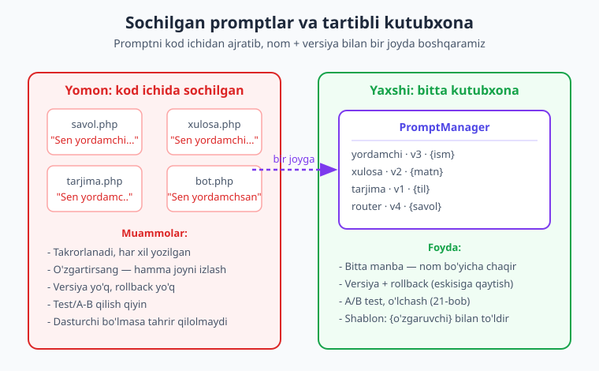
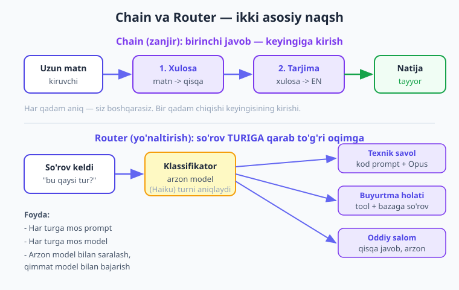
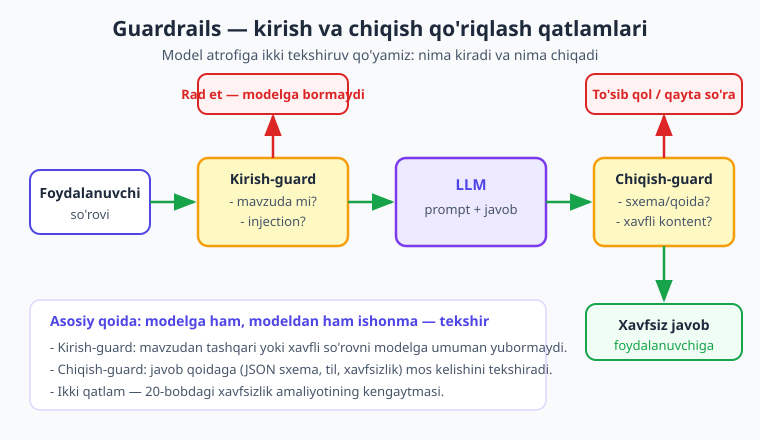

# 23 — Promptlarni boshqarish va ilg'or naqshlar

[⬅️ Oldingi: 22 — Production va kuzatuv](./22-production-kuzatuv.md) · [🏠 Kitob boshi](./README.md) · [Keyingi: 24 — Yakuniy loyiha ➡️](./24-kapston-loyiha.md)

> **Bu bobda:** Promptlar — bu sizning AI ilovangizning "ko'rsatmalari". Kichik loyihada ularni kod ichiga yozib qo'yish yetadi, lekin ilova o'sgan sari promptlar har joyga sochilib ketadi, takrorlanadi, va birini o'zgartirsangiz natija kutilmaganda buziladi. Bu bobda promptlarni **tizimli boshqarish**ni o'rganamiz: alohida saqlanadigan **shablonlar** (o'zgaruvchilar bilan), **versiyalash** (kod kabi, rollback bilan), **chain** (chaqiruvlarni ketma-ket bog'lash), **router** (so'rovni turiga qarab yo'naltirish), **guardrails** (kirish/chiqishni tekshirish), va **structured workflow** (murakkab vazifani aniq qadamlarga bo'lish). Oxirida bularning hammasini birlashtirgan "aqlli yordamchi" yozamiz.

---

## Nega bu bob muhim? — "Sochilgan qog'ozlar vs tartibli papka"

Tasavvur qiling, sizda muhim hujjatlar bor. Birinchi kuni ularni stol ustiga tashlab qo'yasiz — bitta-ikkitasi bo'lsa, muammo yo'q. Lekin oradan oy o'tib, hujjatlar yuztaga aylanadi. Bittasi divan ostida, biri oshxonada, uchtasi bir xil nusxada turli joyda. Endi "ijara shartnomasi"ni topish — butun uyni ag'darish. Birini yangilasangiz — eski nusxalari hamon eski qoladi, va bir kun ulardan birini xato deb foydalanasiz.

Endi boshqa rasm: hamma hujjat **bitta tartibli papka**da, har biri **nomlangan**, har birining **versiyasi** bor ("ijara-shartnoma — 3-tahrir"). Bittasini topish — bir soniya. Yangilasangiz — bitta joyda. Eskisiga qaytish kerak bo'lsa — eski versiya saqlangan.

Promptlar bilan ham aynan shunday. Boshda promptni shunchaki kod ichiga yozasiz:

```php
$javob = $client->messages->create(
    model: 'claude-opus-4-8',
    maxTokens: 500,
    system: 'Sen foydali yordamchisan. Doim o\'zbek tilida javob ber.',
    messages: [['role' => 'user', 'content' => $savol]],
);
```

Bitta joyda — muammo yo'q. Lekin ilovangizda o'nlab so'rov bo'lsa, bu "Sen foydali yordamchisan..." jumlasi o'nlab faylda takrorlanadi. Endi:

- **O'zgartirish azob.** Yordamchining ohangini o'zgartirmoqchimisiz? Hamma faylni topib, qo'lda tahrirlash kerak. Bittasini unutsangiz — ilova bir joyda boshqacha gapiradi.
- **Versiya yo'q.** Promptni o'zgartirdingiz, natija yomonlashdi. Eski variant qanaqa edi? Eslolmaysiz. Rollback yo'q.
- **Takror.** Bir xil ko'rsatma ozgina farq bilan har joyda. Qaysi biri "to'g'ri"si?
- **Test qiyin.** Ikki prompt variantini taqqoslamoqchisiz (21-bob, A/B). Lekin prompt kodga "yopishib" qolgan — almashtirish qiyin.
- **Faqat dasturchi tahrir qila oladi.** Marketing yoki kontent jamoasi prompt matnini yaxshilamoqchi — lekin u PHP fayl ichida, ularga yetib bo'lmaydi.



Yechim — promptlarni **koddan ajratib, bir joyda, tizimli boshqarish**. Bu bobda buni qadam-baqadam quramiz, va ustiga ishonchli AI tizimining ilg'or naqshlarini (chain, router, guardrails, workflow) qo'shamiz.

!!! note "Eslatma"
    Prompt — bu ham **kod**. Unga kod kabi munosabatda bo'ling: bir joyda saqlang, versiyalang, sinab ko'ring, hujjatlang. "Prompt — shunchaki matn-ku" deb e'tiborsiz qoldirish — eng ko'p uchraydigan xato. Chunki promptdagi bitta so'z natijani tubdan o'zgartiradi.

---

## Prompt shablonlari — promptni alohida saqlash

Birinchi qadam: promptni **kod ichidan ajratib**, alohida saqlash, va ichiga **o'zgaruvchi** qo'yib, ishlatishdan oldin to'ldirish. Bu xuddi xat shabloni kabi: "Hurmatli **{ism}**, sizning **{buyurtma}** buyurtmangiz tayyor" — bir shablon, har safar boshqa qiymat bilan.

### Eng oddiy shablon — funksiya

Boshlash uchun murakkab narsa kerak emas. Shablon — bu ichida `{joy}` belgilangan matn, va bir funksiya o'sha joylarni qiymat bilan almashtiradi:

```php
<?php

// Shablonni o'zgaruvchilar bilan to'ldiradigan oddiy funksiya.
function shablonToldir(string $shablon, array $qiymatlar): string
{
    // Har bir {kalit} ni mos qiymatga almashtiramiz.
    foreach ($qiymatlar as $kalit => $qiymat) {
        $shablon = str_replace('{' . $kalit . '}', (string) $qiymat, $shablon);
    }
    return $shablon;
}

// Shablon — bir marta yozilgan, ko'p marta ishlatiladi.
$shablon = 'Salom, {ism}! Quyidagi matnni {til} tiliga tarjima qil:\n\n{matn}';

$prompt = shablonToldir($shablon, [
    'ism'  => 'Olim',
    'til'  => 'ingliz',
    'matn' => 'Bugun ob-havo ajoyib.',
]);

echo $prompt;
// Salom, Olim! Quyidagi matnni ingliz tiliga tarjima qil:
// (yangi qator) Bugun ob-havo ajoyib.
```

Ko'rib turganingizdek, **shablon** — bir joyda, **qiymatlar** — har safar boshqa. Promptning o'zi endi kodga "yopishib" qolmagan.

### Shablonni alohida faylda saqlash

Keyingi qadam — shablonni hatto PHP koddan ham chiqarib, alohida faylga (matn yoki Markdown) saqlash. Shunda promptni o'zgartirish uchun PHP kodga tegmaysiz — faqat matn faylini tahrirlaysiz. Bu marketing/kontent jamoasiga ham yo'l ochadi.

Avval `prompts/tarjima.txt` faylini yarataylik:

```text
Sen tajribali tarjimonsan. Quyidagi matnni {til} tiliga tarjima qil.
Faqat tarjimani qaytar, izoh yozma.

Matn:
{matn}
```

Endi PHP'da uni o'qib, to'ldiramiz:

```php
<?php

// Shablonni fayldan o'qiydigan klass — sodda va kengaytiriladigan.
class FaylShablon
{
    public function __construct(private string $papka) {}

    // Nom bo'yicha shablonni o'qib, qiymatlar bilan to'ldiradi.
    public function render(string $nom, array $qiymatlar = []): string
    {
        $yol = $this->papka . '/' . $nom . '.txt';
        if (!is_file($yol)) {
            throw new RuntimeException("Shablon topilmadi: {$nom}");
        }

        $shablon = file_get_contents($yol);

        foreach ($qiymatlar as $kalit => $qiymat) {
            $shablon = str_replace('{' . $kalit . '}', (string) $qiymat, $shablon);
        }

        return $shablon;
    }
}

$shablonlar = new FaylShablon(__DIR__ . '/prompts');

$prompt = $shablonlar->render('tarjima', [
    'til'  => 'ingliz',
    'matn' => 'Bugun ob-havo ajoyib.',
]);

// Endi to'ldirilgan promptni modelga yuboramiz.
$javob = $client->messages->create(
    model: 'claude-opus-4-8',
    maxTokens: 500,
    messages: [['role' => 'user', 'content' => $prompt]],
);

echo $javob->content[0]->text;
```

Endi promptni o'zgartirish — `prompts/tarjima.txt` ni tahrirlash, tamom. Kod o'zgarmaydi.

!!! tip "Maslahat"
    Shablon ichida **ataylab qoldirilgan o'zgaruvchi** bo'lmasin. Agar `{matn}` o'rniga hech narsa kelmasa, model `{matn}` so'zini ko'rib chalg'iydi. To'ldirishdan keyin natijada `{` qolmaganini tekshiring — qolsa, demak qaysidir o'zgaruvchini berishni unutgansiz.

---

## Prompt versiyalash — promptni kod kabi versiyalash

Nega versiya kerak? Sababi oddiy va muhim: **promptdagi bir o'zgarish natijani o'zgartiradi.** Siz promptni "yaxshilaysiz", lekin ba'zida u boshqa holatlarda yomonlashadi. Versiya bo'lmasa, "ilgari yaxshiroq edi" deganda — orqaga qayta olmaysiz.

Versiyalash sizga uch narsani beradi:

1. **Kuzatish** — qaysi versiya qachon, nima uchun o'zgardi (xuddi git tarixi kabi).
2. **A/B test** — ikki versiyani yonma-yon sinab, qaysi biri yaxshiroq ekanini o'lchash (21-bobda baholashni o'rgangansiz).
3. **Rollback** — yangi versiya yomon chiqsa, eskisiga bir lahzada qaytish.

Eng sodda usul — har versiyani alohida fayl sifatida saqlash (`tarjima.v1.txt`, `tarjima.v2.txt`), va qaysi versiyani ishlatishni bitta joyda belgilash:

```php
<?php

// Versiyalangan shablonlarni boshqaradigan klass.
class VersiyaliShablon
{
    public function __construct(
        private string $papka,
        // Har prompt uchun joriy (faol) versiya — bir joyda boshqariladi.
        private array $faolVersiya = [],
    ) {}

    // Aniq versiyani yoki faol versiyani o'qib to'ldiradi.
    public function render(string $nom, array $qiymatlar = [], ?int $versiya = null): string
    {
        // Versiya berilmasa — faol versiyani olamiz (rollback shu yerda boshqariladi).
        $versiya ??= $this->faolVersiya[$nom] ?? 1;

        $yol = $this->papka . "/{$nom}.v{$versiya}.txt";
        if (!is_file($yol)) {
            throw new RuntimeException("Shablon topilmadi: {$nom} v{$versiya}");
        }

        $shablon = file_get_contents($yol);
        foreach ($qiymatlar as $kalit => $qiymat) {
            $shablon = str_replace('{' . $kalit . '}', (string) $qiymat, $shablon);
        }
        return $shablon;
    }
}

$shablonlar = new VersiyaliShablon(
    papka: __DIR__ . '/prompts',
    faolVersiya: [
        'tarjima'  => 2,   // hozir 2-versiya ishlaydi
        'yordamchi' => 1,
    ],
);

// Faol versiya (2) ishlatiladi:
$prompt = $shablonlar->render('tarjima', ['til' => 'ingliz', 'matn' => 'Salom']);

// A/B test uchun aniq versiyani so'rashimiz mumkin:
$promptV1 = $shablonlar->render('tarjima', ['til' => 'ingliz', 'matn' => 'Salom'], versiya: 1);
$promptV2 = $shablonlar->render('tarjima', ['til' => 'ingliz', 'matn' => 'Salom'], versiya: 2);
```

Rollback endi — bitta raqamni o'zgartirish: `'tarjima' => 2` ni `'tarjima' => 1` qildingiz, va butun ilova eski versiyaga qaytdi. Hech qanday kod o'zgarmaydi.

!!! note "Eslatma"
    Production loyihada versiya odatda **bazada** (jadval: `nom`, `versiya`, `matn`, `yaratilgan_sana`, `faolmi`) saqlanadi. Shunda promptni serverni qayta ishga tushirmasdan o'zgartirish va A/B nisbatini moslash mumkin. Fayl-usul — boshlash uchun, baza-usul — katta loyiha uchun. G'oya bir xil: nom + versiya + matn.

!!! tip "Maslahat"
    Promptlar papkasini **git**ga qo'shing. Shunda har o'zgarish git tarixida qoladi — kim, qachon, nimani o'zgartirgan. Bu eng arzon va kuchli versiyalash usuli, alohida kod yozmasdan.

---

## Chain (zanjir) — chaqiruvlarni ketma-ket bog'lash

Ba'zan bitta so'rov vazifani hal qilmaydi. Ba'zi ishlar **bosqichma-bosqich**: avval bir narsa qiling, uning natijasidan ikkinchi narsa, undan uchinchi. Bu **chain** (zanjir) — bir chaqiruvning **chiqishi** keyingisining **kirishi** bo'ladi.

> **Hayotiy o'xshatish.** Konveyer lentasi. Birinchi usta detalni kesadi, ikkinchisi yog'och tozalaydi, uchinchisi bo'yaydi. Har usta oldingisining ishini oladi va o'z ishini qo'shadi. Hech kim hammasini birvarakayiga qilmaydi — har biri bitta aniq ishni qiladi, va natija lenta bo'ylab o'sadi.

Klassik misol: **uzun matn → xulosa → tarjima**. Avval matnni qisqartirasiz, keyin qisqartmasini boshqa tilga o'giriasiz. Yoki: **savol → reja → bajarish** — avval modeldan rejani so'raysiz, keyin reja bo'yicha har qadamni bajartirasiz.



### Oddiy chain: matn → xulosa → tarjima

Avval bitta qadamni bajaradigan kichik yordamchi funksiya yozaylik, keyin ularni zanjirlaymiz:

```php
<?php

// Bitta LLM qadami: prompt yuboradi, matn javobni qaytaradi.
function qadam(\Anthropic\Client $client, string $prompt): string
{
    $javob = $client->messages->create(
        model: 'claude-opus-4-8',
        maxTokens: 1024,
        messages: [['role' => 'user', 'content' => $prompt]],
    );
    return $javob->content[0]->text;
}

$matn = '... bu yerda uzun maqola matni ...';

// 1-qadam: uzun matnni qisqa xulosa qilamiz.
$xulosa = qadam($client, "Quyidagi matnni 3 jumlada xulosa qil:\n\n{$matn}");

// 2-qadam: xulosaning O'ZINI keyingi qadamga kirish qilamiz.
$tarjima = qadam($client, "Quyidagi matnni ingliz tiliga tarjima qil:\n\n{$xulosa}");

echo "Xulosa (o'zbekcha):\n{$xulosa}\n\n";
echo "Tarjima (inglizcha):\n{$tarjima}\n";
```

E'tibor bering: `$xulosa` — birinchi qadamning **natijasi** — ikkinchi qadamning **kirishi** bo'ldi. Zanjir mana shu: har bo'g'in oldingisiga ulanadi.

### Qayta ishlatiladigan pipeline

Agar zanjir uzun bo'lsa, har qadamni qo'lda yozish noqulay. Kichik **pipeline** klassi yozsak, qadamlarni ro'yxat qilib, ketma-ket o'tkazamiz:

```php
<?php

// Qadamlar zanjiri: har qadam oldingi natijani oladi, yangi natija qaytaradi.
class Pipeline
{
    /** @var callable[] */
    private array $qadamlar = [];

    // Zanjirga yangi qadam qo'shamiz (closure).
    public function qosh(callable $qadam): static
    {
        $this->qadamlar[] = $qadam;
        return $this;   // zanjir uslubida chaqirish uchun
    }

    // Boshlang'ich qiymatni hamma qadamdan ketma-ket o'tkazamiz.
    public function ishlat(mixed $kirish): mixed
    {
        $natija = $kirish;
        foreach ($this->qadamlar as $qadam) {
            $natija = $qadam($natija);
        }
        return $natija;
    }
}

$pipeline = (new Pipeline())
    ->qosh(fn(string $m) => qadam($client, "3 jumlada xulosa qil:\n\n{$m}"))
    ->qosh(fn(string $m) => qadam($client, "Ingliz tiliga tarjima qil:\n\n{$m}"))
    ->qosh(fn(string $m) => qadam($client, "Bir jumlali sarlavha o'ylab top:\n\n{$m}"));

$natija = $pipeline->ishlat($matn);
echo $natija;
```

Endi yangi qadam qo'shish — bitta `->qosh(...)` qatori. Zanjirni o'qish ham oson: yuqoridan pastga, har qadam aniq.

!!! warning "Ehtiyot bo'ling"
    Zanjirning har bo'g'ini — alohida API so'rovi, ya'ni **alohida pul va kechikish**. 3 qadamli zanjir 3 marta sekinroq va qimmatroq. Shuning uchun: zanjirni faqat haqiqatan kerak bo'lganda ishlating, va imkon bo'lsa qadamlarni **arzon model** (Haiku) bilan bajaring (16-bob). Ba'zan 3 qadamni bitta yaxshi promptga sig'dirib bo'ladi — avval shuni sinab ko'ring.

---

## Router (yo'naltirish) — so'rovni turiga qarab yo'naltirish

Har xil so'rovga har xil munosabat kerak. "Salom!" degan oddiy salomga Opus modelni ishlatish — chivinga to'p otish. "Buyurtmam qayerda?" degan savolga esa bazaga murojaat qiluvchi tool kerak. **Router** — kiruvchi so'rovni avval **turini aniqlaydi**, keyin har turga mos **prompt/model/oqim**ga yo'naltiradi.

> **Hayotiy o'xshatish.** Kasalxonadagi qabul. Siz kirganingizda avval qabulxona xodimi "Sizga qaysi bo'lim kerak?" deb so'raydi — bu arzon, tez. Keyin sizni to'g'ri shifokorga (qimmat, ixtisoslashgan) yuboradi. Hamma bemorni bitta professorga yuborish — ham qimmat, ham sekin. Saralash kalit.

Asosiy g'oya: **arzon model bilan klassifikatsiya, qimmat model bilan bajarish.** Saralash — oddiy ish, Haiku uddalaydi. Asosiy ish esa turiga qarab Opus yoki maxsus oqimga ketadi.

### Turni aniqlash (klassifikatsiya)

Avval so'rovni turlardan biriga ajratamiz. Bu yerda strukturali chiqish (6-bob) juda foydali — modeldan faqat turni qat'iy ro'yxatdan tanlashni so'raymiz:

```php
<?php

// So'rovni oldindan belgilangan turlardan biriga ajratamiz — ARZON model bilan.
function turniAniqla(\Anthropic\Client $client, string $savol): string
{
    $javob = $client->messages->create(
        model: 'claude-haiku-4-5',   // saralash oddiy ish — arzon model yetadi
        maxTokens: 20,
        system: 'Sen klassifikatorsan. Foydalanuvchi savolini quyidagi turlardan '
              . 'BITTASIGA ajrat va FAQAT shu so\'zni qaytar: '
              . 'texnik | buyurtma | salom | boshqa. Boshqa hech narsa yozma.',
        messages: [['role' => 'user', 'content' => $savol]],
    );

    // Javobni tozalab, kichik harfga keltiramiz.
    $tur = strtolower(trim($javob->content[0]->text));

    // Kutilmagan javobdan himoya — faqat ruxsat etilgan turlar.
    $ruxsat = ['texnik', 'buyurtma', 'salom', 'boshqa'];
    return in_array($tur, $ruxsat, true) ? $tur : 'boshqa';
}
```

E'tibor bering: oxirgi `in_array` tekshiruvi — **guard** (himoya). Model qoidaga qaramay kutilmagan narsa qaytarsa ham, biz faqat ruxsat etilgan turlardan birini olamiz. Bu bobning keyingi qismida guardrails haqida ko'proq gaplashamiz.

### Turga qarab yo'naltirish

Endi turga qarab to'g'ri handler'ni tanlaymiz. PHP `match` buni juda tiniq qiladi:

```php
<?php

// Har turga mos prompt + model bilan javob beramiz.
function yonaltir(\Anthropic\Client $client, string $savol): string
{
    $tur = turniAniqla($client, $savol);

    return match ($tur) {
        // Texnik savol — kuchli model, batafsil ko'rsatma.
        'texnik' => qadam2($client, $savol,
            model: 'claude-opus-4-8',
            system: 'Sen tajribali PHP dasturchisisan. Aniq, kod misolli javob ber.'),

        // Buyurtma — bu yerda baza/tool ishga tushadi (soddalik uchun matn javob).
        'buyurtma' => qadam2($client, $savol,
            model: 'claude-sonnet-4-6',
            system: 'Sen buyurtma yordamchisisan. Buyurtma raqamini so\'ra, holatni tushuntir.'),

        // Oddiy salom — arzon model, qisqa javob.
        'salom' => qadam2($client, $savol,
            model: 'claude-haiku-4-5',
            system: 'Do\'stona, qisqa salomlashing.'),

        // Boshqa — umumiy javob.
        default => qadam2($client, $savol,
            model: 'claude-sonnet-4-6',
            system: 'Sen foydali yordamchisan. Iloji boricha yordam ber.'),
    };
}

// System prompt + model bilan bitta chaqiruv.
function qadam2(\Anthropic\Client $client, string $savol, string $model, string $system): string
{
    $javob = $client->messages->create(
        model: $model,
        maxTokens: 1024,
        system: $system,
        messages: [['role' => 'user', 'content' => $savol]],
    );
    return $javob->content[0]->text;
}

echo yonaltir($client, 'PDO bilan parametrli so\'rovni qanday yozaman?');  // -> texnik -> Opus
echo yonaltir($client, 'Salom!');                                          // -> salom -> Haiku
```

Endi har so'rov o'ziga mos yo'ldan ketadi: arzon ishlar arzon modelda, murakkab ishlar kuchli modelda. Bu ham **sifatni**, ham **xarajatni** yaxshilaydi (16-bob).

!!! tip "Maslahat"
    Klassifikatsiya uchun har doim **eng arzon** modelni ishlating. Saralash — bir so'zlik javob, Haiku buni mukammal uddalaydi. Hatto klassifikatsiyani umuman LLM'siz, oddiy kalit so'z yoki regex bilan qilish mumkin bo'lsa (masalan, savolda "buyurtma" so'zi bor mi) — undan ham arzon va tezroq bo'ladi.

---

## Guardrails (qo'riqlash) — kirish va chiqishni tekshirish

Modelga ham, modeldan ham **ko'r-ko'rona ishonib bo'lmaydi**. Foydalanuvchi xavfli yoki mavzudan tashqari so'rov yuborishi mumkin. Model esa kutilmagan, noto'g'ri formatli yoki nomaqbul javob qaytarishi mumkin. **Guardrails** (qo'riqlash relslari) — model atrofiga qo'yilgan **ikki tekshiruv qatlami**: kirishni va chiqishni.

> **Hayotiy o'xshatish.** Tog' yo'lidagi himoya to'siqlari (guardrail). Ular mashina haydashga xalaqit bermaydi — lekin agar mashina yo'ldan chiqib ketsa, jarlikka qulashning oldini oladi. Xuddi shunday, guardrails normal so'rovlarga to'sqinlik qilmaydi, lekin xavfli holatda to'xtatadi.



Bu — 20-bobdagi xavfsizlik amaliyotlarining tizimli kengaytmasi. Ikki qatlam:

- **Kirish-guard** — so'rov modelga **bormasdan oldin** tekshiriladi: mavzuda mi, prompt injection (modelni aldash urinishi) yo'q mi.
- **Chiqish-guard** — model javobi foydalanuvchiga **bormasdan oldin** tekshiriladi: kerakli formatda mi, xavfli kontent yo'q mi, qoidalarga mos mi.

### Kirish-guard

Kirish-guard so'rovni qabul qiladi va `null` (ruxsat) yoki rad sababini qaytaradi:

```php
<?php

// Kirishni tekshiruvchi guard. null qaytarsa — ruxsat; matn qaytarsa — rad sababi.
function kirishGuard(string $savol): ?string
{
    // 1. Bo'sh yoki juda uzun so'rovni rad etamiz.
    $savol = trim($savol);
    if ($savol === '') {
        return 'So\'rov bo\'sh.';
    }
    if (mb_strlen($savol) > 2000) {
        return 'So\'rov juda uzun (2000 belgidan ko\'p).';
    }

    // 2. Prompt injection urinishlarini sezamiz (oddiy kalit so'z tekshiruvi).
    $shubhali = [
        'oldingi ko\'rsatmalarni unut',
        'ignore previous instructions',
        'system prompt',
        'reveal your instructions',
    ];
    $past = mb_strtolower($savol);
    foreach ($shubhali as $belgi) {
        if (str_contains($past, $belgi)) {
            return 'So\'rovda shubhali ko\'rsatma aniqlandi.';
        }
    }

    return null;   // hammasi joyida — modelga yuborish mumkin
}
```

Murakkabroq holatlarda mavzuga mosligini **LLM bilan** ham tekshirish mumkin (arzon model: "bu savol bizning mavzuga oid mi? ha/yo'q"). Lekin oddiy kalit so'z tekshiruvi tez va arzon — avval shundan boshlang.

### Chiqish-guard

Chiqish-guard model javobini tekshiradi. Masalan, javob mojburiy JSON formatda bo'lishi kerak bo'lsa, uni parse qilib ko'ramiz:

```php
<?php

// Chiqishni tekshiruvchi guard. [ok, natija] qaytaradi.
function chiqishGuard(string $javob): array
{
    // 1. Bo'sh javob — xato.
    if (trim($javob) === '') {
        return [false, 'Model bo\'sh javob qaytardi.'];
    }

    // 2. Javob to'g'ri JSON ekanini va kerakli maydonlar borligini tekshiramiz.
    $data = json_decode($javob, true);
    if (!is_array($data) || !isset($data['javob'], $data['ishonch'])) {
        return [false, 'Javob kutilgan JSON formatda emas.'];
    }

    // 3. Xavfli/nomaqbul kontent bormi (oddiy filtr).
    $taqiq = ['parol', 'api_key', 'kredit karta'];
    foreach ($taqiq as $soz) {
        if (str_contains(mb_strtolower($data['javob']), $soz)) {
            return [false, 'Javobda nomaqbul kontent aniqlandi.'];
        }
    }

    return [true, $data];   // javob xavfsiz va to'g'ri formatda
}
```

!!! danger "Xavfsizlik"
    Strukturali chiqish (6-bob, `outputConfig: ['format' => ...]`) javob **formatini** kafolatlaydi, lekin **mazmunini** emas. Chiqish-guard formatni ham, mazmunni ham tekshiradi: maxfiy ma'lumot sizib chiqmaganini, javob biznes qoidalariga (masalan, ruxsat etilgan narx oralig'i) mos kelishini. Format kafolati ≠ to'g'ri javob.

### Ikki guardni birlashtirish

Endi ikkalasini model atrofiga o'raymiz:

```php
<?php

function himoyalanganJavob(\Anthropic\Client $client, string $savol): string
{
    // 1-qatlam: kirish-guard.
    if ($sabab = kirishGuard($savol)) {
        return "Kechirasiz, so'rovni qabul qilolmadim: {$sabab}";
    }

    // Model — javobni JSON formatda so'raymiz (chiqish-guard parse qilishi uchun).
    $javob = $client->messages->create(
        model: 'claude-opus-4-8',
        maxTokens: 1024,
        system: 'Faqat shu JSON formatda javob ber: {"javob": "...", "ishonch": 0.0-1.0}. '
              . 'Boshqa hech narsa yozma.',
        messages: [['role' => 'user', 'content' => $savol]],
    );

    // 2-qatlam: chiqish-guard.
    [$ok, $natija] = chiqishGuard($javob->content[0]->text);
    if (!$ok) {
        // Javob qoidaga mos emas — foydalanuvchiga xato javobni KO'RSATMAYMIZ.
        error_log("Chiqish-guard to'sdi: {$natija}");
        return 'Kechirasiz, hozir javob bera olmadim. Iltimos, qaytadan urinib ko\'ring.';
    }

    return $natija['javob'];
}
```

Endi xavfli kirish modelga umuman bormaydi, va qoidaga mos kelmaydigan chiqish foydalanuvchiga yetmaydi. Ikki qatlam — ikki himoya.

---

## Structured workflow — murakkab vazifani aniq qadamlarga bo'lish

11-bobda **agent**ni o'rgangansiz: modelga erkinlik berasiz, u o'zi qadamlarni tanlab, vazifani bajaradi. Bu kuchli, lekin har doim ham to'g'ri tanlov emas. Ba'zan siz **qadamlarni aniq bilasiz** — va shunda modelga "o'zing o'yla" deyishdan ko'ra, qadamlarni **o'zingiz belgilab**, har birini deterministik bajartirish ishonchliroq. Bu — **structured workflow** (tuzilgan ish oqimi).

> **Hayotiy o'xshatish.** Retsept va oshpaz. Agar siz palov pishirishning aniq retseptini bilsangiz — qadamlarni ketma-ket berasiz ("guruchni yuv, sabzini to'g'ra, ziravor sol..."). Bu — workflow. Agar mehmonga "muzlatkichda nima bor — shundan biror mazali narsa qil" desangiz — bu oshpazga erkinlik, ya'ni agent. Retsept ma'lum bo'lsa, retsept beraver — natija barqaror bo'ladi.

Farq quyidagicha:

| | **Workflow (tuzilgan)** | **Agent (erkin)** |
|---|---|---|
| Qadamlarni kim belgilaydi | **Siz** (oldindan) | **Model** (o'zi) |
| Yo'l | Sobit, oldindan ma'lum | O'zgaruvchan |
| Natija barqarorligi | Yuqori (deterministik) | O'zgaruvchan |
| Qachon mos | Qadamlar ma'lum bo'lsa | Qadamlar oldindan noma'lum bo'lsa |
| Nazorat | Sizda | Modelda |

**Qachon workflow?** Vazifaning qadamlari oldindan ma'lum bo'lsa (masalan: hujjatni o'qi → ma'lumot ajrat → tekshir → bazaga yoz). Bu ko'pchilik real biznes vazifalariga to'g'ri keladi.

**Qachon agent?** Qadamlar oldindan noma'lum, vaziyatga qarab o'zgaradi (masalan: "muammoni tekshir va tuzat" — qaysi qadam kerakligi muammoga bog'liq).

!!! tip "Maslahat"
    Amaliy qoida: **avval workflow'ni sinab ko'ring.** Ko'p vazifalar aslida tuzilgan — siz qadamlarni bilasiz. Workflow yetmasa, ya'ni qadamlar haqiqatan oldindan noma'lum bo'lsa — agentga o'ting. Agent kuchliroq, lekin kamroq bashoratli va ko'proq qimmat. "Eng kam erkinlik bilan ishni bajaring" — ishonchli tizim qoidasi.

Workflow misoli — bu aslida biz yuqorida ko'rgan chain'ning aniq qadamlar bilan tashkillangani:

```php
<?php

// Tuzilgan workflow: sharhni qayta ishlash. Har qadam SIZ tomonidan belgilangan.
function sharhniQayta(\Anthropic\Client $client, string $sharh): array
{
    // Qadam 1: sentimentni aniqlash (arzon model).
    $sentiment = qadam2($client, $sharh,
        model: 'claude-haiku-4-5',
        system: 'Sharh sentimentini aniqla. FAQAT bitta so\'z: ijobiy | salbiy | neytral.');

    // Qadam 2: asosiy mavzuni ajratish.
    $mavzu = qadam2($client, $sharh,
        model: 'claude-haiku-4-5',
        system: 'Sharhning asosiy mavzusini 2-3 so\'zda ayt.');

    // Qadam 3: salbiy bo'lsagina — javob xati tayyorlash (qimmat model).
    $javobXati = null;
    if (trim(strtolower($sentiment)) === 'salbiy') {
        $javobXati = qadam2($client, $sharh,
            model: 'claude-opus-4-8',
            system: 'Norozi mijozga xushmuomala, yechimga yo\'naltirilgan javob yoz.');
    }

    // Natijani tuzilgan ko'rinishda qaytaramiz.
    return [
        'sentiment'  => trim($sentiment),
        'mavzu'      => trim($mavzu),
        'javob_xati' => $javobXati,
    ];
}
```

Bu yerda **siz** har qadamni va shartni (faqat salbiy bo'lsa javob xati) nazorat qilasiz. Natija barqaror va bashoratli — har safar bir xil mantiq ishlaydi.

---

## Few-shot va misollarni boshqarish

3-bobda **few-shot** ni o'rgangansiz: promptga bir nechta namuna ("misol") qo'shsangiz, model ulardan o'rganib, sizning uslubingizga moslashadi. Lekin misollar ko'paygan sari muammo paydo bo'ladi: hamma misolni har promptga tiqishtirish — uzun, qimmat (16-bob), va ko'pincha keraksiz.

Yechim — **misollar to'plamini saqlash va dinamik tanlash**: har so'rovga eng mos bir-ikki misolni tanlab, faqat shularni promptga qo'shish. "Eng mos"ni qanday topish kerak? Bu yerda **embedding** (13-bob) yordamga keladi: so'rov va har misolni embeddingga aylantirib, eng o'xshashlarini tanlaymiz.

> **Hayotiy o'xshatish.** Tajribali ustoz shogirdiga masala tushuntirayotganda, kutubxonadagi **hamma** kitobni ko'rsatmaydi — aynan **shu masalaga o'xshash** bir-ikki misolni tanlab ko'rsatadi. O'xshash misol — eng foydali misol.

Bu yerda 13-bobdagi `oxshashlik` (kosinus o'xshashlik) funksiyasini ishlatamiz:

```php
<?php

// Misollar to'plami — har biri matn + embedding (13-bobda embedding yaratishni ko'rgansiz).
// Real loyihada embeddinglar oldindan hisoblanib, bazada saqlanadi.
$misollar = [
    ['savol' => 'PDO nima?', 'javob' => 'PDO — PHP ma\'lumotlar bazasiga ulanish qatlami.', 'emb' => [/* ... */]],
    ['savol' => 'foreach qanday ishlaydi?', 'javob' => 'foreach massiv elementlarini aylanadi.', 'emb' => [/* ... */]],
    // ... yana ko'plab misol ...
];

// So'rovga eng mos N ta misolni embedding o'xshashligi bo'yicha tanlaymiz.
function mosMisollar(array $soalEmb, array $misollar, int $n = 2): array
{
    // Har misol uchun o'xshashlikni hisoblaymiz (13-bobdagi oxshashlik funksiyasi).
    foreach ($misollar as &$m) {
        $m['ball'] = oxshashlik($soalEmb, $m['emb']);
    }
    unset($m);

    // Ballga ko'ra kamayuvchi tartibda saralaymiz va eng yaxshi N tani olamiz.
    usort($misollar, fn($a, $b) => $b['ball'] <=> $a['ball']);
    return array_slice($misollar, 0, $n);
}

// So'rov embeddingini olib (13-bob), eng mos misollarni promptga qo'shamiz.
$tanlangan = mosMisollar($soalEmb, $misollar, 2);

$fewShot = '';
foreach ($tanlangan as $m) {
    $fewShot .= "Savol: {$m['savol']}\nJavob: {$m['javob']}\n\n";
}

$prompt = "Quyidagi namunalar uslubida javob ber:\n\n{$fewShot}Savol: {$yangiSavol}\nJavob:";
```

Endi prompt faqat **eng foydali** misollarni o'z ichiga oladi — qisqaroq, arzonroq, va ko'pincha aniqroq.

!!! note "Eslatma"
    Bu — RAG'ga (15-bob) juda o'xshash g'oya: o'sha "kerakligini topib, promptga qo'shish" usuli, faqat hujjat o'rniga **misol**. Embedding va o'xshashlik — bir xil mexanizm. Bir tushuncha — ko'p qo'llanish.

---

## Prompt kutubxonasi — PromptManager klass

Endi yuqoridagi g'oyalarni (nomli promptlar, versiya, shablon to'ldirish) bitta **markazlashtirilgan** klassga jamlaymiz. Bu — sizning ilovangizning yagona "prompt manbasi" (PromptManager). Hamma prompt shu yerdan, nom bilan olinadi:

```php
<?php

// Markazlashtirilgan prompt kutubxonasi: nomli, versiyali, shablonli promptlar.
class PromptManager
{
    /**
     * Promptlar registri: nom => [versiya => shablon matni].
     * Real loyihada bu fayllardan yoki bazadan yuklanadi.
     */
    private array $registr = [];

    /** Har prompt uchun faol (joriy) versiya. */
    private array $faolVersiya = [];

    // Yangi prompt versiyasini ro'yxatga qo'shamiz.
    public function qosh(string $nom, int $versiya, string $shablon): void
    {
        $this->registr[$nom][$versiya] = $shablon;
        // Birinchi qo'shilgan versiyani avtomatik faol qilamiz.
        $this->faolVersiya[$nom] ??= $versiya;
    }

    // Qaysi versiya faol ekanini belgilash (rollback / A-B shu yerda).
    public function faolQil(string $nom, int $versiya): void
    {
        if (!isset($this->registr[$nom][$versiya])) {
            throw new RuntimeException("Prompt yo'q: {$nom} v{$versiya}");
        }
        $this->faolVersiya[$nom] = $versiya;
    }

    // Promptni nom bo'yicha olib, o'zgaruvchilar bilan to'ldiramiz.
    public function render(string $nom, array $qiymatlar = [], ?int $versiya = null): string
    {
        $versiya ??= $this->faolVersiya[$nom] ?? null;
        $shablon = $this->registr[$nom][$versiya] ?? null;

        if ($shablon === null) {
            throw new RuntimeException("Prompt topilmadi: {$nom} v{$versiya}");
        }

        // {kalit} larni qiymatlarga almashtiramiz.
        foreach ($qiymatlar as $kalit => $qiymat) {
            $shablon = str_replace('{' . $kalit . '}', (string) $qiymat, $shablon);
        }

        // To'ldirilmagan o'zgaruvchi qolmaganini tekshiramiz (xatodan himoya).
        if (preg_match('/\{(\w+)\}/', $shablon, $m)) {
            throw new RuntimeException("To'ldirilmagan o'zgaruvchi: {{$m[1]}}");
        }

        return $shablon;
    }
}
```

Ishlatish — qisqa va tiniq:

```php
<?php

$pm = new PromptManager();

// Promptlarni ro'yxatga qo'shamiz (odatda dastur boshida, fayl/bazadan).
$pm->qosh('xulosa', 1, 'Quyidagi matnni qisqa xulosa qil:\n\n{matn}');
$pm->qosh('xulosa', 2, 'Quyidagi matnni {soni} jumlada xulosa qil. Faqat xulosani qaytar:\n\n{matn}');
$pm->qosh('tarjima', 1, 'Quyidagi matnni {til} tiliga tarjima qil:\n\n{matn}');

// 2-versiyani faol qilamiz (1-versiya saqlanib qoladi — rollback uchun).
$pm->faolQil('xulosa', 2);

// Faol versiyani to'ldirib ishlatamiz.
$prompt = $pm->render('xulosa', ['soni' => 3, 'matn' => $matn]);

$javob = $client->messages->create(
    model: 'claude-opus-4-8',
    maxTokens: 500,
    messages: [['role' => 'user', 'content' => $prompt]],
);

echo $javob->content[0]->text;
```

Endi butun ilovada prompt **bir joydan**, nom bilan olinadi. O'zgartirish — bitta joyda. Versiya — saqlangan. Rollback — bitta chaqiruv. Bu — "tartibli papka" g'oyasining kodda mujassami.

!!! tip "Maslahat"
    Production'da `PromptManager`'ni 22-bobdagi **kuzatuv** bilan bog'lang: har so'rovda qaysi prompt **nomi va versiyasi** ishlatilganini log qiling. Shunda "3-versiyaga o'tgandan keyin sifat tushdi" kabi muammoni darhol topasiz — log'da prompt versiyasi ko'rinib turadi.

---

## Ilg'or naqshlar — birga ishonchli AI tizimi

Bu bobdagi naqshlar **alohida** ham foydali, lekin haqiqiy kuch — ularni va oldingi boblardagilarni **birga** ishlatishda. Mana ishonchli AI tizimining "to'plami":

- **Shablon + versiya** — promptlar bir joyda, nom bilan, versiyali (bu bob).
- **Router** — so'rovni turiga qarab to'g'ri prompt/modelga yo'naltirish (bu bob).
- **Chain / Workflow** — murakkab vazifani aniq qadamlarga bo'lish (bu bob).
- **Guardrails** — kirish/chiqishni tekshirish (bu bob + 20-bob xavfsizlik).
- **Retry + Fallback** — xato bo'lsa qayta urinish, asosiy model ishlamasa zaxiraga o'tish (8-bob).
- **Caching** — takror so'rovga API'ga bormaslik, katta kontekstni keshlash (16-bob).

Bularning har biri bitta muammoni hal qiladi, va birga — **ishonchli, arzon, xavfsiz** AI tizimini tashkil etadi. Hech biri "sehrli" emas — har biri oddiy injenerlik amaliyoti, AI dunyosiga moslashgan.

!!! note "Eslatma"
    Frameworklar (17-bob — LLPhant, Neuron AI) bu naqshlarning ko'pini tayyor beradi (chain, RAG quvuri, agent, vektor store). Lekin **g'oyani** bilish shart — shunda framework qutisi ichida nima sodir bo'layotganini tushunasiz, va kerak bo'lsa o'zingiznikini quryapsiz. Naqsh — abadiy, framework — vaqtinchalik.

---

## To'liq misol — "aqlli yordamchi"

Endi hammasini birlashtiramiz: **router** (so'rov turini aniqlash) + **guardrails** (kirish/chiqish) + **shablon** (PromptManager) + **chain** (kerak bo'lsa ketma-ket qadam). Bu — kichik, lekin to'liq, ishonchli yordamchi.

Avval promptlarni tayyorlaymiz va guard funksiyalarni (yuqorida yozganmiz) ishlatamiz:

```php
<?php
require __DIR__ . '/vendor/autoload.php';

use Anthropic\Client;

$client = new Client(apiKey: getenv('ANTHROPIC_API_KEY'));

// 1. Promptlarni markazlashtiramiz.
$pm = new PromptManager();
$pm->qosh('texnik', 1,  'Foydalanuvchi texnik savoli: {savol}\n\nAniq, kod misolli javob ber.');
$pm->qosh('salom', 1,   'Foydalanuvchi: {savol}\n\nDo\'stona, qisqa salomlash.');
$pm->qosh('umumiy', 1,  'Foydalanuvchi savoli: {savol}\n\nIloji boricha foydali javob ber.');
```

Endi yordamchining "miya"si — kirish-guard, router, model, chiqish-guard zanjiri:

```php
<?php

// Har turga mos model — arzon ishlarga arzon model (16-bob).
function modelTuriga(string $tur): string
{
    return match ($tur) {
        'texnik' => 'claude-opus-4-8',     // murakkab — kuchli model
        'salom'  => 'claude-haiku-4-5',    // oddiy — arzon model
        default  => 'claude-sonnet-4-6',   // o'rta
    };
}

// To'liq aqlli yordamchi: guard -> router -> shablon -> model -> guard.
function aqlliYordamchi(Client $client, PromptManager $pm, string $savol): string
{
    // 1-qatlam: KIRISH-GUARD.
    if ($sabab = kirishGuard($savol)) {
        return "So'rovni qabul qilolmadim: {$sabab}";
    }

    // 2: ROUTER — turni aniqlaymiz (arzon model).
    $tur = turniAniqla($client, $savol);   // texnik | salom | boshqa ...
    $promptNomi = match ($tur) {
        'texnik' => 'texnik',
        'salom'  => 'salom',
        default  => 'umumiy',
    };

    // 3: SHABLON — promptni PromptManager'dan olamiz (nom + versiya).
    $prompt = $pm->render($promptNomi, ['savol' => $savol]);

    // 4: MODEL — turga mos model bilan chaqiramiz (8-bobdagi retry'ni shu yerga qo'shsa bo'ladi).
    try {
        $javob = $client->messages->create(
            model: modelTuriga($tur),
            maxTokens: 1024,
            system: 'Sen foydali, xushmuomala yordamchisan. Doim o\'zbek tilida javob ber.',
            messages: [['role' => 'user', 'content' => $prompt]],
        );
        $matn = $javob->content[0]->text;
    } catch (\Anthropic\Core\Exceptions\APIException $e) {
        // Xato bo'lsa — foydalanuvchiga texnik tafsilot ko'rsatmaymiz (20-bob).
        error_log('LLM xato: ' . $e->getMessage());
        return 'Kechirasiz, hozir javob bera olmadim. Birozdan keyin urinib ko\'ring.';
    }

    // 5-qatlam: CHIQISH-GUARD (sodda — bo'sh emasligini tekshiramiz).
    if (trim($matn) === '') {
        error_log('Chiqish-guard: bo\'sh javob');
        return 'Kechirasiz, javob tayyorlab bo\'lmadi.';
    }

    return $matn;
}

// Sinab ko'ramiz:
echo aqlliYordamchi($client, $pm, 'PDO bilan parametrli so\'rovni qanday yozaman?');
echo "\n---\n";
echo aqlliYordamchi($client, $pm, 'Salom! Yaxshimisiz?');
```

Bu misolda biz butun bobni birlashtirdik:

- **Kirish-guard** xavfli/bo'sh so'rovni modelga umuman yubormaydi;
- **Router** so'rov turini arzon model bilan aniqlaydi va to'g'ri prompt + modelga yo'naltiradi;
- **PromptManager** promptni nom bo'yicha, markazlashtirilgan, versiyalangan holda beradi;
- **Model** turga mos (arzon yoki kuchli) — sifat ham, xarajat ham nazoratda;
- **Xato boshqaruvi** (8/20-bob) foydalanuvchiga texnik tafsilot ko'rsatmaydi;
- **Chiqish-guard** bo'sh/noto'g'ri javobni to'sadi.

Ustiga 8-bobdagi `retry`/`fallback` va 16-bobdagi `caching` ni qo'shsangiz — bu to'la production darajasidagi yordamchiga aylanadi. Aynan shunday tizimni 24-bobda (kapston loyiha) to'liq quramiz.

!!! example "Misol"
    `aqlliYordamchi`'ni 18-bobdagi Laravel bilan birlashtiring: `PromptManager`'ni servis-provayder orqali konteynerga ro'yxatdan o'tkazing, promptlarni `config/` yoki bazadan yuklang, va kontrollerda shu yordamchini chaqiring. Shunda bu naqsh real veb-ilovaning bir qismiga aylanadi.

---

## Xulosa

- **Promptlar — kod kabi boshqariladi.** Ularni koddan ajrating, bir joyda saqlang, nomlang, versiyalang. "Sochilgan qog'oz" emas, "tartibli papka". Promptdagi bir so'z natijani tubdan o'zgartiradi — shuning uchun e'tibor shart.
- **Shablon** — promptni alohida (fayl/baza) saqlash + `{o'zgaruvchi}` bilan to'ldirish. O'zgartirish bir joyda, takror yo'q. To'ldirilmagan o'zgaruvchini tekshiring.
- **Versiyalash** — har versiyani saqlash, faol versiyani bir joydan boshqarish: kuzatish, A/B test (21-bob), va rollback uchun. Promptlarni git'ga qo'ying.
- **Chain (zanjir)** — chaqiruvlarni ketma-ket bog'lash, bir natija keyingiga kirish (matn → xulosa → tarjima). Har bo'g'in alohida pul/vaqt — keraksiz zanjirdan saqlaning.
- **Router** — so'rovni turiga qarab yo'naltirish. Arzon model bilan saralash, qimmat model bilan bajarish — ham sifat, ham xarajat foydasi.
- **Guardrails** — kirish-guard (xavfli/mavzudan tashqari so'rovni modelga yubormaslik) + chiqish-guard (qoidaga mos kelmagan javobni to'sish). Modelga ham, modeldan ham ishonma — tekshir.
- **Workflow vs agent** — qadamlar ma'lum bo'lsa workflow (siz boshqarasiz, barqaror); qadamlar oldindan noma'lum bo'lsa agent (11-bob). Avval workflow'ni sinang.
- **Birga — ishonchli tizim:** shablon + versiya + router + chain/workflow + guardrails + retry/fallback (8-bob) + caching (16-bob). Har biri oddiy injenerlik, birga — ishonchli, arzon, xavfsiz AI.

---

## Amaliy mashqlar

1. **Prompt shablon.** `FaylShablon` klassidan foydalanib, `prompts/` papkasida kamida 3 ta shablon yarating (masalan: `xulosa`, `tarjima`, `savol-javob`), har birida kamida 2 ta `{o'zgaruvchi}` bo'lsin. Ularni to'ldirib, modelga yuboring. So'ng `render`'ga to'ldirilmagan o'zgaruvchini berib, "to'ldirilmagan o'zgaruvchi" xatosi ishlashini tekshiring.

2. **Chain pipeline.** `Pipeline` klassidan foydalanib, 3 qadamli zanjir quring: uzun matn → xulosa → kalit so'zlar (5 ta) → kalit so'zlardan ijtimoiy tarmoq posti. Har qadam natijasini ekranga chiqarib, zanjir bo'ylab matn qanday o'zgarayotganini kuzating. Keyin xuddi shu vazifani **bitta** prompt bilan bajarib ko'ring va ikki yondashuvni (sifat, narx, kechikish) taqqoslang.

3. **Router.** `turniAniqla` + `yonaltir` ni kengaytiring: kamida 5 ta tur qo'shing (texnik, buyurtma, shikoyat, salom, boshqa). Har turga mos model va prompt belgilang (shikoyatga — kuchli model + xushmuomala system prompt). 10 ta turli so'rovni o'tkazib, har biri qaysi turga va modelga ketganini jadval ko'rinishida chiqaring.

4. **Guardrails.** `kirishGuard` va `chiqishGuard` ni mustahkamlang: kirish-guardga LLM-asosli mavzu tekshiruvini qo'shing (arzon model: "bu savol elektron tijoratga oid mi? ha/yo'q"), chiqish-guardga esa javob uzunligi va til (o'zbekcha mi) tekshiruvini qo'shing. Bir nechta yaxshi va yomon so'rov bilan ikkala guardning ham to'g'ri ishlashini sinang.

5. **PromptManager.** `PromptManager` klassini bazaga (yoki JSON faylga) bog'lang: promptlarni `qosh()` o'rniga fayl/bazadan yuklang. So'ng bir promptning 2 versiyasini yarating, `faolQil()` bilan ularni almashtiring, va har so'rovda qaysi versiya ishlatilganini (22-bobdagi kabi) log qiling. "v1 → v2" o'tishidan keyin loglarda versiya o'zgarganini ko'rsating.

---

[⬅️ Oldingi: 22 — Production va kuzatuv](./22-production-kuzatuv.md) · [🏠 Kitob boshi](./README.md) · [Keyingi: 24 — Yakuniy loyiha ➡️](./24-kapston-loyiha.md)
