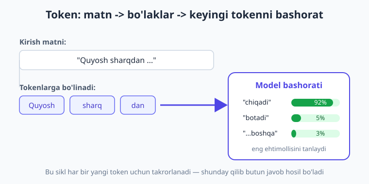
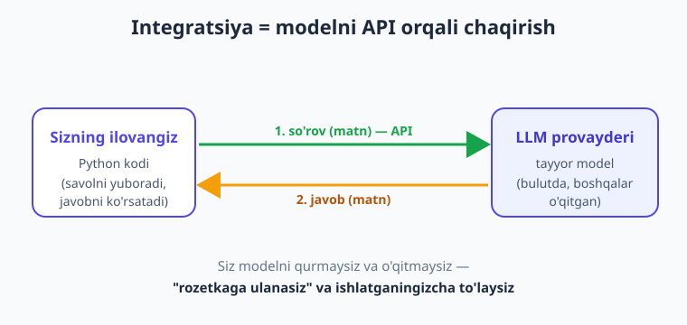
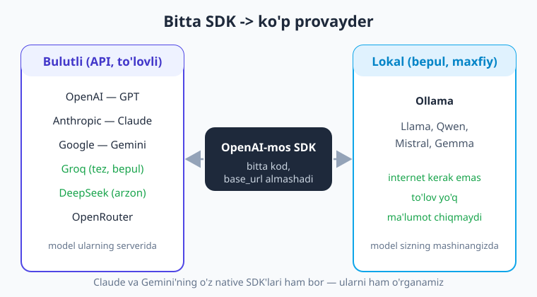

# 01 — AI/LLM integratsiyasi nima va nega kerak

[🏠 Kitob boshi](./README.md) · [Keyingi: 02 — Muhitni sozlash va birinchi so'rov ➡️](./02-muhit-birinchi-sorov.md)

> **Bu bobda:** "ilovaga aql qo'shish" nima ekanini tushunamiz; katta til modeli (LLM) sodda tilda nima ekanini, token va kontekst nima uchun muhimligini ko'ramiz; eng muhim g'oyani — **"integratsiya = modelni o'qitish emas, tayyor modelni API orqali chaqirish"** — o'zlashtiramiz; LLM nima qila oladi va nima qila olmasligini, modellar landshaftini (bulutli va lokal) va nega bu kitob **ko'p provayderli** ekanini bilib olamiz. Bir qatordan ham kod yozmaymiz — bu bob "katta rasm"ni ko'rsatadi.

---

## Muammodan boshlaymiz: ilovaga "aql" kerak bo'lib qoldi

Tasavvur qiling, sizda foydalanuvchilar yozadigan ilova bor — masalan, mijozlarga yordam beradigan sayt. Foydalanuvchi quyidagicha yozadi:

> "Kecha buyurtma bergandim, hali kelmadi, qachon yetib keladi?"

An'anaviy dasturlashda siz **har bir holatni qo'lda** ko'zda tutishingiz kerak: kalit so'zlarni qidirish (`"buyurtma"`, `"qachon"`), shartlar yozish, javob shablonlarini tayyorlash. Lekin foydalanuvchi minglab xil usulda yozishi mumkin: "zakazim qani?", "tovarim kelmadi", "buyurtmam holati nima?". Hammasini `if/else` bilan qamrab bo'lmaydi.

Mana shu yerda **katta til modellari (LLM)** o'yinni o'zgartirdi. Endi siz tabiiy tilni *tushunadigan*, savolga *javob yozadigan*, matnni *xulosa qiladigan* yoki *tarjima qiladigan* "aqlni" ilovangizga **bir necha qator kod** bilan ulashingiz mumkin — buning uchun sun'iy intellektni noldan qurish shart emas.

> **Hayotiy o'xshatish.** An'anaviy kod — bu har bir savol uchun oldindan yozib qo'yilgan **javob varaqasi**: savol roppa-rosa mos kelsa, javob bor; aks holda — "tushunmadim". LLM esa — savolni **o'qib, tushunib, o'z so'zi bilan javob beradigan xodim** kabi: savol qanday shaklda berilsa ham, mazmunini ilg'aydi.

!!! note "Atamalar"
    **AI (sun'iy intellekt)** — kompyuterga inson aqliga xos vazifalarni (tilni tushunish, rasmni ko'rish, qaror qabul qilish) bajartirish sohasi. **LLM (Large Language Model — katta til modeli)** — juda katta hajmdagi matn ustida o'rgatilgan, tabiiy tilni tushunib, matn generatsiya qiladigan AI modeli. ChatGPT, Claude, Gemini — bularning hammasi LLM'ga asoslangan.

---

## LLM nima? (eng sodda tushuntirish)

LLM — bu **keyingi so'zni bashorat qiladigan** ulkan model. Internetdagi kitoblar, maqolalar, kod va suhbatlarning juda katta qismi ustida o'rgatilgan. O'rganish jarayonida u "...quyosh sharqdan ..." degan gapdan keyin "chiqadi" so'zi kelishini, "Python'da ro'yxatga element qo'shish uchun ... metodi ishlatiladi" degandan keyin "append" kelishini — millionlab shunday naqshlarni o'zlashtirgan.

Natijada hosil bo'lgan model shunchalik kuchliki, "keyingi so'zni bashorat qilish" oddiy o'yin emas — u savolga javob berish, kod yozish, matnni xulosa qilish, tarjima qilish kabi murakkab vazifalarni bajarishga aylanadi. Chunki "to'g'ri javobni yozish" — aslida "eng mantiqiy keyingi so'zlarni ketma-ket bashorat qilish"dir.

### Token — LLM'ning "so'z bo'lagi"

Model matnni butun so'zlar bilan emas, **token**lar bilan o'lchaydi. Token — bu so'z yoki so'z bo'lagi. Masalan, "salomatlik" so'zi bir necha tokenga bo'linishi mumkin: `salom` + `at` + `lik`. Inglizcha matnda taxminan **1 token ≈ 4 belgi ≈ 0.75 so'z**.

Token nega muhim? Ikki sabab:

1. **Narx.** Siz LLM'ni ishlatganda har bir token uchun to'laysiz — ham yuborgan (kirish), ham olgan (chiqish) tokenlaringiz uchun. Token qancha kam — xarajat shuncha kam.
2. **Chegara.** Har bir modelning **kontekst oynasi** bor — bir so'rovda sig'diradigan maksimal token soni (kirish + chiqish). Masalan, 128 000 tokenli oyna — taxminan 300 sahifalik kitob. Undan ortig'i sig'maydi.

> **Hayotiy o'xshatish.** Kontekst oynasi — model bir vaqtda "yodida tutadigan" stol yuzasi. Stolga sig'gani — model ko'radi; sig'magani — yerga tushib, ko'rinmay qoladi. Stol katta bo'lsa ham cheksiz emas; shuning uchun nimani stolga qo'yishni (ya'ni modelga nima yuborishni) oqilona tanlash — bu kitobning muhim ko'nikmalaridan biri.

!!! tip "Token sanagichni ko'rib chiqing"
    Provayderlar ko'pincha onlayn "tokenizer" asbobini taqdim etadi — matnni kiritib, necha tokenga bo'linishini ko'rasiz. 22-bobda Python'da token sanashni va xarajatni oldindan hisoblashni o'rganamiz.

---

## Eng muhim g'oya: integratsiya = modelni o'qitish EMAS, uni chaqirish

Bu joyni juda yaxshi tushunib oling — ko'p boshlovchilar shu yerda adashadi.

Siz LLM'ni **o'zingiz o'qitmaysiz**. Modelni o'qitish (training) — millionlab dollar, minglab grafik protsessor va oylar talab qiladigan ish; uni OpenAI, Google, Anthropic kabi yirik kompaniyalar bajaradi. **Sizning ishingiz** — shu tayyor, o'qitilgan modelni **API orqali chaqirish**: matn yuborasiz, javob olasiz. Xolos.

> **Hayotiy o'xshatish.** LLM — bu **elektr stansiya**. Uyingizga elektr kerak bo'lsa, o'zingiz stansiya qurmaysiz — shunchaki **rozetkaga ulanasiz** va iste'mol qilganingizcha to'laysiz. LLM integratsiyasi ham aynan shunday: modelni qurmaysiz, **API "rozetkasiga" ulanib**, har bir so'rov uchun to'laysiz. Bu kitob — sizga shu rozetkaga to'g'ri, xavfsiz va arzon ulanishni o'rgatadi.

Demak, LLM integratsiyasi quyidagicha ko'rinadi (eng sodda holatda):

1. Foydalanuvchi savolini olasiz.
2. Uni LLM provayderining **API**siga yuborasiz (Python kodi orqali).
3. Model javob qaytaradi.
4. Javobni foydalanuvchiga ko'rsatasiz.

Butun bu kitob — shu to'rt qadamni oddiy "salom-alik"dan to murakkab RAG-tizim va agentlargacha **professional darajada** qurishga bag'ishlangan.

!!! note "Fine-tuning haqida bir og'iz"
    "Modelni o'z ma'lumotim bilan o'qitsam-chi?" — degan savol tug'ilishi mumkin. Buni **fine-tuning** deyiladi va u ham bor, lekin: (a) ko'pincha **kerak emas** — yaxshi prompt va RAG aksariyat vazifani hal qiladi; (b) qimmat va murakkab. Shuning uchun bu kitob **prompt** va **RAG**ga (o'z hujjatlaringizni modelga *kontekst* sifatida berish) urg'u beradi — bular 99% holatda yetarli va arzon.

---

## LLM nima qila oladi — va nima qila OLMAYDI

LLM kuchli, lekin sehrli emas. Uning chegaralarini bilish — ishonchli ilova qurishning birinchi sharti.

**Yaxshi bajaradi:**

- Savolga javob berish, tushuntirish, maslahat.
- Matnni xulosalash, tarjima qilish, qayta yozish, tahrirlash.
- Tasniflash (masalan, sharhni "ijobiy/salbiy"ga ajratish), ma'lumot ajratib olish (matndan ism, sana, narxni topish).
- Kod yozish va tushuntirish.
- Strukturali natija (JSON) chiqarish — bu ilovangizga ulanish uchun juda muhim (9-bobda ko'ramiz).

**Qiynaladi yoki xato qiladi:**

- **"Tuqib chiqarish" (hallucination).** Model bilmagan narsani ham **ishonch bilan, lekin noto'g'ri** aytishi mumkin. U "rost" emas, "ehtimolli" javob beradi. Shuning uchun muhim faktlarni tekshirish kerak — RAG aynan shu muammoni kamaytiradi.
- **Yangi bilim.** Modelning bilimi ma'lum bir sanada to'xtagan ("knowledge cutoff"); undan keyingi voqealarni bilmaydi. Yangi ma'lumotni unga **siz berishingiz** kerak (RAG yoki tool orqali).
- **Aniq matematika va hisob-kitob** — ba'zan xato. Yechim: hisob-kitobni **tool**ga (kod yoki kalkulyator) topshirish (10–11-boblar).
- **Sizning shaxsiy/maxfiy ma'lumotingiz** — model uni bilmaydi, chunki u sizning bazangizda o'qimagan. Yechim: RAG (13–17-boblar).

> **Hayotiy o'xshatish.** LLM — juda bilimli, tez gapiradigan, lekin ba'zan **o'ziga ortiqcha ishonadigan** maslahatchi kabi. U ko'p narsani biladi, ammo bilmagan narsasini ham dadil aytib yuborishi mumkin. Aqlli rahbar (ya'ni siz) uning kuchidan foydalanadi, lekin muhim qarorlarni tekshiradi va kerakli ma'lumotni qo'liga tutqazadi.

!!! warning "Hallucination — eng katta xavf"
    LLM-ilovalardagi eng keng tarqalgan jiddiy xato — modelning to'qib chiqargan javobini "haqiqat" deb foydalanuvchiga ko'rsatish. Bu kitob davomida buni kamaytirishning bir necha usulini o'rganamiz: aniq prompt (5-bob), RAG bilan haqiqiy manbaga bog'lash (16-bob), tool bilan tekshirish (11-bob) va natijani validatsiya qilish (24-bob).

---

## Modellar landshafti: bulutli va lokal, ko'p provayder

LLM bozori bitta kompaniyadan iborat emas. Asosiy ikki guruh bor:

**Bulutli (API orqali, to'lovli) provayderlar** — model ularning serverida ishlaydi, siz API orqali ulanasiz:

- **OpenAI** — GPT modellari (eng mashhur, ko'p material).
- **Anthropic** — Claude modellari (uzun kontekst, tool va agentlarda kuchli).
- **Google** — Gemini modellari (saxiy bepul tier, ko'p tilli).
- **Boshqalar** — Groq (juda tez, bepul tier), DeepSeek (arzon), OpenRouter (bitta kalit bilan o'nlab model), Together va h.k.

**Lokal (o'z kompyuteringizda, bepul) modellar** — ochiq modellar (Llama, Qwen, Mistral...) o'z mashinangizda ishlaydi:

- **Ollama** — lokal modelni eng oson ishga tushirish yo'li (21-bob). Internet kerak emas, to'lov yo'q, ma'lumot kompyuteringizdan chiqmaydi.

### Nega ko'p provayderli yondashuv?

Bu kitob biror provayderga "qul" qilib bog'lab qo'ymaydi. Sababi amaliy:

- **Vendor lock-in'dan qochish.** Bitta provayderga bog'lanib qolsangiz, narx oshsa yoki xizmat ishlamay qolsa — qiyin ahvolda qolasiz. Kodingiz provayderni almashtira oladigan bo'lsa — erkinsiz.
- **Narx va tezlik.** Har xil vazifa uchun har xil model: arzon vazifaga arzon model, murakkabga kuchli model. Ba'zi provayderlar (Groq) juda tez, ba'zilari (DeepSeek) juda arzon.
- **Kirish imkoniyati.** O'zbekistondan ba'zi provayderlarga to'lov qilish qiyin bo'lishi mumkin. Bepul tier (Gemini, Groq) yoki lokal (Ollama) — amaliy yechim.

**Eng yaxshi xabari:** ko'p provayder **bir xil "OpenAI-mos" API** formatini qo'llab-quvvatlaydi. Ya'ni siz bitta SDK (`openai` kutubxonasi) o'rganasiz va faqat `base_url` hamda kalitni almashtirib, OpenAI, Groq, DeepSeek, OpenRouter va hatto lokal Ollama'ga ulanasiz. Buni 4-bobda amalda ko'ramiz. Claude va Gemini'ning o'z native SDK'lari ham bor — ularni ham o'rganamiz.

!!! tip "Boshlash uchun nima tanlash?"
    Agar to'lov qiyin bo'lsa — **Gemini** (saxiy bepul tier) yoki **Groq** (bepul, tez) bilan boshlang, yoki butunlay **Ollama** bilan lokal ishlang. Pul muammo bo'lmasa — **OpenAI** yoki **Claude** eng silliq tajriba beradi. Kod deyarli bir xil — provayderni keyin ham almashtira olasiz.

---

## Bu kitob nima beradi — yo'l xaritasi

Bu kitob sizni "API nima?" degan savoldan to **to'liq AI ilova (RAG chatbot + agent)** qurishgacha bosqichma-bosqich olib boradi:

- **Asoslar** (1–4): muhit, birinchi so'rov, chat formati, ko'p provayder.
- **Promptlar va generatsiya** (5–8): prompt muhandisligi, parametrlar, streaming, suhbat xotirasi.
- **Strukturali natija va tashqi dunyo** (9–12): JSON, tool/function calling, multimodal.
- **RAG** (13–17): embeddings, vektor bazasi, o'z hujjatlaringiz ustida savol-javob.
- **Agentlar** (18–20): ReAct sikli, 0 dan agent, freymvork va MCP.
- **Lokal modellar** (21): Ollama bilan bepul, maxfiy, internetsiz ishlash.
- **Production** (22–26): xarajat, ishonchlilik, xavfsizlik, kuzatuv, FastAPI bilan deploy.
- **Kapston** (27–28): hamma bilimni birlashtirib RAG chatbot va agent quramiz.

Har bob oldingisiga tayanadi, shuning uchun **tartib bilan** o'qing. Va eng muhimi — **har misolni o'z qo'lingiz bilan terib, ishga tushiring.** AI integratsiyasini faqat o'qib emas, qilib o'rganasiz.

Keyingi bobda nazariyani yig'ishtirib, **muhitni sozlaymiz va birinchi haqiqiy LLM so'rovimizni** yuboramiz.

---

## Xulosa

- An'anaviy `if/else` kod tabiiy tilni tushunolmaydi; **LLM** esa savolni qanday shaklda berilishidan qat'i nazar mazmunini ilg'aydi — shuning uchun ilovaga "aql" qo'shadi.
- **LLM** — juda katta matn ustida o'rgatilgan, **keyingi tokenni bashorat qiladigan** model. Token — so'z yoki so'z bo'lagi; u **narx** va **kontekst oynasi** (model bir vaqtda "ko'radigan" hajm) uchun muhim.
- Eng muhim g'oya: **integratsiya = modelni o'qitish emas, tayyor modelni API orqali chaqirish.** Siz "elektr stansiya qurmaysiz, rozetkaga ulanasiz".
- LLM javob berish, xulosalash, tasniflash, kod yozishda kuchli; lekin **hallucination** (ishonch bilan xato), **bilim cheki**, aniq matematika va **sizning maxfiy ma'lumotingiz**da qiynaladi. Yechimlar: aniq prompt, RAG, tool, validatsiya.
- Landshaft: **bulutli** (OpenAI, Anthropic/Claude, Google/Gemini, Groq, DeepSeek) va **lokal** (Ollama). Bu kitob **ko'p provayderli** — `base_url` almashtirib bitta SDK bilan ko'piga ulanasiz; bu lock-in'dan qochiradi, narx/kirishda erkinlik beradi.
- Kitob 0 dan: asoslar → prompt → strukturali natija/tool → RAG → agent → lokal → production → kapston.

## Amaliy mashqlar

Bu bob nazariy bo'lgani uchun mashqlar fikrlash va tushuntirishga qaratilgan. Hech qanday kod yozish shart emas.

1. **(Oson)** "Integratsiya = modelni o'qitish emas, uni chaqirish" jumlasini o'z so'zingiz bilan, "elektr stansiya/rozetka" o'xshatishidan foydalanib do'stingizga tushuntiring.

2. **(Oson)** Token nima va u nega muhim? "Narx" va "kontekst oynasi" so'zlarini ishlatib javob bering.

3. **(O'rtacha)** Quyidagi vazifalardan qaysilarini LLM yaxshi bajaradi, qaysilarida ehtiyot bo'lish kerak: (a) foydalanuvchi sharhini ijobiy/salbiyga ajratish; (b) "2025-yilning iyun oyida valyuta kursi qancha edi?" degan aniq faktni aytish; (c) matnni o'zbekchaga tarjima qilish; (d) 4-xonali ikki sonni aniq ko'paytirish. Har biri uchun sababini ayting.

4. **(O'rtacha)** Tasavvur qiling, O'zbekistonda startap uchun AI-yordamchi qurmoqchisiz, lekin xalqaro to'lov qiyin. Qaysi provayder(lar)dan boshlaysiz va nega? "Bepul tier", "lokal" va "lock-in" so'zlarini ishlatib asoslang.

5. **(Qiyin)** "Hallucination" nima ekanini tushuntiring va bu kitobda uni kamaytirishning kamida uchta usulini (boblariga ishora qilib) sanab bering. Nega muhim faktlarni LLM javobiga ko'r-ko'rona ishonib bo'lmaydi?

---

[🏠 Kitob boshi](./README.md) · [Keyingi: 02 — Muhitni sozlash va birinchi so'rov ➡️](./02-muhit-birinchi-sorov.md)
