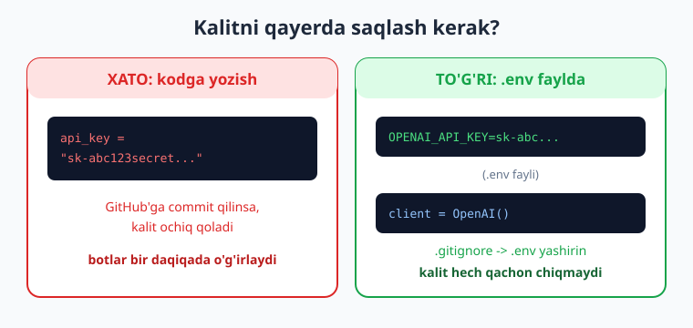

# 02 — Muhitni sozlash va birinchi so'rov

[⬅️ Oldingi: 01 — AI/LLM integratsiyasi nima](./01-ai-llm-integratsiya-nima.md) · [🏠 Kitob boshi](./README.md) · [Keyingi: 03 — Chat formati ➡️](./03-chat-formati-rollar.md)

> **Bu bobda:** Python muhitini (virtual muhit) tayyorlaymiz; API kalitini qayerdan va qanday olishni (jumladan **bepul** variantlarni) ko'ramiz; kalitni `.env` faylda **xavfsiz** saqlashni o'rganamiz; `openai` SDK'ni o'rnatamiz va nihoyat **birinchi haqiqiy LLM so'rovini** yuborib, javobni ekranda ko'ramiz. Bobning oxirida sizda ishlaydigan birinchi AI skripti bo'ladi.

---

## Muammodan boshlaymiz: nimadan boshlash kerak?

1-bobda "integratsiya = API chaqirish" ekanini bildik. Endi amalga o'tamiz. Buning uchun uchta narsa kerak:

1. **Toza Python muhiti** — kutubxonalar bir-biriga xalaqit bermasligi uchun.
2. **API kalit** — provayderga "men kimman" deyish uchun maxfiy parol.
3. **SDK** — provayderga so'rov yuboradigan Python kutubxonasi.

Keling, har birini tartib bilan sozlaymiz.

!!! note "Talab"
    Sizda **Python 3.11+** o'rnatilgan bo'lishi kerak. Terminalda `python --version` (yoki `python3 --version`) yozib tekshiring. Agar yo'q bo'lsa — [python.org](https://www.python.org/downloads/) dan o'rnating. Python asoslarini bilmasangiz, avval [Python kitobini](../python/README.md) o'qing.

---

## 1-qadam: virtual muhit (venv)

**Virtual muhit** — bu loyihangiz uchun alohida, izolyatsiya qilingan Python "qutisi". Unda o'rnatilgan kutubxonalar boshqa loyihalarga ta'sir qilmaydi. Bu — professional Python ishining standart amaliyoti.

Loyiha papkasini yarating va virtual muhit oching:

```bash
mkdir ai-boshlash
cd ai-boshlash

# Virtual muhit yaratish
python -m venv .venv

# Faollashtirish (Windows PowerShell):
.venv\Scripts\Activate.ps1
# Faollashtirish (macOS / Linux):
source .venv/bin/activate
```

Faollashtirilgach, terminal satri boshida `(.venv)` ko'rinadi — demak, siz endi izolyatsiya qilingan muhitdasiz.

> **Hayotiy o'xshatish.** Virtual muhit — har bir loyiha uchun alohida **asboblar yashigi**. Bir loyihada bolg'a eski versiyada, boshqasida yangi versiyada bo'lishi mumkin — ular aralashib ketmaydi, chunki har biri o'z yashigida.

---

## 2-qadam: API kalit olish (bepul variantlar bilan)

API kalit — provayder serveriga "men ro'yxatdan o'tgan foydalanuvchiman" deb tasdiqlovchi maxfiy satr (masalan, `sk-...` bilan boshlanadi). Uni hech kimga ko'rsatmang — kim bilsa, sizning hisobingizdan foydalana oladi.

Qaysi provayderdan boshlash — sizga bog'liq. Mana amaliy tanlovlar:

| Provayder | Kalit qayerdan | Izoh |
|---|---|---|
| **Groq** | console.groq.com | **Bepul tier**, juda tez. Boshlash uchun ajoyib. |
| **Google Gemini** | aistudio.google.com | **Saxiy bepul tier**, O'zbekistondan kirish oson. |
| **OpenAI** | platform.openai.com | Eng mashhur; to'lovli (kichik balans qo'shish kerak). |
| **Anthropic (Claude)** | console.anthropic.com | To'lovli; tool/agentlarda kuchli. |
| **Ollama (lokal)** | kalit kerak emas! | Butunlay bepul, o'z kompyuteringizda (21-bob). |

!!! tip "Maslahat"
    Pul muammo bo'lsa — **Groq** yoki **Gemini** bepul kaliti bilan boshlang. Bu bobdagi kod har qaysisiga ozgina o'zgartirish bilan ishlaydi; to'liq ko'p-provayderli yondashuvni 4-bobda ko'ramiz. Quyida asosiy misolni OpenAI-mos formatda yozamiz — u OpenAI, Groq, DeepSeek va Ollama'da bir xil ishlaydi.

---

## 3-qadam: kalitni xavfsiz saqlash — `.env`

Kalitni **hech qachon kodga to'g'ridan-to'g'ri yozmang.** Agar kodingizni GitHub'ga yuklasangiz, kalit commit ichida ochiq qoladi — buni botlar bir necha daqiqada o'g'irlaydi va hisobingizdan pul sarflaydi.

To'g'ri yo'l — kalitni `.env` faylda saqlash va uni `.gitignore`ga qo'shish:



`.env` nomli fayl yarating (kodingiz yonida):

```text
# .env fayli — bu faylni HECH QACHON GitHub'ga yuklamang
OPENAI_API_KEY=sk-bu-yerga-haqiqiy-kalitingiz
```

Va `.gitignore` faylini yarating:

```text
# .gitignore
.venv/
.env
__pycache__/
```

!!! warning "Eng keng tarqalgan jiddiy xato"
    Kalitni kodga yozib, GitHub'ga yuklash — boshlovchilarning eng qimmat xatosi. Doim `.env` + `.gitignore` ishlatish odatini birinchi kundan o'rnating. Kalitni xavfsiz saqlash haqida chuqurroq 24-bobda gaplashamiz.

---

## 4-qadam: kutubxonalarni o'rnatish

Endi kerakli kutubxonalarni o'rnatamiz: `openai` (SDK) va `python-dotenv` (`.env` faylini o'qish uchun):

```bash
pip install openai python-dotenv
```

!!! note "Nega `openai` kutubxonasi — boshqa provayder uchun ham?"
    `openai` kutubxonasi shunchaki OpenAI uchun emas. U **OpenAI-mos** API standartini gapiradigan har qanday provayder bilan ishlaydi — Groq, DeepSeek, OpenRouter, lokal Ollama va boshqalar. Faqat `base_url` va kalitni almashtirasiz. Shuning uchun u — ko'p-provayderli yondashuvning "universal tili". Buni 4-bobda to'liq ko'ramiz.

---

## 5-qadam: birinchi so'rov!

Endi eng qiziq qism. `birinchi.py` faylini yarating:

```python
import os
from dotenv import load_dotenv
from openai import OpenAI

# .env faylidagi kalitni muhitga yuklaydi
load_dotenv()

# Mijoz (client) yaratamiz. Kalitni avtomatik OPENAI_API_KEY dan oladi.
client = OpenAI()

# Model nomi. Eslatma: nomlar o'zgaradi — provayder ro'yxatini tekshiring.
MODEL = "gpt-5.4-mini"

# So'rov yuboramiz
javob = client.chat.completions.create(
    model=MODEL,
    messages=[
        {"role": "user", "content": "Salom! O'zbek tilida bir jumlada o'zingni tanishtir."}
    ],
)

# Javobni o'qiymiz va chop etamiz
print(javob.choices[0].message.content)
```

Ishga tushiring:

```bash
python birinchi.py
```

Agar hamma narsa to'g'ri bo'lsa, ekranda modelning o'zbekcha tanishuvi paydo bo'ladi — **tabriklaymiz, siz birinchi LLM so'rovingizni yubordingiz!** 🎉

> **Hayotiy o'xshatish.** Bu kod — restoranda buyurtma berishga o'xshaydi: `client` — ofitsiant, `messages` — buyurtmangiz, `create(...)` — buyurtmani oshxonaga yuborish, `javob.choices[0].message.content` — oldingizga kelgan taom. Siz oshxonaga kirmaysiz (modelni qurmaysiz), lekin tayyor taomni olasiz.

---

## So'rov va javob anatomiyasi

Yuqoridagi kodda nima sodir bo'ldi? Keling, qismlarga ajratamiz.

![chat.completions.create chaqiruvi: model va messages yuboriladi, javob obyekti qaytadi; matn javob.choices[0].message.content ichida bo'ladi, javob.usage esa token sarfini ko'rsatadi](rasmlar/aip02-sorov-javob.svg)

- **`client`** — provayderga ulanish. Kalitni u o'zi `.env`dan oladi.
- **`model`** — qaysi modelni ishlatish (`gpt-5.4-mini`, `claude-haiku-4-5`, `gemini-2.5-flash`...).
- **`messages`** — suhbat. Hozir bitta `user` xabar yubordik. Rollar (`system`/`user`/`assistant`) haqida 3-bobda batafsil.
- **`javob.choices[0].message.content`** — modelning matnli javobi. `choices` ro'yxat bo'lgani uchun `[0]` — birinchi (odatda yagona) javob.

`javob` obyektida boshqa foydali ma'lumot ham bor — masalan, sarflangan tokenlar:

```python
print(javob.usage)
# CompletionUsage(prompt_tokens=24, completion_tokens=18, total_tokens=42)
```

`prompt_tokens` — siz yuborgan, `completion_tokens` — model qaytargan tokenlar. 22-bobda bulardan xarajatni hisoblashni o'rganamiz.

---

## Boshqa provayderga ulanish (oldindan ko'rinish)

Aytganimizdek, bir xil kod boshqa provayderda ham ishlaydi — faqat `base_url`, kalit va modelni almashtiramiz. Masalan, **Groq** (bepul, tez) uchun:

```python
client = OpenAI(
    base_url="https://api.groq.com/openai/v1",
    api_key=os.environ["GROQ_API_KEY"],
)
MODEL = "llama-3.3-70b-versatile"   # Groq'dagi model nomi
```

Qolgan kod (`client.chat.completions.create(...)`) **o'zgarmaydi**. Mana shu — ko'p-provayderli yondashuvning kuchi. To'liq ro'yxat va batafsil tushuntirish 4-bobda.

---

## Xato bilan tanishuv (qo'rqmang!)

Agar kalit noto'g'ri yoki yo'q bo'lsa, `AuthenticationError` chiqadi. Bu — normal; xatolarni chiroyli boshqarishni o'rganamiz. Hozircha eng oddiy himoya:

```python
import openai

try:
    javob = client.chat.completions.create(
        model=MODEL,
        messages=[{"role": "user", "content": "Salom"}],
    )
    print(javob.choices[0].message.content)
except openai.AuthenticationError:
    print("Kalit noto'g'ri yoki topilmadi. .env faylini tekshiring.")
except openai.APIError as e:
    print(f"API xatosi: {e}")
```

!!! tip "Xatolar — dushman emas"
    Xato xabari — sizga nima noto'g'ri ekanini aytadigan do'st. Uni o'qing: `AuthenticationError` — kalit muammosi, `NotFoundError` — model nomi xato, `RateLimitError` — juda ko'p so'rov. Har birini 23-bobda chuqur ko'ramiz.

---

## Xulosa

- LLM integratsiyasini boshlash uchun uch narsa kerak: **virtual muhit**, **API kalit**, **SDK**.
- **Virtual muhit** (`python -m venv .venv`) loyihalarni izolyatsiya qiladi — har biri o'z "asboblar yashigi"da.
- **API kalit** — maxfiy parol. Bepul boshlash uchun **Groq** yoki **Gemini** ajoyib; lokal **Ollama** umuman kalit talab qilmaydi.
- Kalitni **`.env` faylda** saqlang va `.gitignore`ga qo'shing — **hech qachon kodga yozmang**. Bu eng muhim xavfsizlik odati.
- `pip install openai python-dotenv` — `openai` kutubxonasi nafaqat OpenAI, balki barcha **OpenAI-mos** provayderlar (Groq, DeepSeek, Ollama...) bilan ishlaydi.
- Birinchi so'rov: `client.chat.completions.create(model=..., messages=[...])`; javob matni `javob.choices[0].message.content`da, token sarfi `javob.usage`da.
- Boshqa provayderga o'tish = `base_url` + kalit + model nomini almashtirish; qolgan kod o'zgarmaydi.

## Amaliy mashqlar

1. **(Oson)** Virtual muhit yarating, faollashtiring va `pip install openai python-dotenv` ni bajaring. `pip list` bilan o'rnatilganini tekshiring.

2. **(Oson)** `.env` faylida kalitingizni saqlang, `.gitignore`ga `.env` qo'shing. Yuqoridagi `birinchi.py`ni ishga tushiring va modelning javobini oling.

3. **(O'rtacha)** Skriptni o'zgartiring: foydalanuvchidan `input()` bilan savol so'rang va uni modelga yuboring. So'ng `javob.usage`ni ham chop eting.

4. **(O'rtacha)** Bepul provayder (Groq yoki Gemini-mos endpoint) kaliti oling va `base_url` + kalit + modelni almashtirib, **o'sha kod**ni ikkinchi provayderda ishlatib ko'ring.

5. **(Qiyin)** Skriptga `try/except` qo'shing. Atayin kalitni noto'g'ri yozib, qaysi xato chiqishini ko'ring; keyin model nomini xato yozib, boshqa xatoni kuzating. Har bir xato xabari nimani anglatishini yozib oling.

---

[⬅️ Oldingi: 01 — AI/LLM integratsiyasi nima](./01-ai-llm-integratsiya-nima.md) · [🏠 Kitob boshi](./README.md) · [Keyingi: 03 — Chat formati ➡️](./03-chat-formati-rollar.md)
