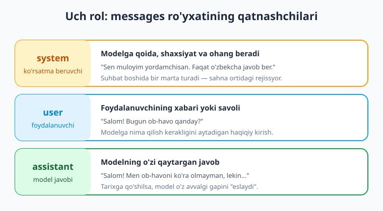
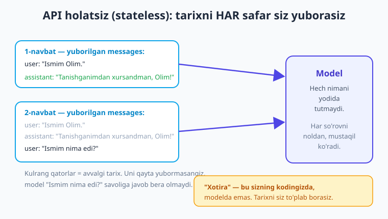
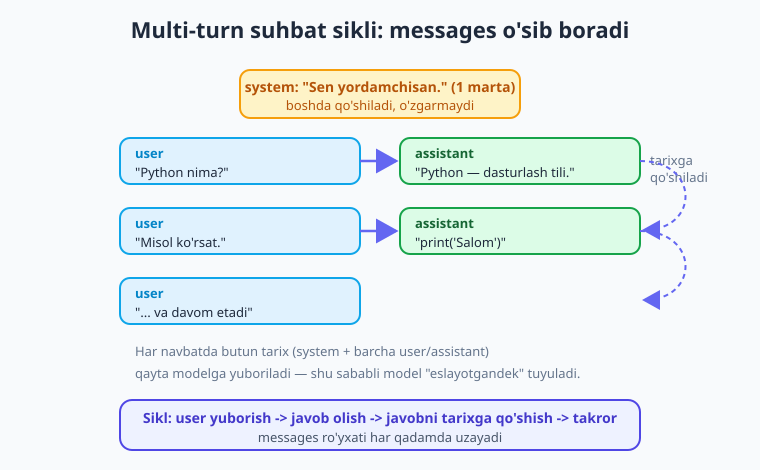

# 03 — Chat formati: messages, rollar, suhbat

[⬅️ Oldingi: 02 — Muhitni sozlash va birinchi so'rov](./02-muhit-birinchi-sorov.md) · [🏠 Kitob boshi](./README.md) · [Keyingi: 04 — Modellar va provayderlar: bitta SDK, ko'p provayder ➡️](./04-modellar-provayderlar.md)

> **Bu bobda:** LLM bilan suhbatning asosiy "tili" — `messages` ro'yxatini chuqur o'rganamiz. Uch rolni (**system**, **user**, **assistant**) va ularning vazifasini ko'ramiz; `system` prompt modelning xulqini qanday o'zgartirishini sinab ko'ramiz; eng muhim tushunchani — **API holatsiz (stateless)**, ya'ni model oldingi xabarlarni yodida tutmasligini — o'zlashtiramiz; va nihoyat ko'p navbatli (multi-turn) suhbatni o'zimiz qura olamiz. Yo'l-yo'lakay javobni to'g'ri o'qishni va boshqa provayderlarda (Claude, Gemini) formatdagi farqni bilib olamiz.

---

## Muammodan boshlaymiz: bitta xabar yetarli emas

2-bobda biz birinchi so'rovni yubordik va u bitta xabardan iborat edi:

```python
messages=[
    {"role": "user", "content": "Salom! O'zbek tilida o'zingni tanishtir."}
]
```

Bu ishladi. Lekin haqiqiy ilovada bizga ko'proq nazorat kerak bo'ladi. Masalan:

- Modelga **qanday gapirishini** aytmoqchimiz: "rasmiy bo'l", "faqat o'zbekcha javob ber", "qisqa yoz".
- Foydalanuvchi bilan **suhbat** qurmoqchimiz: u savol beradi, model javob beradi, u yana savol beradi va model **avvalgi gapni hisobga olishi** kerak.

Mana shu ikkala ehtiyojni ham bitta oddiy tuzilma hal qiladi: **`messages` ro'yxati** va undagi **rollar**. Bu bob — shu tuzilmani tushunishga bag'ishlangan. Uni yaxshi o'zlashtirsangiz, kitobning qolgan qismidagi deyarli barcha kod sizga tanish ko'rinadi.

> **Hayotiy o'xshatish.** `messages` — bu teatr **ssenariysi** kabi: har bir qator kim gapirayotganini (rol) va nima deyilayotganini (matn) ko'rsatadi. Model bu ssenariyni o'qib, **keyingi qatorni** — ya'ni o'z javobini yozadi.

---

## `messages` — xabarlar ro'yxati

So'rovning yuragi — `messages` argumenti. U **lug'atlar ro'yxati**, va har bir lug'at bitta xabar:

```python
messages = [
    {"role": "system",    "content": "Sen foydali yordamchisan."},
    {"role": "user",      "content": "Salom!"},
    {"role": "assistant", "content": "Salom! Sizga qanday yordam bera olaman?"},
    {"role": "user",      "content": "Python nima?"},
]
```

Har bir xabarda ikkita kalit bor:

- **`role`** — kim gapirayapti: `"system"`, `"user"` yoki `"assistant"`.
- **`content`** — gap mazmuni (hozircha matn; 12-bobda rasm ham qo'shamiz).

Model bu ro'yxatni **boshidan oxirigacha o'qiydi** va eng oxirgi `user` xabariga (butun suhbatni hisobga olib) javob yozadi.

!!! note "Tartib muhim"
    `messages` ichidagi **tartib** suhbatning vaqt oqimini bildiradi: birinchi xabar — eng eski, oxirgisi — eng yangi. `system` (agar bo'lsa) doim **birinchi** turadi; keyin `user` va `assistant` navbatma-navbat almashadi.

---

## Uch rol va ularning vazifasi

Keling, har bir rolni alohida ko'rib chiqamiz. Bu — bobning markaziy g'oyasi.



### `system` — modelga ko'rsatma beruvchi

`system` xabari modelga **qanday xulq tutishini** aytadi: shaxsiyati, ohangi, qoidalari, vazifasi. Bu foydalanuvchiga ko'rinmaydi — u "sahna ortidagi rejissyor" kabi. Misollar:

```python
{"role": "system", "content": "Sen tajribali Python ustozsan. Sodda til bilan, misol bilan tushuntir. Faqat o'zbekcha javob ber."}
```

`system` ko'pincha **bir marta**, suhbat boshida beriladi va butun suhbat davomida amal qiladi.

### `user` — foydalanuvchi xabari

`user` — bu **foydalanuvchidan kelgan** matn: savol, buyruq yoki ma'lumot. Aynan shunga javob berishni model "vazifa" deb biladi:

```python
{"role": "user", "content": "Ro'yxatga element qo'shishni tushuntir."}
```

### `assistant` — model javobi

`assistant` — bu **modelning o'zi qaytargan** javob. Yangi so'rovda buni siz qo'lda yozmaysiz — uni avvalgi javobdan olib, **tarixga qo'shasiz** (buni pastda multi-turn qismida ko'ramiz). U modelga "men avval shunday degandim" deb eslatadi:

```python
{"role": "assistant", "content": "append() metodi ro'yxat oxiriga element qo'shadi."}
```

> **Hayotiy o'xshatish.** Tasavvur qiling, yangi xodimni ishga oldingiz. **`system`** — unga bergan lavozim yo'riqnomangiz ("muloyim bo'l, faqat o'zbekcha gapir"). **`user`** — mijozning savoli. **`assistant`** — xodimning javobi. Yo'riqnomani bir marta berasiz; mijoz bilan suhbat esa savol-javob bo'lib davom etadi.

---

## `system` prompt xulqni qanday o'zgartiradi

`system` promptning kuchini eng yaxshi **amalda** ko'rasiz. Bir xil `user` savoliga, faqat `system`ni o'zgartirib, butunlay boshqa ohangdagi javob olamiz.

```python
import os
from dotenv import load_dotenv
from openai import OpenAI

load_dotenv()
client = OpenAI()
MODEL = "gpt-5.4-mini"   # eslatma: nomlar o'zgaradi — provayder ro'yxatini tekshiring

def sora(system_matni: str, savol: str) -> str:
    javob = client.chat.completions.create(
        model=MODEL,
        messages=[
            {"role": "system", "content": system_matni},
            {"role": "user", "content": savol},
        ],
    )
    return javob.choices[0].message.content

savol = "Internet nima?"

# 1) Rasmiy, qisqa ohang
print(sora("Sen rasmiy ensiklopediyasan. Bir jumlada, ilmiy uslubda javob ber.", savol))

# 2) Do'stona, bolaga tushuntiruvchi ohang
print(sora("Sen mehribon ustozsan. 7 yoshli bolaga o'xshatish bilan tushuntir.", savol))
```

Bir xil savol, lekin natijalar butunlay boshqacha bo'ladi: birinchisi quruq va rasmiy, ikkinchisi iliq va o'xshatishli. **Foydalanuvchi savolini o'zgartirmasdan** ham ilovangizning "shaxsiyatini" `system` orqali boshqarasiz.

!!! tip "system — eng arzon sozlash usuli"
    Modelni "to'g'rilash"ning eng oddiy va arzon yo'li — yaxshi `system` prompt yozish (fine-tuning emas!). "Faqat o'zbekcha javob ber", "noaniq bo'lsa, taxmin qilma — so'ra", "javobni JSON shaklida qaytar" kabi qoidalarni shu yerga yozasiz. Prompt yozishni 5-bobda chuqur o'rganamiz.

!!! warning "system — qonun emas, kuchli maslahat"
    `system` prompt modelga kuchli ta'sir qiladi, lekin u **temir qonun emas** — model ba'zan undan chetga chiqishi mumkin. Muhim cheklovlar (masalan, xavfsizlik) faqat `system`ga tayanmasligi kerak; ularni kod tomonida ham tekshiring (24-bob).

---

## Eng muhim tushuncha: API holatsiz (stateless)

Endi butun bobning **eng muhim g'oyasiga** keldik. Diqqat bilan o'qing — ko'p boshlovchilar shu yerda adashadi.

**LLM API holatsiz (stateless).** Bu degani: model **oldingi so'rovlaringizni yodida tutmaydi.** Har bir `create(...)` chaqiruvi — model uchun **mutlaqo yangi, mustaqil** voqea. U sizning kim ekaningizni, oldin nima yozganingizni, bir necha soniya oldingi javobini ham **bilmaydi**.



Buni misolda ko'raylik. **Noto'g'ri kutish:**

```python
# 1-so'rov
client.chat.completions.create(model=MODEL,
    messages=[{"role": "user", "content": "Mening ismim Olim."}])

# 2-so'rov (ALOHIDA chaqiruv)
javob = client.chat.completions.create(model=MODEL,
    messages=[{"role": "user", "content": "Mening ismim nima edi?"}])
print(javob.choices[0].message.content)
# -> "Kechirasiz, men sizning ismingizni bilmayman."
```

Model "Olim" deb javob bermaydi — chunki ikkinchi so'rovda biz birinchi suhbatni **umuman yubormaganmiz**. Model uchun ikkinchi so'rov "ko'kdan tushgan" yagona savol.

**To'g'ri yo'l — tarixni o'zingiz yuborasiz:**

```python
javob = client.chat.completions.create(model=MODEL,
    messages=[
        {"role": "user", "content": "Mening ismim Olim."},
        {"role": "assistant", "content": "Tanishganimdan xursandman, Olim!"},
        {"role": "user", "content": "Mening ismim nima edi?"},
    ])
print(javob.choices[0].message.content)
# -> "Sizning ismingiz Olim."
```

Endi model javob beradi — chunki kerakli ma'lumot **shu so'rovning ichida** bor.

> **Hayotiy o'xshatish.** Model — har safar **xotirasi tozalanadigan** mutaxassis kabi. Siz unga maslahat uchun kelganingizda, u sizni eslamaydi — shuning uchun har gal kelganingizda butun ish tarixini (papkani) **qaytadan stolga qo'yasiz**. Papkani qo'ymasangiz, u "siz kim?" deb so'raydi. "Xotira" sizning qo'lingizda (kodingizda), modelda emas.

!!! note "Unda ChatGPT qanday eslaydi?"
    ChatGPT yoki Claude saytida suhbat davom etayotgandek tuyuladi, chunki **interfeys** har safar butun tarixni model'ga qayta yuboradi — siz buni ko'rmaysiz, xolos. API darajasida esa buni **siz** qilasiz. Bu mavzuni — uzun suhbatda tarix qanchalik o'sib ketishi va uni qisqartirish (xotira boshqaruvi) — 8-bobda chuqur ko'ramiz.

---

## Javobni to'g'ri o'qish

Model javobi — oddiy matn emas, **obyekt**. Matnga yetib borish uchun to'g'ri maydonlardan o'tasiz:

```python
javob = client.chat.completions.create(model=MODEL, messages=messages)

xabar = javob.choices[0].message   # assistant xabari (obyekt)
print(xabar.role)                  # "assistant"
print(xabar.content)               # modelning matnli javobi
```

- `javob.choices` — javoblar **ro'yxati** (odatda bitta), shuning uchun `[0]`.
- `.message` — o'sha javobning xabar obyekti.
- `.content` — matn; `.role` — har doim `"assistant"`.

Aynan shu `message` obyektini multi-turn suhbatda **to'g'ridan-to'g'ri tarixga qo'shsa bo'ladi** — endi shuni ko'ramiz.

---

## Multi-turn suhbat: tarixni o'stirib borish

Endi hamma narsani birlashtiramiz. **Multi-turn (ko'p navbatli) suhbat** — bu sikl: foydalanuvchi yozadi, model javob beradi, javobni tarixga qo'shamiz, va takror. Suhbat o'sgani sayin `messages` ro'yxati ham uzayadi.



Mana to'liq, ishlaydigan mini-suhbat dasturi:

```python
import os
from dotenv import load_dotenv
from openai import OpenAI

load_dotenv()
client = OpenAI()
MODEL = "gpt-5.4-mini"   # nomlar o'zgaradi — provayder ro'yxatini tekshiring

# Tarix system xabaridan boshlanadi
messages = [
    {"role": "system", "content": "Sen do'stona yordamchisan. Qisqa, o'zbekcha javob ber."}
]

print("Suhbat boshlandi. Chiqish uchun 'chiqish' deb yozing.\n")

while True:
    savol = input("Siz: ")
    if savol.strip().lower() in ("chiqish", "exit", "quit"):
        break

    # 1) Foydalanuvchi xabarini tarixga qo'shamiz
    messages.append({"role": "user", "content": savol})

    # 2) BUTUN tarixni yuboramiz (stateless — model o'zi eslamaydi!)
    javob = client.chat.completions.create(model=MODEL, messages=messages)
    matn = javob.choices[0].message.content

    # 3) Model javobini ham tarixga qo'shamiz, keyingi navbat uchun
    messages.append({"role": "assistant", "content": matn})

    print("Bot:", matn, "\n")
```

Bu dasturning **uchta muhim qadami** bor (kod izohlarida raqamlangan):

1. Foydalanuvchi gapini `messages`ga **qo'shamiz**.
2. **Butun** `messages`ni yuboramiz — chunki model o'zi eslamaydi.
3. Model javobini ham `messages`ga **qo'shamiz**, toki keyingi navbatda u "eslansin".

Shu uch qadam — kitobdagi har qanday chatbotning yuragi. Qolgani — bezak.

!!! tip "message obyektini to'g'ridan-to'g'ri qo'shish"
    Yuqorida biz `{"role": "assistant", "content": matn}` lug'atini qo'lda yasadik. Buning o'rniga model qaytargan xabar obyektini ham qo'shsa bo'ladi: `messages.append(javob.choices[0].message)`. Ikkalasi ham ishlaydi; lug'at varianti boshqa provayderlarga ko'chirishda barqarorroq.

---

## Boshqa provayderlarda farq

Kitob ko'p-provayderli bo'lgani uchun bir narsani bilib qo'ying: yuqoridagi format — **OpenAI-mos** standart. U OpenAI, Groq, DeepSeek, OpenRouter, Ollama'da **bir xil** ishlaydi. Lekin ba'zi native SDK'larda kichik farq bor.

**Anthropic (Claude):** Bu yerda `system` **`messages` ichida emas — alohida parametr**. Qolgan `user`/`assistant` xabarlar `messages`da qoladi:

```python
import anthropic
client = anthropic.Anthropic()           # ANTHROPIC_API_KEY

resp = client.messages.create(
    model="claude-haiku-4-5",            # nomlar o'zgaradi — tekshiring
    max_tokens=1024,                      # Claude'da SHART (majburiy)
    system="Sen do'stona yordamchisan. O'zbekcha javob ber.",  # ALOHIDA parametr!
    messages=[
        {"role": "user", "content": "Salom! O'zingni tanishtir."},
    ],
)
print(resp.content[0].text)               # javob: content bloklar ro'yxati
```

**Google Gemini (native):** Bu yerda umuman `messages` emas, **`contents`** ishlatiladi, `system` esa `system_instruction` sifatida konfiguratsiyada beriladi:

```python
from google import genai
from google.genai import types

client = genai.Client()                   # GEMINI_API_KEY
resp = client.models.generate_content(
    model="gemini-2.5-flash",
    contents="Salom! O'zingni tanishtir.",
    config=types.GenerateContentConfig(
        system_instruction="Sen do'stona yordamchisan. O'zbekcha javob ber.",
    ),
)
print(resp.text)
```

!!! note "Asosiy g'oya bir xil"
    Sintaksis turlicha bo'lsa-da, **tushuncha bir xil**: har joyda rollar bor, `system` modelga ko'rsatma beradi, va hamma joyda API **holatsiz** — multi-turn uchun tarixni siz yuborasiz. Bitta formatni (OpenAI-mos) yaxshi bilsangiz, qolganiga oson o'tasiz. Provayderlar farqini 4-bobda batafsil ko'ramiz.

---

## Keng tarqalgan xatolar

Boshlovchilar shu uch xatoda eng ko'p qoqiladi:

- **"Model esladimi?" deb kutish.** Tarixni yubormay turib, modeldan avvalgi gapni eslashini kutish. Yechim: har so'rovda butun `messages`ni yuboring (stateless!).
- **Javobni tarixga qo'shmaslik.** Faqat `user` xabarlarini to'plab, `assistant` javoblarini qo'shmaslik. Unda model o'z avvalgi gapini "eslamaydi" — suhbat uzilib qoladi.
- **Rollar tartibini buzish.** Masalan, `system`ni o'rtaga qo'yish yoki ikki `user` xabarini ketma-ket yuborish. To'g'ri tartib: `system` (bitta, boshda), keyin `user`/`assistant` navbatma-navbat.

> **Hayotiy o'xshatish.** Multi-turn suhbat — **xat yozish tarixi** kabi: yangi xat yozganingizda oldingilarini ham qog'ozda saqlab borasiz. Saqlamasangiz, suhbatchingiz "biz nimani gaplashayotgan edik?" deb adashadi. Tarixni saqlash — sizning vazifangiz.

---

## Xulosa

- `messages` — bu **xabarlar ro'yxati**; har biri `{"role": ..., "content": ...}` lug'ati. Tartib suhbatning vaqt oqimini bildiradi.
- Uch rol: **`system`** (modelga qoida/shaxsiyat/ohang beradi), **`user`** (foydalanuvchi xabari), **`assistant`** (model javobi).
- `system` prompt xulqni **kuchli** o'zgartiradi: bir xil savolga rasmiy yoki do'stona ohangda javob olasiz — bu modelni sozlashning eng arzon usuli.
- **Eng muhim:** LLM API **holatsiz (stateless)** — model oldingi xabarlarni **yodida tutmaydi**. Har so'rovda **butun suhbat tarixini siz yuborasiz**. "Xotira" sizning kodingizda.
- Multi-turn suhbat = sikl: `user`ni qo'shish -> butun tarixni yuborish -> `assistant` javobini ham tarixga qo'shish -> takror.
- Javobni o'qish: `resp.choices[0].message` (`.content` — matn, `.role` — `"assistant"`).
- Keng xatolar: tarixni yubormay "esladimi?" deb kutish, javobni tarixga qo'shmaslik, rollar tartibini buzish.
- Provayder farqi: Claude'da `system` **alohida parametr** (messages ichida emas), Gemini'da `contents` + `system_instruction`. Asosiy g'oya — rollar va stateless — hamma joyda bir xil.

## Amaliy mashqlar

1. **(Oson)** `messages`da `system` xabarini "Sen quvnoq robotsan, javob oxirida emoji qo'sh" deb yozing va bir savol bering. Keyin `system`ni "Sen rasmiy hujjat uslubida yozasan" ga o'zgartirib, **o'sha** savolni qayta bering. Ikki javobni taqqoslang.

2. **(Oson)** Ikkita alohida `create(...)` chaqiruvi yozing: birinchisida "Mening sevimli rangim ko'k" deng, ikkinchisida (tarixsiz) "Sevimli rangim nima?" deb so'rang. Model nega bilmasligini o'z so'zingiz bilan tushuntiring.

3. **(O'rtacha)** 2-mashqni **to'g'rilang**: ikkala xabarni bitta `messages` ro'yxatiga joylang (orasiga `assistant` javobini ham qo'shing) va bitta so'rovda yuboring. Endi model rangni eslaganini ko'ring.

4. **(O'rtacha)** Bobdagi `while True` mini-chatbotni terib, ishga tushiring. Unga ketma-ket: "Ismim Dilnoza", keyin "Ismim nima?" deb yozing — model eslashini tasdiqlang. So'ng 3-qadamni (javobni tarixga qo'shish) **o'chirib qo'ying** va xuddi shu suhbatni qaytaring: nima o'zgarishini kuzating.

5. **(Qiyin)** Chatbotni shunday kengaytiringki, har navbatdan keyin `len(messages)` ni va `javob.usage.total_tokens` ni chop etsin. Bir necha navbat suhbatlashing va ikkala son ham **o'sib borishini** kuzating. Bu nima uchun stateless API'da xarajat suhbat davom etgani sayin oshib borishini tushuntiradimi? (Bu muammoni 8- va 22-bobda hal qilamiz.)

---

[⬅️ Oldingi: 02 — Muhitni sozlash va birinchi so'rov](./02-muhit-birinchi-sorov.md) · [🏠 Kitob boshi](./README.md) · [Keyingi: 04 — Modellar va provayderlar: bitta SDK, ko'p provayder ➡️](./04-modellar-provayderlar.md)
