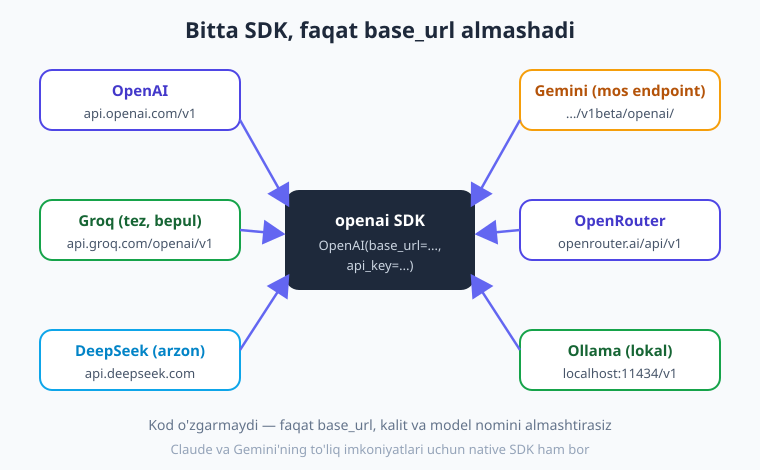

# 04 — Modellar va provayderlar: bitta SDK, ko'p provayder

[⬅️ Oldingi: 03 — Chat formati: messages, rollar, suhbat](./03-chat-formati-rollar.md) · [🏠 Kitob boshi](./README.md) · [Keyingi: 05 — Prompt muhandisligi ➡️](./05-prompt-muhandisligi.md)

> **Bu bobda:** bu kitobning markaziy g'oyasini amalda o'rganamiz — **bitta `openai` SDK** bilan o'nlab provayderga ulanish. Faqat `base_url`, kalit va model nomini almashtirib OpenAI, Groq, Gemini, DeepSeek, OpenRouter va lokal Ollama'ga ulanamiz. Bitta `mijoz_ol(provayder)` **factory** funksiyasini yozamiz; **narx ↔ tezlik ↔ sifat** uchburchagi bo'yicha to'g'ri modelni tanlashni ko'ramiz; `models.list()` bilan mavjud modellarni qanday topishni bilib olamiz; Claude va Gemini'ning **native SDK** qachon kerakligini va nihoyat **lock-in'dan qochish** — provayderni `.env` orqali almashtirish (kodga tegmasdan) — usulini o'rganamiz.

---

## Muammodan boshlaymiz: bitta provayderga bog'lanib qolmaslik

2-bobda birinchi so'rovni OpenAI bilan yubordik. Endi tabiiy savol tug'iladi: *"Men butun ilovani OpenAI'ga moslab yozsam, ertaga narx oshsa yoki xizmat ishlamay qolsa, nima qilaman?"*

Tasavvur qiling, ilovangizning yuzlab joyida `client.chat.completions.create(...)` chaqirilgan. Provayderni almashtirmoqchi bo'lsangiz — har bir joyni qo'lda o'zgartirish kerak. Bu — **vendor lock-in**: bitta sotuvchiga shunchalik bog'lanib qolasizki, undan chiqish qimmatga tushadi.

Yaxshi xabar: LLM dunyosida bu muammoning **deyarli bepul** yechimi bor. Ko'p provayder bir xil — **"OpenAI-mos"** — API formatini gapiradi. Ya'ni siz bitta SDK o'rganasiz va undan o'nlab provayder bilan foydalanasiz.

> **Hayotiy o'xshatish.** OpenAI-mos API — bu **rozetka standarti** kabi. Yevropada barcha rozetka bir xil shaklda, shuning uchun bitta zaryadlovchi bilan istalgan uyga borib ulanasiz. Bu yerda ham: bitta "vilka" (`openai` SDK), faqat qaysi "rozetka"ga (provayderga) ulanishingizni `base_url` belgilaydi.

---

## Asosiy g'oya: `base_url` + kalit + model

2-bobda ko'rganimizdek, OpenAI mijozi shunday yaratiladi:

```python
from openai import OpenAI
client = OpenAI()   # OPENAI_API_KEY ni .env dan oladi, base_url standart OpenAI
```

Boshqa provayderga o'tish uchun atigi **uch narsa** o'zgaradi:

1. **`base_url`** — qaysi serverga so'rov ketadi (provayderning manzili).
2. **`api_key`** — o'sha provayderning kaliti.
3. **`model`** — o'sha provayderdagi model nomi.

Qolgan hamma narsa — `client.chat.completions.create(...)`, `messages`, javobni o'qish — **bir xil** qoladi.



Masalan, OpenAI o'rniga **Groq**'ga (bepul, juda tez) ulanish:

```python
import os
from openai import OpenAI

client = OpenAI(
    base_url="https://api.groq.com/openai/v1",
    api_key=os.environ["GROQ_API_KEY"],
)
javob = client.chat.completions.create(
    model="llama-3.3-70b-versatile",   # Groq'dagi model nomi
    messages=[{"role": "user", "content": "Salom! Bir jumlada o'zingni tanishtir."}],
)
print(javob.choices[0].message.content)
```

Ko'rib turibsiz — `create(...)` chaqiruvi 2-bobdagi bilan **bir xil**. Faqat mijozni yaratishda `base_url` va kalit, hamda model nomi farq qildi.

---

## Provayderlar jadvali (base_url, kalit, misol model)

Quyida OpenAI-mos rejimda ishlaydigan asosiy provayderlar. **Diqqat:** model nomlari tez-tez o'zgaradi — har doim provayderning rasmiy ro'yxatini tekshiring (pastda `models.list()` bilan qanday tekshirishni ko'rsatamiz).

| Provayder | `base_url` | Kalit (env) | Misol model |
|---|---|---|---|
| **OpenAI** | (standart, kerakmas) | `OPENAI_API_KEY` | `gpt-5.4-mini`, `gpt-5.5` |
| **Groq** (bepul, tez) | `https://api.groq.com/openai/v1` | `GROQ_API_KEY` | `llama-3.3-70b-versatile` |
| **Gemini** (OpenAI-mos) | `https://generativelanguage.googleapis.com/v1beta/openai/` | `GEMINI_API_KEY` | `gemini-2.5-flash` |
| **DeepSeek** (arzon) | `https://api.deepseek.com` | `DEEPSEEK_API_KEY` | `deepseek-chat` |
| **OpenRouter** | `https://openrouter.ai/api/v1` | `OPENROUTER_API_KEY` | (o'nlab model: masalan `openai/gpt-5.5`) |
| **Ollama** (lokal) | `http://localhost:11434/v1` | `"ollama"` (har qanday) | `llama3.2` |

!!! note "OpenRouter — bitta kalit, o'nlab model"
    OpenRouter — bu "do'kon": bitta kalit bilan ko'plab provayderning modellariga (OpenAI, Anthropic, Google, ochiq modellar...) bir xil OpenAI-mos endpoint orqali ulanasiz. Model nomi `provayder/model` ko'rinishida bo'ladi, masalan `anthropic/claude-sonnet-4-6`. Bu — bir nechta provayderni sinab ko'rishning eng tez yo'li.

!!! tip "Ollama uchun kalit kerak emas"
    Lokal Ollama hech qanday haqiqiy kalit talab qilmaydi, lekin `openai` SDK `api_key` bo'sh bo'lishini xohlamaydi. Shuning uchun shunchaki `api_key="ollama"` (yoki istalgan satr) beramiz — u e'tiborga olinmaydi. Ollama bilan to'liq ishlash 21-bobda.

---

## Factory: `mijoz_ol(provayder)`

Har joyda `base_url` va kalitni qo'lda yozish noqulay va xatoga moyil. To'g'ri yondashuv — **bitta funksiya** yozish: unga provayder nomini berasiz, u sizga tayyor mijoz va model nomini qaytaradi. Bu naqsh dasturlashda **factory** (zavod) deb ataladi.

> **Hayotiy o'xshatish.** Factory — bu **buyurtma oynasi**. Siz "menga Groq mijozini bering" deysiz; ichkarida qanday yig'ilishini bilishingiz shart emas — tayyor mahsulotni olasiz. Ertaga ichki "retsept" o'zgarsa ham, sizning buyurtma berish usulingiz o'zgarmaydi.


Mana to'liq, ishlaydigan factory. Bitta joyda barcha provayder sozlamalarini saqlaymiz:

```python
import os
from dotenv import load_dotenv
from openai import OpenAI

load_dotenv()

# Har bir provayder uchun: base_url, kalit nomi va standart model.
# Eslatma: model nomlari o'zgaradi — provayder ro'yxatini tekshiring.
PROVAYDERLAR = {
    "openai": {
        "base_url": None,                                   # standart (OpenAI)
        "kalit_env": "OPENAI_API_KEY",
        "model": "gpt-5.4-mini",
    },
    "groq": {
        "base_url": "https://api.groq.com/openai/v1",
        "kalit_env": "GROQ_API_KEY",
        "model": "llama-3.3-70b-versatile",
    },
    "gemini": {
        "base_url": "https://generativelanguage.googleapis.com/v1beta/openai/",
        "kalit_env": "GEMINI_API_KEY",
        "model": "gemini-2.5-flash",
    },
    "deepseek": {
        "base_url": "https://api.deepseek.com",
        "kalit_env": "DEEPSEEK_API_KEY",
        "model": "deepseek-chat",
    },
    "ollama": {
        "base_url": "http://localhost:11434/v1",
        "kalit_env": None,                                  # kalit kerak emas
        "model": "llama3.2",
    },
}


def mijoz_ol(provayder: str) -> tuple[OpenAI, str]:
    """Provayder nomiga qarab (client, model) qaytaradi."""
    if provayder not in PROVAYDERLAR:
        raise ValueError(
            f"Noma'lum provayder: {provayder}. "
            f"Mavjud: {', '.join(PROVAYDERLAR)}"
        )
    cfg = PROVAYDERLAR[provayder]

    # Kalitni .env dan olamiz (Ollama uchun soxta kalit yetarli)
    if cfg["kalit_env"]:
        api_key = os.environ[cfg["kalit_env"]]
    else:
        api_key = "ollama"

    client = OpenAI(base_url=cfg["base_url"], api_key=api_key)
    return client, cfg["model"]
```

Endi foydalanish — qaysi provayder bo'lishidan qat'i nazar, **bir xil**:

```python
client, model = mijoz_ol("groq")     # yoki "openai", "gemini", "deepseek", "ollama"

javob = client.chat.completions.create(
    model=model,
    messages=[{"role": "user", "content": "AI integratsiyasi nima? Bir jumlada."}],
)
print(javob.choices[0].message.content)
```

`"groq"`ni `"openai"`ga o'zgartiring — qolgan kodga **tegmasdan** boshqa provayderda ishlaydi. Mana shu — factory'ning kuchi.

!!! tip "Bitta kod, bir nechta provayderni solishtirish"
    Factory tayyor bo'lgach, bitta savolni bir nechta provayderga yuborib, javoblarini va tezligini taqqoslash juda oson:

    ```python
    import time

    savol = "Python'da ro'yxatni teskari aylantirishning eng oson yo'li?"
    for nom in ["groq", "openai", "gemini"]:
        client, model = mijoz_ol(nom)
        boshi = time.perf_counter()
        javob = client.chat.completions.create(
            model=model,
            messages=[{"role": "user", "content": savol}],
        )
        vaqt = time.perf_counter() - boshi
        print(f"\n=== {nom} ({model}) — {vaqt:.1f}s ===")
        print(javob.choices[0].message.content)
    ```

---

## Model tanlash: narx ↔ tezlik ↔ sifat

Provayderni tanlash — ishning yarmi. Ikkinchi yarmi — **qaysi modelni** tanlash. Bu yerda uchta narsa o'zaro raqobat qiladi: **narx**, **tezlik** va **sifat**. Uchalasini bir vaqtda maksimal qilib bo'lmaydi — biri uchun ikkinchisidan voz kechasiz.


Amaliy qoida — **vazifaga mos model**:

- **Oddiy/ko'p takrorlanadigan vazifa** (matnni tasniflash, qisqa javob, format o'zgartirish, ma'lumot ajratish) → **kichik/arzon model**: `gpt-5.4-mini`, `gemini-2.5-flash`, `claude-haiku-4-5`, yoki Groq'dagi `llama-3.3-70b`. Bular tez va arzon; oddiy vazifaga kuchli modelni ishlatish — pulni shamolga sovurish.
- **Murakkab vazifa** (chuqur mulohaza, murakkab kod yozish, uzun hujjat tahlili, nozik qaror) → **kuchli model**: `gpt-5.5`, `claude-opus-4-8`, `gemini-2.5-pro`. Bular qimmatroq va sekinroq, lekin sifat muhim bo'lganda arziydi.

> **Hayotiy o'xshatish.** Modelni vazifaga moslash — transport tanlashga o'xshaydi. Yaqin do'konga **velosipedda** borasiz (arzon, tez yetarli) — taksi chaqirish isrof. Boshqa shaharga esa **mashinada** (qimmatroq, lekin uzoq masofaga arziydi). Har bir yumush uchun bitta "ko'lik" emas, **mos** ko'lik.

!!! tip "Aralash strategiya (real ilovalarda eng ko'p uchraydi)"
    Bitta ilovada bir nechta modelni aralash ishlatish odatiy hol: ko'p oqimni **arzon** model bilan tezda hal qilasiz, faqat haqiqatan murakkab holatlarni **kuchli** modelga yo'naltirasiz. Bu xarajatni keskin kamaytiradi. Factory'mizda bu oson — har chaqiruvda kerakli provayder/modelni tanlaysiz.

!!! warning "Tezlik ham xarajat"
    Foydalanuvchi javobni kutib o'tirsa — bu ham "narx". Chatbot kabi interaktiv ilovalarda **tez** model (masalan, Groq) ko'pincha biroz kuchsizroq, lekin sekin "mukammal" modeldan yaxshiroq tajriba beradi. Tezlikni 7-bobda streaming bilan yana yaxshilaymiz.

---

## Mavjud modellarni ko'rish: `models.list()`

Model nomlari **doimo o'zgaradi** — eskilari olib tashlanadi, yangilari qo'shiladi. Kodda nomni "qattiq" yozib qo'yib, keyin "model topilmadi" xatosini olish — keng tarqalgan holat. Shuning uchun provayder qaysi modellarni taklif qilayotganini **so'rab** bilish foydali:

```python
client, _ = mijoz_ol("openai")

for m in client.models.list().data:
    print(m.id)
# Masalan: gpt-5.5, gpt-5.4-mini, text-embedding-3-small, ...
```

Ko'p OpenAI-mos provayder (Groq, OpenRouter, Ollama) ham `models.list()`ni qo'llab-quvvatlaydi. Bu — yangi provayderni sinab ko'rganda "qaysi nomni yozay?" degan savolga eng ishonchli javob.

!!! note "Model nomlari o'zgaradi — eslab qoling"
    Bu kitobdagi barcha model nomlari (`gpt-5.4-mini`, `gemini-2.5-flash`, `claude-opus-4-8`...) — yozilgan paytdagi misollar. Siz o'qiyotgan vaqtda boshqacha bo'lishi mumkin. **Doim** rasmiy ro'yxatni yoki `models.list()`ni tekshiring va model nomini koda emas, `.env` yoki konfiguratsiyada saqlang.

---

## Native SDK qachon kerak? (Claude va Gemini)

OpenAI-mos rejim ajoyib — lekin u **eng umumiy imkoniyatlarni** beradi: chat, streaming, tool calling, JSON. Ba'zi provayderlarning OpenAI-mos endpoint orqali ochilmaydigan **maxsus, kuchli imkoniyatlari** bor. Ularga yetish uchun o'sha provayderning **native (o'z) SDK**'si kerak.

Amaliy qoida: **OpenAI-mos = standart tanlov**; native SDK = o'sha provayderning maxsus imkoniyatiga muhtoj bo'lganingizda.

- **Anthropic (Claude)** native SDK kerak bo'ladigan holatlar: kengaytirilgan "thinking" (mulohaza) rejimi, prompt caching (kontekstni keshlash — arzonlashtiradi), `system`'ni alohida boshqarish, eng aniq tool boshqaruvi.
- **Google (Gemini)** native SDK kerak bo'ladigan holatlar: juda uzun kontekst, native multimodal (rasm/video/audio) imkoniyatlari, `google search` kabi o'rnatilgan tool'lar.

**Muhim farq:** native SDK boshqacha ko'rinadi. Masalan, Claude'da `system` — `messages` ichida emas, **alohida parametr**, va `max_tokens` **majburiy**:

```python
import anthropic

client = anthropic.Anthropic()            # ANTHROPIC_API_KEY ni .env dan oladi
resp = client.messages.create(
    model="claude-opus-4-8",              # nomlar o'zgaradi — ro'yxatni tekshiring
    max_tokens=1024,                       # SHART (majburiy)
    system="Sen foydali yordamchisan.",   # system ALOHIDA parametr
    messages=[{"role": "user", "content": "Salom! Bir jumlada o'zingni tanishtir."}],
)
print(resp.content[0].text)                # javob — bloklar ro'yxati ichida
```

Gemini'ning native SDK'si ham o'zgacha — chaqiruv `generate_content`, javob esa to'g'ridan-to'g'ri `.text`:

```python
from google import genai

client = genai.Client()                    # GEMINI_API_KEY (yoki GOOGLE_API_KEY)
resp = client.models.generate_content(
    model="gemini-2.5-flash",
    contents="Salom! Bir jumlada o'zingni tanishtir.",
)
print(resp.text)
```

> **Hayotiy o'xshatish.** OpenAI-mos rejim — **umumiy pult**: har televizorda kanal almashtirish, ovoz balandligi ishlaydi. Native SDK — **o'sha brendning o'z puli**: undagi maxsus tugmalar (kino rejimi, ovoz sozlamalari) faqat shu brendda bor. Kundalik ishga umumiy pult yetadi; maxsus funksiya kerak bo'lsa — brend pultiga o'tasiz.

!!! note "Bu kitobda ikkalasi ham bor"
    Asosiy o'q — OpenAI-mos SDK, chunki u universal va ko'p provayderga mos. Lekin Claude va Gemini'ning native imkoniyatlari muhim bo'lgan joylarda (tool, multimodal, agentlar boblari) native SDK'ni ham ko'rsatamiz. Ikkalasini ham bilsangiz — har vaziyatga tayyorsiz.

---

## Lock-in'dan qochish: provayderni `.env` orqali almashtirish

Endi hammasini birlashtiramiz. Maqsad — **provayderni kodga tegmasdan**, faqat sozlamadan almashtirish. Buning uchun provayder nomini ham `.env`ga olamiz:

```text
# .env
LLM_PROVIDER=groq

OPENAI_API_KEY=sk-...
GROQ_API_KEY=gsk_...
GEMINI_API_KEY=...
DEEPSEEK_API_KEY=...
```

Kodda esa provayderni `.env`dan o'qiymiz — qattiq yozmaymiz:

```python
import os
from dotenv import load_dotenv

load_dotenv()

# Provayder .env dan keladi; berilmasa — "openai" standart
PROVAYDER = os.environ.get("LLM_PROVIDER", "openai")

client, model = mijoz_ol(PROVAYDER)       # yuqoridagi factory
javob = client.chat.completions.create(
    model=model,
    messages=[{"role": "user", "content": "Salom dunyo!"}],
)
print(f"[{PROVAYDER}] {javob.choices[0].message.content}")
```

Endi provayderni almashtirish uchun **kodga umuman tegmaysiz** — `.env`da bitta qatorni o'zgartirasiz:

```text
LLM_PROVIDER=gemini    # groq -> gemini, va tamom
```

Ishlab chiqishda lokal `ollama`, ishlab chiqarishda (production) `openai`, tejash kerak bo'lganda `groq` — hammasi bitta sozlama bilan. Mana shu — **lock-in'dan qochish**: kodingiz provayderga emas, **abstraksiyaga** (factory'ga) bog'langan.

> **Hayotiy o'xshatish.** Bu — uydagi **kalit qutisi (panel)** kabi. Lampani almashtirish uchun har bir simni qayta ulamaysiz — panelda bitta tugmani bosasiz. `LLM_PROVIDER` — sizning panel tugmangiz.

!!! warning "To'liq mos kelmaslikka tayyor turing"
    "OpenAI-mos" — 95% bir xil degani, 100% emas. Ayrim provayderlar ba'zi parametrlarni (masalan, qat'iy JSON sxemasi yoki ba'zi tool xususiyatlari) qisman qo'llab-quvvatlaydi. Shuning uchun provayderni almashtirgach, asosiy yo'llarni **sinab ko'ring**. Lekin 90%+ holatda — kod o'zgarmasdan ishlaydi.

---

## Xulosa

- Bu kitobning markaziy g'oyasi: **bitta `openai` SDK** + faqat `base_url`, kalit va model nomini almashtirish = o'nlab provayderga ulanish. `client.chat.completions.create(...)` chaqiruvi o'zgarmaydi.
- Asosiy provayderlar (OpenAI-mos): **OpenAI**, **Groq** (bepul/tez), **Gemini** (mos endpoint), **DeepSeek** (arzon), **OpenRouter** (bitta kalit, o'nlab model), **Ollama** (lokal, kalitsiz).
- **`mijoz_ol(provayder)` factory** — barcha sozlamalarni bitta joyga jamlaydi va `(client, model)` qaytaradi; qolgan kod provayderdan **mustaqil** bo'ladi.
- Model tanlash — **narx ↔ tezlik ↔ sifat** uchburchagi: oddiy vazifaga **kichik/arzon** model, murakkabga **kuchli** model. Real ilovalarda ko'pincha **aralash** strategiya ishlatiladi.
- Model nomlari **doimo o'zgaradi** — `client.models.list()` bilan mavjudlarini ko'ring va nomni kodga emas, sozlamaga yozing.
- **Native SDK** (Claude `messages.create`, Gemini `generate_content`) provayderning maxsus imkoniyatlari (thinking, caching, native multimodal, uzun kontekst) kerak bo'lganda ishlatiladi; aks holda OpenAI-mos rejim yetarli.
- **Lock-in'dan qochish:** provayderni `.env`dagi `LLM_PROVIDER` orqali almashtiring — kodga tegmaysiz. Ishlab chiqishda lokal, productionda bulutli — bitta sozlama bilan.

## Amaliy mashqlar

1. **(Oson)** 2-bobdagi `birinchi.py`ni nusxalab, OpenAI o'rniga **Groq**'ga ulang: `base_url`, kalit (`GROQ_API_KEY`) va modelni (`llama-3.3-70b-versatile`) almashtiring. Qolgan kodga tegmang va javob kelishini tekshiring.

2. **(Oson)** Istalgan provayderda `client.models.list()`ni chaqiring va mavjud model nomlarini chop eting. Ulardan birini tanlab, `create(...)`da ishlatib ko'ring.

3. **(O'rtacha)** Bobdagi `PROVAYDERLAR` lug'ati va `mijoz_ol(provayder)` factory'sini o'z faylingizga ko'chiring. Unga **OpenRouter** uchun yangi yozuv qo'shing (`base_url`, kalit, biror model). Keyin `mijoz_ol("openrouter")` bilan so'rov yuboring.

4. **(O'rtacha)** Bitta savolni `for` sikli bilan ikki-uchta provayderga yuboring va har birining **javobini hamda tezligini** (`time.perf_counter()`) chop eting. Qaysi biri tez, qaysi biri sifatliroq — qisqa xulosa yozing.

5. **(Qiyin)** `LLM_PROVIDER`ni `.env`dan o'qiydigan to'liq skript yozing: provayder berilmasa `"openai"` standart bo'lsin; noma'lum provayder kiritilsa, `mijoz_ol` mazmunli xato bersin (mavjudlar ro'yxati bilan). Keyin `.env`da `LLM_PROVIDER`ni o'zgartirib (masalan `groq` -> `gemini`), **kodga tegmasdan** boshqa provayderda ishlashini ko'rsating.

---

[⬅️ Oldingi: 03 — Chat formati: messages, rollar, suhbat](./03-chat-formati-rollar.md) · [🏠 Kitob boshi](./README.md) · [Keyingi: 05 — Prompt muhandisligi ➡️](./05-prompt-muhandisligi.md)
