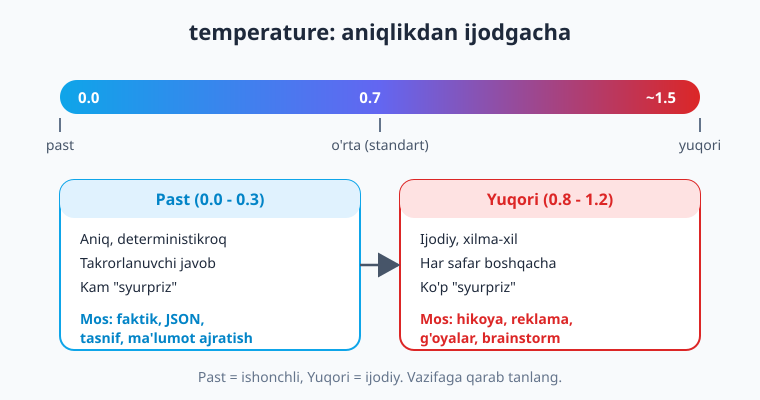
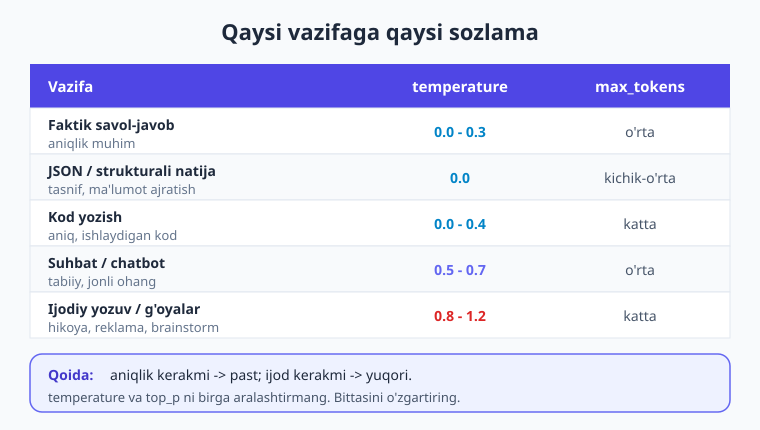
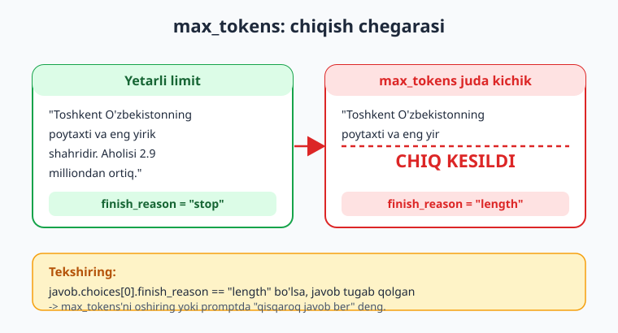

# 06 — Generatsiya parametrlari

[⬅️ Oldingi: 05 — Prompt muhandisligi](./05-prompt-muhandisligi.md) · [🏠 Kitob boshi](./README.md) · [Keyingi: 07 — Streaming: token-token javob ➡️](./07-streaming.md)

> **Bu bobda:** modelning javobini **boshqaradigan sozlamalar** — generatsiya parametrlari bilan tanishamiz. `temperature` (aniqlikdan ijodgacha), `top_p` (nucleus sampling), `max_tokens` (chiqishni cheklash va tugab qolish — truncation), `stop` ketma-ketliklari, `seed` (takrorlanuvchi natija), `frequency_penalty`/`presence_penalty` (takrorni kamaytirish) — har birini sodda tilda o'rganamiz. Qaysi vazifaga qaysi sozlama mosligini ko'ramiz; muhim provayder farqlarini (Claude'da `temperature` ishlatilmasligi, Gemini'da `config` orqali) bilib olamiz; va oxirida **bir xil promptni har xil temperature bilan** ishlatib, natijaning qanday o'zgarishini o'z ko'zimiz bilan ko'ramiz.

---

## Muammodan boshlaymiz: bir xil prompt — har xil ehtiyoj

5-bobda yaxshi prompt yozishni o'rgandik. Lekin bitta prompt har doim bitta "uslub"da javob bermaydi. O'ylab ko'ring:

- **Bank ilovasi** uchun "Mijozning sharhini ijobiy yoki salbiyga ajrat" deganda — javob **har safar bir xil va aniq** bo'lsin. "Ijobiy" deganini bugun ham, ertaga ham "Ijobiy" desin.
- **Marketing ilovasi** uchun "Yangi muzqaymoq uchun 5 ta reklama shiori o'ylab top" deganda — javob **har safar boshqacha, ijodiy** bo'lsin. Bir xil bo'lsa, foydasi yo'q.

Bir xil model, bir xil prompt — lekin ikki butunlay qarama-qarshi ehtiyoj. Mana shu yerda **generatsiya parametrlari** yordamga keladi. Ular modelga *qanday* javob berishni — qanchalik "ehtiyotkor" yoki "jasur" bo'lishni — aytadi.

> **Hayotiy o'xshatish.** Prompt — bu **buyurtma** ("menga osh kerak"). Generatsiya parametrlari esa — **oshpazga ko'rsatma**: "achchiqroq qil", "tezroq ber", "porsiyani kichikroq qil". Bir xil taom (prompt), lekin tayyorlash uslubini siz sozlaysiz.

!!! note "Parametr qayerga yoziladi?"
    Generatsiya parametrlari `create(...)` chaqiruviga **qo'shimcha argument** sifatida yoziladi — `model` va `messages` yonida. Masalan: `client.chat.completions.create(model=..., messages=..., temperature=0.2, max_tokens=300)`. Hech bir parametr **majburiy emas** (Claude'dagi `max_tokens`dan tashqari) — yozmasangiz, provayderning standart qiymati ishlaydi.

---

## `temperature` — aniqlikdan ijodgacha

Eng muhim va eng ko'p ishlatiladigan parametr — `temperature` ("harorat"). U modelning javob tanlashdagi **tasodifiylik darajasini** boshqaradi.

Esda tutsangiz, model har qadamda "keyingi token" uchun ehtimolliklar ro'yxatini hisoblaydi (1-bob). `temperature` shu ro'yxatdan qanday tanlashni belgilaydi:

- **Past `temperature` (0.0 ga yaqin)** — model deyarli har doim **eng ehtimolli** tokenni tanlaydi. Natija: **aniqroq, deterministikroq, takrorlanuvchi**. Kam "syurpriz".
- **Yuqori `temperature` (1.0 va undan yuqori)** — model kamroq ehtimolli tokenlarga ham imkon beradi. Natija: **ijodiy, xilma-xil, kutilmagan**. Har safar boshqacha.



> **Hayotiy o'xshatish.** `temperature` — **noziklik tugmasi**. Past — model "ehtiyotkor, qoidaga amal qiladigan" xodim kabi: har doim eng xavfsiz, kutilgan javobni beradi. Yuqori — "ijodkor, tavakkalchi" xodim: ba'zan ajoyib, ba'zan g'alati g'oyalar chiqaradi. Vazifaga qarab qaysi "xodim" kerakligini siz tanlaysiz.

### Qaysi vazifaga qaysi qiymat?

Oddiy qoida: **aniqlik kerakmi — pasaytiring; ijod kerakmi — ko'taring.**

| Vazifa | Tavsiya `temperature` |
|---|---|
| Faktik savol-javob, tasnif | `0.0 – 0.3` |
| JSON / strukturali natija | `0.0` |
| Kod yozish | `0.0 – 0.4` |
| Suhbat / chatbot | `0.5 – 0.7` |
| Ijodiy yozuv, g'oyalar | `0.8 – 1.2` |

Quyidagi jadval bu moslikni `max_tokens` tavsiyasi bilan birga, bir qarashda ko'rsatadi — ilova qurayotganda uni "shpargalka" sifatida ishlatishingiz mumkin:



```python
import os
from dotenv import load_dotenv
from openai import OpenAI

load_dotenv()
client = OpenAI()
MODEL = "gpt-5.4-mini"   # Eslatma: model nomlari o'zgaradi — provayder ro'yxatini tekshiring.

# Faktik vazifa — past temperature (aniq, barqaror)
javob = client.chat.completions.create(
    model=MODEL,
    messages=[{"role": "user", "content": "O'zbekiston poytaxti qaysi shahar?"}],
    temperature=0.0,        # eng aniq, deyarli har doim bir xil javob
)
print(javob.choices[0].message.content)
```

!!! tip "Shubhalansangiz — pasaytiring"
    Aksariyat ilova vazifalari (savol-javob, tasnif, ma'lumot ajratish, kod) **aniqlikni** xohlaydi. Shuning uchun agar qaysi qiymatni qo'yishni bilmasangiz, **past** (`0` yoki `0.2`) dan boshlang. Faqat javob "juda quruq, bir xil" tuyulsa — asta-sekin ko'taring.

---

## `top_p` — nucleus sampling (qisqacha)

`top_p` ham tasodifiylikni boshqaradi, lekin boshqacha usulda. Buni **nucleus sampling** deyiladi.

Model keyingi token uchun ehtimolliklarni hisoblaganda, `top_p` modelga aytadi: "ehtimolliklarni kattadan kichikga tartibla va yig'indisi `p` ga yetguncha eng yuqorilarini ol; faqat shu **kichik to'plamdan** tanla." Masalan, `top_p=0.1` — model faqat eng ehtimolli tokenlardan (jami 10% ehtimollikni qoplaydiganlaridan) tanlaydi, ya'ni javob **fokuslangan**. `top_p=1.0` — barcha tokenlar o'yinda.

> **Hayotiy o'xshatish.** `top_p` — model tanlaydigan **so'zlar savatchasi** kattaligini belgilaydi. Kichik savatcha (past `top_p`) — faqat eng yaxshi nomzodlar; katta savatcha (yuqori `top_p`) — kamdan-kam ishlatiladigan so'zlar ham kiradi.

!!! warning "temperature va top_p ni BIRGA aralashtirmang"
    Ikkalasi ham bir xil narsani — tasodifiylikni — boshqaradi, faqat har xil usulda. Ularni **bir vaqtda** o'zgartirish natijani chalkash va oldindan aytib bo'lmaydigan qiladi. **Bittasini tanlang** (ko'pchilik faqat `temperature` ishlatadi) va ikkinchisini standart holatida qoldiring. Boshlovchiga maslahat: faqat `temperature` bilan ishlang, `top_p`ga tegmang.

---

## `max_tokens` — chiqishni cheklash va tugab qolish

`max_tokens` (ba'zi yangi modellarda `max_completion_tokens`) — model **chiqishda** ishlab chiqaradigan maksimal token sonini cheklaydi. Bu **kirish**ni emas, faqat **javob**ning uzunligini belgilaydi.

Nega kerak?

1. **Xarajat nazorati.** Chiqish tokenlari uchun to'laysiz. Limit — kutilmagan uzun (qimmat) javobning oldini oladi.
2. **Uzunlikni boshqarish.** "Qisqa javob kerak" bo'lsa, limit qo'yasiz.
3. **Tezlik.** Kamroq token = tezroq javob.

Lekin bu yerda **muhim tuzoq** bor: limit **juda kichik** bo'lsa, model javobni tugatishga ulgurmasdan **o'rtada kesib qo'yiladi** (bu **truncation** deyiladi).



Javob tugab qolganini qanday bilamiz? **`finish_reason`** maydonidan:

```python
javob = client.chat.completions.create(
    model=MODEL,
    messages=[{"role": "user", "content": "O'zbekiston tarixini batafsil yozib ber."}],
    max_tokens=20,          # ataylab juda kichik — javob kesiladi
)

print(javob.choices[0].message.content)       # yarmida uzilgan matn
print(javob.choices[0].finish_reason)         # "length" — limitga yetgan
```

`finish_reason` ning asosiy qiymatlari:

- **`"stop"`** — model javobni **tabiiy ravishda tugatdi**. Hammasi joyida.
- **`"length"`** — javob **`max_tokens` limitiga urilib kesildi**. Limitni oshiring yoki promptda "qisqaroq javob ber" deng.
- **`"tool_calls"`** — model funksiya (tool) chaqirmoqchi (10-bobda ko'ramiz).

!!! warning "Javob tugab qolishini tekshiring"
    Ilovada `finish_reason`ni doim tekshiring. Agar `"length"` chiqsa, foydalanuvchiga yarim javob ko'rsatasiz — bu xato. Limitni oshiring, yoki javob uzun bo'lishi mumkinligini hisobga olib `max_tokens`ni saxiyroq qo'ying. Ayniqsa JSON natijada (9-bob) yarim JSON — buzilgan JSON degani.

!!! note "max_tokens va kontekst oynasi farqi"
    Adashtirmang: **kontekst oynasi** (1-bob) — kirish + chiqish uchun **umumiy** chegara (modelga xos, masalan 128 000). `max_tokens` esa — siz qo'yadigan **faqat chiqish** chegarasi. `max_tokens` har doim kontekst oynasidan kichik bo'lishi kerak.

---

## `stop` — to'xtatuvchi ketma-ketliklar

`stop` parametri modelga aytadi: "agar shu **matnni** ishlab chiqarsang, **darhol to'xta**". Berilgan satr javobda paydo bo'lishi bilanoq generatsiya tugaydi (va o'sha `stop` satrining o'zi javobga **kirmaydi**).

Bu qachon foydali? Masalan, model "savol-javob" formatida ishlayotganda, faqat bitta javob olib, keyingi savolni o'zi to'qib chiqarishini **to'xtatish** uchun:

```python
javob = client.chat.completions.create(
    model=MODEL,
    messages=[{"role": "user", "content": "Bir nechta dasturlash tilini sanab ber, har birini yangi qatorda."}],
    stop=["\n\n", "Xulosa"],   # ro'yxat: bularning birortasi chiqsa — to'xta
)
print(javob.choices[0].message.content)
```

`stop` bitta satr yoki satrlar ro'yxati (odatda 4 tagacha) bo'lishi mumkin. Bularning biri ham chiqsa — model to'xtaydi (`finish_reason` bu holda `"stop"` bo'ladi).

> **Hayotiy o'xshatish.** `stop` — model uchun **"shu yerga yetganda gapni bo'l"** belgisi. Xuddi suhbatda "menga shu yetarli, rahmat" deganingizda suhbatdosh to'xtagani kabi.

---

## `seed` — takrorlanuvchi natija (best-effort)

Yuqori `temperature`da javob har safar boshqacha bo'ladi — bu test qilishni qiyinlashtiradi. `seed` (urug') shunga yordam beradi: **bir xil `seed` + bir xil so'rov** berilsa, model **iloji boricha bir xil** javob qaytarishga harakat qiladi.

```python
javob = client.chat.completions.create(
    model=MODEL,
    messages=[{"role": "user", "content": "Tasodifiy ajoyib startap g'oyasi ayt."}],
    temperature=0.9,
    seed=42,        # bir xil seed -> (asosan) bir xil javob
)
print(javob.choices[0].message.content)
```

!!! warning "seed — kafolat emas, best-effort"
    `seed` natijani **takrorlanishiga harakat qiladi**, lekin **100% kafolat bermaydi**. Provayder modelni yangilashi, infratuzilmani o'zgartirishi mumkin — shunda bir xil `seed` ham boshqa javob berishi mumkin. `seed` asosan **test va debug** uchun foydali (natijani solishtirish), production'da unga ishonib qolmang. Ba'zi provayderlar `system_fingerprint` maydonini ham qaytaradi — u o'zgargan bo'lsa, takrorlanish kafolatlanmaydi.

---

## `frequency_penalty` va `presence_penalty` — takrorni kamaytirish

Ba'zan model bir xil so'z yoki iborani qayta-qayta takrorlaydi ("...juda yaxshi... juda yaxshi... juda yaxshi..."). Bu ikki parametr shunga qarshi (qiymat odatda `0.0` dan `2.0` gacha):

- **`frequency_penalty`** — token **qancha ko'p** ishlatilgan bo'lsa, uni qayta ishlatishni shuncha **kamaytiradi**. Takrorlanuvchi so'zlarni kamaytiradi.
- **`presence_penalty`** — token **bir marta** paydo bo'lgan bo'lsa ham, uni qayta ishlatishga to'sqinlik qiladi. Modelni **yangi mavzularga** o'tishga undaydi.

```python
javob = client.chat.completions.create(
    model=MODEL,
    messages=[{"role": "user", "content": "Sayohat haqida qisqa, jonli matn yoz."}],
    frequency_penalty=0.5,   # so'z takrorini kamaytir
    presence_penalty=0.3,    # yangi g'oyalarga o'tishni rag'batlantir
)
print(javob.choices[0].message.content)
```

!!! tip "Avval temperature, keyin bular"
    Bu ikki parametr — "nozik sozlash" uchun. Aksariyat holatda ularga umuman tegmaysiz. Faqat javobda **aniq takror** sezsangiz, kichik qiymat (`0.3 – 0.6`) bilan boshlab ko'ring. Eslatma: bularning hammasi ham har bir provayderda mavjud emas.

---

## Provayder farqlari (juda muhim)

Parametr nomlari va xulqi provayderga qarab **farq qiladi**. Eng muhim ikki farqni alohida ta'kidlaymiz.

### Claude (Anthropic): zamonaviy modellarda `temperature` ishlatilmaydi

Anthropic'ning yangi modellari (`claude-opus-4-8`, `claude-sonnet-4-6`) **native SDK** ishlatadi va ularda `temperature` (hamda `top_p`) **kerak emas** — `opus` modeliga uni berish **xato** ham berishi mumkin. Faqat asosiy parametrlarni ishlating, va `max_tokens` bu yerda **majburiy**:

```python
import anthropic
client = anthropic.Anthropic()    # ANTHROPIC_API_KEY .env dan

resp = client.messages.create(
    model="claude-opus-4-8",      # yoki claude-sonnet-4-6, claude-haiku-4-5
    max_tokens=1024,              # SHART (Claude'da majburiy)
    system="Sen foydali yordamchisan.",   # system ALOHIDA parametr
    messages=[{"role": "user", "content": "O'zbekiston poytaxti qaysi shahar?"}],
    # temperature YO'Q — bu modellarda ishlatilmaydi
)
print(resp.content[0].text)       # content — bloklar ro'yxati
```

!!! note "Claude'ning farqlari"
    Claude OpenAI-mos **emas**: `max_tokens` majburiy, `system` alohida parametr (messages ichida emas), javob `resp.content[0].text`da. Va eng muhimi — bu bobdagi `temperature`/`top_p` zamonaviy Claude modellarida **qo'llanilmaydi**. Provayder hujjatini doim tekshiring.

### Gemini (Google): parametrlar `config` orqali

Google'ning native SDK'sida (`google-genai`) parametrlar to'g'ridan-to'g'ri emas, **`config`** obyekti ichida beriladi:

```python
from google import genai
from google.genai import types

client = genai.Client()    # GEMINI_API_KEY (yoki GOOGLE_API_KEY)

resp = client.models.generate_content(
    model="gemini-2.5-flash",
    contents="Tasodifiy startap g'oyasi ayt.",
    config=types.GenerateContentConfig(
        temperature=0.9,
        max_output_tokens=200,   # Gemini'da "max_tokens" emas, "max_output_tokens"
    ),
)
print(resp.text)
```

E'tibor bering: Gemini'da `max_tokens` emas, **`max_output_tokens`**. Har provayder o'z nom va joylashuvini ishlatadi — shu sabab parametrlarni har doim **o'sha provayder hujjatidan** tasdiqlang.

---

## Amaliy: bir xil promptni har xil temperature bilan solishtirish

Endi eng o'rgatuvchi tajriba: **bitta promptni** turli `temperature` bilan yuborib, javob qanday o'zgarishini o'z ko'zimiz bilan ko'ramiz. Bu — `temperature`ni "his qilishning" eng yaxshi yo'li.

```python
import os
from dotenv import load_dotenv
from openai import OpenAI

load_dotenv()
client = OpenAI()
MODEL = "gpt-5.4-mini"   # nomlar o'zgaradi — provayder ro'yxatini tekshiring

PROMPT = "Yangi qahvaxona uchun bitta qisqa, jozibali reklama shiori o'ylab top."

# Har xil temperature qiymatlarini sinab ko'ramiz
for t in [0.0, 0.7, 1.2]:
    print(f"\n===== temperature = {t} =====")
    # Har bir qiymatda 2 marta chaqiramiz — xilma-xillikni ko'rish uchun
    for urinish in (1, 2):
        javob = client.chat.completions.create(
            model=MODEL,
            messages=[{"role": "user", "content": PROMPT}],
            temperature=t,
            max_tokens=40,   # qisqa shior — limit kichik
        )
        matn = javob.choices[0].message.content.strip()
        print(f"  {urinish}-urinish: {matn}")
```

Natijada quyidagicha naqshni ko'rasiz:

- **`temperature = 0.0`** — ikki urinish ham **deyarli bir xil** (yoki aynan bir xil) shior. Model eng "xavfsiz" variantni tanlaydi.
- **`temperature = 0.7`** — ikki urinish **biroz farq qiladi**, lekin ikkalasi ham mantiqli. Yaxshi balans.
- **`temperature = 1.2`** — ikki urinish **butunlay boshqacha**, ijodiy, ba'zan g'alati. Ko'p variant kerak bo'lsa — ajoyib; aniqlik kerak bo'lsa — xavfli.

> **Hayotiy o'xshatish.** Bu tajriba — bir xil savolni uch xil odamga berishga o'xshaydi: ehtiyotkor buxgalter (0.0) har doim bir xil javob beradi; muvozanatli xodim (0.7) ozgina o'zgaradi; ijodkor rassom (1.2) har safar kutilmagan narsa chiqaradi.

!!! tip "O'zingiz o'zgartirib ko'ring"
    `PROMPT`ni faktik savolga ("Suvning qaynash harorati necha gradus?") almashtiring va xuddi shu tajribani takrorlang. Faktik savolda yuqori `temperature` ham odatda **bir xil to'g'ri** javob beradi — chunki to'g'ri javob bitta. Bu sizga "qachon `temperature` muhim, qachon emas"ni ko'rsatadi: ijodiy vazifada katta farq, faktik vazifada kichik.

---

## Xulosa

- **Generatsiya parametrlari** — modelga *qanday* javob berishni aytadi; ular `create(...)` ga qo'shimcha argument bo'lib yoziladi. Claude'dagi `max_tokens`dan tashqari hammasi ixtiyoriy.
- **`temperature`** — eng muhim parametr: **past** (`0–0.3`) = aniq, deterministikroq, takrorlanuvchi (faktik/tasnif/JSON/kod uchun); **yuqori** (`0.8+`) = ijodiy, xilma-xil (hikoya/g'oyalar uchun). Shubhalansangiz — pasaytiring.
- **`top_p`** (nucleus sampling) ham tasodifiylikni boshqaradi. **`temperature` bilan birga aralashtirmang** — bittasini tanlang (odatda `temperature`).
- **`max_tokens`** (yoki `max_completion_tokens`) faqat **chiqish** uzunligini cheklaydi. Juda kichik bo'lsa javob **kesiladi (truncation)** — buni **`finish_reason == "length"`** orqali tekshiring; tabiiy tugash `"stop"`.
- **`stop`** — berilgan satr chiqishi bilan generatsiyani darhol to'xtatadi (satr javobga kirmaydi).
- **`seed`** — bir xil so'rovda takrorlanuvchi natijaga **harakat qiladi**, lekin **kafolat emas** (best-effort; test/debug uchun foydali).
- **`frequency_penalty` / `presence_penalty`** — takrorni kamaytiradi va yangi mavzularga undaydi; nozik sozlash uchun, kamdan-kam kerak.
- **Provayder farqi muhim:** zamonaviy **Claude** (`claude-opus-4-8`/`sonnet-4-6`) da `temperature` **ishlatilmaydi** va `max_tokens` majburiy; **Gemini**'da parametrlar **`config`** orqali (`max_output_tokens`). Har doim provayder hujjatini tekshiring.

## Amaliy mashqlar

1. **(Oson)** Faktik savol (masalan, "O'zbekiston bayrog'ida nechta rang bor?") ni `temperature=0.0` bilan yuboring va kodni 3 marta ishga tushiring. Javoblar bir xilmi? Endi `temperature=1.2` bilan takrorlang — farqni kuzating.

2. **(Oson)** Bir xil ijodiy promptni (masalan, "Pishloq haqida bitta kulgili she'r yoz") `temperature=0.2` va `temperature=1.0` bilan yuborib, natijalarni yonma-yon solishtiring. Qaysi biri xilma-xilroq?

3. **(O'rtacha)** `max_tokens=15` qo'yib, modeldan uzun javob so'rang. `javob.choices[0].finish_reason` ni chop eting — nima chiqdi? Endi `max_tokens`ni 300 ga oshiring va `finish_reason` qanday o'zgarganini ko'ring.

4. **(O'rtacha)** Bobdagi "har xil temperature solishtirish" kodini oling va unga `stop=["\n"]` qo'shing. Javob qanday o'zgaradi? Keyin `seed=123` qo'shib, `temperature=0.9` da ikki marta ishga tushiring — natija qanchalik o'xshash?

5. **(Qiyin)** Bitta funksiya yozing: `javob_ol(prompt, vazifa_turi)`. `vazifa_turi` `"faktik"`, `"kod"` yoki `"ijodiy"` bo'lsin va funksiya shunga mos `temperature` (mos ravishda `0.0`, `0.2`, `1.0`) ni avtomatik tanlasin. So'ng `finish_reason`ni tekshirib, agar `"length"` bo'lsa "javob tugab qoldi, max_tokens'ni oshiring" deb ogohlantirsin.

---

[⬅️ Oldingi: 05 — Prompt muhandisligi](./05-prompt-muhandisligi.md) · [🏠 Kitob boshi](./README.md) · [Keyingi: 07 — Streaming: token-token javob ➡️](./07-streaming.md)
