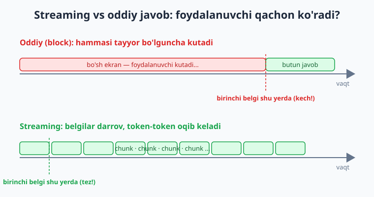
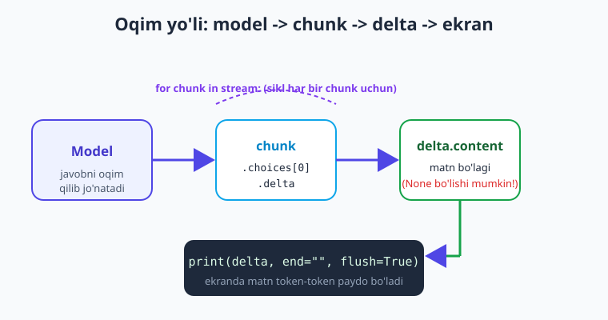
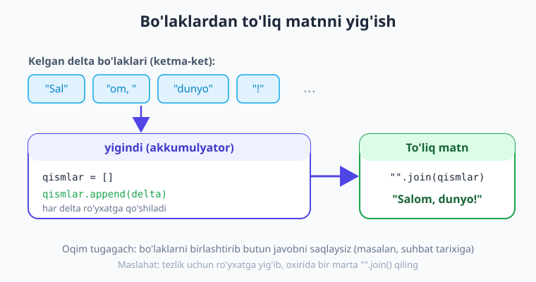

# 07 — Streaming: token-token javob

[⬅️ Oldingi: 06 — Generatsiya parametrlari](./06-parametrlar.md) · [🏠 Kitob boshi](./README.md) · [Keyingi: 08 — Suhbat xotirasi va kontekst boshqaruvi ➡️](./08-suhbat-xotira-kontekst.md)

> **Bu bobda:** nega ChatGPT'dagidek javob **token-token** paydo bo'lishini (streaming) o'rganamiz; `stream=True` bilan oqimni qanday yoqishni, har bir `chunk`dan `delta.content`ni qanday o'qishni (va nega uni `None`ga tekshirish kerakligini) ko'ramiz; oqimni real-vaqtda ekranga chiqarishni va bo'laklardan **to'liq matnni yig'ib olishni** o'rganamiz; streamingda **token sanash** (`stream_options`), **xato boshqaruvi** (oqim uzilishi) bilan tanishamiz; Claude va Gemini'da streamingni qisqa ko'ramiz; va nihoyat — **qachon streaming kerak emasligini** aniqlaymiz.

---

## Muammodan boshlaymiz: uzun javobni kutish azob

6-bobgacha bizning kodimiz so'rov yuborar, keyin **butun javob tayyor bo'lguncha** kutar, so'ng matnni bir martada chop etardi:

```python
javob = client.chat.completions.create(model=MODEL, messages=msgs)
print(javob.choices[0].message.content)   # hammasi birdan chiqadi
```

Qisqa javob uchun bu yaxshi. Lekin modeldan **uzun** javob (masalan, 300 so'zlik tushuntirish yoki kod) so'rasangiz, foydalanuvchi **5-10 soniya** bo'sh ekranga qarab o'tiradi — go'yo dastur osilib qolgandek. Bu yomon tajriba (UX).

ChatGPT'ni eslang: u javobni **so'z-so'z, jonli** yozadi. Siz birinchi belgini deyarli darrov ko'rasiz, qolgani esa oqib keladi. Aynan shu — **streaming** (oqimli javob). Model javobni tayyorlayotgan paytda, har bir **token** tayyor bo'lishi bilanoq sizga jo'natadi; siz uni darrov ekranga chiqarasiz.



> **Hayotiy o'xshatish.** Oddiy rejim — taomni oshxonada **to'liq** pishirib, bitta katta laganda olib chiqish: och mehmon stolda kutib o'tiradi. Streaming — taomni **bo'lak-bo'lak** olib chiqish: mehmon birinchi luqmani darrov yeydi, qolgani esa kelaveradi. Umumiy vaqt deyarli bir xil, lekin kutish hissi tamomila boshqacha.

!!! note "Streaming javobni tezlashtirmaydi"
    Muhim nuance: streaming modelni **tezroq** ishlatmaydi — umumiy generatsiya vaqti deyarli bir xil. U faqat **birinchi belgigacha kutish vaqtini** (TTFT — time to first token) keskin kamaytiradi va kutishni "to'ldiradi". Bu — **idrok etilgan tezlik**: foydalanuvchiga dastur ancha jonliroq tuyuladi.

---

## Streamingni yoqish: `stream=True`

Streaming uchun bitta o'zgartirish kifoya — `create(...)` chaqiruviga `stream=True` qo'shasiz. Endi javob **bitta obyekt** emas, balki **bo'laklar (chunk) oqimi** bo'ladi — ustidan `for` bilan aylanasiz:

```python
import os
from dotenv import load_dotenv
from openai import OpenAI

load_dotenv()
client = OpenAI()

# Model nomi o'zgaradi — provayder ro'yxatini tekshiring.
MODEL = "gpt-5.4-mini"

stream = client.chat.completions.create(
    model=MODEL,
    messages=[{"role": "user", "content": "Streaming nima ekanini 3 jumlada tushuntir."}],
    stream=True,            # <-- yagona o'zgartirish: oqimni yoqadi
)

for chunk in stream:
    delta = chunk.choices[0].delta.content   # shu bo'lakdagi yangi matn
    if delta:                                # delta None bo'lishi mumkin — tekshir!
        print(delta, end="", flush=True)
print()   # oxirida yangi qator
```

Ishga tushirsangiz, matn ekranda **jonli, token-token** paydo bo'ladi.

!!! warning "`delta.content` None bo'lishi mumkin — doim tekshiring"
    Oqimning ba'zi bo'laklarida `delta.content` **`None`** bo'ladi (masalan, eng birinchi bo'lakda faqat `role="assistant"` keladi, oxirgi bo'lakda esa `finish_reason` keladi-yu, matn yo'q). Agar `None`ni tekshirmasangiz, `print(None, ...)` ekranga `None` deb yozadi yoki `"".join()`da `TypeError` chiqadi. Shuning uchun **doim `if delta:`** yozing.

---

## Oqim qanday ishlaydi: chunk -> delta -> ekran

Streaming javobning ichida nima sodir bo'lishini ko'rib chiqaylik. Model javobni generatsiya qilar ekan, uni mayda **bo'laklarga (chunk)** bo'lib jo'natadi. Har bir chunk — kichik obyekt; undagi **yangi** matn `chunk.choices[0].delta.content`da bo'ladi.



E'tibor bering: oddiy javobda matn `message.content`da edi (08-bobgacha tanish), streamingda esa har bo'lakda `delta.content`da — ya'ni **"farq" (delta)**, butun matn emas. Har bir chunk faqat oldingisidan keyingi **yangi** belgilarni olib keladi.

> **Hayotiy o'xshatish.** `delta` — bu pochtachi har safar olib keladigan **bitta varaq**, butun kitob emas. Siz varaqlarni birin-ketin o'qiysiz (ekranga chiqarasiz) yoki papkaga yig'ib borasiz (to'liq matn uchun). Pochtachi ba'zan bo'sh konvert ham olib kelishi mumkin (`delta is None`) — uni shunchaki tashlab yuborasiz.

!!! tip "`flush=True` nega kerak?"
    Python `print` natijani odatda **buferga** yig'adi va keyin chiqaradi — natijada matn jonli emas, "sakrab-sakrab" ko'rinishi mumkin. `flush=True` har bir bo'lakni **darrov** ekranga yozishga majbur qiladi. `end=""` esa har bo'lakdan keyin yangi qator qo'ymaslik uchun (aks holda har token alohida qatorda chiqadi).

---

## To'liq matnni yig'ib olish

Ko'pincha matnni faqat ekranga chiqarish kifoya emas — uni **saqlash** ham kerak: suhbat tarixiga qo'shish (08-bob), bazaga yozish yoki keyin qayta ishlash. Buning uchun kelgan bo'laklarni **yig'ib borasiz**.



```python
qismlar = []   # bo'laklarni shu ro'yxatga yig'amiz

stream = client.chat.completions.create(
    model=MODEL,
    messages=[{"role": "user", "content": "Python'da list comprehension nima? Misol bilan."}],
    stream=True,
)

for chunk in stream:
    delta = chunk.choices[0].delta.content
    if delta:
        print(delta, end="", flush=True)   # jonli ko'rsatamiz
        qismlar.append(delta)              # va parallel yig'amiz
print()

toliq_javob = "".join(qismlar)   # bo'laklarni birlashtiramiz
print(f"\nJami uzunlik: {len(toliq_javob)} belgi")
```

!!! tip "Nega ro'yxat + join, satr `+=` emas?"
    `matn += delta` ham ishlaydi, lekin Python'da satrlar **o'zgarmas** (immutable) — har `+=` yangi satr yaratadi. Uzun javob va minglab bo'lakda bu sekin. **Ro'yxatga `append`** qilib, oxirida bir marta `"".join()` qilish ancha tezroq va toza usul.

Bu naqsh juda foydali: bir vaqtning o'zida foydalanuvchiga **jonli** ko'rsatasiz **va** to'liq matnni **saqlaysiz**.

---

## Streamingda token sanash (`usage`)

22-bobda token va xarajatni o'rganamiz, lekin bir nozik joy aynan streamingga tegishli. Oddiy javobda token sarfi `javob.usage`da bo'lardi. **Streamingda** esa har bir chunk faqat matn bo'lagini olib keladi — `usage` standartda **kelmaydi**.

OpenAI-mos provayderlarda buni `stream_options={"include_usage": True}` bilan so'raysiz. Shunda **eng oxirgi** chunk maxsus bo'lak bo'lib keladi: unda `choices` bo'sh (matn yo'q), lekin `usage` to'ldirilgan bo'ladi:

```python
stream = client.chat.completions.create(
    model=MODEL,
    messages=[{"role": "user", "content": "Salom dunyo dasturini yoz."}],
    stream=True,
    stream_options={"include_usage": True},   # oxirgi chunkda usage'ni so'raymiz
)

usage = None
for chunk in stream:
    # Oxirgi chunkda choices bo'sh bo'lishi mumkin — avval tekshiramiz
    if chunk.choices:
        delta = chunk.choices[0].delta.content
        if delta:
            print(delta, end="", flush=True)
    if chunk.usage:                  # faqat oxirgi chunkda to'ladi
        usage = chunk.usage
print()

if usage:
    print(f"Kirish: {usage.prompt_tokens}, chiqish: {usage.completion_tokens}, "
          f"jami: {usage.total_tokens} token")
```

!!! warning "Provayderlarda farq bor"
    `stream_options={"include_usage": True}` — OpenAI va ko'p OpenAI-mos provayderlarda ishlaydi, lekin **hammasi** emas (ba'zi mos provayderlar uni e'tiborsiz qoldiradi, ya'ni `usage` baribir kelmaydi). Agar `usage` kerak bo'lsa-yu, provayderingiz streamingda bermasa: yo streamingsiz qo'shimcha so'rov yuborasiz, yoki tokenni **o'zingiz sanaysiz** (`tiktoken` bilan — 22-bob). `chunk.usage` borligini doim tekshiring.

---

## Streamingda xato boshqaruvi (oqim uzilishi)

Oddiy so'rovda xato **darrov**, `create(...)` chaqiruvida chiqadi. Streamingda esa o'ziga xos xavf bor: so'rov muvaffaqiyatli boshlanib, **oqim o'rtasida** uzilishi mumkin (tarmoq uzildi, server xatosi, vaqt tugadi). Shuning uchun `for` siklini ham himoyaga olish kerak:

```python
import openai

qismlar = []
try:
    stream = client.chat.completions.create(
        model=MODEL,
        messages=[{"role": "user", "content": "Uzun bir hikoya yoz."}],
        stream=True,
    )
    for chunk in stream:
        delta = chunk.choices[0].delta.content
        if delta:
            print(delta, end="", flush=True)
            qismlar.append(delta)
    print()
except openai.APIError as e:
    # Oqim o'rtasida uzilishi mumkin — shu paytgacha yig'ilganini saqlab qolamiz
    print(f"\n[Oqim uzildi: {e}]")
finally:
    qisman = "".join(qismlar)
    if qisman:
        print(f"\n[Shu paytgacha {len(qisman)} belgi olindi]")
```

> **Hayotiy o'xshatish.** Streaming — jonli efir kabi. Oddiy so'rov esa — yozib olingan video: u to'liq keladi yoki umuman kelmaydi. Jonli efirda esa aloqa **o'rtada** uzilishi mumkin — shuning uchun "shu paytgacha eshitganingizni" eslab qolish (yig'ilgan `qismlar`) muhim.

!!! note "Streaming javobini bekor qilish"
    Foydalanuvchi "to'xtat" tugmasini bossa, oqimni **erta to'xtatish** mumkin — `for` siklidan `break` bilan chiqasiz. Bu telegram-bot yoki veb-ilovada foydali: foydalanuvchi yetarlicha o'qigach, qolgan tokenlar uchun pul sarflamaysiz. (Aniq mexanizm provayderga bog'liq, lekin `break` — eng oddiy yo'l.)

---

## Claude va Gemini'da streaming

Streaming faqat OpenAI-mos API'ga xos emas — barcha asosiy provayderlarda bor, faqat sintaksis biroz farq qiladi.

**Anthropic (Claude)** — `messages.stream(...)`ni kontekst-menejer (`with`) sifatida ishlatadi va `text_stream` matn bo'laklarini beradi:

```python
import anthropic
client = anthropic.Anthropic()   # ANTHROPIC_API_KEY .env dan

with client.messages.stream(
    model="claude-haiku-4-5",     # nomlar o'zgaradi — ro'yxatni tekshiring
    max_tokens=1024,              # Claude'da SHART (majburiy)
    messages=[{"role": "user", "content": "Streamingni qisqa tushuntir."}],
) as stream:
    for matn in stream.text_stream:   # to'g'ridan-to'g'ri matn bo'laklari
        print(matn, end="", flush=True)
print()
```

Claude'ning qulayligi: `text_stream` allaqachon **faqat matn** beradi — `delta.content` ni `None`ga tekshirish shart emas, va `with` blokidan chiqishda oqim avtomatik to'g'ri yopiladi.

**Google Gemini** — `generate_content_stream(...)` ishlatadi; har chunkda `chunk.text` bo'ladi:

```python
from google import genai
client = genai.Client()   # GEMINI_API_KEY

stream = client.models.generate_content_stream(
    model="gemini-2.5-flash",   # nomlar o'zgaradi
    contents="Streamingni qisqa tushuntir.",
)
for chunk in stream:
    if chunk.text:                   # bu yerda ham bo'sh bo'lishi mumkin
        print(chunk.text, end="", flush=True)
print()
```

!!! note "Naqsh bir xil, sintaksis farq qiladi"
    Uchala holatda ham mohiyat bir xil: **oqim ustidan aylanasiz, har bo'lakdagi matnni darrov chiqarasiz**. Faqat oqimni qaytaruvchi metod (`stream=True` / `messages.stream` / `generate_content_stream`) va matn maydoni (`delta.content` / `text_stream` / `chunk.text`) boshqacha. Bitta provayderda streamingni o'rgansangiz, qolganlari oson.

---

## Qachon streaming KERAK EMAS

Streaming har joyda yaxshi degani emas. U **odam ekranga real-vaqtda qarab turgan** holatlar uchun. Quyidagilarda streaming foyda bermaydi yoki hatto **zarar** keltiradi:

- **Qisqa javob.** Javob 1-2 jumla bo'lsa, baribir darrov keladi — oqim murakkabligi behuda.
- **Batch (ommaviy) ishlov.** 10 000 ta sharhni tasniflayotgan bo'lsangiz, ularni hech kim ekranda kuzatmaydi. Oddiy so'rov soddaroq va boshqarish oson.
- **Keyin parse qilinadigan JSON.** Eng muhimi! Agar javobni **strukturali JSON** sifatida olib (09-bob), uni `json.loads` bilan parse qilmoqchi bo'lsangiz — **to'liq** matn kerak. Yarim JSON ("`{"nom": "Olma", "na`") yaroqsiz. Bunday holda butun javobni kutib olgan ma'qul.
- **Funksiya/tool natijasi.** Model qaror qilib, tool chaqirsa (10-bob), sizga to'liq, butun argumentlar (JSON) kerak — uni bo'lak-bo'lak ishlatib bo'lmaydi.

!!! tip "Oddiy qoida"
    **Odam matnni o'qiyaptimi?** Ha bo'lsa va javob uzun bo'lsa — streaming (yaxshi UX). Yo'q bo'lsa (kod parse qiladi, JSON, batch, tool) — oddiy so'rov (soddaroq, ishonchli). Shubha bo'lsa, oddiydan boshlang; streamingni keyin qo'shasiz — bu faqat bitta `stream=True`.

---

## Xulosa

- **Streaming** — javobni token-token, jonli ko'rsatish (ChatGPT'dagidek). U umumiy vaqtni qisqartirmaydi, lekin **birinchi belgigacha kutishni** keskin kamaytiradi — yaxshi UX.
- Yoqish oson: `create(...)`ga **`stream=True`** qo'shasiz; javob endi **chunk oqimi** bo'ladi, ustidan `for` bilan aylanasiz.
- Har bo'lakda yangi matn **`chunk.choices[0].delta.content`**da. U **`None` bo'lishi mumkin** — doim `if delta:` bilan tekshiring.
- Jonli chiqarish uchun **`print(delta, end="", flush=True)`** ishlating.
- To'liq matnni saqlash uchun bo'laklarni **ro'yxatga yig'ib**, oxirida **`"".join(qismlar)`** qiling (satr `+=` dan tezroq).
- Streamingda token sanash uchun **`stream_options={"include_usage": True}`** — `usage` eng oxirgi chunkda keladi (lekin barcha provayderda emas; `chunk.usage` borligini tekshiring).
- Oqim **o'rtada uzilishi** mumkin — `for` siklini `try/except`ga oling va shu paytgacha yig'ilgan matnni saqlab qoling.
- Claude (`messages.stream` + `text_stream`) va Gemini (`generate_content_stream` + `chunk.text`) ham streamingni qo'llaydi — naqsh bir xil, sintaksis farq qiladi.
- Streaming **kerak emas**: qisqa javob, batch ishlov, parse qilinadigan **JSON**, tool natijasi. Qoida: odam o'qiyaptimi va javob uzunmi — streaming; aks holda — oddiy so'rov.

## Amaliy mashqlar

1. **(Oson)** 02-bobdagi `birinchi.py` skriptini oling va unga `stream=True` qo'shing. `for` sikli bilan javobni `print(delta, end="", flush=True)` orqali jonli chiqaring. `if delta:` tekshiruvini olib tashlab, nima sodir bo'lishini ko'ring, keyin qaytaring.

2. **(Oson)** Streaming va oddiy rejimni **vaqt** bo'yicha taqqoslang: bir xil uzun savolni (masalan, "RAG nima ekanini batafsil tushuntir") ikki rejimda yuboring. `import time` bilan **birinchi belgi qachon** chiqishini o'lchang. Farqni o'z so'zingiz bilan izohlang.

3. **(O'rtacha)** Oqimni jonli chiqarib turib, bo'laklarni `qismlar` ro'yxatiga yig'ing. Oqim tugagach `"".join(qismlar)` bilan to'liq matnni oling va uning so'z sonini (`len(toliq.split())`) chop eting.

4. **(O'rtacha)** `stream_options={"include_usage": True}` qo'shing va oxirgi chunkdan `usage`ni o'qing. `if chunk.choices:` va `if chunk.usage:` tekshiruvlarini to'g'ri qo'ying. Agar provayderingiz `usage` bermasa, buni qanday aniqlaysiz va nima qilasiz — yozib oling.

5. **(Qiyin)** Streaming so'rovni `try/except openai.APIError`ga o'rang. So'ng oddiy "yozuv mashinkasi" effektini yarating: foydalanuvchidan `input()` bilan savol oling, javobni jonli oqim qilib chiqaring, oqim tugagach to'liq matnni faylga (`javob.txt`) saqlang. Oqim uzilsa, shu paytgacha yig'ilgan qismni baribir faylga yozadigan qilib `finally` blokini qo'shing.

---

[⬅️ Oldingi: 06 — Generatsiya parametrlari](./06-parametrlar.md) · [🏠 Kitob boshi](./README.md) · [Keyingi: 08 — Suhbat xotirasi va kontekst boshqaruvi ➡️](./08-suhbat-xotira-kontekst.md)
