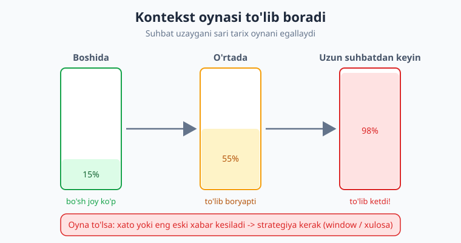

# 08 — Suhbat xotirasi va kontekst boshqaruvi

[⬅️ Oldingi: 07 — Streaming: token-token javob](./07-streaming.md) · [🏠 Kitob boshi](./README.md) · [Keyingi: 09 — Strukturali natija (JSON + Pydantic) ➡️](./09-strukturali-natija-json.md)

> **Bu bobda:** 3-bobdan tanish bo'lgan "API holatsiz (stateless)" g'oyasini chuqurlashtiramiz va undan kelib chiqadigan amaliy muammoni hal qilamiz. Avval tartibli `SuhbatBoshqaruvchi` (ConversationManager) klassini quramiz — u tarixni saqlaydi, `system` promptni doim oldinda tutadi va `yubor()` metodi orqali suhbatni boshqaradi. So'ng eng katta muammoni — **kontekst oynasi to'lib qolishi** (uzun suhbat -> ko'p token -> qimmat yoki chegaradan oshish) — uchta strategiya bilan yengamiz: **sliding window**, **xulosalash (summary)** va **muhim ma'lumotni alohida saqlash**. Token bo'yicha taxminiy kesishni, tarixni JSON faylga saqlab/yuklab sessiyani davom ettirishni va hammasini birlashtirgan **to'liq ishlaydigan misol**ni ko'ramiz.

---

## Takrorlash: xotira sizning zimmangizda

3-bobda bobning eng muhim g'oyasi shu edi: **LLM API holatsiz (stateless).** Model oldingi so'rovlarni yodida tutmaydi. Har bir `create(...)` chaqiruvi — model uchun toza varaq. "Suhbat" tuyg'usini esa biz **butun tarixni har safar qayta yuborib** hosil qilamiz.

Bu g'oyani bu yerda amaliy nuqtai nazardan qaytaramiz, chunki butun bob shunga tayanadi. Quyidagi kichik dastur 3-bobdan tanish:

```python
import os
from dotenv import load_dotenv
from openai import OpenAI

load_dotenv()
client = OpenAI()
MODEL = "gpt-5.4-mini"   # eslatma: nomlar o'zgaradi — provayder ro'yxatini tekshiring

messages = [{"role": "system", "content": "Sen do'stona o'zbek yordamchisan."}]

while True:
    savol = input("Siz: ")
    if savol.strip().lower() in ("chiqish", "exit"):
        break
    messages.append({"role": "user", "content": savol})
    javob = client.chat.completions.create(model=MODEL, messages=messages)
    matn = javob.choices[0].message.content
    messages.append({"role": "assistant", "content": matn})  # javobni ham saqlaymiz
    print("Bot:", matn)
```

Ishlaydi — lekin ikki muammosi bor. Birinchidan, kod tarqoq: `messages`ni qo'lda boshqaramiz, `system`ni eslab qolishimiz kerak. Ikkinchidan — va bu jiddiyroq — **`messages` cheksiz o'sadi.** Har navbat unga ikki yangi xabar (`user` + `assistant`) qo'shiladi va har safar **butun ro'yxat** modelga yuboriladi.


Ko'rib turganingizdek, suhbat o'sgani sayin **har navbat oldingi hamma narsani qaytadan o'z ichiga oladi.** Bu ikki narsani anglatadi: token sarfi (demak, narx) har navbatda ortadi, va bir kun kelib tarix kontekst oynasiga sig'masdan qoladi.

> **Hayotiy o'xshatish.** Har safar shifokorga borganingizda butun kasallik tarixingiz yozilgan papkani olib borasiz — shifokor sizni eslamaydi. Papka qancha qalin bo'lsa, uni o'qish shuncha uzoq va qimmat. Bir kun u shunchalik qalinlashadiki, stolga sig'maydi. O'shanda kerak: eski varaqlarni yo tashlash, yo **bir betlik xulosa** bilan almashtirish.

---

## `SuhbatBoshqaruvchi` klassi: tartibli xotira

Avvalo tarqoq kodni tartibga solamiz. Tarix, `system` prompt va `yubor()` mantig'ini bitta klassga jamlaymiz. Bu — keyingi strategiyalar uchun toza poydevor.

```python
import os
from dotenv import load_dotenv
from openai import OpenAI

load_dotenv()


class SuhbatBoshqaruvchi:
    """LLM suhbat tarixini saqlaydigan va so'rov yuboradigan boshqaruvchi."""

    def __init__(self, system_prompt: str, model: str = "gpt-5.4-mini"):
        self.client = OpenAI()
        self.model = model
        self.system = {"role": "system", "content": system_prompt}
        self.tarix: list[dict] = []   # faqat user/assistant xabarlari (system bunda yo'q)

    def _xabarlar(self) -> list[dict]:
        """system doim oldinda, keyin butun tarix — modelga shu yuboriladi."""
        return [self.system] + self.tarix

    def yubor(self, savol: str) -> str:
        # 1) Foydalanuvchi xabarini tarixga qo'shamiz
        self.tarix.append({"role": "user", "content": savol})

        # 2) system + butun tarixni yuboramiz (stateless!)
        javob = self.client.chat.completions.create(
            model=self.model,
            messages=self._xabarlar(),
        )
        matn = javob.choices[0].message.content

        # 3) Model javobini ham tarixga qo'shamiz
        self.tarix.append({"role": "assistant", "content": matn})
        return matn
```

Ishlatish endi juda toza:

```python
suhbat = SuhbatBoshqaruvchi("Sen do'stona o'zbek yordamchisan. Qisqa javob ber.")
print(suhbat.yubor("Mening ismim Olim."))
print(suhbat.yubor("Mening ismim nima edi?"))   # -> "Sizning ismingiz Olim."
```

Ikkinchi savolga model "Olim" deb javob beradi, chunki `yubor()` har gal `system + tarix`ni to'liq yuboradi. Diqqat qiling: `system`ni **tarixdan alohida** saqladik. Shunda strategiyalar tarixni qisqartirganda ham `system` hech qachon yo'qolmaydi — u doim oldinda turadi.

!!! note "Nega system'ni alohida saqlaymiz?"
    `system` — suhbatning "qonuni": modelning ohangi, tili, qoidalari. Agar uni `tarix` ichiga qo'ysak, eski xabarlarni kesganda tasodifan o'chib ketishi mumkin. Uni alohida maydonda tutib, `_xabarlar()`da har safar oldinga ulab beramiz — shunda u suhbat qancha uzun bo'lmasin saqlanadi.

---

## Muammo: kontekst oynasi to'lib qoladi

Endi `SuhbatBoshqaruvchi` ishlayapti. Lekin 50, 100, 500 navbatdan keyin nima bo'ladi? `self.tarix` shu qadar uzayadiki, ikki muammo paydo bo'ladi:

1. **Narx oshadi.** Har navbatda butun tarix yuboriladi. 100-navbatda siz 100 navbatlik suhbatning hammasini qayta yuboryapsiz — bu yuzlab, minglab kirish tokeni, har so'rovda.
2. **Chegaradan oshish.** Har modelning **kontekst oynasi** cheklangan (1-bobdan eslang). Tarix + yangi savol + javob o'sha oynaga sig'ishi kerak. Sig'masa — xato (`context_length_exceeded`).



> **Hayotiy o'xshatish.** Kontekst oynasi — stakan, tarix esa unga quyilayotgan suv. Har navbat bir oz suv qo'shadi. Stakan to'lganda quygan suvingiz toshib ketadi — ya'ni eng eski yoki eng yangi gap sig'maydi. Yechim: yo eski suvni to'kib tashlash (window), yo uni **bug'lab, zichroq qilib** kichik hajmga jamlash (xulosa).

!!! warning "Bu — production'dagi haqiqiy muammo"
    Lokal sinovda 5-10 navbat suhbat hech qachon oynani to'ldirmaydi, shuning uchun bu muammo "ko'rinmaydi". Lekin haqiqiy foydalanuvchi botingiz bilan uzoq suhbatlashganda — yoki har savolga uzun hujjat qo'shilganda (RAG, 13-bob) — oyna tez to'ladi. Xotira boshqaruvini **boshidan** o'ylab qo'yish kerak.

---

## Strategiya (a): sliding window — oxirgi N xabar

Eng oddiy yechim: **faqat oxirgi N ta xabarni saqlash**, eskilarini tashlab yuborish. Bunga **sliding window** (siljuvchi oyna) deyiladi — oyna suhbat bo'ylab siljiydi, doim oxirini "ko'radi".

Mantiq sodda: `system` doim qoladi, lekin `tarix`dan faqat oxirgi N elementni yuboramiz.

```python
class WindowBoshqaruvchi(SuhbatBoshqaruvchi):
    def __init__(self, system_prompt: str, oyna: int = 6, **kw):
        super().__init__(system_prompt, **kw)
        self.oyna = oyna   # saqlanadigan oxirgi xabarlar soni (juft son tavsiya etiladi)

    def _xabarlar(self) -> list[dict]:
        # system + tarixning faqat oxirgi N xabari
        return [self.system] + self.tarix[-self.oyna:]
```

`self.tarix[-self.oyna:]` — ro'yxatning oxirgi N elementi. Bu yerda butun tarix `self.tarix`da **saqlanib turadi** (kerak bo'lsa, diskka yozish uchun), lekin modelga faqat oxirgi qismi yuboriladi.

!!! tip "Oynani juft son qiling"
    Bir navbat = ikki xabar (`user` + `assistant`). Oynani **juft** (6, 8, 10...) qilsangiz, xabarlar to'liq juftlik bo'lib qoladi — yarim qolgan `user` yoki yetim `assistant` bilan boshlanmaydi. Bu ba'zi provayderlarda format xatosidan saqlaydi.

**Afzalligi:** juda sodda, qo'shimcha so'rov yo'q, token soni barqaror. **Kamchiligi:** oynadan tashqaridagi hammasi **butunlay unutiladi**. Agar foydalanuvchi 20 navbat oldin ismini aytgan bo'lsa va oyna 6 bo'lsa — model ismni "eslamaydi". Qisqa, kontekst muhim bo'lmagan suhbatlarga (FAQ-bot, qidiruv) ideal.

---

## Strategiya (b): xulosalash — eskini qisqartirib saqlash

Sliding window eski tafsilotni yo'qotadi. Agar suhbatning umumiy mazmunini **saqlab qolish** kerak bo'lsa, eski xabarlarni o'chirish o'rniga **LLM bilan qisqa xulosaga aylantiramiz**. So'ng o'sha xulosani tarix boshida saqlaymiz.


G'oya: tarix N dan oshganda eng eski xabarlarni olib, modeldan **"shularni qisqacha xulosala"** deb so'raymiz, natijani esa `system`dan keyingi yagona "xotira" xabariga aylantiramiz.

```python
class XulosaBoshqaruvchi(SuhbatBoshqaruvchi):
    def __init__(self, system_prompt: str, chegara: int = 8, qoldir: int = 4, **kw):
        super().__init__(system_prompt, **kw)
        self.chegara = chegara   # tarix shundan oshsa — xulosalaymiz
        self.qoldir = qoldir     # oxirgi shuncha xabarni xulosalamay qoldiramiz
        self.xulosa = ""         # to'plangan xotira xulosasi

    def _xulosala(self):
        eski = self.tarix[:-self.qoldir]            # xulosalanadigan eski qism
        matn = "\n".join(f"{m['role']}: {m['content']}" for m in eski)
        prompt = (
            "Quyidagi suhbatni keyingi javoblar uchun muhim faktlarni saqlab, "
            "qisqa o'zbekcha xulosa qil. Avvalgi xulosa ham hisobga olinsin.\n\n"
            f"Avvalgi xulosa: {self.xulosa or '(yoq)'}\n\nSuhbat:\n{matn}"
        )
        javob = self.client.chat.completions.create(
            model=self.model,
            messages=[{"role": "user", "content": prompt}],
        )
        self.xulosa = javob.choices[0].message.content
        self.tarix = self.tarix[-self.qoldir:]      # faqat oxirgi qismni qoldiramiz

    def _xabarlar(self) -> list[dict]:
        xabarlar = [self.system]
        if self.xulosa:
            xabarlar.append({"role": "system",
                             "content": f"Suhbatning shu paytgacha xulosasi: {self.xulosa}"})
        return xabarlar + self.tarix

    def yubor(self, savol: str) -> str:
        if len(self.tarix) > self.chegara:
            self._xulosala()                         # avval eskini siqamiz
        return super().yubor(savol)
```

Endi tarix `chegara`dan oshganda, eski xabarlar avtomatik bir-ikki jumlalik xulosaga "siqiladi" va modelga shu xulosa + oxirgi xabarlar yuboriladi.

> **Hayotiy o'xshatish.** Window — eski xatlaringizni shunchaki **chiqindiga tashlash**. Xulosalash esa — ularni o'qib, mazmunini bitta yopishqoq qog'ozga yozib (`"Mijoz Olim, Toshkentdan, ko'k rangni yoqtiradi"`) saqlash. Qog'oz kichik, lekin asosiy fakt yo'qolmaydi.

**Afzalligi:** uzoq kontekst saqlanadi, oyna barqaror. **Kamchiligi:** har xulosalashda **qo'shimcha LLM so'rovi** (pul va vaqt) ketadi, va xulosa baribir tafsilotni biroz yo'qotadi (xulosa — model qaytargan matn, u ham ehtimolli).

!!! tip "Aralash (gibrid) yondashuv"
    Amalda ko'pchilik ilovalar ikkalasini birlashtiradi: **eski qismni xulosalash + oxirini sof window'da saqlash** (yuqoridagi `qoldir` aynan shu). Eng eski narsa siqiladi, eng yangisi to'liq turadi — narx ham, sifat ham muvozanatda bo'ladi.

---

## Strategiya (c): muhim ma'lumotni alohida saqlash

Ba'zi faktlar suhbat davomida **hech qachon unutilmasligi** kerak: foydalanuvchi ismi, tili, afzalliklari. Bularni umumiy tarixga tashlab qo'yish xatarli — window yo xulosa ularni "yutib" yuborishi mumkin. To'g'ri yo'l — ularni **alohida, strukturali** saqlash va har so'rovga `system` orqali qo'shish.

```python
class XotiraBoshqaruvchi(SuhbatBoshqaruvchi):
    def __init__(self, system_prompt: str, oyna: int = 6, **kw):
        super().__init__(system_prompt, **kw)
        self.oyna = oyna
        self.fakt: dict[str, str] = {}    # doim eslanadigan asosiy faktlar

    def yodla(self, kalit: str, qiymat: str):
        """Muhim faktni alohida saqlaydi (masalan: ism, til)."""
        self.fakt[kalit] = qiymat

    def _xabarlar(self) -> list[dict]:
        xabarlar = [self.system]
        if self.fakt:
            satr = ", ".join(f"{k}: {v}" for k, v in self.fakt.items())
            xabarlar.append({"role": "system",
                             "content": f"Foydalanuvchi haqida eslab qol: {satr}"})
        return xabarlar + self.tarix[-self.oyna:]   # qolgan suhbat — window'da
```

```python
bot = XotiraBoshqaruvchi("Sen do'stona yordamchisan. O'zbekcha javob ber.")
bot.yodla("ism", "Olim")
bot.yodla("til", "o'zbek")
# Endi window eski xabarlarni kessa ham, "ism: Olim" har so'rovda yuboriladi.
```

Window suhbatni qisqartirib turadi, ammo `fakt` lug'atidagi narsa **doim** `system`da bo'ladi. Ilg'or ilovalarda bu faktlarni model o'zi ajratib oladi (9-bobdagi strukturali natija + tool calling, 10-bob), lekin g'oya bir xil: **"har doim kerak" ma'lumotni umumiy oqimdan ajratib saqlang.**

!!! note "Uchala strategiya — raqib emas, jamoa"
    `window` (b) tezlik beradi, `xulosa` (b) o'rta-muddatli kontekstni saqlaydi, `alohida fakt` (c) hech qachon yo'qolmasligi kerak narsani himoya qiladi. Real ilovada uchalasi birga ishlaydi: muhim fakt — alohida; o'rta tarix — xulosa; so'nggi navbatlar — to'liq window.

---

## Token bo'yicha kesish (taxminiy hisob)

Yuqorida tarixni **xabarlar soni** bo'yicha kesdik. Lekin haqiqiy chegara — **tokenlar soni**, va xabarlar uzunligi har xil (bir xabar 5 token, boshqasi 500). Aniqroq boshqarish uchun token bo'yicha kesamiz.

1-bobdan eslang: inglizchada taxminan **1 token ≈ 4 belgi**. O'zbekcha matnda token biroz ko'proq (so'zlar ko'p bo'lakka bo'linadi), shuning uchun **xavfsiz** taxmin: `1 token ≈ 3 belgi`. Bu — aniq emas, lekin "qachon kesish kerak"ni hal qilishga yetadi.

```python
def taxminiy_token(matn: str) -> int:
    """Juda taxminiy: o'zbekcha uchun xavfsiz tomonga (1 token ~ 3 belgi)."""
    return len(matn) // 3 + 1

def tarix_tokeni(xabarlar: list[dict]) -> int:
    return sum(taxminiy_token(m["content"]) for m in xabarlar)

def token_boyicha_kes(tarix: list[dict], maks_token: int) -> list[dict]:
    """Oxiridan boshlab, maks_token chegarasiga sig'guncha xabar yig'amiz."""
    natija, jami = [], 0
    for xabar in reversed(tarix):           # eng yangidan boshlaymiz
        t = taxminiy_token(xabar["content"])
        if jami + t > maks_token:
            break                           # chegaradan oshdi — to'xta
        natija.insert(0, xabar)             # boshiga qo'shamiz (tartib saqlanadi)
        jami += t
    return natija
```

Endi `_xabarlar()`da `self.tarix[-N:]` o'rniga `token_boyicha_kes(self.tarix, 1500)` ishlatsangiz, model har xil uzunlikdagi xabarlarga moslashib, doim token byudjetiga sig'adi.

!!! warning "Taxminiy hisob — kafolat emas"
    Bu `// 3` taxmini "yetarlicha yaqin" boshqaruv uchun. Aniq token sanash (provayderning haqiqiy tokenizatori bilan) va xarajatni hisoblashni **22-bobda** o'rganamiz — u yerda `tiktoken` kabi vositalar bilan haqiqiy son olamiz. Hozircha taxmin "qachon kesish"ga yetarli; haqiqiy chegaraga yaqin bormang, byudjetni ehtiyot bilan oynaning ~70% ida tuting.

---

## Tarixni diskka saqlash va yuklash (JSON)

Hozircha tarix faqat **dastur xotirasida** (RAM). Dastur yopilsa — suhbat yo'qoladi. Foydalanuvchi ertaga qaytib, suhbatni **davom ettira olishi** uchun tarixni faylga yozamiz va keyin qayta o'qiymiz. Eng oson format — **JSON**, chunki `messages` allaqachon lug'atlar ro'yxati.

```python
import json

class DavomliBoshqaruvchi(SuhbatBoshqaruvchi):
    def saqla(self, yol: str):
        with open(yol, "w", encoding="utf-8") as f:
            json.dump({"system": self.system, "tarix": self.tarix},
                      f, ensure_ascii=False, indent=2)   # ensure_ascii=False — o'zbekcha o'qiladigan bo'ladi

    def yukla(self, yol: str):
        with open(yol, "r", encoding="utf-8") as f:
            data = json.load(f)
        self.system = data["system"]
        self.tarix = data["tarix"]
```

Ishlatish — sessiyani uzib, keyin tiklash:

```python
bot = DavomliBoshqaruvchi("Sen do'stona yordamchisan. O'zbekcha javob ber.")
bot.yubor("Mening ismim Olim.")
bot.saqla("suhbat.json")          # diskka yozdik, dasturni yopsak ham bo'ladi

# --- Keyinroq, yangi ishga tushirishda ---
bot2 = DavomliBoshqaruvchi("vaqtinchalik")
bot2.yukla("suhbat.json")          # tarix qayta tiklandi
print(bot2.yubor("Mening ismim nima edi?"))   # -> "Sizning ismingiz Olim."
```

> **Hayotiy o'xshatish.** RAM — ish stolingiz: tez, lekin kechqurun uyga ketsangiz tozalanadi. JSON fayl — **shkaf**: suhbat papkasini shkafga qo'yib ketasiz, ertaga ochib o'sha joydan davom etasiz. Ko'p foydalanuvchili ilovada har foydalanuvchiga alohida fayl (yoki bazada alohida yozuv) — bu RAG va production boblarida (13, 26) kengayadi.

!!! tip "ensure_ascii=False'ni unutmang"
    `json.dump`da `ensure_ascii=False` qo'ymasangiz, o'zbekcha harflar `'` kabi kodlarga aylanadi — fayl o'qilmaydi (ishlaydi, lekin xunuk). `indent=2` esa faylni odam o'qiy oladigan qiladi — debug uchun qulay.

---

## Hammasi birga: to'liq ishlaydigan misol

Endi uch g'oyani — **alohida fakt + token bo'yicha kesish + diskka saqlash** — bitta tugal CLI chatbotda birlashtiramiz. Bu kod o'zicha ishga tushadi.

```python
import os, json
from dotenv import load_dotenv
from openai import OpenAI

load_dotenv()


def taxminiy_token(matn: str) -> int:
    return len(matn) // 3 + 1


class Suhbat:
    def __init__(self, system_prompt: str, model="gpt-5.4-mini", maks_token=1500):
        self.client = OpenAI()
        self.model = model                 # eslatma: model nomlari o'zgaradi — tekshiring
        self.maks_token = maks_token
        self.system = {"role": "system", "content": system_prompt}
        self.tarix: list[dict] = []
        self.fakt: dict[str, str] = {}

    def yodla(self, kalit, qiymat):
        self.fakt[kalit] = qiymat

    def _kesilgan_tarix(self):
        natija, jami = [], 0
        for xabar in reversed(self.tarix):
            t = taxminiy_token(xabar["content"])
            if jami + t > self.maks_token:
                break
            natija.insert(0, xabar)
            jami += t
        return natija

    def _xabarlar(self):
        xabarlar = [self.system]
        if self.fakt:
            satr = ", ".join(f"{k}: {v}" for k, v in self.fakt.items())
            xabarlar.append({"role": "system", "content": f"Eslab qol: {satr}"})
        return xabarlar + self._kesilgan_tarix()

    def yubor(self, savol: str) -> str:
        self.tarix.append({"role": "user", "content": savol})
        javob = self.client.chat.completions.create(
            model=self.model, messages=self._xabarlar())
        matn = javob.choices[0].message.content
        self.tarix.append({"role": "assistant", "content": matn})
        return matn

    def saqla(self, yol):
        with open(yol, "w", encoding="utf-8") as f:
            json.dump({"system": self.system, "tarix": self.tarix, "fakt": self.fakt},
                      f, ensure_ascii=False, indent=2)

    def yukla(self, yol):
        with open(yol, "r", encoding="utf-8") as f:
            data = json.load(f)
        self.system, self.tarix, self.fakt = data["system"], data["tarix"], data["fakt"]


if __name__ == "__main__":
    FAYL = "suhbat.json"
    bot = Suhbat("Sen do'stona o'zbek yordamchisan. Qisqa javob ber.")
    if os.path.exists(FAYL):
        bot.yukla(FAYL)
        print("(avvalgi suhbat tiklandi)")

    print("Suhbat boshlandi. Chiqish: 'chiqish'.\n")
    while True:
        savol = input("Siz: ")
        if savol.strip().lower() in ("chiqish", "exit", "quit"):
            bot.saqla(FAYL)                 # chiqishda saqlaymiz -> keyin davom etadi
            print("Suhbat saqlandi. Xayr!")
            break
        print("Bot:", bot.yubor(savol), "\n")
```

Bu dastur: tarixni token byudjetiga sig'diradi, muhim faktni doim eslaydi va chiqishda diskka yozadi — qayta ishga tushganda o'sha joydan davom etadi. **Aynan shu uchta odat** — kesish, alohida xotira, davomiylik — har bir jiddiy LLM ilovasida takrorlanadi.

!!! question "O'zingizni sinab ko'ring"
    Bu botni ishga tushiring va ketma-ket yozing: `"Ismim Dilnoza"`, `"Toshkentdanman"`, keyin 10-15 ta turli savol bering (oynani to'ldirish uchun), so'ng `"Ismim nima edi?"` deb so'rang. `fakt`ka `yodla("ism", "Dilnoza")` qo'shsangiz model eslaydi; qo'shmasangiz va savollar oynadan oshib ketgan bo'lsa — unutadi. Farqni o'z ko'zingiz bilan ko'ring.

---

## Xulosa

- LLM API **holatsiz**: model yodida tutmaydi, xotira **sizning kodingizda**. "Suhbat" — har navbatda butun tarixni qayta yuborish natijasi (3-bobning chuqurlashtirilishi).
- `SuhbatBoshqaruvchi` klassi tarixni, `system`ni va `yubor()` mantig'ini bir joyga jamlaydi; `system`ni **tarixdan alohida** saqlash uni hech qachon kesilib ketishidan saqlaydi.
- Asosiy muammo: tarix cheksiz o'sadi -> har navbatda **ko'proq token** -> narx oshadi va **kontekst oynasi to'lib qoladi** (chegaradan oshsa — xato).
- **Sliding window** — oxirgi N xabarni saqla: sodda va tez, lekin eski tafsilotni butunlay unutadi (juft oyna tavsiya etiladi).
- **Xulosalash** — eski xabarlarni LLM bilan qisqa xulosaga siqib saqla: uzoq kontekst qoladi, lekin qo'shimcha so'rov (narx) va biroz tafsilot yo'qotadi. Gibrid (xulosa + window) — amaliy oltin o'rta.
- **Muhim faktni alohida saqlash** (ism, til, afzallik) — uni `system` orqali har so'rovga ulang; window/xulosa uni "yutib" yubormaydi.
- **Token bo'yicha kesish** (taxminiy `1 token ≈ 3 belgi`) xabar uzunligini hisobga oladi; aniq sanash va xarajat — 22-bobda.
- Tarixni **JSON faylga** (`ensure_ascii=False`) saqlab/yuklab, dastur yopilsa ham suhbatni davom ettirasiz.

## Amaliy mashqlar

1. **(Oson)** `SuhbatBoshqaruvchi` klassini terib, unga ketma-ket `yubor("Ismim Olim")` va `yubor("Ismim nima edi?")` yuboring. Model eslaganini tasdiqlang. So'ng har navbatdan keyin `len(suhbat.tarix)` ni chop etib, ro'yxat o'sib borishini kuzating.

2. **(Oson)** `WindowBoshqaruvchi`ni `oyna=2` bilan yarating. "Ismim Olim" deb yozing, keyin ikki-uch boshqa savol bering, so'ng "Ismim nima edi?" deb so'rang. Model nega endi eslamasligini o'z so'zingiz bilan tushuntiring.

3. **(O'rtacha)** `DavomliBoshqaruvchi` bilan suhbatni `saqla("test.json")` qiling. `test.json`ni matn muharririda oching va tuzilmasini ko'ring. So'ng yangi dasturda `yukla` qilib, suhbat davom etishini tasdiqlang. `ensure_ascii=False`ni `True`ga o'zgartirib, faylda o'zbekcha harflar qanday ko'rinishini taqqoslang.

4. **(O'rtacha)** `taxminiy_token` va `token_boyicha_kes` funksiyalarini terib, 10 ta turli uzunlikdagi xabardan iborat tarix yasang. `maks_token`ni 50, 100, 300 qilib, har safar nechta xabar saqlanishini chop eting. Token byudjeti xabarlar sonidan qanday farq qilishini tushuntiring.

5. **(Qiyin)** `XulosaBoshqaruvchi`ni ishga tushiring (`chegara=6`, `qoldir=2`). Botga sevimli rang, shahar, kasb haqida 8-10 navbat ma'lumot bering, shunda kamida bir marta xulosalash ishga tushsin. So'ng `print(bot.xulosa)` bilan model yaratgan xulosani ko'ring — u qaysi faktlarni saqlab, qaysilarini tushirib qoldirdi? Keyin xulosadan keyingi savolga ("birinchi aytgan rangim nima edi?") javobni baholang: gibrid strategiya tafsilotni qanchalik saqlay oldi?

---

[⬅️ Oldingi: 07 — Streaming: token-token javob](./07-streaming.md) · [🏠 Kitob boshi](./README.md) · [Keyingi: 09 — Strukturali natija (JSON + Pydantic) ➡️](./09-strukturali-natija-json.md)
