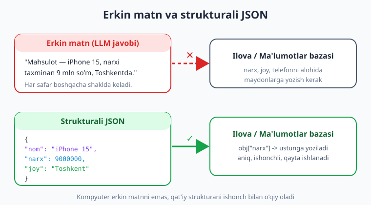
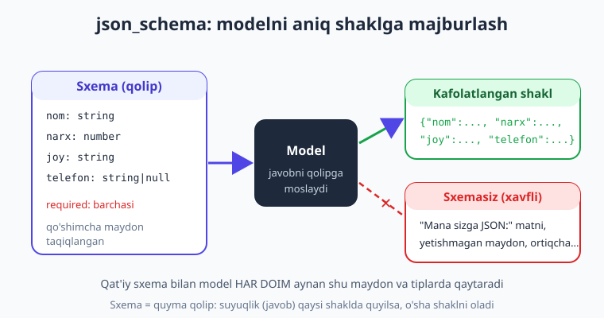
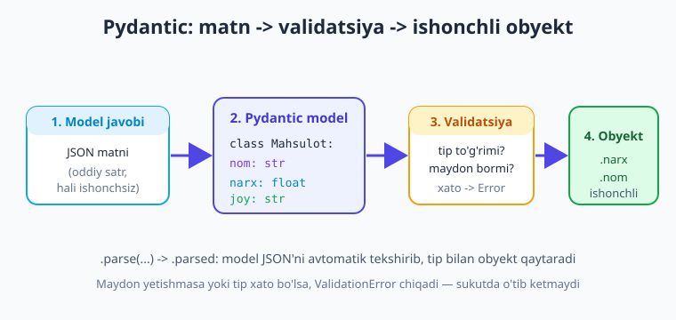

# 09 — Strukturali natija (JSON + Pydantic)

[⬅️ Oldingi: 08 — Suhbat xotirasi va kontekst boshqaruvi](./08-suhbat-xotira-kontekst.md) · [🏠 Kitob boshi](./README.md) · [Keyingi: 10 — Function/tool calling asoslari ➡️](./10-tool-calling-asoslari.md)

> **Bu bobda:** modeldan **erkin matn** emas, kompyuter o'qiy oladigan **strukturali ma'lumot (JSON)** olishni o'rganamiz. Avval eng oddiy yo'lni — promptda "JSON qaytar" + `response_format={"type": "json_object"}` — ko'ramiz; so'ng kuchliroq **json_schema** (qat'iy sxema) bilan modelni aniq shaklga majburlaymiz; eng qulay usul — **Pydantic** bilan `client.beta.chat.completions.parse(...)` — javobni avtomatik validatsiyalab, tayyor obyekt qaytarishini o'rganamiz. Validatsiya xatolarini (`ValidationError`) ushlashni, erkin matndan (masalan, e'londan) nom/narx/joy/telefonni ajratib olishni amalda qilamiz va provayderlararo farqlarni (json_object va json_schema, Gemini) ko'rib chiqamiz.

---

## Muammodan boshlaymiz: erkin matnni ilovaga ulab bo'lmaydi

Hozirgacha modeldan **matn** olardik va uni `print` qilardik — odam o'qishi uchun ajoyib. Lekin ilova qurishda muammo paydo bo'ladi. Tasavvur qiling, foydalanuvchi e'lonini modelga berib, undan narxni ajratib olmoqchisiz. Model shunday javob beradi:

> "Mahsulot — iPhone 15, narxi taxminan 9 mln so'm, Toshkentda sotiladi."

Bu — chiroyli jumla, lekin **kod uni ishlata olmaydi**. Narxni ma'lumotlar bazasiga yozmoqchisiz — qaysi qismi narx? "9 mln" ni `9000000` songa qanday aylantirasiz? Ertaga model "narxi 9 million so'm atrofida" deb yozsa-chi? Har safar boshqacha shaklda keladigan matnni `if`/`split`/regex bilan ajratish — mo'rt va ishonchsiz.

Yechim: modeldan **strukturali ma'lumot** so'rash. Ya'ni javobni odam uchun emas, **kompyuter uchun** — aniq maydonlarga bo'lingan, har doim bir xil shaklda. Eng keng tarqalgan format — **JSON**.



> **Hayotiy o'xshatish.** Erkin matn — bu **og'zaki aytilgan manzil**: "anavi katta do'kondan o'tib, chap tomonda". Odam tushunadi, lekin navigator (kompyuter) tushunmaydi. JSON esa — **to'ldirilgan blank**: ko'cha, uy raqami, indeks alohida kataklarda. Navigator buni ishonch bilan o'qiydi. Ilovangizga "manzil"ni og'zaki emas, blank shaklida bering.

!!! note "JSON nima?"
    **JSON** (JavaScript Object Notation) — ma'lumotni `kalit: qiymat` juftliklari sifatida yozish formati. Python'dagi `dict`ga juda o'xshaydi: `{"nom": "iPhone", "narx": 9000000}`. Python'da `import json` bilan ishlanadi: `json.loads(matn)` — JSON satrini `dict`ga aylantiradi, `json.dumps(obj)` — teskarisi. Deyarli har til JSON'ni tushunadi — shuning uchun u tizimlararo "umumiy til".

---

## Eng oddiy yo'l: JSON rejimi (`json_object`)

Birinchi qadam — modelga ikki narsani aytish: (1) promptda "JSON qaytar" deyish va (2) `response_format={"type": "json_object"}` parametri bilan modelni **faqat to'g'ri JSON** chiqarishga majburlash. Bu parametrsiz model ba'zan "Mana sizga JSON:" deb qo'shimcha gap qo'shadi yoki kod blokiga (` ```json `) o'rab beradi — keyin `json.loads` xato beradi. `json_object` rejimi shunday "axlat"ni oldini oladi.

```python
import os, json
from dotenv import load_dotenv
from openai import OpenAI

load_dotenv()
client = OpenAI()
MODEL = "gpt-5.4-mini"   # nomlar o'zgaradi — provayder ro'yxatini tekshiring

elon = "Sotaman: iPhone 15, holati zo'r, narxi 9 mln so'm. Toshkent. Tel: 90 123 45 67"

javob = client.chat.completions.create(
    model=MODEL,
    response_format={"type": "json_object"},   # faqat toza JSON qaytaradi
    messages=[
        {"role": "system", "content":
            "E'londan ma'lumot ajratib oluvchisan. FAQAT JSON qaytar, "
            "shu maydonlar bilan: nom (str), narx (butun son, so'mda), "
            "joy (str), telefon (str)."},
        {"role": "user", "content": elon},
    ],
)

matn = javob.choices[0].message.content   # bu hali ODDIY SATR (str)
data = json.loads(matn)                    # satrni dict'ga aylantiramiz
print(data["narx"], data["joy"])           # 9000000 Toshkent
```

Diqqat qiling: `javob.choices[0].message.content` — baribir **satr**. JSON rejimi faqat shu satr to'g'ri JSON bo'lishini kafolatlaydi; uni Python obyektiga aylantirish uchun `json.loads()` kerak.

> **Hayotiy o'xshatish.** `json_object` rejimi — ofitsiantga "menga faqat ovqatni keltir, salfetka va menyuni emas" deyishga o'xshaydi. Sukutda (rejimsiz) model javobni qo'shimcha gaplar bilan "o'rab" beradi; bu rejim esa faqat sof JSON keltirishini ta'minlaydi.

!!! warning "`json_object` shaklni kafolatlamaydi — faqat 'JSON ekanini' kafolatlaydi"
    Bu rejim natija **to'g'ri JSON** ekanini ta'minlaydi, lekin **qaysi maydonlar** bo'lishini emas. Model `narx`ni unutishi yoki uni satr (`"9 mln"`) qilib qaytarishi mumkin — JSON baribir to'g'ri sanaladi. Shuning uchun: (1) promptda maydonlarni aniq sanang, (2) o'qiyotganda `.get()` bilan ehtiyot bo'ling, (3) yaxshisi — keyingi bo'limdagi **json_schema** yoki **Pydantic** dan foydalaning.

!!! tip "Promptda misol bering (one-shot)"
    Model qanday JSON kutilayotganini aniq bilsin uchun system promptga **bitta namuna** qo'shing: `Masalan: {"nom": "Velosiped", "narx": 1200000, "joy": "Samarqand", "telefon": "..."}`. Bu modelni to'g'ri shaklga yo'naltiradi va xatoni keskin kamaytiradi.

---

## Kuchliroq yo'l: qat'iy sxema (`json_schema`)

`json_object` "biror JSON" beradi, lekin shaklini kafolatlamaydi. **Structured outputs** (qat'iy `json_schema`) esa modelni **aniq belgilangan shaklga** majburlaydi: qaysi maydonlar bo'lishi, har birining tipi (`string`, `number`, ...), qaysilari majburiy. Model **aynan shu shaklda** qaytaradi — maydon yetishmaydi yoki ortiqcha qo'shilmaydi.



```python
sxema = {
    "type": "object",
    "properties": {
        "nom":     {"type": "string"},
        "narx":    {"type": "integer"},          # so'mda, butun son
        "joy":     {"type": "string"},
        "telefon": {"type": ["string", "null"]}, # bo'lmasligi mumkin
    },
    "required": ["nom", "narx", "joy", "telefon"],
    "additionalProperties": False,               # ortiqcha maydon taqiqlanadi
}

javob = client.chat.completions.create(
    model=MODEL,
    response_format={
        "type": "json_schema",
        "json_schema": {"name": "elon", "schema": sxema, "strict": True},
    },
    messages=[
        {"role": "system", "content": "E'londan ma'lumot ajrat."},
        {"role": "user", "content": elon},
    ],
)
data = json.loads(javob.choices[0].message.content)
print(data)   # barcha maydonlar kafolatlangan
```

`strict: True` — eng muhim qism: model sxemadan chetga chiqa olmaydi. Bu `json_object`dan ancha ishonchli, chunki endi `narx` **albatta** butun son, `joy` **albatta** bor.

> **Hayotiy o'xshatish.** json_schema — **quyma qolip** (forma). Suyuq metallni qolipga quyasiz — u qaysi shaklda quyilsa, o'sha shaklni oladi: na ortiqcha, na kam. Sxema ham javobni shunday "quyadi": natija har doim aniq o'sha shaklda chiqadi.

!!! note "json_schema'ni hamma provayder qo'llamaydi"
    Qat'iy `json_schema` (`strict: True`) OpenAI va yangi modellarda yaxshi ishlaydi, lekin **barcha** OpenAI-mos provayder uni qo'llamaydi. Ko'pchilik faqat `json_object`ni qo'llaydi. Provayderni almashtirayotganda buni sinab ko'ring (4-bobdagi factory yodingizda). Pastda Gemini va boshqalar haqida alohida eslatma bor.

---

## Eng qulay yo'l: Pydantic bilan (`parse`)

Sxemani qo'lda yozish (yuqoridagi `sxema` lug'ati) — zerikarli va xatoga moyil. **Pydantic** — Python'da ma'lumot tiplarini sinflar bilan e'lon qiladigan kutubxona. OpenAI SDK Pydantic bilan birga ishlab, eng qulay yo'lni beradi: siz oddiy Python sinfini yozasiz, SDK undan sxema yasaydi, javobni validatsiyalaydi va **tayyor obyekt** qaytaradi.

Avval o'rnating:

```bash
pip install pydantic
```



```python
from pydantic import BaseModel

# Kutilayotgan shaklni oddiy Python sinfi sifatida e'lon qilamiz
class Elon(BaseModel):
    nom: str
    narx: int                 # so'mda, butun son
    joy: str
    telefon: str | None = None   # bo'lmasligi mumkin

javob = client.beta.chat.completions.parse(   # create EMAS — parse!
    model=MODEL,
    response_format=Elon,                      # to'g'ridan-to'g'ri sinf!
    messages=[
        {"role": "system", "content": "E'londan ma'lumot ajrat."},
        {"role": "user", "content": elon},
    ],
)

obyekt = javob.choices[0].message.parsed   # .parsed -> Elon namunasi (str emas!)
print(obyekt.narx)        # 9000000 (int)
print(obyekt.joy)         # Toshkent
print(type(obyekt))       # <class '...Elon'> — tayyor obyekt
```

Farqni sezing: `create` o'rniga **`parse`**, va `.content` (satr) o'rniga **`.parsed`** (validatsiyalangan obyekt). `json.loads` ham, qo'lda sxema yozish ham kerak emas — Pydantic hammasini bajaradi. `obyekt.narx` — haqiqiy `int`, redaktoringiz ham uni tushunadi (avtomatik to'ldirish ishlaydi).

> **Hayotiy o'xshatish.** Pydantic — **bojxona inspektori**. Chegaradan o'tayotgan yuk (model javobi) deklaratsiyaga (sinf) mos kelishini tekshiradi: hamma narsa joyidami, tiplar to'g'rimi. Mos bo'lsa — ichkariga o'tkazadi (tayyor obyekt); mos bo'lmasa — to'xtatadi (xato). Ilovangizga faqat "tekshirilgan" ma'lumot kiradi.

### Murakkabroq model: nested, list, enum

Haqiqiy ma'lumot ko'pincha murakkab: ichida boshqa obyekt (nested), ro'yxat (list) yoki cheklangan tanlov (enum) bo'ladi. Pydantic bularning hammasini qo'llaydi. Masalan, e'lonni boyroq shaklda ajratib olaylik:

```python
from enum import Enum
from pydantic import BaseModel, Field

class Holat(str, Enum):          # faqat shu uch qiymatdan biri
    yangi = "yangi"
    ishlatilgan = "ishlatilgan"
    nuqsonli = "nuqsonli"

class Kontakt(BaseModel):        # ichki (nested) obyekt
    telefon: str
    shahar: str

class ElonToliq(BaseModel):
    nom: str
    narx: int = Field(description="So'mda, butun son")   # modelga izoh
    holat: Holat                                          # enum: cheklangan tanlov
    kontakt: Kontakt                                      # nested obyekt
    teglar: list[str]                                     # satrlar ro'yxati

javob = client.beta.chat.completions.parse(
    model=MODEL,
    response_format=ElonToliq,
    messages=[
        {"role": "system", "content": "E'londan to'liq ma'lumot ajrat."},
        {"role": "user", "content": elon},
    ],
)
e = javob.choices[0].message.parsed
print(e.holat)              # Holat.yangi (faqat ruxsat etilgan qiymat)
print(e.kontakt.shahar)    # Toshkent (nested obyektdan)
print(e.teglar)            # ['telefon', 'apple', ...]
```

`Field(description=...)` — modelga har maydon nima ekanini tushuntiradi (sifatni oshiradi). `Enum` esa modelni **faqat ruxsat etilgan qiymatlar**ga cheklaydi — `holat` hech qachon "yaxshi-yomon" kabi kutilmagan qiymat bo'lmaydi. Bu ma'lumotni keyin ishlashda juda qulay.

!!! tip "Pydantic — strukturali natija uchun standart"
    Real loyihalarda strukturali natija deyarli har doim **Pydantic bilan** yoziladi: kamroq kod, avtomatik validatsiya, tip-xavfsizlik va o'qilishi oson sxema. Imkon bo'lsa — to'g'ridan-to'g'ri shu yo'ldan boring. `json_object`ni esa Pydantic/json_schema'ni qo'llamaydigan provayderlar uchun "zaxira" sifatida saqlang.

---

## Validatsiya va xatolarni ushlash

Model — bashorat qiluvchi tizim; u **har doim** to'g'ri shaklda qaytaradi degan kafolat yo'q (ayniqsa `json_object` rejimida yoki kuchsizroq modellarda). Shuning uchun strukturali natijani olganda **doim xatoga tayyor turing**.

`parse` ishlatganda Pydantic javobni avtomatik tekshiradi; mos kelmasa — `ValidationError` ko'taradi. Uni ushlab, mazmunli ish qilish kerak:

```python
from pydantic import ValidationError
import json

try:
    javob = client.beta.chat.completions.parse(
        model=MODEL,
        response_format=Elon,
        messages=[{"role": "user", "content": elon}],
    )
    obyekt = javob.choices[0].message.parsed
    if obyekt is None:
        # Model ba'zan javob bermay, "rad etish" (refusal) qaytarishi mumkin
        print("Model javobni qaytarmadi:", javob.choices[0].message.refusal)
    else:
        print("OK:", obyekt)

except ValidationError as e:
    # Javob shaklga mos kelmadi (maydon yetishmadi yoki tip xato)
    print("Validatsiya xatosi:", e)

except json.JSONDecodeError:
    # json_object rejimida: javob umuman to'g'ri JSON bo'lmasa
    print("Javob to'g'ri JSON emas")
```

Qo'lda `json.loads` ishlatsangiz (json_object yo'li), o'zingiz tekshirishingiz kerak: maydon bormi, tip to'g'rimi. Pydantic'ning afzalligi — buni **avtomatik** qiladi.

> **Hayotiy o'xshatish.** Validatsiya — **xavfsizlik tekshiruvi (metal detektor)** kabi. Hamma narsa joyida deb ishonib o'tkazib yuborish o'rniga, har "yo'lovchini" (javobni) tekshirasiz. Bir marta qo'shilgan tekshiruv — keyinchalik ilovangizda yuzaga keladigan ko'plab sirli xatolarning oldini oladi.

!!! warning "Modelga hech qachon ko'r-ko'rona ishonmang"
    Strukturali natija — kuchli, lekin **sehrli emas**. `narx` butun son bo'lsa ham, uning **mantiqan to'g'ri** ekanini (manfiy emasligi, real ekani) Pydantic bilmaydi. Biznes-mantiq tekshiruvini (`if obyekt.narx < 0: ...`) o'zingiz qo'shing. Pydantic — *shakl* tekshiruvi; *ma'no* tekshiruvi sizning vazifangiz.

!!! tip "Retry — qayta urinish"
    `ValidationError` chiqsa, ko'pincha eng oddiy yechim — **bir marta qayta so'rash**, ehtimol promptga "Avvalgi javobing shaklga mos kelmadi, faqat to'g'ri JSON qaytar" deb qo'shib. Ishlab chiqarish (production) ilovalarida strukturali natija + retry juftligi standart amaliyot; ishonchlilik haqida 23-bobda batafsil to'xtalamiz.

---

## Amaliy misol: e'lonlar ro'yxatini bazaga tayyorlash

Endi hammasini birlashtiramiz. Tasavvur qiling, sizda **bir nechta erkin e'lon** bor (foydalanuvchilar yozgan), va ularni bazaga yozish uchun strukturali shaklga keltirmoqchisiz. Pydantic + `parse` bilan bu juda toza chiqadi:

```python
import os
from dotenv import load_dotenv
from openai import OpenAI
from pydantic import BaseModel, ValidationError

load_dotenv()
client = OpenAI()
MODEL = "gpt-5.4-mini"   # nomlar o'zgaradi — ro'yxatni tekshiring

class Elon(BaseModel):
    nom: str
    narx: int
    joy: str
    telefon: str | None = None


def elonni_ajrat(matn: str) -> Elon | None:
    """Bitta erkin e'lon matnidan strukturali Elon obyektini ajratadi."""
    try:
        javob = client.beta.chat.completions.parse(
            model=MODEL,
            response_format=Elon,
            messages=[
                {"role": "system", "content":
                    "Foydalanuvchi e'lonidan ma'lumot ajratuvchisan. "
                    "narx — so'mda butun son. Telefon topilmasa null qoldir."},
                {"role": "user", "content": matn},
            ],
        )
        return javob.choices[0].message.parsed
    except ValidationError as e:
        print(f"  ! ajratib bo'lmadi: {e}")
        return None


elonlar = [
    "Sotaman iPhone 15, 9 mln so'm, Toshkent, tel 90 123 45 67",
    "Velosiped arzon — 1.2 million. Samarqand shahar.",
    "Noutbuk Lenovo, narxi kelishilgan, Buxoro, +998 91 222 33 44",
]

baza = []   # bazaga yoziladigan toza yozuvlar
for matn in elonlar:
    obyekt = elonni_ajrat(matn)
    if obyekt:
        baza.append(obyekt.model_dump())   # Pydantic -> dict (DB/JSON uchun)
        print(f"OK: {obyekt.nom} | {obyekt.narx} so'm | {obyekt.joy}")

# Endi `baza` — bazaga INSERT qilish yoki json.dumps qilishga tayyor
```

E'tibor bering: kirish — **chalkash, har xil shakldagi** matn ("9 mln", "1.2 million", "narxi kelishilgan"); chiqish — **bir xil, toza** struktura. `model_dump()` Pydantic obyektini oddiy `dict`ga aylantiradi — uni to'g'ridan-to'g'ri bazaga yozish yoki `json.dumps` bilan saqlash mumkin. Mana shu — strukturali natijaning asl kuchi: **LLM'ni tartibsiz tabiiy til bilan ilovangizning tartibli dunyosi orasidagi ko'prik** sifatida ishlatish.

!!! note "Ma'lumot ajratish (extraction) — eng ko'p uchraydigan amaliy vazifa"
    Strukturali natijaning real ishlatilishi ko'p: rezyumedan ism/tajriba/ko'nikma ajratish, mijoz xatidan shikoyat turi va shoshilinchlik darajasini aniqlash, hisob-fakturadan summa/sana/yetkazib beruvchini olish, sharhni ijobiy/salbiyga tasniflash. Hammasi bitta naqsh: **erkin matn -> Pydantic model -> toza obyekt**.

---

## Provayderlararo farqlar

Strukturali natija — provayderlararo eng "g'adir-budur" mavzulardan biri. Eng muhim farqlar:

- **`json_object`** — deyarli barcha OpenAI-mos provayderda bor (OpenAI, Groq, DeepSeek, ko'pchilik). Eng keng qo'llab-quvvatlanadigan, lekin shaklni kafolatlamaydi.
- **`json_schema` / `parse` (Pydantic, qat'iy sxema)** — OpenAI'da to'liq, ba'zi boshqalarda qisman yoki umuman yo'q. Provayderni almashtirsangiz — **sinab ko'ring**.
- **Anthropic (Claude)** — `response_format` ishlatmaydi. Strukturali natija odatda **tool calling** orqali olinadi: modelga bitta "tool" beriladi va uning argumentlari sxema bo'lib xizmat qiladi. Buni 10-11 boblarda (tool calling) ko'ramiz.
- **Google (Gemini)** — native SDK'da boshqacha: `response_mime_type="application/json"` (JSON rejimi) va `response_schema` (sxema) konfiguratsiya orqali beriladi:

```python
from google import genai
from google.genai import types

client = genai.Client()   # GEMINI_API_KEY
resp = client.models.generate_content(
    model="gemini-2.5-flash",
    contents=elon,
    config=types.GenerateContentConfig(
        response_mime_type="application/json",
        response_schema=Elon,    # Pydantic sinfini to'g'ridan-to'g'ri beradi
    ),
)
print(resp.text)              # JSON satri
obyekt = resp.parsed          # Pydantic obyekt (Gemini SDK ham .parsed beradi)
```

> **Hayotiy o'xshatish.** Strukturali natija — **rozetka turlariga** o'xshaydi: g'oya bir xil (tok = strukturali ma'lumot), lekin har mamlakatda (provayderda) "vilka" shakli (`json_object` / `json_schema` / tool / `response_schema`) farq qiladi. Maqsad bir xil, faqat ulanish usuli o'zgaradi.

!!! warning "Provayderni almashtirgach, strukturali natijani qayta sinang"
    Bu kitobning "bitta kod, ko'p provayder" g'oyasi (4-bob) strukturali natijada **eng kam ishlaydigan** joy. `response_format={"type": "json_object"}` aksariyatda ishlaydi, lekin `json_schema`/`parse`ni qabul qilmaydigan provayderda kod sinadi. Strukturali natija ishlatadigan kodni provayder almashganda albatta tekshiring.

!!! tip "Eng portativ minimal yo'l"
    Iloji boricha ko'p provayderda ishlaydigan kod kerak bo'lsa: `response_format={"type": "json_object"}` + promptda aniq maydonlar va **bitta misol** + Python tomonda **Pydantic bilan validatsiya** (`Elon.model_validate_json(matn)`). Bu json_schema'ni qo'llamaydigan provayderda ham qat'iy sxema'ning ko'p foydasini beradi.

---

## Xulosa

- Erkin matnni ilovaga ishonchli ulab bo'lmaydi — kompyuter o'qiy oladigan **strukturali ma'lumot (JSON)** kerak: aniq maydonlar, har doim bir xil shakl.
- Eng oddiy yo'l: promptda "JSON qaytar" + `response_format={"type": "json_object"}`; natija baribir **satr**, uni `json.loads()` bilan `dict`ga aylantirasiz. Bu "JSON ekanini" kafolatlaydi, **shaklni** emas.
- Kuchliroq: **`json_schema`** (`strict: True`) — modelni aniq maydon va tiplarga majburlaydi; natija shakli kafolatlanadi.
- Eng qulay: **Pydantic** + `client.beta.chat.completions.parse(..., response_format=Model)` -> `.parsed`. Sinf yozasiz, SDK sxema yasaydi, validatsiyalaydi va **tayyor obyekt** qaytaradi. Nested, `list`, `Enum`, `Field(description=...)` qo'llanadi.
- **Validatsiya majburiy:** `parse` mos kelmasa `ValidationError` ko'taradi; `.parsed is None` (refusal) holatini ham tekshiring. Pydantic *shaklni* tekshiradi — *ma'no/biznes-mantiq* tekshiruvi sizning zimmangizda. Kerakda **retry**.
- Amaliy naqsh: **erkin matn -> Pydantic model -> toza obyekt** — e'lon, rezyume, hisob-faktura, sharhdan ma'lumot ajratishning standart usuli; `model_dump()` bilan bazaga yozasiz.
- Provayderlararo farq bor: `json_object` keng qo'llanadi, `json_schema`/`parse` hammada emas; Claude uchun **tool calling**, Gemini uchun `response_mime_type` + `response_schema`. Provayder almashganda qayta sinang.

## Amaliy mashqlar

1. **(Oson)** 5-qadamdagi `json_object` misolini ishga tushiring: bitta e'lon matnidan `nom`, `narx`, `joy`, `telefon`ni ajratib, `json.loads` bilan `dict`ga aylantiring va har bir maydonni alohida `print` qiling.

2. **(Oson)** `Elon` Pydantic modelini yozing va `client.beta.chat.completions.parse(...)` bilan o'sha e'lonni ajrating. `obyekt.narx` ning `type()`ini chop eting — `str` emas, `int` ekaniga ishonch hosil qiling.

3. **(O'rtacha)** Modelni kengaytiring: `Holat` enum (`yangi`/`ishlatilgan`/`nuqsonli`) va `teglar: list[str]` qo'shing. Bir nechta turli e'londa sinab, `holat` doim faqat ruxsat etilgan qiymatlardan biri ekanini tekshiring.

4. **(O'rtacha)** Amaliy misoldagidek **uch-to'rt** xil shakldagi e'lon ro'yxatini Pydantic + `parse` bilan ajratib, har birini `model_dump()` qilib bitta `list`ga to'plang. So'ng butun ro'yxatni `json.dumps(..., ensure_ascii=False, indent=2)` bilan faylga yozing.

5. **(Qiyin)** `try/except ValidationError` bilan mustahkam `elonni_ajrat()` funksiyasini yozing: validatsiya xatosida promptga "faqat to'g'ri JSON qaytar" eslatmasini qo'shib **bir marta qayta urinsin** (retry); ikkala urinish ham muvaffaqiyatsiz bo'lsa `None` qaytarsin. Atayin chalkash matn berib, retry mantiqini sinab ko'ring.

---

[⬅️ Oldingi: 08 — Suhbat xotirasi va kontekst boshqaruvi](./08-suhbat-xotira-kontekst.md) · [🏠 Kitob boshi](./README.md) · [Keyingi: 10 — Function/tool calling asoslari ➡️](./10-tool-calling-asoslari.md)
