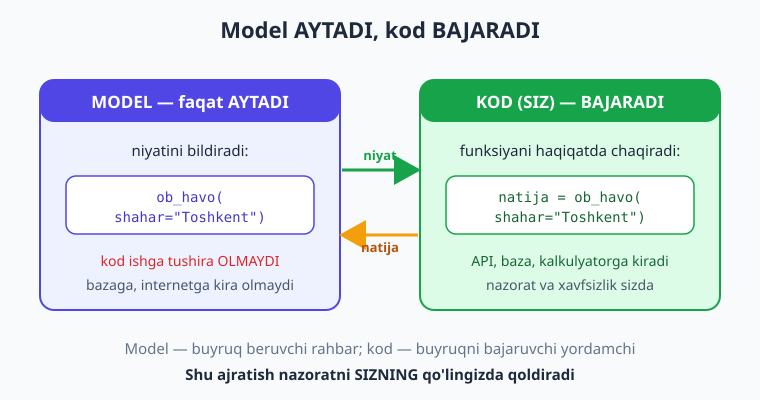
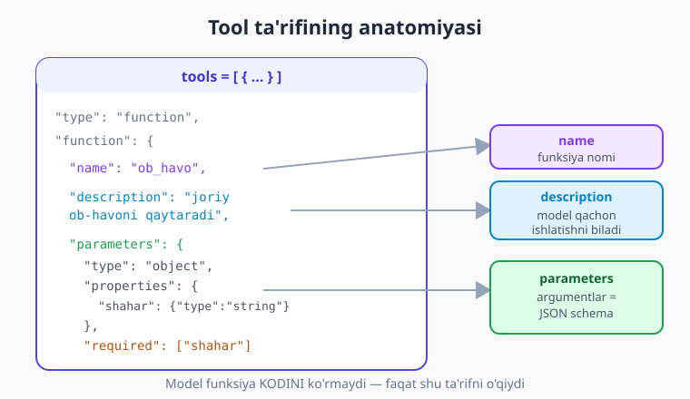
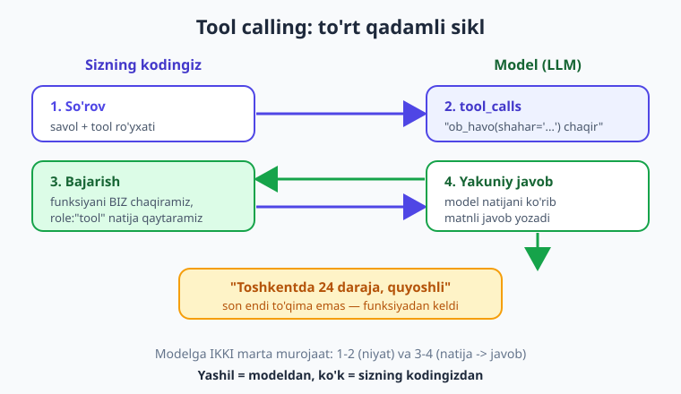

# 10 — Function/tool calling asoslari

[⬅️ Oldingi: 09 — Strukturali natija (JSON + Pydantic)](./09-strukturali-natija-json.md) · [🏠 Kitob boshi](./README.md) · [Keyingi: 11 — Tool calling chuqur va ko'p qadamli ➡️](./11-tool-calling-chuqur.md)

> **Bu bobda:** LLM'ning eng kuchli imkoniyatlaridan birini — **tool (function) calling**ni — noldan o'rganamiz. Nega model o'zi tashqi dunyoga ta'sir qila olmasligini (real vaqtni bilmasligi, hisob-kitobda adashishi, bazaga kira olmasligi) va tool aynan shu cheklovni qanday yechishini ko'ramiz. Eng muhim g'oyani — **model funksiyani O'ZI chaqirmaydi, balki "shu funksiyani shu argumentlar bilan chaqir" deb AYTADI; bajaruvchi esa — SIZ** — o'zlashtiramiz. Tool ta'rifining tuzilishini, to'liq to'rt qadamli siklni va boshidan oxirigacha ishlaydigan bitta misol (`ob_havo`) ni yozamiz. Yakunda Claude'dagi farqni ham qisqa ko'rib chiqamiz.

---

## Muammodan boshlaymiz: model "bugun ob-havo qanday?" degan savolga javob bera olmaydi

9-bobda modeldan tartibli JSON ololdik. Endi yana bir qadam tashlaymiz. Foydalanuvchi yozadi:

> "Toshkentda hozir ob-havo qanday?"

Modelga bu savolni yuborsangiz, u **ishonch bilan** biror son aytadi — masalan, "Toshkentda hozir 24 daraja, quyoshli". Lekin bu son — **to'qib chiqarilgan**. Model real ob-havo serveriga ulanmagan; u faqat "shunga o'xshash javob qanday bo'lardi"ni bashorat qildi.

Muammo chuqurroq. LLM **yopiq quti** kabi ishlaydi: u faqat o'ziga yuborilgan matnni ko'radi va matn qaytaradi. U:

- **Real vaqtni bilmaydi** — bugungi ob-havo, valyuta kursi, oxirgi yangiliklar uning bilimida yo'q.
- **Aniq hisob-kitobda adashadi** — uzun ko'paytirish yoki murakkab matematikada xato qiladi (u "hisoblamaydi", "javob qanday ko'rinishini" bashorat qiladi).
- **Bazangizga kira olmaydi** — sizning buyurtmalar jadvalingiz, mijozlaringiz, narxlaringiz model uchun ko'rinmas.

> **Hayotiy o'xshatish.** LLM — bu **telefonsiz, internetsiz, qulflangan xonadagi juda bilimli ekspert**. Undan ko'p narsani so'rashingiz mumkin va u ajoyib javob beradi. Lekin "ayni hozir ko'chada harorat necha daraja?" deb so'rasangiz — u derazasiz xonada o'tirgani uchun bilolmaydi. Yechim: unga **telefon** berish — "kerak bo'lsa, mana shu raqamga qo'ng'iroq qilib so'ra" deyish. Tool calling — modelga shu "telefon"larni berish usulidir.

Tool (function) calling aynan shu cheklovni yechadi: modelga **tashqi funksiyalar** ro'yxatini beramiz, va model "menga javob berish uchun shu funksiya kerak" deb hal qila oladi.

---

## Eng muhim tushuncha: model AYTADI, kod BAJARADI

Bu bobning eng muhim jumlasi, uni yodda mahkam saqlang:

> **Model funksiyaning O'ZINI chaqirmaydi. U faqat "shu funksiyani shu argumentlar bilan chaqir" deb AYTADI. Funksiyani haqiqatda bajaruvchi — SIZ (sizning kodingiz).**

Ko'p boshlovchilar shu yerda yanglishadi: "tool berdim, model endi mening funksiyamni o'zi ishga tushiradi" deb o'ylashadi. Yo'q. Model — sun'iy intellekt, lekin u sizning kompyuteringizda kod ishga tushira olmaydi. U faqat **niyatini** bildiradi: "men `ob_havo` funksiyasini `shahar="Toshkent"` bilan chaqirmoqchiman". Bu niyatni o'qib, haqiqiy funksiyani chaqirib, natijani modelga **qaytarib berish** — bu sizning vazifangiz.



> **Hayotiy o'xshatish.** Model — **buyruq beruvchi rahbar**, kod — **buyruqni bajaruvchi yordamchi**. Rahbar "Anvarga qo'ng'iroq qilib, ertangi uchrashuvni so'ra" deydi (niyat), lekin o'zi telefonni olib raqam termaydi — buni yordamchi qiladi va natijani ("Anvar ertaga soat 10da bo'sh ekan") rahbarga qaytaradi. Rahbar shu natija asosida yakuniy qaror chiqaradi.

Bu ajratish nega muhim? Chunki u **xavfsizlik va nazoratni** sizning qo'lingizda qoldiradi. Model "ma'lumotni o'chir" deb aytishi mumkin, lekin haqiqatda o'chirish-o'chirmaslikni **siz** hal qilasiz — funksiyani bajarishdan oldin tekshirishingiz, ruxsat so'rashingiz yoki rad etishingiz mumkin.

!!! note "Tool, function, action — bir narsa"
    Turli provayderlar va maqolalar buni har xil ataydi: **tool calling**, **function calling**, **tool use**, ba'zan **action**. Mazmun bir xil: modelga tashqi funksiyalar ro'yxatini berasiz, model qaysi birini qaysi argument bilan chaqirishni tanlaydi, siz bajarib natijani qaytarasiz. Bu kitobda asosan "tool calling" deymiz.

---

## Tool ta'rifi: modelga funksiyani qanday tanishtirasiz

Model qaysi funksiyalar mavjudligini va ularni qanday ishlatishni **biladigan** bo'lishi kerak. Buning uchun har bir funksiyani modelga **ta'riflab** beramiz: nomi, nima ish qilishi va qanday argumentlar qabul qilishi.

OpenAI-mos formatda har bir tool quyidagi tuzilishga ega:

```python
{
    "type": "function",
    "function": {
        "name": "ob_havo",                                  # funksiya nomi (kodingizdagi bilan mos)
        "description": "Shahar bo'yicha joriy ob-havoni qaytaradi",  # NIMA qilishi
        "parameters": {                                     # argumentlar = JSON schema
            "type": "object",
            "properties": {
                "shahar": {
                    "type": "string",
                    "description": "Shahar nomi, masalan 'Toshkent'",
                },
            },
            "required": ["shahar"],
        },
    },
}
```

Uch qism eng muhim:

- **`name`** — funksiya nomi. Model javobida aynan shu nomni qaytaradi, shuning uchun u sizning haqiqiy funksiyangiz bilan bog'lanadi.
- **`description`** — eng muhim qism! Model **shu matnga qarab** funksiyani qachon ishlatishni hal qiladi. Aniq va tushunarli yozing — bu modelga beriladigan "yo'riqnoma".
- **`parameters`** — argumentlarning **JSON schema**si (9-bobda ko'rgan formatda). Har bir argumentning turi va tavsifi; `required` — majburiylari.



> **Hayotiy o'xshatish.** Tool ta'rifi — yangi yordamchiga bergan **ish tavsifi**. `name` — vazifa nomi, `description` — "bu vazifani qachon va nima uchun bajarasan", `parameters` — "buning uchun mendan qanday ma'lumot so'raysan". Yordamchi (model) shu tavsifni o'qib, vaziyat tushganda to'g'ri vazifani tanlaydi.

!!! tip "`description` — modelning yagona yo'riqnomasi"
    Model funksiya **kodini** ko'rmaydi — faqat `description`ni o'qiydi. Agar tavsif noaniq bo'lsa ("malumot oladi"), model uni noto'g'ri vaqtda yoki umuman ishlatmaydi. Aniq yozing: "Berilgan shahar uchun joriy harorat va ob-havo holatini qaytaradi". Argument tavsiflariga ham e'tibor bering — ular modelga to'g'ri qiymat yuborishni o'rgatadi.

---

## To'liq sikl: to'rt qadam

Tool calling — bu **bitta** so'rov emas, balki **ikki marta** modelga murojaat qiladigan tsikl. Mana to'rt qadam:

1. **So'rov.** Foydalanuvchi savolini va tool ro'yxatini modelga yuborasiz.
2. **Model `tool_calls` qaytaradi.** Matn o'rniga model "menga `ob_havo(shahar='Toshkent')` kerak" deb javob beradi.
3. **Siz funksiyani bajarib, natija qaytarasiz.** Haqiqiy `ob_havo` ni chaqirasiz va natijani `role:"tool"` xabari bilan suhbatga qo'shasiz.
4. **Model yakuniy javob beradi.** Endi model natijani ko'rib, foydalanuvchiga chiroyli matnli javob yozadi.



> **Hayotiy o'xshatish.** Bu — ofitsiant bilan suhbat: (1) siz "shu yerda biror sho'rva bormi?" deb so'raysiz; (2) ofitsiant "oshpazdan so'rab kelay" deydi (niyat); (3) u oshxonaga borib, qaytib keladi (funksiya bajarildi); (4) "ha, mastava bor, buyurtma berasizmi?" deb yakuniy javob beradi. E'tibor bering — bitta savolga **ikki bosqichli** suhbat kerak bo'ldi.

Diqqat qiling: **2-qadamda** suhbatga modelning `tool_calls` xabarini, **3-qadamda** esa `role:"tool"` natijasini **qo'shib boramiz**. Model 4-qadamda butun suhbatni (savol + uning niyati + sizning natija) ko'rgani uchun mazmunli yakuniy javob bera oladi. API holatsiz (3-bobda ko'rgandek), shuning uchun har safar to'liq tarixni yuboramiz.

---

## Boshidan oxirigacha to'liq misol: `ob_havo`

Endi hammasini bitta ishlaydigan skriptda birlashtiramiz. Soddalik uchun `ob_havo` soxta (test) ma'lumot qaytaradi — real loyihada bu yerda haqiqiy ob-havo API'siga so'rov bo'lardi. Muhimi — **sikl tuzilishi** bir xil bo'ladi.

```python
import os
import json
from dotenv import load_dotenv
from openai import OpenAI

load_dotenv()
client = OpenAI()

# Model nomi. Eslatma: nomlar o'zgaradi — provayder ro'yxatini tekshiring.
MODEL = "gpt-5.4-mini"


# 1) Haqiqiy funksiya — uni KODINGIZ bajaradi, model emas.
def ob_havo(shahar: str) -> dict:
    """Shahar bo'yicha ob-havo. (Bu yerda soxta ma'lumot — real API o'rniga.)"""
    soxta = {
        "Toshkent": {"harorat": 24, "holat": "quyoshli"},
        "Samarqand": {"harorat": 22, "holat": "bulutli"},
    }
    return soxta.get(shahar, {"harorat": 20, "holat": "noma'lum"})


# 2) Tool ta'rifi — modelga funksiyani tanishtiramiz.
tools = [{
    "type": "function",
    "function": {
        "name": "ob_havo",
        "description": "Berilgan shahar uchun joriy harorat va ob-havo holatini qaytaradi",
        "parameters": {
            "type": "object",
            "properties": {
                "shahar": {"type": "string", "description": "Shahar nomi, masalan 'Toshkent'"},
            },
            "required": ["shahar"],
        },
    },
}]

# Suhbat tarixi. Uni qadam-baqadam to'ldirib boramiz.
msgs = [{"role": "user", "content": "Toshkentda hozir ob-havo qanday?"}]

# --- QADAM 1: so'rov + toollar ---
resp = client.chat.completions.create(model=MODEL, messages=msgs, tools=tools)
msg = resp.choices[0].message

# --- QADAM 2: model tool_calls qaytardimi? ---
if msg.tool_calls:
    msgs.append(msg)   # assistant navbatini (tool_calls bilan) tarixga qo'shamiz

    # --- QADAM 3: har bir chaqiruvni bajaramiz va natijani qaytaramiz ---
    for tc in msg.tool_calls:
        args = json.loads(tc.function.arguments)   # model bergan argumentlar (matn -> dict)
        natija = ob_havo(**args)                    # HAQIQIY funksiyani BIZ chaqiramiz
        msgs.append({
            "role": "tool",
            "tool_call_id": tc.id,                  # qaysi chaqiruvga javob ekanini bog'laydi
            "content": json.dumps(natija),          # natija matn (JSON) ko'rinishida
        })

    # --- QADAM 4: model natijani ko'rib yakuniy javob beradi ---
    resp = client.chat.completions.create(model=MODEL, messages=msgs, tools=tools)
    print(resp.choices[0].message.content)
else:
    # Tool kerak bo'lmasa, model to'g'ridan-to'g'ri javob bergan
    print(msg.content)
```

Ishga tushiring:

```bash
python ob_havo_tool.py
```

Natija taxminan shunday bo'ladi:

```text
Toshkentda hozir 24 daraja, ob-havo quyoshli.
```

E'tibor bering — bu son endi **to'qima emas**: u sizning `ob_havo` funksiyangizdan keldi. Real loyihada u haqiqiy ob-havo API'sidan kelardi, va model uni inson o'qiydigan jumlaga aylantirib berdi.

!!! note "`tool_call_id` nima uchun kerak?"
    Har bir `tool_calls` elementining `id`si bor. Natijani qaytarganda (`role:"tool"`) shu `tool_call_id`ni qo'shasiz — bu modelga "mana **shu** chaqiruvingga javob" deb aniq bog'lab beradi. Model bir vaqtda bir nechta toolni chaqirsa (parallel chaqiruv), bu bog'lash zarur bo'ladi — buni 11-bobda ko'ramiz.

> **Hayotiy o'xshatish.** `args = json.loads(...)` qatori muhim: model argumentlarni **matn** (string) sifatida qaytaradi, masalan `'{"shahar": "Toshkent"}'`. Bu — xat qog'ozi kabi; uni Python lug'atiga aylantirib (`json.loads`), keyin funksiyaga uzatasiz. Aksincha, natijani qaytarganda esa `json.dumps` bilan lug'atni yana matnga o'rab yuborasiz.

---

## `tool_calls` yo'q bo'lganda: muhim holat

Diqqat qiling — model **har doim ham** tool chaqirmaydi. Bu juda muhim, ko'p boshlovchilar bu holatni unutib, kod xato beradi.

Foydalanuvchi "Salom, qalaysan?" deb yozsa, ob-havo tooli **kerak emas** — model to'g'ridan-to'g'ri matnli javob beradi. Bu holatda `msg.tool_calls` qiymati `None` bo'ladi, va matn `msg.content` ichida bo'ladi.

Shuning uchun kod **doimo** ikkala holatni ham boshqarishi shart:

```python
resp = client.chat.completions.create(model=MODEL, messages=msgs, tools=tools)
msg = resp.choices[0].message

if msg.tool_calls:
    # Tool kerak: bajarib, natija bilan qayta so'raymiz (yuqoridagi sikl)
    ...
else:
    # Tool kerak emas: model to'g'ridan-to'g'ri javob berdi
    print(msg.content)
```

> **Hayotiy o'xshatish.** Modelga tool berish — yordamchiga "kerak bo'lsa, mana bu telefonlardan foydalan" deyish kabi. Lekin har savolda telefon kerak emas — "bugun chorshanba" degan savolga yordamchi telefon olmasdan o'zi javob beradi. Sizning kodingiz ikkala vaziyatga ham tayyor turishi kerak: telefon ishlatilsa — natijani kut, ishlatilmasa — to'g'ridan-to'g'ri javobni ol.

!!! warning "Eng keng tarqalgan xato: `tool_calls`ni tekshirmaslik"
    `resp.choices[0].message.tool_calls`ni tekshirmasdan to'g'ridan-to'g'ri `content`ni chop etsangiz, tool chaqirilgan holatda `content` ko'pincha **bo'sh** (`None`) bo'ladi — ekranda hech narsa chiqmaydi. Yoki aksincha, tool kerak bo'lmaganda `tool_calls` ustida ishlamoqchi bo'lsangiz, `None` ustida sikl xato beradi. **Doim `if msg.tool_calls:` bilan ajrating.**

---

## Claude'da farq (qisqa eslatma)

Asosiy g'oya — "model aytadi, kod bajaradi, natija qaytadi" — **barcha provayderlarda bir xil**. Faqat shakl biroz farq qiladi. Anthropic Claude'da:

- Tool ta'rifida `type:"function"` o'rami yo'q; bevosita `name`, `description` va **`input_schema`** (OpenAI'dagi `parameters` o'rnida) beriladi.
- Model javobida tool chaqiruvi `content` bloklari ichida **`type == "tool_use"`** blogi sifatida keladi (`tool_calls` emas).
- Natijani qaytarish ham `role:"user"` xabari ichida `type:"tool_result"` blogi bilan amalga oshiriladi.

Qisqa ko'rinishi:

```python
import anthropic
client = anthropic.Anthropic()

tools = [{
    "name": "ob_havo",
    "description": "Berilgan shahar uchun joriy ob-havoni qaytaradi",
    "input_schema": {                       # OpenAI'dagi "parameters" o'rnida
        "type": "object",
        "properties": {"shahar": {"type": "string", "description": "Shahar nomi"}},
        "required": ["shahar"],
    },
}]

resp = client.messages.create(
    model="claude-sonnet-4-6",              # nomlar o'zgaradi — ro'yxatni tekshiring
    max_tokens=1024,                         # Claude'da SHART
    messages=[{"role": "user", "content": "Toshkentda ob-havo qanday?"}],
    tools=tools,
)

# Tool chaqiruvini bloklar ichidan topamiz:
for block in resp.content:
    if block.type == "tool_use":
        print(block.name, block.input)      # masalan: ob_havo {'shahar': 'Toshkent'}
```

> **Hayotiy o'xshatish.** Bu — bir xil idishning ikki xil qopqog'i kabi. Ovqat (tool calling g'oyasi) bir xil; faqat OpenAI'da qopqoq `tool_calls`/`parameters` deb, Claude'da `tool_use`/`input_schema` deb belgilangan. Bir provayderda o'rgansangiz, ikkinchisiga o'tish — atamalarni almashtirishdan iborat.

11-bobda bu siklni chuqurlashtiramiz: bir necha tool, parallel chaqiruvlar, modelni **bir necha marta ketma-ket** tool chaqirishga undash (ko'p qadamli vazifalar) va xatolarni boshqarishni ko'ramiz.

---

## Xulosa

- LLM **yopiq quti**dir: u real vaqtni bilmaydi, aniq hisob-kitobda adashadi va sizning bazangizga kira olmaydi. **Tool (function) calling** modelga tashqi funksiyalarni berib, shu cheklovni yechadi.
- Eng muhim tushuncha: **model funksiyani O'ZI chaqirmaydi — u faqat "shu funksiyani shu argumentlar bilan chaqir" deb AYTADI; haqiqatda bajaruvchi — SIZ.** Bu nazoratni va xavfsizlikni sizning qo'lingizda qoldiradi.
- **Tool ta'rifi** modelga funksiyani tanishtiradi: `name` (nom), `description` (model qachon ishlatishni shu matndan tushunadi) va `parameters` (argumentlarning JSON schemasi). `description` — modelning yagona yo'riqnomasi, aniq yozing.
- To'liq sikl **to'rt qadam**: (1) so'rov + toollar; (2) model `tool_calls` qaytaradi; (3) siz funksiyani bajarib `role:"tool"` natija qaytarasiz; (4) model yakuniy javob beradi. Modelga **ikki marta** murojaat qilinadi.
- Model argumentlarni **matn** sifatida qaytaradi — `json.loads` bilan dict'ga aylantiring; natijani `json.dumps` bilan matnga o'rab qaytaring. `tool_call_id` natijani to'g'ri chaqiruvga bog'laydi.
- Model **har doim ham** tool chaqirmaydi — oddiy savolga to'g'ridan-to'g'ri javob beradi. **Doim `if msg.tool_calls:`** bilan ikkala holatni ajrating, aks holda kod xato beradi yoki bo'sh natija chiqaradi.
- **Claude'da** g'oya bir xil, faqat shakl farq qiladi: `input_schema` (`parameters` emas), javobda `tool_use` blogi (`tool_calls` emas), natija `tool_result` blogi bilan.

## Amaliy mashqlar

1. **(Oson)** Yuqoridagi `ob_havo_tool.py` ni o'z muhitingizda ishga tushiring. "Toshkentda ob-havo qanday?" so'roviga model qanday yakuniy javob berishini ko'ring.

2. **(Oson)** Skriptni o'zgartiring: foydalanuvchi savolini "Salom, qalaysan?" ga almashtiring. Model `tool_calls` qaytaradimi yoki to'g'ridan-to'g'ri javob beradimi? `if msg.tool_calls:` shoxi ishlayotganini tekshiring.

3. **(O'rtacha)** `ob_havo` funksiyasiga yangi shahar (masalan, "Buxoro") qo'shing va savolda o'sha shaharni so'rang. Keyin `tc.function.name` va `tc.function.arguments` ni chop etib, model aynan nimani "aytayotganini" ko'ring.

4. **(O'rtacha)** Yangi tool yozing: `valyuta_kursi(valyuta)` — berilgan valyuta (masalan, "USD") uchun soxta kursni qaytarsin. Uni `tools` ro'yxatiga qo'shing (endi ikki tool bo'ladi) va "1 dollar necha so'm?" deb so'rang. Model qaysi toolni tanlashini kuzating.

5. **(Qiyin)** Xuddi shu `ob_havo` misolini Anthropic Claude bilan qayta yozing: `input_schema` ishlating, javobdagi `tool_use` blogini toping, natijani `role:"user"` ichida `type:"tool_result"` blogi bilan qaytaring va modeldan yakuniy javob oling. OpenAI versiyasi bilan tuzilish farqini yozib qo'ying.

---

[⬅️ Oldingi: 09 — Strukturali natija (JSON + Pydantic)](./09-strukturali-natija-json.md) · [🏠 Kitob boshi](./README.md) · [Keyingi: 11 — Tool calling chuqur va ko'p qadamli ➡️](./11-tool-calling-chuqur.md)
