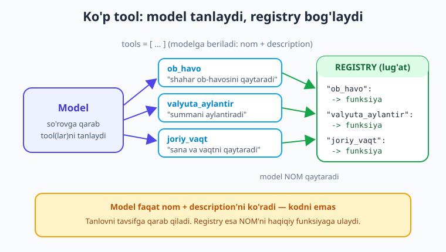
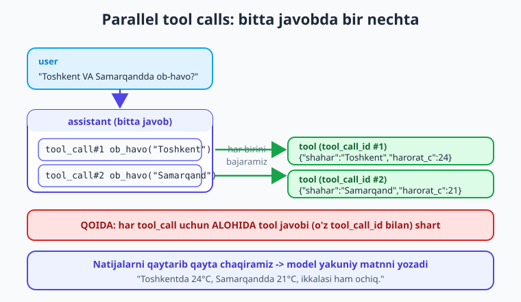

# 11 — Tool calling chuqur va ko'p qadamli

[⬅️ Oldingi: 10 — Function/tool calling asoslari](./10-tool-calling-asoslari.md) · [🏠 Kitob boshi](./README.md) · [Keyingi: 12 — Multimodal: rasm va ovoz ➡️](./12-multimodal-rasm-ovoz.md)

> **Bu bobda:** 10-bobda bitta tool bilan tanishdik; endi **bir nechta tool** beramiz va modelning qaysi birini (yoki bir nechtasini) tanlashini ko'ramiz. **Parallel tool calls** — bitta javobda bir nechta `tool_calls` kelganda hammasini bajarib, natijalarni qaytarishni o'rganamiz. Eng muhimi — **ko'p qadamli `while` loop** quramiz: model tool chaqiradi -> biz bajaramiz -> model yana chaqirishi mumkin -> ... -> nihoyat yakuniy matn. Tartibli bajarish uchun **tool registry** (lug'at) ishlatamiz, xavfsiz kalkulyator (`eval` ISHLATMASDAN), soxta DB va HTTP API misollarini yozamiz, `tool_choice`ni boshqaramiz va tool xatosini modelga **natija sifatida** qaytarishni ko'ramiz.

---

## Muammodan boshlaymiz: bitta tool yetmaydi

10-bobda modelga bitta `ob_havo` tool berdik va u shu toolni chaqirdi. Lekin haqiqiy yordamchi bitta ish bilan cheklanmaydi. Foydalanuvchi shunday yozishi mumkin:

> "Toshkentda ob-havo qanday va 12500 so'mni dollarga aylantirsang qancha bo'ladi?"

Bu yerda model **ikkita** har xil ishni qilishi kerak: ob-havoni olish **va** valyuta hisoblash. Yoki boshqa savol:

> "Toshkent va Samarqandda ob-havo qanday?"

Bu — **bitta** tool (`ob_havo`), lekin **ikki marta** chaqirilishi kerak. An'anaviy "bitta so'rov -> bitta tool -> bitta javob" sxemasi buni qoplay olmaydi. Bizga kerak:

1. Modelga **bir nechta tool** berish va u o'zi tanlashi.
2. **Parallel** chaqiruvlarni qo'llab-quvvatlash (bitta javobda bir nechta tool).
3. **Ko'p qadamli loop** — model tool natijasini ko'rib, yana tool chaqirishi mumkin (masalan, avval shaharni topadi, keyin o'sha shahar ob-havosini so'raydi).

> **Hayotiy o'xshatish.** Bitta tool bergan model — bitta tugmasi bor pultga o'xshaydi. Ko'p tool + loop bergan model esa — to'la asboblar yashigi bor **usta**: u qaysi asbobni, qachon, necha marta ishlatishni o'zi qaror qiladi va oxirida sizga tayyor natijani beradi.

---

## Bir nechta tool: model qaysini tanlaydi

Modelga tool ro'yxatini berasiz — u har bir so'rovda qaysi biri(lari) mosligini o'zi hal qiladi. Keling, uchta tool tasvirini tayyorlaymiz: ob-havo, valyuta, soatni bilish.

```python
tools = [
    {
        "type": "function",
        "function": {
            "name": "ob_havo",
            "description": "Berilgan shahar uchun joriy ob-havoni qaytaradi.",
            "parameters": {
                "type": "object",
                "properties": {
                    "shahar": {"type": "string", "description": "Shahar nomi, masalan 'Toshkent'"}
                },
                "required": ["shahar"],
            },
        },
    },
    {
        "type": "function",
        "function": {
            "name": "valyuta_aylantir",
            "description": "Summani bir valyutadan boshqasiga aylantiradi.",
            "parameters": {
                "type": "object",
                "properties": {
                    "summa": {"type": "number", "description": "Aylantiriladigan miqdor"},
                    "dan": {"type": "string", "description": "Manba valyuta kodi, masalan 'UZS'"},
                    "ga": {"type": "string", "description": "Maqsad valyuta kodi, masalan 'USD'"},
                },
                "required": ["summa", "dan", "ga"],
            },
        },
    },
    {
        "type": "function",
        "function": {
            "name": "joriy_vaqt",
            "description": "Hozirgi sana va vaqtni qaytaradi.",
            "parameters": {"type": "object", "properties": {}},
        },
    },
]
```

Modelga "Toshkentda ob-havo qanday?" desangiz — u faqat `ob_havo`ni tanlaydi; "soat necha?" desangiz — `joriy_vaqt`ni; "qanaqasan?" desangiz — **hech qaysi toolni tanlamay**, oddiy matn bilan javob beradi. Tanlovni model **tavsiflar (`description`) asosida** qiladi — shuning uchun tavsifni aniq yozing.



> **Hayotiy o'xshatish.** Tool ro'yxati — restoran menyusi: model (mijoz) menyuni ko'radi va buyurtmasiga mos taom(lar)ni tanlaydi. `description` — menyudagi taom tavsifi; u qancha aniq bo'lsa, mijoz shuncha to'g'ri tanlaydi.

!!! tip "description — bu modelning ko'zi"
    Model tool kodini ko'rmaydi — u faqat **nom**, **description** va **parameters** sxemasini ko'radi. "Berilgan shahar uchun joriy ob-havoni qaytaradi" kabi aniq tavsif — to'g'ri tanlovning kalitidir. "ob-havo" kabi quruq tavsif modelni adashtiradi.

---

## Tool registry: nom -> funksiya lug'ati

Model bizga `ob_havo` degan **matnli nom** qaytaradi. Biz uni haqiqiy Python funksiyasiga bog'lashimiz kerak. Buni `if/elif` zanjiri bilan qilish mumkin, lekin tool ko'paysa — chigallashadi. Toza yo'l — **registry** (lug'at):

```python
import json
import datetime

# --- Haqiqiy funksiyalar ---
def ob_havo(shahar: str) -> dict:
    # Demo: haqiqiy loyihada bu yerda HTTP API chaqiriladi
    soxta = {"Toshkent": 24, "Samarqand": 21, "Buxoro": 27}
    return {"shahar": shahar, "harorat_c": soxta.get(shahar, 20), "holat": "ochiq"}

def valyuta_aylantir(summa: float, dan: str, ga: str) -> dict:
    kurslar = {("UZS", "USD"): 1 / 12600, ("USD", "UZS"): 12600}
    kurs = kurslar.get((dan, ga))
    if kurs is None:
        return {"xato": f"{dan}->{ga} kursi mavjud emas"}
    return {"natija": round(summa * kurs, 2), "valyuta": ga}

def joriy_vaqt() -> dict:
    return {"vaqt": datetime.datetime.now().strftime("%Y-%m-%d %H:%M")}

# --- Registry: model qaytaradigan NOM -> haqiqiy funksiya ---
REGISTRY = {
    "ob_havo": ob_havo,
    "valyuta_aylantir": valyuta_aylantir,
    "joriy_vaqt": joriy_vaqt,
}
```

Endi modeldan kelgan har qanday tool chaqiruvini **bitta umumiy kod** bilan bajaramiz — nom bo'yicha registry'dan funksiyani topamiz:

```python
def tool_ni_bajar(tool_call) -> str:
    """Bitta tool_call'ni bajaradi va natijani JSON-matn qaytaradi."""
    nom = tool_call.function.name
    funksiya = REGISTRY.get(nom)
    if funksiya is None:
        return json.dumps({"xato": f"noma'lum tool: {nom}"})
    try:
        args = json.loads(tool_call.function.arguments)
        natija = funksiya(**args)
    except Exception as e:
        # Xatoni model ko'rishi uchun NATIJA sifatida qaytaramiz (pastda batafsil)
        natija = {"xato": str(e)}
    return json.dumps(natija, ensure_ascii=False)
```

> **Hayotiy o'xshatish.** Registry — telefon kitobchasi: model ism (`"ob_havo"`) aytadi, siz kitobchadan raqamni (funksiyani) topib, qo'ng'iroq qilasiz. Yangi tool qo'shish — kitobchaga bitta qator qo'shishdek oson.

!!! note "Nega registry, if/elif emas?"
    `if nom == "ob_havo": ... elif nom == "valyuta_aylantir": ...` — 3 ta toolda ishlaydi, lekin 15 ta tool bilan o'qib bo'lmaydigan zanjirga aylanadi. Registry lug'ati esa **ma'lumot** — yangi tool = bitta funksiya + bitta lug'at yozuvi. Bajarish kodi (`tool_ni_bajar`) hech qachon o'zgarmaydi.

---

## Parallel tool calls: bitta javobda bir nechta

"Toshkent va Samarqandda ob-havo qanday?" so'raganda zamonaviy modellar bitta javobda **ikkita** `tool_call` qaytaradi — har biri alohida shahar uchun. Bu **parallel tool calls** deyiladi. Muhim qoida: javobda nechta `tool_call` bo'lsa, **hammasini bajarib**, har biri uchun **alohida** `tool` xabarini (o'sha `tool_call_id` bilan) tarixga qo'shishingiz shart. Bittasini tashlab ketsangiz — model "javobsiz qoldi" deb xato beradi.



```python
msg = resp.choices[0].message

if msg.tool_calls:
    msgs.append(msg)  # assistant navbati — BARCHA tool_calls bilan, bir marta
    # Javobdagi HAR BIR tool_call'ni bajaramiz (parallel chaqiruvlar)
    for tc in msg.tool_calls:
        natija = tool_ni_bajar(tc)
        msgs.append({
            "role": "tool",
            "tool_call_id": tc.id,   # qaysi chaqiruvga javob ekanini bog'laydi
            "content": natija,
        })
    # Endi natijalar bilan modelni qayta chaqiramiz
    resp = client.chat.completions.create(model=MODEL, messages=msgs, tools=tools)
```

!!! warning "Har tool_call uchun ALOHIDA javob shart"
    Eng keng tarqalgan xato — model 2 ta tool chaqirgan, siz faqat 1 tasini bajarib javob qaytargansiz. Natijada `tool_call_id`lardan biri javobsiz qoladi va API `400` xato beradi. Qoida: `for tc in msg.tool_calls:` bilan **hammasini** aylanib chiqing va har biriga `tool` xabari qaytaring.

!!! tip "Parallelni o'chirish"
    Agar toollaringiz bir-biriga bog'liq bo'lsa (biri ikkinchisining natijasiga muhtoj) va parallel chaqiruv chalkashlik tug'dirsa, `parallel_tool_calls=False` parametri bilan modelni bir vaqtda bitta tool chaqirishga majburlash mumkin. Odatda kerak emas — ko'pchilik holatda parallel tezroq.

---

## Ko'p qadamli loop: agentning yuragi

Hozir biz **ikki qadam** qildik: (1) model tool chaqirdi, (2) natijani berib qayta chaqirdik. Lekin model ikkinchi chaqiruvda **yana** tool so'rashi mumkin! Masalan: avval `joriy_vaqt`ni so'rab, keyin o'sha sanaga qarab `ob_havo`ni chaqiradi. Demak, bizga **qat'iy "ikki qadam" emas, sikl kerak**: model tool chaqirsa — bajaramiz va qaytaramiz; tool chaqirmasa (oddiy matn bersa) — to'xtaymiz.


```python
def agent_javobi(savol: str, maks_qadam: int = 5) -> str:
    msgs = [
        {"role": "system", "content": "Sen yordamchisan. Kerak bo'lsa toollardan foydalan."},
        {"role": "user", "content": savol},
    ]
    for qadam in range(maks_qadam):           # QADAM LIMITI — cheksiz siklga qarshi
        resp = client.chat.completions.create(
            model=MODEL, messages=msgs, tools=tools,
        )
        msg = resp.choices[0].message

        # TO'XTASH SHARTI: tool chaqirilmadi -> bu yakuniy javob
        if not msg.tool_calls:
            return msg.content

        # Aks holda: barcha tool_call'larni bajaramiz
        msgs.append(msg)
        for tc in msg.tool_calls:
            natija = tool_ni_bajar(tc)
            msgs.append({"role": "tool", "tool_call_id": tc.id, "content": natija})
        # Sikl yana boshiga qaytadi -> model natijalarni ko'rib davom etadi

    return "Qadam limiti tugadi (model yakunlay olmadi)."
```

Ishlatish:

```python
print(agent_javobi("Toshkent va Samarqandda ob-havo qanday? Hozir soat necha?"))
# Model: ob_havo(Toshkent) + ob_havo(Samarqand) + joriy_vaqt ni chaqiradi (parallel),
# natijalarni oladi, keyin hammasini birlashtirib o'zbekcha matn yozadi -> loop tugaydi
```

Bu **20 qatordan kichik kod** — aslida eng sodda **agent**. 18-bobda buni ReAct nuqtai nazaridan kengaytiramiz, lekin yadrosi aynan shu: *model -> tool -> natija -> model -> ... -> javob*.

> **Hayotiy o'xshatish.** Loop — oshpaz bilan suhbat. Siz "palov qil" deysiz; oshpaz "guruch bormi?" (tool) so'raydi, siz javob berasiz; u "go'sht qancha?" (yana tool) so'raydi, siz aytasiz; nihoyat u "tayyor!" (yakuniy javob) deydi. Har savol oldingi javobga tayanadi — shuning uchun *qat'iy ikki qadam emas, sikl* kerak.

!!! warning "Qadam limitisiz — cheksiz sikl xavfi"
    Agar model (yoki tool xatosi) doimo tool chaqiraversa, limitisiz loop **cheksiz** ishlaydi va pulingizni yeydi. Doim `maks_qadam` qo'ying (odatda 5-10 yetarli). Limitga yetganda chiroyli to'xtang, foydalanuvchiga xabar bering.

---

## Real tool misol: xavfsiz kalkulyator (`eval` ISHLATMANG)

Model matematikada xato qiladi (1-bob), shuning uchun hisob-kitobni toolga topshiramiz. Vasvasaga uchib `eval(ifoda)` yozmang — bu **xavfli**: model (yoki foydalanuvchi orqali) `__import__('os').system('rm -rf ...')` kabi zararli matn yuborsa, kodingiz uni bajaradi. To'g'ri yo'l — `ast` moduli bilan **faqat ruxsat etilgan amallarni** baholash:

```python
import ast
import operator

# Ruxsat etilgan amallar — boshqa hech narsa bajarilmaydi
AMALLAR = {
    ast.Add: operator.add, ast.Sub: operator.sub,
    ast.Mult: operator.mul, ast.Div: operator.truediv,
    ast.Pow: operator.pow, ast.USub: operator.neg,
}

def _bahola(tugun):
    if isinstance(tugun, ast.Constant):           # son
        if not isinstance(tugun.value, (int, float)):
            raise ValueError("faqat sonlar")
        return tugun.value
    if isinstance(tugun, ast.BinOp):              # a + b, a * b ...
        return AMALLAR[type(tugun.op)](_bahola(tugun.left), _bahola(tugun.right))
    if isinstance(tugun, ast.UnaryOp):            # -a
        return AMALLAR[type(tugun.op)](_bahola(tugun.operand))
    raise ValueError("ruxsat etilmagan ifoda")

def kalkulyator(ifoda: str) -> dict:
    """'2 + 3 * 4' kabi matematik ifodani XAVFSIZ hisoblaydi."""
    try:
        natija = _bahola(ast.parse(ifoda, mode="eval").body)
        return {"natija": natija}
    except Exception as e:
        return {"xato": f"hisoblab bo'lmadi: {e}"}
```

Bu funksiya faqat `+ - * / ** -` amallarini biladi; har qanday boshqa narsa (funksiya chaqiruvi, import, o'zgaruvchi) `ValueError` beradi. Registryga qo'shish — bir qator: `REGISTRY["kalkulyator"] = kalkulyator` (va `tools` ro'yxatiga mos tasvir).

!!! warning "eval/exec — tool ichida HECH QACHON"
    Modeldan kelgan matnni `eval()`, `exec()` yoki `os.system()`ga to'g'ridan-to'g'ri uzatish — eng xavfli xatolardan biri. Model "ishonchli" emas: u foydalanuvchi matnini takrorlashi yoki manipulyatsiya qilinishi mumkin. Doim aniq, cheklangan amallar (`ast`, oq ro'yxat) ishlating. Xavfsizlikni 24-bobda chuqur ko'ramiz.

---

## Real tool misol: soxta DB va HTTP API

Toollar tashqi dunyoga "ko'prik" — ular bazaga so'rov yuboradi yoki API chaqiradi. Mana ikki amaliy shakl. Avval **soxta DB so'rovi** (haqiqiy loyihada SQL bo'ladi):

```python
# Demo "baza" — haqiqiy loyihada bu SQLite/Postgres so'rovi bo'ladi
_MIJOZLAR = {
    "1001": {"ism": "Ali", "buyurtmalar": 3, "shahar": "Toshkent"},
    "1002": {"ism": "Vali", "buyurtmalar": 0, "shahar": "Buxoro"},
}

def mijoz_malumoti(mijoz_id: str) -> dict:
    """ID bo'yicha mijoz ma'lumotini bazadan oladi."""
    mijoz = _MIJOZLAR.get(mijoz_id)
    if mijoz is None:
        return {"xato": f"{mijoz_id} ID'li mijoz topilmadi"}   # xatoni qaytaramiz
    return mijoz
```

Endi **HTTP API** chaqiradigan tool (`requests` bilan, qisqa). E'tibor bering: tarmoq xatosini ham natija sifatida qaytaramiz, modelni "yiqitmaymiz":

```python
import requests

def valyuta_kursi(dan: str, ga: str) -> dict:
    """Ochiq API'dan real valyuta kursini oladi."""
    url = f"https://api.exchangerate.host/convert?from={dan}&to={ga}"
    try:
        r = requests.get(url, timeout=10)
        r.raise_for_status()
        return {"kurs": r.json().get("result")}
    except requests.RequestException as e:
        return {"xato": f"tarmoq xatosi: {e}"}
```

> **Hayotiy o'xshatish.** Tool — modelning "qo'li": LLM o'zi bazaga kira olmaydi, internetga chiqa olmaydi, hisoblay olmaydi (aniq emas). Tool bu qo'lni beradi — model "nima qilishni" aytadi, qo'l (sizning kodingiz) "qilib beradi".

!!! tip "Tool ichida har doim timeout va xato boshqaruvi"
    HTTP/DB toollarida `timeout` qo'ying va xatoni `try/except` bilan ushlang. Tashqi xizmat ishlamay qolsa, tool *exception* otmasligi, balki `{"xato": ...}` qaytarishi kerak — shunda model muammoni ko'rib, foydalanuvchiga chiroyli xabar beradi (pastda batafsil).

---

## `tool_choice`: model tool ishlatishini boshqarish

Standart holatda `tool_choice="auto"` — model **o'zi** hal qiladi: tool kerakmi yoki oddiy matnmi. Lekin ba'zan boshqacha xulq kerak:

```python
# 1) auto (standart): model o'zi tanlaydi — tool YOKI matn
resp = client.chat.completions.create(model=MODEL, messages=msgs,
    tools=tools, tool_choice="auto")

# 2) required: model SHART tool chaqirsin (matn javob berolmaydi)
resp = client.chat.completions.create(model=MODEL, messages=msgs,
    tools=tools, tool_choice="required")

# 3) aniq tool: aynan SHU tool chaqirilsin
resp = client.chat.completions.create(model=MODEL, messages=msgs, tools=tools,
    tool_choice={"type": "function", "function": {"name": "ob_havo"}})

# 4) none: tool umuman ishlatilmasin (faqat matn)
resp = client.chat.completions.create(model=MODEL, messages=msgs,
    tools=tools, tool_choice="none")
```

Qachon ishlatiladi? `required` — ma'lumotni doim bazadan olishni xohlasangiz (model "o'zidan to'qib" qo'ymasin). Aniq tool — bitta qat'iy qadamni majburlash (masalan, formani har doim `saqla` tooli bilan yozdirish). `none` — modelni vaqtincha "tool'siz" rejimga o'tkazish.

!!! note "auto — eng ko'p ishlatiladigani"
    Ko'pchilik holatda `auto` to'g'ri: model "qanaqasan?"ga matn, "soat necha?"ga `joriy_vaqt` bilan javob beradi. `required`ni faqat haqiqatan kerak bo'lganda ishlating — aks holda model "salom"ga ham toolni zo'rlab chaqirib, g'alati ishlaydi.

---

## Tool xatosini natija sifatida qaytarish

Diqqat qiling: yuqoridagi barcha toollarda xato yuz berganda biz **exception otmadik**, balki `{"xato": "..."}` lug'atini **qaytardik**. Bu — ataylab. Sababi: modelga xatoni *natija* sifatida bersangiz, u xatoni **o'qiydi va qayta urinadi** yoki foydalanuvchiga tushuntiradi. Agar funksiya exception otib loopni yiqitsa — model bunday "o'rganish" imkonidan mahrum bo'ladi.

```python
# YOMON: exception loop'ni yiqitadi, model xatoni ko'rmaydi
def ob_havo(shahar):
    return TASHQI_API[shahar]   # KeyError -> butun loop qulaydi

# YAXSHI: xatoni model ko'radigan NATIJA qilib qaytaramiz
def ob_havo(shahar):
    if shahar not in TASHQI_API:
        return {"xato": f"'{shahar}' shahri topilmadi. To'g'ri nom yuboring."}
    return TASHQI_API[shahar]
```

Misol oqimi: foydalanuvchi shahar nomini xato yozsa ("Toshkennt"), tool `{"xato": "... topilmadi"}` qaytaradi; model buni ko'rib, **o'zi** to'g'rilab `ob_havo("Toshkent")`ni qayta chaqiradi yoki foydalanuvchidan aniqlik so'raydi. Loop davom etadi — chunki `tool_ni_bajar` ichidagi `try/except` ham xatoni JSON qilib qaytaradi.

> **Hayotiy o'xshatish.** Xatoni natija qilib qaytarish — ustaga "bu vint mos kelmadi" deb aytishdek: usta boshqa vintni sinab ko'radi. Agar siz unga baqirsangiz (exception) va ustaxonani yopib qo'ysangiz — ish to'xtaydi.

!!! tip "Xato xabarini foydali yozing"
    `{"xato": "xato"}` emas — `{"xato": "'Toshkennt' topilmadi. To'g'ri yozing, masalan: Toshkent"}` kabi **modelga nima qilishni aytadigan** xabar yozing. Model bu maslahatni o'qib, o'zini to'g'rilaydi. Xato xabari ham — promptning bir qismi.

---

## Xavfsizlik: tool argumentlarini validatsiya qilish

Model `arguments`ni **o'zi to'qiydi** — ya'ni ular foydalanuvchi (yoki manipulyatsiya) ta'sirida bo'lishi mumkin. Shuning uchun toolni bajarishdan **oldin** argumentlarni tekshiring. Bir nechta qatlam:

```python
def fayl_oqi(yol: str) -> dict:
    import os
    RUXSAT_PAPKA = os.path.abspath("hujjatlar")        # faqat shu papka
    toliq = os.path.abspath(os.path.join(RUXSAT_PAPKA, yol))
    # Validatsiya: papkadan tashqariga chiqishga yo'l qo'ymaymiz (path traversal)
    if not toliq.startswith(RUXSAT_PAPKA + os.sep):
        return {"xato": "ruxsat etilmagan yo'l"}
    if not os.path.isfile(toliq):
        return {"xato": "fayl topilmadi"}
    with open(toliq, encoding="utf-8") as f:
        return {"matn": f.read()[:2000]}               # uzunlikni cheklash
```

Asosiy qoidalar: (1) toollarni **eng kam imtiyoz** bilan yozing — faqat zarur ishni qilsin; (2) **destruktiv** amallar (o'chirish, to'lov, email yuborish) uchun model qaroriga ko'r-ko'rona ishonmang, kerak bo'lsa **inson tasdig'i** so'rang; (3) `summa < 0`, mavjud bo'lmagan ID kabi noto'g'ri argumentlarni **rad eting** (natija sifatida xato qaytaring).

!!! warning "Model argumentlari — ishonchsiz kirish (untrusted input)"
    Tool argumentlarini xuddi foydalanuvchi formasidan kelgan ma'lumotdek ko'ring: hech qachon ishonmang, doim validatsiya qiling. SQL toolda — parametrli so'rov (SQL injection'dan himoya), fayl toolda — yo'lni tekshirish, summa toolda — chegara. Bularning hammasini 24-bobda (xavfsizlik) batafsil ko'rib chiqamiz.

---

## Boshqa provayderlar: bir xil g'oya

Yuqoridagi kod OpenAI-mos (OpenAI, Groq, DeepSeek, Ollama...) uchun. **Claude** va **Gemini**da format biroz farq qiladi, lekin g'oya bir xil: ko'p tool berasiz, model bir nechtasini (parallel) chaqirishi mumkin, siz natijalarni qaytarib loopda davom etasiz.

```python
# Claude (Anthropic) — tool natijasini user navbatida, tool_result blok bilan qaytarasiz:
import anthropic
client = anthropic.Anthropic()
resp = client.messages.create(
    model="claude-sonnet-4-6", max_tokens=1024,
    tools=[{"name": "ob_havo", "description": "...",
            "input_schema": {"type": "object",
                "properties": {"shahar": {"type": "string"}}, "required": ["shahar"]}}],
    messages=msgs,
)
# Javobda block.type == "tool_use" bloklarini topib bajarasiz, keyin
# {"role": "user", "content": [{"type": "tool_result", "tool_use_id": ..., "content": ...}]}
```

!!! note "Model nomlari o'zgaradi"
    Bu kitobdagi model nomlari (`gpt-5.4-mini`, `claude-sonnet-4-6`, `gemini-2.5-flash`...) — yozilish paytidagi holat. Nomlar tez-tez yangilanadi; loyiha boshlashdan oldin **provayderning joriy model ro'yxatini** tekshiring. Tool calling g'oyasi esa o'zgarmaydi.

---

## Xulosa

- Modelga **bir nechta tool** berasiz; u har bir so'rovga qarab birini, bir nechtasini yoki hech qaysisini **`description` asosida** tanlaydi — tavsifni aniq yozing.
- **Tool registry** (`{"nom": funksiya}` lug'ati) modeldan kelgan matnli nomni haqiqiy funksiyaga bog'laydi; yangi tool = bitta funksiya + bitta lug'at yozuvi, bajarish kodi o'zgarmaydi.
- **Parallel tool calls**: bitta javobda bir nechta `tool_calls` kelishi mumkin — **hammasini** bajaring va har biriga o'z `tool_call_id` bilan **alohida** `tool` xabari qaytaring (bittasini tashlasangiz — `400` xato).
- **Ko'p qadamli `while`/`for` loop** — agentning yuragi: model tool chaqiradi -> bajarasiz -> qaytarasiz -> model **yana** chaqirishi mumkin -> ... To'xtash sharti: `tool_calls` yo'q (yakuniy matn) yoki **qadam limiti**ga yetish.
- **Qadam limiti** (`maks_qadam`) shart — cheksiz sikl va keraksiz xarajatning oldini oladi.
- Real toollar: **xavfsiz kalkulyator** (`eval` emas, `ast` + oq ro'yxat), **DB so'rovi**, **HTTP API** (timeout + `try/except` bilan).
- `tool_choice`: `auto` (standart, model hal qiladi), `required` (shart tool), aniq tool (majburlash), `none` (faqat matn).
- Tool xatosini **exception emas, `{"xato": "..."}` natija** sifatida qaytaring — model uni o'qib qayta urinadi yoki tushuntiradi. Xato xabarini foydali yozing.
- Model argumentlari — **ishonchsiz kirish**: bajarishdan oldin validatsiya qiling (eng kam imtiyoz, destruktiv amalga inson tasdig'i). Batafsil — 24-bob.

## Amaliy mashqlar

1. **(Oson)** 3 ta tool (`ob_havo`, `valyuta_aylantir`, `joriy_vaqt`) va ularning `REGISTRY` lug'atini yozing. "Soat necha?" deb so'rang va modelning faqat `joriy_vaqt`ni tanlaganini, "qanaqasan?"ga esa **hech qaysi tool**ni chaqirmay matn bilan javob berganini kuzating.

2. **(Oson)** "Toshkent va Samarqandda ob-havo qanday?" deb so'rang. Modelning bitta javobda nechta `tool_call` qaytarganini chop eting (`len(msg.tool_calls)`). Har birining `function.arguments`ini ham ko'ring.

3. **(O'rtacha)** Bobdagi `agent_javobi` loopini yozing va `maks_qadam=5` qo'ying. Har qadamda qaysi tool(lar) chaqirilganini va argumentlarini `print` qiling — model qanday "fikrlayotganini" kuzating.

4. **(O'rtacha)** `ast` asosidagi xavfsiz `kalkulyator` toolini yozing. Uni registry va `tools`ga qo'shing. "(125 + 75) * 3 necha bo'ladi?" deb so'rang. Keyin atayin `__import__('os')` kabi xavfli ifoda yuborib, toolingiz uni rad etganini (`{"xato": ...}`) tekshiring.

5. **(Qiyin)** `mijoz_malumoti` (soxta DB) toolini yozib, mavjud bo'lmagan ID uchun `{"xato": "topilmadi"}` qaytaring. Loopda shunday savol bering: "1001 va 9999 ID'li mijozlarni solishtir." Model topilmagan ID xatosini ko'rib, javobida buni qanday tushuntirganini kuzating. So'ng `tool_choice="required"`ga o'zgartirib, xulqning qanday o'zgarganini yozing.

---

[⬅️ Oldingi: 10 — Function/tool calling asoslari](./10-tool-calling-asoslari.md) · [🏠 Kitob boshi](./README.md) · [Keyingi: 12 — Multimodal: rasm va ovoz ➡️](./12-multimodal-rasm-ovoz.md)
