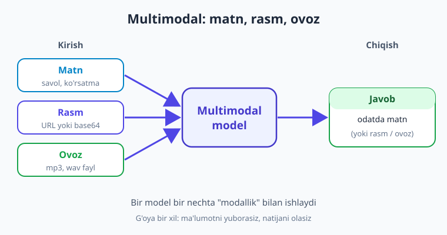
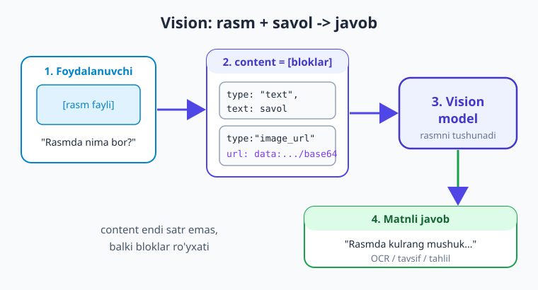
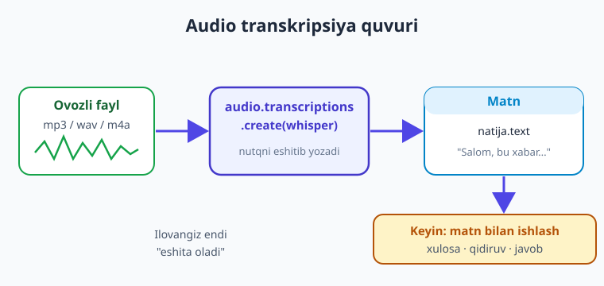

# 12 — Multimodal: rasm va ovoz

[⬅️ Oldingi: 11 — Tool calling chuqur va ko'p qadamli](./11-tool-calling-chuqur.md) · [🏠 Kitob boshi](./README.md) · [Keyingi: 13 — Embeddings va semantik qidiruv ➡️](./13-embeddings-semantik-qidiruv.md)

> **Bu bobda:** modelning faqat matn emas, balki **rasm** va **ovoz** bilan ham ishlay olishini ko'ramiz. **Vision** — rasmni modelga yuborib, "rasmda nima bor?", hujjat/chekni o'qish (OCR), grafik tahlil qilishni o'rganamiz (`image_url` blok: lokal rasmni **base64**'ga o'girish yoki to'g'ridan-to'g'ri http URL). **Audio transkripsiya** — ovozli faylni Whisper bilan matnga aylantiramiz; **TTS** — matndan ovoz yaratamiz; **rasm generatsiya**ga qisqacha to'xtalamiz. Provayder farqlarini (OpenAI-mos, Claude native, Gemini native) va rasm tokenga aylangani uchun **narx** masalasini ham ko'ramiz.

---

## Muammodan boshlaymiz: dunyo faqat matndan iborat emas

Hozirgacha biz modelga faqat **matn** yubordik va matn oldik. Lekin haqiqiy ilovalarda foydalanuvchi ko'pincha rasm yuklaydi yoki gapiradi:

- Mijoz chekning suratini yuboradi — "shu xaridni kategoriyaga ajrat".
- Foydalanuvchi mahsulot rasmini tashlaydi — "buning tavsifini yoz".
- Kimdir ovozli xabar yuboradi — uni matnga aylantirib, javob yozish kerak.
- Botga "menga ko'k osmonli tog' rasmini chiz" deyiladi.

Buni `if/else` bilan hal qilib bo'lmaydi — rasmni "tushunish" yoki ovozni "eshitish" kerak. Mana shu yerda **multimodal** modellar yordamga keladi.

**Multimodal** degani — model bir nechta "modallik" (matn, rasm, ovoz, video) bilan ishlay oladi. Bir model rasmni *tushunadi*, boshqasi ovozni matnga *aylantiradi*, yana biri matndan rasm *yaratadi*. Asosiy g'oya o'sha-o'sha: siz API'ga ma'lumotni yuborasiz va natijani olasiz — faqat endi kirish yoki chiqish matndan boshqa narsa bo'lishi mumkin.



> **Hayotiy o'xshatish.** Oddiy matnli model — faqat **xat o'qiy oladigan** kotib kabi. Multimodal model esa — xatni o'qiydigan, suratga qaraydigan va telefondagi ovozli xabarni tinglaydigan **ko'p qirrali yordamchi**. Unga rasm ko'rsatsangiz ham, gapirib bersangiz ham — mazmunini ilg'aydi.

!!! note "Har model hammasini qila olmaydi"
    "Multimodal" — umumiy atama. Ayrim model faqat **rasmni tushunadi** (vision), boshqasi faqat **ovozni transkripsiya qiladi**, uchinchisi **rasm yaratadi**. Vazifaga mos modelni tanlash kerak. Pastda har biri uchun mos model nomlarini ko'rsatamiz. Eslatma: model nomlari tez o'zgaradi — provayder ro'yxatini tekshiring.

---

## Vision: rasmni tushunish

**Vision** (ko'rish) — modelga rasm + savol yuborib, matnli javob olish. Bu eng ko'p ishlatiladigan multimodal imkoniyat. Foydali holatlari:

- **Rasmda nima bor** — sahna tavsifi, obyektlarni sanash.
- **OCR (matn o'qish)** — chek, hujjat, skrinshot, qo'lyozmadan matn ajratib olish.
- **Grafik/diagramma tahlili** — jadval yoki grafikdan xulosa chiqarish.
- **Mahsulot tavsifi** — surat asosida marketing matni yozish.

Vision'da `messages` ichidagi `content` endi oddiy satr emas, balki **bloklar ro'yxati**: matn bloki va rasm bloki birga yuboriladi.



### Rasmni qanday yuborish: URL yoki base64

Rasmni modelga ikki yo'l bilan berasiz:

1. **http URL** — rasm internetda ochiq joylashgan bo'lsa (eng oson).
2. **base64** — rasm sizning kompyuteringizda (lokal fayl) bo'lsa, uni `data:` URL ko'rinishida kodlab yuborasiz.

Avval URL bilan eng oddiy misol:

```python
import os
from dotenv import load_dotenv
from openai import OpenAI

load_dotenv()
client = OpenAI()

# Eslatma: vision'ni qo'llaydigan modelni tanlang. Nomlar o'zgaradi —
# provayder ro'yxatini tekshiring.
MODEL = "gpt-5.4-mini"

javob = client.chat.completions.create(
    model=MODEL,
    messages=[
        {
            "role": "user",
            "content": [
                {"type": "text", "text": "Bu rasmda nima tasvirlangan? Qisqa ayt."},
                {
                    "type": "image_url",
                    "image_url": {"url": "https://example.com/mushuk.jpg"},
                },
            ],
        }
    ],
)
print(javob.choices[0].message.content)
```

E'tibor bering: `content` — endi **ro'yxat**. Ichida ikki blok: `text` (savol) va `image_url` (rasm). Bitta xabarda bir nechta rasm ham yuborishingiz mumkin — har biri alohida `image_url` bloki sifatida.

### Lokal rasmni base64'ga o'girib yuborish (to'liq misol)

Aksar holatda rasm sizning diskingizda bo'ladi. Uni `base64` bilan kodlab, `data:image/...;base64,...` ko'rinishidagi URL yasaymiz:

```python
import base64
import os
from dotenv import load_dotenv
from openai import OpenAI

load_dotenv()
client = OpenAI()
MODEL = "gpt-5.4-mini"   # vision'ni qo'llaydigan model

def rasmni_kodla(yol: str) -> str:
    """Lokal rasm faylini data: URL (base64) ko'rinishiga o'giradi."""
    with open(yol, "rb") as f:
        b64 = base64.b64encode(f.read()).decode("utf-8")
    # MIME turini fayl kengaytmasiga qarab tanlang: jpeg, png, webp...
    return f"data:image/jpeg;base64,{b64}"

data_url = rasmni_kodla("chek.jpg")

javob = client.chat.completions.create(
    model=MODEL,
    messages=[
        {
            "role": "user",
            "content": [
                {"type": "text", "text":
                    "Bu chek. Do'kon nomi, sana va umumiy summani ajratib ber."},
                {"type": "image_url", "image_url": {"url": data_url}},
            ],
        }
    ],
)
print(javob.choices[0].message.content)
```

Bu — amaliy OCR misoli: chek suratidan strukturali ma'lumot (do'kon, sana, summa) chiqaramiz. Natijani **JSON** ko'rinishida olishni xohlasangiz, 9-bobdagi `response_format` yoki Pydantic'ni shu yerda birga ishlatishingiz mumkin — vision va strukturali natija bemalol qo'shiladi.

> **Hayotiy o'xshatish.** base64 — rasmni **matnli pochta** orqali yuborishga o'xshaydi. Rasm — baytlar to'plami; uni matn kanalidan (API so'rovi JSON) o'tkazish uchun "harflar"ga (base64 satriga) aylantiramiz. Model uni qabul qilib, yana rasmga "ochib" ko'radi.

!!! tip "URL vs base64 — qaysi biri?"
    Rasm allaqachon internetda ochiq bo'lsa — **URL** soddaroq va so'rovni yengillashtiradi. Rasm lokal yoki maxfiy bo'lsa — **base64**. Katta rasmlarni yuborishdan oldin o'lchamini kichraytiring (masalan, eni 1024px): bu narxni va tezlikni yaxshilaydi (sababini pastda "narx" bo'limida ko'ramiz).

!!! warning "Modeldan ko'rmaganini so'ramang"
    Vision model rasmni tushunadi, lekin **mukammal emas**. Mayda matn (juda kichik shrift), qiyshiq skanlar yoki murakkab jadvallarda xato qilishi mumkin (1-bobdagi *hallucination* shu yerda ham bor). Muhim hujjatlar (hisob-faktura, shartnoma) uchun natijani **tekshiring** yoki ixtisoslashgan OCR bilan solishtiring.

---

## Audio transkripsiya: ovozdan matnga

Ikkinchi keng tarqalgan ehtiyoj — **ovozni matnga aylantirish** (speech-to-text). Foydalanuvchi ovozli xabar yuboradi yoki suhbat yoziladi, siz uni matnga o'girib, qolgan ishni (xulosa, javob, qidiruv) matn bilan qilasiz.

OpenAI-mos SDK'da buning uchun alohida endpoint bor — `client.audio.transcriptions.create`. Modeli odatda **Whisper**:

```python
import os
from dotenv import load_dotenv
from openai import OpenAI

load_dotenv()
client = OpenAI()

# Audio faylni ochib, transkripsiya so'raymiz
with open("xabar.mp3", "rb") as f:
    natija = client.audio.transcriptions.create(
        model="whisper-1",   # transkripsiya modeli; nomlar o'zgaradi
        file=f,
    )

print(natija.text)   # ovozdagi nutqning matni
```

Qaytgan `natija.text` — faylda aytilgan gaplarning matni. Whisper ko'p tilni (jumladan o'zbekchani) ma'lum darajada qo'llab-quvvatlaydi va tilni odatda **avtomatik** aniqlaydi. Qabul qilinadigan formatlar: `mp3`, `wav`, `m4a`, `ogg` va boshqalar.



> **Hayotiy o'xshatish.** Transkripsiya — **stenografist** kabi: u tinglaydi va eshitganini yozib boradi. Sizning ilovangiz endi "eshita oladi" — qolganini esa o'rgangan matn-ko'nikmalaringiz (xulosa, tasnif, javob) bilan davom ettirasiz.

!!! tip "Ovoz -> matn -> model = kuchli birikma"
    Transkripsiyani boshqa boblardagi narsalar bilan **zanjirlang**: ovozni matnga aylantiring, so'ng o'sha matnni odatdagi `chat.completions` so'roviga yuborib, xulosa qildiring yoki savolga aylantiring. Masalan, yig'ilish yozuvini transkripsiya qilib, keyin "asosiy qarorlarni 5 bandda ber" deb so'rang.

---

## TTS: matndan ovoz

Teskari yo'nalish — **matndan ovoz** yaratish (text-to-speech, TTS). Bot javobini o'qib berish yoki audio kontent yaratish uchun foydali. OpenAI-mos SDK'da:

```python
from pathlib import Path
import os
from dotenv import load_dotenv
from openai import OpenAI

load_dotenv()
client = OpenAI()

natija = client.audio.speech.create(
    model="gpt-4o-mini-tts",   # TTS modeli; nomlar o'zgaradi
    voice="alloy",             # ovoz turi (provayderda bir nechtasi bor)
    input="Salom! Bu matn ovozga aylantirildi.",
)

# Natijani audio faylga saqlaymiz
natija.stream_to_file(Path("javob.mp3"))
print("javob.mp3 saqlandi")
```

Natija — audio fayl (mp3). Uni foydalanuvchiga yuborasiz yoki ijro etasiz. `voice` parametri bilan ovoz tovushini tanlaysiz (provayderda bir nechta variant bo'ladi).

!!! note "To'liq ovozli sikl"
    Transkripsiya + chat + TTS'ni birlashtirsangiz, **to'liq ovozli yordamchi** chiqadi: foydalanuvchi gapiradi -> transkripsiya matn beradi -> model javob yozadi -> TTS uni ovozga aylantiradi -> foydalanuvchi eshitadi. Uchchala qism — uchta oddiy API chaqiruvi.

---

## Rasm generatsiya (qisqacha)

Matndan **rasm yaratish** ham bor — bu "image generation". Bu kitobning asosiy yo'nalishi emas, shuning uchun eslatma darajasida ko'rsatamiz. OpenAI-mos SDK'da:

```python
javob = client.images.generate(
    model="gpt-image-1",                 # rasm generatsiya modeli; nomlar o'zgaradi
    prompt="Quyosh botayotgan tog' manzarasi, akvarel uslubida",
    size="1024x1024",
)
print(javob.data[0].url)   # yaratilgan rasm URL (yoki base64, model sozlamasiga qarab)
```

Gemini ham matndan rasm yarata oladi (`generate_content` bilan, rasm chiqaradigan model orqali). Rasm generatsiya — alohida, keng mavzu; bu yerda faqat "shunday imkoniyat bor" deb bilib qo'yish kifoya.

!!! warning "Rasm generatsiya — nozik mavzu"
    Yaratilgan rasmlarni ishlatishda **mualliflik huquqi**, **brend** va **noto'g'ri kontent** masalalariga e'tibor bering. Ishlab chiqarish (production) ilovasida natijani filtrlash va provayder qoidalarini o'qish zarur.

---

## Provayder farqlari: Claude va Gemini native

Yuqoridagi misollar **OpenAI-mos** formatda edi (OpenAI, ko'p hollarda Groq-mos endpointlar va h.k.). Endi Claude va Gemini'ning **native** vision sintaksisini ko'ramiz — ular biroz boshqacha.

### Anthropic (Claude) — `image` blok + base64

Claude'da rasm bloki `type: "image"` deyiladi va manba (`source`) ichida base64 beriladi:

```python
import base64
import anthropic

client = anthropic.Anthropic()   # ANTHROPIC_API_KEY

with open("rasm.jpg", "rb") as f:
    b64 = base64.b64encode(f.read()).decode("utf-8")

resp = client.messages.create(
    model="claude-sonnet-4-6",   # vision'ni qo'llaydi; nomlar o'zgaradi
    max_tokens=1024,             # Claude'da SHART
    messages=[
        {
            "role": "user",
            "content": [
                {
                    "type": "image",
                    "source": {
                        "type": "base64",
                        "media_type": "image/jpeg",
                        "data": b64,
                    },
                },
                {"type": "text", "text": "Rasmda nima bor?"},
            ],
        }
    ],
)
print(resp.content[0].text)
```

Farqni payqang: blok turi `image` (OpenAI'da `image_url`), base64 esa `source` ichida `media_type` bilan alohida beriladi. Javob esa Claude uslubida — `resp.content[0].text`.

### Google Gemini — `contents` ga rasm qo'shish

Gemini native SDK'da (`google-genai`) rasmni `contents` ro'yxatiga to'g'ridan-to'g'ri qo'shasiz:

```python
from google import genai
from google.genai import types

client = genai.Client()   # GEMINI_API_KEY

with open("rasm.jpg", "rb") as f:
    rasm_baytlari = f.read()

resp = client.models.generate_content(
    model="gemini-2.5-flash",   # multimodal; nomlar o'zgaradi
    contents=[
        types.Part.from_bytes(data=rasm_baytlari, mime_type="image/jpeg"),
        "Bu rasmda nima tasvirlangan?",
    ],
)
print(resp.text)
```

Gemini'da rasm va matn shunchaki `contents` ro'yxatiga yonma-yon qo'yiladi. Ko'rib turibsiz: g'oya bir xil (rasm + savol -> javob), faqat har provayderning "qadoqlash" usuli farq qiladi.

!!! note "Esda tuting: g'oya bir, sintaksis har xil"
    Uch provayderda ham mantiq bir: **rasm + matnli savolni birga yuborasiz, model tushunib javob beradi**. Faqat bloklarni qanday nomlash va qadoqlash farqli. 4-bobdagi "ko'p provayder" yondashuvini eslang — bu yerda ham bir abstraksiya yozib, ichkarida provayderga mos formatga aylantirsa bo'ladi.

---

## Token va narx: rasm matndan qimmatroq

Muhim amaliy nuqta: **rasm ham tokenga aylanadi.** Model rasmni ichki tarzda "plitka"larga (patch) bo'lib, ularning har birini token sifatida hisoblaydi. Shuning uchun:

- Rasm yuborgan so'rov toza matnli so'rovdan **qimmatroq** bo'ladi.
- Rasm qancha **katta** (yuqori o'lcham) bo'lsa, shuncha ko'p token — shuncha qimmat.
- Audio transkripsiya odatda **vaqt** (daqiqa) bo'yicha narxlanadi, tokenga emas.

Amaliy maslahatlar:

- Rasmni kerakli o'lchamgacha **kichraytiring** (masalan, eni 1024px). Katta surat ko'pincha keraksiz — model baribir kichraytirib ko'radi.
- Bir so'rovda **kerakmas rasmlarni** yubormang.
- Vision bilan suhbat tarixini yuborganda (8-bob), eski rasmlarni qayta-qayta yuborish narxni keskin oshiradi — kerak bo'lmasa, ularni tashlab yuboring.

> **Hayotiy o'xshatish.** Rasm yuborish — xatga **og'ir rangli surat** ilova qilishga o'xshaydi: xat (matn) arzon, lekin har bir yuqori sifatli surat pochta narxini oshiradi. Shuning uchun suratni kichraytirib, faqat kerakligini ilova qilasiz.

!!! tip "Narxni oldindan o'lchang"
    Javob `usage` maydonida (OpenAI-mos'da `javob.usage`) so'rov necha token bo'lganini ko'rsatadi — rasmli va rasmsiz so'rovni solishtirib, farqni o'z ko'zingiz bilan ko'ring. Xarajatni hisoblash va kuzatishni 22-bobda chuqur o'rganamiz.

---

## Xulosa

- **Multimodal** model matn bilan birga **rasm va ovoz**ni ham tushunadi yoki yaratadi; lekin har model hamma narsani qila olmaydi — vazifaga mos modelni tanlang.
- **Vision** (rasmni tushunish): `content` endi **bloklar ro'yxati** — `text` + `image_url`. Rasmni **http URL** yoki lokal fayl uchun **base64** (`data:image/jpeg;base64,...`) bilan yuborasiz. Foydali holatlar: rasmda nima bor, OCR (chek/hujjat), grafik tahlili, mahsulot tavsifi.
- **Audio transkripsiya**: `client.audio.transcriptions.create(model="whisper-1", file=f)` ovozni matnga aylantiradi; natija `natija.text`da. Uni keyingi matnli so'rovlar bilan zanjirlash mumkin.
- **TTS**: `client.audio.speech.create(...)` matndan ovoz yasaydi; transkripsiya + chat + TTS = to'liq ovozli yordamchi.
- **Rasm generatsiya**: `client.images.generate(...)` (yoki Gemini `generate_content`) — eslatma darajasida; nozik (huquq/brend) mavzu.
- **Provayder farqlari**: OpenAI `image_url` blok; **Claude** `image` blok + `source` ichida base64 (`media_type` bilan); **Gemini** rasmni `contents` ro'yxatiga qo'shadi. G'oya bir xil, sintaksis har xil.
- **Narx**: rasm **tokenga aylanadi** — rasmli so'rov qimmatroq, katta rasm yana qimmatroq. Rasmni kichraytiring, keraksizini yubormang; `usage` bilan o'lchang.

## Amaliy mashqlar

1. **(Oson)** Internetdagi biror ochiq rasm URL'ini oling va `image_url` (URL) bilan modelga "rasmda nima bor?" deb so'rang. Javobni o'qing.

2. **(Oson)** Telefoningizdan biror chek yoki yozuvli surat oling, uni lokal saqlang va `rasmni_kodla` funksiyasi (base64) bilan modelga yuborib, undagi matnni o'qitib ko'ring (OCR).

3. **(O'rtacha)** Vision'ni 9-bob bilan birlashtiring: chek rasmidan `{"dokon": ..., "sana": ..., "summa": ...}` ko'rinishidagi **JSON** chiqaring (`response_format={"type":"json_object"}` yoki Pydantic). Natijani `json.loads` bilan tekshiring.

4. **(O'rtacha)** Qisqa ovozli fayl (mp3/wav) yozing yoki toping va `audio.transcriptions.create` bilan matnga aylantiring. So'ng o'sha matnni `chat.completions`ga yuborib, "asosiy fikrni bir jumlada ayt" deb xulosalating (transkripsiya -> model zanjiri).

5. **(Qiyin)** Bitta rasmni **ikkita provayderga** (masalan, OpenAI-mos va Gemini native) yuboring va javoblarini solishtiring. So'ng har ikki so'rovning token/narxini (`usage` yoki provayder konsolida) taqqoslab, qaysi biri arzonroq ekanini yozib qo'ying.

---

[⬅️ Oldingi: 11 — Tool calling chuqur va ko'p qadamli](./11-tool-calling-chuqur.md) · [🏠 Kitob boshi](./README.md) · [Keyingi: 13 — Embeddings va semantik qidiruv ➡️](./13-embeddings-semantik-qidiruv.md)
