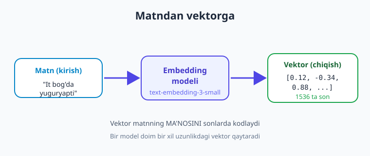
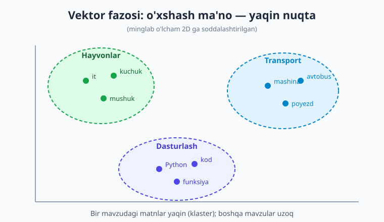
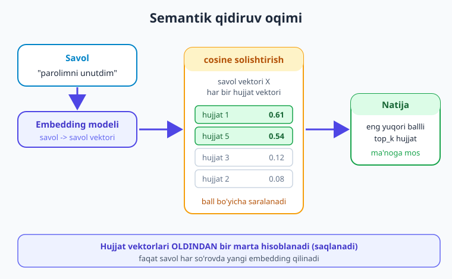

# 13 — Embeddings va semantik qidiruv

[⬅️ Oldingi: 12 — Multimodal: rasm va ovoz](./12-multimodal-rasm-ovoz.md) · [🏠 Kitob boshi](./README.md) · [Keyingi: 14 — Vektor bazalari ➡️](./14-vektor-bazalari.md)

> **Bu bobda:** matnni **sonlar ro'yxatiga (vektor)** aylantiradigan **embedding** nima ekanini, ma'no yaqin matnlar nega yaqin vektor olishini tushunamiz; vektor fazosi intuitsiyasini ("o'xshash ma'no — bir joyda klaster") ko'ramiz; `client.embeddings.create(...)` bilan embedding olishni, ikki matn o'xshashligini **cosine similarity** orqali o'lchashni o'rganamiz; kalit so'z emas, **ma'no** bo'yicha qidiradigan **semantik qidiruv**ning to'liq mini-misolini quramiz; **batch** embedding (bir so'rovda ko'p matn — arzon va tez), o'lcham (`dimensions`) va normalizatsiya haqida bilib olamiz. Bu bob — keyingi to'rt bob (**RAG**) ning poydevori.

---

## Muammodan boshlaymiz: kalit so'z qidiruv yetmaydi

Tasavvur qiling, sizda bilim bazasi bor — bir nechta yordam maqolasi. Foydalanuvchi savol beradi:

> "Parolimni unutib qo'ydim, nima qilay?"

An'anaviy qidiruv (masalan, `if "parol" in maqola`) faqat **bir xil so'z**ni topadi. Lekin to'g'ri maqola sarlavhasi "**Hisobga kirishni tiklash**" bo'lsa-chi? Unda "parol" so'zi umuman bo'lmasligi mumkin! Kalit so'z qidiruv bu yerda **hech narsa topmaydi**, garchi maqola aynan shu savolga javob bersa ham.

Muammoning ildizi: kalit so'z qidiruv **harflar**ni solishtiradi, **ma'no**ni emas. "Parolni tiklash" va "hisobga kirishni qaytarish" — bir xil ma'no, lekin bir xil so'z emas. Bizga **ma'no bo'yicha** qidiradigan vosita kerak.

Mana shu yerda **embedding** o'yinni o'zgartiradi. U har bir matnni **sonlar ro'yxati**ga aylantiradi shunday tarzdaki, **ma'nosi yaqin matnlar — yaqin sonlar** oladi. Endi "o'xshashlik"ni harf bilan emas, **matematika bilan** o'lchaymiz.

> **Hayotiy o'xshatish.** Kalit so'z qidiruv — kitobxonadan "muqovasida aynan shu so'z bor kitobni ber" deyish. Semantik qidiruv esa — kutubxonachiga **mavzuni** aytib, "shunga o'xshash kitoblarni ber" deyish. Birinchisi so'zga, ikkinchisi **ma'noga** qaraydi.

!!! note "Atama: embedding"
    **Embedding** (o'qiladi: "embedding", ya'ni "joylashtirish") — matnni (so'z, jumla yoki butun hujjatni) **belgilangan uzunlikdagi sonlar ro'yxatiga (vektorga)** aylantirish. Bu vektor matnning **ma'nosini** sonlarda "kodlaydi". Buni amalga oshiradigan model — **embedding modeli** (chat modelidan alohida).

---

## Vektor nima va vektor fazosi intuitsiyasi

**Vektor** — bu shunchaki sonlar ro'yxati, masalan `[0.12, -0.34, 0.88, ...]`. Embedding modeli har bir matnga shunday ro'yxat beradi. Bu ro'yxat odatda uzun — masalan, `text-embedding-3-small` modeli **1536 ta son** qaytaradi. Har bir son matnning ma'no "o'lchami"ning bir qirrasini ifodalaydi (qaysi qirra ekani aniq inson tiliga tarjima qilinmaydi — bu modelning ichki "tili").

Eng muhim g'oya: bu sonlarni **fazodagi nuqta** sifatida tasavvur qiling. 2 ta son bo'lsa — tekislikdagi nuqta (x, y). 3 ta son — uch o'lchovli fazo. Embedding'da minglab son bor — minglab o'lchovli fazo (uni tasavvur qilib bo'lmaydi, lekin matematika bir xil ishlaydi). Va shu fazoda:

- **Ma'nosi yaqin matnlar — yaqin nuqtalar** (klaster bo'lib to'planadi).
- **Ma'nosi uzoq matnlar — uzoq nuqtalar.**



Yuqoridagi diagramma bitta matn embedding modeliga kirib, sonlar vektori bo'lib chiqishini ko'rsatadi. Endi ko'p matnni shu fazoga joylashtirsak, ajoyib narsa yuz beradi: o'xshash mavzudagilar bir-biriga **yaqin** tushadi.



> **Hayotiy o'xshatish.** Vektor fazosi — ulkan kutubxona zali. Kitoblar tasodifan emas, **mavzu bo'yicha** javonlarga qo'yilgan: oshpazlik kitoblari bir burchakda, fizika kitoblari boshqa burchakda. Yangi kitob kelsa, uni mazmuniga qarab "to'g'ri javon"ga qo'yasiz. Embedding ham xuddi shunday — har matnga fazoda "manzil" beradi va o'xshashlar qo'shni bo'lib qoladi.

!!! tip "Mashhur misol: shoh − erkak + ayol ≈ malika"
    Embeddinglar ma'noni shunchalik yaxshi tutadiki, ular ustida **arifmetika** ham ishlaydi. Klassik misol: "shoh" vektoridan "erkak" vektorini ayirib, "ayol"ni qo'shsangiz — natija "malika" vektoriga juda yaqin chiqadi. Bu shuni ko'rsatadiki, fazodagi **yo'nalishlar** ma'no munosabatlarini (masalan, "jinsi") ifodalaydi. Bu — sodda intuitsiya; amalda biz asosan **yaqinlik**dan foydalanamiz.

---

## Embedding olish: `client.embeddings.create`

Chat so'rovini eslang (`client.chat.completions.create`). Embedding ham xuddi shunday oson — boshqa endpoint: `client.embeddings.create`. Sozlash 2-bobdagidek (`.env` + `python-dotenv`).

```python
import os
from dotenv import load_dotenv
from openai import OpenAI

load_dotenv()
client = OpenAI()   # OPENAI_API_KEY .env dan olinadi

# Embedding modeli — chat modelidan ALOHIDA model.
# Eslatma: model nomlari o'zgaradi — provayder ro'yxatini tekshiring.
EMBED_MODEL = "text-embedding-3-small"

javob = client.embeddings.create(
    model=EMBED_MODEL,
    input="It bog'da yuguryapti",   # bitta matn (yoki ro'yxat — pastda ko'ramiz)
)

vektor = javob.data[0].embedding   # list[float]
print(type(vektor), len(vektor))   # <class 'list'> 1536
print(vektor[:5])                  # masalan: [0.013, -0.027, 0.041, -0.008, 0.052]
```

Asosiy nuqtalar:

- **`input`** — matn (yoki matnlar ro'yxati). Javob `javob.data` ro'yxatida keladi: har bir kirish matniga bitta element.
- **`javob.data[i].embedding`** — i-chi matnning vektori, oddiy `list[float]`.
- **`len(vektor)`** — vektor o'lchami (`text-embedding-3-small` uchun 1536). Bir model doim **bir xil** o'lchamli vektor qaytaradi.

> **Hayotiy o'xshatish.** Chat modeli — matnga **matn** bilan javob beradigan suhbatdosh. Embedding modeli — matnga **raqamlar** bilan javob beradigan "tarjimon": u gapirmaydi, faqat matnni ma'no koordinatalariga aylantiradi. Ikkalasi ikki xil ish uchun.

!!! note "Embedding modeli ≠ chat modeli"
    `gpt-5.4-mini` — chat modeli, u matn yozadi. `text-embedding-3-small` — embedding modeli, u faqat vektor qaytaradi. Ularni almashtirib bo'lmaydi: chat modelidan vektor so'ramaysiz, embedding modelidan javob yozishini kutmaysiz.

---

## Cosine similarity: ikki vektor qanchalik yaqin?

Ikki matnning ma'nosi qanchalik yaqinligini bilish uchun ularning vektorlari orasidagi **yaqinlik**ni o'lchaymiz. Eng keng qo'llaniladigan o'lchov — **cosine similarity** (kosinus o'xshashligi): ikki vektor orasidagi **burchak**ka qaraydi.

- Natija **1.0** ga yaqin — vektorlar bir yo'nalishda, ma'no juda **o'xshash**.
- Natija **0** ga yaqin — bog'liq emas.
- Natija **manfiy** — qarama-qarshi (matnda kam uchraydi).

Formula sodda — ikki vektorning **skalyar ko'paytmasi**ni ularning uzunliklari ko'paytmasiga bo'lamiz:

$$\text{cosine}(A, B) = \frac{A \cdot B}{\lVert A\rVert \, \lVert B\rVert} = \frac{\sum_i A_i B_i}{\sqrt{\sum_i A_i^2}\,\sqrt{\sum_i B_i^2}}$$

Avval **sof Python**da (kutubxonasiz) yozamiz — formula ko'rinib tursin:

```python
import math

def cosine_similarity(a: list[float], b: list[float]) -> float:
    skalyar = sum(x * y for x, y in zip(a, b))      # A . B
    uzunlik_a = math.sqrt(sum(x * x for x in a))     # ||A||
    uzunlik_b = math.sqrt(sum(y * y for y in b))     # ||B||
    return skalyar / (uzunlik_a * uzunlik_b)
```

Amalda esa **numpy** ancha tez va qisqa (`pip install numpy`):

```python
import numpy as np

def cosine(a, b) -> float:
    a, b = np.array(a), np.array(b)
    return float(a @ b / (np.linalg.norm(a) * np.linalg.norm(b)))
```

Endi ikki matnning o'xshashligini hisoblaymiz:

```python
def embed(matn: str) -> list[float]:
    """Bitta matnni vektorga aylantiradi."""
    javob = client.embeddings.create(model=EMBED_MODEL, input=matn)
    return javob.data[0].embedding

v1 = embed("It bog'da yuguryapti")
v2 = embed("Kuchuk hovlida o'ynayapti")   # ma'nosi yaqin (it ≈ kuchuk)
v3 = embed("Python — dasturlash tili")    # ma'nosi uzoq

print(cosine(v1, v2))   # yuqori, masalan ~0.78
print(cosine(v1, v3))   # past, masalan ~0.09
```

Birinchi juftlik ("it" va "kuchuk") yuqori ball oladi — garchi **bironta ham bir xil so'z** bo'lmasa ham! Ikkinchisi past — mavzular butunlay boshqa. Aynan shu — embeddingning kuchi.

> **Hayotiy o'xshatish.** Cosine similarity — ikki kishi qaysi **yo'nalishga** qarab turganini solishtirish. Ikkalasi bir tomonga qarasa (burchak kichik) — fikrlari mos, ball ~1. Turli tomonga qarasa — ball past. Ular bir-biridan **qancha uzoqda** turgani emas, **qaysi tomonga** qaraganlari muhim.

!!! note "Cosine vs masofa"
    O'xshashlikni "masofa" (Euclidean) bilan ham o'lchash mumkin. Lekin matn embeddinglarida odatda **cosine** ishlatiladi, chunki u vektor **uzunligi**ga emas, **yo'nalishi**ga qaraydi — ma'no aynan yo'nalishda kodlangan. Keyingi bobdagi vektor bazalari ham asosan cosine'ni qo'llaydi.

---

## Semantik qidiruv: to'liq mini-misol

Endi hamma bo'laklarni yig'ib, **semantik qidiruv** quramiz. G'oya juda sodda:

1. Barcha hujjatlarni **oldindan** embedding qilamiz (bir marta).
2. Foydalanuvchi savolini **embedding** qilamiz.
3. Savol vektorini har bir hujjat vektori bilan **cosine** orqali solishtiramiz.
4. **Eng yuqori ball**li hujjat(lar)ni qaytaramiz.



To'liq ishlaydigan misol (kichik bilim bazasi ustida):

```python
import os
import numpy as np
from dotenv import load_dotenv
from openai import OpenAI

load_dotenv()
client = OpenAI()
EMBED_MODEL = "text-embedding-3-small"

# 1) Kichik bilim bazasi (hujjatlar)
hujjatlar = [
    "Parolni tiklash uchun 'Kirishni tiklash' tugmasini bosing va emailingizni kiriting.",
    "Buyurtmani bekor qilish uchun 'Mening buyurtmalarim' bo'limiga o'ting.",
    "Yetkazib berish odatda 3-5 ish kunini oladi.",
    "To'lovni karta yoki Payme orqali amalga oshirishingiz mumkin.",
    "Hisobingizga kira olmasangiz, emailga yuborilgan tiklash havolasidan foydalaning.",
]

def cosine(a, b) -> float:
    a, b = np.array(a), np.array(b)
    return float(a @ b / (np.linalg.norm(a) * np.linalg.norm(b)))

# 2) Hujjatlarni BIR SO'ROVDA embedding qilamiz (batch — pastda batafsil)
javob = client.embeddings.create(model=EMBED_MODEL, input=hujjatlar)
hujjat_vektorlari = [d.embedding for d in javob.data]

def semantik_qidiruv(savol: str, top_k: int = 2):
    """Savolga eng mos top_k hujjatni cosine bo'yicha qaytaradi."""
    savol_vektori = client.embeddings.create(
        model=EMBED_MODEL, input=savol
    ).data[0].embedding

    # Har bir hujjat bilan o'xshashlikni hisoblaymiz
    ballar = [
        (cosine(savol_vektori, hv), matn)
        for hv, matn in zip(hujjat_vektorlari, hujjatlar)
    ]
    # Ball bo'yicha kamayish tartibida saralaymiz
    ballar.sort(key=lambda x: x[0], reverse=True)
    return ballar[:top_k]

# 3) Sinab ko'ramiz
for ball, matn in semantik_qidiruv("parolimni unutib qo'ydim"):
    print(f"{ball:.3f}  {matn}")
```

Natija taxminan shunday bo'ladi:

```text
0.612  Parolni tiklash uchun 'Kirishni tiklash' tugmasini bosing va emailingizni kiriting.
0.541  Hisobingizga kira olmasangiz, emailga yuborilgan tiklash havolasidan foydalaning.
```

Diqqat qiling: savolda **"parol"** so'zi bor, lekin ikkinchi topilgan hujjatda u **umuman yo'q** — baribir topildi, chunki **ma'nosi yaqin** ("hisobga kirish", "tiklash"). Kalit so'z qidiruv buni hech qachon topa olmasdi. Mana shu — semantik qidiruvning amaliy kuchi.

!!! tip "Embeddinglarni qayta ishlatish"
    Hujjatlar vektorlarini **har safar qayta hisoblamang** — bu pul va vaqt. Bir marta embedding qilib, vektorlarni saqlang (faylga, bazaga). Faqat **savol**ni har so'rovda yangi embedding qilasiz. Kichik bazada ro'yxatda saqlash kifoya; kattalashganda — **vektor bazasi** kerak (aynan 14-bob shu haqida).

!!! warning "Bir xil model bilan embedding qiling"
    Hujjatlar va savolni **bitta xil embedding modeli** bilan vektorlashtiring. Turli modellar (yoki bir modelning turli `dimensions` sozlamasi) turli fazo yaratadi — ularning vektorlarini solishtirish **ma'nosiz** natija beradi. Modelni almashtirsangiz — **butun bazani qayta** embedding qiling.

---

## Batch embedding: bir so'rovda ko'p matn

Yuqorida sezgan bo'lsangiz, `input` ga **ro'yxat** berdik — bu **batch** (to'plamli) embedding. Bir nechta matnni **bitta so'rov**da yuborish — har biriga alohida so'rov yuborishdan ancha **tez va arzon** (tarmoq kechikishi bir marta, ko'p hollarda narx ham qulayroq).

```python
matnlar = ["birinchi matn", "ikkinchi matn", "uchinchi matn"]

javob = client.embeddings.create(model=EMBED_MODEL, input=matnlar)

# javob.data tartibi input tartibiga MOS keladi
for i, d in enumerate(javob.data):
    print(i, matnlar[i], "->", len(d.embedding), "o'lcham")

# Faqat vektorlar ro'yxatini olish:
vektorlar = [d.embedding for d in javob.data]
```

> **Hayotiy o'xshatish.** Batch embedding — pochtaga 100 ta xatni alohida-alohida emas, **bitta to'plamda** topshirish. Bir marta navbatda turasiz, bir marta to'lov — vaqt ham, kuch ham tejaladi. Natija aynan o'sha 100 ta xat.

!!! note "Tartib va chegara"
    `javob.data` har doim `input` ro'yxati **tartibida** keladi — `data[0]` birinchi matnga mos. Juda katta ro'yxat bo'lsa, uni **bo'laklarga** (masalan, 100 tadan) bo'lib yuboring: provayderda bir so'rovdagi matnlar soni va umumiy token chegarasi bor.

---

## O'lcham (`dimensions`) va normalizatsiya

**O'lcham (dimensions)** — vektordagi sonlar soni. Kattaroq o'lcham — ko'proq nuans, lekin ko'proq xotira va hisob. `text-embedding-3-small` standart **1536** o'lcham beradi, lekin ba'zi modellar uni **kichraytirishga** ruxsat beradi (sifat biroz pasayadi, tezlik/xotira yutadi):

```python
# Ba'zi modellar dimensions parametrini qo'llab-quvvatlaydi
javob = client.embeddings.create(
    model="text-embedding-3-small",
    input="qisqartirilgan vektor misoli",
    dimensions=512,   # 1536 o'rniga 512 — ixchamroq
)
print(len(javob.data[0].embedding))   # 512
```

**Normalizatsiya** — vektorni uzunligi 1 bo'ladigan qilib o'zgartirish (har sonni vektor uzunligiga bo'lish). Buni nega bilish kerak:

- **Cosine** allaqachon uzunlikka bo'lgani uchun, normallashtirilgan vektorlarda cosine = oddiy **skalyar ko'paytma** (`a @ b`) — tezroq.
- Ko'p **vektor bazalari** vektorlarni normallashgan deb kutadi yoki o'zi normallashtiradi. Ba'zi modellar (masalan, OpenAI) allaqachon ~normallangan vektor qaytaradi.

```python
import numpy as np

def normalize(v):
    v = np.array(v)
    return v / np.linalg.norm(v)

# Normallashgandan keyin cosine = skalyar ko'paytma
a, b = normalize(v1), normalize(v2)
print(float(a @ b))   # cosine(v1, v2) bilan deyarli bir xil
```

!!! tip "Boshlovchi uchun amaliy maslahat"
    Boshida `dimensions`/normalizatsiya bilan ovora bo'lmang — standart o'lchamni va yuqoridagi `cosine()` funksiyasini ishlating. Ular optimizatsiya (tezlik, xotira); avval **ishlaydigan** semantik qidiruvni quring, keyin kerak bo'lsa sozlaysiz.

---

## Boshqa provayderlar: Gemini va Ollama

Embeddinglar OpenAI'ga xos emas — boshqa provayderlar ham beradi. Asosiy g'oya (matn -> vektor -> cosine) **bir xil**; faqat model va ulanish o'zgaradi.

**Google Gemini** (OpenAI-mos endpoint orqali — kod deyarli o'zgarmaydi):

```python
client = OpenAI(
    base_url="https://generativelanguage.googleapis.com/v1beta/openai/",
    api_key=os.environ["GEMINI_API_KEY"],
)
javob = client.embeddings.create(
    model="gemini-embedding-001",   # Gemini embedding modeli
    input=["birinchi matn", "ikkinchi matn"],
)
vektorlar = [d.embedding for d in javob.data]
```

**Ollama** (lokal, bepul, internetsiz — `nomic-embed-text` modelini avval `ollama pull nomic-embed-text` bilan yuklab oling):

```python
import ollama

natija = ollama.embed(model="nomic-embed-text", input="It bog'da yuguryapti")
vektor = natija["embeddings"][0]   # list[float]
```

Lokal embedding ayniqsa **maxfiy ma'lumot** uchun qulay — matningiz kompyuteringizdan chiqmaydi va to'lov yo'q (21-bobda Ollama'ni batafsil ko'ramiz).

!!! warning "Modellar aralashmasin"
    Eslatib o'tamiz: bir bazadagi barcha vektorlar **bir xil model**dan bo'lishi shart. OpenAI'da embedding qilingan hujjatni Gemini bilan embedding qilingan savol bilan solishtirib bo'lmaydi — fazolar boshqa. Provayderni almashtirsangiz, **butun korpusni** qayta embedding qiling. Model nomlari ham o'zgaradi — provayder ro'yxatini tekshiring.

---

## Bu — RAG'ning poydevori

Tabriklaymiz: siz **RAG** (Retrieval-Augmented Generation — qidiruv bilan boyitilgan generatsiya) ning eng muhim bo'lagini o'zlashtirdingiz. Keyingi to'rt bob aynan shu g'oya ustiga quriladi:

- **14-bob — Vektor bazalari:** vektorlarni ro'yxatda emas, maxsus bazada (FAISS, Chroma...) saqlash; minglab hujjat ichidan **tez** qidirish.
- **15-bob — Chunking:** uzun hujjatni qanday bo'laklarga ("chunk") bo'lib embedding qilish.
- **16-bob — RAG quramiz:** topilgan hujjatlarni **kontekst** sifatida chat modeliga berib, manbaga asoslangan javob olish (hallucination'ni kamaytirish).
- **17-bob — RAG sifati:** qidiruvni yaxshilash, baholash, qayta tartiblash.

Bugun o'rgangan "matn -> vektor -> cosine -> eng yaqinini top" zanjiri — shularning hammasining **yuragi**.

> **Hayotiy o'xshatish.** Embedding — RAG binosining **poydevori**. Poydevor ko'rinmaydi, lekin ustidagi hamma narsa (vektor bazasi, chunking, kontekst, javob) unga tayanadi. Poydevorni mustahkam tushunsangiz — qolgan boblar ravon yotadi.

---

## Xulosa

- **Embedding** — matnni **belgilangan uzunlikdagi sonlar ro'yxatiga (vektorga)** aylantirish; ma'nosi yaqin matnlar — yaqin vektor oladi. U **ma'no**ni kodlaydi, harflarni emas.
- Vektorni **fazodagi nuqta** deb tasavvur qiling: o'xshash mavzudagilar **klaster** bo'lib to'planadi, uzoqlari uzoq tushadi. Ma'no fazodagi **yo'nalish**larda yashaydi (shoh − erkak + ayol ≈ malika).
- Embedding olish: `client.embeddings.create(model="text-embedding-3-small", input=...)`; vektor `javob.data[i].embedding` ichida (`list[float]`). Embedding modeli — chat modelidan **alohida**.
- **Cosine similarity** ikki vektor orasidagi burchakka qaraydi: 1 ga yaqin — o'xshash, 0 — bog'liq emas. Formula = skalyar ko'paytma / uzunliklar ko'paytmasi (sof Python yoki numpy bilan).
- **Semantik qidiruv:** hujjatlarni oldindan embedding qil -> savolni embedding qil -> har biri bilan cosine -> eng yuqori ballini qaytar. Kalit so'z bo'lmasa ham **ma'no** bo'yicha topadi.
- **Batch** (ro'yxat) embedding — bir so'rovda ko'p matn, tez va arzon; `javob.data` tartibi `input` tartibiga mos.
- **O'lcham (`dimensions`)** vektordagi sonlar soni; ba'zi modellar uni kichraytiradi. **Normalizatsiya** — uzunlikni 1 ga keltirish; cosine'ni skalyar ko'paytmaga aylantiradi.
- Hujjat va savolni **bir xil model** bilan embedding qiling — aks holda solishtirish ma'nosiz. Gemini (`gemini-embedding-001`), Ollama (`nomic-embed-text`, lokal) ham embedding beradi.
- Bu bob — **RAG** (14–17-boblar) ning poydevori: "matn -> vektor -> cosine -> eng yaqin" zanjiri ularning yuragi.

## Amaliy mashqlar

1. **(Oson)** `text-embedding-3-small` bilan bitta matnni embedding qiling va `len(vektor)` ni chop eting. Boshqa matnni ham qilib, ikkalasining uzunligi **bir xil** ekanini tasdiqlang.

2. **(Oson)** `cosine()` funksiyasini yozing (sof Python yoki numpy). "Olma — meva" va "Banan — meva" hamda "Olma — meva" va "Mashina — transport" juftliklarini embedding qilib, cosine'larini solishtiring. Qaysi juftlik yuqori ball oldi va nega?

3. **(O'rtacha)** Yuqoridagi `semantik_qidiruv` misolini oling, o'z bilim bazangizni (5–7 ta jumla) yozing va 3 ta turli savol bering. Topilgan natijalarning ma'noga mos kelishini baholang. `top_k` ni o'zgartirib ko'ring.

4. **(O'rtacha)** Hujjat vektorlarini bir marta hisoblab, JSON faylga saqlang (`json.dump`). Keyin alohida skript yozing: faylni o'qib, vektorlarni **qayta hisoblamasdan** savol bo'yicha qidirsin. Bu nima uchun arzonroq?

5. **(Qiyin)** Bitta korpusni `dimensions=1536` va `dimensions=512` bilan ikki marta embedding qiling (model qo'llab-quvvatlasa). Bir necha savol uchun ikkala variantning topilgan natijalarini va tezligini solishtiring. Sifat sezilarli pasaydimi? Ixchamlik (512) qachon foydali bo'lishi mumkin?

---

[⬅️ Oldingi: 12 — Multimodal: rasm va ovoz](./12-multimodal-rasm-ovoz.md) · [🏠 Kitob boshi](./README.md) · [Keyingi: 14 — Vektor bazalari ➡️](./14-vektor-bazalari.md)
