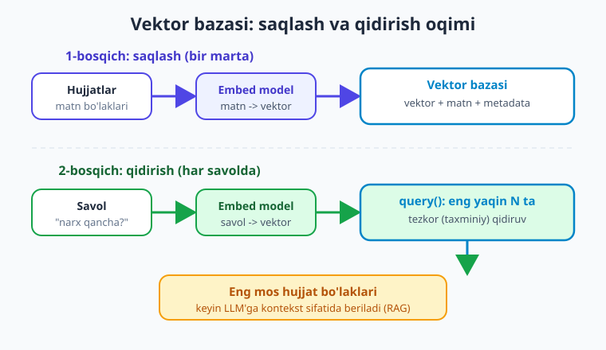
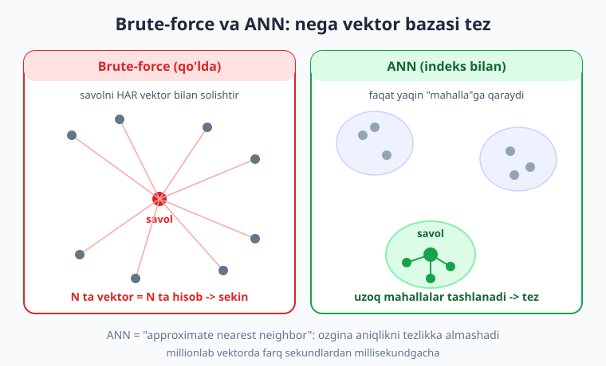
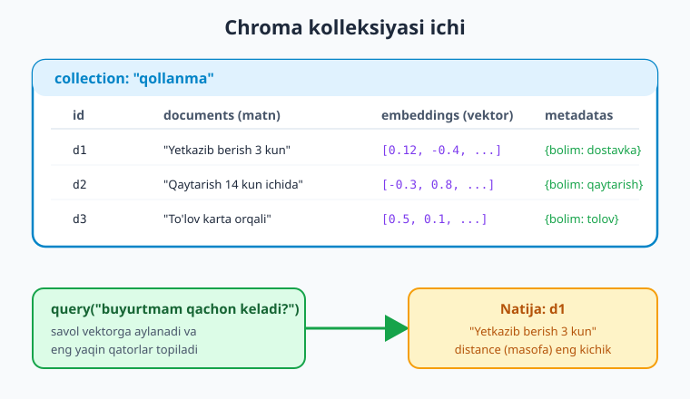

# 14 — Vektor bazalari

[⬅️ Oldingi: 13 — Embeddings va semantik qidiruv](./13-embeddings-semantik-qidiruv.md) · [🏠 Kitob boshi](./README.md) · [Keyingi: 15 — RAG: chunking va indekslash ➡️](./15-rag-chunking-indekslash.md)

> **Bu bobda:** 13-bobda matnni vektorga aylantirib, savolga eng yaqin matnni topishni o'rgandik — lekin buni qo'lda, har bir vektorni navbatma-navbat solishtirib qildik. Bu minglab hujjatda sekin va noqulay. Endi **vektor bazasi** bilan tanishamiz: u vektorlarni saqlaydi va savolga eng yaqinlarini **juda tez** (taxminiy — ANN) topadi. **Chroma**'ni (eng oddiy, lokal vektor bazasi) boshidan oxirigacha amalda ko'ramiz: kolleksiya yaratish, hujjat va vektor qo'shish, `query`, **metadata bilan filtrlash**, diskka saqlash. So'ng **pgvector** (mavjud Postgres bilan) va **FAISS** (ulkan, lokal) qachon kerakligini, oxirida esa qaysi vaziyatda qaysi bazani tanlashni bilib olamiz.

---

## Muammodan boshlaymiz: qo'lda solishtirish miqyosga chidamaydi

13-bobda semantik qidiruvni o'z qo'limiz bilan qurdik. Bir nechta hujjatni embed qildik, savolni ham embed qildik, keyin **har bir** hujjat vektori bilan savol vektori orasidagi o'xshashlikni hisoblab, eng yaqinini topdik:

```python
# 13-bobdagi yondashuv (eslatma): hammasini qo'lda solishtirish
import numpy as np

def oxshashlik(a, b):
    a, b = np.array(a), np.array(b)
    return a @ b / (np.linalg.norm(a) * np.linalg.norm(b))

# Har bir hujjat uchun o'xshashlikni hisoblaymiz — N ta hisob
ballar = [(i, oxshashlik(savol_vektor, h)) for i, h in enumerate(hujjat_vektorlari)]
ballar.sort(key=lambda x: x[1], reverse=True)
eng_yaqin = ballar[0]
```

Bu 5 ta hujjat uchun mukammal ishlaydi. Lekin 50 000 hujjat (yoki ularning bo'laklari) bo'lsa-chi? Har bir savolda **50 000 ta** o'xshashlik hisoblash kerak — bu sekin. Yana: vektorlarni qayerda saqlaysiz? Har gal dasturni qayta ishga tushirganda hammasini qaytadan embed qilasizmi (pul va vaqt sarfi)? Metadata bo'yicha filtrlash (masalan, "faqat 2025-yil hujjatlari ichidan qidir") kerak bo'lsa-chi?

Mana shu uch muammoni — **tezlik**, **saqlash** va **filtrlash** — **vektor bazasi** hal qiladi.

> **Hayotiy o'xshatish.** Qo'lda solishtirish — kutubxonada kerakli kitobni topish uchun **har bir javondagi har bir kitobni** birma-bir qo'lga olib o'qishga o'xshaydi. Vektor bazasi esa — **kataloglashtirilgan kutubxona**: kitoblar mavzu bo'yicha javonlarga ajratilgan, indeks bor, shuning uchun kerakligini soniyalarda topasiz. Ko'proq kitob bo'lsa ham, qidiruv tez qoladi.

!!! note "Atama: vektor bazasi"
    **Vektor bazasi (vector database)** — vektorlarni (embeddinglarni) saqlash va ular orasidan berilgan vektorga **eng yaqinlarini** tez topish uchun maxsus qurilgan ma'lumotlar bazasi. Oddiy SQL bazasi "qiymati X ga teng qatorlar"ni topadi; vektor bazasi esa "ma'no jihatdan eng yaqin qatorlar"ni topadi.



Diagrammada ikki bosqich ko'rinadi: **saqlash** (hujjatlarni bir marta embed qilib bazaga joylaysiz) va **qidirish** (har savolda savolni embed qilib, eng yaqin bo'laklarni olasiz). Bu ikkalasi RAG'ning poydevori — keyingi boblar shu ustiga quriladi.

---

## ANN: nega vektor bazasi tez?

Vektor bazasining siri — u **hamma vektorni solishtirmaydi**. U **ANN** (Approximate Nearest Neighbor — taxminiy eng yaqin qo'shni) algoritmidan foydalanadi.

"Brute-force" (qo'pol kuch) usuli savolni har bir vektor bilan solishtiradi — aniq, lekin sekin: N ta vektor = N ta hisob. ANN esa vektorlarni oldindan **indeks**laydi (masalan, o'zaro yaqinlarini "mahalla"larga guruhlaydi). Qidirishda u faqat eng istiqbolli mahallalarga qaraydi, uzoqlarini umuman tekshirmaydi. Natijada millionlab vektorda ham qidiruv millisekundlar ichida bajariladi.



"Approximate" (taxminiy) so'zi muhim: ANN ba'zan **eng** yaqin vektorni o'tkazib yuborishi mumkin (masalan, 100 dan 98-99 tasini to'g'ri topadi). Buning evaziga u o'nlab-yuzlab marta tezroq ishlaydi. Amaliyotda bu kelishuv deyarli har doim o'zini oqlaydi — RAG uchun "eng yaqin 5 ta"ning 4-5 tasi to'g'ri bo'lishi yetarli.

> **Hayotiy o'xshatish.** Brute-force — shaharda do'stingiznikiga borish uchun **har bir uyning eshigini taqillatib** so'rash. ANN — avval kerakli **mahalla**ga borib, faqat o'sha yerdagi bir nechta uyni tekshirish. Ba'zan adashib qo'shni uyga kirib qolishingiz mumkin (taxminiy), lekin manzilga ancha tez yetasiz.

!!! tip "Indeks turlari"
    ANN'ning bir nechta algoritmi bor: **HNSW** (eng keng tarqalgan, tez va aniq), **IVF**, **PQ** va boshqalar. Yaxshi xabari — Chroma kabi bazalar buni **o'zi** boshqaradi, siz indeks ichki ishlashini bilishingiz shart emas. Faqat "ANN tufayli tez" degan tushuncha yetarli.

---

## Chroma: eng oddiy boshlanish

**Chroma** — Python'da vektor bazasini boshlashning eng oson yo'li. U lokal ishlaydi, alohida server o'rnatish shart emas, va API'si juda sodda. Boshlovchi uchun ideal.

O'rnatamiz:

```bash
pip install chromadb
```

### Eng kichik ishlaydigan misol

Avval xotirada (vaqtinchalik) ishlaydigan eng oddiy variantni ko'ramiz. Bu yerda Chroma'ning o'z ichki embed funksiyasidan foydalanamiz — ya'ni matn beramiz, u o'zi vektorga aylantiradi:

```python
import chromadb

# Xotirada ishlaydigan mijoz (dastur tugashi bilan ma'lumot yo'qoladi)
client = chromadb.Client()

# Kolleksiya — bu vektorlar saqlanadigan "jadval"
collection = client.create_collection(name="qollanma")

# Hujjatlarni qo'shamiz. Embedding bermadik — Chroma O'ZI embed qiladi.
collection.add(
    documents=[
        "Yetkazib berish odatda 3 ish kuni ichida amalga oshiriladi.",
        "Mahsulotni 14 kun ichida qaytarib, pulni qaytarib olishingiz mumkin.",
        "To'lov bank kartasi yoki naqd pul orqali qabul qilinadi.",
    ],
    ids=["d1", "d2", "d3"],   # har hujjatga noyob id SHART
)

# Savol beramiz — Chroma savolni ham o'zi embed qilib, eng yaqinini topadi
natija = collection.query(
    query_texts=["Buyurtmam qachon yetib keladi?"],
    n_results=2,
)
print(natija["documents"])
# [['Yetkazib berish odatda 3 ish kuni ichida ...', 'To'lov bank kartasi ...']]
```

E'tibor bering: savolda "yetkazib berish" so'zi **yo'q** ("qachon yetib keladi" dedik), lekin Chroma baribir to'g'ri hujjatni topdi — chunki qidiruv **ma'no** bo'yicha, kalit so'z bo'yicha emas. Bu — 13-bobdagi semantik qidiruvning aynan o'zi, lekin endi bir necha qator kod bilan.

> **Hayotiy o'xshatish.** `create_collection` — yangi, bo'sh **shkaf** olish. `add` — hujjatlarni shkafga **yorliqlab joylash** (Chroma har birining "barmoq izi" — vektorini avtomatik chiqaradi). `query` — shkafga "menga shunga o'xshashini ber" deyish; u eng mos papkalarni qaytaradi.



!!! warning "id noyob bo'lishi shart"
    Har bir hujjatning `id`si **noyob** bo'lishi kerak. Agar mavjud `id` bilan yana `add` qilsangiz, Chroma ogohlantirish beradi va qo'shmaydi. Yangilash uchun `collection.upsert(...)` (bor bo'lsa yangilaydi, yo'q bo'lsa qo'shadi) yoki `collection.update(...)` ishlating.

---

## O'z embeddingingizni berish

Yuqorida Chroma matnni o'zi embed qildi. Lekin amaliy loyihalarda ko'pincha **o'z embed modelingiz**ni (masalan, OpenAI'ning `text-embedding-3-small`) ishlatishni xohlaysiz — sifati yuqori, ko'p tilli va siz nazorat qilasiz. Bu holda vektorni **siz** hisoblab, Chroma'ga tayyor holda berasiz.

```python
import os
import chromadb
from dotenv import load_dotenv
from openai import OpenAI

load_dotenv()
oai = OpenAI()                       # OPENAI_API_KEY .env dan
EMBED_MODEL = "text-embedding-3-small"   # nomlar o'zgaradi — provayder ro'yxatini tekshiring

def embed(matnlar: list[str]) -> list[list[float]]:
    """Matnlar ro'yxatini vektorlar ro'yxatiga aylantiradi."""
    javob = oai.embeddings.create(model=EMBED_MODEL, input=matnlar)
    return [d.embedding for d in javob.data]

client = chromadb.Client()
collection = client.create_collection(name="qollanma2")

hujjatlar = [
    "Yetkazib berish odatda 3 ish kuni ichida amalga oshiriladi.",
    "Mahsulotni 14 kun ichida qaytarib, pulni qaytarib olishingiz mumkin.",
    "To'lov bank kartasi yoki naqd pul orqali qabul qilinadi.",
]

# Vektorni O'ZIMIZ hisoblab, embeddings sifatida beramiz
collection.add(
    documents=hujjatlar,
    embeddings=embed(hujjatlar),     # <- tayyor vektorlar
    ids=["d1", "d2", "d3"],
)

# Qidirishda ham savolni O'ZIMIZ embed qilamiz va query_embeddings beramiz
savol = "Buyurtmam qachon yetib keladi?"
natija = collection.query(
    query_embeddings=embed([savol]),     # query_texts EMAS, query_embeddings
    n_results=2,
)
for hujjat, masofa in zip(natija["documents"][0], natija["distances"][0]):
    print(f"[masofa={masofa:.3f}] {hujjat}")
```

Asosiy farq: o'z embeddingingizni berganda `query_texts` o'rniga **`query_embeddings`** ishlatasiz. Muhim qoida: **saqlashda qaysi model bilan embed qilsangiz, qidirishda ham aynan o'sha model** bilan embed qiling — aks holda vektorlar bir "tilda" bo'lmaydi va natija bema'ni chiqadi.

!!! note "distances — masofa, o'xshashlik emas"
    Chroma `distances` (masofa) qaytaradi: **kichikroq masofa = yaqinroq = o'xshashroq**. Bu 13-bobdagi kosinus o'xshashlikning aksi: u yerda kattaroq ball yaxshi edi, bu yerda kichikroq masofa yaxshi. Adashmang.

---

## Metadata va filtrlash

Vektor bazasining kuchli tomoni — har bir hujjatga **metadata** (qo'shimcha ma'lumot: bo'lim, sana, manba, til...) biriktirib, qidirishda u bo'yicha **filtrlash**. Masalan, "faqat 'dostavka' bo'limidagi hujjatlar ichidan ma'no bo'yicha eng yaqinini top".

```python
collection.add(
    documents=hujjatlar,
    embeddings=embed(hujjatlar),
    ids=["d1", "d2", "d3"],
    metadatas=[
        {"bolim": "dostavka", "yil": 2025},
        {"bolim": "qaytarish", "yil": 2025},
        {"bolim": "tolov", "yil": 2024},
    ],
)

# where bilan filtr: faqat 'dostavka' bo'limidan qidir
natija = collection.query(
    query_embeddings=embed(["qachon keladi?"]),
    n_results=2,
    where={"bolim": "dostavka"},      # metadata filtri
)

# Sonli shartlar ham mumkin: 2025-yildan keyingilar
natija = collection.query(
    query_embeddings=embed(["qachon keladi?"]),
    n_results=2,
    where={"yil": {"$gte": 2025}},    # $gte = >=, yana $gt $lt $lte $ne $in $nin
)
```

`where` filtri **avval** metadata bo'yicha hujjatlarni cheklaydi, **keyin** qolganlari ichidan vektor bo'yicha eng yaqinini topadi. Bu ham tezlikka, ham aniqlikka foyda: noto'g'ri bo'limdagi hujjatlar umuman ko'rib chiqilmaydi.

> **Hayotiy o'xshatish.** Metadata filtri — kutubxonada "faqat 2025-yil, faqat tibbiyot bo'limidan" deb javonni oldindan toraytirish. Shundan keyingina "mavzuga eng yaqin kitob"ni qidirasiz. Avval to'g'ri javonga borasiz, keyin javon ichidan tanlaysiz.

!!! tip "Hujjat matnida ham qidirish: where_document"
    Metadata'dan tashqari, hujjat **matni** ichida aniq so'z bo'yicha ham filtrlash mumkin: `where_document={"$contains": "qaytarish"}`. Buni vektor qidiruvi bilan birga ishlatib, "ma'no bo'yicha yaqin VA tarkibida 'qaytarish' so'zi bor" hujjatlarni topasiz.

---

## Diskka saqlash: PersistentClient

`chromadb.Client()` ma'lumotni faqat xotirada saqlaydi — dastur tugashi bilan hamma vektor yo'qoladi. Amaliy loyihada buni qayta-qayta embed qilish (pul va vaqt sarfi) o'rniga **diskka saqlash** kerak. Buning uchun `PersistentClient` ishlatasiz:

```python
import chromadb

# Ma'lumot shu papkaga saqlanadi va keyingi ishga tushirishda o'qiladi
client = chromadb.PersistentClient(path="./chroma_db")

# Bor bo'lsa oladi, yo'q bo'lsa yaratadi — qayta ishga tushirishda qulay
collection = client.get_or_create_collection(name="qollanma")

# Faqat birinchi marta to'ldiramiz (keyin diskda turadi)
if collection.count() == 0:
    collection.add(
        documents=hujjatlar,
        embeddings=embed(hujjatlar),
        ids=["d1", "d2", "d3"],
    )

print("Bazadagi hujjatlar soni:", collection.count())
```

Endi dastur qayta ishga tushganda `./chroma_db` papkasidagi vektorlar o'qiladi — qaytadan embed qilish shart emas. `get_or_create_collection` va `count()` tekshiruvi tufayli to'ldirish faqat bir marta bajariladi.

!!! warning "chroma_db papkasini .gitignore ga qo'shing"
    `./chroma_db` — bu ma'lumotlar bazasi fayllari. Uni GitHub'ga yuklamang (`.gitignore`ga qo'shing). Embeddinglar katta hajmli bo'lishi mumkin, va ular kodning bir qismi emas — kerak bo'lsa qayta generatsiya qilinadi.

---

## pgvector: mavjud Postgres bilan

Agar loyihangizda **allaqachon PostgreSQL** ishlatilayotgan bo'lsa, alohida vektor bazasi qo'shish o'rniga **pgvector** kengaytmasidan foydalanish mantiqiy. U Postgres'ga `vector` ma'lumot turini va vektor qidiruvini qo'shadi — vektorlaringiz oddiy SQL jadvalingiz yonida, bitta tranzaksiya ichida turadi.

Konsept (SQL tomonidan):

```sql
-- Kengaytmani yoqamiz (bir marta)
CREATE EXTENSION IF NOT EXISTS vector;

-- Vektor ustunli jadval (1536 — text-embedding-3-small o'lchami)
CREATE TABLE hujjatlar (
    id      bigserial PRIMARY KEY,
    matn    text,
    bolim   text,
    embedding vector(1536)
);

-- Eng yaqin 5 ta: <=> kosinus masofa operatori
SELECT matn FROM hujjatlar
WHERE bolim = 'dostavka'              -- oddiy SQL filtr bemalol ishlaydi
ORDER BY embedding <=> '[0.12, -0.4, ...]'   -- savol vektoriga eng yaqin
LIMIT 5;
```

Python tomonidan vektorni siz embed qilib (yuqoridagi `embed` funksiyasi bilan) so'rovga uzatasiz — odatda `psycopg` yoki SQLAlchemy orqali. Tez ANN qidiruvi uchun `embedding` ustuniga **HNSW indeks** quriladi (`CREATE INDEX ... USING hnsw`).

> **Hayotiy o'xshatish.** pgvector — uyingizdagi mavjud **shkafga yangi tortma** qo'shishga o'xshaydi: alohida mebel (yangi baza serveri) sotib olishingiz shart emas, bor narsangizdan foydalanasiz. Ma'lumotlaringiz bir joyda — biznes jadvallari va vektorlar yonma-yon.

!!! tip "pgvector qachon eng mantiqiy"
    Sizda Postgres bor; vektorlar bilan oddiy biznes ma'lumotlarini (foydalanuvchi, buyurtma...) **bitta** so'rovda bog'lashni xohlaysiz; alohida tizimni boshqarishni istamaysiz. Shunda pgvector ideal: bitta baza, bitta zaxira nusxa, bitta tranzaksiya.

---

## FAISS: ulkan, lokal, juda tez

**FAISS** (Facebook AI Similarity Search) — vektor o'xshashligini izlash uchun yuqori unumdor kutubxona. U **alohida server emas**, balki kod ichida ishlaydigan kutubxona (`pip install faiss-cpu`). Millionlab-milliardlab vektor bilan, juda tez ishlaydi, lekin "yalang'och": metadata filtri, diskka avtomatik saqlash, `id` boshqaruvi kabi qulayliklarni **o'zingiz** qo'shishingiz kerak.

Konsept:

```python
import faiss
import numpy as np

vektorlar = np.array(embed(hujjatlar), dtype="float32")
o_lcham = vektorlar.shape[1]              # masalan 1536

indeks = faiss.IndexFlatL2(o_lcham)       # oddiy indeks (kichik uchun)
indeks.add(vektorlar)                     # vektorlarni qo'shamiz

savol_v = np.array(embed(["qachon keladi?"]), dtype="float32")
masofalar, indekslar = indeks.search(savol_v, k=2)   # eng yaqin 2 ta
print(indekslar)    # topilgan vektorlarning POZITSIYALARI (matnni o'zingiz bog'laysiz)
```

E'tibor bering: FAISS faqat **vektorlar bilan ishlaydi** va sizga topilgan vektorning **pozitsiya raqamini** qaytaradi — matnni, metadatani, id'ni o'zingiz alohida ro'yxatda saqlab, pozitsiya bo'yicha bog'lashingiz kerak. Shu sababli FAISS — boshlovchi uchun emas, ko'pincha juda katta yoki maxsus ishlash talab qilinadigan tizimlar uchun tanlanadi.

!!! note "Chroma ham ichida FAISS-ga o'xshash indeksdan foydalanadi"
    Chroma va boshqa "qulay" bazalar aslida ichkarida FAISS/HNSW kabi tez indekslarni ishlatadi va ustiga metadata, saqlash, id boshqaruvi qatlamini qo'shadi. Ya'ni Chroma — "FAISS + qulaylik". Shuning uchun boshlash uchun Chroma yetadi.

---

## Qachon qaysi bazani tanlash

Tanlovni soddalashtiramiz — vaziyatga qarab:

| Vaziyat | Tavsiya | Nega |
|---|---|---|
| O'rganish, prototip, kichik loyiha | **Chroma** | Eng oddiy, lokal, server kerakmas |
| Allaqachon Postgres ishlatasiz | **pgvector** | Bitta baza, oddiy SQL filtr, biznes ma'lumot bilan birga |
| Juda katta (millionlab+), maxsus tezlik | **FAISS** | Eng tez, lekin "yalang'och" — qo'lda boshqarasiz |
| Ulkan, ko'p foydalanuvchi, boshqariladigan xizmat | **Qdrant / Pinecone / Weaviate** | Masshtab, replikatsiya, bulutli xizmat |

Boshlovchi uchun amaliy yo'l: **Chroma bilan boshlang**. U RAG'ni o'rganish va prototip qurish uchun yetarli, va API'si boshqa bazalarnikiga o'xshash — keyin kerak bo'lsa boshqasiga o'tish oson bo'ladi.

> **Hayotiy o'xshatish.** Bu — transport tanlashga o'xshaydi: shahar ichida velosiped (Chroma) yetarli; mashinangiz allaqachon bor bo'lsa undan foydalanasiz (pgvector); butun mamlakat bo'ylab yuk tashish kerak bo'lsa — yuk poyezdi (FAISS / dedicated). Hammasi uchun samolyot sotib olish shart emas.

!!! tip "Pinecone va Qdrant — eslatma"
    **Pinecone** — to'liq boshqariladigan bulutli vektor bazasi (siz server boshqarmaysiz, to'laysiz). **Qdrant** va **Weaviate** — ochiq kodli, o'zingiz yoki bulutda ishlatasangiz bo'ladi, ulkan masshtab va boy filtrlash imkoniyatlariga ega. Bularga loyihangiz haqiqatan kattalashganda — millionlab vektor, ko'p foydalanuvchi, doimiy ishlash kerak bo'lganda — o'tasiz. Boshida ulardan boshlash — "ortiqcha muhandislik".

---

## Xulosa

- Vektorlarni **qo'lda** birma-bir solishtirish kichik to'plamda ishlaydi, lekin minglab hujjatda sekin; yana saqlash va filtrlash muammosi bor. **Vektor bazasi** uchchalasini hal qiladi.
- Vektor bazasi tez, chunki u **ANN** (taxminiy eng yaqin qo'shni) ishlatadi: hamma vektorni emas, faqat yaqin "mahalla"larni tekshiradi. "Taxminiy" — ozgina aniqlikni katta tezlikka almashadi, RAG uchun bu kelishuv deyarli har doim foydali.
- **Chroma** — eng oddiy boshlanish: `Client()` / `PersistentClient(path=...)`, `create_collection` (yoki `get_or_create_collection`), `add(documents, embeddings, ids, metadatas)`, `query(query_embeddings yoki query_texts, n_results)`.
- Embeddingni Chroma o'zi qila oladi (`query_texts`), yoki **o'zingiz** berasiz (`embeddings` + `query_embeddings`). Muhim: saqlash va qidirishda **bir xil embed model** ishlating.
- Chroma `distances` (masofa) qaytaradi — **kichikroq = yaqinroq**; metadata bilan `where={...}` filtrlash mumkin (`$gte`, `$in` va h.k.), `PersistentClient(path=...)` diskka saqlaydi.
- **pgvector** — Postgres allaqachon bor bo'lsa eng mantiqiy (oddiy SQL filtr + vektor bitta bazada). **FAISS** — ulkan, juda tez, lekin "yalang'och" (metadata/id'ni o'zingiz boshqarasiz).
- Tanlov: kichik/prototip = **Chroma**, mavjud Postgres = **pgvector**, ulkan = **dedicated** (Qdrant / Pinecone / Weaviate). Boshlovchi Chroma'dan boshlasin.

## Amaliy mashqlar

1. **(Oson)** `pip install chromadb` qiling. Xotirada `chromadb.Client()` bilan kolleksiya yarating, 4-5 ta o'zbekcha jumla qo'shing (Chroma o'zi embed qilsin) va `query_texts` bilan bitta savol bering. Topilgan hujjatlar mantiqliligini tekshiring.

2. **(Oson)** Yuqoridagi kolleksiyada `n_results`ni 1, 2 va 5 ga o'zgartirib, natija qanday o'zgarishini kuzating. `natija["distances"]`ni ham chop etib, masofa qaysi hujjatda kichikroq ekanini ko'ring.

3. **(O'rtacha)** O'z embed modelingiz bilan ishlang: `text-embedding-3-small` (yoki bepul muqobil) orqali `embed()` funksiyasini yozing, vektorni `embeddings`/`query_embeddings` sifatida bering. Saqlash va qidirishda bir xil modeldan foydalanganingizga ishonch hosil qiling.

4. **(O'rtacha)** Har bir hujjatga `metadatas` qo'shing (masalan `{"bolim": "...", "yil": ...}`). `where={"bolim": "..."}` va `where={"yil": {"$gte": 2025}}` filtrlari bilan qidirib, filtr natijani qanday cheklashini ko'rsating.

5. **(Qiyin)** `PersistentClient(path="./chroma_db")` va `get_or_create_collection` bilan diskka saqlanadigan baza quring. Bazani faqat bo'sh bo'lganda (`collection.count() == 0`) to'ldiradigan mantiq yozing. Dasturni ikki marta ishga tushiring va ikkinchi safar **qayta embed qilinmasligini** (masalan, embed funksiyasiga `print` qo'yib) tasdiqlang.

---

[⬅️ Oldingi: 13 — Embeddings va semantik qidiruv](./13-embeddings-semantik-qidiruv.md) · [🏠 Kitob boshi](./README.md) · [Keyingi: 15 — RAG: chunking va indekslash ➡️](./15-rag-chunking-indekslash.md)
