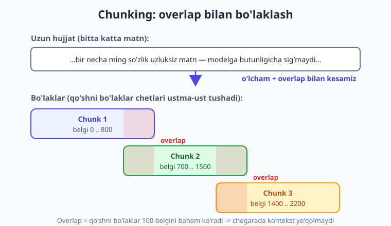
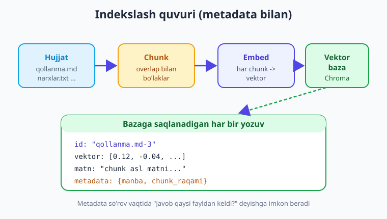

# 15 — RAG: chunking va indekslash

[⬅️ Oldingi: 14 — Vektor bazalari](./14-vektor-bazalari.md) · [🏠 Kitob boshi](./README.md) · [Keyingi: 16 — RAG: retrieval va generatsiya ➡️](./16-rag-retrieval-generatsiya.md)

> **Bu bobda:** **RAG** (Retrieval-Augmented Generation) nima ekanini va nega LLM-ilovalarning eng muhim usuli ekanini tushunamiz; RAG'ning ikki fazasini — **indekslash** (oldindan) va **so'rov** (real vaqt) — ajratamiz va bu bob **birinchi fazaga** bag'ishlanganini ko'ramiz. Hujjatlarni (`.txt`, `.md`, `.pdf`) yuklashni; **chunking** (bo'laklash) nima uchun kerakligini, chunk o'lchami va **overlap** (ustma-ustlik)ni; chunking strategiyalarini; har bo'lakni embed qilib **metadata** bilan vektor bazaga yozishni o'rganamiz. Oxirida — papkadagi hamma hujjatni avtomatik indekslaydigan **to'liq, ishlaydigan quvur** quramiz.

---

## Muammodan boshlaymiz: model sizning hujjatlaringizni bilmaydi

13–14-boblarda embeddings va vektor bazalarini ko'rdik. Endi ularni asl maqsadda ishlatamiz.

1-bobda aytganimizdek, LLM ikki narsani **bilmaydi**: (1) o'zining "bilim cheki"dan keyingi voqealar, (2) **sizning** shaxsiy/ichki hujjatlaringiz — kompaniya qo'llanmasi, mahsulot narxlari, ichki qoidalar. Modelni o'qitishda bular bo'lmagan, demak u javob bera olmaydi yoki — bundan ham yomoni — **to'qib chiqaradi** (hallucination).

Tasavvur qiling, kompaniyangiz uchun yordamchi qurmoqchisiz. Foydalanuvchi so'raydi: "Mahsulotni qaytarish muddati necha kun?". Bu javob — sizning `qaytarish-siyosati.md` faylingizda. Model esa bu faylni umuman ko'rmagan. Nima qilamiz?

Eng sodda g'oya: **kerakli matn bo'lagini savol bilan birga modelga berish.** Ya'ni: "Mana hujjatdan parcha: *...qaytarish muddati 14 kun...*. Endi shu savolga javob ber: qaytarish muddati necha kun?". Model endi to'qimaydi — oldidagi parchaga **tayanib** javob beradi. Mana shu — RAG'ning butun mohiyati.

> **Hayotiy o'xshatish.** RAG — bu **ochiq kitobli imtihon**. Yopiq imtihonda talaba faqat yodidagiga tayanadi (va ba'zan adashadi, to'qib yozadi). Ochiq kitobli imtihonda esa avval **kerakli sahifani topadi**, keyin o'sha sahifaga qarab javob yozadi. RAG modelga har savol uchun aynan kerakli sahifani qo'liga tutqazadi.

---

## RAG nima va uning ikki fazasi

**RAG (Retrieval-Augmented Generation)** — "qidirib topish bilan boyitilgan generatsiya". Modelga savol bilan birga **tegishli hujjat bo'laklarini kontekst** sifatida beramiz; model o'sha ma'lumotga tayanib javob yozadi.

RAG nega muhim:

- **Hallucination'ni kamaytiradi** — model o'ylab topmaydi, oldidagi haqiqiy matnga tayanadi.
- **O'z/yangi ma'lumot beradi** — model o'qimagan, ichki yoki eng yangi ma'lumot bilan ishlaydi.
- **Arzon va moslashuvchan** — fine-tuning (modelni qayta o'qitish) shart emas; hujjat o'zgarsa, shunchaki qayta indekslaysiz.
- **Manbani ko'rsatadi** — javob qaysi fayldan kelganini ayta olasiz (ishonch uchun muhim).

RAG **ikki fazadan** iborat:


1. **Indekslash (offline, oldindan).** Hujjatlarni yuklash -> bo'laklash (chunk) -> har bo'lakni embed qilish -> vektor bazaga saqlash. Bu **bir marta** (yoki hujjat o'zgarganda) qilinadi.
2. **So'rov (online, real vaqt).** Foydalanuvchi savolini embed qilish -> bazadan o'xshash bo'laklarni topish -> ularni savol bilan birga modelga berish -> javob. Bu **har savolda** ishlaydi.

!!! note "Bu bob 1-fazaga bag'ishlangan"
    **Indekslash** — RAG'ning poydevori. Yaxshi indekslash bo'lmasa, qidirish ham, javob ham yomon bo'ladi ("axlat kirsa — axlat chiqadi"). Shu bob oxirida sizda hujjatlar bilan to'ldirilgan, **so'rovga tayyor** vektor baza bo'ladi. 2-fazani — qidirish va javob generatsiyasini — **16-bobda** quramiz.

---

## Hujjatlarni yuklash

Indekslashning birinchi qadami — hujjat matnini Python'ga **string** sifatida o'qib olish. Format har xil bo'ladi.

**Matnli fayllar (`.txt`, `.md`):** oddiy o'qish kifoya.

```python
from pathlib import Path

def matn_yukla(yol: str) -> str:
    """.txt yoki .md faylni matn sifatida o'qiydi."""
    return Path(yol).read_text(encoding="utf-8")

matn = matn_yukla("qollanma.md")
print(len(matn), "belgi yuklandi")
```

**PDF fayllar:** PDF — matn emas, binar format. Undan matnni ajratib olish uchun kutubxona kerak. `pypdf` — eng oddiy va keng tarqalgani:

```bash
pip install pypdf
```

```python
from pypdf import PdfReader

def pdf_yukla(yol: str) -> str:
    """PDF'ning barcha sahifalaridan matnni ajratib oladi."""
    reader = PdfReader(yol)
    qismlar = []
    for sahifa in reader.pages:
        qismlar.append(sahifa.extract_text() or "")
    return "\n".join(qismlar)

matn = pdf_yukla("hisobot.pdf")
```

!!! warning "PDF — chigal format"
    PDF'dan matn ajratish har doim toza chiqmaydi: jadval, ustun, rasm ichidagi matn buzilishi mumkin. Skanerlangan (rasm) PDF'da esa matn umuman bo'lmaydi — u yerda **OCR** (matnni rasmdan o'qish) kerak bo'ladi, bu alohida mavzu. Indekslashdan oldin yuklangan matnni bir ko'zdan kechirish odatini qiling.

---

## Chunking: nega va qanday bo'laklaymiz

Butun hujjatni bittada modelga bera olmaymiz. Sabablar:

- **Kontekst oynasi.** Hujjat juda uzun bo'lishi mumkin (yuzlab sahifa) — modelga sig'maydi (1-bob).
- **Aniqlik.** Savolga butun kitobni emas, faqat **tegishli** bir-ikki paragrafni bersak, model chalg'imaydi va aniqroq javob beradi.
- **Narx.** Modelga qancha kam token yuborsak, shuncha arzon. Butun hujjatni har savolda yuborish — isrofgarchilik.

Shuning uchun hujjatni kichik, mustaqil **bo'laklarga (chunk)** ajratamiz. Keyin qidirishda faqat savolga mos chunklarni topamiz.

> **Hayotiy o'xshatish.** Chunking — katta kitobni **kartochkalarga** ko'chirishga o'xshaydi. Savol berilganda butun kitobni o'qib chiqmaysiz — kerakli kartochkani topasiz. Kartochka juda katta bo'lsa, unda ortiqcha narsa bo'ladi; juda kichik bo'lsa, fikr yarmida uzilib qoladi. To'g'ri o'lcham — san'at.

### Chunk o'lchami va overlap

Ikki asosiy sozlama:

- **Chunk o'lchami** — har bo'lak qancha katta (token yoki belgi bilan o'lchanadi). Tez-tez uchraydigan qiymat: ~500–1000 belgi (taxminan 1–2 paragraf).
- **Overlap (ustma-ustlik)** — qo'shni bo'laklar bir-biri bilan necha belgi baham ko'radi.

Overlap nega kerak? Agar hujjatni qat'iy kessak, muhim jumla aynan chegarada ikkiga bo'linib qolishi mumkin — birinchi bo'lakda yarmi, ikkinchisida yarmi. Unda na biri to'liq ma'noni saqlaydi. **Overlap** qo'shni bo'laklar chetini ustma-ust qo'yib, chegarada kontekst yo'qolmasligini ta'minlaydi.



!!! tip "Qaysi o'lcham va overlap?"
    Universal qiymat yo'q — hujjat turiga bog'liq. Boshlash uchun yaxshi qiymat: **chunk ~800 belgi, overlap ~100 belgi** (taxminan 10–15%). Keyin natijani sinab, kerak bo'lsa moslang. FAQ kabi qisqa, mustaqil bo'limlar uchun kichikroq; uzun bayon uchun kattaroq chunk yaxshi ishlaydi.

---

## Chunking strategiyalari

Hujjatni bo'lakka ajratishning bir necha yo'li bor — oddiydan murakkabga.

- **Belgi bo'yicha (oddiy).** Matnni har N belgida kesamiz (overlap bilan). Sodda va tez, lekin so'z yoki jumla o'rtasidan kesilishi mumkin. Boshlash uchun yetarli.
- **Jumla/paragraf bo'yicha.** Avval matnni jumla yoki paragraflarga bo'lib, keyin ularni o'lcham chegarasiga yetguncha birlashtiramiz. Tabiiyroq chegaralar — fikr o'rtasidan uzilmaydi.
- **Semantik.** Embeddings yordamida ma'nosi bir-biriga yaqin jumlalarni guruhlaymiz — eng "aqlli", lekin eng murakkab va sekin usul.

Boshlash uchun **belgi bo'yicha overlap bilan** bo'lash mukammal tanlov — sodda, ishonchli, ko'p holatda yetarli. Mana shunday funksiya:

```python
def chunk_qil(matn: str, olcham: int = 800, overlap: int = 100) -> list[str]:
    """Matnni `olcham` belgili bo'laklarga, `overlap` ustma-ustlik bilan bo'ladi."""
    if overlap >= olcham:
        raise ValueError("overlap chunk o'lchamidan kichik bo'lishi shart")

    bolaklar = []
    boshi = 0
    while boshi < len(matn):
        oxiri = boshi + olcham
        bolak = matn[boshi:oxiri].strip()
        if bolak:                       # bo'sh bo'laklarni o'tkazib yuboramiz
            bolaklar.append(bolak)
        boshi += olcham - overlap       # keyingi bo'lak overlap qadar orqaga suriladi
    return bolaklar


hujjat = "A" * 2200          # sinov uchun uzun matn
boklar = chunk_qil(hujjat, olcham=800, overlap=100)
print(len(boklar), "ta bo'lak")   # qadam = 800-100 = 700; 0,700,1400,2100 -> 4 ta bo'lak
```

Asosiy nuqta — `boshi += olcham - overlap`: keyingi bo'lak oldingisidan `overlap` belgi **orqaga** boshlanadi, shu tufayli ustma-ustlik hosil bo'ladi.

!!! tip "Tayyor yechimlar ham bor"
    Amalda ko'pchilik LangChain'ning `RecursiveCharacterTextSplitter` kabi tayyor bo'laklagichidan foydalanadi — u avval paragraf, keyin jumla, keyin so'z chegarasini sinab ko'radi. Lekin ichida nima ishlayotganini **bilish** muhim — shu sababli avval o'z funksiyangizni yozdik. Tayyor asboblarni 17-bobda eslatamiz.

---

## Har chunkni embed qilish va metadata qo'shish

Endi har bir bo'lakni **vektorga** (embedding) aylantiramiz — bu 13-bobdan tanish. OpenAI-mos embedding chaqiruvini eslaylik (model nomlari o'zgaradi — provayder ro'yxatini tekshiring):

```python
import os
from dotenv import load_dotenv
from openai import OpenAI

load_dotenv()
client = OpenAI()
EMBED_MODEL = "text-embedding-3-small"

def embed_qil(matnlar: list[str]) -> list[list[float]]:
    """Matnlar ro'yxatini vektorlar ro'yxatiga aylantiradi (bitta so'rovda)."""
    javob = client.embeddings.create(model=EMBED_MODEL, input=matnlar)
    return [d.embedding for d in javob.data]
```

Lekin vektorning o'zigina yetarli emas. Har bo'lak haqida **metadata** ham saqlashimiz kerak: bu bo'lak **qaysi fayldan** kelgan va **nechanchi chunk** ekani. Bu metadata so'rov vaqtida bebaho bo'ladi — javob qaysi manbadan kelganini ko'rsata olamiz va foydalanuvchiga "bu javob `qollanma.md` faylidan" deya olamiz.



!!! note "Nega asl matnni ham saqlaymiz?"
    Vektor — qidirish uchun. Lekin modelga **vektorni** emas, **asl matnni** berishimiz kerak (16-bobda). Shuning uchun bazada har bo'lak uchun uchta narsani saqlaymiz: **vektor** (qidirish kaliti), **asl matn** (modelga beriladigan kontekst) va **metadata** (manba). Yaxshiyamki, Chroma kabi vektor bazalari uchchalasini bitta yozuvda saqlay oladi.

---

## To'liq indekslash quvuri

Endi hamma narsani birlashtiramiz: **papkadagi barcha hujjatlarni** yuklab, bo'laklab, embed qilib, metadata bilan **Chroma** vektor bazasiga yozadigan to'liq, ishlaydigan quvur. (Chroma bilan 14-bobda tanishganmiz.)

```bash
pip install openai python-dotenv chromadb pypdf
```

```python
import os
from pathlib import Path
from dotenv import load_dotenv
from openai import OpenAI
from pypdf import PdfReader
import chromadb

load_dotenv()
client = OpenAI()
EMBED_MODEL = "text-embedding-3-small"   # nomlar o'zgaradi — ro'yxatni tekshiring


# --- 1. Hujjat yuklash (format bo'yicha) ---
def hujjat_yukla(yol: Path) -> str:
    if yol.suffix.lower() == ".pdf":
        reader = PdfReader(str(yol))
        return "\n".join((s.extract_text() or "") for s in reader.pages)
    # .txt va .md uchun:
    return yol.read_text(encoding="utf-8")


# --- 2. Chunking (overlap bilan) ---
def chunk_qil(matn: str, olcham: int = 800, overlap: int = 100) -> list[str]:
    boklar, boshi = [], 0
    while boshi < len(matn):
        bolak = matn[boshi:boshi + olcham].strip()
        if bolak:
            boklar.append(bolak)
        boshi += olcham - overlap
    return boklar


# --- 3. Embedding ---
def embed_qil(matnlar: list[str]) -> list[list[float]]:
    javob = client.embeddings.create(model=EMBED_MODEL, input=matnlar)
    return [d.embedding for d in javob.data]


# --- 4. To'liq indekslash quvuri ---
def papkani_indeksla(papka: str, kolleksiya_nomi: str = "bilim_bazasi"):
    # Doimiy (diskka saqlanadigan) Chroma mijozi
    db = chromadb.PersistentClient(path="./chroma_db")
    # Toza boshlash uchun eski kolleksiyani o'chirib, qaytadan yaratamiz
    try:
        db.delete_collection(kolleksiya_nomi)
    except Exception:
        pass
    kol = db.create_collection(kolleksiya_nomi)

    fayllar = [p for p in Path(papka).iterdir()
               if p.suffix.lower() in {".txt", ".md", ".pdf"}]
    jami_chunk = 0

    for fayl in fayllar:
        matn = hujjat_yukla(fayl)
        boklar = chunk_qil(matn, olcham=800, overlap=100)
        if not boklar:
            continue

        vektorlar = embed_qil(boklar)

        # Har bo'lak uchun: id, vektor, asl matn va metadata
        idlar = [f"{fayl.name}-{i}" for i in range(len(boklar))]
        metalar = [{"manba": fayl.name, "chunk_raqami": i}
                   for i in range(len(boklar))]

        kol.add(
            ids=idlar,
            embeddings=vektorlar,
            documents=boklar,          # asl matn — keyin modelga beriladi
            metadatas=metalar,         # manba va chunk raqami
        )
        jami_chunk += len(boklar)
        print(f"  {fayl.name}: {len(boklar)} ta chunk")

    print(f"\nTayyor: {len(fayllar)} ta fayl, {jami_chunk} ta chunk indekslandi.")
    return kol


if __name__ == "__main__":
    papkani_indeksla("./hujjatlar")
```

Bu skriptni ishga tushirsangiz (`hujjatlar/` papkasida bir nechta `.md`/`.txt`/`.pdf` bo'lsa), u har faylni yuklaydi, bo'laklaydi, embed qiladi va `./chroma_db` papkasiga **doimiy** saqlaydi. Endi bazangiz **so'rovga tayyor** — 16-bobda undan foydalanib javob generatsiya qilamiz.

!!! tip "Katta hajm uchun: paket (batch) qilish"
    Yuqoridagi kod har faylning hamma bo'laklarini bitta `embeddings.create` chaqiruviga yuboradi. Hujjatlar juda ko'p bo'lsa, embed so'rovlarini **paketlarga** (masalan, har 100 chunkdan) bo'lish kerak — bir so'rovga juda ko'p matn sig'maydi va xatolikka chidamliroq bo'ladi. Bundan tashqari, har safar boshqatdan emas, **faqat o'zgargan fayllarni** qayta indekslash production'da muhim.

!!! warning "Indekslash — bepul emas"
    Har bo'lakni embed qilish embedding modeliga so'rov yuboradi — bu token sarflaydi, demak (bulutli provayderda) **pul**. Katta hujjat to'plamini birinchi marta indekslash sezilarli bo'lishi mumkin. Shuning uchun: (a) embeddingni bir marta hisoblab, **diskka saqlang** (yuqoridagidek `PersistentClient`), har ishga tushganda qaytadan hisoblamang; (b) sinov bosqichida arzon embedding modeli yoki lokal (Ollama `nomic-embed-text`) ishlatishni o'ylab ko'ring.

---

## Xulosa

- **RAG (Retrieval-Augmented Generation)** — modelga savol bilan birga **tegishli hujjat bo'laklarini** kontekst sifatida berish; model o'sha matnga tayanib javob beradi. Bu hallucination'ni kamaytiradi va o'z/yangi ma'lumot bilan ishlash imkonini beradi.
- RAG ikki fazadan iborat: **indekslash** (offline, oldindan) va **so'rov** (online, real vaqt). **Bu bob indekslashga** bag'ishlandi; so'rov fazasi — 16-bobda.
- Hujjat yuklash formatga bog'liq: `.txt`/`.md` — to'g'ridan-to'g'ri o'qiladi; `.pdf` uchun `pypdf` bilan matn ajratiladi (toza chiqmasligi mumkin).
- **Chunking** kerak, chunki: kontekst oynasi cheklangan, aniqlik oshadi va narx kamayadi. Hujjat kichik, mustaqil bo'laklarga ajratiladi.
- **Overlap** (ustma-ustlik) — qo'shni bo'laklar chetini baham ko'radi, shunda chegarada bo'lingan fikr yo'qolmaydi. Boshlash qiymati: ~800 belgi chunk, ~100 belgi overlap.
- Chunking strategiyalari: **belgi bo'yicha** (oddiy, boshlash uchun), **jumla/paragraf bo'yicha** (tabiiyroq), **semantik** (aqlli, murakkab).
- Har bo'lak uchun bazaga uch narsa saqlanadi: **vektor** (qidirish kaliti), **asl matn** (modelga kontekst) va **metadata** (manba fayl, chunk raqami).
- To'liq quvur: papkadagi hujjatlar -> yuklash -> chunk -> embed -> **metadata bilan Chroma'ga** doimiy saqlash. Embedding pul/token sarflaydi — bir marta hisoblab diskka saqlang.

## Amaliy mashqlar

1. **(Oson)** `chunk_qil` funksiyasini olib, 2500 belgilik matnni `olcham=800, overlap=100` bilan bo'laklang. Nechta chunk hosil bo'ldi? Endi `overlap=0` bilan urinib ko'ring — chunklar soni qanday o'zgardi va nega?

2. **(Oson)** Bitta `.md` yoki `.txt` faylni `matn_yukla` bilan o'qing, `chunk_qil` bilan bo'laklang va birinchi hamda oxirgi chunkni chop eting. Qo'shni ikki chunkning ustma-ust (overlap) qismini ko'zdan kechiring.

3. **(O'rtacha)** `chunk_qil` funksiyasini **paragraf bo'yicha** ishlaydigan qilib o'zgartiring: matnni avval `\n\n` bo'yicha paragraflarga bo'ling, keyin paragraflarni o'lcham chegarasiga yetguncha birlashtiring. Natijani belgi-bo'yicha versiya bilan solishtiring.

4. **(O'rtacha)** To'liq indekslash quvurini ishga tushiring (kichik `hujjatlar/` papkasi bilan). So'ng `chromadb` orqali kolleksiyadagi yozuvlar sonini (`collection.count()`) va bir nechta yozuvning `metadatas`ini chop etib, manba va chunk raqami to'g'ri saqlanganini tekshiring.

5. **(Qiyin)** Quvurni **inkremental** qiling: har ishga tushganda hamma narsani o'chirib qayta yaratish o'rniga, faqat bazada hali yo'q (yangi yoki o'zgargan) fayllarni indekslang. Maslahat: faylning o'zgartirilgan vaqtini yoki mazmun xeshini (masalan `hashlib`) metadataga saqlab, mavjudini o'tkazib yuboring.

---

[⬅️ Oldingi: 14 — Vektor bazalari](./14-vektor-bazalari.md) · [🏠 Kitob boshi](./README.md) · [Keyingi: 16 — RAG: retrieval va generatsiya ➡️](./16-rag-retrieval-generatsiya.md)
