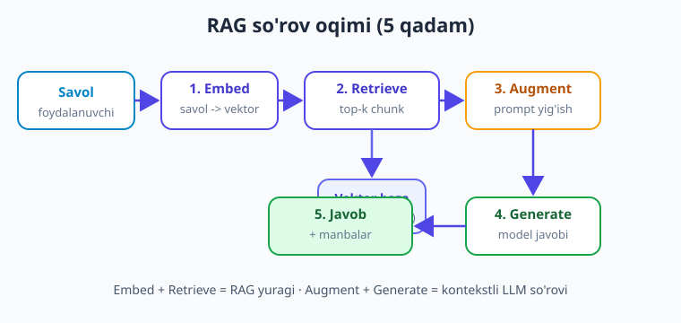

# 16 — RAG: retrieval va generatsiya

[⬅️ Oldingi: 15 — RAG: chunking va indekslash](./15-rag-chunking-indekslash.md) · [🏠 Kitob boshi](./README.md) · [Keyingi: 17 — RAG'ni yaxshilash va baholash ➡️](./17-rag-yaxshilash-baholash.md)

> **Bu bobda:** RAG'ning **ikkinchi fazasini** — so'rov vaqtida ishlaydigan qismni — quramiz. 15-bobda tayyorlagan indeks ustida ishlaymiz: foydalanuvchi savolini olib, uni embeddingga aylantiramiz, vektor bazadan **eng yaqin top-k chunk**ni topamiz, ularni **kontekst** sifatida promptga qo'shamiz va modeldan **faqat shu kontekstga tayanib** javob olamiz. Promptni qanday yig'ishni (tizim ko'rsatmasi + kontekst + savol), "bilmasam bilmayman" deyish bilan **hallucination**ni kamaytirishni, javobda **manbani ko'rsatishni (citations)** va `top_k`ni to'g'ri tanlashni o'rganamiz. Yakunda boshidan oxirigacha ishlaydigan bitta `rag_javob(savol)` funksiyasini yozamiz.

---

## Muammodan boshlaymiz: indeks tayyor, endi nima?

15-bobda biz hujjatlarni **chunk**larga bo'lib, har birini embeddingga aylantirib, **vektor bazaga** (Chroma) joyladik. Endi bazada yuzlab, minglab chunk yotibdi — har biri o'z matni, vektori va metadatasi bilan. Lekin bu hozircha shunchaki **anbor**: ma'lumot bor, ammo foydalanuvchi savoliga javob yo'q.

Tasavvur qiling, kompaniyangizning ichki qo'llanmasini indeksladingiz. Xodim so'raydi:

> "Ta'til kuni necha kun va uni qanday rasmiylashtiraman?"

Bu savolga javob qo'llanmaning bir-ikki chunkida bor — lekin model uni o'zidan bilmaydi (sizning hujjatingiz uning o'qigan ma'lumotida yo'q). Bizning ishimiz: shu savol uchun **kerakli chunklarni topib**, ularni modelga **kontekst** qilib berib, "mana shu matnga tayanib javob ber" deyish.

Mana shu — RAG'ning ikkinchi fazasi: **retrieve -> augment -> generate** (top -> boyit -> javob ber).

> **Hayotiy o'xshatish.** 15-bob — kutubxonaga kitoblarni javonlarga **tartib bilan terib qo'yish** (indekslash). 16-bob — kimdir savol bilan kelganda, **kerakli sahifalarni topib, stolga qo'yib**, so'ng o'sha sahifalarga qarab javob yozib berish. Model — bilimli, lekin sizning kutubxonangizni yoddan bilmaydigan xodim; siz unga aynan kerakli sahifalarni tutqazasiz.

!!! note "RAG — eslatma"
    **RAG (Retrieval-Augmented Generation)** — modelning javobini **tashqi haqiqiy ma'lumot** bilan boyitish usuli. Ikki faza: **(1) indekslash** (offlayn, 15-bob) — hujjatlarni chunklarga bo'lib, vektor bazaga joylash; **(2) so'rov** (onlayn, shu bob) — savol kelganda kerakli chunklarni topib, modelga kontekst qilib berish. Bu hallucination'ni kamaytiradi va modelga **sizning** ma'lumotingizni "biladigan" qiladi.

---

## So'rov fazasining oqimi: 5 qadam

Bir foydalanuvchi savoli RAG tizimidan o'tganda quyidagi besh qadam bajariladi:



1. **Embed** — foydalanuvchi savolini xuddi chunklar kabi **embeddingga** (vektorga) aylantiramiz. Muhim: indekslashda ishlatilgan embedding modeli bilan **bir xil model** bo'lishi shart.
2. **Retrieve** — savol vektorini vektor bazaga beramiz; baza unga **eng yaqin** `top_k` ta chunkni qaytaradi (cosine o'xshashlik bo'yicha, 13-bobdagidek).
3. **Augment** — topilgan chunklarni **kontekst** sifatida promptga qo'shamiz va tizim ko'rsatmasi hamda savol bilan birlashtiramiz.
4. **Generate** — to'liq promptni modelga yuboramiz; model **faqat berilgan kontekstga tayanib** javob yozadi.
5. **Javob** — javobni (ixtiyoriy: manbalar bilan) foydalanuvchiga ko'rsatamiz.

Diqqat: birinchi ikki qadam (embed + retrieve) — **RAG'ning yuragi**; uchinchi-to'rtinchi (augment + generate) — **oddiy LLM so'rovi**, lekin endi promptda kontekst bor. Ya'ni RAG — sizga tanish bo'lgan `chat.completions.create(...)` chaqiruvi, oldiga "kerakli ma'lumotni topish" bosqichi qo'shilgani.

!!! tip "Bir xil embedding modeli — qoida"
    Savolni embeddingga aylantirganda 15-bobda chunklar uchun ishlatgan **aynan o'sha** model va o'lcham bo'lishi shart (masalan, `text-embedding-3-small`). Boshqa model boshqa vektor fazosi yaratadi — o'xshashlik o'lchovi ma'nosini yo'qotadi va qidiruv buziladi.

---

## 1-2 qadam: retrieve — kerakli chunklarni topish

Avval 15-bobda to'ldirgan Chroma kolleksiyasiga ulanamiz va savol bo'yicha eng yaqin chunklarni topamiz. Chroma so'rov matnini o'zi embeddingga aylantirib qidiradi (yoki siz tayyor vektorni berasiz).

```python
import os
from dotenv import load_dotenv
import chromadb
from chromadb.utils import embedding_functions

load_dotenv()

# 15-bobda yaratilgan doimiy bazaga ulanamiz (aynan o'sha path va kolleksiya nomi)
client = chromadb.PersistentClient(path="./chroma_db")

# Embedding funksiyasi — indekslashdagi bilan AYNAN bir xil bo'lishi shart
embed_fn = embedding_functions.OpenAIEmbeddingFunction(
    api_key=os.environ["OPENAI_API_KEY"],
    model_name="text-embedding-3-small",   # nomlar o'zgaradi — provayder ro'yxatini tekshiring
)

kolleksiya = client.get_collection(name="bilim_bazasi", embedding_function=embed_fn)


def chunklarni_top(savol: str, top_k: int = 4) -> list[dict]:
    """Savolga eng yaqin top_k chunkni matn va metadata bilan qaytaradi."""
    natija = kolleksiya.query(
        query_texts=[savol],     # Chroma savolni o'zi embeddingga aylantiradi
        n_results=top_k,
        include=["documents", "metadatas", "distances"],
    )
    chunklar = []
    # query [] ichida ro'yxat qaytaradi (ko'p savol bo'lishi mumkin); bizda bitta savol -> [0]
    for matn, meta, masofa in zip(
        natija["documents"][0],
        natija["metadatas"][0],
        natija["distances"][0],
    ):
        chunklar.append({"matn": matn, "meta": meta, "masofa": masofa})
    return chunklar
```

Sinab ko'ramiz:

```python
for c in chunklarni_top("Ta'til necha kun?", top_k=3):
    print(f"[masofa={c['masofa']:.3f}] manba={c['meta'].get('manba')}")
    print(c["matn"][:120], "...\n")
```

Har bir chunk uchun bizda **matn** (modelga beradiganimiz), **metadata** (manba fayli, sahifa, chunk raqami — 15-bobda saqlagan) va **masofa** (qanchalik yaqin) bor. Masofa kichik bo'lsa — chunk savolga yaqinroq.

> **Hayotiy o'xshatish.** `query(...)` — kutubxonachiga "shu mavzudagi eng tegishli 4 ta sahifani topib ber" deyishdek. U javonlarni o'qib chiqmaydi (bu sekin bo'lardi), balki oldindan tuzilgan **indeks** orqali tez topadi — xuddi kitob oxiridagi alifbo ko'rsatkichi kabi.

!!! note "Masofa va o'xshashlik"
    Chroma sukut bo'yicha **masofa** qaytaradi (kichik = yaqin), o'xshashlik emas. Ko'pincha `o'xshashlik = 1 - masofa` (cosine uchun) deb taxminlash mumkin. Aniq formula baza sozlamasiga bog'liq — keyingi bobda (17) qaytish chegarasi (threshold) qo'yishni ko'ramiz.

---

## 3-qadam: augment — promptni yig'ish

Endi eng nozik qism: topilgan chunklardan va savoldan **bitta yaxlit prompt** yasaymiz. Prompt uch qismdan iborat:


1. **Tizim ko'rsatmasi (system)** — modelga qoidalarni aytadi: "FAQAT quyidagi kontekstga tayanib javob ber; kontekstda javob bo'lmasa — 'bilmayman' dey".
2. **Kontekst** — top-k chunkning matnlari (manba belgisi bilan).
3. **Savol** — foydalanuvchining asl savoli.

Avval kontekstni tartibli matn qilib yig'amiz. Har chunkni **raqamlab** qo'yamiz — keyin model javobida `[1]`, `[2]` deb manbaga ishora qila olishi uchun:

```python
def kontekst_yig(chunklar: list[dict]) -> str:
    """Top-k chunklarni raqamlangan, manbali matnga aylantiradi."""
    qismlar = []
    for i, c in enumerate(chunklar, start=1):
        manba = c["meta"].get("manba", "noma'lum")
        qismlar.append(f"[{i}] (manba: {manba})\n{c['matn']}")
    return "\n\n".join(qismlar)
```

Endi to'liq prompt shablonini yasaymiz. Tizim ko'rsatmasi — RAG sifatining yarmi shu yerda hal bo'ladi:

```python
TIZIM_KORSATMA = (
    "Sen kompaniya hujjatlari bo'yicha yordamchi savol-javob tizimisan.\n"
    "QOIDALAR:\n"
    "1. FAQAT quyida berilgan KONTEKSTGA tayanib javob ber.\n"
    "2. Agar javob kontekstda bo'lmasa, o'zingdan TO'QIMA — "
    "'Bu savolga hujjatlarda javob topilmadi' deb ayt.\n"
    "3. Javobing oxirida foydalangan manbalarni [1], [2] ko'rinishida ko'rsat.\n"
    "4. Qisqa, aniq va o'zbek tilida javob ber."
)


def prompt_yig(savol: str, chunklar: list[dict]) -> list[dict]:
    """system + kontekst + savol dan messages ro'yxatini yig'adi."""
    kontekst = kontekst_yig(chunklar)
    foydalanuvchi_xabari = (
        f"KONTEKST:\n{kontekst}\n\n"
        f"SAVOL: {savol}\n\n"
        f"Yuqoridagi kontekstga tayanib javob ber."
    )
    return [
        {"role": "system", "content": TIZIM_KORSATMA},
        {"role": "user", "content": foydalanuvchi_xabari},
    ]
```

> **Hayotiy o'xshatish.** Promptni yig'ish — imtihonda talabaga **ochiq kitob** berib, "javobni faqat shu kitobdan top, yodingdan yozma" deyishdek. Tizim ko'rsatmasi — imtihon qoidasi; kontekst — ruxsat etilgan kitob; savol — imtihon savoli. Qoidasiz talaba esa yoddan to'qib yozishi (hallucination) mumkin.

!!! tip "Kontekstni savoldan ajrating"
    Kontekst va savolni aniq belgilar bilan (`KONTEKST:`, `SAVOL:`) ajrating. Bu modelga "qaysi qism ma'lumot, qaysi qism so'rov" ekanini tushuntiradi va **prompt injection**ni (kontekst ichidagi yashirin buyruqlarni) ham qiyinlashtiradi — bu haqda 24-bobda batafsil.

---

## Hallucination'ni kamaytirish: "bilmasam — bilmayman"

LLM'ning eng katta xavfi (1-bobda aytganimiz) — **hallucination**: model bilmagan narsani ham **ishonch bilan** to'qib aytishi. RAG buni ikki tomonlama kamaytiradi:

- **Haqiqiy manba beradi** — model yoddan emas, sizning matningizga qarab javob yozadi.
- **"Bilmayman" ruxsati** — tizim ko'rsatmasida modelga ochiq aytamiz: javob kontekstda bo'lmasa, **to'qima, "topilmadi" dey.**

Ikkinchisi juda muhim. Sukut bo'yicha LLM "yordam berishga" intiladi va bo'sh javob o'rniga biror narsa to'qishni "afzal" ko'radi. Unga **bilmaslik ham to'g'ri javob** ekanini ochiq aytish kerak.

```python
# Yomon ko'rsatma (model baribir to'qishi mumkin):
"Quyidagi ma'lumotga qarab savolga javob ber."

# Yaxshi ko'rsatma (bilmaslikka ruxsat):
"FAQAT kontekstga tayanib javob ber. Agar javob kontekstda yo'q bo'lsa, "
"'Bu savolga hujjatlarda javob topilmadi' deb ayt. Hech narsa to'qima."
```

> **Hayotiy o'xshatish.** Tajribasiz yordamchi rahbarini xafa qilmaslik uchun "bilmadim" deyishdan qo'rqib, taxminiy javob beradi — bu yomon. Yaxshi yordamchiga "bilmasang, 'bilmayman' deyaver — bu uyat emas" deb aytib qo'yiladi. Tizim ko'rsatmasi modelga aynan shu ruxsatni beradi.

!!! warning "RAG hallucination'ni KAMAYTIRADI, yo'qotmaydi"
    RAG xavfni sezilarli kamaytiradi, lekin **nolga tushirmaydi**. Model topilgan kontekstni noto'g'ri talqin qilishi yoki ikki chunkni aralashtirib yuborishi mumkin. Shuning uchun **citations** (manba ko'rsatish) muhim — foydalanuvchi javobni asl manba bilan tekshira oladi. Sifatni o'lchashni 17-bobda ko'ramiz.

---

## 4-qadam: generate va manba ko'rsatish (citations)

Endi yig'ilgan promptni modelga yuboramiz. Bu — oddiy `chat.completions.create(...)` chaqiruvi, faqat `messages` ichida endi kontekst bor:

```python
from openai import OpenAI

llm = OpenAI()
MODEL = "gpt-5.4-mini"   # nomlar o'zgaradi — provayder ro'yxatini tekshiring


def javob_generatsiya(messages: list[dict]) -> str:
    resp = llm.chat.completions.create(
        model=MODEL,
        messages=messages,
        temperature=0.2,   # past harorat — faktlarga sodiq, ijodkorlik kam
    )
    return resp.choices[0].message.content
```

`temperature=0.2` — RAG uchun maslahat: javob faktlarga sodiq, "ixtirochilik" kam bo'lsin (parametrlar haqida 6-bobda). 

**Citations (manba ko'rsatish)** — RAG'ni ishonchli qiladigan narsa. Foydalanuvchi "model qayerdan oldi?" deb tekshira olishi kerak. Biz buni ikki bosqichda ta'minlaymiz:

- Promptda chunklarni `[1]`, `[2]` deb **raqamladik** va modeldan javobida shu raqamlarni ishlatishni so'radik.
- Javob bilan birga foydalanuvchiga **manbalar ro'yxatini** (qaysi `[n]` qaysi faylga to'g'ri keladi) ko'rsatamiz — bu metadatadan keladi.

![Citation bog'lanishi: model javobidagi har bir da'vo [1], [2] kabi raqamli ishoralarga ega; bu raqamlar kontekstdagi muayyan chunklarga, ular esa asl hujjat manbalariga (fayl, sahifa) bog'lanadi — foydalanuvchi javobni manba bilan tekshira oladi](rasmlar/aip16-citation.svg)

```python
def manbalar_royxati(chunklar: list[dict]) -> str:
    """Foydalanuvchiga ko'rsatish uchun [n] -> manba jadvalini yasaydi."""
    qatorlar = []
    for i, c in enumerate(chunklar, start=1):
        manba = c["meta"].get("manba", "noma'lum")
        sahifa = c["meta"].get("sahifa")
        belgi = f"[{i}] {manba}"
        if sahifa is not None:
            belgi += f", {sahifa}-sahifa"
        qatorlar.append(belgi)
    return "\n".join(qatorlar)
```

!!! note "Citation — ishonchning kaliti"
    Korxona muhitida (huquq, tibbiyot, moliya) **manbasiz javob qabul qilinmaydi.** Citation foydalanuvchiga (a) javobni tasdiqlash, (b) chuqurroq o'qish va (c) modelni "ushlash" (agar javob manbaga mos kelmasa) imkonini beradi. Shu sababli citation ko'pincha RAG'ning eng qadrli qismi hisoblanadi.

---

## `top_k`ni tanlash: kam yaxshimi, ko'pmi?

`top_k` — bazadan nechta chunk olishimiz. Bu — RAG'ning eng muhim sozlamalaridan biri va u savdolashuv (trade-off):

| `top_k` | Afzalligi | Kamchiligi |
|---|---|---|
| **Kam** (1-2) | Aniq, kam **shovqin**, arzon (kam token) | Javob chunklarda bo'lsa-da, kerakli chunk tushmay qolishi mumkin |
| **O'rtacha** (3-6) | Ko'pincha eng yaxshi balans | — (odatda boshlash nuqtasi) |
| **Ko'p** (10+) | Kerakli ma'lumot tushib qolish ehtimoli kam | Ko'p **shovqin** (tegishsiz chunk), qimmat, model chalg'iydi |

Asosiy tushuncha: **ko'p chunk = ko'p ma'lumot, lekin ko'p shovqin ham.** Tegishsiz chunklar modelni chalg'itadi va javob sifatini **pasaytirishi** mumkin — "ko'p" har doim "yaxshi" emas.

> **Hayotiy o'xshatish.** `top_k` — savolga tayyorlanayotganda **nechta sahifani stolga qo'yish**ni tanlashdek. 1 sahifa — javob unda bo'lmasligi mumkin. 50 sahifa — kerakli jumlani topish qiyinlashadi, e'tibor tarqaladi. Tajribali talaba 3-5 ta eng tegishli sahifani tanlaydi.

!!! tip "Amaliy maslahat"
    **`top_k = 4` dan boshlang.** Agar model "topilmadi" deb juda ko'p javob bersa — oshiring. Agar javoblar chalkash/noto'g'ri bo'lsa — kamaytiring yoki chunk hajmini qayta ko'ring (15-bob). Eng to'g'ri qiymatni faqat **o'lchab** topasiz (17-bob), taxmin bilan emas. Kontekst oynasiga sig'ishini ham hisobga oling: katta chunklar × katta `top_k` = ko'p token = qimmat va chegaraga urilishi mumkin.

---

## Hammasini birlashtirish: `rag_javob(savol)`

Endi barcha qadamlarni bitta funksiyaga yig'amiz. Bu — RAG so'rov fazasining **to'liq, ishlaydigan** ko'rinishi: retrieve + augment + generate, citation bilan.

```python
def rag_javob(savol: str, top_k: int = 4) -> dict:
    """Savolga RAG orqali javob beradi: top -> boyit -> generatsiya.

    Qaytaradi: {"javob": str, "manbalar": str, "chunklar": list}.
    """
    # 1-2. RETRIEVE — eng yaqin chunklarni topamiz
    chunklar = chunklarni_top(savol, top_k=top_k)

    # Hech narsa topilmasa (bo'sh baza yoki juda uzoq savol)
    if not chunklar:
        return {
            "javob": "Bu savolga hujjatlarda javob topilmadi.",
            "manbalar": "",
            "chunklar": [],
        }

    # 3. AUGMENT — promptni yig'amiz
    messages = prompt_yig(savol, chunklar)

    # 4. GENERATE — modeldan javob olamiz
    javob = javob_generatsiya(messages)

    # 5. Manbalarni tayyorlaymiz (citation)
    manbalar = manbalar_royxati(chunklar)

    return {"javob": javob, "manbalar": manbalar, "chunklar": chunklar}
```

Ishlatish — oddiy:

```python
natija = rag_javob("Ta'til kuni necha kun va qanday rasmiylashtiriladi?")

print(natija["javob"])
print("\nManbalar:")
print(natija["manbalar"])
```

Namuna chiqish:

```text
Ta'til yiliga 21 ish kuni beriladi [1]. Rasmiylashtirish uchun
boshliqqa kamida 2 hafta oldin ariza topshiriladi [2].

Manbalar:
[1] qollanma.pdf, 12-sahifa
[2] qollanma.pdf, 13-sahifa
```

Mana shu — **to'liq RAG tizimi**: foydalanuvchi savol berdi, tizim kerakli chunklarni topdi, modelga kontekst qilib berdi, model **faqat shu kontekstga tayanib** javob yozdi va **manbalarni ko'rsatdi**. Endi sizning ilovangiz **o'z hujjatlaringizni "biladi"**.

> **Hayotiy o'xshatish.** `rag_javob` — bir butun **referent xizmati**: savol qabul qiladi, arxivdan kerakli hujjatlarni topadi, ekspertga beradi, ekspert javob yozadi va manbasini ko'rsatadi. Sizning ilovangizdagi har bir savol shu konveyer orqali o'tadi.

!!! question "RAG = prompt + qidiruv"
    E'tibor bering: `rag_javob` ichida hech qanday "sehr" yo'q. U — sizga 2-10 boblarda tanish bo'lgan `chat.completions.create(...)` chaqiruvi, oldiga "savolga tegishli matnni topish" (13-15-boblardagi embedding + vektor baza) bosqichi qo'shilgani. RAG — yangi texnologiya emas, balki **ikki tanish g'oyani (semantik qidiruv + LLM) birlashtirish.**

---

## Xulosa

- RAG ikki fazadan iborat: **indekslash** (15-bob, offlayn) va **so'rov** (shu bob, onlayn). So'rov fazasi oqimi: **embed -> retrieve(top-k) -> augment -> generate -> javob**.
- **Retrieve** — savolni embeddingga aylantirib, vektor bazadan eng yaqin `top_k` chunkni olish. Savol embeddingi indekslashdagi **aynan bir xil** model bilan hisoblanishi shart.
- **Augment** — promptni uch qismdan yig'ish: **tizim ko'rsatmasi** (qoidalar) + **kontekst** (raqamlangan chunklar) + **savol**.
- **Hallucination**ni kamaytirish: tizim ko'rsatmasida "FAQAT kontekstga tayanib javob ber; kontekstda yo'q bo'lsa — 'bilmayman' dey, to'qima". Bilmaslikka ruxsat berish — kalit qadam.
- **Citations** — chunklarni `[1]`, `[2]` deb raqamlab, modeldan javobida shularni ishlatishini so'rab, metadatadan manbalar ro'yxatini ko'rsatish. Bu javobni **tekshiriladigan** qiladi.
- **`top_k`** — savdolashuv: kam = aniq lekin kontekst yetmasligi mumkin; ko'p = to'liqroq lekin shovqin va qimmat. `top_k=4` dan boshlab, **o'lchab** sozlang.
- `rag_javob(savol)` — retrieve + augment + generate'ni bitta funksiyaga yig'adi. RAG — yangi texnologiya emas, **semantik qidiruv + LLM so'rovi** birlashmasi.

## Amaliy mashqlar

1. **(Oson)** `chunklarni_top("o'z savolingiz", top_k=3)` ni 15-bobda qurgan bazangizda ishga tushiring. Qaytgan chunklarning matni va `masofa`sini chop eting. Masofa eng kichik chunk savolga eng tegishlimi — tekshiring.

2. **(Oson)** `prompt_yig(...)` qaytargan `messages`ni modelga yubormasdan, shunchaki `print` qiling. Tizim ko'rsatmasi, kontekst va savol qanday birlashganini ko'zingiz bilan ko'ring va to'liq prompt shablonini tushuning.

3. **(O'rtacha)** Bir xil savol uchun `rag_javob`ni `top_k=1`, `top_k=4` va `top_k=10` bilan chaqiring. Javoblar va sifat qanday o'zgaradi? Qaysi biri eng yaxshi va nega — qisqa izoh yozing.

4. **(O'rtacha)** Bazangizda **mavjud bo'lmagan** mavzuda savol bering (masalan, qo'llanmada yo'q narsa). Model "topilmadi" deb javob beradimi? Agar to'qib qo'ysa, `TIZIM_KORSATMA`dagi "bilmaslik" ko'rsatmasini kuchaytiring va qayta sinang.

5. **(Qiyin)** `rag_javob`ni kengaytiring: qaytgan chunklardan masofasi ma'lum **chegaradan** (masalan, `masofa > 0.6`) uzoqlarini olib tashlang (tegishsiz chunklarni filtrlash). Agar hech bir chunk chegaradan o'tmasa, modelga umuman murojaat qilmasdan to'g'ridan-to'g'ri "topilmadi" qaytaring. Bu shovqinni va xarajatni qanday kamaytirishini izohlang.

---

[⬅️ Oldingi: 15 — RAG: chunking va indekslash](./15-rag-chunking-indekslash.md) · [🏠 Kitob boshi](./README.md) · [Keyingi: 17 — RAG'ni yaxshilash va baholash ➡️](./17-rag-yaxshilash-baholash.md)
