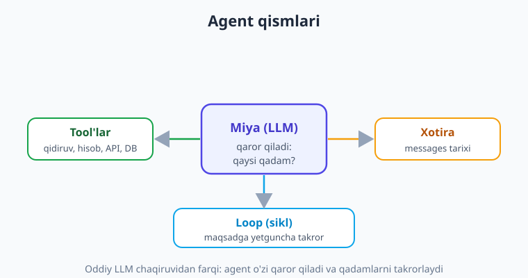
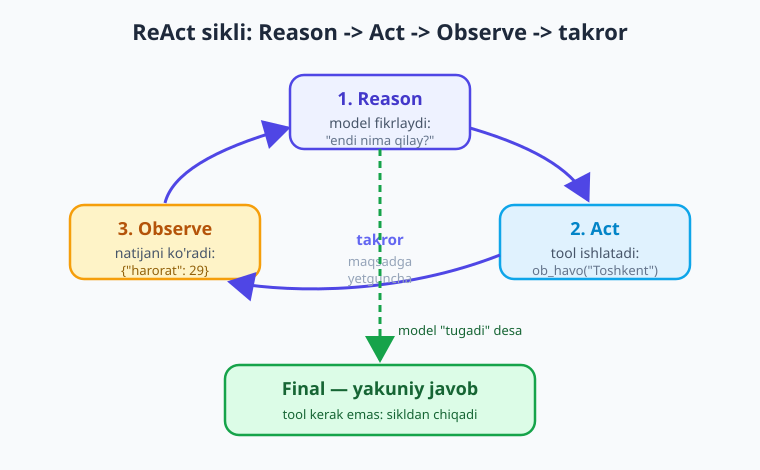
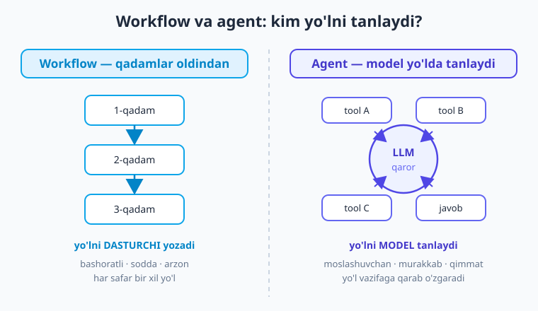

# 18 — Agentlar va ReAct sikli

[⬅️ Oldingi: 17 — RAG'ni yaxshilash va baholash](./17-rag-yaxshilash-baholash.md) · [🏠 Kitob boshi](./README.md) · [Keyingi: 19 — 0 dan agent qurish ➡️](./19-agent-qurish.md)

> **Bu bobda:** "agent" so'zining marketing g'ovg'asi ortidagi haqiqiy ma'nosini tushunamiz: agent — bu oddiy "so'rov -> javob" emas, balki model **O'ZI qaror qiladigan** tizim — qaysi tool'ni, qaysi tartibda ishlatish va qachon to'xtashni. Agentning to'rt qismini (miya + tool'lar + xotira + loop) ko'ramiz. Eng muhimi — **ReAct** naqshini (Reason -> Act -> Observe -> takror) bir sikl misolida so'zma-so'z kuzatamiz. **Workflow va agent** orasidagi farqni, qachon qaysi birini tanlashni va agentning real xavf-xatarlarini (cheksiz loop, xarajat portlashi, xato to'planishi) o'rganamiz. Kod bu yerda konsept darajasida — to'liq, ishlaydigan agentni keyingi bobda 0 dan quramiz.

---

## Muammodan boshlaymiz: bitta so'rov yetmaydigan vazifa

Shu vaqtgacha biz modelga **bitta so'rov** yuborib, **bitta javob** oldik. Hatto tool calling'da ham (10–11-boblar) oqim ko'p-kam belgilangan edi: model tool so'raydi, biz bajaramiz, yana yuboramiz. Bu — kuchli, lekin **biz** ssenariyni boshqarardik.

Endi quyidagi vazifani tasavvur qiling — foydalanuvchi yozadi:

> "Toshkent va Samarqanddagi bugungi haroratni solishtir, qaysi biri issiqroq ekanini ayt va shu issiqroq shaharda piknik uchun maslahat ber."

Bu **bitta** savol, lekin uni hal qilish uchun bir nechta qadam kerak:

1. Toshkent harorat — tool chaqirish.
2. Samarqand harorat — yana tool chaqirish.
3. Ikkalasini solishtirish — fikrlash.
4. Issiqroq shahar uchun maslahat yozish — yana fikrlash.

Eng muhimi: **necha qadam kerakligini va qaysi tartibda ekanini oldindan bilmaysiz.** Foydalanuvchi 3 ta shahar so'rasa — 3 ta tool chaqiruv kerak. "Eng yaqin issiq shaharni top" desa — model qidiruv tool'ini ham qo'shishi kerak bo'ladi. Bu yerda kerak bo'lgan narsa — vazifaga qarab **o'zi yo'l tanlaydigan** tizim. Mana shu — **agent**.

> **Hayotiy o'xshatish.** Oddiy LLM so'rovi — **savol-javob avtomati**: tugmani bosasiz, bitta javob tushadi. Agent esa — **vazifa topshirgan xodim**: "shu ishni qilib ber" deysiz, u o'zi bo'laklarga bo'ladi, kerakli asboblarni oladi, oraliq natijalarni ko'rib yo'lini tuzatadi va ish tugagach sizga yakuniy natijani keltiradi. Siz har bir qadamni aytib turmaysiz.

---

## Agent nima? (aniq ta'rif)

Internet "agent" so'zini har joyga yopishtiradi, shuning uchun aniq bo'lib olaylik. **Agent** — bu LLM'ni **boshqaruvchi miya** sifatida ishlatadigan tizim bo'lib, unda model **o'zi qaror qiladi**: qaysi tool'ni, qaysi argument bilan, qaysi tartibda ishlatish va — eng muhimi — **qachon to'xtash** (vazifa bajarildimi yoki yana qadam kerakmi).

Farqni bitta jumlada aytsak: **oddiy chaqiruvda yo'lni siz yozasiz; agentda yo'lni model tanlaydi.**

Agentning **to'rt qismi** bor:

- **Miya (LLM).** Qaror qabul qiluvchi markaz. Har qadamda "endi nima qilay?" deb o'ylaydi: tool chaqirayinmi, qaysi birini, yoki yetarli ma'lumot yig'ildi, javob beraymi?
- **Tool'lar.** Modelning "qo'l-oyog'i" — tashqi dunyoga ta'sir qiladigan funksiyalar: qidiruv, hisoblash, baza so'rovi, fayl o'qish, API chaqirish (10–11-boblardagi tool calling — agentning poydevori).
- **Xotira.** Hozirgacha nima qilingani: qaysi tool'lar chaqirildi, qanday natija qaytdi, model nima fikrladi. Bularsiz model har qadamda "amneziya"ga uchraydi va aylanib qoladi.
- **Loop (sikl).** Hammasini bog'lab turadigan halqa: model fikrlaydi -> tool ishlatadi -> natijani ko'radi -> yana fikrlaydi... maqsadga yetguncha yoki to'xtash sharti bajarilguncha.



Diqqat qiling: bu yerda **yangi sehrli model yo'q.** Agent — bu siz bilgan oddiy `chat.completions.create` chaqiruvi, faqat **sikl ichida**, tool'lar va xotira bilan birga. Agent — model emas, **arxitektura**.

!!! note "Atama: agentic"
    "Agent" — to'liq mustaqil tizim. "**Agentic**" (agentga xos) esa — sifat: bironta ilovaning *qanchalik* mustaqil qaror qila olishini bildiradi. Bitta tool chaqiruvi "biroz agentic", ko'p qadamli mustaqil rejalashtirish esa "to'liq agentic". Bu — qora-oq emas, **spektr**.

---

## ReAct naqshi: Reason -> Act -> Observe

Agent miyasi har qadamda nima qiladi? Eng mashhur va sodda naqsh — **ReAct** (Reasoning + Acting, ya'ni "fikrlash + harakat"). U uch bosqichni takrorlaydi:

1. **Reason (fikrla).** Model holatga qarab "endi nima qilishim kerak?" deb o'ylaydi. Masalan: "Toshkent haroratini bilishim kerak, buning uchun ob-havo tool'i lozim."
2. **Act (harakat qil).** Model tanlagan tool'ni argument bilan chaqirishni so'raydi: `ob_havo(shahar="Toshkent")`. (Bajaruvchi — sizning kodingiz, 10-bobdagidek.)
3. **Observe (kuzat).** Tool natijasini model ko'radi: `{"harorat": 29}`. Bu natija xotiraga qo'shiladi.

Keyin sikl **boshidan takrorlanadi**: model yangi kuzatuv bilan yana fikrlaydi — "Toshkent 29 daraja. Endi Samarqand kerak." — va shu davom etadi. Maqsadga yetganda esa Reason bosqichida model "yetarli ma'lumot bor, javob beraman" deb qaror qiladi va sikl **to'xtaydi**, yakuniy javob qaytadi.



> **Hayotiy o'xshatish.** ReAct — **detektivning ish uslubi**. Detektiv barcha javobni boshidan bilmaydi: bitta dalilni o'ylaydi (Reason), guvohni so'roq qiladi (Act), javobni eshitadi (Observe), shu yangi ma'lumot asosida keyingi qadamni o'ylaydi... ip uchini topguncha. Har qadam oldingisidan kelib chiqadi; reja yo'lda tug'iladi.

### Bir siklni so'zma-so'z kuzatamiz

Yuqoridagi "Toshkent va Samarqandni solishtir" vazifasi agent ichida qanday kechishini ko'raylik. Model "fikr"larini ovoz chiqarib aytadigan ko'rinishda (real ReAct'da model aynan shunday matn generatsiya qiladi):

```text
Foydalanuvchi: Toshkent va Samarqand bugungi haroratini solishtir.

[1-aylanma]
Reason  : Ikki shahar harorati kerak. Avval Toshkentdan boshlayman.
Act     : ob_havo(shahar="Toshkent")
Observe : {"harorat": 29, "holat": "quyoshli"}

[2-aylanma]
Reason  : Toshkent 29°. Endi Samarqand kerak.
Act     : ob_havo(shahar="Samarqand")
Observe : {"harorat": 26, "holat": "bulutli"}

[3-aylanma]
Reason  : Ikkala ma'lumot ham bor. Toshkent (29°) Samarqanddan (26°)
          issiqroq. Endi tool kerak emas — yakuniy javob beraman.
Final   : "Bugun Toshkent (29°, quyoshli) Samarqanddan (26°, bulutli)
           3 daraja issiqroq."
```

Diqqat qiling: **biz** "avval Toshkent, keyin Samarqand" deb yozmadik. Buni **model** o'zi rejalashtirdi. Va 3-aylanmada **model o'zi** "tool kerak emas, to'xtayman" deb qaror qildi. Mana shu — agentni oddiy zanjirdan farqlaydigan narsa.

!!! tip "Kod tomondan bu nima?"
    ReAct sikli amalda — bu `while` halqasi ichida `chat.completions.create(..., tools=tools)`. Model javobida `tool_calls` bo'lsa -> bajarib natijani `messages`ga qo'shamiz va halqani davom ettiramiz (Act + Observe). `tool_calls` bo'lmasa -> model matn javob berdi, demak **tugadi**, halqadan chiqamiz (Final). Aynan shu skeletni 19-bobda to'liq yozamiz.

---

## Workflow va agent: ikki xil yondashuv

Bu — bobning eng amaliy qismi. Hamma masalaga agent kerak emas. Aksincha, ko'p hollarda **oddiyroq** narsa — workflow — yaxshiroq ishlaydi.

**Workflow (ish oqimi)** — qadamlar **oldindan, dasturchi tomonidan** belgilanadi. Kod aniq biladi: avval shuni qil, keyin buni, keyin u natijani modelga ber. LLM bu yerda ham ishtirok etadi, lekin **yo'lni siz yozasiz**, model faqat har qadamda o'z ishini bajaradi.

**Agent** — qadamlarni **model o'zi** belgilaydi. Trayektoriya (qaysi tool, qancha marta, qaysi tartibda) oldindan ma'lum emas — u vazifaga qarab yo'lda tug'iladi.



Taqqoslash jadvali:

| Xususiyat | Workflow | Agent |
|---|---|---|
| Qadamlarni kim belgilaydi | Dasturchi (oldindan) | Model (yo'lda) |
| Bashoratlilik | Yuqori (har safar bir xil) | Past (yo'l o'zgarishi mumkin) |
| Murakkablik | Sodda, tushunish oson | Murakkab, kuzatish qiyin |
| Narx | Bashoratli, odatda arzon | O'zgaruvchan, qimmatroq |
| Tezlik | Tez (qadamlar ma'lum) | Sekinroq (ko'p aylanma) |
| Moslashuvchanlik | Past | Yuqori |
| Qachon yaxshi | Vazifa tuzilishi ma'lum | Vazifa oldindan rejalanmaydi |

> **Hayotiy o'xshatish.** Workflow — **retsept bo'yicha pishirish**: qadamlar yozilgan, ketma-ket bajarasiz, natija har safar bir xil. Agent — **muzlatkichdagi narsadan ovqat tuzadigan oshpaz**: nima borligini ko'radi, o'zi qaror qiladi, jarayonda fikrini o'zgartiradi. Birinchisi ishonchli va arzon; ikkinchisi moslashuvchan, lekin natija oldindan noma'lum va qimmatroq.

---

## Qachon agent KERAK — va qachon KERAK EMAS

Eng muhim amaliy maslahat: **eng sodda yetadigan yechimni tanlang.** Agent — oxirgi chora, birinchi emas.

**Agent KERAK EMAS (ko'p hollarda shunday) — oddiy zanjir yetadi:**

- Vazifa qadamlari **oldindan ma'lum** ("matnni tarjima qil", "shu hujjatdan ism va sanani ajrat").
- Bitta yoki sobit ketma-ketlikdagi tool chaqiruvlari yetarli.
- RAG savol-javob (13–17-boblar): qidir -> kontekstni qo'sh -> javob ber. Bu **workflow**, agent emas.
- Tasniflash, xulosalash, formatlash kabi "kirish -> chiqish" vazifalari.

**Agent KERAK — quyidagi belgilar birga uchraganda:**

- Vazifa **murakkab va ko'p qadamli**, qadamlar soni oldindan noma'lum.
- Yo'l **kirish ma'lumotiga bog'liq** — har safar boshqacha trayektoriya bo'lishi mumkin.
- Model **oraliq natijalarga qarab** keyingi qadamni hal qilishi kerak (qidiruv natijasi yomon chiqsa — boshqacha qidirish).
- Bir nechta tool'ni **erkin, oldindan belgilanmagan tartibda** birlashtirish lozim.

> **Hayotiy o'xshatish.** Pulni tejaydigan ustaning qoidasi: "**Eng kichik kerakli asbobni ol.**" Mixni bolg'a bilan qoqasiz, ekskavator chaqirmaysiz. Agent — ekskavator: kuchli, lekin qimmat, sekin sozlanadi va kichik ishga ortiqcha. Avval `if`, prompt yoki oddiy zanjir yetadimi — shuni sinab ko'ring; faqat haqiqatan kerak bo'lsa agentga o'ting.

!!! tip "Amaliy qoida"
    Yangi vazifani ko'rganda o'zingizdan so'rang: **"Qadamlarni men oldindan yoza olamanmi?"** Agar javob "ha" bo'lsa — workflow yozing (sodda, arzon, bashoratli). "Yo'q, vazifaga qarab o'zgaradi" bo'lsa — o'shanda agent o'rinli. Ko'pchilik "agent kerak" deb o'ylagan vazifa aslida oddiy workflow bilan hal bo'ladi.

---

## Agent xavf-xatarlari

Agentga model boshqaruvni berasiz — bu kuch, lekin ayni paytda **xavf**. Asosiy xatarlarni biling, chunki keyingi bobda himoyani aynan shularga qurmiz.

**1. Cheksiz loop (sikl tugamasligi).** Model "tugadi" deb qaror qila olmasa, sikl aylanaverib qoladi: yana tool, yana tool... Yechim: **maksimal qadam chegarasi** (masalan, 10 aylanmadan keyin majburan to'xtatish). Buni 19-bobda har doim qo'yamiz.

**2. Xarajat portlashi.** Har aylanma — yangi LLM chaqiruvi, va xotira o'sib borgani uchun har chaqiruv **avvalgilaridan kattaroq** (butun tarix qayta yuboriladi). 10 aylanmali agent 10 ta oddiy so'rovdan ancha qimmat tushishi mumkin. Yechim: qadam chegarasi + arzon model + tokenni kuzatish (22-bob).

**3. Xato to'planishi (snowball).** Agent qadamlardan iborat. 2-qadamdagi kichik xato 3-qadamga noto'g'ri kirish bo'ladi, 4-qadamda yanada chalkashadi. Bitta yanglish kuzatuv butun trayektoriyani buzishi mumkin — "ishonch bilan noto'g'ri" javob (1-bobdagi hallucination, endi zanjir bo'ylab kuchaygan).

**4. Kutilmagan harakat.** Model qaror qilgani uchun, u **siz kutmagan** tool'ni chaqirishi mumkin — masalan, ma'lumot o'chirish yoki tashqi API'ga keraksiz so'rov. Shuning uchun **xavfli tool'lar** (o'chirish, to'lov, email yuborish) har doim qo'lda tasdiqlash yoki cheklov ostida bo'lishi kerak (10-bobdagi "model AYTADI, kod BAJARADI" tamoyili — aynan shu yerda hayot qutqaradi).

> **Hayotiy o'xshatish.** Agentga vazifa berish — **yangi xodimga avtonomiya berish**ga o'xshaydi. Tajribali bo'lsa — ajoyib, mustaqil ishlaydi. Lekin nazoratsiz qoldirsangiz: bir ishni cheksiz qayta qiladi (loop), byudjetni yondiradi (xarajat), bitta noto'g'ri taxminni butun loyihaga olib kiradi (xato to'planishi) yoki sizdan so'ramay muhim narsani o'chiradi (kutilmagan harakat). Yechim — chegara, byudjet va muhim qarorlarda tasdiq so'rash.

!!! warning "Agentni hech qachon to'sarsiz qo'ymang"
    Production'da agent **doim** chegaralar bilan ishlasin: (a) maksimal qadam soni; (b) token/xarajat limiti; (c) xavfli tool'lar uchun qo'lda tasdiq; (d) har qadamni log qilish (24–25-boblarda kuzatuv). "Model o'zi to'g'ri qiladi" degan umidga tashlab qo'yish — eng qimmat xato.

---

## Kod konsepti: agent skeletining ko'rinishi

To'liq agentni 19-bobda quramiz, lekin "ReAct sikli kodda qanday ko'rinadi" degan rasmni hozir chizib qo'yaylik — bu shunchaki tanish elementlardan (tool calling + `while`) yig'ilgan:

```python
# DIQQAT: bu — skelet (soddalashtirilgan). To'liq, ishlaydigan
# versiyani 19-bobda yozamiz: xato boshqaruvi, log va h.k. bilan.

MAX_QADAM = 10   # cheksiz loopdan himoya — SHART

def agent_ishga_tushir(savol: str) -> str:
    messages = [
        {"role": "system", "content": "Sen tool'lardan foydalanadigan yordamchisan."},
        {"role": "user", "content": savol},
    ]

    for qadam in range(MAX_QADAM):          # LOOP — chegarali
        resp = client.chat.completions.create(   # REASON — model o'ylaydi
            model=MODEL, messages=messages, tools=tools,
        )
        msg = resp.choices[0].message

        if not msg.tool_calls:               # tool so'ralmadi -> TUGADI
            return msg.content               # FINAL — yakuniy javob

        messages.append(msg)                 # niyatni xotiraga qo'shamiz
        for tc in msg.tool_calls:            # ACT — tool(lar)ni bajaramiz
            natija = bajar(tc)               # haqiqiy funksiya (kod)
            messages.append({                # OBSERVE — natija xotiraga
                "role": "tool",
                "tool_call_id": tc.id,
                "content": natija,
            })
        # sikl davom etadi -> model yangi kuzatuv bilan yana fikrlaydi

    return "Qadam chegarasiga yetdi — vazifa tugamadi."  # xavfsizlik tarmog'i
```

Bu kodda butun bob jam: `for` — **loop**, `create(...)` — **Reason**, `tool_calls` bo'lmasligi — **to'xtash sharti** (Final), `bajar(tc)` — **Act**, `role: tool` xabari — **Observe**, va `MAX_QADAM` — **cheksiz loopdan himoya**. Modelni miya sifatida qo'ygan, tool'lar, xotira (`messages`) va sikl — to'rttala qism shu yerda. Keyingi bobda buni real tool'lar bilan to'ldirib, ishga tushiramiz.

!!! note "Freymvork kerakmi?"
    LangChain, LlamaIndex, OpenAI Agents SDK kabi freymvorklar agent siklini siz uchun yozib beradi. Lekin **avval qo'lda yozib ko'rish** — eng yaxshi o'rganish yo'li: ichida nima borligini bilsangiz, freymvork "sehr" bo'lib qolmaydi, xato chiqqanda tuzata olasiz. 20-bobda freymvork va MCP'ni ko'ramiz; 19-bobda esa hammasini **0 dan** o'z qo'limiz bilan yozamiz.

---

## Xulosa

- **Agent** — LLM'ni boshqaruvchi miya sifatida ishlatadigan tizim: model **o'zi** qaror qiladi — qaysi tool'ni, qaysi tartibda ishlatish va **qachon to'xtash**. Oddiy chaqiruvda yo'lni siz yozasiz; agentda yo'lni model tanlaydi.
- Agentning **to'rt qismi**: miya (LLM), tool'lar (qo'l-oyoq), xotira (hozirgacha qilingan ishlar) va loop (hammasini bog'lab turadigan sikl). Bu yangi model emas — **arxitektura**.
- **ReAct** naqshi: **Reason** (fikrla) -> **Act** (tool ishlat) -> **Observe** (natijani ko'r) -> takror, maqsadga yetguncha. Model har qadamda keyingisini o'zi rejalashtiradi va to'xtashga ham o'zi qaror qiladi.
- **Workflow** (qadamlar oldindan belgilangan: bashoratli, arzon, sodda) va **agent** (qadamlar model tomonidan yo'lda: moslashuvchan, lekin qimmat va kam bashoratli) — ikki xil yondashuv.
- **Agent KERAK EMAS** — qadamlarni oldindan yoza olsangiz (ko'p hollarda shunday: RAG, tarjima, tasnif — bu workflow). **Agent KERAK** — vazifa murakkab, ko'p qadamli va oldindan rejalanmaydigan, yo'l kirishga bog'liq bo'lganda.
- Agent **xavflari**: cheksiz loop (yechim — qadam chegarasi), xarajat portlashi (yechim — limit + arzon model), xato to'planishi va kutilmagan harakat (yechim — xavfli tool'larga tasdiq, log). Agentni hech qachon chegarasiz qo'ymang.
- Kod tomondan agent — `while` halqasi ichidagi tool calling: `MAX_QADAM` himoyasi shart. To'liq, ishlaydigan agentni 19-bobda 0 dan quramiz.

## Amaliy mashqlar

1. **(Oson)** O'z so'zingiz bilan, kod yozmasdan, ReAct siklining uch bosqichini (Reason, Act, Observe) "detektiv" o'xshatishi orqali do'stingizga tushuntiring. Sikl qachon to'xtashini ham ayting.

2. **(Oson)** Quyidagi vazifalardan qaysilari **workflow** (oddiy zanjir yetadi), qaysilari **agent** talab qiladi va nega: (a) foydalanuvchi sharhini ijobiy/salbiyga ajratish; (b) "internetdan eng arzon parvozni topib, narxini boshqa shahardagi bilan solishtir va xulosa yoz"; (c) hujjatdan ism va sanani ajratib JSON qaytarish; (d) "mening kalendarimni ko'rib, bo'sh vaqt topib, uchrashuvni belgila va tasdiqlovchi email yubor".

3. **(O'rtacha)** "Toshkent, Samarqand va Buxoroni harorat bo'yicha solishtir" vazifasi uchun ReAct siklini (yuqoridagi `[1-aylanma]...` ko'rinishida) qog'ozda yozib chiqing. Necha aylanma kerak bo'ldi? Modelning har bir Reason bosqichida nima o'ylashi kerakligini yozing.

4. **(O'rtacha)** Bobdagi `agent_ishga_tushir` skeletini o'qing va quyidagi savollarga javob bering: (a) sikl qaysi qatorda **to'xtaydi**? (b) `MAX_QADAM` bo'lmasa qanday xavf yuzaga keladi? (c) `messages.append(msg)` qatorini olib tashlasangiz nima buziladi? Har biriga 1-2 jumla.

5. **(Qiyin)** To'rt agent xavfini (cheksiz loop, xarajat portlashi, xato to'planishi, kutilmagan harakat) sanab, har biri uchun: (a) real ssenariy misoli; (b) bobda taklif qilingan himoya; (c) bu himoyani kodda qayerga qo'yish kerakligini (skeletni tahlil qilib) yozing.

---

[⬅️ Oldingi: 17 — RAG'ni yaxshilash va baholash](./17-rag-yaxshilash-baholash.md) · [🏠 Kitob boshi](./README.md) · [Keyingi: 19 — 0 dan agent qurish ➡️](./19-agent-qurish.md)
