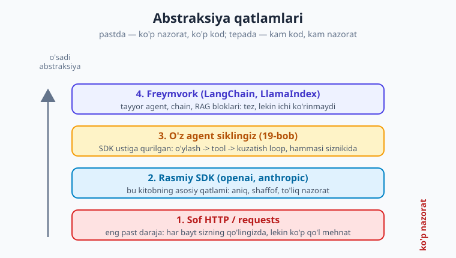

# 20 — Agent freymvorklari va MCP

[⬅️ Oldingi: 19 — 0 dan agent qurish](./19-agent-qurish.md) · [🏠 Kitob boshi](./README.md) · [Keyingi: 21 — Lokal LLM: Ollama ➡️](./21-lokal-llm-ollama.md)

> **Bu bobda:** 19-bobda agentni **qo'lda, sof kod** bilan qurdik. Endi savol tug'iladi: "Buni har safar o'zim yozishim shartmi?" Javob — yo'q. **Freymvorklar** (LangChain, LlamaIndex) agent, chain va RAG'ning tayyor bloklarini beradi. Ularning afzalligini (tez, tayyor integratsiyalar) va kamchiligini (qora quti, ortiqcha abstraksiya, versiya o'zgarishi) ko'ramiz. So'ng **MCP (Model Context Protocol)** — LLM ilovalarni tashqi tool va ma'lumotga ulashning **ochiq standarti**, ya'ni "AI uchun USB-C" — bilan tanishamiz. Oxirida aniq qaror beramiz: **qachon sof kod, qachon freymvork, qachon MCP**.

---

## Muammodan boshlaymiz: g'ildirakni qayta ixtiro qilmaslik

19-bobda agent siklini o'z qo'limiz bilan yozdik: tool ro'yxatini tuzdik, `while` loop qildik, modelning `tool_calls`ini bajardik, natijani qaytardik. Bu — **bebaho tajriba**: endi siz agent "ichida" nima sodir bo'lishini *aniq* bilasiz.

Lekin haqiqiy loyihada yana bir nechta narsa kerak bo'ladi: suhbat xotirasini saqlash, hujjatlarni o'qib bo'laklarga bo'lish (chunking), vektor bazaga ulash, turli fayl formatlarini o'qish (PDF, Word, veb-sahifa), qayta urinish (retry) mantiqi... Bularning **har birini noldan yozish** — ko'p vaqt va ko'p xato.

Mana shu yerda **freymvorklar** yordamga keladi. Ular shu takrorlanadigan ishlarni **tayyor blok** sifatida beradi — siz faqat ulab ishlatasiz.

> **Hayotiy o'xshatish.** 19-bob — mashinani **bo'laklardan o'zingiz yig'ish**: dvigatel, g'ildirak, simlar. Buni bir marta qilsangiz, mashina qanday ishlashini tushunasiz. Freymvork esa — **tayyor mashina sotib olish**: tez minib ketasiz, lekin kapot ostida nima borligini ko'rmaysiz. Ikkalasining ham o'rni bor — qaysi biri kerakligi *vaziyatga* bog'liq.



Bu kitob asosan **2-qatlamda** (rasmiy SDK) yashadi — chunki u shaffof va to'liq nazoratli. Freymvork — eng tepa qatlam. Pastni tushunmasdan tepaga chiqsangiz, biror narsa buzilganda *nima uchun* buzilganini bilmaysiz.

---

## LangChain: tayyor agent va chain

**LangChain** — eng mashhur LLM freymvorki. Uning ikki asosiy g'oyasi bor:

- **Chain (zanjir)** — bir necha qadamni (prompt -> model -> qayta ishlash -> yana model) **ulab** quyish.
- **Agent** — modelga tool berib, qaysi toolni qachon ishlatishni o'ziga qoldirish (aynan 19-bobda qo'lda qurganimiz).

Keling, 19-bobdagi "qo'lda" agentni LangChain bilan taqqoslaymiz. Avval o'rnatamiz:

```bash
pip install langchain langchain-openai
```

So'ng oddiy agent (tushuncha darajasida — API tafsilotlari versiyaga qarab o'zgaradi):

```python
import os
from dotenv import load_dotenv
from langchain_openai import ChatOpenAI
from langchain_core.tools import tool

load_dotenv()

# Tool — oddiy Python funksiyaga @tool dekoratori qo'yamiz.
# Docstring -> modelga ko'rsatma sifatida ketadi (sxemani LangChain o'zi yasaydi).
@tool
def ob_havo(shahar: str) -> str:
    """Berilgan shahar uchun joriy ob-havoni qaytaradi."""
    return f"{shahar}: 24 daraja, ochiq."

# Eslatma: model nomlari o'zgaradi — provayder ro'yxatini tekshiring.
model = ChatOpenAI(model="gpt-5.4-mini")
model_tool = model.bind_tools([ob_havo])   # toolni modelga "bog'laymiz"

javob = model_tool.invoke("Toshkentda ob-havo qanday?")
print(javob.tool_calls)   # model qaysi toolni chaqirmoqchi ekani
```

E'tibor bering: 19-bobda biz tool sxemasini (JSON `parameters`) **qo'lda** yozdik; LangChain uni funksiya tip-belgilaridan (`shahar: str`) va docstringdan **avtomatik** yasadi. Bu — abstraksiya foydasi: kamroq qo'l mehnat.

To'liq agent loopni ham LangChain o'zi boshqaradi (`while` loopni siz yozmaysiz):

```python
from langgraph.prebuilt import create_react_agent

agent = create_react_agent(model, [ob_havo])
natija = agent.invoke({"messages": [("user", "Toshkent va Samarqandda ob-havo qanday?")]})
print(natija["messages"][-1].content)
```

Bir qatorda — 19-bobda o'nlab qator yozgan **butun ReAct siklimiz**. Tez, shunday emasmi? Lekin shu yerda kamchiliklarni ham ko'rish kerak.

!!! warning "Freymvork = qora quti"
    `create_react_agent` ichida **aynan nima** sodir bo'lyapti? Nechta so'rov ketdi? Promptga qanday matn qo'shildi? Tool xatosi qanday qayta ishlandi? Bularni endi **ko'rmaysiz** — abstraksiya yashiradi. Ish to'g'ri ketsa zo'r; biror narsa noto'g'ri ketsa, debug qilish ancha qiyin. Aynan shuning uchun **avval 19-bobni** o'rgangan edik: pastki qatlamni tushungan odam yuqori qatlamni ham boshqara oladi.

### LangChain: afzallik va kamchilik

| Afzallik | Kamchilik |
|---|---|
| Tez prototip — oz kod, ko'p ish | Qora quti: ichida nima borligi ko'rinmaydi |
| Tayyor integratsiyalar (yuzlab tool, vektor baza, fayl o'qigich) | Ortiqcha abstraksiya — oddiy ishga ham og'ir |
| Hamjamiyat, ko'p misol va tutorial | Versiya tez o'zgaradi — kodingiz buzilishi mumkin |
| Standart naqshlar (RAG, agent) tayyor | Yashirin so'rovlar -> kutilmagan token xarajati |

> **Hayotiy o'xshatish.** Sof SDK — **xom ashyo va asboblar**: har narsani o'zingiz quyasiz, lekin har bir mix qayerga qoqilganini bilasiz. Freykvork — **IKEA mebeli to'plami**: tez yig'iladi, lekin faqat ishlab chiqaruvchi ko'zda tutgan shaklda. Maxsus narsa kerak bo'lsa — to'plam cheklab qo'yadi.

!!! tip "Oltin maslahat: avval sof tushun, keyin freymvork"
    Freymvorkni 19-bobdagi sof kodni **tushunganingizdan keyin** o'rganing. Shunda freymvork sizga "sehr" emas, balki "tanish ishni qisqartiruvchi vosita" bo'lib ko'rinadi. Aksincha qilsangiz — freymvork buzilganida nima qilishni bilmay qolasiz.

---

## LlamaIndex: ayniqsa RAG uchun

**LlamaIndex** — ko'proq **RAG'ga ixtisoslashgan** freymvork (13–17-boblarda RAG'ni qo'lda qurganmiz: hujjatni bo'laklash -> embedding -> vektor baza -> qidiruv -> modelga kontekst berish). LlamaIndex shu butun quvurni bir necha qatorga jamlaydi.

```bash
pip install llama-index
```

Tushuncha darajasida (API tafsilotlari versiyaga qarab o'zgaradi):

```python
from llama_index.core import VectorStoreIndex, SimpleDirectoryReader

# 1) Papkadagi hujjatlarni o'qiydi (PDF, txt, docx — formatni o'zi aniqlaydi)
hujjatlar = SimpleDirectoryReader("./hujjatlar").load_data()

# 2) Bo'laklash + embedding + vektor indeks — hammasi shu bitta qatorda
indeks = VectorStoreIndex.from_documents(hujjatlar)

# 3) Savol-javob dvigateli
qa = indeks.as_query_engine()
print(qa.query("Hujjatlarda qaytarish siyosati nima deyilgan?"))
```

17-bobda biz **har bir bosqichni** (o'qish, chunking, embedding, ChromaDB, qidiruv, prompt) alohida yozgandik. LlamaIndex bularning hammasini `from_documents` + `query` ichiga yashiradi. Tez prototip uchun ajoyib; lekin "nega aynan shu javob keldi?", "qaysi bo'lak topildi?", "chunk o'lchami qancha?" degan savollar paydo bo'lganda — yana pastki qatlamga tushishingiz kerak bo'ladi.

!!! note "Qaysi freymvork?"
    Umumiy **agent va chain** uchun — ko'pchilik LangChain'ni tanlaydi. **RAG** og'irlikdagi loyiha (ko'p hujjat, ko'p format) uchun — LlamaIndex ko'pincha qulayroq. Ikkalasi bir-birini istisno qilmaydi; hatto birga ham ishlatiladi. Lekin ikkalasiniyam **sof tushunchadan keyin** o'rganing.

---

## MCP: "AI uchun USB-C"

Endi butunlay boshqa, lekin juda muhim g'oya. Tasavvur qiling, siz `ob_havo` toolini yozdingiz. Endi uni **Claude Desktop**da ham, o'z **chatbotingizda** ham, **IDE**'ngizda ham ishlatmoqchisiz. Har biri tool'ni **o'z formatida** kutadi. Demak, bir xil toolni har bir ilova uchun **qaytadan** ulashingizga to'g'ri keladi. Bu — xuddi har bir qurilma uchun alohida zaryadlovchi simdek noqulay.

**MCP (Model Context Protocol)** — aynan shu muammoni hal qiladi. Bu — LLM ilovalarni tashqi **tool** va **ma'lumot manbalariga** ulashning **ochiq standarti**. Uni ko'pincha **"AI uchun USB-C"** deb atashadi: bitta standart ulagich, har qanday qurilmaga to'g'ri keladi.

> **Hayotiy o'xshatish.** USB-C dan oldin har bir telefon, kamera, printerda boshqa-boshqa ulagich bor edi — har biriga alohida sim. USB-C kelgach, **bitta sim** hamma narsaga yaraydi. MCP — AI dunyosidagi USB-C: tool'ni **bir marta** MCP serveri sifatida yozasiz, va uni **har qanday MCP-mos ilova** (Claude Desktop, IDE, agentingiz) hech qanday o'zgartirishsiz ishlatadi.

### Client-server arxitekturasi

MCP ikki tomondan iborat:

- **MCP server** — tool va resurslarni **taqdim etadi**. Masalan, "fayllarni o'qish" serveri, "ma'lumotlar bazasiga so'rov" serveri, "GitHub" serveri. Siz yozasiz (yoki tayyorini olasiz).
- **Host (ilova)** ichidagi **MCP client** — serverga **ulanadi** va uning tool'laridan foydalanadi. Host — bu sizning AI ilovangiz: chatbot, IDE, agent.


Server ikki narsani taqdim etishi mumkin:

- **Tool** — model **chaqira oladigan** harakat (10-bobdagi function calling kabi): "SQL bajar", "fayl yoz", "issue och".
- **Resource** — modelga **kontekst** beriladigan ma'lumot: hujjat, fayl tarkibi, baza yozuvi.

### Nega standart muhim: bir marta yoz, ko'p joyda ishlat

Standartning butun kuchi shunda. Tasavvur qiling, kompaniyangizning ichki bazasiga ulanadigan MCP serverini **bir marta** yozdingiz:

- Uni Claude Desktop'da ishlatasiz — **o'zgartirish kerak emas**.
- Uni o'z agentingizda ishlatasiz — **o'zgartirish kerak emas**.
- Hamkasbingiz uni o'z IDE'sida ishlatadi — **o'zgartirish kerak emas**.

Standart bo'lmaganda esa, har bir ilova uchun integratsiyani qayta yozardingiz. Standart bo'lgani uchun — **bir marta yoz, hamma joyda ishlat**.

```text
# Konseptual: MCP server qanday ko'rinadi (psevdo-kod)
#  - server "ob_havo" nomli tool e'lon qiladi (nom, tavsif, parametr sxemasi)
#  - host (masalan Claude Desktop) serverga ulanadi
#  - host modelga: "senda 'ob_havo' degan tool bor" deydi
#  - model uni chaqirmoqchi bo'lsa, host so'rovni MCP orqali serverga uzatadi
#  - server funksiyani bajaradi va natijani protokol bo'ylab qaytaradi
```

Diqqat qiling: bu — 10–11-boblardagi **function calling**ning aynan o'zi, lekin **standartlashtirilgan** va **ilovadan ajratilgan** ko'rinishi. Tool endi sizning kod ichingizda emas, balki **alohida server** sifatida yashaydi va uni har kim ulay oladi.

!!! note "Amalda MCP server qanday yoziladi?"
    Python uchun rasmiy `mcp` paketi (`pip install mcp`) bor; ko'pincha `FastMCP` yordamida tool'ni oddiy funksiyaga dekorator qo'yib e'lon qilasiz — xuddi LangChain'dagi `@tool` kabi. Tayyor serverlar (fayl tizimi, GitHub, Postgres, Slack...) ham mavjud — ularni o'rnatib, sozlab darrov ishlatasiz. Tafsilotlar tez rivojlanmoqda, shuning uchun **rasmiy hujjatni** tekshiring.

!!! tip "MCP — freymvorkning raqibi emas"
    MCP va LangChain bir-biriga zid emas. MCP — **tool'ni ulash standarti**; freymvork — **agent mantig'ini qurish vositasi**. Ularni **birga** ishlatish mumkin: agentingizni LangChain bilan qurib, tool'larini MCP serverlaridan olishingiz mumkin. MCP — "tool qayerdan keladi", freymvork — "agent qanday o'ylaydi".

---

## Qachon sof kod, qachon freymvork, qachon MCP

Endi eng amaliy savolga aniq javob beraylik.


**Sof SDK / kod (bu kitobning asosiy yo'li) — qachon:**

- O'rganayotganingizda — ichini tushunish uchun (har doim shundan boshlang).
- To'liq nazorat kerak bo'lganda: aniq nechta so'rov, qanday prompt, qanday xato boshqaruvi.
- Mantiq oddiy yoki juda maxsus bo'lganda — freymvork ortiqcha yuk bo'lib qoladi.
- Debug osonligi va **kam bog'liqlik** (lock-in yo'q) muhim bo'lganda.

**Freymvork (LangChain / LlamaIndex) — qachon:**

- Tez prototip yoki MVP kerak bo'lganda.
- Tayyor integratsiya (ko'p fayl formati, o'nlab vektor baza, yuzlab tool) ko'p vaqt tejaganda.
- Standart naqsh (oddiy RAG, oddiy agent) yetarli bo'lganda.
- Jamoangiz allaqachon shu freymvorkni bilganida.

**MCP — qachon:**

- Bitta tool yoki ma'lumot manbasini **ko'p xil ilovaga** ulash kerak bo'lganda.
- Boshqalar (yoki kelajakdagi o'zingiz) tool'ingizni qayta ishlatishini xohlaganingizda.
- Tayyor MCP serveridan (GitHub, baza, fayl tizimi) foydalanmoqchi bo'lganingizda.
- Ekotizim standartiga moslashish (masalan, Claude Desktop'ga tool qo'shish) kerak bo'lganda.

> **Hayotiy o'xshatish.** Bular — **bir-birini istisno qiladigan tanlovlar emas**, balki turli vaziyatga mos asboblar. Yaxshi usta bitta asbobni emas, **butun yashikni** ishlatadi: bugun bolg'a, ertaga otvyortka. Sof kod bilan *tushunasiz*, freymvork bilan *tezlashasiz*, MCP bilan *ulashasiz* va *qayta ishlatasiz*.

!!! question "O'zingizdan so'rang"
    Yangi loyiha boshlashdan oldin uch savol: (1) Bu yerda men nimani *o'rganmoqchiman* — agar ichini tushunish kerak bo'lsa, sof kod. (2) Bu *standart* ishmi — ha bo'lsa, freymvork tejaydi. (3) Bu tool *boshqa joyda ham* kerakmi — ha bo'lsa, MCP server qiling. Javoblar sizni to'g'ri qatlamga olib boradi.

---

## Xulosa

- 19-bobda agentni **sof kod** bilan qurdik; **freymvorklar** (LangChain, LlamaIndex) shu takrorlanadigan ishlarni tayyor blok sifatida beradi — tez, lekin shaffof emas.
- **LangChain** — agent va chain uchun mashhur freymvork: `@tool` dekoratori sxemani avtomatik yasaydi, `create_react_agent` butun ReAct siklini bir qatorga jamlaydi.
- Freymvork afzalligi: **tezlik va tayyor integratsiyalar**. Kamchiligi: **qora quti, ortiqcha abstraksiya, versiya o'zgarishi**, yashirin token xarajati.
- **LlamaIndex** — ayniqsa **RAG** uchun qulay: hujjat o'qish, chunking, embedding, indeks va savol-javobni bir necha qatorga jamlaydi.
- **MCP (Model Context Protocol)** — LLM ilovalarni tashqi tool/ma'lumotga ulashning **ochiq standarti**, "AI uchun USB-C". **Server** tool/resource taqdim etadi, **host** ichidagi **client** ulanadi.
- MCP'ning kuchi — **standart**: tool'ni **bir marta yozasiz**, har qanday MCP-mos ilova (Claude Desktop, IDE, agent) uni o'zgarishsiz ishlatadi.
- **Oltin qoida:** avval **sof kod bilan tushun**, keyin freymvork bilan tezlash, MCP bilan ula va qayta ishlat. Ular bir-birini istisno qilmaydi — ko'pincha aralash ishlatiladi.

## Amaliy mashqlar

1. **(Oson)** O'z so'zingiz bilan tushuntiring: nega freymvorkni o'rganishdan oldin (19-bobdagidek) agentni qo'lda qurish foydali? "Qora quti" va "debug" so'zlarini ishlating.

2. **(Oson)** MCP nima uchun "AI uchun USB-C" deb ataladi? "Standart", "bir marta yoz" va "ko'p joyda ishlat" iboralaridan foydalanib javob bering.

3. **(O'rtacha)** `pip install langchain langchain-openai` qiling va shu bobdagi `@tool` + `bind_tools` misolini ishga tushiring. So'ng 19-bobda yozgan qo'lda agentingiz bilan taqqoslang: qaysi qism qisqardi, qaysi tafsilot endi ko'rinmay qoldi? Uchta farqni yozib oling.

4. **(O'rtacha)** Quyidagi vaziyatlarning har biri uchun sof kod / freymvork / MCP dan qaysi birini tanlaysiz va nega: (a) AI integratsiyasini endi o'rganayotgan o'quvchisiz; (b) ertaga investorga ko'rsatish uchun tez RAG-demo kerak; (c) kompaniyangizning ichki bazasiga ulanadigan tool'ni ham chatbotda, ham IDE'da ishlatmoqchisiz.

5. **(Qiyin)** 17-bobdagi qo'lda qurgan RAG quvuringizni eslang. Uni LlamaIndex'ning `VectorStoreIndex.from_documents` bilan taqqoslang: LlamaIndex qaysi bosqichlarni yashiradi (o'qish, chunking, embedding, qidiruv, prompt)? Har bir yashirilgan bosqich uchun "nega buni ko'rmaslik xavfli bo'lishi mumkin?" degan kamida bitta sabab yozing (masalan, chunk o'lchamini bilmaslik javob sifatiga qanday ta'sir qiladi).

---

[⬅️ Oldingi: 19 — 0 dan agent qurish](./19-agent-qurish.md) · [🏠 Kitob boshi](./README.md) · [Keyingi: 21 — Lokal LLM: Ollama ➡️](./21-lokal-llm-ollama.md)
