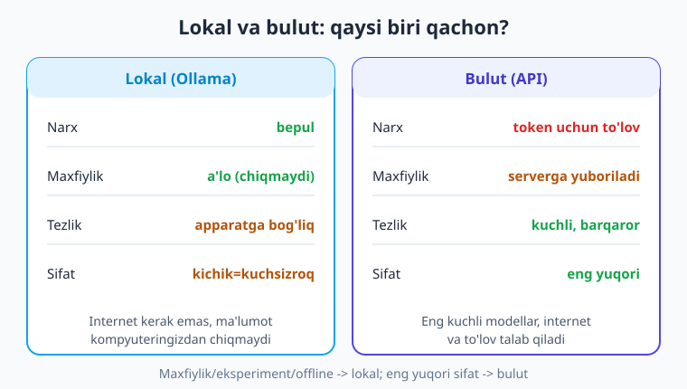
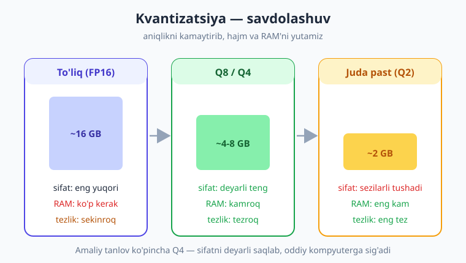

# 21 — Lokal LLM: Ollama

[⬅️ Oldingi: 20 — Agent freymvorklari va MCP](./20-agent-freymvork-mcp.md) · [🏠 Kitob boshi](./README.md) · [Keyingi: 22 — Xarajat, token va keshlash ➡️](./22-xarajat-token-kesh.md)

> **Bu bobda:** modelni o'z kompyuteringizda — **internetsiz, bepul va to'liq maxfiy** — ishlatishni o'rganamiz. **Ollama**ni o'rnatamiz, terminalda birinchi modelni yuklab sinab ko'ramiz, so'ng Python'dan ikki yo'l bilan ulanamiz: (a) `ollama` native kutubxonasi va (b) **OpenAI-mos endpoint** — bu eng kuchli joyi, chunki oldingi boblardagi BARCHA kod o'zgarmasdan ishlaydi. Lokal **embeddings** bilan RAG'ni butunlay offline qurish mumkinligini ko'ramiz, **model tanlash** (hajm vs RAM) va **kvantizatsiya** nimaligini tushunamiz hamda lokal va bulut o'rtasidagi **savdolashuvni** (tezlik, sifat, narx, maxfiylik) aniqlaymiz.

---

## Muammodan boshlaymiz: har so'rov pul va maxfiylikmi?

Bu vaqtgacha biz bulutli provayderga (OpenAI, Groq, Gemini...) so'rov yubordik. Bu ajoyib, lekin uchta cheklov bor:

1. **Pul.** Har bir token uchun to'laysiz. Eksperiment qilayotganda, yuzlab marta kodni qayta ishga tushirsangiz — xarajat yig'iladi.
2. **Maxfiylik.** Foydalanuvchining shaxsiy ma'lumoti, tibbiy yozuvi yoki kompaniyaning ichki hujjati — bularning hammasi tashqi serverga yuboriladi. Ba'zan buni qilib bo'lmaydi (qonun yoki siyosat taqiqlaydi).
3. **Internet.** Internet bo'lmasa — ilova ishlamaydi. Samolyotda, sifatsiz ulanishda yoki ajratilgan tarmoqda muammo.

Mana shu uch holatda **lokal LLM** — o'z kompyuteringizda ishlaydigan ochiq model — yechim bo'ladi. Token to'lovi yo'q, ma'lumot mashinangizdan chiqmaydi, internet kerak emas. Eksperiment uchun esa bu — chinakam erkinlik: minglab so'rov yuboring, hech kim hisob ko'rsatmaydi.

> **Hayotiy o'xshatish.** Bulutli model — **taksi**: qulay, kuchli, lekin har safar hisoblagich ishlaydi va telefon (internet) kerak. Lokal model — **garajdagi velosiped**: bir marta sotib olasiz, keyin xohlagancha minasiz, hech kimga pul to'lamaysiz va hech qayerga "buyurtma" yuborilmaydi. Velosiped taksidan sekinroq bo'lishi mumkin, lekin u har doim sizniki va yoningizda.



!!! note "Lokal model qayerdan keladi?"
    Llama (Meta), Qwen (Alibaba), Mistral, Gemma (Google) kabi kompaniyalar **ochiq vaznli** (open-weight) modellarni bepul tarqatadi. Ya'ni model "miyasi" (vaznlari) yuklab olinadi va sizning mashinangizda ishlaydi. Bularni qo'lda ishga tushirish murakkab — **Ollama** aynan shuni bir buyruqqa aylantiradi.

---

## Ollama nima va uni o'rnatish

**Ollama** — lokal modelni ishga tushirishning eng oson yo'li. U ikki narsani qiladi: (1) modellarni yuklab oladi va saqlaydi, (2) kompyuteringizda kichik bir **server** ishga tushiradi (`localhost:11434` manzilida), shu serverga so'rov yuborib javob olasiz.

O'rnatish oddiy: [ollama.com](https://ollama.com) saytiga kirib, operatsion tizimingiz (Windows / macOS / Linux) uchun o'rnatuvchini yuklab oling va ishga tushiring. O'rnatilgach, Ollama fon rejimida ishlay boshlaydi.

Endi terminalda birinchi modelni yuklaymiz va sinaymiz:

```bash
# Modelni yuklab olish (bir marta — birinchi safar bir necha GB yuklanadi)
ollama pull llama3.2

# Terminalda jonli suhbat (sinov uchun)
ollama run llama3.2

# Yuklab olingan modellar ro'yxati
ollama list
```

`ollama run llama3.2` buyrug'i sizni model bilan to'g'ridan-to'g'ri suhbatga kiritadi — savol yozing, javob keladi. Chiqish uchun `/bye`. Bu — kod yozishdan oldin model ishlayotganini tekshirishning eng tez yo'li.

> **Hayotiy o'xshatish.** `ollama pull` — do'kondan asbobni **bir marta sotib olish** (yuklab olish), `ollama run` esa uni **ishlatish**. Bir marta yuklasangiz, keyin internetsiz ham, cheksiz marta ishlatasiz.

!!! tip "Model nomlari o'zgaradi"
    Bu yerda `llama3.2` ishlatilmoqda, lekin yangi modellar tez-tez chiqadi (`qwen2.5`, `gemma3` va h.k.). **Doim joriy ro'yxatni** [ollama.com/library](https://ollama.com/library) dan tekshiring va kompyuteringizga mos hajmdagisini tanlang (pastda model tanlashga qaytamiz).

---

## Python'dan ulanish (a): native `ollama` kutubxonasi

Ollama'ning o'z Python kutubxonasi bor. Avval o'rnatamiz:

```bash
pip install ollama
```

Eng oddiy chaqiruv — chat. Diqqat qiling: bu yerda `.env`, kalit yoki internet **kerak emas** — server lokal:

```python
import ollama

resp = ollama.chat(
    model="llama3.2",   # ollama list dagi nom; nomlar o'zgaradi
    messages=[
        {"role": "system", "content": "Sen o'zbek tilida javob beradigan yordamchisan."},
        {"role": "user", "content": "Lokal LLM nima ekanini bir jumlada tushuntir."},
    ],
)

# Javob matni "message" -> "content" maydonida
print(resp["message"]["content"])
```

`messages` formati — aynan oldingi boblardagidek (`system`/`user`/`assistant` rollari). Farq faqat javobni o'qishda: bulutli SDK'da `resp.choices[0].message.content` edi, bu yerda `resp["message"]["content"]`.

### Streaming (javobni bo'lak-bo'lak)

Uzun javobni kutib o'tirmasdan, so'z paydo bo'lgani sayin ekranga chiqarish uchun `stream=True`:

```python
import ollama

stream = ollama.chat(
    model="llama3.2",
    messages=[{"role": "user", "content": "Python'ning 3 ta afzalligini sana."}],
    stream=True,
)

for chunk in stream:
    print(chunk["message"]["content"], end="", flush=True)
print()
```

> **Hayotiy o'xshatish.** Streaming'siz javob — pochta orqali kelgan **butun xat**: hammasi tayyor bo'lguncha kutasiz. Streaming bilan — kimdir **telefon orqali jumla-jumla** o'qib berayotgandek: birinchi so'zlarni darrov eshitasiz. Lokal modelda bu ayniqsa foydali, chunki sekinroq apparatda butun javobni kutish zerikarli.

---

## Python'dan ulanish (b): OpenAI-mos endpoint — eng kuchli usul

Mana bobning eng muhim g'oyasi. Ollama serveri **OpenAI-mos** API'ni ham taqdim etadi (`localhost:11434/v1` manzilida). Demak, oddiy `openai` SDK'sini ishlatib, faqat `base_url` va kalitni almashtirsangiz — **butun kitob davomida yozgan kodingiz hech o'zgarishsiz** lokal modelda ishlaydi.

```python
from openai import OpenAI

# Lokal Ollama serveriga ulanamiz.
# api_key shart, lekin qiymati ahamiyatsiz — Ollama tekshirmaydi.
client = OpenAI(
    base_url="http://localhost:11434/v1",
    api_key="ollama",
)

MODEL = "llama3.2"   # ollama list dagi nom

resp = client.chat.completions.create(
    model=MODEL,
    messages=[
        {"role": "system", "content": "Sen foydali yordamchisan."},
        {"role": "user", "content": "OpenAI-mos endpoint nega qulay?"},
    ],
)

# Javobni AYNAN bulutdagidek o'qiymiz!
print(resp.choices[0].message.content)
```

Bu kodga diqqat bilan qarang: u 2-bobdagi birinchi so'rov bilan **deyarli bir xil**. Yagona farq — `base_url` va kalit. `chat.completions.create(...)`, `resp.choices[0].message.content`, hatto `stream=True` ham — barchasi o'zgarmaydi.


!!! tip "Nega bu juda kuchli"
    Bitta o'zgaruvchini almashtirib (`base_url`), ilovangizni bulutdan lokalga yoki aksincha ko'chirasiz. Mashina ustida arzon model bilan ishlab chiqing, ishlab chiqarishda (production) kuchli bulut modelga o'ting — **kod bir xil**. 4-bobdagi ko'p-provayderli yondashuv aynan shu yerda samara beradi.

!!! note "Streaming OpenAI-mos endpoint'da"
    8-bobdagi streaming kodi (`stream=True`, keyin `for chunk in stream: chunk.choices[0].delta.content`) Ollama'ning OpenAI-mos endpoint'ida ham xuddi o'shanday ishlaydi. Yana bir bor: kod o'zgarmaydi.

---

## Lokal embeddings: RAG'ni butunlay offline qurish

13–17-boblarda **RAG** (o'z hujjatlaringiz ustida savol-javob) qurdik va matnni vektorga aylantirish uchun **embeddings** ishlatdik. O'sha embeddinglarni ham lokal olish mumkin — RAG butunlay kompyuteringizda, internetsiz ishlaydi.

Avval embedding modelini yuklang:

```bash
ollama pull nomic-embed-text
```

Native kutubxona bilan:

```python
import ollama

# Bir nechta matnni vektorga aylantirish
hujjatlar = [
    "Ollama lokal LLM serverini ishga tushiradi.",
    "RAG modelga o'z hujjatlaringizni kontekst sifatida beradi.",
]

resp = ollama.embed(model="nomic-embed-text", input=hujjatlar)
vektorlar = resp["embeddings"]   # har bir matn uchun list[float]

print("Matnlar soni:", len(vektorlar))
print("Vektor o'lchami:", len(vektorlar[0]))
```

Yoki — yana o'sha kuchli usul — **OpenAI-mos** endpoint orqali, 14-bobdagi embedding kodi bilan bir xil:

```python
from openai import OpenAI

client = OpenAI(base_url="http://localhost:11434/v1", api_key="ollama")

e = client.embeddings.create(
    model="nomic-embed-text",
    input=["matn1", "matn2"],
)
vektor = e.data[0].embedding   # list[float]
```

Bu degani: 13–17-boblardagi RAG quvuringizni (chunklash -> embed -> vektor bazasi -> qidiruv -> chat) **bulutsiz** qurishingiz mumkin. Embedding ham, chat ham lokal — hech narsa internetga chiqmaydi. Maxfiy hujjatlar (shartnoma, tibbiy ma'lumot) bilan ishlaganda bu — bebaho.

> **Hayotiy o'xshatish.** RAG — kutubxonadan kerakli sahifani topib, savol bilan birga modelga berish. Lokal embedding bilan — bu **shaxsiy uy kutubxonangiz**: hech kim qaysi kitobni ochganingizni ko'rmaydi, va kitoblar uyingizdan chiqmaydi.

!!! warning "Embedding modelni almashtirmang"
    RAG bazasini bir embedding modeli (masalan, `nomic-embed-text`) bilan qurib, keyin boshqa model bilan qidirsangiz — vektorlar mos kelmaydi, natija bema'ni bo'ladi. Bazani qurgan model bilan **bir xil model**ni qidiruvda ham ishlating.

---

## Model tanlash: hajm vs RAM

Lokal modellar har xil **hajm**da keladi — parametr soni bilan o'lchanadi (B = milliard, billion):

- **Kichik (1B–3B):** masalan `llama3.2` (3B). Tez, kam RAM (8 GB kompyuterga sig'adi), lekin "aqli" cheklangan — oddiy vazifalar uchun yaxshi.
- **O'rta (7B–14B):** masalan `qwen2.5` (7B). Sezilarli kuchliroq, lekin 16 GB+ RAM/VRAM kerak.
- **Katta (30B+):** kuchli, lekin ko'p RAM va kuchli videokarta (GPU) talab qiladi — oddiy noutbukda sekin yoki umuman ishlamaydi.

Asosiy qoida: **model qancha katta — sifat shuncha yaxshi, lekin RAM/VRAM shuncha ko'p va tezlik shuncha past.** O'z kompyuteringizning xotirasiga (RAM, GPU bo'lsa VRAM) qarab tanlang. Boshlash uchun kichik modeldan (`llama3.2`) boshlang — ishlasa, kattaroqqa o'ting.

> **Hayotiy o'xshatish.** Model hajmi — **dvigatel hajmi**. Katta dvigatel kuchliroq, lekin ko'proq yoqilg'i (RAM) yeydi va og'irroq. Shahar ichida yurish uchun kichik, tejamkor dvigatel yetadi; faqat haqiqatan kuch kerak bo'lganda kattasiga o'tasiz.

---

## Kvantizatsiya: sifatdan biroz voz kechib, hajm/tezlik yutish

Modelning vaznlari odatda yuqori aniqlikdagi sonlar (masalan, FP16) bilan saqlanadi. **Kvantizatsiya** — bu sonlarni kamroq bit bilan (Q8, Q4, hatto Q2) saqlash. Bu modelning hajmini va RAM ehtiyojini keskin kamaytiradi, tezlikni oshiradi — sifatni esa **biroz** yo'qotadi.



Amalda Ollama modellari ko'pincha allaqachon kvantlangan (default odatda Q4 atrofida) — shuning uchun oddiy kompyuterga sig'adi. Eng muhim xulosa: **Q4** ko'p hollarda eng yaxshi savdolashuv — sifat deyarli to'liq saqlanadi, lekin model bir necha barobar kichik bo'ladi.

> **Hayotiy o'xshatish.** Kvantizatsiya — yuqori sifatli rasmni **JPEG sifatida saqlash**. Fayl bir necha barobar kichrayadi, ko'z bilan farqni deyarli sezmaysiz. Lekin sifatni juda pasaytirsangiz (Q2 — past JPEG), "artefaktlar" paydo bo'ladi: model xato qila boshlaydi.

!!! note "Tegni o'qish"
    Ollama'da model nomidan keyin teg bo'ladi: `llama3.2:3b-instruct-q4_0`. Bu yerda `3b` — hajm, `q4_0` — kvantizatsiya darajasi. Teg ko'rsatilmasa, Ollama mos default'ni tanlaydi. [ollama.com/library](https://ollama.com/library) da har model uchun variantlar ro'yxati bor.

---

## Lokal vs bulut: qachon qaysi?

Endi to'liq rasmni yig'aylik. Bular o'rtasidagi savdolashuv:

| Mezon | Lokal (Ollama) | Bulut (API) |
|---|---|---|
| **Narx** | Bepul (faqat elektr) | Token uchun to'lov |
| **Maxfiylik** | A'lo — ma'lumot chiqmaydi | Server'ga yuboriladi |
| **Internet** | Kerak emas | Shart |
| **Tezlik** | Apparatga bog'liq (sekin bo'lishi mumkin) | Barqaror, tez |
| **Sifat** | Kichik modellar kuchsizroq | Eng yuqori (eng katta modellar) |

**Qachon lokal:** maxfiy ma'lumot bilan ishlaganda; offline kerak bo'lganda; ko'p eksperiment qilganda (xarajatdan qo'rqmay); o'rganish uchun.

**Qachon bulut:** eng yuqori sifat kerak bo'lganda (murakkab fikrlash, uzun kontekst); kuchli apparat yo'q bo'lganda; ko'p foydalanuvchiga bir vaqtda xizmat qilganda (server masshtabini bulut ko'taradi).

**Amaliy gibrid yondashuv:** ishlab chiqishni lokal model bilan boshlang (tekin, tez iteratsiya), ishlab chiqarishda yoki murakkab so'rovlarda bulutga o'ting. `base_url` almashtirilgani sababli — bu juda oson.

> **Hayotiy o'xshatish.** Bu — uyda ovqat pishirish va restoran o'rtasidagi tanlovga o'xshaydi. Uyda (lokal) — arzon, maxfiy, xohlagancha tajriba; restoran (bulut) — professional sifat, lekin har taom uchun to'laysiz. Aqlli odam ikkalasidan ham o'rni bilan foydalanadi.

---

## Tool calling lokal modellarda (qisqa eslatma)

10–11-boblarda **tool/function calling**ni o'rgangandik. Ba'zi lokal modellar (masalan, yangiroq `llama3.2`, `qwen2.5`) buni qo'llab-quvvatlaydi — ya'ni model "men `ob_havo` funksiyasini chaqiraman" deb ayta oladi va siz uni xuddi bulutdagidek qayta ishlaysiz. Native kutubxonada:

```python
import ollama

tools = [{
    "type": "function",
    "function": {
        "name": "ob_havo",
        "description": "Shahar bo'yicha joriy ob-havoni qaytaradi",
        "parameters": {
            "type": "object",
            "properties": {"shahar": {"type": "string"}},
            "required": ["shahar"],
        },
    },
}]

resp = ollama.chat(
    model="llama3.2",
    messages=[{"role": "user", "content": "Toshkentda ob-havo qanday?"}],
    tools=tools,
)
# Agar model tool chaqirsa: resp["message"]["tool_calls"]
print(resp["message"].get("tool_calls"))
```

OpenAI-mos endpoint orqali esa — 10-bobdagi tool kodi o'zgarmaydi (faqat `base_url`).

!!! warning "Lokal tool calling — ishonchliligi past"
    Kichik lokal modellar tool calling'da bulut modellaridan **ancha kuchsiz**: ba'zan funksiya nomini xato yozadi, argumentni noto'g'ri to'ldiradi yoki umuman chaqirmaydi. Murakkab agent (18–20-boblar) uchun lokal kichik model ko'pincha yetarli emas. Tool calling kerak bo'lsa — modelni sinab tekshiring va imkon bo'lsa kattaroq/yangiroqini tanlang.

---

## Xulosa

- **Lokal LLM** uch muammoni hal qiladi: **bepul** (token to'lovi yo'q), **maxfiy** (ma'lumot kompyuterdan chiqmaydi), **offline** (internetsiz) — va eksperiment uchun cheksiz erkinlik beradi.
- **Ollama** — lokal modelni ishga tushirishning eng oson yo'li: `ollama pull <model>` (yuklab olish), `ollama run <model>` (terminalda sinov), `ollama list` (ro'yxat). U `localhost:11434` da server ishga tushiradi.
- Python'dan **ikki yo'l**: (a) native `import ollama; ollama.chat(...)` -> javob `resp["message"]["content"]`; (b) **OpenAI-mos** `OpenAI(base_url="http://localhost:11434/v1", api_key="ollama")` — bunda oldingi boblardagi **barcha kod o'zgarmasdan ishlaydi**.
- Lokal **embeddings** (`nomic-embed-text`) bilan 13–17-boblardagi **RAG'ni butunlay offline** qurish mumkin — embedding ham, chat ham mahalliy.
- **Model tanlash** — hajm vs RAM savdolashuvi: kichik (1–3B) tez va kam xotira, lekin kuchsizroq; katta sifatli, lekin ko'p RAM/GPU talab qiladi.
- **Kvantizatsiya** (Q8/Q4/Q2) sifatdan biroz voz kechib, model hajmi va RAM'ni keskin kamaytiradi, tezlikni oshiradi; **Q4** ko'pincha eng yaxshi savdolashuv.
- **Lokal vs bulut:** lokal — maxfiylik/offline/eksperiment uchun; bulut — eng yuqori sifat va masshtab uchun. `base_url` almashtirilgani sababli gibrid (lokalda ishlab chiqish, bulutda production) oson.
- **Tool calling** ba'zi lokal modellarda bor, lekin bulutdan kuchsizroq va ishonchsizroq — murakkab agentlar uchun ehtiyot bo'ling.

## Amaliy mashqlar

1. **(Oson)** Ollama'ni o'rnating, `ollama pull llama3.2` bilan modelni yuklang va `ollama run llama3.2` orqali terminalda unga uchta savol bering. `ollama list` bilan model hajmini ko'ring.

2. **(Oson)** `pip install ollama` qiling va native `ollama.chat(...)` bilan model'ga o'zbekcha savol yuborib, javobni `resp["message"]["content"]` orqali chop eting.

3. **(O'rtacha)** 2-bobdagi `birinchi.py` skriptingizni oching. Faqat `base_url="http://localhost:11434/v1"` va `api_key="ollama"` qo'shib (va modelni `llama3.2`ga o'zgartirib), o'sha kod lokal modelda ishlashiga ishonch hosil qiling. Hech narsa boshqa o'zgarmasligini qayd eting.

4. **(O'rtacha)** `ollama pull nomic-embed-text` qiling. Uchta qisqa jumlani lokal embeddingga aylantiring va vektor o'lchamini (uzunligini) chop eting. So'ng ikki jumla orasidagi kosinus o'xshashligini hisoblang (14-bobdagi formuladan foydalaning).

5. **(Qiyin)** 13–17-boblardagi RAG quvuringizni oling va uni **butunlay lokal** qiling: embedding uchun `nomic-embed-text`, chat uchun `llama3.2` (ikkalasi ham Ollama orqali). Bir nechta o'z hujjatingizni indekslang va internet o'chirilgan holatda savol-javob ishlashini sinab ko'ring.

---

[⬅️ Oldingi: 20 — Agent freymvorklari va MCP](./20-agent-freymvork-mcp.md) · [🏠 Kitob boshi](./README.md) · [Keyingi: 22 — Xarajat, token va keshlash ➡️](./22-xarajat-token-kesh.md)
