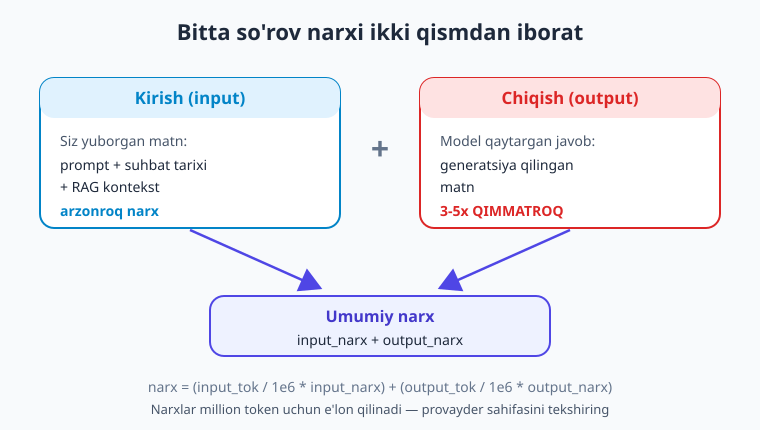
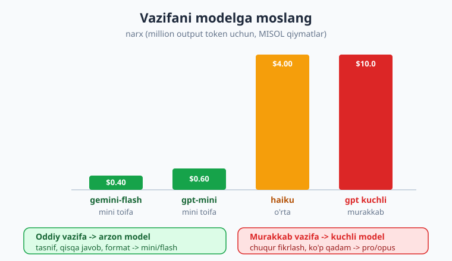
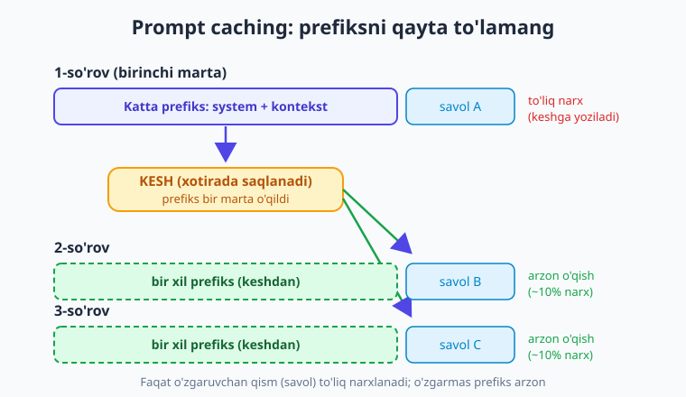

# 22 — Xarajat, token va keshlash

[⬅️ Oldingi: 21 — Lokal LLM: Ollama](./21-lokal-llm-ollama.md) · [🏠 Kitob boshi](./README.md) · [Keyingi: 23 — Ishonchlilik: xato, retry, rate limit ➡️](./23-ishonchlilik-retry.md)

> **Bu bobda:** LLM xarajati qanday hisoblanishini — **token** birligi orqali — chuqur tushunamiz. Kirish (input) va chiqish (output) tokenlari **alohida** narxlanishini, chiqish odatda qimmatroq ekanini ko'ramiz; `resp.usage` dan haqiqiy sarfni o'qiymiz. So'rov yuborishdan **oldin** token sanashni o'rganamiz (`tiktoken` OpenAI uchun, `count_tokens` Anthropic uchun) va aniq **narx hisoblash funksiyasi** yozamiz. So'ng xarajatni kamaytirishning to'rt asosiy usulini — arzon model, qisqa prompt, `max_tokens` cheklash va **keshlash (prompt caching)** — amalda qo'llaymiz. Oxirida **Batch API** bilan ommaviy ishni ~50% arzonlashtirishni va har so'rov narxini loglashni ko'ramiz.

---

## Muammodan boshlaymiz: hisob to'satdan katta keldi

LLM ilovasini qurib, sinab ko'rdingiz — ajoyib ishlaydi. Bir oydan keyin provayder hisobini ochasiz va hayron qolasiz: "Men shunchaki bir nechta so'rov yubordim, nega bunchalik?" Sabab — har bir so'rov **pul turadi**, va siz buni o'lchamasangiz, xarajat sezilmay o'sib boradi.

Yaxshi xabar: LLM xarajati **bashoratli** va **boshqariladigan**. Uni o'lchash, oldindan hisoblash va kamaytirish — bir necha aniq texnika. Bu bobning maqsadi: siz har bir so'rovning narxini bilib, ongli ravishda boshqaradigan dasturchiga aylanishingiz.

> **Hayotiy o'xshatish.** LLM — **taksometrli taksi** kabi. Har metr (token) uchun hisoblagich aylanadi. Manzilni bilmasdan o'tirsangiz, oxirida hisobni ko'rib hayron bo'lasiz. Lekin marshrutni rejalashtirsangiz, eng qisqa yo'lni tanlasangiz va keraksiz aylanishlardan qochsangiz — xuddi shu manzilga ancha arzon yetib borasiz.

!!! note "Atamalar"
    **Token** — LLM matnni o'lchaydigan birlik (so'z yoki so'z bo'lagi). **Input (kirish) token** — siz modelga yuborgan matn (prompt, suhbat tarixi, kontekst). **Output (chiqish) token** — model qaytargan javob. Narx **million token** (1 000 000 = 1e6) hisobida e'lon qilinadi.

---

## Token va narx asoslari: input va output alohida narxlanadi

Eng muhim haqiqat: **kirish va chiqish tokenlari alohida narxlanadi, va chiqish odatda 3-5 barobar qimmatroq.** Sababi — chiqishni model "fikrlab", bittama-bitta generatsiya qiladi; bu hisoblash jihatidan qimmatroq. Kirish esa shunchaki o'qiladi.

Demak, narx ikkita raqamdan iborat (har million token uchun):

- **Input narxi** — yuborgan har million token uchun.
- **Output narxi** — olgan har million token uchun (qimmatroq).



Misol uchun, faraziy narxlar (million token uchun): input $0.15, output $0.60. Agar so'rovingiz 1000 input + 500 output token sarflasa:

```text
input  = 1000 / 1 000 000 * 0.15 = 0.00015 $
output =  500 / 1 000 000 * 0.60 = 0.00030 $
jami   = 0.00045 $  (taxminan yarim sent)
```

E'tibor bering: chiqish ikki barobar kam token bo'lsa ham, qimmatroq narx tufayli xarajatning **kattaroq qismini** tashkil qildi. Shuning uchun "javobni qisqartirish" ko'pincha "promptni qisqartirish"dan ko'ra ko'proq tejaydi.

!!! warning "Narxlar o'zgaradi — har doim tekshiring"
    Bu bobdagi barcha narxlar **misol** uchun. Haqiqiy narxlar tez-tez o'zgaradi (odatda arzonlashadi) va modelga qarab farq qiladi. Kodingizda narxni **bitta joyda** (konfiguratsiya/lug'atda) saqlang va provayderning rasmiy narx sahifasidan dolzarb qiymatni oling. Hech qachon narxni kod ichiga "sochib" yozmang.

---

## `resp.usage` dan haqiqiy sarfni o'qish

So'rov yuborilgach, provayder javob obyektida **aniq** sarflangan tokenlarni qaytaradi. Buni `usage` maydonidan o'qiymiz — taxmin emas, haqiqiy raqam:

```python
import os
from dotenv import load_dotenv
from openai import OpenAI

load_dotenv()
client = OpenAI()

# Eslatma: model nomlari o'zgaradi — provayder ro'yxatini tekshiring.
MODEL = "gpt-5.4-mini"

resp = client.chat.completions.create(
    model=MODEL,
    messages=[{"role": "user", "content": "Python'da ro'yxatni qanday saralayman?"}],
)

u = resp.usage
print("Kirish (input)  tokenlar:", u.prompt_tokens)
print("Chiqish (output) tokenlar:", u.completion_tokens)
print("Jami:", u.total_tokens)
```

`prompt_tokens` — siz yuborgan, `completion_tokens` — model qaytargan tokenlar. Ularni alohida bilish narx hisoblash uchun zarur, chunki ular **turlicha narxlanadi**.

!!! note "Anthropic'da usage boshqacha nomlanadi"
    Claude'ning native SDK'sida sarf `resp.usage.input_tokens` va `resp.usage.output_tokens` deb ataladi (`prompt`/`completion` emas). Mazmun bir xil — faqat maydon nomi farq qiladi:
    ```python
    import anthropic
    client = anthropic.Anthropic()
    resp = client.messages.create(
        model="claude-haiku-4-5", max_tokens=300,
        messages=[{"role": "user", "content": "Salom"}],
    )
    print(resp.usage.input_tokens, resp.usage.output_tokens)
    ```

---

## Token sanash OLDINDAN: hisobni so'rovdan oldin biling

Ba'zan so'rov yubormasdan, **oldindan** matn necha token ekanini bilish kerak — masalan, kontekst oynasiga sig'adimi yoki narxni jo'natishdan oldin baholash uchun.

### OpenAI uchun: `tiktoken`

OpenAI modellari uchun `tiktoken` kutubxonasi aniq token sonini lokal (so'rovsiz, bepul) hisoblaydi:

```bash
pip install tiktoken
```

```python
import tiktoken

# Model uchun to'g'ri tokenizatorni oladi
enc = tiktoken.encoding_for_model("gpt-5.4-mini")

matn = "Salom! Bugun ob-havo qanday?"
tokenlar = enc.encode(matn)        # tokenlar ro'yxati (sonlar)
print("Token soni:", len(tokenlar))   # masalan, 9
```

`enc.encode(text)` matnni tokenlarga (sonlar ro'yxatiga) aylantiradi; `len(...)` ularning sonini beradi. Bu — siz yuborayotgan matn necha **input token** ekanini aniq aytadi.

> **Hayotiy o'xshatish.** `tiktoken` — pochta jo'natishdan oldin paketni **tarozida o'lchash** kabi. Pochtaga bormasdan ham, uydagi tarozida og'irligini (va shu bilan narxini) bilib olasiz. Lekin diqqat: bu tarozi faqat **bitta pochta xizmati** (OpenAI) o'lchovi uchun sozlangan.

!!! warning "tiktoken FAQAT OpenAI uchun aniq"
    `tiktoken` — OpenAI modellarining tokenizatori. Claude yoki Gemini token sonini u **aniq** hisoblamaydi (ular boshqa tokenizator ishlatadi) — faqat **taxminiy** baho beradi. Boshqa provayder uchun aniq son kerak bo'lsa, o'sha provayderning o'z usulini ishlating.

### Anthropic (Claude) uchun: `count_tokens`

Claude uchun aniq token sonini SDK'ning maxsus chaqiruvi beradi (bu generatsiya emas — arzon/bepul hisoblash):

```python
import anthropic
client = anthropic.Anthropic()

natija = client.messages.count_tokens(
    model="claude-haiku-4-5",
    messages=[{"role": "user", "content": "Salom! Bugun ob-havo qanday?"}],
)
print("Kirish tokenlar:", natija.input_tokens)
```

Bu so'rovni yuborishdan oldin promptingiz necha input token ekanini **Claude'ning o'z o'lchovida** aniq aytadi.

---

## Narx hisoblash funksiyasi

Endi tokenni pulga aylantiramiz. Formulasi sodda:

```text
narx = (input_tok / 1e6 * input_narx) + (output_tok / 1e6 * output_narx)
```

Buni qayta ishlatiladigan funksiya qilamiz. Narxlarni **bitta lug'atda** saqlaymiz, shunda o'zgartirish oson:

```python
# Narxlar — million token uchun (USD). MISOL qiymatlar!
# Dolzarb narxni provayder sahifasidan oling.
NARXLAR = {
    "gpt-5.4-mini":     {"input": 0.15, "output": 0.60},
    "gpt-5.5":          {"input": 1.25, "output": 10.00},
    "claude-haiku-4-5": {"input": 0.80, "output": 4.00},
    "gemini-2.5-flash": {"input": 0.10, "output": 0.40},
}

def narx_hisobla(model: str, input_tok: int, output_tok: int) -> float:
    """So'rov narxini USD'da qaytaradi."""
    n = NARXLAR[model]
    return (input_tok / 1e6 * n["input"]) + (output_tok / 1e6 * n["output"])

# Foydalanish — resp.usage bilan:
xarajat = narx_hisobla(MODEL, u.prompt_tokens, u.completion_tokens)
print(f"Bu so'rov narxi: ${xarajat:.6f}")
```

Endi har bir so'rov narxini **aniq** bilasiz. Bu — keyingi qadamning (xarajatni kamaytirish) asosi: o'lchamasangiz, boshqara olmaysiz.

!!! tip "Avval taxmin, keyin haqiqat"
    Katta ish (masalan, 10 000 hujjatni qayta ishlash) boshlashdan oldin: bitta namuna so'rovning `usage`'sini oling, narxini hisoblang, so'ng 10 000 ga ko'paytiring. Shunday qilib **butun ishning narxini** boshlashdan oldin bilasiz — va yoqimsiz syurprizdan qochasiz.

---

## Xarajatni kamaytirishning 4 yo'li

Endi eng amaliy qism. Xarajatni kamaytirishning to'rtta asosiy richagi bor.

### 1. Arzon model tanlang — vazifaga moslang

Eng katta tejamkorlik: **har vazifaga eng arzon yetarli modelni** tanlash. Oddiy vazifa (tasniflash, qisqa javob, format o'zgartirish) uchun "mini/haiku/flash" toifasidagi model ko'pincha kuchli modeldek ishlaydi — lekin 10-20 barobar arzon.



> **Hayotiy o'xshatish.** Non olishga sport mashinasida bormaysiz. Kuchli model — Formula-1 bolidi: murakkab poyga uchun zo'r, lekin kundalik mayda yumush uchun isrof. Tasniflash, qisqa javob kabi "non olish" vazifalariga arzon, tejamkor model yetadi.

```python
# Oddiy vazifa -> arzon model
javob = client.chat.completions.create(
    model="gpt-5.4-mini",   # mini: arzon, oddiy tasniflash uchun yetarli
    messages=[{"role": "user", "content": "Bu sharh ijobiymi yoki salbiy? 'Ajoyib mahsulot!'"}],
    max_tokens=5,
)
```

### 2. Qisqa prompt + faqat kerakli kontekst

Har bir ortiqcha so'z — input token, ya'ni pul. Promptni qisqartiring, takror yo'riqnomalarni olib tashlang. Eng muhimi — RAG'da (13-17-boblar) **faqat eng tegishli** bo'laklarni yuboring, butun hujjatni emas. Ko'p kontekst nafaqat qimmat, balki javob sifatini ham pasaytiradi.

### 3. `max_tokens` bilan chiqishni cheklang

Chiqish qimmatroq bo'lgani uchun, uni cheklash — kuchli richag. `max_tokens` modelga "bundan uzun yozma" deydi. Agar sizga qisqa javob kerak bo'lsa, uzun "esse" uchun to'lamang:

```python
javob = client.chat.completions.create(
    model=MODEL,
    messages=[{"role": "user", "content": "Bir jumlada javob ber: Python nima?"}],
    max_tokens=40,   # uzun javobga pul ketishining oldini oladi
)
```

!!! note "max_tokens — cheklov, talab emas"
    `max_tokens` — chiqishning **yuqori chegarasi**, aniq uzunligi emas. Model undan oldin ham tugatishi mumkin. Lekin chegara juda kichik bo'lsa, javob **o'rtada kesilib** qolishi mumkin (`finish_reason == "length"`) — bunda chegarani biroz oshiring.

### 4. Keshlash — keyingi bo'limda

To'rtinchi va eng kuchli richaglardan biri — **keshlash**. Bunga alohida e'tibor beramiz.

---

## Prompt caching: bir xil prefiksni qayta-qayta to'lamang

Ko'p ilovalarda har so'rovning **boshi bir xil** bo'ladi: uzun system yo'riqnoma, qo'llanma, misol to'plami yoki RAG kontekst. Har safar bu katta prefiksni qayta yuborasiz — va har safar uning input tokeni uchun **to'liq** to'laysiz. Bu — isrof.

**Prompt caching** shu muammoni hal qiladi: provayder bir xil prefiksni xotirada saqlaydi va keyingi so'rovlarda uni qayta o'qimaydi — kesh'dan o'qigan tokenlar **ancha arzon** (odatda 10% narxda) hisoblanadi.



> **Hayotiy o'xshatish.** Har gal restoranga kelganingizda menyuni qaytadan chop ettirmaysiz — u **stolda turadi**. Faqat bugungi buyurtmangizni aytasiz. Prompt caching ham shunday: katta o'zgarmas qism (menyu = system/kontekst) bir marta "stolga qo'yiladi", keyin siz faqat yangi so'rov (buyurtma) uchun to'liq to'laysiz.

### OpenAI: avtomatik kesh

OpenAI'da kesh **avtomatik** ishlaydi — alohida sozlash shart emas. Agar so'rov boshidagi prefiks (odatda kamida ~1024 token) avvalgi so'rov bilan **bir xil** bo'lsa, u keshdan o'qiladi. Shart: o'zgarmas qism (system, kontekst) **boshida**, o'zgaruvchan qism (foydalanuvchi savoli) **oxirida** bo'lsin.

Keshdan necha token o'qilganini `usage` ichidan ko'rasiz:

```python
resp = client.chat.completions.create(model=MODEL, messages=msgs)
# Avtomatik keshdan o'qilgan input tokenlar:
print(resp.usage.prompt_tokens_details.cached_tokens)
```

### Anthropic: `cache_control` bilan aniq belgilash

Claude'da kesh'ni **o'zingiz** belgilaysiz — qaysi blok keshlanishini `cache_control` bilan ko'rsatasiz:

```python
import anthropic
client = anthropic.Anthropic()

resp = client.messages.create(
    model="claude-haiku-4-5",
    max_tokens=300,
    system=[
        {
            "type": "text",
            "text": KATTA_QOLLANMA,                  # uzun, o'zgarmas kontekst
            "cache_control": {"type": "ephemeral"},  # shu blokni keshla
        }
    ],
    messages=[{"role": "user", "content": "Foydalanuvchi savoli"}],
)
# Kesh statistikasi:
print(resp.usage.cache_creation_input_tokens)  # keshga yozildi (birinchi marta)
print(resp.usage.cache_read_input_tokens)      # keshdan o'qildi (arzon)
```

Birinchi so'rovda `cache_creation_input_tokens` to'ladi (keshni yaratish biroz qimmatroq), keyingi so'rovlarda esa `cache_read_input_tokens` — juda arzon.

!!! tip "Keshlash qachon foyda beradi?"
    Kesh **katta, o'zgarmas, qayta-qayta ishlatiladigan** prefiks bo'lganda eng foydali: uzun system yo'riqnoma, hujjat/qo'llanma ustida ko'p savol, few-shot misollar to'plami, suhbat tarixi. Agar har so'rov butunlay boshqacha bo'lsa — kesh foyda bermaydi. Promptni **o'zgarmas qism boshida, o'zgaruvchan qism oxirida** bo'ladigan qilib tuzing.

---

## Batch API: shoshilmaydigan ish uchun ~50% arzon

Agar sizda **ko'p so'rov bor, lekin darhol javob shart emas** bo'lsa (masalan, kechasi 50 000 sharhni tasniflash), **Batch API** ~50% arzonroq narx beradi. Siz so'rovlar to'plamini bir faylda yuborasiz, provayder ularni navbat bilan (odatda 24 soat ichida) bajaradi va natijani qaytaradi.

Bu — real vaqt (chatbot, foydalanuvchi kutadi) uchun emas, **fon ishi** (offline tahlil, ommaviy generatsiya, ma'lumot tayyorlash) uchun. Vaqtni xarajatga almashtirasiz: sabr qilsangiz — yarim narx.

!!! note "Batch — keyinroq chuqurroq"
    Batch API'ning to'liq oqimi (fayl tayyorlash, yuborish, natijani kutib olish) provayderga qarab farq qiladi va alohida mavzu. Hozircha asosiy g'oyani yodda tuting: **shoshilmaydigan ommaviy ish = Batch API = ~2 barobar arzon.**

---

## Har so'rov narxini loglash

Xarajatni boshqarishning birinchi qadami — uni **ko'rish**. Har so'rovdan keyin narxni hisoblab loglang. Bu sizga "qaysi xususiyat qancha pul yeyapti" degan savolga javob beradi va keyinchalik (25-bobda) to'liq kuzatuv tizimiga ulanadi:

```python
import logging
logging.basicConfig(level=logging.INFO)

def sorov_log_bilan(messages, model=MODEL):
    resp = client.chat.completions.create(model=model, messages=messages)
    u = resp.usage
    narx = narx_hisobla(model, u.prompt_tokens, u.completion_tokens)
    logging.info(
        "model=%s in=%d out=%d narx=$%.6f",
        model, u.prompt_tokens, u.completion_tokens, narx,
    )
    return resp.choices[0].message.content

javob = sorov_log_bilan([{"role": "user", "content": "Salom!"}])
```

Har so'rovning narxini loglab borsangiz, oy oxirida hayron bo'lmaysiz — har bir tiyinning qayerga ketganini bilasiz. 25-bobda bu loglarni to'liq **kuzatuv (observability)** tizimiga — har foydalanuvchi/xususiyat bo'yicha xarajat dashboardiga — aylantiramiz.

> **Hayotiy o'xshatish.** Xarajat logi — taksida hisoblagichni **ko'z oldingizda ushlab turish** kabi. Manzilga yetganda hisobni ko'rib hayron bo'lmaysiz, chunki yo'l davomida har metrni kuzatib bordingiz — va kerak bo'lsa, marshrutni o'zgartirdingiz.

---

## Xulosa

- LLM xarajati **token** orqali o'lchanadi: **kirish (input)** va **chiqish (output)** tokenlari **alohida** narxlanadi, chiqish odatda 3-5 barobar qimmatroq. Shuning uchun javobni qisqartirish ko'pincha promptni qisqartirishdan ko'ra ko'proq tejaydi.
- Haqiqiy sarfni `resp.usage` dan o'qing: OpenAI'da `prompt_tokens`/`completion_tokens`, Anthropic'da `input_tokens`/`output_tokens`.
- Token sanashni **oldindan** qiling: OpenAI uchun `tiktoken` (`encoding_for_model`, `len(enc.encode(text))`), Anthropic uchun `client.messages.count_tokens(...)`. `tiktoken` **faqat OpenAI** uchun aniq — Claude/Gemini'da taxminiy.
- Narx = `(input_tok/1e6 * input_narx) + (output_tok/1e6 * output_narx)`. Narxni **bitta joyda** saqlang; provayder sahifasidan dolzarbini oling, chunki narxlar o'zgaradi.
- Xarajatni kamaytirishning 4 yo'li: (1) vazifaga **arzon model** moslash, (2) **qisqa prompt** + faqat kerakli kontekst, (3) **`max_tokens`** bilan chiqishni cheklash, (4) **keshlash**.
- **Prompt caching**: bir xil katta prefiks (system/kontekst) qayta ishlatilsa, kesh uni arzonlashtiradi. OpenAI — avtomatik (prefiks bir xil bo'lsa); Anthropic — `cache_control` bilan. Kesh tokenlarini `usage`dan ko'ring.
- **Batch API** — shoshilmaydigan ommaviy so'rovlarni ~50% arzon bajaradi (vaqtni narxga almashtirasiz).
- Har so'rov narxini **loglang** — o'lchamasangiz, boshqara olmaysiz; bu 25-bobdagi kuzatuvga ko'prik.

## Amaliy mashqlar

1. **(Oson)** 5-7 bobdagi biror skriptingizga `resp.usage`ni chop etishni qo'shing. `prompt_tokens`, `completion_tokens` va `total_tokens`ni ko'ring. Bir xil savolni qisqa va uzun prompt bilan yuborib, input token farqini taqqoslang.

2. **(Oson)** `tiktoken`ni o'rnating va qisqa funksiya yozing: matn berilganda token sonini qaytarsin. Uni o'zbekcha va inglizcha bir xil ma'noli jumlaga qo'llang — qaysi biri ko'proq token? (Eslatma: tokenizator inglizchaga moslangani uchun o'zbekcha matn ko'proq token bo'lishi mumkin.)

3. **(O'rtacha)** Bobdagi `narx_hisobla` funksiyasini va `NARXLAR` lug'atini ko'chiring. Bitta savolni `mini` va kuchli model bilan yuboring, ikkalasining `usage`'sidan narxni hisoblang va taqqoslang. Necha barobar farq chiqdi?

4. **(O'rtacha)** Uzun (kamida ~1500 token) o'zgarmas system yo'riqnoma yozing va unga 3 ta turli savol yuboring. OpenAI'da `resp.usage.prompt_tokens_details.cached_tokens`ni har so'rovda chop eting — ikkinchi va uchinchi so'rovda kesh ishladimi? (Anthropic ishlatsangiz: `cache_control` qo'shib, `cache_read_input_tokens`ni kuzating.)

5. **(Qiyin)** "Xarajat hisoblagich" yarating: `class XarajatKuzatuvchi` yozing, u har so'rovdan keyin `qosh(resp.usage, model)` chaqirilganda umumiy input/output token va umumiy narxni yig'ib borsin; `hisobot()` metodi jami sarfni chop etsin. Uni `try/except` bilan o'rab, 10 ta turli so'rovda sinab ko'ring va umumiy xarajatni chiqaring.

---

[⬅️ Oldingi: 21 — Lokal LLM: Ollama](./21-lokal-llm-ollama.md) · [🏠 Kitob boshi](./README.md) · [Keyingi: 23 — Ishonchlilik: xato, retry, rate limit ➡️](./23-ishonchlilik-retry.md)
