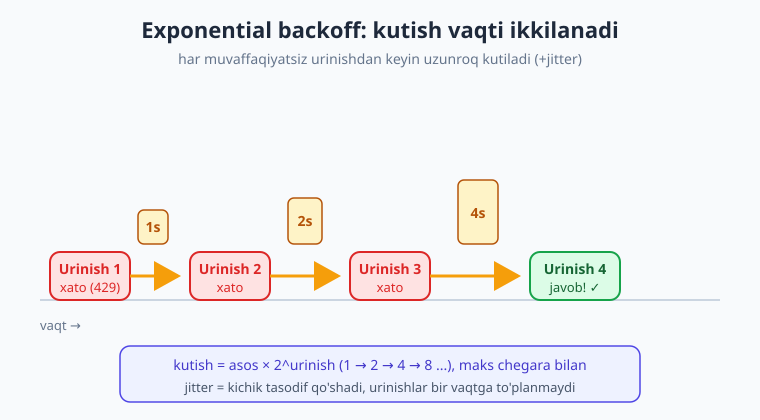
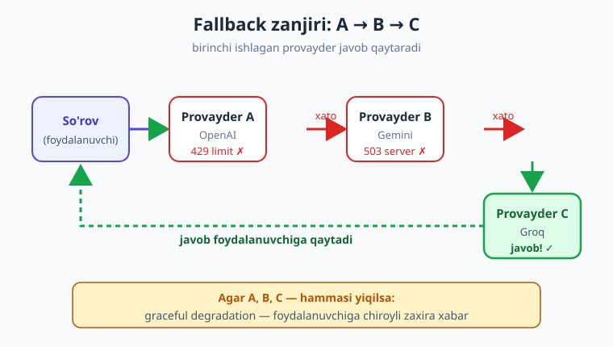

# 23 — Ishonchlilik: xato, retry, rate limit

[⬅️ Oldingi: 22 — Xarajat, token va keshlash](./22-xarajat-token-kesh.md) · [🏠 Kitob boshi](./README.md) · [Keyingi: 24 — Xavfsizlik va prompt injection ➡️](./24-xavfsizlik-prompt-injection.md)

> **Bu bobda:** production'da xato **muqarrar** ekanini va ishonchli ilova ularni qanday "chiroyli" boshqarishini o'rganamiz. LLM SDK'ning **tipli (typed) xato turlarini** — qaysi biri qayta urinishga arziydi, qaysi biri yo'q — ajratamiz; SDK'ning **avtomatik retry** va `timeout` sozlamalarini, kerak bo'lganda **qo'lda exponential backoff** (jitter bilan) yozishni, bitta provayder ishlamaganda **fallback provayder**ga o'tishni va xato sodir bo'lganda foydalanuvchiga **chiroyli zaxira javob** (graceful degradation) berishni ko'ramiz. Maqsad — ilovangiz "yiqilmaydigan", balki silliq egiluvchan bo'lsin.

---

## Muammodan boshlaymiz: "menda lokal ishladi-ku!"

Lokal mashinangizda kod beg'ubor ishlaydi: so'rov yuborasiz, javob keladi, hammasi joyida. Keyin ilovani production'ga chiqarasiz va... bir hafta o'tib log'da quyidagilarni ko'rasiz:

- `RateLimitError: 429` — bir vaqtda juda ko'p foydalanuvchi yozdi, provayder limitni urdi.
- `APITimeoutError` — tarmoq sekinlashdi, javob 60 soniyada kelmadi.
- `APIConnectionError` — Wi-Fi bir soniyaga uzildi yoki provayderning serveri "hiqilladi".
- `APIStatusError: 503` — provayderning o'zida vaqtinchalik nosozlik.

Bu xatolar **sizning kodingiz yomon** bo'lgani uchun emas — ular tarmoq va tashqi xizmatlar bilan ishlashning **tabiiy qismi**. Internet ishonchsiz, serverlar band bo'ladi, limitlar bor. Savol "xato bo'ladimi?" emas — **"qachon bo'ladi va men nima qilaman?"**.

> **Hayotiy o'xshatish.** API chaqiruvi — do'konga telefon qilishga o'xshaydi. Ba'zan band signal eshitasiz (rate limit), ba'zan hech kim ko'tarmaydi (timeout), ba'zan liniya uzilib qoladi (connection error). Aqlli odam jahl qilib telefonni tashlamaydi — **bir oz kutib, qayta teradi**, va agar bu do'kon umuman javob bermasa — **boshqa do'konga** qo'ng'iroq qiladi. Ishonchli ilova ham aynan shunday yo'l tutadi.

!!! note "Ishonchlilik (reliability) nima?"
    **Ishonchlilik** — ilovaning kutilmagan vaziyatlarda ham "yiqilmasdan", oqilona ishlashda davom etishi. Production AI ilovasida bu degani: vaqtinchalik xatoni avtomatik qayta urinib o'tkazib yuborish, tuzatib bo'lmaydigan xatoni esa foydalanuvchiga chiroyli xabar bilan yetkazish — hech qachon "yalang'och" stack trace ko'rsatmaslik.

---

## Xato turlari: tipli istisnolar (typed exceptions)

`openai` kutubxonasi har xil muammo uchun **alohida xato klassi** beradi. Bu juda muhim: xato matnini string bilan tekshirish (`if "429" in str(e)`) — mo'rt va xavfli; o'rniga **xato turini** ushlang. SDK xatolar ierarxiyasini quradi — hammasi `openai.APIError`dan meros oladi.

| Xato turi | HTTP | Sabab | Qayta urinish? |
|---|---|---|---|
| `openai.AuthenticationError` | 401 | Kalit noto'g'ri/yo'q | **YO'Q** — kalitni tuzating |
| `openai.PermissionDeniedError` | 403 | Ruxsat yo'q | **YO'Q** |
| `openai.NotFoundError` | 404 | Model nomi xato | **YO'Q** — nomni tuzating |
| `openai.BadRequestError` | 400 | So'rov noto'g'ri (sxema, juda uzun) | **YO'Q** — so'rovni tuzating |
| `openai.RateLimitError` | 429 | Limit urildi | **HA** — kutib qayta uring |
| `openai.APITimeoutError` | — | Javob kelmadi | **HA** |
| `openai.APIConnectionError` | — | Tarmoq uzildi | **HA** |
| `openai.APIStatusError` | 5xx | Server xatosi (500/503) | **HA** (5xx) |

Eng muhim qoida — xatolarni **ikki guruhga** ajratish:

- **Vaqtinchalik (transient)** — 429, timeout, ulanish, 5xx server. Bu xatolar "o'tib ketadi": bir oz kutib qayta urinsa, ehtimol ishlaydi. **Qayta urinishga arziydi.**
- **Doimiy (permanent)** — 401 (kalit), 400 (so'rov), 404 (model). Bularni qayta urinish **befoyda** — kalit yoki kodni tuzatmaguningizcha har safar xuddi shu xato chiqadi. Qayta urinish faqat vaqt va pul isrof qiladi.


```python
import openai
from openai import OpenAI

client = OpenAI()
MODEL = "gpt-5.4-mini"   # Eslatma: nomlar o'zgaradi — provayder ro'yxatini tekshiring.

try:
    javob = client.chat.completions.create(
        model=MODEL,
        messages=[{"role": "user", "content": "Salom!"}],
    )
    print(javob.choices[0].message.content)

# --- Doimiy: qayta urinmang, sababini tuzating ---
except openai.AuthenticationError:
    print("Kalit noto'g'ri yoki yo'q. .env faylini tekshiring.")
except openai.NotFoundError:
    print("Model nomi xato. Mavjud modellar ro'yxatini tekshiring.")
except openai.BadRequestError as e:
    print(f"So'rov noto'g'ri (juda uzun yoki sxema xato): {e}")

# --- Vaqtinchalik: qayta urinishga arziydi ---
except openai.RateLimitError:
    print("Limit urildi (429). Bir oz kutib qayta urinish kerak.")
except (openai.APITimeoutError, openai.APIConnectionError):
    print("Tarmoq muammosi. Qayta urinish kerak.")
except openai.APIStatusError as e:
    print(f"Server xatosi ({e.status_code}). Qayta urinish kerak.")
```

!!! warning "String tekshirish — qilmang"
    `except Exception as e: if "rate limit" in str(e).lower()` kabi yondashuv yomon: xato matni provayderga qarab har xil, til ham o'zgarishi mumkin, va kichik o'zgarish kodingizni buzadi. Doim **tipli istisno** (`openai.RateLimitError`) ushlang — bu ishonchli va o'qilishi oson.

---

## Eng oson yo'l: SDK'ning avtomatik retry'si

Yaxshi xabar: `openai` SDK **vaqtinchalik xatolarni o'zi qayta uradi** — siz hech narsa qilmasangiz ham. SDK 429, ulanish va 5xx xatolarda **exponential backoff** bilan avtomatik bir necha marta qayta urinadi. Buni `OpenAI(...)` yaratishda sozlaysiz:

```python
from openai import OpenAI

client = OpenAI(
    max_retries=5,     # vaqtinchalik xatoda 5 martagacha avtomatik qayta uradi (standart: 2)
    timeout=20.0,      # har bir so'rov uchun maksimal kutish — 20 soniya (standart ~10 daqiqa)
)
```

- **`max_retries`** — SDK 429/ulanish/5xx xatolarda necha marta avtomatik qayta urinishi. Standart qiymat 2; production uchun 3–5 odatiy. `max_retries=0` — retry'ni butunlay o'chiradi.
- **`timeout`** — bitta so'rov necha soniya kutilishi. Standart juda uzun (~10 daqiqa); interaktiv ilovada uni **qisqartirish** kerak (masalan, 20–30s), aks holda foydalanuvchi muzlab qolgan ekranga qarab o'tiradi.

!!! tip "Aksariyat holatda shu yetarli"
    Ko'p ilova uchun `OpenAI(max_retries=5, timeout=20.0)` — ishonchlilikning **90%**ini bepulga beradi. Qo'lda backoff yozishdan oldin, avval shuni sozlang. Faqat maxsus mantiq (masalan, har urinishda boshqa provayderga o'tish yoki log yozish) kerak bo'lsa — keyingi bo'limga o'ting.

`timeout`ni bitta so'rov uchun ham bekor qilib bo'ladi (`with_options`):

```python
# Bu so'rov uzunroq — alohida timeout beramiz
javob = client.with_options(timeout=60.0).chat.completions.create(
    model=MODEL,
    messages=[{"role": "user", "content": "Juda uzun hujjatni xulosala..."}],
)
```

---

## Qo'lda exponential backoff (kerak bo'lganda)

Ba'zan SDK'ning avtomatik retry'si yetarli emas — masalan, har urinishni log qilmoqchisiz, yoki o'z mantiqingiz bilan kutmoqchisiz. U holda **exponential backoff**ni o'zingiz yozasiz.

G'oya oddiy: muvaffaqiyatsiz urinishdan keyin **kutasiz**, va har safar kutish vaqtini **ikkilantirasiz** (1s, 2s, 4s, 8s...). Nega ikkilantirish? Chunki agar provayder bandligidan limit urilgan bo'lsa, hamma bir vaqtda qayta urinaversa — band yana davom etadi. Tobora uzunroq kutish serverga "nafas olish" beradi.

> **Hayotiy o'xshatish.** Backoff — bandlikda eshikni taqillatishga o'xshaydi. Bir marta taqillatib javob bo'lmasa, darrov yana urmaysiz — biroz kutasiz. Yana bo'lmasa — **uzunroq** kutasiz. Hamma mehmon bir maromda taqillatsa, eshik orqasidagi odam dovdirab qoladi; turli vaqtda kutilsa — navbat o'z-o'zidan tartibga tushadi.

### Jitter — "tasodifiy chayqalish"

Faqat ikkilantirish yetarli emas. Agar 100 ta mijoz bir vaqtda xato olib, hammasi **aniq** 1s, keyin 2s, keyin 4s kutsa — ular **yana bir vaqtda** qayta urinadi va serverni yana to'ldiradi (buni "thundering herd" — "to'da bo'lib bostirib kelish" deyiladi). Yechim: kutish vaqtiga **kichik tasodifiy qo'shimcha** (jitter) qo'shish, shunda urinishlar vaqt bo'yicha tarqaladi.



To'liq funksiya:

```python
import time
import random
import openai
from openai import OpenAI

client = OpenAI()
MODEL = "gpt-5.4-mini"

# Qaysi xatolar qayta urinishga arziydi — TIPLI ro'yxat
QAYTA_URINSA_BO'LADI = (
    openai.RateLimitError,
    openai.APITimeoutError,
    openai.APIConnectionError,
    openai.APIStatusError,     # 5xx server xatolari
)


def backoff_bilan_sorov(messages, maks_urinish=5, asos=1.0, maks_kutish=30.0):
    """LLM so'rovini exponential backoff + jitter bilan qayta uradi.

    asos       — birinchi kutish (soniya), har urinishda ikkilanadi.
    maks_kutish — bir kutishning yuqori chegarasi (cheksiz kutmaslik uchun).
    """
    for urinish in range(maks_urinish):
        try:
            return client.chat.completions.create(model=MODEL, messages=messages)

        except QAYTA_URINSA_BO'LADI as e:
            # Oxirgi urinish ham muvaffaqiyatsiz bo'lsa — boshqa kutmaymiz, xatoni ko'taramiz
            if urinish == maks_urinish - 1:
                raise

            # Kutish: asos * 2^urinish, lekin maks_kutish dan oshmasin
            kutish = min(asos * (2 ** urinish), maks_kutish)
            # Jitter: 0..kutish oralig'ida tasodifiy qo'shimcha (urinishlarni tarqatadi)
            kutish += random.uniform(0, kutish)

            print(f"Urinish {urinish + 1} muvaffaqiyatsiz ({type(e).__name__}). "
                  f"{kutish:.1f}s kutib qayta urinaman...")
            time.sleep(kutish)

        # Doimiy xatolar — qayta urinmaymiz, darrov ko'taramiz
        except (openai.AuthenticationError, openai.BadRequestError,
                openai.NotFoundError):
            raise
```

Foydalanish:

```python
try:
    javob = backoff_bilan_sorov(
        [{"role": "user", "content": "AI integratsiyasi nima? Bir jumlada."}]
    )
    print(javob.choices[0].message.content)
except openai.APIError as e:
    print(f"Barcha urinishlar muvaffaqiyatsiz: {e}")
```

!!! note "Retry-After sarlavhasi"
    429 xatosida ko'p provayder javobga `Retry-After` sarlavhasini qo'shadi — "shuncha soniyadan keyin urinib ko'r". SDK'ning **avtomatik** retry'si buni hisobga oladi. Qo'lda yozsangiz, oddiy backoff ko'p hollarda yetarli; ammo eng to'g'risi — agar provayder vaqtni aytsa, o'shanga amal qilish.

---

## Fallback provayder: A ishlamasa — B'ga o't

Backoff bir provayder ichida yordam beradi. Ammo provayderning **o'zi** uzoq vaqt yiqilsa yoki sizning limitingiz tugasa-chi? Bunda eng mustahkam yechim — **fallback provayder**: birinchi provayder umuman ishlamasa, **ikkinchisiga**, u ham bo'lmasa — **uchinchisiga** o'tish. 4-bobdagi ko'p-provayderli `mijoz_ol(...)` factory'si bu yerda juda asqotadi.

> **Hayotiy o'xshatish.** Fallback — yo'lda navigatsiyaga o'xshaydi. Asosiy yo'l tirbandlik bo'lsa, navigator avtomatik **zaxira yo'l**ni taklif qiladi; u ham yopiq bo'lsa — **uchinchisini**. Maqsad bitta: manzilga yetish. Sizning ilovangiz uchun "manzil" — foydalanuvchiga javob qaytarish; qaysi provayder orqali — muhim emas.



Quyidagi misol 4-bobdagi `mijoz_ol(provayder)` factory'siga tayanadi (u `(client, model)` qaytaradi):

```python
import openai
from factory import mijoz_ol   # 4-bobdagi ko'p-provayderli factory

# Tartib MUHIM: avval afzal/arzon provayder, keyin zaxiralar
ZANJIR = ["openai", "gemini", "groq"]


def fallback_bilan_sorov(messages):
    """Provayderlar zanjiri bo'ylab harakat qiladi: birinchi ishlagani javob beradi."""
    oxirgi_xato = None

    for nom in ZANJIR:
        try:
            client, model = mijoz_ol(nom)
            javob = client.chat.completions.create(model=model, messages=messages)
            print(f"[ok] javob '{nom}' provayderidan keldi")
            return javob.choices[0].message.content

        # Vaqtinchalik xatolar — keyingi provayderni sinab ko'ramiz
        except (openai.RateLimitError, openai.APITimeoutError,
                openai.APIConnectionError, openai.APIStatusError) as e:
            print(f"[xato] '{nom}' ishlamadi ({type(e).__name__}), keyingisiga o'taman...")
            oxirgi_xato = e
            continue

        # Bu provayderda kalit yo'q yoki noto'g'ri — uni o'tkazib, keyingisiga
        except (openai.AuthenticationError, KeyError) as e:
            print(f"[xato] '{nom}' kaliti yo'q/noto'g'ri, o'tkazaman...")
            oxirgi_xato = e
            continue

    # Zanjirdagi hamma provayder ishlamadi
    raise RuntimeError(f"Barcha provayderlar ishlamadi. Oxirgi xato: {oxirgi_xato}")
```

Backoff bilan fallback'ni **birga** ham ishlatish mumkin: har provayderni avval bir necha marta backoff bilan qayta urinasiz, agar shunda ham bo'lmasa — keyingi provayderga o'tasiz. Bu — production AI ilovasining "oltin standarti".

!!! warning "Fallback — javob sifati o'zgaradi"
    Provayder almashganda model ham o'zgaradi (`gpt-5.4-mini` -> `gemini-2.5-flash`). Javob uslubi va sifati biroz farq qilishi mumkin. Strukturali natija (9-bob) yoki tool calling (10-bob) ishlatsangiz, zaxira modelning ham o'sha formatni qo'llab-quvvatlashiga ishonch hosil qiling.

---

## Graceful degradation: hammasi yiqilsa nima qilish?

Ba'zan hech narsa yordam bermaydi — internet yo'q, hamma provayder pasdan ketgan. Bunday holatda **dasturni "qulatib" yubormaslik** kerak. Foydalanuvchiga xom stack trace emas, **odamiy, foydali xabar** yoki **zaxira javob** ko'rsating. Buni **graceful degradation** ("xushmuomala pasayish") deyiladi: to'liq xizmat bo'lmasa, hech bo'lmaganda **qisman** xizmat.

```python
def chatbot_javobi(savol: str) -> str:
    """Foydalanuvchiga DOIM odamiy javob qaytaradi — hech qachon yiqilmaydi."""
    try:
        return fallback_bilan_sorov([{"role": "user", "content": savol}])

    except Exception as e:
        # Log'ga to'liq xatoni yozamiz (biz ko'ramiz), foydalanuvchiga — yumshoq xabar
        import logging
        logging.error("LLM so'rovi muvaffaqiyatsiz: %s", e)

        # Zaxira javob: foydalanuvchi "qotgan" ekran emas, yo'l ko'rsatuvchi xabar oladi
        return (
            "Kechirasiz, hozir AI-xizmat vaqtincha javob bera olmadi. "
            "Iltimos, bir necha daqiqadan so'ng qayta urinib ko'ring. "
            "Shoshilinch bo'lsa, support@misol.uz ga yozing."
        )
```

> **Hayotiy o'xshatish.** Graceful degradation — liftda yorug'lik o'chganda yonadigan **zaxira chiroq**ga o'xshaydi. Asosiy quvvat yo'qolsa ham, sizni qorong'uda qoldirmaydi — xira bo'lsa-da, chiqishni ko'rsatadi. Foydalanuvchi "ilova buzildi" demaydi; "biroz kutay" deydi.

!!! tip "Idempotentlik — bir xil so'rovni ikki marta yuborishdan qo'rqmaslik"
    **Idempotent** amal — bir necha marta bajarilsa ham, natija bir martagidek bo'ladi. Matn generatsiyasi (oddiy so'rov) tabiatan zararsiz qayta uriladi — eng yomoni, ozgina ortiqcha token sarflanadi. Ammo retry **yon ta'sirli** amal bilan birga bo'lsa (masalan, tool orqali "to'lovni amalga oshir" yoki "email yubor"), qayta urinish **ikki marta** bajarilishiga olib kelishi mumkin. Bunday amallarni `idempotency_key` (provayder qo'llasa) yoki o'z bazangizda "bu so'rov bajarildimi?" belgisi bilan himoyalang. Oddiy chat uchun bu muammo yo'q.

---

## Hammasini birga: ishonchli so'rov qatlami

Yuqoridagi g'oyalarni bitta amaliy yondashuvga jamlaymiz. Real ilovada **qatlamlab** himoya quring:

1. **SDK darajasi** — `OpenAI(max_retries=5, timeout=20.0)`: vaqtinchalik xatolarni bepulga o'tkazib yuboradi.
2. **Provayder darajasi** — fallback zanjiri: bir provayder yiqilsa, boshqasiga o'tadi.
3. **Ilova darajasi** — graceful degradation: hammasi yiqilsa, foydalanuvchiga chiroyli zaxira javob.

Bu uch qatlam birga — ilovangizni "qog'oz uy"dan "zilzilaga chidamli bino"ga aylantiradi. Foydalanuvchi xatoni deyarli sezmaydi: ko'pi vaqtinchalik xatolar avtomatik o'tib ketadi, qolgani fallback bilan hal bo'ladi, eng yomon holatdagina yumshoq xabar chiqadi — lekin **hech qachon** dastur "qulamaydi".

!!! note "Kuzatuv (monitoring) — keyingi qadam"
    Ishonchlilikning yana bir muhim qismi — xatolar **necha marta** sodir bo'layotganini bilish. Agar retry'lar tez-tez ishga tushsa, demak bir muammo bor (limit kichik, provayder beqaror). Buni log va metrikalar bilan kuzatish kerak — bu mavzuga keyingi boblarda kuzatuv (observability) qismida qaytamiz. Hozircha hech bo'lmaganda har retry va fallback'ni `logging` bilan yozib boring.

---

## Xulosa

- Production'da xato **muqarrar**: tarmoq uziladi, rate limit (429) uriladi, server "hiqillaydi" (5xx), timeout bo'ladi. Savol "bo'ladimi?" emas — **"qachon va men nima qilaman?"**.
- Xato matnini **string** bilan tekshirmang. **Tipli istisno** (`openai.RateLimitError`, `openai.APITimeoutError`...) ushlang — ishonchli va o'qilishi oson.
- Xatolarni ikki guruhga ajrating: **vaqtinchalik** (429/timeout/ulanish/5xx — **qayta uring**) va **doimiy** (401 kalit / 400 so'rov / 404 model — **tuzating, qayta urinmang**).
- Eng oson ishonchlilik — **SDK'ning avtomatik retry'si**: `OpenAI(max_retries=5, timeout=20.0)`. Bu 429/ulanish/5xx ni o'zi backoff bilan qayta uradi.
- Maxsus mantiq kerak bo'lsa — **qo'lda exponential backoff**: kutish vaqtini har urinishda **ikkilantiring** va ustiga **jitter** (tasodifiy chayqalish) qo'shing — "thundering herd"dan saqlanadi.
- **Fallback provayder** (4-bobdagi factory'ga tayanib): A ishlamasa B'ga, u ham bo'lmasa C'ga o'ting — birinchi ishlagani javob beradi.
- **Graceful degradation**: hammasi yiqilsa, foydalanuvchiga xom xato emas, **chiroyli zaxira javob** bering — dastur hech qachon "qulamasin".
- Eng mustahkam ilova **uch qatlam** himoyaga ega: SDK retry + provayder fallback + ilova darajasidagi yumshoq xabar.

## Amaliy mashqlar

1. **(Oson)** Quyidagi xatolar uchun "qayta urinishga arziydimi?" deb javob bering va sababini ayting: `AuthenticationError`, `RateLimitError`, `BadRequestError`, `APITimeoutError`, `APIStatusError (503)`, `NotFoundError`.

2. **(Oson)** `OpenAI()` mijozini `max_retries=4` va `timeout=15.0` bilan yarating. Keyin bitta uzunroq so'rov uchun `with_options(timeout=60.0)` bilan timeout'ni vaqtincha oshiring.

3. **(O'rtacha)** Bobdagi `backoff_bilan_sorov` funksiyasini yozing va ishga tushiring. So'ng `time.sleep` ni `print` bilan almashtirib (haqiqatan kutmasdan), `maks_urinish=4` da kutish vaqtlari qanday o'sishini (jitter'siz) hisoblab chiqing: 1s, 2s, 4s. Jitter qo'shilsa bu qiymatlar qanday o'zgaradi?

4. **(O'rtacha)** 4-bobdagi `mijoz_ol` factory'siga tayanib, `fallback_bilan_sorov` funksiyasini yozing. Birinchi provayderning kalitini atayin noto'g'ri qo'ying (`.env`da) va ilova ikkinchi provayderga o'tib, javob qaytarishini kuzating. Qaysi provayderdan javob kelganini chop eting.

5. **(Qiyin)** Uch qatlamni birlashtiring: (a) har provayder uchun `max_retries=3` li `OpenAI` mijozi, (b) provayderlar bo'ylab fallback zanjiri, (c) hammasi yiqilsa graceful degradation bilan zaxira javob. So'ng tarmoqni o'chirib (yoki barcha kalitlarni buzib) ilovani ishga tushiring va u **yiqilmasdan** yumshoq xabar qaytarishiga ishonch hosil qiling. Har retry/fallback'ni `logging` bilan yozib boring.

---

[⬅️ Oldingi: 22 — Xarajat, token va keshlash](./22-xarajat-token-kesh.md) · [🏠 Kitob boshi](./README.md) · [Keyingi: 24 — Xavfsizlik va prompt injection ➡️](./24-xavfsizlik-prompt-injection.md)
