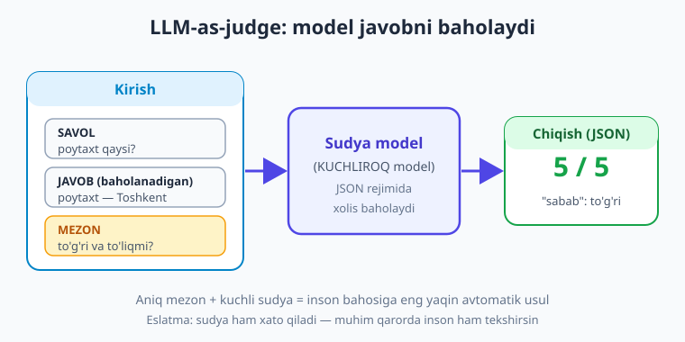
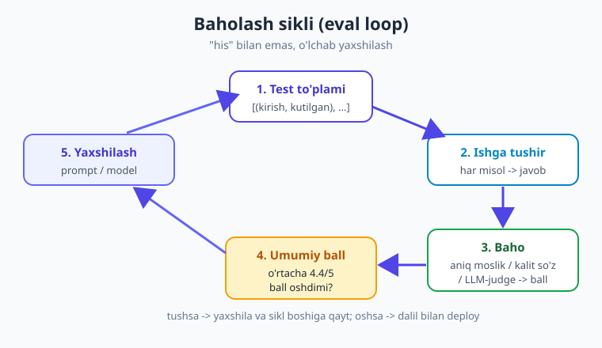

# 25 — Kuzatuv, logging va baholash (eval)

[⬅️ Oldingi: 24 — Xavfsizlik va prompt injection](./24-xavfsizlik-prompt-injection.md) · [🏠 Kitob boshi](./README.md) · [Keyingi: 26 — Deploy: FastAPI bilan LLM xizmati ➡️](./26-deploy-fastapi.md)

> **Bu bobda:** LLM ilovasini "qora quti"dan chiqaramiz. Avval **logging** — har so'rov uchun model, prompt, javob, token, vaqt (latency), narx va xatoni **strukturali** yozib borishni (maxfiyni saqlamasdan, 24-bobga hamohang); keyin **tracing** — ko'p qadamli RAG/agent oqimida har qadam qancha vaqt va token "yegani"ni kuzatishni (sof Python tracer + Langfuse/LangSmith haqida qisqa eslatma); so'ng bobning yuragi — **baholash (evaluation)**: "promptni o'zgartirdim, yaxshi bo'ldimi yoki yomonmi?" degan savolga **o'lchab javob berish**. Test to'plami tuzamiz, avtomatik baholash usullarini (aniq moslik, kalit so'z, **LLM-as-judge** — to'liq kod) ko'ramiz; **regress sinov**ni CI'ga ulaymiz; A/B test va metrikalarga qisqa qaraymiz. Asosiy g'oya — **"his" bilan emas, o'lchab yaxshilash** (17-bobga hamohang).

---

## Muammodan boshlaymiz: ilovangiz "qora quti"

Tasavvur qiling, ilovangiz ishlab turibdi. Bir kuni foydalanuvchi yozadi: "Bot bema'ni javob berdi." Siz qaysi so'rov ekanini, model nima qaytarganini, qaysi prompt ishlatilganini, qancha token ketganini **bilmaysiz** — chunki hech narsa yozib qo'yilmagan.

Yana yomoni: siz promptni "yaxshilash" uchun o'zgartirasiz, deploy qilasiz... va sifat **yomonlashadimi yoki yaxshilanadimi — bilmaysiz**. "Menga shunday tuyuldi" — bu muhandislik emas, taxmin.

LLM ilovasi an'anaviy koddan ikki sababga ko'ra **kuzatuvga muhtoj**:

1. **Nodeterministik.** Bir xil prompt har safar boshqacha javob berishi mumkin. "Bir marta ishladi" — "doim ishlaydi" degani emas.
2. **Pulli va sekin.** Har so'rov token sarflaydi (pul) va sekundlar oladi (latency). Buni o'lchamasangiz — xarajat va sekinlik sizdan yashirin o'sadi.

Yechim uch qatlamli: **logging** (nima bo'ldi?), **tracing** (qayerda sekin/qimmat bo'ldi?), **eval** (yaxshimi yoki yomonmi?). Ushbu bob shu uchtasini quradi.

> **Hayotiy o'xshatish.** Kuzatuvsiz LLM ilovasi — **fonarsiz tunda mashina haydash** kabi. Yo'l bordek, lekin nima oldinda — ko'rinmaydi. Logging — faralar (oldindagi narsani yoritadi), tracing — tezlik o'lchagich va yoqilg'i indikatori (qayerda sekin, qancha sarf), eval — yo'lda to'g'ri ketayotganingizni tasdiqlovchi GPS.

!!! note "Atamalar"
    **Observability (kuzatuvchanlik)** — tizim ichida nima bo'layotganini tashqaridan tushuna olish qobiliyati. **Logging** — voqealarni yozib borish. **Tracing** — bitta so'rovning butun yo'lini (qadamma-qadam) kuzatish. **Evaluation (eval)** — javob sifatini o'lchash. **Latency** — so'rov boshidan javob oxirigacha o'tgan vaqt.

---

## Logging: har so'rovni strukturali yozib borish

Birinchi qadam — har LLM so'rovi haqida **muhim faktlarni** yozib qo'yish. `print()` yetarli emas: u tartibsiz, qidirib bo'lmaydi, faylga tushmaydi. Python'ning standart `logging` moduli — to'g'ri boshlanish nuqtasi.

Har so'rov uchun nimani yozish kerak:

| Maydon | Nega kerak |
|---|---|
| `model` | Qaysi model ishlatildi (taqqoslash uchun) |
| `prompt` (yoki qisqasi/hash) | Nima yuborildi (debug uchun) |
| `javob` | Model nima qaytardi |
| `prompt_tokens` / `completion_tokens` | Token sarfi (narx, optimizatsiya) |
| `latency_ms` | Qancha vaqt ketdi (sekinlikni topish) |
| `narx_usd` | So'rov necha pul turdi |
| `xato` | Xato bo'lsa, qaysi turi |

!!! warning "Maxfiyni logga yozmang (24-bobga hamohang)"
    Log fayllar ko'pincha ochiq saqlanadi va boshqalar ko'radi. **API kalitini, foydalanuvchining PII'sini (telefon, parol, karta), to'liq maxfiy hujjatni logga YOZMANG.** Promptni to'liq yozish o'rniga uning **hashi** yoki **qisqartirilgan ko'rinishi**ni yozing. Bu — 24-bobdagi "ishonch chegarasi" tamoyilining kuzatuvdagi davomi.

### Strukturali (JSON) log

Eng foydali log — **strukturali**, ya'ni mashina o'qiy oladigan JSON. Keyin uni qidirish, filtrlash, jamlash oson. Mana o'rab beruvchi (wrapper) funksiya:

```python
import os, time, json, logging, hashlib
from dotenv import load_dotenv
from openai import OpenAI

load_dotenv()
client = OpenAI()
MODEL = "gpt-5.4-mini"   # Eslatma: model nomlari o'zgaradi — provayder ro'yxatini tekshiring.

# JSON loglarni faylga yozadigan logger
logger = logging.getLogger("llm")
logger.setLevel(logging.INFO)
handler = logging.FileHandler("llm.log.jsonl", encoding="utf-8")
logger.addHandler(handler)

# Taxminiy narx (1M token uchun USD) — provayder narxnomasiga qarab yangilang
NARX = {"gpt-5.4-mini": {"in": 0.15, "out": 0.60}}

def prompt_hash(matn: str) -> str:
    """Promptni to'liq saqlamasdan, uni aniqlovchi qisqa barmoq izi."""
    return hashlib.sha256(matn.encode("utf-8")).hexdigest()[:12]

def chat_log(savol: str, system: str = "Sen foydali yordamchisan.") -> str:
    boshlandi = time.perf_counter()
    yozuv = {"ts": time.time(), "model": MODEL, "prompt_hash": prompt_hash(savol)}
    try:
        resp = client.chat.completions.create(
            model=MODEL,
            messages=[{"role": "system", "content": system},
                      {"role": "user", "content": savol}],
        )
        matn = resp.choices[0].message.content
        u = resp.usage
        narx = (u.prompt_tokens * NARX[MODEL]["in"]
                + u.completion_tokens * NARX[MODEL]["out"]) / 1_000_000
        yozuv.update({
            "latency_ms": round((time.perf_counter() - boshlandi) * 1000),
            "prompt_tokens": u.prompt_tokens,
            "completion_tokens": u.completion_tokens,
            "narx_usd": round(narx, 6),
            "javob_qisqa": matn[:80],   # to'liq javobni emas, qisqasini
            "xato": None,
        })
        return matn
    except Exception as e:
        yozuv.update({
            "latency_ms": round((time.perf_counter() - boshlandi) * 1000),
            "xato": type(e).__name__,
        })
        raise
    finally:
        # Bo'ldimi yoki xato bo'ldimi — baribir bitta JSON qator yoziladi
        logger.info(json.dumps(yozuv, ensure_ascii=False))

print(chat_log("O'zbekistonning poytaxti qaysi shahar?"))
```

Endi `llm.log.jsonl` faylida har so'rov bitta JSON qator bo'lib yotadi. Buni keyin tahlil qilish oson — masalan, o'rtacha latency yoki kunlik xarajatni hisoblash.


Loglarni tahlil qilish — oddiy Python bilan ham mumkin:

```python
import json
yozuvlar = [json.loads(q) for q in open("llm.log.jsonl", encoding="utf-8")]

jami_narx = sum(y.get("narx_usd", 0) for y in yozuvlar)
ortacha_latency = sum(y["latency_ms"] for y in yozuvlar) / len(yozuvlar)
xatolar = sum(1 for y in yozuvlar if y.get("xato"))

print(f"So'rovlar: {len(yozuvlar)} | Jami narx: ${jami_narx:.4f}")
print(f"O'rtacha latency: {ortacha_latency:.0f} ms | Xatolar: {xatolar}")
```

!!! tip "p95 latencyga e'tibor bering"
    "O'rtacha latency" aldamchi: bir nechta juda sekin so'rov o'rtachada yo'qoladi. Production'da **p95** (so'rovlarning 95% shundan tez) yoki **p99**ga qarang — aynan shu "sekin quyruq" foydalanuvchini bezovta qiladi. `sorted(latencylar)[int(len(...)*0.95)]` bilan oson hisoblanadi.

---

## Tracing: ko'p qadamli oqimni kuzatish

Oddiy bitta so'rovda logging yetarli. Lekin **RAG** (qidiruv -> LLM) yoki **agent** (fikrlash -> tool -> fikrlash -> tool...) kabi **ko'p qadamli** oqimda yangi savol tug'iladi: *qaysi qadam* sekin yoki qimmat bo'ldi?

Masalan, RAG so'rovi 4 sekund oldi. Buning 3.5 sekundi vektor qidiruvga ketdimi yoki LLM generatsiyaga? Bilmasangiz — qayerni tezlashtirishni ham bilmaysiz. **Tracing** aynan shu uchun: bitta foydalanuvchi so'rovini (**trace**) ichki qadamlarga (**span**) bo'lib, har birining vaqt/token sarfini yozadi.

> **Hayotiy o'xshatish.** Tracing — shifokorning **EKG (yurak kardiogrammasi)**i kabi. "Bemorga yomon" (so'rov sekin) yetarli emas; EKG aynan *qaysi* udda muammo borligini ko'rsatadi. Trace ham so'rovning qaysi qadamida "yurak tez urganini" (vaqt/token ko'p ketganini) ko'rsatadi.

Sof Python bilan oddiy tracer — kontekst-menejer (`with`) ko'rinishida:

```python
import time, json
from contextlib import contextmanager

class Tracer:
    def __init__(self, nom):
        self.nom = nom          # masalan, "RAG so'rovi"
        self.spanlar = []

    @contextmanager
    def span(self, nom):
        boshlandi = time.perf_counter()
        s = {"nom": nom, "tokens": 0}
        try:
            yield s             # ichkarida s["tokens"] ni to'ldirish mumkin
        finally:
            s["ms"] = round((time.perf_counter() - boshlandi) * 1000)
            self.spanlar.append(s)

    def chiqar(self):
        jami_ms = sum(s["ms"] for s in self.spanlar)
        jami_tok = sum(s["tokens"] for s in self.spanlar)
        print(f"TRACE: {self.nom} — jami {jami_ms} ms, {jami_tok} token")
        for s in self.spanlar:
            ulush = s["ms"] / jami_ms * 100 if jami_ms else 0
            print(f"  - {s['nom']:<16} {s['ms']:>5} ms ({ulush:4.0f}%)  {s['tokens']} tok")

# RAG oqimini "trace" qilamiz
tr = Tracer("RAG so'rovi")

with tr.span("retrieve"):
    time.sleep(0.05)            # vektor bazadan qidirish (simulyatsiya)

with tr.span("llm") as s:
    resp = client.chat.completions.create(
        model=MODEL,
        messages=[{"role": "user", "content": "Kontekst asosida javob ber: ..."}],
    )
    s["tokens"] = resp.usage.total_tokens   # bu qadamning token sarfi

tr.chiqar()
# TRACE: RAG so'rovi — jami 612 ms, 84 token
#   - retrieve          51 ms (  8%)  0 tok
#   - llm              561 ms ( 92%)  84 tok
```

Endi aniq ko'rinadi: vaqtning 92% LLM'ga ketdi — demak, retrieve'ni tezlashtirish foyda bermaydi, model yoki javob uzunligi ustida ishlash kerak.

!!! note "Langfuse / LangSmith — qisqa eslatma"
    Production'da ko'p kishi o'z tracer'ini yozmaydi, balki tayyor **kuzatuv platformasi**dan foydalanadi: **Langfuse** (ochiq kodli, o'zingda joylashtirsa bo'ladi) yoki **LangSmith** (LangChain'dan). Ular trace'larni chiroyli daraxt ko'rinishida ko'rsatadi, token/narxni avtomatik jamlaydi, eval'ni ham qo'llab-quvvatlaydi. Odatda kodga bitta dekorator (`@observe`) yoki bir-ikki qator qo'shasiz. Boshlash uchun yuqoridagi sof-Python tracer kontseptsiyani tushuntiradi; ko'lam kattalashganda platformaga o'tasiz.

---

## Baholash (eval): bobning yuragi

Mana bobning eng muhim qismi. Savol oddiy, lekin javobi qiyin: **"Promptni (yoki modelni) o'zgartirdim — yaxshi bo'ldimi yoki yomon?"**

Ko'p dasturchi buni "qo'lda" qiladi: bir-ikki savol berib ko'radi, "zo'r ko'rinadi" deydi va deploy qiladi. Bu — xavfli. Bitta savolda yaxshilangan narsa boshqa o'nta savolda yomonlashishi mumkin. Yechim — **dasturlashdagi avtomatik testning LLM versiyasi**: oldindan tuzilgan **test to'plami** ustida o'lchash.

> **Hayotiy o'xshatish.** Eval — oshpazning **doimiy retsept daftari** kabi. Yangi ziravor qo'shdingiz; ta'mi yaxshilandimi? "Menga yoqdi" yetarli emas — siz o'nta sinov ovqatini bir xil mezon bo'yicha baholaysiz. Eval to'plami — shu "sinov ovqatlari": prompt o'zgargach, hammasini qayta "tatib", ball pasaymaganini tekshirasiz.

### 1-qadam: test to'plami

Eval'ning asosi — `[(kirish, kutilgan), ...]` ko'rinishidagi misollar to'plami. Buni qo'lda tuzasiz: ilovangiz duch keladigan tipik (va "qiyin") savollarni, va siz **kutgan to'g'ri javob**ni yozasiz.

```python
# eval to'plami — ilovangizning haqiqiy holatlaridan tuzing
TESTLAR = [
    {"kirish": "O'zbekistonning poytaxti?", "kutilgan": "Toshkent"},
    {"kirish": "2 + 2 nechaga teng?", "kutilgan": "4"},
    {"kirish": "Suvning kimyoviy formulasi?", "kutilgan": "H2O"},
]
```

!!! tip "Kichikdan boshlang, asta o'stiring"
    20–50 ta yaxshi tanlangan misol minglab tasodifiy misoldan foyda. Ayniqsa qimmatlisi — **xato bo'lgan holatlar**: foydalanuvchi shikoyat qilgan har bir holatni eval to'plamiga qo'shing. Shunda o'sha xato **boshqa hech qachon qaytmasligiga** kafolat bo'ladi (regress).

### 2-qadam: avtomatik baholash usullari

Endi modelning javobini "kutilgan"ga qanday taqqoslaymiz? Uch asosiy usul, oddiydan murakkabga:

**(a) Aniq moslik (exact match)** — javob roppa-rosa tengmi? Faqat qisqa, aniq javoblar (sana, raqam, ha/yo'q) uchun ishlaydi:

```python
def aniq_moslik(javob: str, kutilgan: str) -> bool:
    return javob.strip().lower() == kutilgan.strip().lower()
```

**(b) Kalit so'z bor-yo'qligi (contains)** — kutilgan so'z javob ichida bormi? Erkin matnli javob uchun yumshoqroq:

```python
def kalit_soz(javob: str, kutilgan: str) -> bool:
    return kutilgan.strip().lower() in javob.strip().lower()
```

Bu ikkisi tez va arzon, lekin **mazmunni** tushunmaydi. "Poytaxt Toshkent shahridir" javobi "Toshkent" kalit so'zini o'z ichiga oladi — yaxshi. Lekin "Toshkent emas, balki..." ham o'tib ketadi — yomon. Mazmunni baholash uchun uchinchi usul kerak.

**(c) LLM-as-judge** — eng kuchli usul. Buni alohida ko'ramiz.

---

## LLM-as-judge: model model javobini baholaydi

Erkin matnli, ijodiy yoki murakkab javoblarni "aniq moslik" bilan baholab bo'lmaydi. G'oya: **kuchli modelga "sudya" rolini berasiz** — unga savol, model javobi va **baholash mezonini** beramiz, u esa ball qo'yadi. Bu — inson baholashiga eng yaqin avtomatik usul.



Maslahat: sudya **JSON** qaytarsin (9-bobdagi strukturali natija), shunda ballni avtomatik o'qiysiz. Va sudyaga **aniq mezon** bering — "yaxshimi?" emas, "to'g'ri, to'liq va savolga javob beradimi?".

```python
import json

def llm_judge(savol: str, javob: str, kutilgan: str) -> dict:
    """Kuchli model boshqa model javobini 1-5 ball bilan baholaydi."""
    sudya_prompt = f"""Sen xolis baholovchisan. Quyidagi javobni mezon bo'yicha bahola.

SAVOL: {savol}
KUTILGAN (etalon): {kutilgan}
BAHOLANADIGAN JAVOB: {javob}

Mezon: javob to'g'rimi va savolga to'liq javob beradimi (etalonga mazmunan mos)?
Faqat JSON qaytar: {{"ball": <1-5 butun son>, "sabab": "<bir jumla>"}}
1 = butunlay xato, 5 = to'liq to'g'ri."""

    resp = client.chat.completions.create(
        model="gpt-5.5",   # sudya — KUCHLIROQ model bo'lsin (baholanayotgandan)
        messages=[{"role": "user", "content": sudya_prompt}],
        response_format={"type": "json_object"},   # JSON rejimi
    )
    return json.loads(resp.choices[0].message.content)

natija = llm_judge(
    savol="O'zbekistonning poytaxti?",
    javob="Mamlakat poytaxti — Toshkent shahri.",
    kutilgan="Toshkent",
)
print(natija)   # {'ball': 5, 'sabab': "Javob to'g'ri va aniq."}
```

!!! warning "LLM-as-judge — foydali, lekin mukammal emas"
    Sudya ham LLM — u ham xato qilishi mumkin (xolisroq bo'lishi uchun **kuchliroq** model tanlang). Sudya o'zi baholayotgan modelning aynan o'zi bo'lmasin (o'ziga yon bosadi). Juda muhim qarorlarda (masalan, model relizi) bir necha namunani **inson** ham tekshirsin. Sudya — qo'lda baholashni **kamaytiradi**, butunlay o'rnini bosmaydi.

---

## Hammasini birlashtirib: eval ishga tushiruvchi

Endi test to'plami + baholash usulini birlashtiramiz: butun to'plamni ishga tushirib, umumiy ball chiqaramiz. Bu — eng muhim funksiya, chunki "prompt yaxshilandimi?" savoliga **bitta raqam** bilan javob beradi.

```python
def eval_otkaz(chat_funksiya) -> dict:
    """TESTLAR to'plamini ishga tushirib, o'rtacha ball va o'tish foizini qaytaradi."""
    natijalar = []
    for t in TESTLAR:
        javob = chat_funksiya(t["kirish"])
        baho = llm_judge(t["kirish"], javob, t["kutilgan"])
        otdi = baho["ball"] >= 4    # 4-5 = "o'tdi" deb hisoblaymiz
        natijalar.append({"savol": t["kirish"], "ball": baho["ball"], "otdi": otdi})
        belgi = "OK " if otdi else "XATO"
        print(f"[{belgi}] {baho['ball']}/5 — {t['kirish']}")

    ortacha = sum(r["ball"] for r in natijalar) / len(natijalar)
    otish = sum(r["otdi"] for r in natijalar) / len(natijalar) * 100
    print(f"\nNATIJA: o'rtacha ball {ortacha:.2f}/5 | o'tish {otish:.0f}%")
    return {"ortacha_ball": ortacha, "otish_foizi": otish, "natijalar": natijalar}

# Joriy promptni baholaymiz
eval_otkaz(lambda savol: chat_log(savol))
```



Endi ish jarayoni shunday bo'ladi: promptni o'zgartirasiz -> `eval_otkaz` ishga tushirasiz -> o'rtacha ball oshganini ko'rasiz -> **dalil bilan** deploy qilasiz. "Menga shunday tuyuldi" o'rniga "o'rtacha ball 3.8 dan 4.4 ga oshdi".

> **Hayotiy o'xshatish.** Eval to'plami — sport zalida **tarozi**. Mashqni o'zgartirdingiz; foyda bo'ldimi? Tarozisiz "kuchliroq his qildim" deysiz — o'zingizni aldash oson. Tarozi (eval ball) raqam beradi: oshdimi, tushdimi. Shu raqamga qarab haqiqiy yaxshilanasiz.

---

## Regress sinov: eski sifat tushmasin (CI'da)

An'anaviy dasturlashda **regress test** bor: yangi kod eski ishlagan narsani buzmasligini tekshiradi. LLM ilovasida ham xuddi shunday kerak — chunki promptni yoki modelni o'zgartirish **kutilmagan joyda** sifatni tushirishi mumkin.

G'oya: eval to'plamini **`pytest`** testiga aylantirib, CI (masalan, GitHub Actions)'da har commit'da ishga tushirasiz. Ball belgilangan chegaradan tushsa — test **yiqiladi**, deploy to'xtaydi.

```python
# test_eval.py — pytest bilan ishga tushadi: pytest test_eval.py
CHEGARA = 4.0   # o'rtacha ball shundan past bo'lsa — yiqilamiz

def test_sifat_chegaradan_past_emas():
    natija = eval_otkaz(lambda s: chat_log(s))
    assert natija["ortacha_ball"] >= CHEGARA, (
        f"Sifat tushdi! O'rtacha ball {natija['ortacha_ball']:.2f} < {CHEGARA}"
    )
```

!!! tip "Nondeterminizmni hisobga oling"
    LLM javobi har safar biroz boshqacha bo'lgani uchun ball ham tebranadi. Shuning uchun: (1) chegarani **biroz pastroq** qo'ying (4.5 emas, 4.0) — tasodifiy 1 ball pasayishida CI yiqilmasin; (2) eng muhim testlar uchun har misolni **bir necha marta** ishlatib o'rtachasini oling; (3) `temperature`ni 0 ga yaqin qo'ysangiz (6-bob), javoblar barqarorroq, eval ham mustahkamroq bo'ladi.

!!! note "17-bobga bog'lash"
    17-bobda RAG'ni baholaganmiz — u yerda eval **retrieval** (kerakli chunk topildimi?) va javob sifatiga qaratilgan edi. Ushbu bobdagi tamoyillar (test to'plami, LLM-as-judge, regress) **bir xil** — faqat bu yerda butun ilova javobiga, RAG bobida esa qidiruv qatlamiga ham tatbiq etiladi. Ikkalasi bir-birini to'ldiradi.

---

## A/B test va metrikalar (qisqacha)

Eval to'plami — **deploydan oldin** sifatni o'lchaydi. Lekin haqiqiy foydalanuvchi xulq-atvorini faqat **production'da** bilasiz. Ikki amaliy usul:

- **A/B test.** Foydalanuvchilarni ikki guruhga bo'lasiz: yarmiga A prompt/modelni, yarmiga B'ni ko'rsatasiz. Keyin qaysi guruhda metrikalar yaxshiroq ekanini o'lchaysiz. Bu — eval ko'rsatmagan "haqiqiy hayot" farqini topadi.
- **Metrikalar.** Eng foydalilari: **foydalanuvchi qoniqishi** (javob ostidagi 👍/👎 tugmasi — eng arzon va kuchli signal), **vazifa bajarilishi** (foydalanuvchi maqsadiga yetdimi?), **xato/refuse darajasi**, **o'rtacha latency va narx** (logdan). Bu metrikalarni logingiz ustida hisoblaysiz.

> **Hayotiy o'xshatish.** Eval to'plami — mashinani **sinov maydonida** tekshirish (xavfsiz, takrorlanadigan). A/B test — uni **haqiqiy yo'lga** chiqarib, ikki shinani solishtirish. Ikkalasi kerak: maydon arzon va tez, lekin haqiqiy yo'lning hamma holatini qamramaydi.

!!! tip "👍/👎 — eng arzon eval"
    Eng oddiy va kuchli production signali — har javob ostiga ikkita tugma qo'yish. Foydalanuvchi 👎 bossa, o'sha so'rov+javobni saqlang. Bu — bepul eval to'plami: real foydalanuvchidan kelgan haqiqiy xato holatlar, ularni keyin test to'plamingizga qo'shasiz.

---

## Xulosa

- LLM ilovasi **nodeterministik** va **pulli/sekin** — shuning uchun u an'anaviy koddan ko'ra **kuzatuvga muhtoj**. Kuzatuvsiz ilova — fonarsiz haydash.
- **Logging:** har so'rov uchun model, prompt (hash/qisqa), javob, token, latency, narx va xatoni **strukturali (JSON)** yozing. Maxfiyni (kalit, PII) **logga yozmang** (24-bob).
- Loglardan kunlik **xarajat**, **xato darajasi** va ayniqsa **p95 latency** (sekin quyruq)ni hisoblang — o'rtacha aldamchi.
- **Tracing:** ko'p qadamli RAG/agent oqimida har **span** (retrieve, tool, LLM) qancha vaqt/token yeganini ko'rsatadi — qayerni tezlashtirishni aniq bilasiz. Production'da **Langfuse/LangSmith** ishlatiladi.
- **Eval — bobning yuragi:** "yaxshi bo'ldimi?" savoliga **o'lchab** javob bering. `[(kirish, kutilgan), ...]` test to'plami + baholash usuli (aniq moslik, kalit so'z, **LLM-as-judge**) = bitta raqam.
- **LLM-as-judge:** kuchliroq model boshqa javobni **aniq mezon** bo'yicha (JSON, 1–5 ball) baholaydi — erkin matn uchun eng yaxshi avtomatik usul, lekin mukammal emas (muhim qarorda inson ham tekshirsin).
- **Regress sinov:** eval'ni `pytest`+CI'ga ulang — sifat chegaradan tushsa, deploy to'xtaydi. Nondeterminizm uchun chegarani biroz pastroq qo'ying.
- **A/B test va metrikalar** (👍/👎, vazifa bajarilishi, latency, narx) — production'dagi haqiqiy sifatni o'lchaydi. Asosiy saboq: **"his" bilan emas, o'lchab yaxshiling** (17-bobga hamohang).

## Amaliy mashqlar

1. **(Oson)** Yuqoridagi `chat_log` funksiyasini ishlating, 5 ta turli savol yuboring. Hosil bo'lgan `llm.log.jsonl` faylini oching va har qatorda qaysi maydonlar borligini ko'rib chiqing. Eng sekin so'rov qaysi bo'ldi?

2. **(Oson)** Log tahlil skriptini (o'rtacha latency, jami narx, xatolar) ishga tushiring. Keyin unga **p95 latency** hisobini qo'shing: `sorted([y["latency_ms"] for y in yozuvlar])[int(len(yozuvlar)*0.95)]`.

3. **(O'rtacha)** O'zingiz duch keladigan vazifa uchun 10 ta misoldan iborat `TESTLAR` to'plamini tuzing (jumladan 2-3 ta "qiyin" holat). `eval_otkaz` bilan joriy promptni baholang — o'rtacha ball qancha chiqdi?

4. **(O'rtacha)** Promptga "Qisqa va aniq javob ber" jumlasini qo'shing va `eval_otkaz`ni qayta ishga tushiring. O'rtacha ball oshdimi yoki tushdimi? `temperature`ni o'zgartirib (6-bob) ham sinab ko'ring va farqni yozib oling.

5. **(Qiyin)** `Tracer` sinfidan foydalanib, ikki qadamli oqim (masalan: birinchi LLM chaqiruvi savolni qayta yozadi, ikkinchisi javob beradi) quring va har qadamning vaqt/token ulushini chiqaring. So'ng `test_eval.py` ni `pytest` bilan ishlatib, `CHEGARA`ni atayin 4.9 ga ko'tarib, regress testning **yiqilishi**ni kuzating.

---

[⬅️ Oldingi: 24 — Xavfsizlik va prompt injection](./24-xavfsizlik-prompt-injection.md) · [🏠 Kitob boshi](./README.md) · [Keyingi: 26 — Deploy: FastAPI bilan LLM xizmati ➡️](./26-deploy-fastapi.md)
