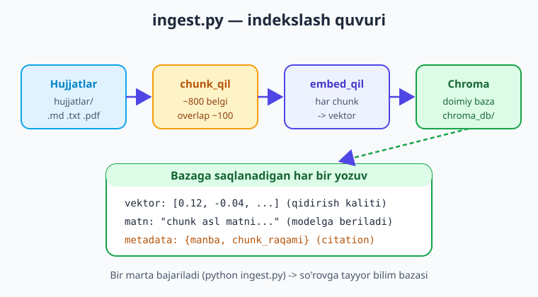

# 27 — Kapston I: RAG chatbot

[⬅️ Oldingi: 26 — Deploy: FastAPI bilan LLM xizmati](./26-deploy-fastapi.md) · [🏠 Kitob boshi](./README.md) · [Keyingi: 28 — Kapston II: agent-asoslangan avtomatlashtirish ➡️](./28-kapston-agent.md)

> **Bu bobda:** kitobning butun yo'lini bitta **ishlaydigan loyiha**da birlashtiramiz — o'z hujjatlaringiz ustida savol-javob qiladigan, suhbatni **eslaydigan** va har javobda **manba ko'rsatadigan** RAG chatbot. Loyihani professional tarzda fayllarga ajratamiz: `config.py` (sozlama va model), `ingest.py` (hujjat -> chunk -> embed -> Chroma, 15-bob), `rag.py` (retrieve + generate + citations, 16-bob), `chat.py` (suhbat xotirasi, 8-bob, + CLI interfeys). So'ng bir savolni tarix bilan **standalone** (mustaqil) qilib qayta yozish orqali ko'p-navbatli suhbatni; xarajat (22-bob) va xato (23-bob) boshqaruvini qisqa ulaymiz; va nihoyat FastAPI `/chat` (26-bob) variantini eslatib o'tamiz. Oxirida — `pip install` dan `python chat.py` gacha to'liq foydalanish ko'rsatmasi va "keyingi qadamlar".

---

## Muammodan boshlaymiz: alohida bilim — yetarli emas

Shu paytgacha har bobda bittadan ko'nikma o'rgandik: birinchi so'rov (2-bob), suhbat xotirasi (8-bob), embeddings va vektor baza (13-14-bob), RAG indekslash va so'rov (15-16-bob), xarajat (22-bob), ishonchlilik (23-bob), deploy (26-bob). Har biri o'zicha kichik misol edi.

Lekin **haqiqiy ilova** — bu alohida misollar yig'indisi emas, balki ularning **birlashgan, yaxlit tizimi**. Foydalanuvchi sizning chatbotingizdan "kechagi savolimga qaytsak..." deb so'raganda, u bir vaqtning o'zida: tarixni eslashni (8-bob), savolga mos hujjatni topishni (16-bob), manbani ko'rsatishni (16-bob) va bularning hammasi arzon hamda xatosiz ishlashini (22-23-bob) kutadi.

Bu bobda biz aynan shunday tizim quramiz: **o'z hujjatlaringiz bo'yicha gaplashadigan, manbali, esi bor chatbot.** Bu — kitobning birinchi kapston (yakuniy loyiha) bobi.

> **Hayotiy o'xshatish.** Shu paytgacha biz alohida-alohida **g'isht, sement, sim, quvur** tayyorlashni o'rgandik. Kapston — shu materiallardan **uy qurish**. Materiallarni bilish — bir narsa; ulardan turadigan, foydalaniladigan bino yasash — boshqa narsa. Aynan shu "yig'ish" mahorati sizni dasturchidan **ilova quruvchiga** aylantiradi.

!!! note "Bu bob avvalgi boblarga tayanadi"
    Bu yerda 15, 16 va 8-boblardagi kodni qaytadan **noldan tushuntirmaymiz** — ularni o'qigan deb hisoblaymiz. O'rniga ularni **toza, fayllarga ajratilgan loyiha** ko'rinishida birlashtiramiz va yangi qism — ko'p-navbatli suhbatni RAG bilan bog'lashni — qo'shamiz. Agar biror qism notanish tuyulsa, tegishli bobga qaytib o'qing.

---

## To'liq tizim: arxitektura

Avval butun tizimning "katta rasmini" ko'raylik. RAG chatbot — ikki fazadan iborat (15-bobdan tanish): **indekslash** (oldindan, bir marta) va **chat** (har savolda). Chat fazasi esa endi yangi qism — **suhbat xotirasini** ham o'z ichiga oladi.


Tizim to'rt fayldan iborat. Har biri bitta vazifani bajaradi (bir mas'uliyat — toza kod belgisi):

| Fayl | Vazifa | Qaysi bobdan |
|---|---|---|
| `config.py` | Sozlama: provayder, model nomlari, yo'llar (`.env`dan o'qiydi) | 2, 4-bob |
| `ingest.py` | Indekslash: hujjat -> chunk -> embed -> Chroma | 15-bob |
| `rag.py` | So'rov: retrieve + prompt + generate + citations | 16-bob |
| `chat.py` | Suhbat xotirasi + savolni qayta yozish + CLI | 8-bob |

> **Hayotiy o'xshatish.** Bu to'rt fayl — **restoran**ning to'rt xonasi: `config.py` — menyu va qoidalar (nima ishlatamiz), `ingest.py` — ombor (mahsulotni oldindan tayyorlab qo'yish), `rag.py` — oshxona (buyurtmaga taom pishirish), `chat.py` — zal (mijoz bilan muloqot). Hammasi alohida, lekin birga ishlaydi.

Endi har bir faylni bosqichma-bosqich quramiz.

---

## 1-bosqich: `config.py` — bitta joyda sozlama

Yaxshi loyihada **barcha sozlama bitta joyda** turadi: model nomlari, yo'llar, provayder. Shunda provayderni almashtirish yoki modelni yangilash uchun butun kodni titkilamaysiz — faqat `config.py`ni o'zgartirasiz.

```python
# config.py — barcha sozlama bir joyda
import os
from dotenv import load_dotenv
from openai import OpenAI

load_dotenv()   # .env faylidagi kalitlarni muhitga yuklaydi

# --- Provayder va mijoz ---
# OpenAI-mos: faqat base_url + kalit + model almashtirib boshqasiga o'tasiz (4-bob).
# Standart: OpenAI. Groq/Gemini-mos uchun base_url'ni izohdan oching.
client = OpenAI()
# client = OpenAI(base_url="https://api.groq.com/openai/v1",
#                 api_key=os.environ["GROQ_API_KEY"])   # bepul, tez

# --- Model nomlari (eslatma: nomlar o'zgaradi — provayder ro'yxatini tekshiring) ---
CHAT_MODEL = "gpt-5.4-mini"             # arzon/tez chat modeli
EMBED_MODEL = "text-embedding-3-small"  # embedding modeli (indeks bilan bir xil bo'lishi SHART)

# --- Yo'llar va sozlamalar ---
DB_YOL = "./chroma_db"          # Chroma doimiy bazasi
KOLLEKSIYA = "bilim_bazasi"     # kolleksiya nomi
HUJJATLAR_YOL = "./hujjatlar"   # indekslanadigan hujjatlar papkasi
CHUNK_OLCHAM = 800              # chunk hajmi (belgi) — 15-bob
CHUNK_OVERLAP = 100            # ustma-ustlik (belgi) — 15-bob
TOP_K = 4                      # retrieve'da nechta chunk — 16-bob
```

!!! tip "Sozlamani markazlashtirish — production odati"
    `config.py` — kitobdagi "ko'p-provayderli" g'oyaning amaliy tayanchi. Bugun OpenAI'da ishlab, ertaga arzonroq Groq'ga yoki lokal Ollama'ga (21-bob) o'tmoqchi bo'lsangiz — faqat `client` va ikki model nomini o'zgartirasiz. Qolgan uchta fayl `config`dan import qiladi va **umuman o'zgarmaydi**. Embedding modelini esa o'zgartirsangiz — bazani **qayta indekslashingiz** kerak (16-bob: savol va chunk bir xil model bilan embed bo'lishi shart).

---

## 2-bosqich: `ingest.py` — indekslash quvuri (15-bob)

Birinchi faza — **indekslash**. `hujjatlar/` papkasidagi har bir faylni yuklab, bo'laklab (chunk), embed qilib, metadata bilan Chroma'ga yozamiz. Bu **bir marta** (yoki hujjat o'zgarganda) ishlaydi. Kod 15-bobdan tanish — endi `config`dan sozlamani oladi.



```python
# ingest.py — hujjat -> chunk -> embed -> Chroma (15-bob)
from pathlib import Path
from pypdf import PdfReader
import chromadb

from config import client, EMBED_MODEL, DB_YOL, KOLLEKSIYA
from config import HUJJATLAR_YOL, CHUNK_OLCHAM, CHUNK_OVERLAP


def hujjat_yukla(yol: Path) -> str:
    """Formatga qarab matn ajratadi: .pdf uchun pypdf, qolganlar to'g'ridan-to'g'ri."""
    if yol.suffix.lower() == ".pdf":
        reader = PdfReader(str(yol))
        return "\n".join((s.extract_text() or "") for s in reader.pages)
    return yol.read_text(encoding="utf-8")   # .txt, .md


def chunk_qil(matn: str, olcham=CHUNK_OLCHAM, overlap=CHUNK_OVERLAP) -> list[str]:
    """Matnni overlap bilan belgi-bo'laklarga ajratadi (15-bob)."""
    boklar, boshi = [], 0
    while boshi < len(matn):
        bolak = matn[boshi:boshi + olcham].strip()
        if bolak:
            boklar.append(bolak)
        boshi += olcham - overlap   # keyingi bo'lak overlap qadar orqaga suriladi
    return boklar


def embed_qil(matnlar: list[str]) -> list[list[float]]:
    """Matnlar ro'yxatini vektorlarga aylantiradi (bitta so'rovda)."""
    javob = client.embeddings.create(model=EMBED_MODEL, input=matnlar)
    return [d.embedding for d in javob.data]


def indeksla():
    """hujjatlar/ papkasini to'liq indekslab, Chroma'ga doimiy saqlaydi."""
    db = chromadb.PersistentClient(path=DB_YOL)
    try:
        db.delete_collection(KOLLEKSIYA)   # toza boshlash
    except Exception:
        pass
    kol = db.create_collection(KOLLEKSIYA)

    papka = Path(HUJJATLAR_YOL)
    fayllar = [p for p in papka.iterdir()
               if p.suffix.lower() in {".txt", ".md", ".pdf"}]
    if not fayllar:
        print(f"Diqqat: {HUJJATLAR_YOL} papkasida hujjat topilmadi.")
        return

    jami = 0
    for fayl in fayllar:
        boklar = chunk_qil(hujjat_yukla(fayl))
        if not boklar:
            continue
        vektorlar = embed_qil(boklar)
        kol.add(
            ids=[f"{fayl.name}-{i}" for i in range(len(boklar))],
            embeddings=vektorlar,
            documents=boklar,                                  # asl matn — modelga beriladi
            metadatas=[{"manba": fayl.name, "chunk_raqami": i} # citation uchun
                       for i in range(len(boklar))],
        )
        jami += len(boklar)
        print(f"  {fayl.name}: {len(boklar)} ta chunk")

    print(f"\nTayyor: {len(fayllar)} ta fayl, {jami} ta chunk indekslandi -> {DB_YOL}")


if __name__ == "__main__":
    indeksla()
```

Endi `python ingest.py` ishga tushirsangiz, `hujjatlar/` papkasidagi hamma fayl `./chroma_db` ichiga **doimiy** saqlanadi. Bu — chatbotning "bilim bazasi".

!!! warning "Indekslash — pul/token sarflaydi"
    Har chunkni embed qilish embedding modeliga so'rov yuboradi — bu token, demak (bulutli provayderda) **pul** (22-bob). Shuning uchun indekslashni `PersistentClient` bilan **bir marta** qildik va diskka saqladik — har chatda qaytadan hisoblamaymiz. Katta hujjat to'plamida embed so'rovlarini paketlarga (har ~100 chunk) bo'lish kerak (15-bobdagi maslahat).

---

## 3-bosqich: `rag.py` — retrieve + generate + citations (16-bob)

Ikkinchi faza — **so'rov**. Bu fayl 16-bobning yuragi: savolni olib, bazadan top-k chunkni topadi (retrieve), promptni yig'adi (augment), modeldan **faqat kontekstga tayanib** javob oladi (generate) va **manbalarni** qaytaradi (citations).

```python
# rag.py — retrieve + augment + generate + citations (16-bob)
import chromadb
from chromadb.utils import embedding_functions

from config import client, CHAT_MODEL, EMBED_MODEL
from config import DB_YOL, KOLLEKSIYA, TOP_K
import os

# Bazaga ulanish. Embedding funksiyasi indekslashdagi bilan AYNAN bir xil model.
_db = chromadb.PersistentClient(path=DB_YOL)
_embed_fn = embedding_functions.OpenAIEmbeddingFunction(
    api_key=os.environ["OPENAI_API_KEY"],
    model_name=EMBED_MODEL,
)
_kol = _db.get_collection(name=KOLLEKSIYA, embedding_function=_embed_fn)


def chunklarni_top(savol: str, top_k: int = TOP_K) -> list[dict]:
    """Savolga eng yaqin top_k chunkni matn + metadata bilan qaytaradi."""
    natija = _kol.query(
        query_texts=[savol],
        n_results=top_k,
        include=["documents", "metadatas", "distances"],
    )
    chunklar = []
    for matn, meta, masofa in zip(
        natija["documents"][0], natija["metadatas"][0], natija["distances"][0]
    ):
        chunklar.append({"matn": matn, "meta": meta, "masofa": masofa})
    return chunklar


TIZIM_KORSATMA = (
    "Sen kompaniya hujjatlari bo'yicha yordamchi savol-javob tizimisan.\n"
    "QOIDALAR:\n"
    "1. FAQAT quyida berilgan KONTEKSTGA tayanib javob ber.\n"
    "2. Agar javob kontekstda bo'lmasa, o'zingdan TO'QIMA — "
    "'Bu savolga hujjatlarda javob topilmadi' deb ayt.\n"
    "3. Javobing oxirida foydalangan manbalarni [1], [2] ko'rinishida ko'rsat.\n"
    "4. Qisqa, aniq va o'zbek tilida javob ber."
)


def _kontekst_yig(chunklar: list[dict]) -> str:
    """Chunklarni raqamlangan, manbali matnga aylantiradi (citation uchun)."""
    qismlar = []
    for i, c in enumerate(chunklar, start=1):
        manba = c["meta"].get("manba", "noma'lum")
        qismlar.append(f"[{i}] (manba: {manba})\n{c['matn']}")
    return "\n\n".join(qismlar)


def _manbalar_royxati(chunklar: list[dict]) -> str:
    """Foydalanuvchiga ko'rsatish uchun [n] -> manba jadvali."""
    qatorlar = []
    for i, c in enumerate(chunklar, start=1):
        manba = c["meta"].get("manba", "noma'lum")
        qatorlar.append(f"[{i}] {manba}")
    return "\n".join(qatorlar)


def rag_javob(savol: str, top_k: int = TOP_K) -> dict:
    """Bitta savolga RAG orqali javob: retrieve -> augment -> generate -> citation."""
    chunklar = chunklarni_top(savol, top_k=top_k)
    if not chunklar:
        return {"javob": "Bu savolga hujjatlarda javob topilmadi.",
                "manbalar": "", "chunklar": []}

    foydalanuvchi_xabari = (
        f"KONTEKST:\n{_kontekst_yig(chunklar)}\n\n"
        f"SAVOL: {savol}\n\nYuqoridagi kontekstga tayanib javob ber."
    )
    resp = client.chat.completions.create(
        model=CHAT_MODEL,
        messages=[
            {"role": "system", "content": TIZIM_KORSATMA},
            {"role": "user", "content": foydalanuvchi_xabari},
        ],
        temperature=0.2,   # past harorat — faktlarga sodiq (6-bob)
    )
    return {
        "javob": resp.choices[0].message.content,
        "manbalar": _manbalar_royxati(chunklar),
        "chunklar": chunklar,
    }
```

Bu fayl 16-bobdagi `rag_javob` bilan deyarli bir xil — lekin endi u **bitta savol**ga javob beradi va suhbat tarixini bilmaydi. Suhbatni keyingi bosqichda `chat.py`da qo'shamiz.

!!! note "Nega `rag.py` tarixni bilmaydi?"
    Har fayl **bitta vazifa** bajarsin. `rag.py`ning ishi — "berilgan savolga hujjatdan javob top". Tarix, qaysi foydalanuvchi, qachon — bu `chat.py`ning ishi. Bu ajratish (separation of concerns) kodni soddalashtiradi: `rag_javob`ni alohida sinash, qayta ishlatish (masalan, FastAPI'da) oson bo'ladi.

---

## 4-bosqich: suhbat xotirasi va savolni qayta yozish (8-bob)

Mana eng qiziq yangi qism. Hozirgi `rag_javob` **bir martalik** savolga ishlaydi. Lekin haqiqiy chatbot — **ko'p navbatli**. Muammoni ko'raylik:

```text
Siz:  Ta'til yiliga necha kun?
Bot:  Yiliga 21 ish kuni beriladi [1].
Siz:  Uni qanday rasmiylashtiraman?    <- "uni" nima? Tarixsiz tushunarsiz!
```

Ikkinchi savol — "Uni qanday rasmiylashtiraman?" — **o'zicha to'liq emas**. "Uni" so'zi oldingi navbatdagi "ta'til"ga ishora qiladi. Agar shu savolni to'g'ridan-to'g'ri vektor bazaga bersak, qidiruv chalkashadi — chunki "uni qanday rasmiylashtiraman" hech qaysi chunkga aniq mos kelmaydi.

Yechim (8-bobdagi g'oyaga tayanadi): savolni **vektor bazaga berishdan oldin**, tarix yordamida **standalone** (mustaqil, to'liq) shaklga qayta yozamiz. Ya'ni LLM'dan so'raymiz: "shu suhbat va yangi savolga qarab, savolni o'zicha tushunarli qilib qayta yoz".


```text
"Uni qanday rasmiylashtiraman?"  + tarix  ->  qayta yozish  ->  "Ta'tilni qanday rasmiylashtiraman?"
                                                                  ^ endi bu savol o'zicha to'liq, retrieve to'g'ri ishlaydi
```

> **Hayotiy o'xshatish.** Suhbatda biz "u", "uni", "o'sha" kabi so'zlarni ishlatamiz — chunki suhbatdoshimiz kontekstni eslaydi. Lekin **kutubxonachiga** (vektor baza) borib "uni topib bering" desangiz, u tushunmaydi — to'liq nomini aytishingiz kerak. Savolni qayta yozish — aynan suhbat tilidan "kutubxona tiliga" tarjima.

Qayta yozish funksiyasi (LLM'ga arzon chaqiruv):

```python
def savolni_qayta_yoz(savol: str, tarix: list[dict]) -> str:
    """Tarix yordamida savolni o'zicha tushunarli (standalone) qilib qayta yozadi.
    Tarix bo'sh bo'lsa, savolni o'zgartirmay qaytaradi."""
    if not tarix:
        return savol
    # Faqat oxirgi bir-ikki navbatni berish kifoya (arzon, kontekst yetarli)
    oxirgi = tarix[-4:]
    suhbat_matni = "\n".join(f"{m['role']}: {m['content']}" for m in oxirgi)
    prompt = (
        "Quyidagi suhbat va yangi savol berilgan. Yangi savolni suhbatdan "
        "mustaqil (standalone) — o'zicha to'liq tushunarli qilib qayta yoz. "
        "'u', 'uni', 'o'sha' kabi ishoralarni aniq nom bilan almashtir. "
        "Faqat qayta yozilgan savolni qaytar, boshqa hech narsa yozma.\n\n"
        f"SUHBAT:\n{suhbat_matni}\n\nYANGI SAVOL: {savol}"
    )
    resp = client.chat.completions.create(
        model=CHAT_MODEL,
        messages=[{"role": "user", "content": prompt}],
        temperature=0.0,   # aniq, barqaror qayta yozish
    )
    return resp.choices[0].message.content.strip()
```

!!! tip "Birinchi savol uchun qayta yozish shart emas"
    `if not tarix: return savol` — birinchi savolda tarix bo'sh, savol allaqachon to'liq. Shunda keraksiz LLM chaqiruvini (pul + vaqt) tejaymiz. Bu kichik optimallashtirish ko'p-navbatli ilovada sezilarli farq qiladi.

---

## 5-bosqich: `chat.py` — hammasini birlashtirgan CLI

Endi to'rt qismni birlashtiramiz: **suhbat xotirasi** (8-bob) + **savolni qayta yozish** + **RAG javob** (16-bob), ustiga oddiy CLI interfeys. Bu — to'liq ishlaydigan chatbot.

```python
# chat.py — suhbat xotirasi + savolni qayta yozish + RAG + CLI
import json
from pathlib import Path

from config import client, CHAT_MODEL
from rag import rag_javob


def savolni_qayta_yoz(savol: str, tarix: list[dict]) -> str:
    if not tarix:
        return savol
    suhbat_matni = "\n".join(f"{m['role']}: {m['content']}" for m in tarix[-4:])
    prompt = (
        "Quyidagi suhbat va yangi savol berilgan. Yangi savolni suhbatdan "
        "mustaqil (standalone) — o'zicha to'liq tushunarli qilib qayta yoz. "
        "'u', 'uni', 'o'sha' kabi ishoralarni aniq nom bilan almashtir. "
        "Faqat qayta yozilgan savolni qaytar.\n\n"
        f"SUHBAT:\n{suhbat_matni}\n\nYANGI SAVOL: {savol}"
    )
    resp = client.chat.completions.create(
        model=CHAT_MODEL,
        messages=[{"role": "user", "content": prompt}],
        temperature=0.0,
    )
    return resp.choices[0].message.content.strip()


class RAGChatbot:
    """O'z hujjatlari bo'yicha gaplashadigan, esi bor, manbali chatbot."""

    def __init__(self, tarix_fayl: str = "suhbat.json"):
        self.tarix_fayl = tarix_fayl
        self.tarix: list[dict] = []      # user/assistant xabarlari (8-bob)
        self._yukla()

    def _yukla(self):
        """Avvalgi suhbatni diskdan tiklaydi (8-bob: davomiylik)."""
        if Path(self.tarix_fayl).exists():
            self.tarix = json.loads(Path(self.tarix_fayl).read_text(encoding="utf-8"))
            print(f"(avvalgi suhbat tiklandi — {len(self.tarix)} xabar)")

    def saqla(self):
        Path(self.tarix_fayl).write_text(
            json.dumps(self.tarix, ensure_ascii=False, indent=2), encoding="utf-8")

    def sora(self, savol: str) -> dict:
        # 1. Savolni tarix bilan standalone qilamiz (retrieve to'g'ri ishlashi uchun)
        standalone = savolni_qayta_yoz(savol, self.tarix)

        # 2. RAG: standalone savol bo'yicha hujjatdan javob (16-bob)
        natija = rag_javob(standalone)

        # 3. Tarixga ASL savol va javobni qo'shamiz (keyingi navbat uchun)
        self.tarix.append({"role": "user", "content": savol})
        self.tarix.append({"role": "assistant", "content": natija["javob"]})

        natija["standalone"] = standalone   # debug uchun foydali
        return natija


def main():
    bot = RAGChatbot()
    print("RAG chatbot. Savolingizni yozing. Chiqish: 'chiqish'.\n")
    while True:
        savol = input("Siz: ").strip()
        if savol.lower() in ("chiqish", "exit", "quit", ""):
            bot.saqla()
            print("Suhbat saqlandi. Xayr!")
            break
        try:
            natija = bot.sora(savol)
        except Exception as e:                 # ishonchlilik (23-bob) — qisqa himoya
            print(f"Xato yuz berdi: {e}\nQaytadan urinib ko'ring.\n")
            continue
        print(f"\nBot: {natija['javob']}")
        if natija["manbalar"]:
            print(f"\nManbalar:\n{natija['manbalar']}")
        print()


if __name__ == "__main__":
    main()
```

Mana butun tizim ishlayapti. E'tibor bering, `sora()` ichida **uch qadam** aniq ko'rinadi: savolni standalone qilish -> RAG javob -> tarixga qo'shish. Tarixga biz **asl** savolni (`"Uni qanday rasmiylashtiraman?"`) qo'shamiz, chunki keyingi qayta yozishda tabiiy suhbat oqimi kerak; lekin retrieve'ga **standalone**ni beramiz.

!!! note "Nega tarixga RAG kontekstini qo'shmaymiz?"
    Tarixga faqat savol va javob qo'shildi — topilgan chunklar (kontekst) emas. Sababi: kontekst har savolda **qaytadan** retrieve qilinadi (bazadan eng yangi, eng mosini). Eski kontekstni tarixda saqlash — token isrofi (8-bob) va eskirgan ma'lumot xavfi. Suhbat xotirasi faqat **savol-javob** oqimini eslaydi, hujjat kontekstini emas.

---

## Xarajat va xato boshqaruvini ulash (22 va 23-bob)

Tizim ishlayapti — lekin production'ga chiqarishdan oldin ikki narsani eslash kerak. Ularni bu yerda **qisqa** ulaymiz (chuqur o'rganish — 22 va 23-bobda).

**Xarajat (22-bob).** Har savol endi **kamida ikki** LLM chaqiruvi: (1) savolni qayta yozish, (2) RAG javob — ustiga embedding so'rovi (retrieve). Bu sezilarli bo'lishi mumkin. Kamaytirish yo'llari:

- **Birinchi savolda qayta yozishni o'tkazib yuborish** (yuqorida qildik — tarix bo'sh bo'lsa).
- **Arzon model** qayta yozish uchun (`gpt-5.4-mini` kabi) — qayta yozish oddiy vazifa, kuchli model shart emas.
- **Embedding keshi** (22-bob): bir xil savol qayta kelsa, embeddingni qayta hisoblamang.

**Xato boshqaruvi (23-bob).** Tarmoq uziladi, provayder `RateLimitError` qaytaradi, kalit eskiradi. CLI'da yuqorida `try/except` bilan eng oddiy himoyani qo'ydik. Production'da esa **retry + backoff** (23-bob) kerak:

```python
import time, openai

def ishonchli_javob(savol: str, urinish=3) -> dict:
    """rag_javob'ni retry + backoff bilan o'raydi (23-bob)."""
    for i in range(urinish):
        try:
            return rag_javob(savol)
        except openai.RateLimitError:
            kut = 2 ** i          # eksponensial backoff: 1s, 2s, 4s
            print(f"Limit. {kut}s kutamiz...")
            time.sleep(kut)
    return {"javob": "Hozir xizmat band. Birozdan keyin urinib ko'ring.",
            "manbalar": "", "chunklar": []}
```

!!! warning "Production = kapston + 22-23-24-bob"
    Bu kapston **tizim mantig'ini** to'liq ko'rsatadi. Lekin haqiqiy foydalanuvchiga chiqarishdan oldin: xarajat kuzatuvi va kesh (22-bob), retry/backoff/fallback (23-bob) va **prompt injection**'dan himoya (24-bob — hujjat ichidagi yashirin buyruqlar) shart. Kapston — poydevor; bu boblar — uni mustahkamlovchi armatura.

---

## Interfeys: CLI o'rniga FastAPI `/chat` (26-bob)

Yuqorida CLI (`while True: input()`) interfeysini to'liq qurdik — lokal sinov va o'rganish uchun ideal. Lekin chatbotni **veb yoki mobil** ilovaga ulash uchun unga **HTTP API** kerak. 26-bobda ko'rgan FastAPI bilan buni oson qilamiz — butun mantiq tayyor, faqat `chat.py`dagi `RAGChatbot`ni endpointga o'raymiz:

```python
# app.py — FastAPI interfeys (26-bobga tayanadi); CLI o'rniga HTTP
from fastapi import FastAPI
from pydantic import BaseModel
from chat import RAGChatbot

app = FastAPI(title="RAG chatbot")

# Soddalik uchun: har sessiya_id ga alohida bot. Production'da bazaga saqlang.
_botlar: dict[str, RAGChatbot] = {}


class Sorov(BaseModel):
    sessiya_id: str
    savol: str


@app.post("/chat")
def chat(s: Sorov):
    bot = _botlar.setdefault(s.sessiya_id, RAGChatbot(f"suhbat_{s.sessiya_id}.json"))
    natija = bot.sora(s.savol)
    bot.saqla()
    return {"javob": natija["javob"], "manbalar": natija["manbalar"]}
```

Ishga tushirish: `uvicorn app:app --reload`, so'ng `POST /chat` ga `{"sessiya_id": "olim", "savol": "..."}` yuborasiz. CLI va FastAPI — **bir xil yadro** (`RAGChatbot`), faqat boshqa "eshik". Bu — toza arxitekturaning mevasi.

!!! note "Bitta yadro, ko'p interfeys"
    E'tibor bering: `app.py` `chat.py`dagi `RAGChatbot`ni shunchaki **import qiladi** va ishlatadi — biror RAG mantig'ini takrorlamaydi. Yadro (`config`, `ingest`, `rag`, `chat`) bir marta yozilgan; CLI va FastAPI — uning ikki "yuzi". Telegram bot, Slack bot yoki veb-chat ham xuddi shu yadroga ulanadi. Mana shuning uchun loyihani fayllarga ajratdik.

---

## Foydalanish ko'rsatmasi (boshidan oxirigacha)

Butun loyihani noldan ishga tushirish — qadamma-qadam:

**1. Kutubxonalarni o'rnatish.**

```bash
python -m venv .venv
.venv\Scripts\Activate.ps1        # Windows; macOS/Linux: source .venv/bin/activate
pip install openai python-dotenv chromadb pypdf fastapi uvicorn
```

**2. Kalitni sozlash** — `.env` faylini yarating (2-bob; `.gitignore`ga `.env` qo'shing):

```text
OPENAI_API_KEY=sk-bu-yerga-haqiqiy-kalitingiz
```

**3. Hujjatlarni joylashtirish** — `hujjatlar/` papkasini yarating va unga `.md`, `.txt` yoki `.pdf` fayllaringizni soling (masalan, kompaniya qo'llanmasi, FAQ).

**4. Indekslash** (bir marta):

```bash
python ingest.py
# -> qollanma.md: 12 ta chunk
# -> Tayyor: 1 ta fayl, 12 ta chunk indekslandi -> ./chroma_db
```

**5. Suhbatlashish** (CLI):

```bash
python chat.py
# Siz: Ta'til yiliga necha kun?
# Bot: Yiliga 21 ish kuni beriladi [1].
#      Manbalar: [1] qollanma.md
# Siz: Uni qanday rasmiylashtiraman?   <- tarix bilan tushunadi!
```

**6. (Ixtiyoriy) FastAPI** interfeysi: `uvicorn app:app --reload`, so'ng `http://localhost:8000/docs`.

> **Hayotiy o'xshatish.** Bu olti qadam — **uyga ko'chib o'tish** kabi: avval asboblar (1-2), keyin mebel keltirish (3 — hujjatlar), joylashtirish (4 — indekslash), va nihoyat yashashni boshlash (5-6 — suhbat). Bir marta joylashtirgach (indekslash), har kuni qaytadan emas, to'g'ridan-to'g'ri yashaysiz (chat).

!!! tip "Loyiha tuzilishi"
    Yakuniy papka shunday ko'rinadi: `config.py`, `ingest.py`, `rag.py`, `chat.py`, `app.py` (ixtiyoriy), `.env`, `.gitignore`, `hujjatlar/` (sizning fayllaringiz) va `chroma_db/` (`ingest.py` yaratadi). Toza, har fayl bir vazifa — buni **istalgan loyihaga** namuna qilib oling.

---

## Keyingi qadamlar: bu chatbotni qanday yaxshilash mumkin

Bu — ishlaydigan, lekin **boshlang'ich** tizim. Uni professional darajaga ko'tarish g'oyalari (ko'pi kitobda ko'rilgan):

- **Rerank** (17-bob) — retrieve qilingan chunklarni qo'shimcha model bilan qayta saralash; eng tegishlilari yuqoriga chiqadi, sifat oshadi.
- **Masofa chegarasi (threshold)** (16-17-bob) — juda uzoq (tegishsiz) chunklarni umuman olmaslik; shovqin va xarajat kamayadi.
- **Streaming javob** (7-bob) — javobni token-token chiqarish; foydalanuvchi kutmaydi, jonli his qiladi.
- **Veb UI** — FastAPI ustiga oddiy HTML/JS chat oynasi yoki Streamlit/Gradio bilan tezkor interfeys.
- **Ko'proq format** (15-bob) — `.docx`, HTML, veb-sahifa yuklash; har formatga mos yuklagich qo'shish.
- **Inkremental indekslash** (15-bob mashqi) — faqat o'zgargan faylni qayta indekslash (xesh yoki vaqt bo'yicha).
- **Kuzatuv va baholash** (17, 25-bob) — javob sifatini o'lchash, qaysi savollarga "topilmadi" deyilganini logga yozish.
- **Multimodal** (12-bob) — rasm yoki jadval ichidagi ma'lumotni ham indekslash.

!!! question "O'zingizni sinab ko'ring"
    Bu chatbotni o'z hujjatlaringiz (masalan, universitet qo'llanmasi yoki shaxsiy yozuvlaringiz) bilan ishga tushiring. So'ng ataylab **noaniq, ko'p-navbatli** savol bering: "Imtihon qachon? / Unga qanday tayyorlanaman? / Birinchi savolimni eslaysizmi?". Tizim qayta yozishni, retrieve'ni va xotirani qanday bog'lashini kuzating. Keyin yuqoridagi yaxshilashlardan birini (masalan, threshold filtri) qo'shib ko'ring.

---

## Xulosa

- **Kapston = bilimni birlashtirish.** Alohida ko'nikmalar (2, 8, 15, 16, 22, 23, 26-bob) bittada ishlaydigan **yaxlit tizim**ga yig'iladi — bu sizni dasturchidan ilova quruvchiga aylantiradi.
- RAG chatbot to'rt faylga ajratiladi, har biri **bir vazifa**: `config.py` (sozlama), `ingest.py` (indekslash), `rag.py` (so'rov), `chat.py` (suhbat + interfeys). Bu toza ajratish kodni sinash, qayta ishlatish va kengaytirishni osonlashtiradi.
- **Sozlamani markazlashtirish** (`config.py`) — provayder/modelni bir joyda almashtirish imkonini beradi; qolgan fayllar o'zgarmaydi (ko'p-provayderli g'oyaning amaliy ko'rinishi).
- **Indekslash bir marta** (`PersistentClient` bilan diskka), **chat har savolda** — bu RAG'ning ikki fazasi (15-16-bob). Embedding modeli ikkala fazada **bir xil** bo'lishi shart.
- Ko'p-navbatli suhbatning kaliti — savolni tarix bilan **standalone** (mustaqil) qilib qayta yozish: "uni" -> "ta'tilni". Aks holda retrieve chalkashadi. Birinchi savolda buni o'tkazib yuborib tejash mumkin.
- Suhbat xotirasiga faqat **savol va javob** qo'shiladi (kontekst emas) — kontekst har savolda qaytadan retrieve qilinadi; bu token tejaydi va eskirgan ma'lumotdan saqlaydi (8-bob).
- **Bitta yadro, ko'p interfeys**: CLI va FastAPI bir xil `RAGChatbot`ni ishlatadi. Production uchun xarajat/kesh (22-bob), retry/backoff (23-bob) va prompt injection himoyasi (24-bob) ulanadi.
- Yaxshilash yo'li: rerank, threshold, streaming, veb UI, ko'proq format, inkremental indekslash, baholash.

## Amaliy mashqlar

1. **(Oson)** To'rt faylni (`config.py`, `ingest.py`, `rag.py`, `chat.py`) tering, `hujjatlar/` papkasiga 1-2 ta `.md`/`.txt` fayl soling, `python ingest.py` bilan indekslang va `python chat.py` bilan bitta savol bering. Manba `[1]` to'g'ri ko'rsatilganini tekshiring.

2. **(Oson)** `chat.py`da `sora()` ichida `print("Standalone:", standalone)` qo'shing. So'ng ko'p-navbatli suhbat qiling: "X nima? / Uni qanday ishlataman?". Ikkinchi savol qanday qayta yozilganini o'z ko'zingiz bilan ko'ring — "uni" nimaga almashdi?

3. **(O'rtacha)** `savolni_qayta_yoz` funksiyasidagi `if not tarix: return savol` qatorini vaqtincha olib tashlang. Birinchi savolda qo'shimcha LLM chaqiruvi ketishini kuzating (masalan, sodda `print` yoki `time` bilan). Nega bu optimallashtirish ko'p-navbatli ilovada muhim — qisqa izoh yozing.

4. **(O'rtacha)** `rag.py`ga masofa **chegarasi** (threshold) qo'shing: `chunklarni_top`dan keyin `masofa > 0.6` bo'lgan chunklarni olib tashlang. Agar hech bir chunk qolmasa, `rag_javob` to'g'ridan-to'g'ri "topilmadi" qaytarsin (LLM'ga umuman bormasin). Bu xarajat va shovqinni qanday kamaytirishini izohlang (16-bob 5-mashqiga tayanadi).

5. **(Qiyin)** `app.py` (FastAPI) variantini ishga tushiring (`uvicorn app:app --reload`). `http://localhost:8000/docs` orqali ikki xil `sessiya_id` bilan suhbat qiling va har biri **alohida tarix** saqlashini (`suhbat_*.json` fayllari) tasdiqlang. So'ng `ishonchli_javob` (retry + backoff) funksiyasini `rag.py`ga qo'shib, `chat.py`da `rag_javob` o'rniga ishlatib ko'ring. Bu chatbotni production'ga bir qadam yaqinlashtiradi (23-bob).

---

[⬅️ Oldingi: 26 — Deploy: FastAPI bilan LLM xizmati](./26-deploy-fastapi.md) · [🏠 Kitob boshi](./README.md) · [Keyingi: 28 — Kapston II: agent-asoslangan avtomatlashtirish ➡️](./28-kapston-agent.md)
