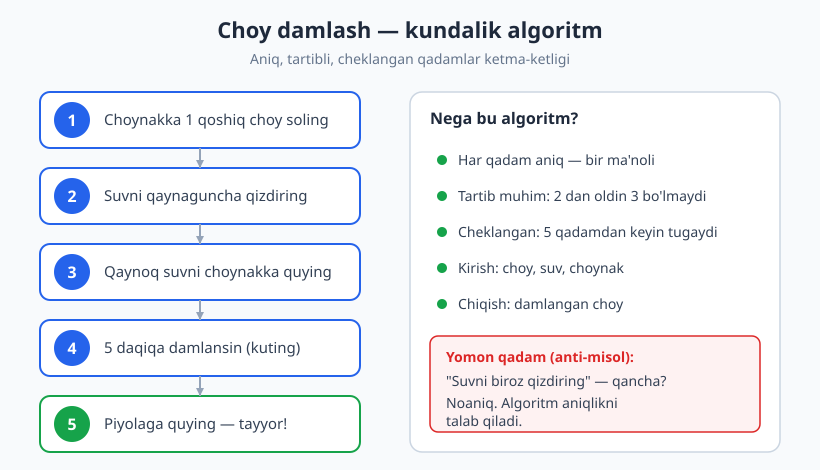
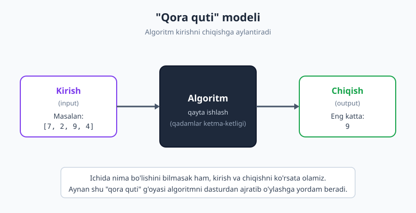
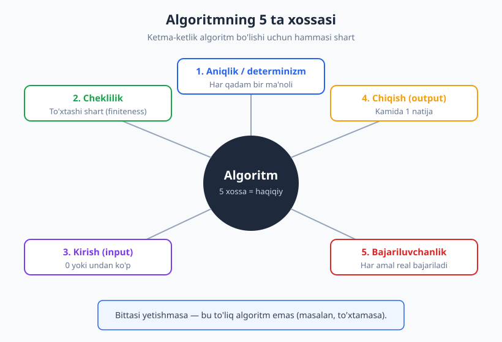

# 01 — Algoritm nima va uning xossalari

[🏠 README](./README.md) · [Keyingi: 02 — Algoritmni tasvirlash: blok-sxema, psevdokod, trassirovka ➡️](./02-tasvirlash-blok-sxema-psevdokod.md)

---

> **Bu bobda:** "Algoritm" so'zi qayerdan kelganini (Muhammad al-Xorazmiy), uning aniq ta'rifini va algoritm bo'lishi uchun zarur bo'lgan **5 ta xossani** o'rganamiz. Algoritm bilan dastur va funksiya farqini ajratamiz, bitta masalaga bir nechta algoritm bo'lishini ko'ramiz va "yaxshi algoritm" nima ekanini muhokama qilamiz.
>
> **Halollik / Eslatma:** Bu bob — kirish bob, shuning uchun matematik isbotlar yo'q; lekin har bir tushuncha misol **va** anti-misol bilan beriladi. Bobdagi barcha Python namunalari haqiqatan ishga tushirib, chiqishi tekshirilgan. "Murakkablik" so'zini bu yerda faqat sezgi darajasida ishlatamiz — uning matematik ta'rifi keyingi qismda ([08-bob](./08-asimptotik-notatsiya.md)).

---

## Algoritm — kompyuterdan ham qadimiy g'oya

Tasavvur qiling, do'stingizdan choy damlab berishini so'radingiz. Lekin u choy damlashni umuman bilmaydi. Siz unga shunday tushuntirasiz:

```text
1. Choynakka 1 qoshiq choy sol.
2. Suvni qaynaguncha qizdir.
3. Qaynoq suvni choynakka quy.
4. 5 daqiqa kutib, damlanishini kut.
5. Piyolaga quy — tayyor.
```

Mana shu — **algoritm**. Siz biror muammoni (choy yo'q) yechish uchun **aniq, tartibli qadamlar ketma-ketligini** berdingiz. Har kim bu qadamlarni ketma-ket bajarsa, natija bir xil bo'ladi: damlangan choy.



E'tibor bering — bu yerda hech qanday kompyuter, hech qanday dasturlash tili yo'q. **Algoritm — bu sintaksis emas, fikr.** Retsept, mashina yig'ish yo'riqnomasi, "uydan ishxonagacha qanday borish" yo'l-yo'rig'i — bularning hammasi algoritm. Kompyuter shunchaki algoritmlarni juda tez va xatosiz bajaradigan mashina, xolos.

### "Algoritm" so'zi qayerdan kelgan?

So'zning o'zi bir buyuk olimning ismidan kelib chiqqan. IX asrda (taxminan 780–850-yillar) yashagan **Muhammad ibn Muso al-Xorazmiy** — Xorazmdan chiqqan matematik, astronom va geograf — Bag'doddagi "Donishmandlik uyi"da ishlagan. U o'nlik sanoq sistemasi va sonlar ustida amallar bajarish qoidalari haqida mashhur asar yozgan.

Keyinchalik bu asar lotinchaga tarjima qilinganda, muallifning nomi lotincha **"Algorithmi"** shaklida yozilgan. Vaqt o'tib, "Algorithmi dixit" ("Al-Xorazmiy aytadi") iborasidagi bu so'z aniq qoidalar bo'yicha hisoblash usulini anglatadigan **"algoritm"** atamasiga aylangan. Ya'ni siz har kuni ishlatadigan bu so'z — bevosita Xorazmlik bobokalonimiz nomidan.

> **Eslatma:** "Algebra" so'zi ham xuddi shu olimning asari nomidan ("al-jabr") kelib chiqqan. Bitta inson ikkita asosiy atamaga nom bergan.

---

## Algoritmning aniq ta'rifi

Endi sezgidan aniqlikka o'tamiz. Rasmiy ta'rif:

> **Algoritm** — bu biror muammoni yechish yoki maqsadga erishish uchun belgilangan, **aniq** (bir ma'noli) va **cheklangan** qadamlar **ketma-ketligi**. U **kirish** ma'lumotlarini (bo'lishi mumkin) qabul qilib, ularni qayta ishlab, **chiqish** (natija) beradi.

Bu ta'rifda har bir so'z muhim:

- **Qadamlar** — kichik, tushunarli amallar.
- **Ketma-ketlik** — tartib bor; qadamlar ma'lum izchillikda bajariladi.
- **Aniq** — har qadam bir ma'noli, hech qanday taxminga o'rin yo'q.
- **Cheklangan** — qadamlar soni cheksiz emas, algoritm bir kun to'xtaydi.
- **Muammoni yechadi** — algoritm bekorga emas, aniq maqsad uchun.

Bu ta'rifning yuragida **"qora quti"** g'oyasi yotadi: algoritmga biror narsa kiritamiz, u ishlaydi va bizga natija qaytaradi. Hatto ichida nima bo'layotganini bilmasak ham, kirish va chiqishni ko'rsata olamiz.



---

## Algoritmning 5 ta xossasi

Endi eng muhim qismga keldik. Har qanday qadamlar ketma-ketligi algoritm bo'la olmaydi. Klassik ta'rifga ko'ra (uni informatika asoschilaridan biri Donald Knut umumlashtirgan), haqiqiy algoritm **5 ta xossaga** ega bo'lishi shart.



Har birini misol **va** anti-misol bilan ko'rib chiqamiz — chunki nimanidir tushunishning eng yaxshi yo'li, u **bo'lmaganda** nima sodir bo'lishini ko'rishdir.

### 1. Aniqlik / determinizm (har qadam bir ma'noli)

Har bir qadam shunchalik aniq bo'lishi kerakki, uni o'qigan ikki kishi (yoki kompyuter) **bir xil** tushunsin va **bir xil** harakat qilsin. Hech qanday "o'zing hal qil", "biroz", "kerak bo'lsa" kabi noaniqlikka o'rin yo'q.

- ✅ **Yaxshi:** "Suvni 100 darajagacha qizdir." — aniq.
- ❌ **Yomon (anti-misol):** "Suvni biroz qizdir." — *biroz* qancha? 40°? 80°? Ikki kishi turlicha tushunadi. Bu noaniq qadam.

Oshpazlik tilida "ta'mga qarab tuz qo'sh" degan ko'rsatma odamga tushunarli, lekin **algoritm uchun yaroqsiz**, chunki "ta'm" o'lchanmagan, har kimda har xil. Algoritm — taxmin emas, aniqlik.

> **Diqqat:** "Determinizm" so'zi shuni anglatadiki, bir xil kirish bilan algoritm har doim bir xil yo'ldan boradi va bir xil natija beradi. (Keyinchalik tasodifiylikdan foydalanadigan algoritmlarni ham ko'rasiz, lekin asosiy holatda determinizm — kuchli talab.)

### 2. Cheklilik (finiteness — to'xtashi shart)

Algoritm **cheklangan sondagi** qadamdan keyin albatta **to'xtashi** kerak. U abadiy ishlab tura olmaydi.

- ✅ **Yaxshi:** "1 dan 100 gacha sonlarni chop et." — 100 qadamdan keyin tugaydi.
- ❌ **Yomon (anti-misol):** "1 dan boshlab to'xtamasdan sonlarni chop etaver." — bu hech qachon tugamaydi. Bu **cheksiz sikl**, va u algoritm emas.

Cheksiz sikl — dasturchilar tez-tez uchratadigan xato. Quyidagi psevdokodga qarang:

```text
x <- 1
takrorla (x > 0 bo'lganda):
    chop et x
    x <- x + 1     # x doim o'sadi -> sharti hech qachon yolg'on bo'lmaydi
```

Bu yerda `x` doim ortib boradi, demak `x > 0` sharti **hech qachon** buzilmaydi. Sikl to'xtamaydi — bu xossa buzilgan. Algoritm har doim "tugash nuqtasi"ga ega bo'lishi kerak.

> **Isbot (eskiz):** Algoritm to'xtashini ko'rsatishning bir yo'li — har bir takrorlanishda nolga yaqinlashayotgan **kamayuvchi kattalikni** topish (masalan, "qolgan elementlar soni"). Agar bu kattalik har qadamda kamaysa va manfiy bo'lolmasa, demak sikl bir kun to'xtaydi. Bu g'oyani [05-bobda](./05-takrorlanuvchi-algoritmlar.md) "sikl invarianti" bilan birga chuqurroq ko'ramiz.

### 3. Kirish (input) — 0 yoki undan ko'p

Algoritm tashqaridan **noldan ko'p ma'lumot** qabul qilishi mumkin. Diqqat: **nolta** kirish ham joiz.

- Ko'p kirishli: "Berilgan sonlar ro'yxatidan eng kattasini top." — kirish: sonlar ro'yxati.
- Nolta kirishli: "Birinchi 10 ta tub sonni chop et." — bu algoritm hech narsa olmaydi, lekin baribir ishlaydi.

Asosiysi — kirish **aniq belgilangan** bo'lishi kerak: qancha va qanday turdagi ma'lumot kutilishi oldindan ma'lum.

### 4. Chiqish (output) — kamida 1 natija

Algoritm **kamida bitta natija** ishlab chiqarishi shart. Hech narsa qaytarmaydigan "algoritm" — befoyda, chunki algoritm maqsadga xizmat qiladi.

- "Eng katta sonni top" → chiqish: bitta son.
- "Ro'yxatni saralash" → chiqish: saralangan ro'yxat.

Chiqish kirishga **bevosita bog'liq** bo'lishi va aniq ta'riflangan bo'lishi kerak: shu kirish uchun qanday natija to'g'ri ekani oldindan ma'lum.

### 5. Samaradorlik / bajariluvchanlik (har amal real bajarilishi mumkin)

Har bir qadam shu darajada **oddiy va aniq** bo'lishi kerakki, uni cheklangan vaqtda, mavjud vositalar bilan **haqiqatan bajarib** bo'lsin. Sehrli yoki imkonsiz amal — algoritm qadami emas.

- ✅ **Yaxshi:** "Ikki sonni qo'sh." — bajariladigan amal.
- ❌ **Yomon (anti-misol):** "Eng baxtli kunni tanla." — "baxt"ni o'lchab bo'lmaydi, bu amal aniq bajarilmaydi.
- ❌ **Yomon:** "Berilgan haqiqiy sonni cheksiz aniqlikda yoz." — cheksiz raqamni yozib bo'lmaydi.

> **Eslatma:** Ba'zi manbalarda bu xossani "bajariluvchanlik" (effectiveness), boshqalarida "elementarlik" deb ataydi. Mohiyat bitta: har qadam sodda, real va aniq ijro etiladigan amal bo'lsin.

### Hammasi birga ishlaydi

Bu 5 xossa alohida emas — birga ishlaydi. Bitta yetishmasa, sizda **to'liq algoritm yo'q**:

| Xossa | Buzilsa nima bo'ladi |
|---|---|
| Aniqlik | Har kim turlicha bajaradi, natija bashorat qilib bo'lmaydi |
| Cheklilik | To'xtamaydi (cheksiz sikl) |
| Kirish | Nima bilan ishlashi noma'lum |
| Chiqish | Natija yo'q — befoyda |
| Bajariluvchanlik | Qadamni umuman bajarib bo'lmaydi |

---

## Algoritm vs dastur vs funksiya

Bu uchta tushuncha tez-tez aralashtiriladi. Ularni aniq ajratamiz:

- **Algoritm — bu g'oya.** Muammoni yechish usulining mavhum, tildan mustaqil tavsifi. Uni qog'ozda, psevdokodda yoki blok-sxemada ifodalash mumkin. Algoritm hech qanday tilga bog'lanmaydi.
- **Dastur — bu kod.** Algoritmni biror **dasturlash tilida** (Python, C, Java...) yozib chiqqaningiz — endi u kompyuter bajara oladigan dastur. Bitta algoritmni Python, JavaScript yoki C da yozsangiz — uchta turli dastur, lekin **bitta algoritm**.
- **Funksiya — bu kodning bo'lagi.** Dastur ichidagi, biror vazifani bajaradigan nomlangan blok. Funksiya ko'pincha bitta algoritmni o'rab turadi, lekin "funksiya" — bu tilning tuzilma birligi, "algoritm" esa g'oya.

```text
G'OYA (algoritm)
   "eng katta sonni topish uchun ro'yxatni bir marta aylanib chiq,
    yo'l-yo'lakay eng kattasini eslab bor"
        |
        | shu g'oyani kodga aylantiramiz
        v
KOD (dastur / funksiya)
   def eng_katta(sonlar): ...   # Python da
   function engKatta(sonlar)... // JavaScript da
```

> **Trade-off:** Aynan shu sabab bu kitob til-mustaqil. Agar siz algoritmni **g'oya** sifatida tushunsangiz, uni istalgan tilda yoza olasiz. Agar faqat bitta tildagi kodni yodlasangiz — boshqa tilga o'tganda yana noldan boshlaysiz. Shuning uchun biz avval g'oyani, keyin kodni o'rganamiz.

---

## Bir masala — ko'p algoritm

Muhim haqiqat: **bitta masalani ko'p xil algoritm bilan yechish mumkin.** "To'g'ri" javob bitta bo'lsa-da, unga borishning bir nechta yo'li bor.

Misol: **sonlar ro'yxatidan eng kattasini topish.**

**1-yo'l — bitta marta aylanib chiqish.** Birinchi sonni "hozircha eng katta" deb olamiz, qolganlarini birma-bir tekshiramiz; agar kattaroq son uchrasa, "eng katta"ni yangilaymiz.

```text
eng <- ro'yxat[0]
har bir x uchun (qolgan elementlar):
    agar x > eng bo'lsa:
        eng <- x
eng ni qaytar
```

**2-yo'l — ro'yxatni saralab, oxirgisini olish.** Avval butun ro'yxatni o'sish tartibida saralaymiz, keyin eng oxirgi (eng katta) elementni olamiz.

```text
ro'yxatni o'sish tartibida sarala
saralangan ro'yxatning oxirgi elementini qaytar
```

Ikkalasi ham **to'g'ri** natija beradi. Lekin ular bir xil emas: birinchi yo'l ro'yxatni faqat **bir marta** aylanib chiqadi, ikkinchisi esa avval **butun ro'yxatni saralaydi** — bu esa ancha ko'proq ish. Kichik ro'yxatda farq sezilmaydi; ammo million elementli ro'yxatda birinchi yo'l sezilarli tez bo'ladi.

Mana shu yerda tabiiy savol tug'iladi: **"Qaysi algoritm yaxshiroq?"** Bu savolga aniq, matematik javob berish — bu butun kitobning markaziy mavzularidan biri. Algoritmlarni qanchalik tez ishlashiga qarab solishtirishni biz **murakkablik tahlili** orqali o'rganamiz ([07-bob](./07-samaradorlik-hisoblash-modeli.md) va [08-bob](./08-asimptotik-notatsiya.md)). Hozircha shuni eslab qoling: *to'g'ri bo'lish — yetarli emas; algoritm yana samarali ham bo'lishi kerak.*

---

## Kichik Python misol: algoritmni kodga aylantirish

G'oyani amalda ko'raylik. Avval psevdokod, keyin uni Python ga aylantiramiz va **haqiqatan ishlatib** tekshiramiz.

### Misol 1 — ikki sonning kattasini topish

Psevdokod:

```text
funksiya kattasi(a, b):
    agar a >= b bo'lsa:
        a ni qaytar
    aks holda:
        b ni qaytar
```

Python da:

```python
def kattasi(a, b):
    if a >= b:
        return a
    else:
        return b

print(kattasi(7, 4))   # -> 7
print(kattasi(3, 9))   # -> 9
```

Diqqat: bu algoritm 5 xossani qanoatlantiradi — har qadam aniq (`a >= b` taqqoslash bir ma'noli), cheklangan (ikkita shart, sikl yo'q), kirishi bor (`a`, `b`), chiqishi bor (bitta son), va har amal real bajariladi.

### Misol 2 — ro'yxatdagi eng katta son (1-yo'l)

Yuqorida muhokama qilgan "bir marta aylanib chiqish" g'oyasini kodga aylantiramiz:

```python
def eng_katta(sonlar):
    eng = sonlar[0]          # birinchisini eng katta deb olamiz
    for x in sonlar[1:]:     # qolganini ko'rib chiqamiz
        if x > eng:
            eng = x
    return eng

print(eng_katta([7, 2, 9, 4]))   # -> 9
print(eng_katta([5]))            # -> 5
print(eng_katta([-3, -8, -1]))   # -> -1
```

Bitta elementli ro'yxatda ham (`[5]`), faqat manfiy sonlarda ham (`[-3, -8, -1]` → `-1`) to'g'ri ishlaydi. Diqqat: agar "eng katta"ni `0` deb boshlaganimizda, manfiy sonlarda xato chiqardi — shuning uchun ro'yxatning **birinchi elementi**dan boshladik. Bu — algoritmni tuzishda muhim mayda detal.

### Misol 3 — ro'yxat yig'indisi (akkumulyator usuli)

Yana bir juda keng tarqalgan naqsh — natijani bo'sh "idish"da to'plab borish (akkumulyator):

```python
def yigindi(sonlar):
    jami = 0
    for x in sonlar:
        jami = jami + x
    return jami

print(yigindi([7, 2, 9, 4]))   # -> 22
print(yigindi([]))             # -> 0
```

Bu yerda **bo'sh ro'yxat** (`[]`) kirishi ham to'g'ri ishlaydi va `0` qaytaradi — bu "0 yoki undan ko'p kirish" xossasining yaxshi misoli.

> **Eslatma:** Yuqoridagi uch namuna ham haqiqatan ishga tushirilib, har bir `# ->` izohidagi chiqish tekshirilgan. Kodni o'zingiz ham ishlatib ko'ring — algoritmni qog'ozda yoki kompyuterda kuzatish, uni o'rganishning eng samarali yo'li.

---

## Trassirovka — algoritmni "qo'lda" bajarish

Algoritm to'g'ri ishlashiga ishonch hosil qilishning eng kuchli usuli — uni **kompyuterga o'xshab, qadamba-qadam o'zingiz bajarish**. Buni **trassirovka** deyiladi: har qadamda o'zgaruvchilar qiymatini jadvalga yozib boramiz.

`eng_katta([7, 2, 9, 4])` ni trassirovka qilamiz. Boshida `eng = 7` (birinchi element), keyin `2, 9, 4` ni birma-bir tekshiramiz:

| Qadam | Ko'rilayotgan `x` | `x > eng` ? | `eng` (qadamdan keyin) |
|---|---|---|---|
| Boshlang'ich | — | — | 7 |
| 1 | 2 | 2 > 7 → yo'q | 7 |
| 2 | 9 | 9 > 7 → ha | 9 |
| 3 | 4 | 4 > 9 → yo'q | 9 |

Sikl tugadi, `eng = 9` qaytariladi — to'g'ri. Mana shu oddiy jadval algoritm xatti-harakatini "ochib" beradi: ko'z bilan ko'rib turibsiz, har qadamda nima o'zgaradi.

Trassirovka — algoritmik fikrlashning eng asosiy ko'nikmasi. Uni va algoritmni boshqacha tasvirlash usullarini (blok-sxema, psevdokod) keyingi bobda batafsil ko'ramiz: [02 — Algoritmni tasvirlash](./02-tasvirlash-blok-sxema-psevdokod.md).

---

## "Yaxshi algoritm" qanaqa bo'ladi?

Algoritm shunchaki "ishlasa" — bu yetarli emas. Yaxshi algoritmni baholashda uchta asosiy mezon bor:

1. **To'g'rilik (correctness).** Eng birinchi va shartsiz talab: algoritm **barcha to'g'ri kirishlar** uchun to'g'ri natija berishi kerak — nafaqat bitta misolda, balki chegaraviy holatlarda ham (bo'sh ro'yxat, bitta element, manfiy sonlar, takrorlanuvchi qiymatlar). Noto'g'ri, lekin tez algoritmdan ko'ra, sekin lekin to'g'risi afzal.
2. **Samaradorlik (efficiency).** Algoritm qancha **vaqt** va qancha **xotira** ishlatadi? Ikkita to'g'ri algoritmdan kamroq resurs sarflaydigani yaxshiroq. Buni o'lchashni bu kitobning II qismida ([07–11-boblar](./08-asimptotik-notatsiya.md)) o'rganamiz.
3. **Soddalik / o'qilishi (simplicity).** Tushunarli, o'qilishi oson va boshqalar (yoki kelajakdagi o'zingiz) qo'llab-quvvatlay oladigan algoritm afzal. Eng murakkab, eng "aqlli" yechim har doim ham eng yaxshisi emas.

> **Trade-off:** Ko'pincha bu uch mezon bir-biriga qarshi turadi. Eng tez algoritm ko'pincha eng murakkabi; eng sodda algoritm esa eng sekini bo'lishi mumkin. Yaxshi muhandis vaziyatga qarab muvozanat topadi. Bu trade-off'larni butun kitob davomida qayta-qayta uchratasiz, eng yorqin esa [33-bob (kapston)](./33-kapston-algoritm-dizayni.md)da.

---

## Asosiy g'oyalar (bobni qisqacha)

- **Algoritm — bu muammoni yechishning aniq, cheklangan qadamlar ketma-ketligi.** U kompyuterga emas, **g'oyaga** tegishli; retsept ham, kod ham algoritm bo'lishi mumkin.
- So'z **al-Xorazmiy** ismidan kelib chiqqan (IX asr); "algebra" ham shu olimning asaridan.
- Haqiqiy algoritmning **5 xossasi**: aniqlik (determinizm), cheklilik (to'xtaydi), kirish (0+), chiqish (1+), bajariluvchanlik (har amal real). Bittasi yetishmasa — to'liq algoritm emas.
- **Algoritm ≠ dastur ≠ funksiya:** algoritm — g'oya, dastur — uning biror tildagi kodi, funksiya — koddagi nomlangan blok.
- **Bitta masalaga ko'p algoritm bor.** "Qaysi yaxshiroq?" savoliga javob — to'g'rilik + samaradorlik + soddalik; samaradorlikni o'lchashni keyingi qismda o'rganamiz.
- **Trassirovka** — algoritmni qadamba-qadam qo'lda bajarish — uni tushunish va to'g'riligini tekshirishning eng kuchli usuli.

---

## Mashqlar

### Oson

**1-mashq.** Quyidagilardan qaysilari algoritm (5 xossani qanoatlantiradi), qaysilari emas? Sababini yozing.
(a) "Eshikni och, ichkariga kir, eshikni yop."
(b) "Yaxshi kayfiyat top va xursand bo'l."
(c) "1 dan boshlab, ortib boruvchi barcha sonlarni to'xtamasdan chop et."

**2-mashq.** Quyidagi algoritm qaysi xossani buzadi?
"Idishga suv sol, qaynaguncha qizdir, qaynamasa boshqatdan boshla." (Faraz qiling, suv hech qachon qaynamaydi.)

**3-mashq.** Mana bu ketma-ketlikni ko'ring va uning **kirishi** nima, **chiqishi** nima ekanini ayting:
"Ikki son `a` va `b` berilgan. Ularning ko'paytmasini hisoblab, natijani chiqar."

### O'rta

**4-mashq.** "Tishni tozalash" jarayonini algoritm sifatida, kamida 5 ta aniq, raqamlangan qadamda yozing. Har qadam aniqlik xossasini qanoatlantirsin (noaniq so'zlardan qoching).

**5-mashq.** Quyidagi anti-misol algoritmni **tuzating**, toki u 5 xossani qanoatlantirsin:
"Bir oz un ol, biroz suv qo'sh, kerakli paytgacha aralashtir, xamir tayyor bo'lsa to'xta."

**6-mashq.** `eng_katta([4, 4, 4])` chaqirilganda yuqoridagi `eng_katta` funksiyasi nima qaytaradi? Trassirovka jadvalini tuzib, javobni ko'rsating.

### Qiyin

**7-mashq.** "Ro'yxatdagi eng **kichik** sonni topish" masalasi uchun **ikkita** har xil algoritm tasvirlang (psevdokod yoki Python). Ikkalasi ham `[5, 2, 8, 1, 9]` da `1` berishini ko'rsating va qaysi biri kamroq ish bajarishini izohlang.

**8-mashq.** Quyidagi algoritm berilgan musbat butun `n` uchun **to'xtaydimi**? Mulohaza yuriting (cheklilikni isbotlash eskizi):
```text
funksiya f(n):
    takrorla (n > 1 bo'lganda):
        agar n juft bo'lsa:  n <- n / 2
        aks holda:           n <- n - 1
    "tugadi" deb chiqar
```

<details markdown="1">
<summary>Yechimlar</summary>

### 1-mashq yechimi
(a) **Algoritm** — aniq, cheklangan (3 qadam), bajariladigan amallar. To'g'ri.
(b) **Algoritm emas** — "yaxshi kayfiyat top" bajariluvchanlik xossasini buzadi: "kayfiyat topish" aniq, real bajariladigan amal emas, va u o'lchanmagan (aniqlik ham yo'q).
(c) **Algoritm emas** — cheklilik xossasini buzadi: "to'xtamasdan" degani hech qachon tugamaydi (cheksiz sikl).

### 2-mashq yechimi
**Cheklilik** xossasini buzadi. Agar suv hech qachon qaynamasa, "qaynamasa boshqatdan boshla" ko'rsatmasi cheksiz takrorlanadi — algoritm to'xtamaydi. To'xtash kafolati bo'lmasa, bu to'liq algoritm emas.

### 3-mashq yechimi
- **Kirish:** ikki son — `a` va `b` (2 ta kirish).
- **Chiqish:** bitta son — ularning ko'paytmasi `a * b`.
Bu algoritm 5 xossani qanoatlantiradi (aniq, cheklangan, kirish bor, chiqish bor, bajariladi).

### 4-mashq yechimi
Mumkin bo'lgan javob (sizniki boshqacha, lekin aniq bo'lishi mumkin):
```text
1. Tish cho'tkasiga 1 sm tish pastasi siq.
2. Cho'tkani suv bilan ho'lla.
3. Yuqori tishlarni 30 sekund tozala.
4. Pastki tishlarni 30 sekund tozala.
5. Og'izni suv bilan chayqa va tupur.
```
Har qadamda aniq miqdor/vaqt ("1 sm", "30 sekund") ko'rsatilgani — aniqlik xossasini ta'minlaydi. "Biroz pasta", "yetarlicha tozala" kabi noaniq iboralar bo'lmasligi kerak.

### 5-mashq yechimi
Noaniqliklarni aniq qiymatlar bilan almashtiramiz va to'xtash shartini aniqlaymiz:
```text
1. 200 gramm un ol.
2. 100 ml suv qo'sh.
3. 5 daqiqa davomida aralashtir.
4. To'xta — xamir tayyor.
```
Endi "bir oz", "biroz", "kerakli paytgacha", "tayyor bo'lsa" kabi noaniq (aniqlik buzilgan) iboralar yo'q; qadamlar soni cheklangan, har biri bir ma'noli va bajariladi.

### 6-mashq yechimi
`eng_katta([4, 4, 4])` → boshida `eng = 4` (birinchi element), keyin qolgan `4, 4` ni tekshiramiz:

| Qadam | `x` | `x > eng` ? | `eng` |
|---|---|---|---|
| Boshlang'ich | — | — | 4 |
| 1 | 4 | 4 > 4 → yo'q | 4 |
| 2 | 4 | 4 > 4 → yo'q | 4 |

Natija: **4**. Diqqat: shart `x > eng` (qat'iy katta) bo'lgani uchun teng qiymatlar `eng`ni o'zgartirmaydi, lekin bu javobga ta'sir qilmaydi — eng katta qiymat baribir `4`.

### 7-mashq yechimi
**1-algoritm — bir marta aylanib chiqish (kamroq ish):**
```python
def eng_kichik(sonlar):
    eng = sonlar[0]
    for x in sonlar[1:]:
        if x < eng:        # endi "kichikroq" ni qidiramiz
            eng = x
    return eng

print(eng_kichik([5, 2, 8, 1, 9]))   # -> 1
```
**2-algoritm — saralab, birinchisini olish (ko'proq ish):**
```python
def eng_kichik_2(sonlar):
    return sorted(sonlar)[0]    # o'sish bo'yicha saralab, birinchi element

print(eng_kichik_2([5, 2, 8, 1, 9]))   # -> 1
```
Ikkalasi ham `1` beradi. **1-algoritm kamroq ish bajaradi:** u ro'yxatni faqat bir marta aylanib chiqadi, 2-algoritm esa avval **butun ro'yxatni saralaydi** — bu eng kichikni topish uchun keraksiz qo'shimcha mehnat. (Ikkala namuna ham ishlatib tekshirildi.)

### 8-mashq yechimi
Ha, **har qanday musbat butun `n` uchun to'xtaydi.** Cheklilikni ko'rsatish g'oyasi — har takrorlanishda **`n` qiymati kamayishi**:
- Agar `n` **juft** bo'lsa, `n <- n / 2` — `n` kamayadi (masalan, 8 → 4).
- Agar `n` **toq** bo'lsa, `n <- n - 1` — `n` yana kamayadi (masalan, 7 → 6).

Har bir qadamda `n` qat'iy kamayadi va musbat butun son sifatida `1`dan pastga tusha olmaydi (sikl `n > 1` da to'xtaydi). Manfiy bo'lolmaydigan, har qadamda kamayadigan kattalik mavjudligi — siklning bir kun (`n = 1` da) to'xtashini kafolatlaydi. Demak, bu algoritm cheklilik xossasini qanoatlantiradi.

Masalan, `n = 6` uchun: `6 → 3 → 2 → 1` (to'xtaydi). `n = 7` uchun: `7 → 6 → 3 → 2 → 1` (to'xtaydi).

> Bu kabi "kamayuvchi kattalik" g'oyasi — siklning to'xtashini isbotlashning klassik usuli; uni [05-bobda](./05-takrorlanuvchi-algoritmlar.md) chuqurroq ko'ramiz.

</details>

---

[🏠 README](./README.md) · [Keyingi: 02 — Algoritmni tasvirlash: blok-sxema, psevdokod, trassirovka ➡️](./02-tasvirlash-blok-sxema-psevdokod.md)
