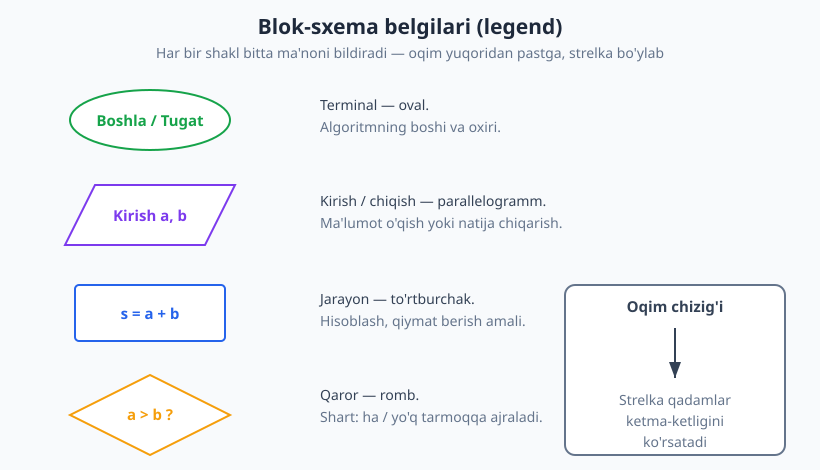
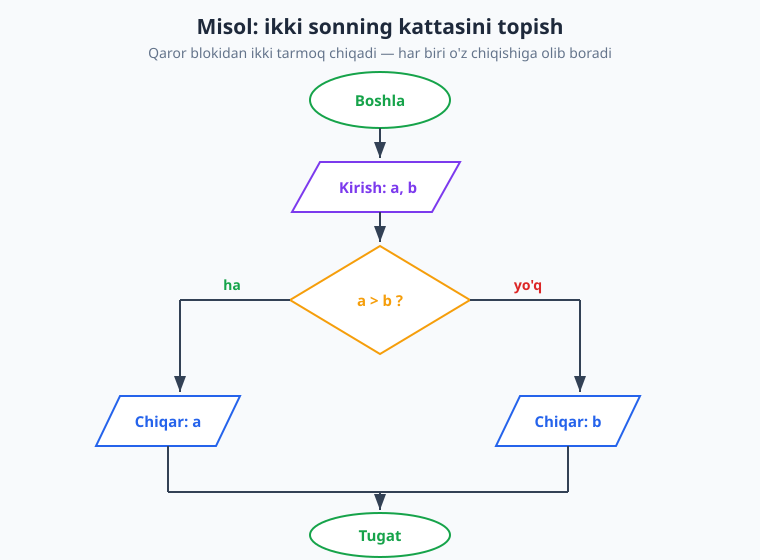
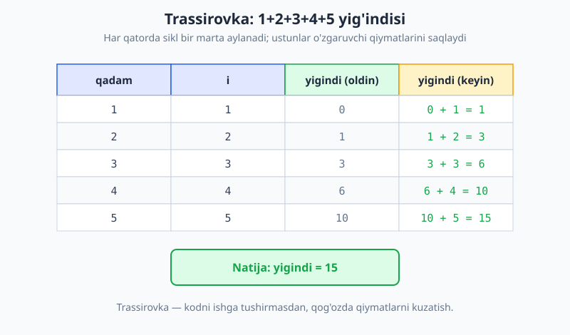

# 02 — Algoritmni tasvirlash: blok-sxema, psevdokod, trassirovka

[⬅️ Oldingi: 01 — Algoritm nima va uning xossalari](./01-algoritm-nima.md) · [🏠 README](./README.md) · [Keyingi: 03 — Chiziqli (ketma-ket) algoritmlar ➡️](./03-chiziqli-algoritmlar.md)

---

> **Bu bobda:** algoritmni *kod yozishdan oldin* qanday tasvirlash — uchta usul orqali: tabiiy til, **blok-sxema** (vizual) va **psevdokod** (yarim-rasmiy). Blok-sxemaning barcha standart belgilarini, psevdokod yozish konventsiyalarini va eng muhimi — **trassirovka**ni (algoritmni qog'ozda qadamba-qadam ishlatish) o'rganamiz. Yo'l-yo'lakay o'zgaruvchi, qiymat berish (`=`) va `x = x + 1` kabi tushunchalarni aniq tushuntiramiz.
>
> **Halollik / Eslatma:** bu bobdagi g'oyalar (belgilar to'plami, psevdokod uslubi) — keng qabul qilingan amaliy konventsiyalar, qat'iy matematik teorema emas; turli kitoblarda belgilar bir oz farq qilishi mumkin. Biz **kitob bo'yicha yagona uslubni** belgilaymiz va oxirigacha shunga amal qilamiz. Barcha Python namunalari haqiqatan ishga tushirib, chiqishi tekshirilgan.

---

## Nega algoritmni "tasvirlash" kerak?

Tasavvur qiling, siz uy qurmoqchisiz. Avval g'isht terib boshlaysizmi? Yo'q — avval **chizma** chizasiz. Chizma sizga butun binoni boshdan-oyoq ko'rishga, xatolarni qog'ozda (g'isht emas, qalam bilan) tuzatishga imkon beradi.

Algoritm ham xuddi shunday. Kod yozish — bu g'isht terish. Lekin **avval fikrni aniq ifodalash** kerak: nima qilamiz, qaysi tartibda, qayerda shart bor, qayerda takrorlash bor. Bu fikrni ifodalash uchun uchta klassik usul bor:

| Usul | Nima | Kuchli tomoni | Kamchiligi |
|---|---|---|---|
| **Tabiiy til** | oddiy gaplar bilan tasvirlash | yozish oson, hamma tushunadi | **noaniq** — bir gap turlicha tushuniladi |
| **Blok-sxema** | shakllar va strelkalar bilan vizual sxema | oqim ko'zga ko'rinadi, mantiq aniq | katta algoritmda chalkash, chizish sekin |
| **Psevdokod** | tilga bog'liq bo'lmagan, deyarli kodga o'xshash matn | aniq, lekin sintaksis tutmaydi | o'qish uchun konventsiyani bilish kerak |

> **Eslatma:** bu uchchala usul **bir-birining o'rnini bosmaydi**, balki to'ldiradi. Boshlovchilar ko'pincha blok-sxemadan boshlaydi (chunki vizual), tajriba ortgach psevdokodga o'tadi (chunki tezroq va kodga yaqin). Bu kitobda **asosan psevdokod** ishlatamiz, lekin muhim joylarda blok-sxema chizamiz.

### Tabiiy tilning muammosi — bir misol

"Ikki sonni ol, kattasini ayt." Bu gap to'g'ridek. Lekin:

- Sonlar teng bo'lsa-chi? Qaysi birini "katta" deymiz?
- "Ol" — qayerdan? Foydalanuvchidanmi, faylmi?
- "Ayt" — ekrangami, qaytaramizmi?

Tabiiy til bu savollarga javob bermaydi — u **noaniq**. Algoritm esa, 1-bobda ko'rganimizdek, **aniq** bo'lishi shart. Shuning uchun bizga aniqroq vositalar kerak.

---

## Blok-sxema (flowchart)

**Blok-sxema** — algoritmni shakllar va ularni bog'lovchi strelkalar orqali vizual tasvirlash. Har bir shakl bitta aniq ma'noni anglatadi. Bu — algoritmlarni o'rganishda eng qadimiy va eng intuitiv vosita.

### Standart belgilar



| Shakl | Nomi | Ma'nosi |
|---|---|---|
| **Oval** | Terminal | Algoritmning **boshi** (`Boshla`) yoki **oxiri** (`Tugat`). |
| **Parallelogramm** | Kirish/chiqish | Ma'lumot **o'qish** (kirish) yoki natija **chiqarish**. |
| **To'rtburchak** | Jarayon | Hisoblash, **qiymat berish** (masalan `s = a + b`). |
| **Romb** | Qaror | **Shart** tekshirish. Ikki tarmoq chiqadi: `ha` va `yo'q`. |
| **Strelka** | Oqim chizig'i | Qadamlarning **ketma-ketligi**, yo'nalishi. |

> **Diqqat:** romb — yagona belgi bo'lib, undan **bir nechta** strelka chiqadi (odatda ikkita: `ha` / `yo'q`). Boshqa barcha bloklardan faqat **bitta** strelka chiqadi. Bu — blok-sxema o'qishning kaliti.

### Blok-sxema qoidalari

1. Har bir blok-sxema **bitta `Boshla`** va kamida bitta **`Tugat`** ovaliga ega.
2. Oqim odatda **yuqoridan pastga** va **chapdan o'ngga** boradi; strelka har doim yo'nalishni ko'rsatadi.
3. Qaror (romb) bloki shartni tekshiradi va `ha`/`yo'q` bo'yicha ikki yo'lga ajraladi; bu yo'llar keyin yana **birlashishi** mumkin.
4. Strelkalar kesishmasligiga harakat qilinadi (chalkashmasligi uchun).

### To'liq misol: ikki sonning kattasini topish

Endi yuqoridagi noaniq "kattasini ayt" masalasini **aniq** blok-sxemaga aylantiramiz:



Blok-sxemani "o'qib" beraylik: `Boshla` → `a` va `b` ni o'qi → `a > b ?` deb so'ra → agar **ha**, `a` ni chiqar; agar **yo'q**, `b` ni chiqar → ikki yo'l birlashadi → `Tugat`.

Diqqat qiling: `a = b` bo'lganda `a > b` **yo'q** bo'ladi, demak `b` chiqadi. Sonlar teng, shuning uchun bu to'g'ri (`a` ham, `b` ham bir xil). Tabiiy tildagi noaniqlik shu yerda **yo'qoldi** — sxema aniq qaror beradi.

> **Eslatma:** blok-sxema ham, psevdokod ham — *bir xil* algoritmning turli "kiyimlari". Algoritm o'zi — fikr; tasvirlash esa shu fikrni qog'ozga tushirishning yo'li.

---

## Psevdokod

**Psevdokod** ("pseudo" — yasama, "kod" — dastur) — bu deyarli kodga o'xshash, lekin **biror dasturlash tiliga bog'liq bo'lmagan** matn. U Python ham, Java ham, C ham emas — u **odam o'qishi uchun** mo'ljallangan. Sintaksis xatosi degan narsa yo'q: muhimi — mantiq aniq bo'lsin.

### Nega psevdokod?

- **Tilga bog'liq emas:** g'oyani bir marta yozasiz, keyin istalgan tilga o'giriladi. Algoritm — fikr, til emas (1-bobni eslang).
- **Tez:** qavslar, nuqta-vergullar, kutubxonalar bilan ovora bo'lmaysiz. Faqat mantiqqa e'tibor.
- **Aniq:** tabiiy tildan ko'ra aniqroq, chunki tuzilma (shart, sikl) ochiq ko'rinadi.

### Bu kitobning psevdokod uslubi

Butun kitob bo'yicha **shu konventsiyalarga** amal qilamiz. Kalit so'zlarni **BOSH HARF** bilan yozamiz, qadamlarni **bir xil chekinish** (indentatsiya) bilan ajratamiz:

```text
ALGORITM kattasini_top(a, b)
    KIRISH: ikki son a va b
    CHIQISH: a va b dan kattasi

    AGAR a > b BO'LSA
        QAYTAR a
    BO'LMASA
        QAYTAR b
```

Asosiy kalit so'zlar:

| Psevdokod | Ma'nosi |
|---|---|
| `KIRISH:` / `CHIQISH:` | algoritm nima oladi va nima qaytaradi |
| `O'QI x` | kirishdan `x` qiymatini ol |
| `CHIQAR x` | `x` natijasini ko'rsat |
| `x = qiymat` | `x` o'zgaruvchiga **qiymat ber** (assignment) |
| `AGAR shart BO'LSA ... BO'LMASA ...` | shartli tarmoqlanish |
| `TAKRORLA ... GACHA` / `HAR i UCHUN ...` | sikl (takrorlash) |
| `QAYTAR x` | natijani qaytar va to'xta |

> **Diqqat:** `=` belgisi psevdokodda (va aksariyat tillarda) **"teng"** emas, **"qiymat ber"** degani. `x = 5` — "x ga 5 ni joyla" deb o'qiladi, "x 5 ga teng" emas. Tenglikni tekshirish uchun matematikada `=`, kodda esa odatda `==` ishlatiladi. Bu farqni quyida batafsil ochamiz.

### Sikl bilan psevdokod misoli

1 dan `n` gacha sonlar yig'indisini hisoblaymiz:

```text
ALGORITM yigindi(n)
    KIRISH: musbat butun son n
    CHIQISH: 1 + 2 + ... + n

    s = 0
    HAR i UCHUN 1 dan n gacha
        s = s + i
    QAYTAR s
```

Mana — atigi to'rt satr, lekin to'liq aniq. Endi ko'ramiz: bu yozuv blok-sxema bilan ham, Python bilan ham bir xil mantiqni ifodalaydi.

---

## Bitta algoritm — to'rt usulda

Algoritmni tasvirlashning eng kuchli darsi: **bir xil g'oya** turli usullarda *bir xil* qoladi. Quyida "ikki sonning kattasi" misolida buni ko'rsatamiz.

**1. Tabiiy til:**

> "Ikki son ber. Agar birinchisi ikkinchisidan katta bo'lsa, birinchisini qaytar; aks holda ikkinchisini qaytar."

**2. Blok-sxema:** yuqoridagi `alg02-blok-sxema-misol.svg` (oval → parallelogramm → romb → ikki chiqish → tugat).

**3. Psevdokod:**

```text
ALGORITM kattasini_top(a, b)
    AGAR a > b BO'LSA
        QAYTAR a
    BO'LMASA
        QAYTAR b
```

**4. Python (haqiqiy, ishlaydigan kod):**

```python
def kattasi(a, b):
    if a > b:
        return a
    else:
        return b

print(kattasi(7, 3))   # -> 7
print(kattasi(2, 9))   # -> 9
print(kattasi(5, 5))   # -> 5
```

Diqqat qiling: psevdokoddagi `AGAR ... BO'LSA` → Python'da `if ...:`, `BO'LMASA` → `else:`, `QAYTAR` → `return`. Bu — **bir-biriga moslik** (correspondence). Psevdokodni o'rgangan odam istalgan tilga o'tira oladi.

> **Eslatma:** Python'ni nega namuna sifatida tanlaymiz? Chunki u psevdokodga eng yaqin: ortiqcha qavs va belgilarsiz, indentatsiya bilan tuzilmani ko'rsatadi. Ammo *g'oya* C'da ham, JavaScript'da ham aynan shu.

---

## O'zgaruvchi va qiymat: yacheyka modeli

Trassirovkani tushunish uchun avval **o'zgaruvchi** nima ekanini aniq tasavvur qilishimiz kerak.

O'zgaruvchini **yorliqli quticha** (yacheyka) deb tasavvur qiling. Quti ichida bitta qiymat turadi, ustida nom (`s`, `i`, `a`...) yozilgan yorlig'i bor:

```text
   ┌───────┐      ┌───────┐      ┌───────┐
s: │   0   │   i: │   1   │   n: │   5   │
   └───────┘      └───────┘      └───────┘
```

**Qiymat berish** (assignment) — qutiga yangi qiymat solish. Eski qiymat **o'chiriladi**, yangisi yoziladi:

```text
x = 10     →   x quticha: [ 10 ]
x = 7      →   x quticha: [ 7  ]   (10 yo'qoldi)
```

### `x = x + 1` nimani anglatadi?

Bu — boshlovchilarni eng ko'p chalkashtiradigan satr. Matematikada `x = x + 1` ma'nosizdek (qaysi son o'ziga bir qo'shsa, o'ziga teng bo'ladi?). Lekin bu **tenglama emas, buyruq**:

> "`x + 1` ni hisobla, natijani **qaytadan `x` qutisiga** sol."

O'ng tomon **avval** hisoblanadi (eski `x` bilan), keyin chap tomonga yoziladi:

```python
x = 10
x = x + 1   # o'ng tomon: 10 + 1 = 11; keyin x quticha: 11
print(x)    # -> 11
```

Demak `=` ni har doim **"chap tomonga, o'ng tomonni hisoblab, joyla"** deb o'qing. Bu — sikllarda sanagichni oshirishning asosi (`i = i + 1`).

> **Trade-off:** ko'p til (Python, C, Java...) `=` ni "qiymat ber" deb ishlatadi va tenglikni `==` bilan tekshiradi. Bu boshlovchiga noqulay tuyuladi, lekin shu tarzda *berish* va *tekshirish* aniq ajraladi. Psevdokodda biz `=` ni berish, `==` yoki "teng" so'zini tekshirish uchun ishlatamiz.

### Almashtirish (swap) — yacheyka modeli amalda

Ikki o'zgaruvchining qiymatini almashtirish — klassik misol. To'g'ridan-to'g'ri `a = b; b = a` qilsak xato bo'ladi (`a` ning eski qiymati yo'qoladi). Shuning uchun vaqtinchalik quti kerak:

```text
vaqt = a       # a ning qiymatini saqla
a = b          # a ga b ni joyla
b = vaqt       # b ga a ning eski qiymatini joyla
```

Python esa buni bir satrda qila oladi (lekin ostida xuddi shu yacheyka mantiqi ishlaydi):

```python
a = 1
b = 2
a, b = b, a
print(a, b)   # -> 2 1
```

---

## Trassirovka (qo'lda ishlatish / dry run)

**Trassirovka** (yoki *dry run* — "quruq yurgizish") — algoritmni **kompyuterda ishga tushirmasdan, qog'ozda yoki boshda** qadamba-qadam bajarish. Har qadamda o'zgaruvchilarning qiymati qanday o'zgarishini jadvalda yozib boramiz.

### Nega trassirovka muhim?

- **Xatoni topish:** kodni ishga tushirmasdan, qayerda noto'g'ri qiymat paydo bo'layotganini ko'rasiz.
- **Tushunish:** algoritm "qora quti" bo'lib qolmaydi — uning *ichida* nima bo'layotganini o'z ko'zingiz bilan kuzatasiz.
- **Imtihon/intervyu:** "bu kod nima chiqaradi?" degan savolga trassirovka aniq javob beradi.

Trassirovkaning oltin qoidasi: **kichik kirish ol** (masalan `n = 5`, `n = 100` emas) va **har bir o'zgaruvchiga ustun** ajrat.

### Trassirovka jadvali: 1 dan 5 gacha yig'indi

Yuqoridagi `yigindi` algoritmini `n = 5` da trassirovka qilamiz. Boshlang'ich holat: `s = 0`. Keyin sikl `i` ni 1 dan 5 gacha aylantiradi va har safar `s = s + i` bajaradi:



Markdown jadval ko'rinishida ham yozamiz (chunki trassirovkani matnda ham qila olish kerak):

| qadam | `i` | `s` (oldin) | amal `s = s + i` | `s` (keyin) |
|---|---|---|---|---|
| 1 | 1 | 0 | 0 + 1 | **1** |
| 2 | 2 | 1 | 1 + 2 | **3** |
| 3 | 3 | 3 | 3 + 3 | **6** |
| 4 | 4 | 6 | 6 + 4 | **10** |
| 5 | 5 | 10 | 10 + 5 | **15** |

Sikl tugagach `s = 15`. Endi buni Python bilan tekshiramiz — javob bir xil chiqishi kerak:

```python
def yigindi(n):
    s = 0
    for i in range(1, n + 1):
        s = s + i
    return s

print(yigindi(5))    # -> 15
print(yigindi(100))  # -> 5050
```

Jadvaldagi oxirgi qator (`15`) Python natijasiga to'liq mos keldi — demak trassirovkamiz to'g'ri. Aynan shu usul bilan, kodni ishga tushirmasdan ham, javobni oldindan bilish mumkin.

> **Eslatma:** `yigindi(100) = 5050` — bu mashhur Gauss yig'indisi. 1 dan `n` gacha yig'indi `n*(n+1)/2` formula bilan ham topiladi: `100 * 101 / 2 = 5050`. Sikl va formula bir xil javob beradi — biri qadamba-qadam, ikkinchisi to'g'ridan-to'g'ri. Sikllar va ularning to'g'riligini [05-bobda](./05-takrorlanuvchi-algoritmlar.md) "sikl invarianti" tushunchasi bilan chuqurroq ko'ramiz.

### O'rtacha qiymat — yana bir trassirovka

Endi `[10, 20, 30]` ro'yxati o'rtachasini hisoblaymiz. Avval yig'indini to'playmiz, keyin elementlar soniga bo'lamiz:

| qadam | element `x` | `s` (oldin) | `s` (keyin) |
|---|---|---|---|
| 1 | 10 | 0 | 10 |
| 2 | 20 | 10 | 30 |
| 3 | 30 | 30 | 60 |

Sikl tugagach `s = 60`, elementlar soni `3`, demak o'rtacha `60 / 3 = 20.0`. Python:

```python
def ortacha(sonlar):
    s = 0
    for x in sonlar:
        s = s + x
    return s / len(sonlar)

print(ortacha([10, 20, 30]))   # -> 20.0
print(ortacha([4, 8]))         # -> 6.0
```

---

## Hammasini bog'lash

Bir algoritm ustida ishlashning tabiiy yo'li:

1. **Tabiiy til** bilan g'oyani qo'pol ifoda et ("kattasini top").
2. **Blok-sxema** yoki **psevdokod** bilan aniqlashtirib, tuzilmani (shart, sikl) ochiq qil.
3. **Trassirovka** bilan kichik kirishda to'g'riligini tekshir (qog'ozda).
4. Faqat shundan keyin — **kod** yoz va kompyuterda ishlat.

Bu tartib bekorga emas: xatoni qancha erta (qog'ozda) topsangiz, shuncha arzon tuzatasiz. Algoritm — bu, 1-bobda aytganimizdek, *fikr*; bu bobda esa shu fikrni qog'ozga aniq tushirishni o'rgandik. [01-bobda](./01-algoritm-nima.md) ko'rgan "aniqlik" xossasi aynan shu yerda — tasvirlashda — namoyon bo'ladi.

---

## Asosiy g'oyalar (bobni qisqacha)

- Algoritmni **kod yozishdan oldin** tasvirlash kerak: bu fikrni aniqlaydi va xatoni qog'ozda (arzon) topishga yordam beradi.
- Uchta usul: **tabiiy til** (oson, lekin noaniq), **blok-sxema** (vizual, oqim ko'rinadi), **psevdokod** (tilga bog'liq emas, kodga yaqin).
- **Blok-sxema belgilari:** oval (terminal), parallelogramm (kirish/chiqish), to'rtburchak (jarayon), romb (qaror — `ha`/`yo'q`), strelka (oqim).
- **Psevdokod** — yagona uslub: `KIRISH/CHIQISH`, `AGAR ... BO'LSA ... BO'LMASA`, `HAR i UCHUN`, `QAYTAR`. Sintaksis emas, mantiq muhim.
- Bir xil algoritm tabiiy til → blok-sxema → psevdokod → kodda **bir xil g'oya**ni saqlaydi (correspondence).
- **O'zgaruvchi** — yorliqli quticha; `=` — "qiymat ber" (tenglik emas). `x = x + 1` = "o'ng tomonni hisobla, chapga joyla".
- **Trassirovka** (dry run) — algoritmni qog'ozda qadamba-qadam ishlatish; har o'zgaruvchiga ustun ajratib, jadvalda qiymatlarni kuzatish. Xato topish va tushunishning eng kuchli vositasi.

---

## Mashqlar

### Oson

**1-mashq.** Quyidagi blok-sxema belgilaridan har birini to'g'ri ma'nosiga ulang: (a) oval, (b) romb, (c) parallelogramm, (d) to'rtburchak. Ma'nolar: jarayon (hisoblash), qaror (shart), terminal (boshla/tugat), kirish/chiqish.

**2-mashq.** Quyidagi psevdokodni o'qing va so'zlar bilan tushuntiring: u nima qiladi?

```text
ALGORITM nima(a, b)
    s = a + b
    CHIQAR s
```

**3-mashq.** Bu Python kodi nima chiqaradi? Ishga tushirmasdan ayting:

```python
x = 4
x = x + 3
x = x * 2
print(x)
```

### O'rta

**4-mashq.** Quyidagi masala uchun blok-sxema **chizishni so'z bilan tasvirlang** (qaysi bloklar, qaysi tartibda, qayerda romb): "Bir son ber. Agar u juft bo'lsa `'juft'`, aks holda `'toq'` deb chiqar." (Juftlik: son 2 ga qoldiqsiz bo'linsa juft.)

**5-mashq.** "Uchta sonning eng kattasini topish" algoritmini **psevdokod** bilan yozing (kitob uslubida: `KIRISH/CHIQISH`, `AGAR ... BO'LSA`). Kirish: `a, b, c`.

**6-mashq.** `yigindi` algoritmini (1 dan `n` gacha) `n = 4` uchun **trassirovka jadvali** bilan to'ldiring. Ustunlar: `qadam`, `i`, `s` (oldin), `s` (keyin). Oxirgi `s` qancha?

### Qiyin

**7-mashq.** Quyidagi algoritmda **xato bor**: u 1 dan `n` gacha yig'indini hisoblashi kerak, lekin har doim noto'g'ri (kichik) javob beradi. Trassirovkani `n = 4` da to'ldiring, xatoni toping va to'g'rilang.

```text
ALGORITM buzuq_yigindi(n)
    HAR i UCHUN 1 dan n gacha
        s = 0
        s = s + i
    QAYTAR s
```

**8-mashq.** Quyidagi Python kodini `[3, 1, 4]` kirishida trassirovka qiling (jadval bilan: `qadam`, `x`, `eng_katta` oldin/keyin). Kod nima qaytaradi? Bu algoritm so'z bilan nima qiladi?

```python
def topshiriq(sonlar):
    eng_katta = sonlar[0]
    for x in sonlar:
        if x > eng_katta:
            eng_katta = x
    return eng_katta
```

<details markdown="1">
<summary>Yechimlar</summary>

### 1-mashq yechimi

- **Oval** → terminal (boshla / tugat).
- **Romb** → qaror (shart tekshirish, `ha`/`yo'q`).
- **Parallelogramm** → kirish / chiqish.
- **To'rtburchak** → jarayon (hisoblash, qiymat berish).

### 2-mashq yechimi

Algoritm ikkita son `a` va `b` ni oladi, ularni qo'shadi (`s = a + b`) va yig'indini chiqaradi. Qisqasi — **ikki sonni qo'shib, natijani ko'rsatadi**. Misol uchun `nima(2, 3)` → `5`.

### 3-mashq yechimi

Qadamba-qadam (yacheyka modeli):

| amal | `x` |
|---|---|
| `x = 4` | 4 |
| `x = x + 3` → `4 + 3` | 7 |
| `x = x * 2` → `7 * 2` | 14 |

Chiqadi: **`14`**. (Har `=` da o'ng tomon avval eski `x` bilan hisoblanadi.)

### 4-mashq yechimi

Bloklar tartibi:

1. **Oval:** `Boshla`.
2. **Parallelogramm:** `Kirish: n`.
3. **Romb (qaror):** `n 2 ga qoldiqsiz bo'linadimi?` (ya'ni `n mod 2 == 0`). Ikki tarmoq chiqadi.
   - **ha** tarmoq → **parallelogramm:** `Chiqar: 'juft'`.
   - **yo'q** tarmoq → **parallelogramm:** `Chiqar: 'toq'`.
4. Ikki tarmoq **birlashadi** → **oval:** `Tugat`.

Psevdokod ko'rinishi (tekshirish uchun):

```text
ALGORITM juft_toq(n)
    AGAR n 2 ga qoldiqsiz bo'linsa BO'LSA
        CHIQAR 'juft'
    BO'LMASA
        CHIQAR 'toq'
```

### 5-mashq yechimi

```text
ALGORITM uchta_eng_katta(a, b, c)
    KIRISH: uch son a, b, c
    CHIQISH: ularning eng kattasi

    eng_katta = a
    AGAR b > eng_katta BO'LSA
        eng_katta = b
    AGAR c > eng_katta BO'LSA
        eng_katta = c
    QAYTAR eng_katta
```

G'oya: avval `a` ni "hozircha eng katta" deb olamiz, keyin `b` va `c` ni unga solishtirib, kerak bo'lsa yangilaymiz. (Boshqa to'g'ri yechimlar ham bor, masalan ichma-ich `AGAR` bilan.)

### 6-mashq yechimi

Boshlang'ich `s = 0`, sikl `i` ni 1 dan 4 gacha aylantiradi:

| qadam | `i` | `s` (oldin) | `s` (keyin) |
|---|---|---|---|
| 1 | 1 | 0 | 1 |
| 2 | 2 | 1 | 3 |
| 3 | 3 | 3 | 6 |
| 4 | 4 | 6 | **10** |

Oxirgi `s = **10**` (ya'ni `1 + 2 + 3 + 4`).

### 7-mashq yechimi

`n = 4` da buzuq versiyani trassirovka qilamiz. Diqqat — `s = 0` sikl **ichida**:

| qadam | `i` | `s` (sikl boshida `s = 0`) | `s = s + i` |
|---|---|---|---|
| 1 | 1 | 0 | 1 |
| 2 | 2 | 0 (yana nolga tushdi!) | 2 |
| 3 | 3 | 0 (yana!) | 3 |
| 4 | 4 | 0 (yana!) | 4 |

`QAYTAR s` → **4** (kerak edi `10`). **Xato:** `s = 0` sikl ichida turibdi, shuning uchun har aylanishda `s` qaytadan nolga tushadi va faqat oxirgi `i` qoladi. **To'g'rilash:** `s = 0` ni sikldan **tashqariga**, boshlanishiga ko'chirish kerak:

```text
ALGORITM yigindi(n)
    s = 0                      # sikldan TASHQARIDA
    HAR i UCHUN 1 dan n gacha
        s = s + i
    QAYTAR s
```

Python bilan to'g'ri versiyani tasdiqlaymiz:

```python
def yigindi_togri(n):
    s = 0
    i = 1
    while i <= n:
        s = s + i
        i = i + 1
    return s

print(yigindi_togri(4))   # -> 10
```

> **Anti-pattern:** akkumulyatorni (`s`) sikl *ichida* boshlang'ich qiymatga tushirib qo'yish — boshlovchilarning eng keng tarqalgan xatosi. Trassirovka uni darrov fosh qiladi.

### 8-mashq yechimi

`sonlar = [3, 1, 4]`. Boshlang'ich `eng_katta = sonlar[0] = 3`. Sikl har elementni `x` deb oladi:

| qadam | `x` | `eng_katta` (oldin) | `x > eng_katta` ? | `eng_katta` (keyin) |
|---|---|---|---|---|
| 1 | 3 | 3 | `3 > 3` → yo'q | 3 |
| 2 | 1 | 3 | `1 > 3` → yo'q | 3 |
| 3 | 4 | 3 | `4 > 3` → ha | **4** |

Qaytaradi: **`4`**. Algoritm — **ro'yxatdagi eng katta elementni topadi**: birinchi elementni "hozircha eng katta" deb oladi, keyin har bir elementni unga solishtirib, kattaroq topilsa yangilaydi. (Bu — 5-mashqdagi g'oyaning ro'yxat uchun umumlashgan ko'rinishi.)

</details>

---

[⬅️ Oldingi: 01 — Algoritm nima va uning xossalari](./01-algoritm-nima.md) · [🏠 README](./README.md) · [Keyingi: 03 — Chiziqli (ketma-ket) algoritmlar ➡️](./03-chiziqli-algoritmlar.md)
