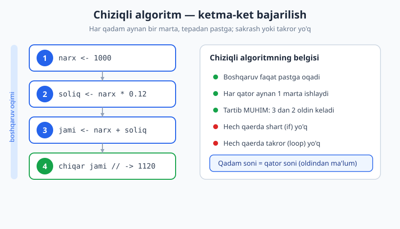
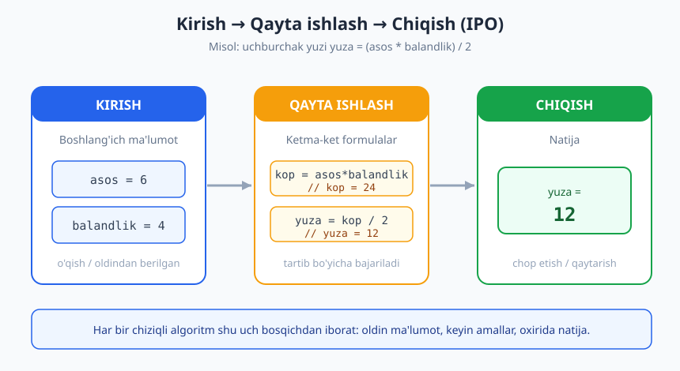
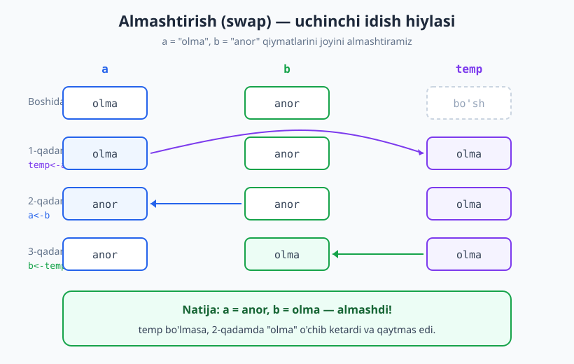

# 03 — Chiziqli (ketma-ket) algoritmlar

[⬅️ Oldingi: 02 — Algoritmni tasvirlash: blok-sxema, psevdokod, trassirovka](./02-tasvirlash-blok-sxema-psevdokod.md) · [🏠 README](./README.md) · [Keyingi: 04 — Tarmoqlanuvchi algoritmlar (shartlar) ➡️](./04-tarmoqlanuvchi-algoritmlar.md)

---

> **Bu bobda:** Eng sodda algoritm strukturasi — **chiziqli (ketma-ket)** algoritm bilan tanishamiz: qadamlar tepadan pastga, bittadan, hech qanday shart yoki takrorsiz bajariladi. **Kirish → qayta ishlash → chiqish (IPO)** modelini, qiymat berish (assignment) mexanikasini chuqur ko'rib chiqamiz, ikki o'zgaruvchini almashtirish (swap) klassik masalasini yechamiz va nega bu yerda **tartib hal qiluvchi** ekanini ko'rsatamiz.
>
> **Halollik / Eslatma:** Bu bobdagi g'oyalar — algoritmikaning eng mustahkam, isbotsiz-ham-aniq qismi (ketma-ketlikning ma'nosi bir ma'noli). Barcha Python namunalari haqiqatan ishga tushirib, chiqishi tekshirilgan. Murakkablik baholari (bu yerda hammasi `O(1)` yoki sobit qadamli) matematik aniq.

---

## Uchta asosiy struktura va biz qayerdamiz

XX asr o'rtalarida (Böhm–Jacopini teoremasi, 1966) isbotlanganki, **har qanday** algoritmni faqat **uchta** boshqaruv strukturasi yordamida qurish mumkin:

1. **Ketma-ketlik (sequence)** — qadamlar birin-ketin. *Bu bob.*
2. **Tanlash (selection)** — shartga qarab yo'l ajraladi. → [04-bob, tarmoqlanuvchi](./04-tarmoqlanuvchi-algoritmlar.md).
3. **Takrorlash (iteration)** — qadamlar qayta-qayta. → [05-bob, takrorlanuvchi](./05-takrorlanuvchi-algoritmlar.md).

Demak biz eng birinchi va eng oddiyidan boshlaymiz. Chiziqli algoritmni puxta tushunmasdan turib shart va sikllarni o'rganib bo'lmaydi, chunki ular ham **ichida** ketma-ket qadamlardan tashkil topadi.

> **Eslatma:** "Chiziqli" so'zi bu yerda *to'g'ri chiziq* ma'nosida — boshqaruv oqimi yuqoridan pastga **bir tomonga** oqadi, hech qaerga sakramaydi. Buni keyinroq murakkablikdagi "chiziqli `O(n)`" tushunchasi bilan adashtirmang: bu butunlay boshqa narsa.

## Chiziqli algoritm nima?

**Chiziqli algoritm** — bu qadamlari **ketma-ket**, yuqoridan pastga, har biri **aynan bir marta** bajariladigan algoritm. Unda:

- hech qanday **shart** yo'q (hech narsa "agar ... bo'lsa" ga bog'liq emas);
- hech qanday **takror** yo'q (hech bir qadam qaytarilmaydi);
- hech qanday **sakrash** yo'q (oldinga yoki orqaga "o'tib ketish" yo'q).

Boshqaruv 1-qadamdan boshlanadi, 2, 3, ... ga o'tadi va oxirgi qadamda tugaydi. Qadam soni **oldindan ma'lum** — u kirish ma'lumotiga umuman bog'liq emas.



Hayotdan misol: bankomatdan pul olishning soddalashtirilgan ko'rinishi — "kartani sol → PIN-kodni ter → summani kirit → pulni ol". To'rt qadam, doim shu tartibda, har biri bir marta. (Haqiqiy bankomatda "PIN noto'g'ri bo'lsa..." degan **shart** bor — o'sha joydan algoritm chiziqli bo'lmay qoladi. Lekin ideal holatda bu chiziqli.)

> **Diqqat:** Chiziqli algoritm — bu "qisqa" yoki "bir qatorli" algoritm degani emas. Unda 100 ta qadam bo'lishi mumkin; muhimi — ular **shartsiz va takrorsiz** birin-ketin kelishi.

## Kirish → qayta ishlash → chiqish (IPO modeli)

Deyarli har bir foydali algoritm uch bosqichdan iborat. Buni **IPO** (Input – Process – Output) modeli deyiladi:

1. **Kirish (Input):** boshlang'ich ma'lumotni olamiz — foydalanuvchidan o'qiymiz yoki oldindan berilgan deb qabul qilamiz.
2. **Qayta ishlash (Process):** ma'lumot ustida amallar bajaramiz — hisoblaymiz, o'zgaruvchilarga qiymat beramiz.
3. **Chiqish (Output):** natijani chop etamiz yoki qaytaramiz.

Chiziqli algoritmda bu uch bosqich ham **ketma-ket** keladi: avval butun kirish, keyin qayta ishlash, oxirida chiqish.



> **Eslatma:** "Kirish" har doim ham klaviaturadan o'qish degani emas. Bizning nazariy misollarimizda kirishni ko'pincha o'zgaruvchiga to'g'ridan-to'g'ri qiymat berib "beramiz" (masalan, `asos = 6`). Algoritmning mantig'i kirish qayerdan kelishidan qat'i nazar bir xil bo'ladi.

## Qiymat berish (assignment) — ichkaridan qarash

Chiziqli algoritmning "atomi" — bu **qiymat berish** amali. Psevdokodda uni odatda `<-` (yoki `:=`), Pythonda esa `=` bilan yozamiz. Lekin uning ishlash tartibini aniq tushunish juda muhim, chunki keyingi swap masalasi aynan shunga tayanadi.

`o'zgaruvchi <- ifoda` ikki bosqichda bajariladi:

1. **Oldin** o'ng tomondagi **ifoda hisoblanadi** (uning hozirgi qiymati topiladi).
2. **Keyin** hosil bo'lgan qiymat chap tomondagi o'zgaruvchiga **yoziladi** (eski qiymat ustiga).

Bu "oldin o'ng, keyin chap" tartibi muhim. Masalan:

```text
x <- 10
x <- x + 5
```

Ikkinchi qatorda avval `x + 5` hisoblanadi: `10 + 5 = 15`. Keyin bu `15` qiymat `x` ga yoziladi. Natijada `x` endi `15`. Bu yerda `x` ham o'ngda (eski qiymat), ham chapda (yangi joy) qatnashdi — bu mutlaqo normal.

> **Diqqat:** `x <- x + 5` matematik tenglik EMAS. Matematikada `x = x + 5` ma'nosiz (`0 = 5`?). Algoritmda esa bu buyruq: "`x` ning hozirgi qiymatiga 5 qo'sh va natijani yana `x` ga saqla". `<-` belgisi tenglik emas, **harakat**.

Endi nega **tartib muhim** ekaniga sodda misol — ikki amalni joyini almashtirsak, natija o'zgaradi:

```text
A varianti:           B varianti:
narx  <- 1000         soliq <- narx * 0.12   <- BU YERDA narx hali yo'q!
soliq <- narx * 0.12  narx  <- 1000
```

`A` da hammasi to'g'ri. `B` da esa birinchi qatorda `narx` hali aniqlanmagan — algoritm xato beradi yoki noto'g'ri ishlaydi. Chiziqli algoritmda **har bir o'zgaruvchi ishlatilishidan oldin qiymat olgan bo'lishi shart**.

## Klassik misollar

Endi bir nechta to'liq chiziqli algoritmni psevdokod, blok-sxema tavsifi va ishlaydigan Python bilan ko'rib chiqamiz.

### Misol 1 — Ikki son yig'indisi va ko'paytmasi

**Psevdokod:**

```text
KIRISH: a, b
yigindi  <- a + b
kopaytma <- a * b
CHIQISH: yigindi, kopaytma
```

**Blok-sxema tavsifi:** Boshlanish ovali → parallelogramm (kirish: a, b) → to'rtburchak (yigindi <- a + b) → to'rtburchak (kopaytma <- a * b) → parallelogramm (chiqish) → tugash ovali. Hech qanday romb (shart) yo'q — to'g'ri chiziq.

```python
a = 7
b = 5
yigindi = a + b
kopaytma = a * b
print(yigindi, kopaytma)  # -> 12 35
```

To'rt qadam, shartsiz va takrorsiz — bu mukammal chiziqli algoritm.

### Misol 2 — Uchburchak yuzi va aylana uzunligi

Geometrik formulalar — chiziqli algoritmlarning eng tabiiy yashash joyi: kirish o'lchovlar, qayta ishlash formula, chiqish natija.

**Psevdokod (uchburchak yuzi):**

```text
KIRISH: asos, balandlik
yuza <- (asos * balandlik) / 2
CHIQISH: yuza
```

```python
asos = 6
balandlik = 4
yuza = (asos * balandlik) / 2
print(yuza)  # -> 12.0
```

**Aylana uzunligi** ham xuddi shunday, faqat `pi` doimiysini ishlatamiz:

```python
import math
radius = 3
uzunlik = 2 * math.pi * radius
print(round(uzunlik, 2))  # -> 18.85
```

> **Eslatma:** `(asos * balandlik) / 2` da qavs shart emas (`*` va `/` baravar ustun, chapdan o'ngga), lekin qavs **niyatni** ravshan qiladi va o'qiganga formula tuzilishini ko'rsatadi. Chiziqli algoritmda aniqlik — fazilat.

### Misol 3 — Temperatura konvertatsiyasi (C → F)

Selsiydan Farengeytga o'tish formulasi: `F = C × 9/5 + 32`. Bu ham toza chiziqli algoritm.

```text
KIRISH: c
f <- c * 9 / 5 + 32
CHIQISH: f
```

```python
c = 25
f = c * 9 / 5 + 32
print(f)  # -> 77.0
```

Bu yerda amallar tartibi (ustunlik) muhim: `c * 9 / 5` avval, keyin `+ 32`. Agar `c * 9 / (5 + 32)` deb yozsangiz, butunlay boshqa (noto'g'ri) natija chiqadi. Algoritmni yozayotganda formulani matematik tartibga to'g'ri ko'chirish ham chiziqli fikrlashning bir qismi.

### Misol 4 — Ikki o'zgaruvchini almashtirish (swap)

Bu — chiziqli algoritmlarning eng mashhur va eng ibratli masalasi. Vazifa: `a` va `b` o'zgaruvchilarining **qiymatlarini joyini almashtirish**.

Soddadek tuyuladi, lekin to'g'ridan-to'g'ri urinish **xato**:

```python
x = "olma"
y = "anor"
x = y       # x endi "anor"
y = x       # y ham "anor" -- "olma" yo'qoldi!
print(x, y)  # -> anor anor
```

Nima bo'ldi? Birinchi qatorda `x` ga `y` ning qiymati (`"anor"`) yozildi — va shu bilan `x` dagi eski qiymat (`"olma"`) **butunlay yo'qoldi**, uni qaytarib bo'lmaydi. Endi ikkinchi qatorda `y <- x` desak, `x` da allaqachon `"anor"` turibdi, demak `y` ham `"anor"` bo'lib qoladi. Natija: ikkalasi ham `"anor"`.

**Yechim — uchinchi (vaqtinchalik) idish.** Xuddi to'la stakandagi suvni va sharbatni almashtirishda uchinchi bo'sh stakan kerak bo'lgani kabi: avval birini bo'shatib olamiz.



**Psevdokod:**

```text
KIRISH: a, b
temp <- a        // a ni vaqtincha saqlab qo'yamiz
a    <- b        // a ga b ni yozamiz (eski a yo'qolsa ham, temp da bor)
b    <- temp     // b ga saqlangan eski a ni yozamiz
CHIQISH: a, b
```

```python
x = "olma"
y = "anor"
temp = x        # temp = "olma"
x = y           # x = "anor"
y = temp        # y = "olma"
print(x, y)  # -> anor olma
```

Mana endi to'g'ri: `x` va `y` haqiqatan o'rin almashdi. Sir — `temp` da yo'qoladigan qiymatni oldindan asrab qolishda.

> **Trade-off:** `temp` qo'shimcha bitta o'zgaruvchi — ya'ni qo'shimcha `O(1)` xotira. Bu chiziqli almashtirish uchun arzimas narx, lekin u tushunarli, to'g'ri va har qanday tilda ishlaydi.

**Pythonda qisqaroq yo'l** — tuple orqali bir yo'la almashtirish:

```python
x = "olma"
y = "anor"
x, y = y, x
print(x, y)  # -> anor olma
```

Bu sehr emas: Python avval o'ng tomonni (`y, x` = `("anor", "olma")`) **butunlay hisoblab oladi**, keyin uni chap tomonga taqsimlaydi. Ya'ni ichida xuddi `temp` kabi vaqtinchalik joy bor — Python uni siz uchun yashirib bajaradi. Mantiq aynan bir xil, sintaksis qisqaroq.

> **Eslatma:** "`a, b = b, a` ichida ham vaqtinchalik joy bor" — bu juda muhim tushuncha. Til bizga qulaylik beradi, lekin **algoritmik g'oya** (eski qiymatni asrab qolish) o'zgarmaydi. Algoritmni o'rganish — sintaksis ortidagi g'oyani ko'rishdir.

### Misol 5 — Uch sonning o'rtachasi

**Psevdokod:**

```text
KIRISH: b1, b2, b3
yigindi <- b1 + b2 + b3
ortacha <- yigindi / 3
CHIQISH: ortacha
```

```python
b1 = 5
b2 = 3
b3 = 4
ortacha = (b1 + b2 + b3) / 3
print(ortacha)  # -> 4.0
```

> **Diqqat:** Bu yerda biz `3` ni qo'lda yozdik, chunki sonlar soni — aynan uchta, **oldindan ma'lum**. Agar sonlar soni oldindan noma'lum bo'lsa (masalan, foydalanuvchi xohlagancha kiritsa), chiziqli algoritm **yetmaydi** — bizga takrorlash (sikl) kerak bo'ladi. Bu bizni keyingi boblarga olib boradi.

## Trassirovka jadvali

Algoritmni "qog'ozda yurgizish" — o'zgaruvchilar qiymatini qadamba-qadam kuzatish — **trassirovka** deyiladi (buni [02-bobda](./02-tasvirlash-blok-sxema-psevdokod.md) batafsil ko'rgandik). Chiziqli algoritmda trassirovka eng oson: jadvalning har qatori — bitta qadam, sakrashsiz tepadan pastga.

Misol 4 dagi to'g'ri swap algoritmini `x = "olma"`, `y = "anor"` kirishida trassirovka qilamiz:

| Qadam | Bajarilgan amal | `x` | `y` | `temp` |
|---|---|---|---|---|
| 0 | (boshlang'ich) | `"olma"` | `"anor"` | — |
| 1 | `temp = x` | `"olma"` | `"anor"` | `"olma"` |
| 2 | `x = y` | `"anor"` | `"anor"` | `"olma"` |
| 3 | `y = temp` | `"anor"` | `"olma"` | `"olma"` |

E'tibor bering: 2-qadamda `x` va `y` **ikkalasi ham** vaqtincha `"anor"` bo'lib qoladi — bu mo'ljallangan oraliq holat, chunki yo'qolayotgan `"olma"` `temp` da xavfsiz turibdi. 3-qadamda uni `y` ga qaytaramiz. Jadval qator-qator pastga tushadi va orqaga qaytmaydi — bu chiziqli algoritmning yorqin belgisi.

> **Isbot (eskiz):** Swap to'g'ri ishlashini ko'rsatish oson. `x` boshida `P` (`"olma"`), `y` boshida `Q` (`"anor"`) bo'lsin. 1-qadamdan keyin `temp = P`. 2-qadamdan keyin `x = Q` (`temp` hali `P`). 3-qadamdan keyin `y = temp = P`. Demak oxirida `x = Q`, `y = P` — qiymatlar haqiqatan almashdi. Bu har qanday `P`, `Q` uchun to'g'ri, chunki biz hech qaerda ularning aniq qiymatiga tayanmadik.

## Chiziqli algoritmning cheklovi — va nega keyingi boblar bor

Chiziqli algoritm faqat **bitta to'g'ri yo'lni** biladi. Uning kuchi — soddaligi; lekin aynan shu soddaligi cheklovga aylanadi:

- **Qaror qabul qila olmaydi.** "Agar son musbat bo'lsa shuni, bo'lmasa buni qil" — buni chiziqli algoritm ifodalay olmaydi. Bunga **shart** (selection) kerak → [04-bob](./04-tarmoqlanuvchi-algoritmlar.md).
- **Takrorlay olmaydi.** "Bu amalni 100 marta yoki noma'lum martagacha qayta qil" — buni ifodalay olmaydi. Bunga **sikl** (iteration) kerak → [05-bob](./05-takrorlanuvchi-algoritmlar.md).
- **Qadam soni qat'iy.** Chiziqli algoritmdagi qadam soni kodning o'zida belgilangan — u kirish hajmiga (masalan, ro'yxat uzunligiga) moslasha olmaydi.

Shu sababdan kuchli algoritmlar deyarli har doim uch strukturani **birlashtiradi**: ketma-ketlik suyagini hosil qiladi, shart bilan tarmoqlar qo'shiladi, sikl bilan takror beriladi. Ammo poydevor — har doim shu bobdagi ketma-ketlik mantiqi. Buni mustahkam o'zlashtirib oling.

## Asosiy g'oyalar (bobni qisqacha)

- **Chiziqli algoritm** — qadamlari yuqoridan pastga, ketma-ket, har biri aynan bir marta bajariladigan, shartsiz va takrorsiz algoritm. Bu uchta asosiy strukturadan birinchisi.
- **IPO modeli:** har bir algoritm odatda **kirish → qayta ishlash → chiqish** bosqichlaridan iborat; chiziqlida bular ham ketma-ket keladi.
- **Qiymat berish** ikki bosqichli: avval o'ng tomondagi ifoda hisoblanadi, keyin u chap o'zgaruvchiga yoziladi. `x = x + 5` — tenglik emas, harakat.
- **Tartib hal qiluvchi:** amallarni joyini almashtirsangiz, ko'pincha natija buziladi; har o'zgaruvchi ishlatilishidan oldin qiymat olishi shart.
- **Swap** uchun vaqtinchalik o'zgaruvchi (yoki Pythonda `a, b = b, a`) kerak; to'g'ridan-to'g'ri `x = y; y = x` qilsangiz, bir qiymat yo'qoladi.
- **Cheklov:** chiziqli algoritm qaror qabul qila olmaydi va takrorlay olmaydi — shuning uchun [shartlar](./04-tarmoqlanuvchi-algoritmlar.md) va [sikllar](./05-takrorlanuvchi-algoritmlar.md) keyingi boblarda.

## Mashqlar

### Oson

**1-mashq.** Tomoni `tomon = 5` bo'lgan kvadratning perimetri (`4 × tomon`) va yuzini (`tomon × tomon`) hisoblaydigan chiziqli algoritmni psevdokodda yozing va Python bilan tekshiring.

**2-mashq.** Ikki son `m = 10`, `n = 20`. Ularning qiymatlarini almashtiruvchi algoritmni yozing (xohlasangiz vaqtinchalik o'zgaruvchi bilan, xohlasangiz Python tuple bilan). Natija `m = 20`, `n = 10` bo'lishi kerak.

### O'rta

**3-mashq.** Do'kon cheki. Mahsulot narxi `narx = 1500`, soni `soni = 3`. Avval oraliq summa (`narx × soni`), keyin unga 10% chegirma, oxirida to'lov summasini (oraliq − chegirma) hisoblang. Uchala qiymatni chiqaring. Bu bir nechta qadamli chiziqli hisob.

**4-mashq.** Omonatga foiz. Boshlang'ich omonat `omonat = 2000`, yillik foiz stavkasi `foiz_stavka = 8` (%). Bir yillik foydani (`omonat × stavka / 100`) va yil oxiridagi yangi summani hisoblang.

### Qiyin

**5-mashq.** Tartibga bog'liq nozik xato. Quyidagi (noto'g'ri) algoritm ikki sonning o'rtachasini hisoblamoqchi, lekin natija xato chiqadi. Nima uchun xato ekanini tushuntiring va tuzating:

```text
KIRISH: a, b
ortacha <- yigindi / 2     // 1-qator
yigindi <- a + b           // 2-qator
CHIQISH: ortacha
```

**6-mashq.** Uchta o'zgaruvchini aylantirish (rotate). `p = 1`, `q = 2`, `r = 3` berilgan. Algoritm shularning qiymatini "siljitsin": `p` ga `r` ning qiymati, `q` ga `p` ning eski qiymati, `r` ga `q` ning eski qiymati o'tsin. Natija `p = 3`, `q = 1`, `r = 2` bo'lishi kerak. Almashtirishdagi g'oyani umumlashtiring va Pythonda tekshiring.

<details markdown="1">
<summary>Yechimlar</summary>

### 1-mashq yechimi

Toza chiziqli algoritm: kirish bitta, ikkita hisob, ikkita chiqish.

```text
KIRISH: tomon
perimetr <- 4 * tomon
yuza     <- tomon * tomon
CHIQISH: perimetr, yuza
```

```python
tomon = 5
perimetr = 4 * tomon
yuza = tomon * tomon
print(perimetr, yuza)  # -> 20 25
```

### 2-mashq yechimi

Eng qisqa yo'l — Python tuple bilan (ichida vaqtinchalik joy yashirin ishlaydi):

```python
m = 10
n = 20
m, n = n, m
print(m, n)  # -> 20 10
```

Vaqtinchalik o'zgaruvchi varianti ham bir xil natija beradi: `temp = m; m = n; n = temp`.

### 3-mashq yechimi

Uch qadamni tartib bilan: oraliq → chegirma → to'lov. Har qadam oldingisining natijasiga tayanadi, shuning uchun tartib muhim.

```python
narx = 1500
soni = 3
oraliq = narx * soni
chegirma = oraliq * 0.10
tolov = oraliq - chegirma
print(oraliq, chegirma, tolov)  # -> 4500 450.0 4050.0
```

Oraliq summa 4500, chegirma 450, to'lov 4050. `chegirma` ni hisoblashdan oldin `oraliq` allaqachon hisoblangan bo'lishi shart — bu chiziqli algoritmdagi qiymat berish tartibining tabiiy talabi.

### 4-mashq yechimi

```python
omonat = 2000
foiz_stavka = 8
foyda = omonat * foiz_stavka / 100
yangi = omonat + foyda
print(foyda, yangi)  # -> 160.0 2160.0
```

Bir yillik foyda 160, yil oxiridagi summa 2160.

### 5-mashq yechimi

**Xato:** 1-qatorda `yigindi` ishlatilyapti, lekin u hali **aniqlanmagan** — unga qiymat faqat 2-qatorda beriladi. Chiziqli algoritmda har o'zgaruvchi **ishlatilishidan oldin** qiymat olgan bo'lishi shart. Bu yerda tartib teskari: hisoblash o'zidan oldingi natijaga tayangan, lekin u natija hali yo'q.

**Tuzatish — ikki qatorni joyini almashtiramiz:**

```text
KIRISH: a, b
yigindi <- a + b           // avval yig'indi
ortacha <- yigindi / 2     // keyin o'rtacha
CHIQISH: ortacha
```

```python
a = 4
b = 6
yigindi = a + b
ortacha = yigindi / 2
print(ortacha)  # -> 5.0
```

Bu mashqning saboqi: chiziqli algoritmda **mantiqiy bog'liqlik tartibni belgilaydi** — "nimani hisoblash uchun avval nima kerak?" degan savol qator tartibini hal qiladi.

### 6-mashq yechimi

Almashtirish g'oyasini umumlashtiramiz: Python o'ng tomonni butunlay hisoblab, keyin chapga taqsimlaganidan foydalanamiz. Bu yerda uchta qiymat bir vaqtda joylashtiriladi, ichida vaqtinchalik joy avtomatik ishlaydi:

```python
p = 1
q = 2
r = 3
p, q, r = r, p, q
print(p, q, r)  # -> 3 1 2
```

Vaqtinchalik o'zgaruvchi bilan qo'lda yozsak, g'oya ko'rinadi: avval bittasini saqlab qolamiz, keyin zanjir bo'ylab siljitamiz.

```text
temp <- r        // r ni saqlab qol
r    <- q        // r ga q
q    <- p        // q ga p
p    <- temp     // p ga saqlangan eski r
```

Bu — ikki o'zgaruvchili swap mantig'ining uchta qiymatga kengaytirilgani: doim "yo'qolayotgan qiymatni oldindan asrab qol".

</details>

---

[⬅️ Oldingi: 02 — Algoritmni tasvirlash: blok-sxema, psevdokod, trassirovka](./02-tasvirlash-blok-sxema-psevdokod.md) · [🏠 README](./README.md) · [Keyingi: 04 — Tarmoqlanuvchi algoritmlar (shartlar) ➡️](./04-tarmoqlanuvchi-algoritmlar.md)
