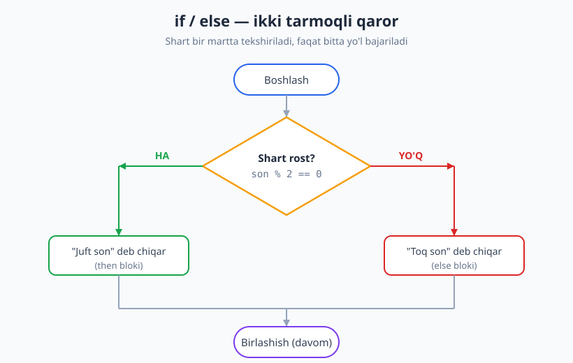
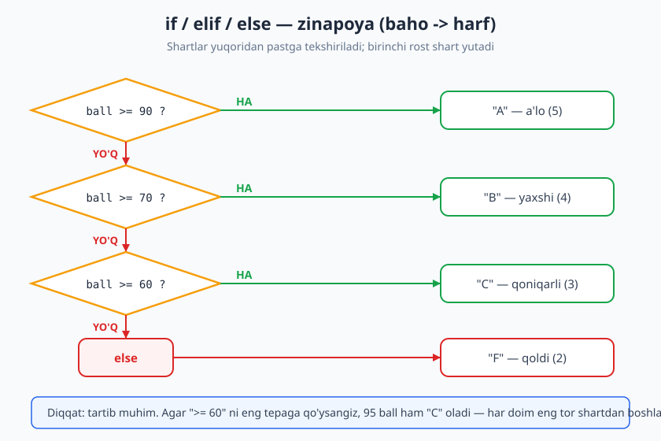
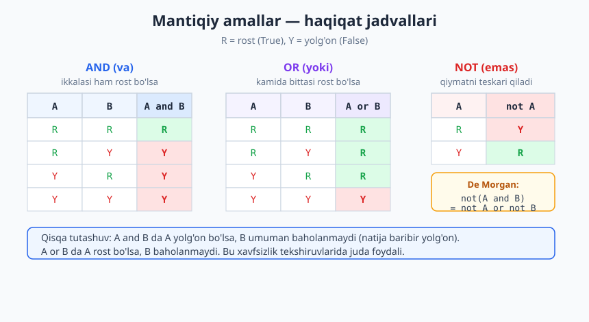

# 04 — Tarmoqlanuvchi algoritmlar (shartlar)

[⬅️ Oldingi: 03 — Chiziqli (ketma-ket) algoritmlar](./03-chiziqli-algoritmlar.md) · [🏠 README](./README.md) · [Keyingi: 05 — Takrorlanuvchi algoritmlar va sikl invarianti ➡️](./05-takrorlanuvchi-algoritmlar.md)

---

> **Bu bobda:** algoritm shartga qarab turli yo'l tanlashini — ya'ni *tarmoqlanish*ni — o'rganamiz. `if`, `if/else`, `if/elif/else`, ichma-ich (nested) shartlar, `match`, mantiqiy amallar (AND/OR/NOT), qisqa tutashuv va De Morgan qoidalari. Klassik misollar: kabisa yili, baho-harf, kvadrat tenglama va boshqalar.
>
> **Halollik / Eslatma:** mantiqiy amallar va haqiqat jadvallari matematik aniq — ular Bul algebrasiga (Boolean algebra) tayanadi. De Morgan qoidalari isbotlangan teoremalar. Barcha Python namunalari haqiqatan ishga tushirilib, chiqishi tekshirilgan.

---

## Tarmoqlanish nima

[Oldingi bobda](./03-chiziqli-algoritmlar.md) ko'rgan chiziqli algoritmda qadamlar har doim bir xil tartibda, birinchidan oxirigacha bajariladi — hech qanday tanlov yo'q. Lekin haqiqiy hayotda biz doimo qaror qabul qilamiz: "Agar tashqarida yomg'ir yog'ayotgan **bo'lsa**, soyabon olaman, **aks holda** olmayman."

Algoritmda ham xuddi shunday. **Tarmoqlanish** — bu algoritmning bir nuqtaga kelib, biror shartni tekshirib, natijaga qarab turli yo'llardan birini tanlashi. Bu — dasturlashning ikkinchi asosiy strukturasi (birinchisi — ketma-ketlik, uchinchisi — keyingi bobdagi takrorlash).

Intuitsiya: yo'l ikkiga ayrilgan chorrahani tasavvur qiling. Yo'lboshida bir savol bor ("Yo'l ho'lmi?"). Javobga qarab chapga yoki o'ngga burilasiz. Ikkala yo'l keyin yana birlashadi va sayohat davom etadi.

Ikkita asosiy struktura mavjud:

1. **Yagona tarmoq (`if`):** shart rost bo'lsa, biror amalni bajar; aks holda hech narsa qilmay o'tib ket.
2. **Ikki tarmoq (`if/else`):** shart rost bo'lsa A amalni, yolg'on bo'lsa B amalni bajar.



## Shart — boolean (mantiqiy) ifoda

Tarmoqlanishning "yuragi" — bu **shart**. Shart — bu natijasi faqat ikki qiymatdan biri bo'ladigan ifoda: **rost** (`True`) yoki **yolg'on** (`False`). Bunday qiymat **boolean** (mantiqiy) qiymat deyiladi.

Eng ko'p ishlatiladigan shartlar — **taqqoslash amallari**:

| Amal | Ma'nosi | Misol | Natija |
|------|---------|-------|--------|
| `>`  | katta | `5 > 3` | `True` |
| `<`  | kichik | `5 < 3` | `False` |
| `>=` | katta yoki teng | `5 >= 5` | `True` |
| `<=` | kichik yoki teng | `4 <= 3` | `False` |
| `==` | teng (taqqoslash) | `5 == 5` | `True` |
| `!=` | teng emas | `5 != 3` | `True` |

> **Diqqat:** `==` (ikkita teng belgisi) — bu **taqqoslash** (tengmi?), `=` (bitta) — bu **o'zlashtirish** (qiymat berish). Bu ikkisini chalkashtirish — boshlovchilarning eng keng tarqalgan xatosi. Bu haqda quyida alohida to'xtalamiz.

Psevdokodda tarmoqlanishni shunday yozamiz:

```text
AGAR shart ROST bo'lsa:
    A amalni bajar
AKS HOLDA:
    B amalni bajar
```

## `if` — yagona tarmoq

Eng oddiy holat: amal faqat shart rost bo'lganda bajariladi. Yolg'on bo'lsa, hech narsa qilinmaydi.

```python
harorat = 35
if harorat > 30:
    print("Bugun issiq, suv iching!")
# -> Bugun issiq, suv iching!
```

Agar `harorat` 20 bo'lsa, shart yolg'on bo'lib, `print` umuman ishlamaydi va dastur shartdan keyin davom etadi. Bu — bir tarmoqli qaror: "yo qil, yo o'tib ket".

## `if/else` — ikki tarmoq

Ko'pincha "rost bo'lsa shuni, bo'lmasa boshqani" deyish kerak. Bu yerda `else` (aks holda) bloki ishlatiladi.

```python
def juft_toq(n):
    if n % 2 == 0:     # 2 ga bo'lib qoldiq nolmi?
        return "juft"
    else:
        return "toq"

print(juft_toq(10))   # -> juft
print(juft_toq(7))    # -> toq
```

Bu yerda `%` — **modul** (qoldiqli bo'lish) amali: `10 % 2` nolga teng (qoldiqsiz bo'linadi), demak juft. `7 % 2` esa 1 ga teng, demak toq. Yuqoridagi blok-sxema aynan shu misolni tasvirlaydi.

> **Eslatma:** `if/else` da har doim **aniq bittasi** bajariladi — ikkalasi ham emas, hech biri ham emas. Bu kafolatlangan, chunki shart yo rost, yo yolg'on bo'ladi (uchinchi imkoniyat yo'q).

## `if/elif/else` — ko'p tarmoq (zinapoya)

Ba'zan ikki emas, bir nechta variantdan birini tanlash kerak. Masalan, ball bo'yicha harf bahosi qo'yish. Bunda `elif` (else if — "aks holda agar") ishlatiladi. Bu — zinapoyaga o'xshaydi: shartlar yuqoridan pastga ketma-ket tekshiriladi.

```python
def baho_harf(ball):
    if ball >= 90:
        return "A"
    elif ball >= 70:
        return "B"
    elif ball >= 60:
        return "C"
    else:
        return "F"

print(baho_harf(95))  # -> A
print(baho_harf(72))  # -> B
print(baho_harf(60))  # -> C
print(baho_harf(40))  # -> F
```



**Eng muhim qoida — tartib.** Shartlar tepadan tekshiriladi va **birinchi rost bo'lgan shart yutadi**; qolganlari umuman ko'rilmaydi. Shuning uchun shartlar **eng toridan eng kengiga** tartiblanishi kerak.

> **Anti-pattern:** agar `ball >= 60` ni eng tepaga qo'ysangiz, 95 ball ham birinchi bo'lib shu shartni qondiradi va "C" oladi — chunki keyingi `elif`larga umuman yetib bormaydi. Klassik xato. Quyida buni alohida ko'ramiz.

## Ichma-ich (nested) shartlar

Shart ichida yana shart bo'lishi mumkin. Bunga **ichma-ich** (nested) tarmoqlanish deyiladi. Uch sonning eng kattasini topaylik:

```python
def uch_kattasi(a, b, c):
    if a >= b:
        if a >= c:
            return a
        else:
            return c
    else:
        if b >= c:
            return b
        else:
            return c

print(uch_kattasi(3, 9, 5))   # -> 9
```

Mantiq: avval `a` va `b` ni solishtiramiz. Agar `a` katta bo'lsa, yana `a` va `c` ni solishtiramiz — shunday qilib g'olibni topamiz. Bu daraxtsimon mantiq: har bir "ha/yo'q" yangi ikki shoxchaga olib boradi.

> **Trade-off:** ichma-ich shartlar chuqurlashgani sayin kodni o'qish qiyinlashadi. Ko'pincha ularni mantiqiy amallar bilan tekislash (flatten) mumkin. Masalan, yuqoridagini `max(a, b, c)` yoki bitta `if a >= b and a >= c:` bilan yozsa, ancha tiniq bo'ladi.

## `match` — ko'p qiymatli tanlash (qisqacha)

Agar bitta o'zgaruvchini bir nechta aniq qiymat bilan solishtirish kerak bo'lsa, `match` (boshqa tillarda `switch`) qulay. Python'da `match` 3.10 versiyadan beri mavjud:

```python
def hafta_kuni(n):
    match n:
        case 1:
            return "dushanba"
        case 6 | 7:        # 6 YOKI 7
            return "dam olish"
        case _:            # qolgan barcha holatlar (else)
            return "ish kuni"

print(hafta_kuni(1))   # -> dushanba
print(hafta_kuni(6))   # -> dam olish
print(hafta_kuni(3))   # -> ish kuni
```

`case _` — bu "boshqa har qanday qiymat" degani, ya'ni `else` ning ekvivalenti. `match` ko'p `elif`li zinapoyani toza ko'rinishga keltiradi, lekin uni faqat **diapazon emas, aniq qiymatlar** bilan ishlatish qulay.

## Mantiqiy amallar: AND, OR, NOT

Ko'pincha bitta emas, bir nechta shartni birlashtirish kerak: "yoshi 18 dan katta **VA** chiptasi bor bo'lsa". Buning uchun **mantiqiy amallar** ishlatiladi.

- **AND (`and`, "va"):** ikkala tomon ham rost bo'lsagina natija rost.
- **OR (`or`, "yoki"):** kamida bittasi rost bo'lsa natija rost.
- **NOT (`not`, "emas"):** qiymatni teskari qiladi (rost -> yolg'on, yolg'on -> rost).

Ularning xatti-harakatini **haqiqat jadvali** (truth table) to'liq tasvirlaydi:



Murakkab shartga misol:

```python
def kirish(yosh, chipta_bor):
    if yosh >= 18 and chipta_bor:
        return "ruxsat"
    else:
        return "rad"

print(kirish(20, True))    # -> ruxsat
print(kirish(15, True))    # -> rad
print(kirish(20, False))   # -> rad
```

### Qisqa tutashuv (short-circuit) baholash

Python (va aksariyat tillar) mantiqiy ifodani **dangasa** baholaydi: natija allaqachon ma'lum bo'lib qolsa, qolgan qismni umuman hisoblamaydi.

- `A and B` — agar `A` yolg'on bo'lsa, natija baribir yolg'on, shuning uchun `B` **tekshirilmaydi**.
- `A or B` — agar `A` rost bo'lsa, natija baribir rost, shuning uchun `B` **tekshirilmaydi**.

Buni yon ta'sir (log) orqali ko'rsatamiz:

```python
log = []
def tekshir(x):
    log.append(x)   # chaqirilganini yozib qo'yamiz
    return x

natija = tekshir(False) and tekshir(True)
print(natija, log)   # -> False [False]
```

`log` faqat `[False]` — ikkinchi `tekshir(True)` umuman chaqirilmadi, chunki birinchi tomon yolg'on edi.

> **Eslatma:** qisqa tutashuv shunchaki tezlik uchun emas — u **xavfsizlik** uchun ham muhim. Masalan `if x != 0 and y / x > 2:` da, agar `x` nol bo'lsa, birinchi shart yolg'on bo'lib, `y / x` umuman hisoblanmaydi — nolga bo'lish xatosidan saqlanamiz. Shart tartibini almashtirsangiz, xato yuzaga keladi.

## De Morgan qoidalari — shartni soddalashtirish

Mantiqiy ifodalarni teng kuchli, ammo soddaroq shaklga keltirish ko'pincha foydali. **De Morgan qoidalari** inkorni (NOT) qavs ichiga "tarqatish"ning aniq usulini beradi:

```text
not (A and B)  =  (not A) or  (not B)
not (A or  B)  =  (not A) and (not B)
```

So'z bilan: "ikkalasi ham emas" = "biri emas yoki ikkinchisi emas". Inkor qavsga kirsa, `and` `or` ga, `or` esa `and` ga aylanadi.

Bu nafaqat go'zal, balki amaliy. Masalan, "foydalanuvchi admin **emas** VA tahrirlovchi **emas**" degan shartni:

```python
# Chigal:
if not (rol == "admin" or rol == "muharrir"):
    print("ruxsat yo'q")

# De Morgan bilan sodda va tabiiy:
if rol != "admin" and rol != "muharrir":
    print("ruxsat yo'q")
```

> **Isbot (eskiz):** De Morgan qoidasini barcha (A, B) kombinatsiyalarini sanab chiqib (truth table orqali) isbotlash mumkin — atigi 4 ta holat bor. Har birida chap va o'ng tomon bir xil qiymat chiqsa, qoida to'g'ri. Biz buni dastur bilan ham tekshirib ko'rdik: barcha 4 holatda ikki tomon teng.

## Klassik misollar

### 1. Ikki sonning kattasi

```python
def kattasi(a, b):
    if a > b:
        return a
    else:
        return b

print(kattasi(7, 3))   # -> 7
print(kattasi(2, 9))   # -> 9
```

### 2. Juft / toq

Yuqorida ko'rdik — `n % 2 == 0` rost bo'lsa juft. Bu bitta shartli klassik tekshiruv.

### 3. Kabisa yili (leap year) — murakkab shart

Kabisa yili — bu fevralda 29 kun bo'ladigan yil. Grigorian kalendar qoidasi: yil **4 ga bo'linadi**, **AMMO** 100 ga bo'linsa kabisa emas, **agar** 400 ga ham bo'linsa, baribir kabisa. Bu uchta shartni mantiqiy amallar bilan birlashtirishni talab qiladi:

```python
def kabisa(yil):
    return yil % 4 == 0 and (yil % 100 != 0 or yil % 400 == 0)

print(kabisa(2000))   # -> True   (400 ga bo'linadi)
print(kabisa(1900))   # -> False  (100 ga bo'linadi, 400 ga emas)
print(kabisa(2024))   # -> True   (4 ga bo'linadi, 100 ga emas)
print(kabisa(2023))   # -> False  (4 ga bo'linmaydi)
```

Qavslar muhim: `4 ga bo'linadi VA (100 ga bo'linmaydi YOKI 400 ga bo'linadi)`. Qavssiz mantiq buziladi, chunki `and` `or` dan oldin baholanadi (ustuvorlik).

### 4. Baho -> harf

Yuqorida `baho_harf` da ko'rdik — `if/elif` zinapoyasining namunaviy qo'llanilishi.

### 5. Uchburchak turi va kvadrat tenglama

**Uchburchak turi.** Tomon uzunliklariga qarab turini aniqlaymiz:

```python
def uchburchak_turi(a, b, c):
    if a == b == c:
        return "teng tomonli"
    elif a == b or b == c or a == c:
        return "teng yonli"
    else:
        return "turli tomonli"

print(uchburchak_turi(5, 5, 5))   # -> teng tomonli
print(uchburchak_turi(5, 5, 8))   # -> teng yonli
print(uchburchak_turi(3, 4, 5))   # -> turli tomonli
```

`a == b == c` — Python'da zanjirli taqqoslash: "uchchalasi teng" degani. Tartib muhim: avval eng tor shart (uchchasi teng) tekshiriladi, keyin kengrog'i (ikkitasi teng).

**Kvadrat tenglama ildizlari.** `a*x^2 + b*x + c = 0` tenglamasini diskriminant `D = b^2 - 4ac` orqali yechamiz: `D > 0` bo'lsa ikki ildiz, `D == 0` bo'lsa bitta, `D < 0` bo'lsa haqiqiy ildiz yo'q.

```python
import math

def kvadrat_ildiz(a, b, c):
    if a == 0:
        return "chiziqli, kvadrat emas"
    d = b*b - 4*a*c
    if d > 0:
        x1 = (-b + math.sqrt(d)) / (2*a)
        x2 = (-b - math.sqrt(d)) / (2*a)
        return (x1, x2)
    elif d == 0:
        return (-b / (2*a),)
    else:
        return "haqiqiy ildiz yo'q"

print(kvadrat_ildiz(1, -5, 6))   # -> (3.0, 2.0)
print(kvadrat_ildiz(1, -4, 4))   # -> (2.0,)
print(kvadrat_ildiz(1, 0, 1))    # -> haqiqiy ildiz yo'q
```

Diqqat: birinchi `a == 0` tekshiruvi muhim — aks holda `2*a` ga bo'lishda nolga bo'lish xatosi chiqadi. Bu — **chegaraviy holat**ni oldindan ushlash.

## Keng tarqalgan xatolar

**1. `=` va `==` chalkashligi.** `if x = 5:` — bu xato (Python buni sintaktik xato deb rad etadi, bu omadli holat). Ko'p tillarda esa `if (x = 5)` bemalol kompilyatsiya bo'lib, har doim rost beradi va topish qiyin xatoga aylanadi. Doim taqqoslashda `==` ishlating.

**2. Zinapoyada shart tartibi.** `elif` zinapoyasida shartlar **eng tor**dan **eng keng**ga bo'lishi shart:

```python
# NOTO'G'RI: kengroq shart tepada
def yomon_baho(ball):
    if ball >= 60:
        return "C"      # 95 ham shu yerda qoladi!
    elif ball >= 90:
        return "A"      # bu yerga hech qachon yetib kelmaydi
    else:
        return "F"

print(yomon_baho(95))   # -> C  (xato! "A" bo'lishi kerak edi)
```

`ball >= 60` shart 95 uchun ham rost, shuning uchun u birinchi yutadi va "C" qaytaradi. `>= 90` shartiga umuman yetib borilmaydi. To'g'ri yechim — eng yuqori chegaradan boshlash (`baho_harf` misolidagidek).

**3. Chegaraviy (boundary) xatolar: `>=` va `>`.** Chegara qiymatining o'zi qaysi tarmoqqa tushishi ko'pincha e'tibordan chetda qoladi:

```python
def chegirma(summa):
    if summa >= 100:     # AYNAN 100 ham chegirma oladi
        return "chegirma bor"
    else:
        return "chegirma yo'q"

print(chegirma(100))   # -> chegirma bor
print(chegirma(99))    # -> chegirma yo'q
```

Agar shart `summa > 100` bo'lsa, aynan 100 chegirma olmaydi. Bitta belgi (`>` yoki `>=`) butun mantiqni o'zgartiradi. Shart yozayotganda doim "chegaradagi qiymatning o'zi qaysi tomonga tegishli?" deb so'rang.

## Trassirovka jadvali

Kichik bir misolni qadamba-qadam "qo'lda" kuzatish — algoritmni tushunishning eng ishonchli usuli. `belgi(x)` funksiyasi sonni "musbat / nol / manfiy" deb tasniflaydi:

```python
def belgi(x):
    if x > 0:
        return "musbat"
    elif x == 0:
        return "nol"
    else:
        return "manfiy"
```

Uch xil kirish uchun trassirovka:

| `x` | `x > 0` ? | `x == 0` ? | bajarilgan tarmoq | natija |
|-----|-----------|------------|-------------------|--------|
| 5   | rost      | (tekshirilmaydi) | birinchi `if` | `"musbat"` |
| 0   | yolg'on   | rost       | `elif`            | `"nol"` |
| -3  | yolg'on   | yolg'on    | `else`            | `"manfiy"` |

E'tibor bering: `x = 5` da `x == 0` shart **umuman tekshirilmaydi** — birinchi tarmoq yutgach, zinapoyaning qolgani tashlab ketiladi. Bu — `if/elif/else` ning "birinchi rost yutadi" qoidasining bevosita namoyishi.

## Asosiy g'oyalar (bobni qisqacha)

- **Tarmoqlanish** — algoritmning shartga qarab turli yo'l tanlashi; ketma-ketlikdan keyingi ikkinchi asosiy struktura.
- **Shart** — natijasi rost/yolg'on bo'lgan boolean ifoda; taqqoslash amallari (`>`, `<`, `==`, `!=`, `>=`, `<=`) bilan quriladi.
- `if` — yagona tarmoq; `if/else` — aniq bittasi bajariladigan ikki tarmoq; `if/elif/else` — zinapoya, **birinchi rost shart yutadi**.
- **Tartib muhim:** zinapoyada shartlarni eng tordan eng kengga joylashtiring, aks holda mantiq buziladi.
- **AND/OR/NOT** murakkab shartlarni quradi; haqiqat jadvali ularning xatti-harakatini to'liq belgilaydi.
- **Qisqa tutashuv:** natija ma'lum bo'lsa, ifodaning qolgani baholanmaydi — tezlik va xavfsizlik beradi (masalan nolga bo'lishdan himoya).
- **De Morgan:** `not(A and B) = not A or not B` — shartni soddalashtirishning isbotlangan qoidasi.
- Eng ko'p uchraydigan xatolar: `=` vs `==`, zinapoyada noto'g'ri tartib, chegaraviy `>=` vs `>` adashishi.

## Mashqlar

### Oson

**1-mashq.** Berilgan butun son juft yoki toqligini aniqlaydigan funksiya yozing va `4`, `7` uchun sinab ko'ring.

**2-mashq.** Ikki sonni qabul qilib, kattasini qaytaradigan funksiya yozing. Sonlar teng bo'lsa, ulardan birini qaytaring.

### O'rta

**3-mashq.** Berilgan yil kabisa yili ekanligini aniqlaydigan funksiya yozing. `2000`, `1900`, `2024`, `2023` uchun tekshiring.

**4-mashq.** Ball (0–100) ni qabul qilib, harf bahosini qaytaring: 90+ "A", 75+ "B", 60+ "C", aks holda "F". Zinapoya tartibiga e'tibor bering.

**5-mashq.** Uchta sonning eng kattasini topadigan funksiya yozing — bir marta ichma-ich `if` bilan, bir marta `and` ishlatib bitta shart bilan.

### Qiyin

**6-mashq.** Kvadrat tenglama `a*x^2 + b*x + c = 0` ning barcha holatlarini to'g'ri qayta ishlaydigan funksiya yozing: `a == 0` (kvadrat emas), `D > 0`, `D == 0`, `D < 0`. Har bir holatga mos natija qaytaring.

**7-mashq.** Quyidagi shartni De Morgan qoidasi bilan inkorsiz (qavs ichida `not` bo'lmagan) shaklga keltiring va Python'da ikkala variant bir xil natija berishini barcha kombinatsiyalarda tekshiring:
`not (x > 0 and y > 0)`.

**8-mashq.** Quyidagi funksiyada chegaraviy xato bor. Uni toping va tuzating. Maqsad: 18 yosh va undan kattalar "katta", aks holda "kichik".
```python
def yosh_turi(yosh):
    if yosh > 18:
        return "katta"
    else:
        return "kichik"
```

<details markdown="1">
<summary>Yechimlar</summary>

### 1-mashq yechimi

```python
def juft_toq(n):
    if n % 2 == 0:
        return "juft"
    else:
        return "toq"

print(juft_toq(4))   # -> juft
print(juft_toq(7))   # -> toq
```

### 2-mashq yechimi

```python
def kattasi(a, b):
    if a >= b:     # teng bo'lsa a qaytadi
        return a
    else:
        return b

print(kattasi(7, 3))   # -> 7
print(kattasi(5, 5))   # -> 5
```

### 3-mashq yechimi

```python
def kabisa(yil):
    return yil % 4 == 0 and (yil % 100 != 0 or yil % 400 == 0)

print(kabisa(2000))  # -> True
print(kabisa(1900))  # -> False
print(kabisa(2024))  # -> True
print(kabisa(2023))  # -> False
```
Qavs muhim: `4 ga bo'linadi VA (100 ga bo'linmaydi YOKI 400 ga bo'linadi)`.

### 4-mashq yechimi

```python
def baho(ball):
    if ball >= 90:
        return "A"
    elif ball >= 75:
        return "B"
    elif ball >= 60:
        return "C"
    else:
        return "F"

print(baho(95), baho(80), baho(60), baho(50))   # -> A B C F
```
Eng tor (yuqori) shartdan boshlandi — bu zinapoyaning to'g'ri tartibi.

### 5-mashq yechimi

```python
# Ichma-ich if bilan:
def uch_kattasi_nested(a, b, c):
    if a >= b:
        if a >= c:
            return a
        else:
            return c
    else:
        if b >= c:
            return b
        else:
            return c

# and bilan bitta shartda (tinizroq):
def uch_kattasi_and(a, b, c):
    if a >= b and a >= c:
        return a
    elif b >= c:
        return b
    else:
        return c

print(uch_kattasi_nested(3, 9, 5))   # -> 9
print(uch_kattasi_and(3, 9, 5))      # -> 9
```

### 6-mashq yechimi

```python
import math

def kvadrat_ildiz(a, b, c):
    if a == 0:
        return "kvadrat emas"
    d = b*b - 4*a*c
    if d > 0:
        x1 = (-b + math.sqrt(d)) / (2*a)
        x2 = (-b - math.sqrt(d)) / (2*a)
        return (x1, x2)
    elif d == 0:
        return (-b / (2*a),)
    else:
        return "haqiqiy ildiz yo'q"

print(kvadrat_ildiz(1, -5, 6))   # -> (3.0, 2.0)
print(kvadrat_ildiz(1, -4, 4))   # -> (2.0,)
print(kvadrat_ildiz(1, 0, 1))    # -> haqiqiy ildiz yo'q
print(kvadrat_ildiz(0, 2, 4))    # -> kvadrat emas
```
`a == 0` ni birinchi tekshirish nolga bo'lishdan himoya qiladi — chegaraviy holat.

### 7-mashq yechimi

De Morgan: `not (x > 0 and y > 0) = (not x > 0) or (not y > 0) = x <= 0 or y <= 0`.

```python
def tekis(x, y):
    return x <= 0 or y <= 0     # inkorsiz, soddalashtirilgan shakl

# ikkala variant bir xilligini barcha belgi-kombinatsiyalarida tekshiramiz:
ok = True
for x in (-1, 0, 1):
    for y in (-1, 0, 1):
        chap = not (x > 0 and y > 0)
        ong = tekis(x, y)
        if chap != ong:
            ok = False
print("teng:", ok)   # -> teng: True
```

### 8-mashq yechimi

Xato: `yosh > 18` aynan 18 yoshni "kichik" deb belgilaydi, lekin shart bo'yicha 18 ham "katta" bo'lishi kerak. Yechim — `>` ni `>=` ga almashtirish:

```python
def yosh_turi(yosh):
    if yosh >= 18:     # tuzatildi: > emas, >=
        return "katta"
    else:
        return "kichik"

print(yosh_turi(18))   # -> katta
print(yosh_turi(17))   # -> kichik
```
Bu — klassik chegaraviy (boundary) xato. Doim chegara qiymatining o'zi qaysi tarmoqqa tegishli ekanini aniq belgilang.

</details>

---

[⬅️ Oldingi: 03 — Chiziqli (ketma-ket) algoritmlar](./03-chiziqli-algoritmlar.md) · [🏠 README](./README.md) · [Keyingi: 05 — Takrorlanuvchi algoritmlar va sikl invarianti ➡️](./05-takrorlanuvchi-algoritmlar.md)
