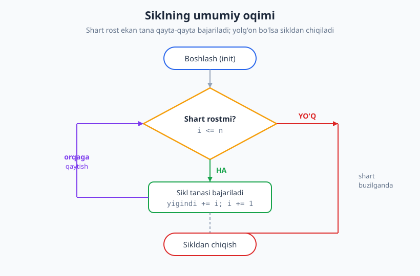
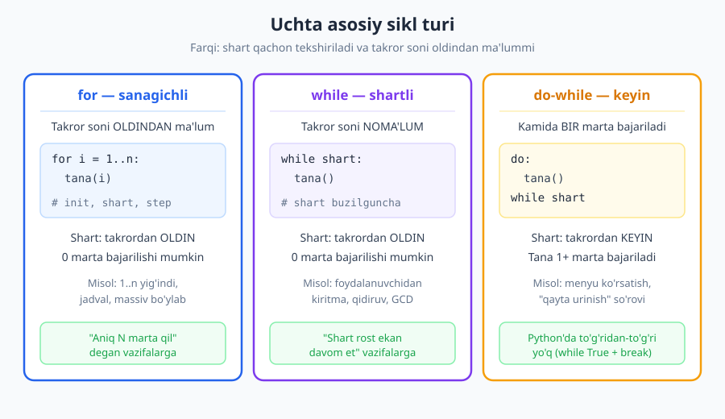
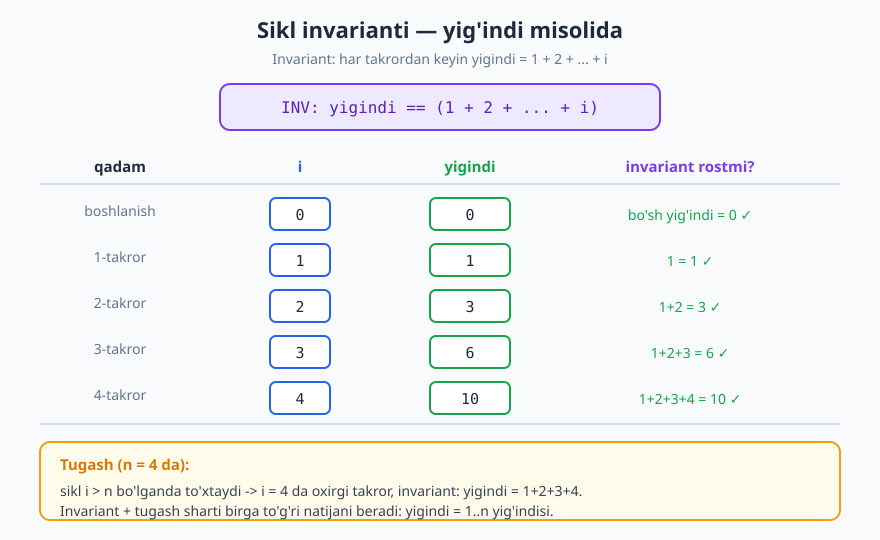

# 05 — Takrorlanuvchi algoritmlar va sikl invarianti

[⬅️ Oldingi: 04 — Tarmoqlanuvchi algoritmlar (shartlar)](./04-tarmoqlanuvchi-algoritmlar.md) · [🏠 README](./README.md) · [Keyingi: 06 — Rekursiya asoslari ➡️](./06-rekursiya-asoslari.md)

---

> **Bu bobda:** Bir amalni ko'p marta bajaradigan **sikllar** (takrorlanuvchi algoritmlar) bilan tanishamiz: `for`, `while` va `do-while` turlari, ularning qismlari (init, shart, tana, yangilash), sanagich va akkumulyator. So'ng bobning nazariy yadrosiga — **sikl invariantiga** — kelamiz: u siklning *to'g'riligini* matematik isbotlash usuli. Oxirida sikl **nega va qachon to'xtashini** (tugash), cheksiz sikldan saqlanishni, hamda `break`/`continue`ni ko'rib chiqamiz.
>
> **Halollik / Eslatma:** Sikl invarianti va tugash isbotlari bu yerda matematik aniq berilgan (formal mantiqning soddalashtirilgan, lekin to'g'ri shakli). Murakkablik baholari Big-O da to'g'ri ko'rsatilgan. Barcha Python namunalari haqiqatan ishga tushirib tekshirilgan — chiqishlari izohlardagiga mos.

---

## Takrorlash nima va nega kerak

Tasavvur qiling, sizdan **1 dan 100 gacha bo'lgan sonlarning yig'indisini** so'rashdi. Qo'lda yozsangiz: `1 + 2 + 3 + ... + 100` — yuzta amal. Buni kodda yuz marta yozish ahmoqlik bo'lardi. Bizga **bir xil amalni ko'p marta**, har safar biroz boshqacha ma'lumot bilan bajaradigan vosita kerak. Bu vosita — **sikl** (loop), ya'ni **takrorlanuvchi algoritm**.

Takrorlash dasturlashning uchta asosiy boshqaruv strukturasidan biridir:

```text
1. Ketma-ketlik  (sequence)   — qadamlar birin-ketin       (03-bob)
2. Tarmoqlanish   (selection)  — shartga ko'ra tanlash       (04-bob)
3. Takrorlash     (iteration)  — bir amalni qayta bajarish   (shu bob)
```

Bu uchtasini birlashtirib **istalgan** algoritmni qurish mumkin (bu fakt — *strukturali dasturlash teoremasi*). Takrorlash bo'lmasa, hech qachon "katta" masalalarni yecha olmas edik: massivni elementma-element ko'rib chiqish, fayldagi har satrni o'qish, foydalanuvchi to'g'ri parol kiritguncha so'rab turish — bularning hammasi sikl.

> **Nega sikl? (DRY tamoyili.)** "Don't Repeat Yourself" — o'zingni takrorlama. Bir xil kodni qo'lda 100 marta nusxalash o'rniga, uni **bir marta** yozib, siklga "100 marta bajar" deysiz. Bu nafaqat qisqa, balki **n oldindan noma'lum** bo'lganda yagona yo'l: agar foydalanuvchi nechta son kiritishini bilmasangiz, qo'lda yoza ham olmaysiz — faqat sikl yordam beradi.

Sikl nima qilishini umumiy oqim sifatida ko'ramiz: **shart** tekshiriladi, rost bo'lsa **tana** bajariladi va yana **shartga qaytiladi**; shart yolg'on bo'lganda **chiqiladi**.



Diqqat qiling: orqaga qaytadigan strelka (binafsha) — bu siklni shunchaki ketma-ketlikdan ajratib turadigan narsa. Aynan shu "qaytish" bizga *bir xil kodni qayta-qayta* bajarish imkonini beradi.

---

## Sikl turlari: for, while, do-while

Uchta klassik sikl turi bor. Ularning farqi — **shart qachon tekshiriladi** va **takror soni oldindan ma'lummi**.



### for — sanagichli sikl

`for` ni **takror soni oldindan ma'lum** bo'lganda ishlatamiz: "aniq n marta bajar", "1 dan n gacha yur", "massivning har elementi uchun". Unda **sanagich** (counter) o'zgaruvchi bor — u boshlang'ich qiymatdan oxirgisigacha qadam-qadam o'zgaradi.

```text
ALGORITM for-misol:
    for i = 1 ... n:        // i: 1, 2, ..., n
        chiqar(i)
```

```python
# 1 dan 5 gacha chiqarish
for i in range(1, 6):   # range(1, 6) -> 1,2,3,4,5
    print(i, end=" ")
print()
# -> 1 2 3 4 5
```

### while — shartli sikl

`while` ni **takror soni noma'lum**, lekin **to'xtash sharti** ma'lum bo'lganda ishlatamiz: "shart rost ekan davom et". Misol: foydalanuvchi `0` kiritguncha so'rab turish — necha marta so'rashni oldindan bilmaymiz.

```text
ALGORITM while-misol:
    i = 1
    while i <= n:           // shart oldin tekshiriladi
        chiqar(i)
        i = i + 1           // yangilashni UNUTMANG, aks holda cheksiz sikl
```

```python
i = 1
while i <= 5:
    print(i, end=" ")
    i += 1
print()
# -> 1 2 3 4 5
```

> **Diqqat:** `while`da sanagichni **o'zingiz** oshirishingiz kerak (`i += 1`). Buni unutsangiz, `i` hech qachon o'zgarmaydi, shart abadiy rost qoladi — **cheksiz sikl**. `for`da bu xato bo'lmaydi, chunki qadam avtomatik.

### do-while — kamida bir marta

`do-while` (yoki Pascal'dagi `repeat ... until`) — tana **avval bajariladi**, **keyin** shart tekshiriladi. Demak tana **kamida bir marta** ishlaydi, hatto shart boshidanoq yolg'on bo'lsa ham. Bu menyu ko'rsatish kabi vazifalarga mos: menyuni hech bo'lmaganda bir marta ko'rsatish kerak.

```text
ALGORITM do-while-misol:
    do:
        menyu_korsat()
        tanlov = sora()
    while tanlov != "chiqish"
```

Python'da `do-while` to'g'ridan-to'g'ri yo'q; uni `while True` + `break` bilan yasaymiz:

```python
# Python'da do-while emulyatsiyasi: tana kamida bir marta ishlaydi
hisoblagich = 0
while True:
    hisoblagich += 1          # tana avval bajariladi
    if hisoblagich >= 3:      # keyin shart tekshiriladi
        break
print(hisoblagich)
# -> 3
```

| Tur | Shart qachon | Tana kamida | Qachon ishlatamiz |
|---|---|---|---|
| `for` | takrordan **oldin** | 0 marta | takror soni ma'lum (n marta) |
| `while` | takrordan **oldin** | 0 marta | shart bor, takror soni noma'lum |
| `do-while` | takrordan **keyin** | **1 marta** | tana hech bo'lmasa bir marta kerak |

> **Eslatma:** `for` va `while` bir-birini almashtira oladi — har `for` ni `while` ga aylantirish mumkin va aksincha. Tanlov **o'qiluvchanlik** uchun: agar "n marta" deb aniq aytsangiz `for`, "shu shart bo'lguncha" desangiz `while`.

---

## Siklning qismlari: init, shart, tana, yangilash

Har qanday to'g'ri sikl ichida to'rt mantiqiy qism bor (`for`da ular bir qatorga jamlangan, `while`da yoyilgan):

```text
i = 1                 // 1. INIT      — ishga tayyorlash (sanagich/akkumulyator)
while i <= n:         // 2. SHART     — davom etish sharti
    yigindi += i      // 3. TANA      — har takrorda bajariladigan ish
    i = i + 1         // 4. YANGILASH — keyingi takrorga o'tish (step)
```

Bu to'rttasini tushunsangiz, **istalgan** siklni o'qiy va yoza olasiz. Eng ko'p uchraydigan xatolar shu to'rttada: noto'g'ri init (`i = 0` o'rniga `i = 1`), noto'g'ri shart (`<` o'rniga `<=`), yangilashni unutish.

Sikllarda ikki muhim o'zgaruvchi roli bor:

- **Sanagich (counter):** nechinchi takrorda turganimizni saqlaydi (`i`). Odatda har takror bir oshadi.
- **Akkumulyator (accumulator):** natijani **to'plab boruvchi** o'zgaruvchi. Yig'indi uchun `0` dan boshlanadi (`s += i`), ko'paytma uchun `1` dan (`p *= i`). Akkumulyatorni to'g'ri boshlang'ich qiymat bilan e'lon qilish — siklning yuragi.

> **Diqqat — akkumulyatorning boshlang'ich qiymati.** Yig'indi uchun `0` (chunki `0 + x = x`, "neytral element"), ko'paytma uchun `1` (chunki `1 * x = x`). Agar ko'paytmani `0` dan boshlasangiz, natija doim `0` chiqadi — klassik xato.

---

## Klassik misollar (trassirovka bilan)

Endi besh klassik takrorlanuvchi algoritmni psevdokod, Python va **trassirovka jadvali** bilan ko'ramiz. Trassirovka — o'zgaruvchilarning har takrordagi qiymatini qo'lda kuzatish; bu sikl ishini tushunishning eng ishonchli yo'li.

### 1. 1..n yig'indisi (yig'indi akkumulyatori)

```text
ALGORITM yigindi(n):
    s = 0                  // akkumulyator, neytral = 0
    for i = 1 ... n:
        s = s + i
    return s
```

`n = 5` uchun trassirovka:

| i | `s += i` amaldan oldin `s` | amaldan keyin `s` |
|---|---|---|
| 1 | 0 | 1 |
| 2 | 1 | 3 |
| 3 | 3 | 6 |
| 4 | 6 | 10 |
| 5 | 10 | **15** |

```python
def yigindi(n):
    s = 0
    for i in range(1, n + 1):
        s += i
    return s

print(yigindi(5))     # -> 15
print(yigindi(100))   # -> 5050
```

Bu **O(n)** vaqt: sikl `n` marta aylanadi. (Bonus: matematikada yopiq formula `n*(n+1)/2` mavjud, u **O(1)** — siklsiz; lekin sikl umumiyroq usulni ko'rsatadi.)

### 2. Faktorial (ko'paytma akkumulyatori)

`n! = 1 * 2 * 3 * ... * n`. Akkumulyator endi `1` dan boshlanadi.

```text
ALGORITM faktorial(n):
    natija = 1            // ko'paytma uchun neytral = 1
    for i = 2 ... n:
        natija = natija * i
    return natija
```

```python
def faktorial(n):
    natija = 1
    for i in range(2, n + 1):
        natija *= i
    return natija

print(faktorial(5))   # -> 120
print(faktorial(0))   # -> 1   (bo'sh ko'paytma = 1)
```

`n = 0` da sikl umuman aylanmaydi (`range(2, 1)` bo'sh), `natija` `1` bo'lib qoladi — bu matematik jihatdan to'g'ri (`0! = 1`). Bu — akkumulyatorni neytral qiymatdan boshlashning go'zal natijasi. Murakkablik: **O(n)**.

### 3. Ko'paytuv jadvali

`7` ning jadvalini (`7 * 1` dan `7 * 10` gacha) hisoblaymiz.

```python
qator = []
for j in range(1, 11):
    qator.append(7 * j)
print(qator)
# -> [7, 14, 21, 28, 35, 42, 49, 56, 63, 70]
```

### 4. Massiv bo'ylab yurish: eng katta element

Bu — sikllarning eng ko'p ishlatiladigan ko'rinishi: ro'yxat bo'ylab yurib, biror narsani **izlash/to'plash**. Strategiya: birinchi elementni "hozircha eng katta" deb olamiz, qolganlarini u bilan solishtiramiz.

```text
ALGORITM eng_katta(a):
    eng = a[0]
    for x in a[1 ... oxir]:
        if x > eng:
            eng = x
    return eng
```

`a = [3, 7, 2, 9, 4]` uchun trassirovka:

| ko'rilayotgan x | `x > eng`? | `eng` (qadamdan keyin) |
|---|---|---|
| (boshlanish) | — | 3 |
| 7 | ha | 7 |
| 2 | yo'q | 7 |
| 9 | ha | 9 |
| 4 | yo'q | **9** |

```python
def eng_katta(a):
    eng = a[0]
    for x in a[1:]:
        if x > eng:
            eng = x
    return eng

print(eng_katta([3, 7, 2, 9, 4]))   # -> 9
```

Murakkablik **O(n)** — har elementni bir marta ko'ramiz. Bu yerda sikl **tarmoqlanish** (04-bobdagi `if`) bilan birlashdi: takrorlash ichida shart — eng kuchli kombinatsiya.

### 5. Raqamlar bilan ishlash: `%` va `//`

Sonning raqamlarini ajratish uchun ikki amal: `n % 10` — oxirgi raqam, `n // 10` — oxirgi raqamni olib tashlash (butun bo'linma). `while n > 0` bilan barcha raqamlardan o'tamiz.

**Raqamlar yig'indisi** (`1234 -> 1+2+3+4 = 10`):

```python
def raqam_yigindisi(n):
    s = 0
    while n > 0:
        s += n % 10     # oxirgi raqamni qo'sh
        n //= 10        # oxirgi raqamni olib tashla
    return s

print(raqam_yigindisi(1234))   # -> 10
```

`n = 1234` trassirovkasi:

| `n` (takror boshida) | `n % 10` | `s` (keyin) | `n //= 10` |
|---|---|---|---|
| 1234 | 4 | 4 | 123 |
| 123 | 3 | 7 | 12 |
| 12 | 2 | 9 | 1 |
| 1 | 1 | **10** | 0 -> to'xtash |

**Sonni teskari o'girish** (`1234 -> 4321`): har qadamda natijani `10` ga ko'paytirib, oxirgi raqamni qo'shamiz.

```python
def teskari(n):
    r = 0
    while n > 0:
        r = r * 10 + n % 10
        n //= 10
    return r

print(teskari(1234))   # -> 4321
```

Bu yerda `while` mantiqiy tanlov: raqamlar soni oldindan noma'lum, lekin to'xtash sharti aniq (`n` nolga yetganda). Murakkablik **O(log n)** — raqamlar soni songa logarifmik bog'liq.

---

## Ichma-ich (nested) sikllar — qisqacha

Sikl tanasi ichida **yana sikl** bo'lishi mumkin. Tashqi sikl bir aylanganda, ichki sikl **to'liq** aylanadi. Misol: barcha `(i, j)` juftliklarini hosil qilish.

```python
juftlar = []
for i in range(1, 4):       # tashqi: 1,2,3
    for j in range(1, 4):   # ichki: har i uchun 1,2,3
        juftlar.append((i, j))
print(len(juftlar))   # -> 9   (3 * 3)
```

Yulduzcha uchburchak — ichki sikl uzunligi tashqi sanagichga bog'liq:

```python
satrlar = []
for i in range(1, 5):
    satrlar.append("*" * i)
print(satrlar)   # -> ['*', '**', '***', '****']
```

> **Trade-off:** Ikki ichma-ich sikl odatda **O(n²)** amal bajaradi (`n` x `n`). Uchtasi — **O(n³)**. Shuning uchun ichma-ich sikllar tezlikni keskin kamaytiradi; ularni qachon ishlatish to'g'ri, qachon yo'q — bu [murakkablikni hisoblash](./09-murakkablikni-hisoblash.md) bobining markaziy mavzusi.

---

## Sikl invarianti — siklning to'g'riligini isbotlash

Mana bobning nazariy yadrosi. Sikl yozib, "u to'g'ri ishlaydimi?" degan savolga *bir-ikki misolni sinab ko'rish* yetarli emas — misol o'tib ketgan xatoni yashirishi mumkin. Bizga **isbot** kerak. Buning klassik vositasi — **sikl invarianti** (loop invariant).

> **Ta'rif.** Sikl invarianti — siklning **har takroridan oldin (va keyin) doim rost qoladigan** mulohaza (shart). U siklning "haqiqat yadrosi": ne'matni har takror saqlab boradi.

Invariant bilan to'g'rilikni isbotlash uchun **uchta qadamni** ko'rsatamiz (xuddi induksiya kabi):

1. **Initsializatsiya (boshlang'ich holat):** invariant siklning **birinchi takroridan oldin** rost.
2. **Saqlanish (maintenance):** agar invariant biror takror **boshida** rost bo'lsa, u **keyingi takror boshida** ham rost qoladi (ya'ni bitta takror invariantni buzmaydi).
3. **Tugash (termination):** sikl to'xtaganda invariant **+ siklning to'xtash sharti** birga bizga **kerakli natijani** beradi.

Bu xuddi matematik induksiya: 1-qadam = baza, 2-qadam = induktiv o'tish, 3-qadam = natijani chiqarish.

### Yig'indi misolida invariantni isbotlaymiz

`yigindi(n)` algoritmini olaylik:

```text
s = 0
for i = 1 ... n:        // i takror boshida
    s = s + i
return s
```

**Invariantni** shunday tanlaymiz:

```text
INV:  i-takror boshida (s + i ni qo'shishdan oldin),
      s = 1 + 2 + ... + (i - 1)
      ya'ni s allaqachon ko'rilgan barcha sonlar yig'indisi.
```

Endi uch qadamni tekshiramiz:

- **Initsializatsiya.** Birinchi takror boshida `i = 1`, `s = 0`. Invariant `s = 1 + ... + 0` deydi — bu **bo'sh yig'indi**, qiymati `0`. Haqiqatan `s = 0`. ✓ Rost.

- **Saqlanish.** Faraz qilaylik, `i`-takror boshida invariant rost: `s = 1 + ... + (i-1)`. Takror ichida `s = s + i` bajariladi, demak yangi `s = (1 + ... + (i-1)) + i = 1 + ... + i`. So'ng `i` bir oshadi (`i+1` bo'ladi). Keyingi takror boshida invariant `s = 1 + ... + ((i+1)-1) = 1 + ... + i` ni talab qiladi — bu aynan hozirgi `s`. ✓ Saqlandi.

- **Tugash.** Sikl `i = n+1` bo'lganda to'xtaydi (chunki `i <= n` buziladi). Shu paytda invariant: `s = 1 + ... + ((n+1)-1) = 1 + 2 + ... + n`. Aynan shu — bizga kerak bo'lgan natija! ✓

> **Isbot (eskiz) — xulosa.** Uch qadam to'g'ri bo'lgani uchun, sikl tugaganda `s` aniq `1 + 2 + ... + n` ga teng. Biz buni **bironta** aniq `n` ni sinamasdan, **barcha** `n` uchun isbotladik. Mana sikl invariantining kuchi: u algoritm *to'g'riligini* matematik kafolatlaydi.

Quyidagi diagramma invariant har takrorda qanday saqlanishini konkret qiymatlarda ko'rsatadi:



> **Eslatma.** Invariantni "to'g'ri" tanlash — mahorat. Yaxshi invariant ikki shartni bajaradi: (a) boshida oson rost bo'ladi, (b) tugashda kerakli natijani beradi. Saralash va qidiruv algoritmlarining to'g'riligi ham aynan shu usul bilan isbotlanadi — masalan [binar qidiruv](./28-qidiruv-algoritmlari.md) invarianti "kerakli element [chap, o'ng] oralig'ida" deydi.

---

## Tugash (termination): sikl nega to'xtaydi

Invariant siklning *to'g'ri* javob berishini kafolatlaydi — **agar u to'xtasa**. Lekin sikl **umuman to'xtaydimi**? Bu alohida savol va alohida isbot talab qiladi.

Sikl to'xtashini ko'rsatish uchun **kamayuvchi (yoki ortuvchi) kattalik** topamiz — uni **variant** yoki **o'lchov (measure)** deb ataymiz. Bu — har takrorda qat'iy o'zgaradigan va biror chegaraga yetganda siklni to'xtatadigan butun son.

Yig'indi misolida: o'lchov = `n - i`. Har takrorda `i` bir oshadi, demak `n - i` bir **kamayadi**. Manfiy bo'la olmaydi (chunki shart `i <= n`). Manfiy bo'lmagan butun son cheksiz kamaya olmaydi — demak qachondir `i > n` bo'ladi va sikl **to'xtaydi**. Tugash isbotlandi.

GCD (Evklid) misolida ham xuddi shunday — qoldiq har qadamda **qat'iy kamayadi** va manfiy bo'lmaydi:

```python
def gcd(a, b):
    while b != 0:
        a, b = b, a % b   # b har qadamda qat'iy kamayadi (a % b < b)
    return a

print(gcd(48, 36))   # -> 12
print(gcd(17, 5))    # -> 1
```

`a % b` har doim `b` dan kichik, shuning uchun `b` ketma-ketligi `36, 12, 0` kabi qat'iy kamayadi va nolga yetadi. Demak sikl **albatta** to'xtaydi.

### Cheksiz sikl — sabablar va saqlanish

Sikl o'lchovi kamaymasa, sikl **hech qachon to'xtamaydi** — bu **cheksiz sikl** (infinite loop), dasturni "muzlatadi". Eng ko'p sabablar:

```text
1. Yangilashni unutish:
       i = 1
       while i <= 10:
           print(i)        // i hech qachon oshmaydi -> cheksiz!

2. Noto'g'ri yo'nalishda yangilash:
       i = 10
       while i > 0:
           i = i + 1       // i kamayishi kerak edi, oshib ketdi -> cheksiz!

3. Shart hech qachon yolg'on bo'lmaydigan qilib yozilgan:
       while True:         // break bo'lmasa -> cheksiz
           ...
```

Saqlanish qoidasi: **har sikl uchun, har takrorda qat'iy o'zgaruvchi va chegarali o'lchovni aniqlang.** Agar bunday o'lchovni topa olmasangiz, sikl to'xtashiga ishonchingiz yo'q. `while True` ni faqat **ichida `break` bilan** ishlating va break sharti albatta sodir bo'lishini tekshiring.

---

## break va continue

Ba'zan siklni **erta to'xtatish** yoki **bir takrorni o'tkazib yuborish** kerak bo'ladi:

- **`break`** — siklni **butunlay** to'xtatadi (shartdan qat'i nazar chiqib ketadi). "Topdim, boshqa qidirishning hojati yo'q" holatlari uchun.
- **`continue`** — joriy takrorni **tashlab**, keyingisiga o'tadi (tana qolgani bajarilmaydi, lekin sikl davom etadi).

`break` bilan birinchi tub bo'luvchini topish (topilishi bilan to'xtaymiz):

```python
def birinchi_boluvchi(n):
    d = 2
    while d * d <= n:
        if n % d == 0:
            return d     # return ham siklni to'xtatadi (break kabi)
        d += 1
    return n             # bo'luvchi topilmadi -> n tub

print(birinchi_boluvchi(91))   # -> 7    (91 = 7 * 13)
print(birinchi_boluvchi(13))   # -> 13   (tub son)
```

`continue` bilan faqat juft sonlarni qo'shish:

```python
s = 0
for i in range(1, 11):
    if i % 2 != 0:
        continue     # toq bo'lsa, qo'shmasdan keyingisiga o't
    s += i
print(s)   # -> 30   (2+4+6+8+10)
```

> **Anti-pattern:** `break`/`continue` ni haddan tashqari ko'p ishlatish kodni o'qishni qiyinlashtiradi — sikl qayerdan chiqishini izlash kerak bo'ladi. Imkon bo'lsa, shartni siklning **shart** qismiga joylashtiring; `break` ni faqat tabiiy "erta chiqish" (qidirib topdim) holatlarida ishlating. Diqqat: `break` faqat **eng ichki** siklni to'xtatadi — ichma-ich sikldan to'liq chiqish uchun bayroq (flag) yoki funksiyadan `return` kerak.

Takrorlash g'oyasini chuqurroq olib boradigan tabiiy davom — **rekursiya**: funksiya o'zini chaqirib, takrorlashni boshqacha — "o'z-o'ziga murojaat" orqali — amalga oshiradi. Uni [keyingi bobda](./06-rekursiya-asoslari.md) ko'ramiz, va u bilan iteratsiyani solishtiramiz.

---

## Asosiy g'oyalar (bobni qisqacha)

- **Takrorlash** — bir amalni ko'p marta bajarish; uchta asosiy strukturadan biri (ketma-ketlik, tarmoqlanish, takrorlash). DRY tamoyili va `n` noma'lum bo'lganda yagona yo'l.
- **`for`** — takror soni ma'lum (sanagichli); **`while`** — to'xtash sharti ma'lum, soni noma'lum; **`do-while`** — tana kamida bir marta (shart keyin tekshiriladi).
- Har sikl 4 qismdan iborat: **init, shart, tana, yangilash**. Ko'p xato shu yerda: noto'g'ri chegara, yangilashni unutish.
- **Akkumulyator**ni neytral qiymatdan boshlang: yig'indi uchun `0`, ko'paytma uchun `1`.
- **Sikl invarianti** — har takrorda rost qoladigan shart; u orqali siklning **to'g'riligi** matematik isbotlanadi (initsializatsiya → saqlanish → tugash, induksiya kabi).
- **Tugash** alohida isbot: har takrorda qat'iy kamayuvchi, chegarali **o'lchov** toping. Topa olmasangiz — cheksiz sikl xavfi bor.
- **`break`** siklni to'xtatadi, **`continue`** takrorni o'tkazadi — ehtiyot bo'lib ishlating.

---

## Mashqlar

### Oson

**1-mashq.** `1` dan `n` gacha bo'lgan **toq** sonlar yig'indisini hisoblovchi sikl yozing. `n = 6` uchun javob `1+3+5 = 9`.

**2-mashq.** Berilgan ro'yxatda nechta **musbat** son borligini sanang. `[-1, 3, 0, 5, -2, 8]` uchun javob `3`.

**3-mashq.** `5` ning ko'paytuv jadvalini (`5*1` dan `5*9` gacha) ro'yxat sifatida chiqaring.

### O'rta

**4-mashq.** Berilgan sonning raqamlari yig'indisini topadigan funksiya yozing (`%` va `//` bilan). `9035` uchun javob `9+0+3+5 = 17`.

**5-mashq.** Ro'yxatdagi eng katta va eng kichik elementni **bitta** sikl bilan toping. `[3, 7, 2, 9, 4]` uchun `(9, 2)`.

**6-mashq.** Ikki sonning **eng katta umumiy bo'luvchisini (GCD)** Evklid algoritmi bilan toping va **nega bu sikl har doim to'xtashini** bir-ikki jumla bilan tushuntiring. `gcd(48, 36) = 12`.

### Qiyin

**7-mashq.** Quyidagi sikl uchun **invariant** yozing va uch qadam (initsializatsiya, saqlanish, tugash) bilan to'g'riligini isbotlang. Sikl `n!` (faktorial) ni hisoblaydi:

```text
natija = 1
i = 1
while i <= n:
    natija = natija * i
    i = i + 1
return natija
```

**8-mashq.** Quyidagi sikl uchun **o'lchov (measure)** toping va u **nega to'xtashini** ko'rsating:

```text
x = 100
while x > 1:
    x = x // 2
```

**9-mashq.** Quyidagi kod **cheksiz sikl** — xatoni toping va tuzating. Maqsad: `5` dan `1` gacha teskari chiqarish.

```python
i = 5
while i > 0:
    print(i)
    i = i + 1   # <- bu yerda nimadir noto'g'ri
```

<details markdown="1">
<summary>Yechimlar</summary>

### 1-mashq yechimi

`continue` yoki shart bilan toqlarni ajratamiz; yoki to'g'ridan-to'g'ri `range` qadami `2` bilan.

```python
def toq_yigindi(n):
    s = 0
    for i in range(1, n + 1):
        if i % 2 == 1:
            s += i
    return s

print(toq_yigindi(6))   # -> 9
```

### 2-mashq yechimi

Akkumulyator (sanagich) `0` dan boshlanadi, shart bilan oshiriladi.

```python
def musbatlar_soni(a):
    c = 0
    for x in a:
        if x > 0:
            c += 1
    return c

print(musbatlar_soni([-1, 3, 0, 5, -2, 8]))   # -> 3
```

### 3-mashq yechimi

```python
jadval = []
for j in range(1, 10):
    jadval.append(5 * j)
print(jadval)   # -> [5, 10, 15, 20, 25, 30, 35, 40, 45]
```

### 4-mashq yechimi

`while n > 0` bilan barcha raqamlardan o'tamiz; `0` ga ham e'tibor bering (`9035` da o'rtada `0` bor — yig'indiga `0` qo'shiladi, muammo yo'q).

```python
def raqam_yigindisi(n):
    s = 0
    while n > 0:
        s += n % 10
        n //= 10
    return s

print(raqam_yigindisi(9035))   # -> 17
```

### 5-mashq yechimi

Ikkala o'zgaruvchini birinchi element bilan ishga tayyorlaymiz, bitta sikl ichida ikkalasini ham yangilaymiz.

```python
def min_max(a):
    eng_kichik = eng_katta = a[0]
    for x in a[1:]:
        if x > eng_katta:
            eng_katta = x
        if x < eng_kichik:
            eng_kichik = x
    return (eng_katta, eng_kichik)

print(min_max([3, 7, 2, 9, 4]))   # -> (9, 2)
```

Murakkablik **O(n)** — bir o'tishda ikkala chegara ham topiladi.

### 6-mashq yechimi

```python
def gcd(a, b):
    while b != 0:
        a, b = b, a % b
    return a

print(gcd(48, 36))   # -> 12
```

**Nega to'xtaydi:** har takrorda `b` ning yangi qiymati `a % b`, u doim eski `b` dan **qat'iy kichik** (qoldiq bo'luvchidan kichik). Manfiy bo'lmagan butun sonlar ketma-ketligi qat'iy kamayib, cheksiz davom eta olmaydi — qachondir `b = 0` bo'ladi va sikl to'xtaydi. (`48,36 -> 36,12 -> 12,0`.)

### 7-mashq yechimi

**Invariant:** `i`-takror boshida (ko'paytirishdan oldin) `natija = 1 * 2 * ... * (i-1) = (i-1)!`.

- **Initsializatsiya:** birinchi takror boshida `i = 1`, `natija = 1`. Invariant `natija = (1-1)! = 0! = 1` deydi. Haqiqatan `natija = 1`. ✓
- **Saqlanish:** faraz `natija = (i-1)!` rost. Tanada `natija = natija * i = (i-1)! * i = i!`. So'ng `i` bir oshadi. Keyingi takror boshida invariant `natija = ((i+1)-1)! = i!` ni talab qiladi — bu aynan hozirgi qiymat. ✓
- **Tugash:** sikl `i = n+1` da to'xtaydi (`i <= n` buziladi). Shu paytda invariant: `natija = ((n+1)-1)! = n!`. Bu kerakli natija. ✓

Demak funksiya har `n >= 0` uchun `n!` ni to'g'ri qaytaradi.

```python
def faktorial(n):
    natija = 1
    i = 1
    while i <= n:
        natija = natija * i
        i = i + 1
    return natija

print(faktorial(5))   # -> 120
print(faktorial(0))   # -> 1
```

### 8-mashq yechimi

**O'lchov (measure):** `x` ning o'zi. Har takrorda `x = x // 2`, ya'ni `x` **kamida ikki barobar kamayadi** (butun bo'linma). `x` musbat butun son va `1` dan oshganda davom etadi; har qadamda qat'iy kamaygani uchun chegarali (`1` dan oshmaydigan) qiymatga albatta yetadi. Demak sikl to'xtaydi.

`x = 100` uchun qiymatlar: `100 -> 50 -> 25 -> 12 -> 6 -> 3 -> 1` — `1` da `x > 1` buziladi, to'xtaydi. Takrorlar soni `~log2(100) ≈ 7` — sikl **O(log x)** marta aylanadi.

```python
x = 100
qadamlar = []
while x > 1:
    x = x // 2
    qadamlar.append(x)
print(qadamlar)   # -> [50, 25, 12, 6, 3, 1]
```

### 9-mashq yechimi

Xato: `i = i + 1` `i` ni **oshiradi**, lekin shart `i > 0` — `i` doim musbat bo'lib qoladi, hech qachon yolg'on bo'lmaydi. Teskari chiqarish uchun `i` **kamayishi** kerak: `i = i - 1`. Shunda o'lchov (`i` ning o'zi) har qadamda qat'iy kamayadi va `0` ga yetib to'xtaydi.

```python
i = 5
while i > 0:
    print(i, end=" ")
    i = i - 1     # tuzatildi: kamaytirish
print()
# -> 5 4 3 2 1
```

</details>

---

[⬅️ Oldingi: 04 — Tarmoqlanuvchi algoritmlar (shartlar)](./04-tarmoqlanuvchi-algoritmlar.md) · [🏠 README](./README.md) · [Keyingi: 06 — Rekursiya asoslari ➡️](./06-rekursiya-asoslari.md)
