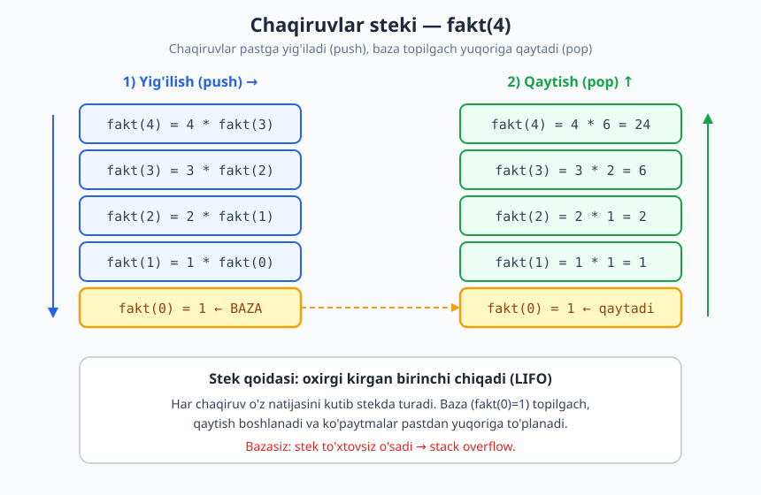
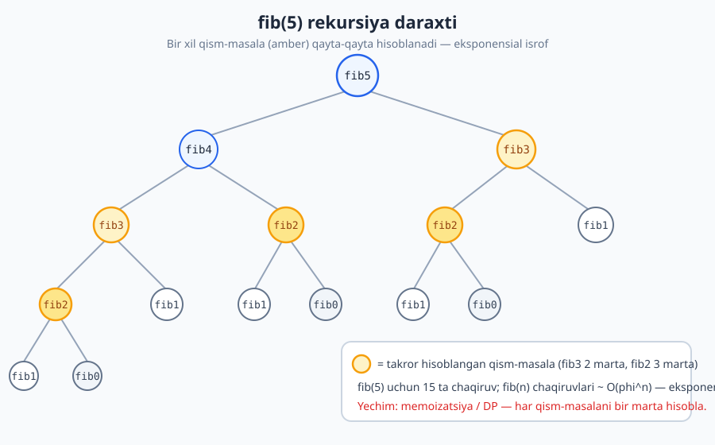
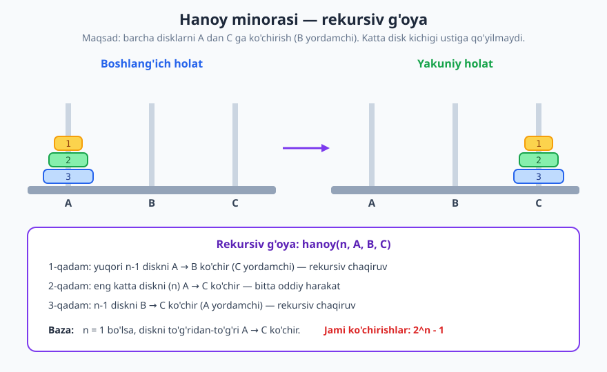

# 06 — Rekursiya asoslari

[⬅️ Oldingi: 05 — Takrorlanuvchi algoritmlar va sikl invarianti](./05-takrorlanuvchi-algoritmlar.md) · [🏠 README](./README.md) · [Keyingi: 07 — Algoritm samaradorligi va hisoblash modeli ➡️](./07-samaradorlik-hisoblash-modeli.md)

---

> **Bu bobda:** Rekursiya — funksiyaning o'z-o'zini chaqirib, masalani xuddi shu masalaning kichikroq nusxasiga keltirib yechish usuli. Uning ikki majburiy qismini (baza va rekursiv qadam), chaqiruvlar stekining qanday ishlashini, klassik misollar (faktorial, Fibonachchi, daraja, Hanoy minorasi, string ag'darish) va rekursiya vs iteratsiya o'zaro almashinishini ko'rib chiqamiz.
>
> **Halollik / Eslatma:** Bu yerdagi barcha Python namunalari haqiqatan ishga tushirib tekshirildi va ko'rsatilgan natijani beradi. Murakkablik baholari (masalan, sodda Fibonachchining eksponensialligi, Hanoyning `2^n − 1` ko'chirishi) matematik aniq va isbotlanadi. "Quyruq rekursiyasi" qismi soddalashtirilgan tushuncha sifatida beriladi (CPython uni avtomatik optimallashtirmasligini eslatamiz).

---

## Rekursiya nima

Tasavvur qiling: ikki oyna bir-biriga qaragan. Birinchi oynada ikkinchisining aksi, uning ichida yana birinchisining aksi, va shu davom etadi — oyna ichida oyna, ichida oyna... Yoki **matryoshka** qo'g'irchog'i: kattasini ochsangiz ichidan kichigi chiqadi, uni ochsangiz yana kichigi — eng kichigi (ochilmaydigani) chiqquncha.

**Rekursiya** ham xuddi shunday: bu — **o'z-o'zini chaqiruvchi funksiya**. Aniqrog'i, bu masalani yechish uslubi bo'lib, unda biz katta masalani **xuddi shu masalaning kichikroq nusxasi** orqali ifodalaymiz, va shu kichikroq nusxani yechishni o'zimizning funksiyamizga topshiramiz.

Misol uchun, "5 ta qutini bittalab ko'tarish" masalasini shunday ham ifodalash mumkin: "bitta qutini ko'tar, qolgan 4 tasini ko'tarish masalasini esa o'zingga topshir". Endi 4 ta quti masalasi 5 tadan kichikroq, lekin **tabiati bir xil** — shuning uchun bir xil usul bilan yechiladi.

> **Eslatma:** Rekursiyaning kuchi shundaki, u takrorlanuvchi tuzilmaga ega masalalarni (daraxtlar, ichma-ich tuzilmalar, "katta = kichik + bitta qadam" naqshi) hayratlanarli darajada qisqa va tabiiy ifodalaydi. Sikl ([05-bob](./05-takrorlanuvchi-algoritmlar.md)) bilan uddasidan chiqib bo'lmaydigan hech narsa rekursiyada yo'q — lekin ba'zan rekursiya ancha ravshanroq.

---

## Ikki majburiy qism: baza va rekursiv qadam

Matryoshkani eslang: agar har bir qo'g'irchoq ichida yana kichigi bo'laversa va **hech qachon to'xtamasa**, biz cheksiz ochib o'tirardik. To'xtash uchun **eng kichik, ochilmaydigan** qo'g'irchoq kerak. Rekursiyada ham aynan shunday — har bir to'g'ri rekursiv funksiyada **ikkita** qism bo'lishi shart:

1. **Baza holati (base case)** — to'xtash sharti. Bu shunchalik kichik masalaki, javobni **rekursiyasiz**, to'g'ridan-to'g'ri bilamiz. Masalan, "0 ta qutini ko'tarish" — hech narsa qilmaymiz, tamom.
2. **Rekursiv qadam (recursive step)** — masalani **kichikroq** nusxasiga keltirish va o'zimizni qayta chaqirish. Bu yerda muhim shart: har chaqiruvda biz **bazaga yaqinlashishimiz** kerak (masala kichrayishi shart).

```text
funksiya yech(masala):
    agar masala juda kichik bo'lsa:        # BAZA
        to'g'ridan-to'g'ri javobni qaytar
    aks holda:                             # REKURSIV QADAM
        masalani kichikroq qil
        kichikroq masalani yech(...) bilan hal qil
        natijani birlashtir va qaytar
```

> **Diqqat:** Agar **baza bo'lmasa** (yoki bazaga hech qachon yetib bormasak), funksiya o'zini cheksiz chaqiraveradi. Bu — **cheksiz rekursiya**. Kompyuter har chaqiruvni xotirada saqlaydi (pastda tushuntiriladi), shu sabab xotira tugaydi va dastur **stack overflow** xatosi bilan to'xtaydi. Python'da bu `RecursionError: maximum recursion depth exceeded` ko'rinishida chiqadi.

Faktorial misolida ikki qismni aniq ko'ramiz. `n!` = `1 · 2 · ... · n`, va matematik ta'rifi rekursiv:

```text
n! = 1                  agar n = 0      (BAZA)
n! = n · (n-1)!         agar n > 0      (REKURSIV QADAM)
```

Bu yerda `(n-1)!` — xuddi shu faktorial masalasining kichikroq nusxasi. Har qadamda `n` bittaga kichrayadi, demak `0`ga (bazaga) muqarrar yetadi.

---

## Chaqiruvlar steki (call stack)

Rekursiyani tushunishning kaliti — kompyuter funksiya chaqiruvlarini qanday boshqarishini ko'rish. Har bir funksiya chaqiruvi uchun kompyuter **stek freym (stack frame)** deb ataladigan kichik "qutichcha" yaratadi. Bu qutichada saqlanadi:

- chaqiruvning **lokal o'zgaruvchilari** va **argumentlari** (masalan, `n` ning qiymati),
- **qaytish manzili** — natija qaytgach, dastur qaysi joydan davom etishi kerakligi.

Bu qutichalar **stek** (stack) deb ataladigan strukturaga bir-birining ustiga **qo'yiladi** (push). Stekning qoidasi — **oxirgi qo'yilgan birinchi olinadi** (LIFO, *last-in first-out*). Yangi chaqiruv har doim stek **tepasiga** qo'yiladi; funksiya o'z natijasini qaytarganda, uning freymi tepadan **olinadi** (pop). Stek va uning amallari haqida batafsil [14-bob](./14-stack-queue-deque.md)da gaplashamiz — hozircha "ustiga qo'yiladi / tepadan olinadi" tasavvuri yetarli.



`fakt(4)` ni to'liq trassirovka qilamiz. Dastlab chaqiruvlar **yig'iladi** (har biri keyingisini kutadi), so'ng baza topilgach **qaytish** boshlanadi:

| Bosqich | Stek (tepasi o'ngda) | Nima bo'lyapti |
|---|---|---|
| 1 | `fakt(4)` | `4 * fakt(3)` kerak — `fakt(3)` chaqiriladi (push) |
| 2 | `fakt(4)`, `fakt(3)` | `3 * fakt(2)` kerak — `fakt(2)` chaqiriladi (push) |
| 3 | `fakt(4)`, `fakt(3)`, `fakt(2)` | `2 * fakt(1)` kerak — `fakt(1)` chaqiriladi (push) |
| 4 | `fakt(4)`, `fakt(3)`, `fakt(2)`, `fakt(1)` | `1 * fakt(0)` kerak — `fakt(0)` chaqiriladi (push) |
| 5 | `... , fakt(1)`, `fakt(0)` | **BAZA**: `fakt(0) = 1`, qaytaradi (pop) |
| 6 | `fakt(4)`, `fakt(3)`, `fakt(2)`, `fakt(1)` | `fakt(1) = 1 * 1 = 1`, qaytaradi (pop) |
| 7 | `fakt(4)`, `fakt(3)`, `fakt(2)` | `fakt(2) = 2 * 1 = 2`, qaytaradi (pop) |
| 8 | `fakt(4)`, `fakt(3)` | `fakt(3) = 3 * 2 = 6`, qaytaradi (pop) |
| 9 | `fakt(4)` | `fakt(4) = 4 * 6 = 24`, qaytaradi (pop) |
| 10 | (bo'sh) | Natija: **24** |

Diqqat qiling: ko'paytirish amallari aslida **qaytish paytida** (pastdan yuqoriga) bajariladi. Yig'ilish bosqichida har bir freym shunchaki "men `n` ni `fakt(n-1)` natijasiga ko'paytiraman, lekin avval u natija kelishini kutaman" deb turadi.

> **Eslatma:** Stekning chuqurligi — bir vaqtning o'zida nechta freym yig'ilgani — bu rekursiyaning **xotira narxi**. `fakt(n)` uchun chuqurlik `O(n)`. Ko'pchilik tilda stek hajmi cheklangan (CPython'da odatda ~1000 chuqurlik), shu bois juda chuqur rekursiya `stack overflow` ga olib keladi.

---

## Klassik misollar

### 1. Faktorial — rekursiv va iterativ yonma-yon

```python
def fakt_rec(n):           # rekursiv
    if n == 0:             # BAZA
        return 1
    return n * fakt_rec(n - 1)   # REKURSIV QADAM

def fakt_iter(n):          # iterativ (sikl bilan)
    natija = 1
    for i in range(2, n + 1):
        natija *= i
    return natija

print(fakt_rec(5), fakt_iter(5))   # -> 120 120
```

Ikkalasi bir xil natija beradi. Rekursiv variant matematik ta'rifga (`n! = n·(n-1)!`) deyarli aynan o'xshaydi — bu uning o'qishga qulayligi. Iterativ variant esa stek freym yig'maydi, shu sabab xotirada arzonroq (`O(1)` qo'shimcha xotira `O(n)` o'rniga).

### 2. 1 dan n gacha yig'indi

```python
def yigindi(n):
    if n == 0:             # BAZA: bo'sh yig'indi = 0
        return 0
    return n + yigindi(n - 1)   # n ni "qolganlar yig'indisi"ga qo'sh

print(yigindi(100))        # -> 5050
```

G'oya: `1 + 2 + ... + n` = `n + (1 + 2 + ... + (n-1))`. Oxirgi qism — xuddi shu masala, faqat `n` bilan kichikroq.

### 3. Fibonachchi — va uning muammosi

Fibonachchi ketma-ketligi: `0, 1, 1, 2, 3, 5, 8, ...` — har son oldingi ikkisining yig'indisi. Ta'rifi tabiiy rekursiv:

```text
fib(0) = 0,  fib(1) = 1              (BAZA)
fib(n) = fib(n-1) + fib(n-2)         (REKURSIV QADAM)
```

```python
def fib(n):
    if n < 2:              # BAZA: fib(0)=0, fib(1)=1
        return n
    return fib(n - 1) + fib(n - 2)

print([fib(i) for i in range(10)])
# -> [0, 1, 1, 2, 3, 5, 8, 13, 21, 34]
```

Bu chiroyli ko'rinadi, lekin **jiddiy muammosi** bor. Har chaqiruv **ikkita** yangi chaqiruv tug'diradi, va ular orasida bir xil qism-masalalar **qayta-qayta** hisoblanadi. `fib(5)` ning rekursiya daraxtiga qarang:



`fib(3)` bu daraxtda **2 marta**, `fib(2)` esa **3 marta** hisoblanadi — va `n` o'sgani sayin bu takror portlab ketadi. Chaqiruvlar sonini o'lchaymiz:

```python
hisob = 0
def fib_hisob(n):
    global hisob
    hisob += 1
    if n < 2:
        return n
    return fib_hisob(n - 1) + fib_hisob(n - 2)

fib_hisob(5)
print(hisob)               # -> 15
```

`fib(5)` uchun **15 ta** chaqiruv — atigi 6-chi sonni topish uchun! Umuman, sodda `fib(n)` chaqiruvlar soni `~ phi^n` (`phi ≈ 1.618`, oltin nisbat) tartibida o'sadi, ya'ni murakkablik **eksponensial** `O(phi^n)`. `fib(50)` ni shu usulda hisoblamoqchi bo'lsangiz — bir necha daqiqa kutasiz.

> **Anti-pattern:** Sodda rekursiv Fibonachchi — bir xil qism-masalani takror hisoblashning klassik namunasi. Yechim — har qism-masalani **bir marta** hisoblab, javobini eslab qolish (memoizatsiya) yoki pastdan yuqoriga jadval to'ldirish (tabulatsiya). Bu g'oya butun bir paradigma — **dinamik dasturlash** — ga olib boradi, [25-bob](./25-dinamik-dasturlash.md)da chuqur o'rganamiz. (Iterativ Fibonachchi esa `O(n)` — pastda mashqlarda ko'rasiz.)

### 4. Daraja (power) — sodda va tez

`x^n` ni hisoblashning sodda rekursiyasi: `x^n = x · x^(n-1)`.

```python
def daraja(x, n):
    if n == 0:             # BAZA: x^0 = 1
        return 1
    return x * daraja(x, n - 1)   # n ta ko'paytirish

print(daraja(2, 10))       # -> 1024
```

Bu `O(n)` ta ko'paytirish qiladi. Lekin **bo'lib hal qilish** g'oyasi bilan ancha tezroq qilish mumkin. Asosiy kuzatuv: `x^n = (x^(n/2))^2` (juft `n` uchun). Ya'ni darajani **yarmiga** bo'lsak, faqat bitta qo'shimcha ko'paytirish kerak:

```python
def tez_daraja(x, n):
    if n == 0:             # BAZA
        return 1
    yarim = tez_daraja(x, n // 2)   # x^(n/2) ni bir marta hisobla
    if n % 2 == 0:
        return yarim * yarim        # juft: (x^(n/2))^2
    return yarim * yarim * x        # toq: bitta qo'shimcha x

print(tez_daraja(2, 10), tez_daraja(3, 5))   # -> 1024 243
```

Bu yerda `n` har qadamda **ikkiga bo'linadi**, shu sabab atigi `O(log n)` ta ko'paytirish kerak. `x^1000` uchun sodda usul 1000 ko'paytirish qiladi, tez usul esa atigi ~10 ta. Bu "masalani ikkiga bo'lish" naqshi — **divide and conquer** paradigmasining yuragi, [23-bob](./23-divide-and-conquer.md)da to'liq ochiladi.

### 5. Hanoy minorasi

Klassik jumboq: uchta ustun (A, B, C) va A da kichikdan kattagacha terilgan `n` ta disk. Hammasini A dan C ga ko'chiring, lekin ikki qoida bilan: (a) bir vaqtda faqat **bitta** disk ko'chiriladi, (b) **katta disk hech qachon kichigi ustiga** qo'yilmaydi.



Bu masala rekursiyasiz juda chigal, lekin rekursiv qarash bilan ajoyib soddalashadi. Faraz qiling, `n-1` diskni ko'chirishni allaqachon bilamiz (rekursiv ishonch!). U holda `n` diskni ko'chirish — uch qadam:

```text
hanoy(n, manba, yordamchi, maqsad):
    agar n == 1:                                # BAZA
        diskni manba -> maqsad ko'chir
    aks holda:
        hanoy(n-1, manba, maqsad, yordamchi)    # yuqori n-1 ni yordamchiga
        diskni manba -> maqsad ko'chir          # eng kattasini joyiga
        hanoy(n-1, yordamchi, manba, maqsad)    # n-1 ni yordamchidan maqsadga
```

```python
def hanoy(n, manba, yordamchi, maqsad, qadamlar):
    if n == 1:                                  # BAZA
        qadamlar.append((manba, maqsad))
        return
    hanoy(n - 1, manba, maqsad, yordamchi, qadamlar)
    qadamlar.append((manba, maqsad))            # eng katta disk
    hanoy(n - 1, yordamchi, manba, maqsad, qadamlar)

q = []
hanoy(3, 'A', 'B', 'C', q)
print(len(q))              # -> 7
print(q)
# -> [('A', 'C'), ('A', 'B'), ('C', 'B'), ('A', 'C'), ('B', 'A'), ('B', 'C'), ('A', 'C')]
```

`n=3` uchun 7 ta ko'chirish kerak bo'ldi. Umuman, `n` disk uchun **`2^n − 1`** ko'chirish kerak (buni mashqlarda isbotlaymiz). Demak ko'chirishlar soni `O(2^n)` — eksponensial; 64 diskli afsonaviy minora uchun bu coinotning yoshidan ham ko'p vaqt talab qiladi.

### 6. Stringni teskari o'girish

```python
def teskari(s):
    if len(s) <= 1:        # BAZA: bo'sh yoki 1 harf — o'zi teskarisi
        return s
    return teskari(s[1:]) + s[0]   # qolganini teskari qil, 1-harfni oxiriga

print(teskari("salom"))    # -> molas
```

G'oya: `"salom"` ni teskari qilish = `"alom"` ni teskari qilib (`"mola"`), boshidagi `"s"` ni **oxiriga** qo'shish — `"mola" + "s"` = `"molas"`. Har chaqiruvda string bitta harfga qisqaradi, demak bazaga yetadi.

---

## Rekursiya vs iteratsiya

**Har qanday rekursiyani iteratsiyaga, har qanday iteratsiyani rekursiyaga aylantirish mumkin** — ular bir xil hisoblash kuchiga ega. Tanlov ko'pincha **ravshanlik vs narx** o'rtasidagi murosa.

| Mezon | Rekursiya | Iteratsiya (sikl) |
|---|---|---|
| O'qishga | Ko'pincha sodda, ta'rifga yaqin | Ba'zan chigalroq (qo'lda stek kerak bo'lishi mumkin) |
| Xotira | Stek freymlar: `O(chuqurlik)` qo'shimcha | Odatda `O(1)` qo'shimcha |
| Tezlik | Biroz sekinroq (funksiya chaqiruv narxi) | Biroz tezroq |
| Xavf | Chuqur bo'lsa `stack overflow` | Cheksiz sikl xavfi (lekin xotira o'smaydi) |
| Qachon | Daraxt/ichma-ich tuzilma, "bo'lib hal qil" | Tekis takror, ketma-ket o'tish |

> **Trade-off:** Rekursiya — fikrlash vositasi sifatida ko'pincha aniqroq, ayniqsa daraxtlar ([16-bob](./16-daraxtlar-traversal.md)) va "bo'lib hal qil" algoritmlarida. Lekin ishlab chiqarish kodida juda chuqur rekursiya `stack overflow` xavfini tug'diradi — bunday holda iteratsiyaga (yoki o'z stekingizni qo'lda boshqarishga) o'tiladi.

### Quyruq rekursiyasi (tail recursion)

Agar rekursiv chaqiruv funksiyaning **eng oxirgi amali** bo'lsa (uning natijasi ustida boshqa hech narsa qilinmasa), bunday rekursiya **quyruq rekursiyasi** deyiladi. Masalan, bu yig'indi quyruqli (akkumulyator orqali):

```python
def yigindi_quyruq(n, jamlagich=0):
    if n == 0:
        return jamlagich
    return yigindi_quyruq(n - 1, jamlagich + n)   # eng oxirgi amal — toza chaqiruv

print(yigindi_quyruq(100))    # -> 5050
```

Ba'zi tillar (masalan, ko'p funksional tillar) quyruq rekursiyasini avtomatik ravishda siklga aylantiradi va stek o'smaydi (*tail-call optimization*). 

> **Diqqat:** CPython (Python'ning standart talqinchisi) bu optimizatsiyani **qilmaydi** — Python'da quyruq rekursiyasi ham odatdagidek stek to'ldiradi. Shu bois Python'da chuqur rekursiyaga tayanmang; bu tushuncha asosan boshqa tillarda va nazariy ahamiyatga ega.

---

## Rekursiya haqida "to'g'ri o'ylash"

Yangi boshlovchilar rekursiyada adashishadi, chunki har bir chaqiruvni boshigacha "miya bilan kuzatishga" urinishadi — bu fib(5) daraxtidagidek tez chalkashtiradi. To'g'ri usul boshqacha — uni **"rekursiv sakrash ishonchi"** (*recursive leap of faith*) deb atashadi:

1. **Bazani to'g'ri yoz** — eng kichik holatda javob aniq to'g'ri ekaniga ishonch hosil qil.
2. Rekursiv qadamda, ichki chaqiruv (`fib(n-1)`, `teskari(s[1:])`, ...) **to'g'ri javob beradi deb FARAZ QIL** — uning ichiga kirib kuzatma!
3. Faqat bir savolga javob ber: "agar kichikroq masala to'g'ri yechilgan bo'lsa, men shu javobni **qanday birlashtirib** o'z masalamni yechaman?"

Faktorialda: "agar `fakt(n-1)` to'g'ri bo'lsa, men uni `n` ga ko'paytiraman — tamom". Hanoyda: "agar `n-1` diskni ko'chira olsam, qolgani uch qadam". Bu ishonch sizni cheksiz "ichiga kirib kuzatish"dan xalos qiladi.

### Rekursiya va matematik induksiya

Bu "ishonch" bekorga emas — u **matematik induksiya** bilan bir xil mantiqqa asoslanadi, shuning uchun rekursiv algoritmning to'g'riligini induksiya bilan **isbotlash** mumkin:

> **Isbot (eskiz) — `fakt(n)` `n!` ni qaytaradi:**
> - **Baza:** `n = 0` da funksiya `1` qaytaradi, va `0! = 1`. To'g'ri.
> - **Induktiv qadam:** Faraz qilamiz, `fakt(n-1)` to'g'ri, ya'ni `(n-1)!` qaytaradi (*induksiya gipotezasi* — aynan "rekursiv ishonch"!). U holda `fakt(n)` = `n * fakt(n-1)` = `n * (n-1)!` = `n!`. To'g'ri.
> - Induksiya bo'yicha funksiya har `n ≥ 0` uchun to'g'ri. ∎

Baza = induksiya asosi, rekursiv qadam = induktiv qadam. Shu bog'liqlik tufayli rekursiyani yaxshi tushunsangiz, isbot ham yengillashadi. Rekursiv algoritmlarning **murakkabligini** (chaqiruvlar soni, vaqt) hisoblash uchun esa **rekurrent munosabatlar** va **Master teorema** kerak bo'ladi — bu [10-bob](./10-rekurrent-master-teorema.md)ning mavzusi.

---

## Asosiy g'oyalar (bobni qisqacha)

- **Rekursiya** — masalani xuddi shu masalaning **kichikroq nusxasi**ga keltirib yechish; funksiya o'zini chaqiradi.
- Har rekursiv funksiyada **ikki qism** shart: **baza** (rekursiyasiz to'xtash) va **rekursiv qadam** (kichikroq masalaga murojaat + bazaga yaqinlashish). Bazasiz = cheksiz rekursiya = **stack overflow**.
- **Chaqiruvlar steki** har chaqiruv uchun freym (lokal o'zgaruvchilar + qaytish manzili) saqlaydi; LIFO tartibida push/pop bo'ladi. Chuqurlik = qo'shimcha xotira narxi.
- **Sodda rekursiv Fibonachchi** bir xil qism-masalani takror hisoblaydi — **eksponensial** `O(phi^n)`. Yechim: memoizatsiya / dinamik dasturlash.
- **Bo'lib hal qil** g'oyasi (tez daraja `O(log n)`, Hanoy `2^n − 1`) — masalani ikkiga bo'lish kuchini ko'rsatadi.
- **Rekursiya va iteratsiya** o'zaro almashtiriladi; tanlov — ravshanlik vs stek xotirasi/tezlik.
- To'g'ri o'ylash usuli — **"rekursiv sakrash ishonchi"**: ichki chaqiruv to'g'ri ishlaydi deb faraz qil, faqat birlashtirishni o'yla. Bu **matematik induksiya** bilan bir xil mantiq.

---

## Mashqlar

### Oson

**1-mashq.** Quyidagi rekursiv funksiyada **baza** va **rekursiv qadam** qaysi qatorlar ekanini ayting, hamda nima uchun u bazaga muqarrar yetishini tushuntiring:
```text
funksiya f(n):
    agar n == 0: qaytar 1
    qaytar n * f(n - 1)
```

**2-mashq.** `yigindi(n)` (1 dan `n` gacha yig'indi) funksiyasini rekursiv yozing, baza va rekursiv qadamini izohlang. `yigindi(5)` natijasini qo'lda trassirovka qiling.

**3-mashq.** Nima uchun quyidagi funksiya **cheksiz rekursiya**ga (stack overflow) olib keladi? Tuzating:
```text
funksiya teskari_sanoq(n):
    chiqar(n)
    teskari_sanoq(n - 1)
```

### O'rta

**4-mashq.** Stringni teskari o'giruvchi `teskari(s)` rekursiv funksiyasini yozing va `"olma"` uchun chaqiruvlar zanjirini (qanday qisqarishini) ko'rsating.

**5-mashq.** Sonlar ro'yxati yig'indisini rekursiv hisoblovchi `royxat_yigindi(a)` funksiyasini yozing. Baza qaysi holat? `[3, 1, 4]` uchun trassirovka qiling.

**6-mashq.** Musbat butun sondagi **raqamlar sonini** rekursiv sanovchi `raqamlar_soni(n)` funksiyasini yozing (masalan, `40585` → `5`). Maslahat: `n // 10` har qadamda bitta raqamni olib tashlaydi.

### Qiyin

**7-mashq.** `n` diskli Hanoy minorasi uchun ko'chirishlar soni **`2^n − 1`** ekanligini matematik induksiya bilan isbotlang.

**8-mashq.** Sodda rekursiv `fib(n)` ning **chaqiruvlar soni** `T(n)` qanday rekurrent munosabatga bo'ysunadi? `T(5)` ni shu munosabatdan hisoblang va kod bilan tekshiring (`15` chiqishi kerak).

**9-mashq.** Rekursiv `fib(n)` ni **iterativga** (sikl bilan, `O(n)` vaqt, `O(1)` xotira) aylantiring. Nega bu eksponensial muammodan qutqaradi?

<details markdown="1">
<summary>Yechimlar</summary>

### 1-mashq yechimi

- **Baza:** `agar n == 0: qaytar 1` — bu yerda rekursiv chaqiruv yo'q, javob to'g'ridan-to'g'ri ma'lum. Bu `0! = 1`.
- **Rekursiv qadam:** `qaytar n * f(n - 1)` — funksiya o'zini `n-1` argument bilan chaqiradi.
- **Nega bazaga yetadi:** har chaqiruvda argument `n` dan `n-1` ga, ya'ni **bittaga kamayadi**. Musbat butun `n` dan boshlasak, `n, n-1, ..., 1, 0` ketma-ketligi bilan muqarrar `0` ga (bazaga) yetamiz. (Manfiy `n` da esa baza o'tkazib yuboriladi — shuning uchun bu funksiya faqat `n ≥ 0` uchun to'g'ri.)

### 2-mashq yechimi

```python
def yigindi(n):
    if n == 0:             # BAZA: bo'sh yig'indi = 0
        return 0
    return n + yigindi(n - 1)   # REKURSIV QADAM

print(yigindi(5))          # -> 15
```
Baza: `n == 0` da yig'indi `0`. Rekursiv qadam: `n` ni "qolganlar yig'indisi"ga qo'shadi.

Trassirovka (`yigindi(5)`), yig'ilish keyin qaytish:
```text
yigindi(5) = 5 + yigindi(4)
yigindi(4) = 4 + yigindi(3)
yigindi(3) = 3 + yigindi(2)
yigindi(2) = 2 + yigindi(1)
yigindi(1) = 1 + yigindi(0)
yigindi(0) = 0                 <- BAZA
=> 1+0=1 => 2+1=3 => 3+3=6 => 4+6=10 => 5+10=15
```

### 3-mashq yechimi

Funksiyada **baza yo'q** — to'xtash sharti bo'lmagani uchun `n` cheksiz kamayib ketadi (`0, -1, -2, ...`), chaqiruvlar to'xtamaydi va stek to'lib `stack overflow` beradi. Tuzatish — baza qo'shish:
```python
def teskari_sanoq(n):
    if n < 0:              # BAZA: to'xtash sharti
        return
    print(n)
    teskari_sanoq(n - 1)

teskari_sanoq(3)           # 3, 2, 1, 0 chiqaradi va to'xtaydi
```

### 4-mashq yechimi

```python
def teskari(s):
    if len(s) <= 1:        # BAZA
        return s
    return teskari(s[1:]) + s[0]

print(teskari("olma"))     # -> amlo
```
Chaqiruvlar zanjiri (string qisqarishi):
```text
teskari("olma") = teskari("lma") + "o"
teskari("lma")  = teskari("ma")  + "l"
teskari("ma")   = teskari("a")   + "m"
teskari("a")    = "a"                       <- BAZA
=> "a" => "a"+"m"="am" => "am"+"l"="aml" => "aml"+"o"="amlo"
```

### 5-mashq yechimi

```python
def royxat_yigindi(a):
    if not a:              # BAZA: bo'sh ro'yxat yig'indisi = 0
        return 0
    return a[0] + royxat_yigindi(a[1:])   # birinchi + qolgani

print(royxat_yigindi([3, 1, 4]))   # -> 8
```
Baza — **bo'sh ro'yxat** (`[]`), yig'indisi `0`. Trassirovka:
```text
[3,1,4] -> 3 + sum([1,4])
[1,4]   -> 1 + sum([4])
[4]     -> 4 + sum([])
[]      -> 0                 <- BAZA
=> 4+0=4 => 1+4=5 => 3+5=8
```
(Eslatma: `a[1:]` har qadamda yangi ro'yxat nusxasini yaratadi, shu sabab bu variant `O(n^2)` xotira ishlatadi; samaraliroqi indeks orqali kesmasiz yozish.)

### 6-mashq yechimi

```python
def raqamlar_soni(n):
    if n < 10:             # BAZA: bir xonali son — 1 ta raqam
        return 1
    return 1 + raqamlar_soni(n // 10)   # oxirgi raqamni tashla, qolganini sana

print(raqamlar_soni(40585))   # -> 5
```
Har qadamda `n // 10` oxirgi raqamni olib tashlaydi (`40585 → 4058 → 405 → 40 → 4`). `4 < 10` bo'lganda baza ishlaydi.

### 7-mashq yechimi

`M(n)` — `n` disk uchun ko'chirishlar soni bo'lsin. Algoritmdan: `M(1) = 1`, va `n > 1` uchun `M(n) = M(n-1) + 1 + M(n-1) = 2·M(n-1) + 1`.

**Da'vo:** `M(n) = 2^n − 1`.

Induksiya bilan:
- **Baza** (`n = 1`): `M(1) = 1 = 2^1 − 1`. To'g'ri.
- **Induktiv qadam:** faraz qilamiz `M(n-1) = 2^(n-1) − 1`. U holda
  `M(n) = 2·M(n-1) + 1 = 2·(2^(n-1) − 1) + 1 = 2^n − 2 + 1 = 2^n − 1`. To'g'ri.
- Induksiya bo'yicha barcha `n ≥ 1` uchun `M(n) = 2^n − 1`. ∎

Kod bilan tekshirish:
```python
def hanoy_soni(n):
    if n == 0:
        return 0
    return 2 * hanoy_soni(n - 1) + 1

print([hanoy_soni(i) for i in range(6)])   # -> [0, 1, 3, 7, 15, 31]
```
`2^n − 1` qiymatlari (`n=0..5`): `0, 1, 3, 7, 15, 31` — mos keladi.

### 8-mashq yechimi

`fib(n)` ning chaqiruvlar soni `T(n)`. Har chaqiruv o'zi 1 marta, plus `fib(n-1)` va `fib(n-2)` ni chaqiradi (faqat `n ≥ 2` da):
```text
T(0) = 1,  T(1) = 1
T(n) = 1 + T(n-1) + T(n-2)      (n >= 2)
```
Hisoblash:
```text
T(0)=1, T(1)=1
T(2)=1+T(1)+T(0)=1+1+1=3
T(3)=1+T(2)+T(1)=1+3+1=5
T(4)=1+T(3)+T(2)=1+5+3=9
T(5)=1+T(4)+T(3)=1+9+5=15
```
Demak `T(5) = 15`. Kod bilan tekshirish:
```python
hisob = 0
def fib_hisob(n):
    global hisob
    hisob += 1
    if n < 2:
        return n
    return fib_hisob(n - 1) + fib_hisob(n - 2)

fib_hisob(5)
print(hisob)               # -> 15
```
`T(n)` taxminan `phi^n` (oltin nisbat) tartibida o'sadi — **eksponensial**.

### 9-mashq yechimi

```python
def fib_iter(n):
    a, b = 0, 1            # a = fib(0), b = fib(1)
    for _ in range(n):
        a, b = b, a + b    # bir qadam oldinga suramiz
    return a

print([fib_iter(i) for i in range(10)])
# -> [0, 1, 1, 2, 3, 5, 8, 13, 21, 34]
```
**Nega tezroq:** sodda rekursiya bir xil qism-masalalarni (fib(3), fib(2)...) qayta-qayta hisoblardi — eksponensial. Iterativ variant esa har `fib(i)` ni **faqat bir marta**, pastdan yuqoriga hisoblaydi: `n` ta qadam, ikkita o'zgaruvchi. Demak vaqt `O(n)`, qo'shimcha xotira `O(1)`. Bu "qism-masalani bir marta hisoblab eslab qolish" — to'g'ridan-to'g'ri [dinamik dasturlash](./25-dinamik-dasturlash.md) g'oyasi.

</details>

---

[⬅️ Oldingi: 05 — Takrorlanuvchi algoritmlar va sikl invarianti](./05-takrorlanuvchi-algoritmlar.md) · [🏠 README](./README.md) · [Keyingi: 07 — Algoritm samaradorligi va hisoblash modeli ➡️](./07-samaradorlik-hisoblash-modeli.md)
