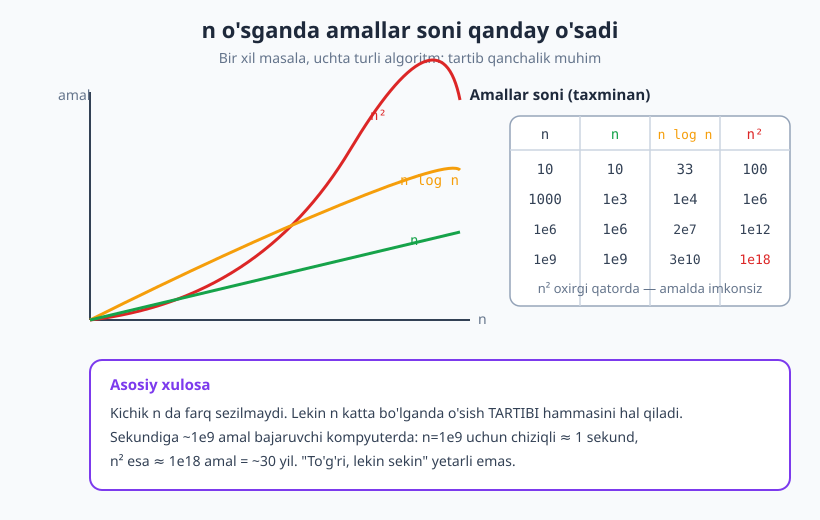
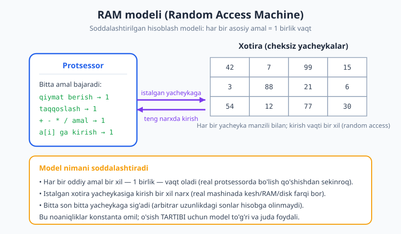
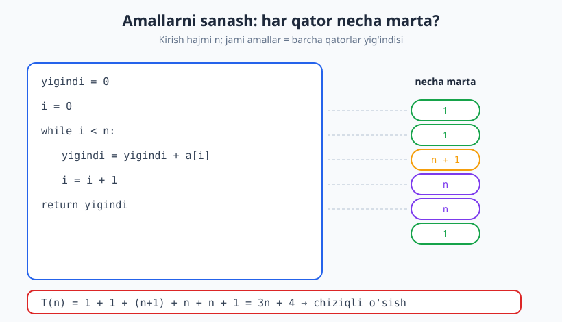

# 07 — Algoritm samaradorligi va hisoblash modeli

[⬅️ Oldingi: 06 — Rekursiya asoslari](./06-rekursiya-asoslari.md) · [🏠 README](./README.md) · [Keyingi: 08 — Asimptotik notatsiya: Big-O, Ω, Θ ➡️](./08-asimptotik-notatsiya.md)

---

> **Bu bobda:** Algoritm "to'g'ri" bo'lishi yetarli emas — u **samarali** ham bo'lishi kerak. Bu bobda biz nega tezlikni o'lchashni o'rganamiz, vaqtni oddiy soat bilan o'lchashning muammosini ko'ramiz va undan qutilish uchun **hisoblash modeli** (RAM model) hamda **asosiy amallarni sanash** usulini o'rganamiz. Natijada algoritmning tezligini bitta funksiya `T(n)` ko'rinishida ifodalashni o'rganasiz — bu keyingi bobdagi Big-O notatsiyasiga ko'prik.
>
> **Halollik / Eslatma:** Bu yerda biz amallarni *aniq* sanaymiz (`T(n) = 3n + 4` kabi) — bu mashinadan mustaqil, matematik aniq o'lchov. RAM model **soddalashtirish**: real protsessorda bo'lish qo'shishdan sekinroq, kesh xotira RAM dan tez — buni bobda ochiq aytamiz. Barcha Python namunalari haqiqatan ishga tushirilib, chiqishi tekshirilgan.

---

## Nega samaradorlik muhim: bitta masala, ikkita taqdir

Tasavvur qiling: 1 milliard (`10^9`) tartiblangan sondan iborat ro'yxatda bitta sonni qidiryapsiz. Ikki yo'l bor.

**Birinchi yo'l — chiziqli qidiruv.** Boshidan oxirigacha har bir elementni navbatma-navbat tekshirasiz. Eng yomon holatda — `10^9` ta taqqoslash.

**Ikkinchi yo'l — binar qidiruv.** Ro'yxat tartiblangani uchun har safar qolgan qismni yarmiga bo'lasiz. `10^9` ni necha marta 2 ga bo'lib 1 gacha tushirish mumkin? Bor-yo'g'i **30 marta** (chunki `2^30 ≈ 10^9`).

Endi farqni his qiling. Faraz qilaylik, mashinangiz sekundiga `10^9` ta amal bajaradi:

| Algoritm | Amallar soni | Taxminiy vaqt |
|---|---|---|
| Chiziqli qidiruv | `10^9` | ~1 sekund |
| Binar qidiruv | `30` | ko'z ochib yumguncha (~30 nanosekund) |

Bitta qidiruv uchun bir sekund ko'p tuyulmasligi mumkin. Lekin agar serveringiz sekundiga million marta qidirsa, chiziqli usul **butun mashinani band qiladi**, binar esa sezilmaydi. Yana yomonroq misol: ikkita ro'yxatdagi takrorlangan elementni "har birini har biri bilan" solishtirib topadigan `n^2` algoritm. `n = 10^9` da bu `10^18` amal — bu sekundiga `10^9` amal bajaruvchi mashinada **~30 yil**.

> **Diqqat:** "Mening kodim to'g'ri ishlayapti-ku" — bu yetarli emas. To'g'ri, lekin sekin algoritm amalda **ishlamaydigan** algoritm bilan barobar: foydalanuvchi javobni kuta-kuta ketib qoladi. Algoritmika asosan **"to'g'ri, va yetarlicha tez"** algoritm qidirish san'atidir.



Rasmda diqqat qiling: kichik `n` da uchchala egri chiziq deyarli bir-biriga yopishgan. Ikki algoritmni `n = 10` da sinab ko'rib "ikkalasi ham tez ekan" deb xulosa chiqarsangiz, adashasiz. Farq **`n` katta bo'lganda** ochiladi — va aynan o'sha yerda farq hal qiluvchi bo'ladi.

## Ikkita resurs: vaqt va xotira

Algoritm ishlash uchun ikki narsani "sarflaydi":

- **Vaqt murakkabligi (time complexity)** — algoritm necha amal bajaradi, ya'ni qancha *ishlaydi*.
- **Xotira murakkabligi (space complexity)** — algoritm qancha qo'shimcha *xotira* talab qiladi.

Ko'pincha asosiy e'tibor **vaqtga** qaratiladi, chunki amaliyotda foydalanuvchini ko'proq "sekinlik" bezovta qiladi. Lekin xotira ham muhim: telefon yoki o'rnatilgan tizimda (embedded) xotira kam, juda ko'p xotira talab qilgan algoritm umuman ishga tushmaydi. Ba'zan ular orasida **trade-off** bo'ladi: ko'proq xotira sarflab tezlikni oshirish (masalan, oldindan hisoblangan jadval) yoki teskarisi.

> **Trade-off:** Vaqt va xotira ko'pincha bir-biriga "almashtiriladi". Hash jadval ([15-bob](./15-hash-jadval.md)) qo'shimcha xotira evaziga qidiruvni `O(n)` dan `O(1)` ga tushiradi. Bu kitobda biz asosan vaqtni tahlil qilamiz, xotirani esa [09-bob](./09-murakkablikni-hisoblash.md) da batafsil ko'ramiz.

Shu bobda biz **vaqtni qanday o'lchash** masalasiga e'tibor qaratamiz — bu eng nozik savol.

## Vaqtni soatda o'lchashning muammosi

Eng tabiiy fikr: "kodni ishga tushiraylik va sekundomerni bosaylik". Python da bu shunday:

```python
import time

def yigindi(a):
    s = 0
    for x in a:
        s += x
    return s

a = list(range(1_000_000))
boshlandi = time.perf_counter()
yigindi(a)
tugadi = time.perf_counter()
print(f"vaqt: {tugadi - boshlandi:.4f} sekund")
# -> vaqt: 0.0xxx sekund  (har mashinada turlicha chiqadi)
```

Bu kod ishlaydi va vaqt beradi. **Muammo shundaki, bu raqam ko'chmas.** U quyidagilarning hammasiga bog'liq:

- **Mashina** — sizning noutbukingiz va serveringizda boshqacha chiqadi.
- **Dasturlash tili** — bir xil algoritm C da Python dan o'nlab marta tez ishlashi mumkin.
- **Kompilyator / interpretator** — optimizatsiya darajasi natijani o'zgartiradi.
- **Yuk (load)** — o'sha paytda mashinada boshqa nima ishlayotgani.
- **Kirish** — qaysi ma'lumotda o'lchaganingiz.

Demak "0.03 sekund" degan raqam **algoritm haqida emas, balki o'sha aniq tajriba haqida** gapiradi. Boshqa odam uni takrorlay olmaydi, boshqa mashinaga ko'chira olmaydi. Bizga esa **mashinadan mustaqil**, ko'chma, matematik o'lchov kerak.

> **Eslatma:** Sekundomer (real o'lchov, *benchmarking*) befoyda emas — amaliyotda u juda muhim, ayniqsa konstantalar va mashina xususiyatlarini bilish kerak bo'lganda. Lekin **algoritmni tahlil qilish** uchun bizga undan ko'ra umumiyroq narsa kerak.

Yechim oddiy va kuchli: soatni emas, **bajarilgan asosiy amallar sonini** sanaymiz. Amallar soni mashinaga bog'liq emas — u faqat algoritmga va kirish hajmiga bog'liq.

## Hisoblash modeli: RAM model

Amallarni sanash uchun "bitta amal" nima ekanini aniq belgilashimiz kerak. Buning uchun biz **hisoblash modeli** dan foydalanamiz — kompyuterning soddalashtirilgan, matematik tasviri. Eng keng tarqalgani — **RAM model** (Random Access Machine, ya'ni "tasodifiy kirishli mashina").

RAM modelining qoidalari sodda:

1. Mashinada bitta **protsessor** bor, u har vaqtda bitta amal bajaradi.
2. **Xotira** — manzillangan yacheykalar ketma-ketligi. Har bir yacheyka bitta sonni saqlaydi.
3. **Har bir oddiy amal 1 birlik vaqt** oladi (konstanta). Oddiy amallar:
   - qiymat berish: `x = 5`
   - taqqoslash: `i < n`
   - arifmetika: `a + b`, `a * b`, `a // 2`
   - massiv elementiga kirish: `a[i]` ni o'qish yoki yozish
4. **Istalgan yacheykaga kirish bir xil narx** — shuning uchun "random access" deyiladi: `a[0]` ga ham, `a[1000000]` ga ham kirish 1 birlik.



Bu model — **soddalashtirish**, va buni ochiq aytish halollik. Real mashinada:

- Bo'lish (`/`) qo'shishdan (`+`) bir necha barobar sekin.
- Keshda turgan ma'lumotga kirish asosiy RAM dan o'nlab marta tez, diskdan esa minglab marta tez.
- Juda katta sonlar (arbitrar uzunlikdagi) bitta yacheykaga sig'maydi.

> **Isbot (eskiz) — nega bu soddalashtirish baribir foydali:** RAM model e'tibordan chetda qoldiradigan farqlar (bo'lish vs qo'shish, kesh vs RAM) — bularning barchasi **konstanta omil**. Ya'ni real vaqt ≈ (konstanta) × (RAM amallar soni). Konstanta omillar `n` ga bog'liq emas. Algoritm tezligining **o'sish tartibi** (`n`, `n log n`, `n^2` ...) esa aynan `n` ga bog'liq qism. Demak RAM model o'sish tartibini **to'g'ri** beradi — biz tahlilda eng ko'p qiziqadigan narsani. Konstantalarni esa keyin, kerak bo'lsa, real o'lchov bilan aniqlaymiz.

Shunday qilib, RAM model bizga "1 amal = 1 birlik vaqt" degan barqaror, mashinadan mustaqil o'lchov beradi. Endi haqiqiy ishni boshlaymiz: amallarni sanash.

## Amallarni sanash: har qator necha marta bajariladi?

Asosiy g'oya juda mexanik: kodning **har bir qatori necha marta bajarilishini** yozib chiqamiz, so'ng hammasini qo'shamiz. Avval eng oddiy holdan boshlaymiz.

### 1-misol: chiziqli o'tish (n amal)

Massiv elementlari yig'indisini hisoblaymiz:

```text
yigindi = 0              # 1 marta
i = 0                    # 1 marta
while i < n:             # shart: n+1 marta (n rost + 1 yolg'on)
    yigindi = yigindi + a[i]   # n marta
    i = i + 1            # n marta
return yigindi           # 1 marta
```



Diqqat qilinadigan nozik joy — **shart qatori `n+1` marta** bajariladi: sikl tanasiga `n` marta kirish uchun shart `n` marta rost chiqadi, va sikldan chiqish uchun yana 1 marta yolg'on chiqadi. Endi qo'shamiz:

```text
T(n) = 1 + 1 + (n + 1) + n + n + 1 = 3n + 4
```

Mana, bizning birinchi **vaqt funksiyamiz**: `T(n) = 3n + 4`. Buni Python bilan tekshiraylik — sanagich (`amal`) qo'shib, haqiqatan `3n + 4` chiqishini ko'ramiz:

```python
def chiziqli_yigindi(a):
    n = len(a)
    amal = 0
    yigindi = 0;  amal += 1          # 1 marta
    i = 0;        amal += 1          # 1 marta
    while i < n:
        amal += 1                    # shart rost: n marta
        yigindi += a[i];  amal += 1  # n marta
        i += 1;           amal += 1  # n marta
    amal += 1                        # shart yolg'on: oxirgi 1 marta
    amal += 1                        # return: 1 marta
    return yigindi, amal

for n in [1, 5, 10, 100]:
    a = list(range(n))
    s, amal = chiziqli_yigindi(a)
    print(f"n={n:<4} amal={amal:<5} 3n+4={3*n+4}")
# -> n=1    amal=7     3n+4=7
# -> n=5    amal=19    3n+4=19
# -> n=10   amal=34    3n+4=34
# -> n=100  amal=304   3n+4=304
```

Ajoyib — sanagich har bir `n` uchun aynan `3n + 4` chiqdi. Bu `T(n)` ning kirish hajmiga **chiziqli** bog'liqligini ko'rsatadi: `n` ikki barobar oshsa, `T(n)` ham (taxminan) ikki barobar oshadi.

### 2-misol: ichma-ich sikl (n² amal)

Endi massivda **takror elementlar** bormi tekshiraylik — har bir juftlikni solishtiramiz:

```text
for i = 0 .. n-1:
    for j = i+1 .. n-1:
        if a[i] == a[j]:   # bu taqqoslash necha marta?
            ...
```

Ichki sikl `i = 0` da `n-1` marta, `i = 1` da `n-2` marta, ..., `i = n-1` da 0 marta ishlaydi. Demak taqqoslashlar soni:

```text
(n-1) + (n-2) + ... + 1 + 0 = n(n-1)/2
```

Bu `n(n-1)/2 = (n² - n)/2` — ya'ni `n²` ga proporsional, **kvadratik** o'sish. Python bilan tasdiqlaymiz:

```python
def juftliklar_soni(a):
    n = len(a)
    amal = 0
    for i in range(n):
        for j in range(i + 1, n):
            amal += 1            # har bir juftlik uchun bitta taqqoslash
    return amal

print("n     amal      n(n-1)/2")
for n in [4, 10, 100, 1000]:
    a = list(range(n))
    amal = juftliklar_soni(a)
    print(f"{n:<5} {amal:<9} {n*(n-1)//2}")
# -> n     amal      n(n-1)/2
# -> 4     6         6
# -> 10    45        45
# -> 100   4950      4950
# -> 1000  499500    499500
```

Sanagich aynan `n(n-1)/2` chiqdi. E'tibor bering: `n` 10 dan 100 ga (10 barobar) oshganda, amallar soni 45 dan 4950 ga (~110 barobar) oshdi — chunki kvadratik o'sishda `n` ni 10 barobar oshirish amallarni ~100 barobar oshiradi.

### 3-misol: yarmiga bo'linib boruvchi (log n amal)

Ba'zi algoritmlar har qadamda muammoni **yarmiga qisqartiradi** (masalan, binar qidiruv — [28-bob](./28-qidiruv-algoritmlari.md)). Soddaroq misol: `n` ni necha marta 2 ga bo'lib 1 gacha tushiramiz?

```text
while n > 1:
    n = n // 2
```

`n` har qadamda yarmiga tushadi: `n → n/2 → n/4 → ...`. `k` qadamdan keyin `n / 2^k`. Bu 1 ga teng bo'lganda `2^k = n`, ya'ni `k = log₂ n`. Demak sikl **`⌊log₂ n⌋` marta** ishlaydi — `n` million bo'lsa ham bor-yo'g'i ~20 qadam:

```python
import math

def yarimga_bolish(n):
    amal = 0
    while n > 1:
        n = n // 2
        amal += 1
    return amal

print("n        amal   floor(log2 n)")
for n in [1, 2, 8, 16, 1000, 1_000_000]:
    print(f"{n:<8} {yarimga_bolish(n):<6} {math.floor(math.log2(n))}")
# -> n        amal   floor(log2 n)
# -> 1        0      0
# -> 2        1      1
# -> 8        3      3
# -> 16       4      4
# -> 1000     9      9
# -> 1000000  19     19
```

`n = 1000000` uchun atigi 19 qadam — logaritmik o'sish ajoyib darajada sekin o'sadi. Aynan shu sabab binar qidiruv 1 milliard elementda ham deyarli bir zumda ishlaydi.

## Vaqtni funksiya sifatida ifodalash: T(n)

Yuqoridagi misollardan umumiy g'oya tug'iladi. Algoritmning vaqt sarfini **kirish hajmiga bog'liq funksiya** sifatida yozamiz:

```text
T(n) = (kirish hajmi n bo'lganda bajariladigan asosiy amallar soni)
```

Bizning misollarimizda:

| Algoritm | `T(n)` | O'sish turi |
|---|---|---|
| Chiziqli yig'indi | `3n + 4` | chiziqli |
| Juftliklarni solishtirish | `n(n-1)/2 = 0.5n² − 0.5n` | kvadratik |
| Yarmiga bo'lish | `⌊log₂ n⌋` | logaritmik |

`T(n)` — algoritmning "pasporti". U mashinaga, tilga, kompilyatorga bog'liq emas; faqat algoritmning o'ziga va `n` ga bog'liq. Endi ikki algoritmni adolatli solishtirishimiz mumkin: sekundomersiz, faqat `T(n)` larini taqqoslab.

> **Eslatma:** Ko'pincha `T(n)` aniq emas, balki **holatga** bog'liq bo'ladi: eng yaxshi, eng yomon va o'rtacha holat farq qiladi (masalan, qidiruv elementni birinchi qadamdayoq topishi yoki umuman topmasligi mumkin). Buni [09-bob](./09-murakkablikni-hisoblash.md) da batafsil ko'ramiz. Hozircha biz odatda **eng yomon holatni** sanaymiz — chunki u "kafolatli yuqori chegara" beradi.

## Konstantalar va past tartibli a'zolar nega muhim emas

`T(n) = 3n + 4` ni yozdik. Lekin `3` va `+4` qayerdan keldi? Ular bizning **qanday sanaganimizga** bog'liq. Agar siz `yigindi += a[i]` ni ikkita amal (bitta qo'shish + bitta qiymat berish) deb sanasangiz, koeffitsient o'zgaradi. Agar Python `range` ichidagi yashirin amallarni ham sanasak — yana o'zgaradi. Ya'ni `3` koeffitsienti **modelga va sanash uslubiga bog'liq**, algoritmning chuqur xususiyati emas.

Bundan tashqari, `n` katta bo'lganda `+4` mutlaqo ahamiyatsiz bo'lib qoladi:

```text
n = 1000:     3n + 4 = 3004     →  "+4" hissasi: 0.13%
n = 1000000:  3n + 4 = 3000004  →  "+4" hissasi: 0.0001%
```

Va `0.5n² − 0.5n` da, `n` katta bo'lganda `0.5n²` butunlay hukmronlik qiladi — `−0.5n` ahamiyatsiz:

```text
n = 1000:     0.5n² − 0.5n = 500000 − 500 = 499500   →  n² a'zosi 99.9%
```

Shu sababli, algoritmlar tahlilida biz odatda **eng tez o'suvchi a'zoni saqlab, koeffitsient va past tartibli a'zolarni tashlaymiz**:

```text
3n + 4          →  o'sish tartibi: n
0.5n² − 0.5n    →  o'sish tartibi: n²
⌊log₂ n⌋        →  o'sish tartibi: log n
```

Bu — keyingi bobning yuragi: **asimptotik notatsiya** (Big-O), bu yerda `3n + 4` ni shunchaki `O(n)` deb yozamiz. To'liq matematik ta'rifni [08-bobda](./08-asimptotik-notatsiya.md) ko'ramiz.

> **Diqqat:** "Konstantalar muhim emas" degani — ular **mavjud emas** degani EMAS. Real dasturda 2x tezroq konstanta ham qadrli. Lekin ikki algoritmni *solishtirayotganda*, agar biri `O(n)` va ikkinchisi `O(n²)` bo'lsa, qaysi konstantasi kichikligidan qat'i nazar, yetarlicha katta `n` da `O(n)` g'olib. Konstanta — "qancha", o'sish tartibi — "qanchaga"; ikkinchisi taqdirni hal qiladi.

Quyidagi tajriba buni yorqin ko'rsatadi. `n` ni **ikki barobar** oshirganda, chiziqli algoritmda amallar 2 barobar, kvadratikda esa 4 barobar oshadi — bu o'sish tartibining "barmoq izi":

```python
def chiziqli_amal(n):      # T(n) ~ n
    c = 0
    for i in range(n):
        c += 1
    return c

def kvadrat_amal(n):       # T(n) ~ n^2
    c = 0
    for i in range(n):
        for j in range(n):
            c += 1
    return c

print("n       chiziqli  nisbat | kvadrat   nisbat")
prev_l = prev_k = None
for n in [100, 200, 400, 800]:
    l = chiziqli_amal(n)
    k = kvadrat_amal(n)
    rl = f"{l/prev_l:.1f}x" if prev_l else "  -"
    rk = f"{k/prev_k:.1f}x" if prev_k else "  -"
    print(f"{n:<7} {l:<9} {rl:<6} | {k:<9} {rk}")
    prev_l, prev_k = l, k
# -> n       chiziqli  nisbat | kvadrat   nisbat
# -> 100     100         -    | 10000       -
# -> 200     200       2.0x   | 40000     4.0x
# -> 400     400       2.0x   | 160000    4.0x
# -> 800     800       2.0x   | 640000    4.0x
```

Mana o'sish tartibining mohiyati: chiziqli — `2x`, kvadratik — `4x`. Bu nisbatlar koeffitsientga umuman bog'liq emas; ular faqat funksiya shaklidan kelib chiqadi.

## "Kirish hajmi" (n) aslida nima?

Biz `T(n)` deganimizda `n` — **kirish hajmi**. Lekin "hajm" har masalada turlicha o'lchanadi, va buni to'g'ri tanlash muhim:

- **Massiv/ro'yxatni saralash:** `n` = elementlar soni.
- **Grafda qidiruv** ([29-bob](./29-graf-algoritmlari-1.md)): hajm ikki sondan iborat — tugunlar soni `V` va qirralar soni `E`. `T(V, E)` ko'rinishida yoziladi.
- **Tub son tekshirish:** `n` = **sonning bitlar soni** (uning kattaligi emas!). Chunki `n` qiymatdagi son `log₂ n` bit egallaydi va algoritm bitlar ustida ishlaydi.
- **Matn (string) bilan ishlash** ([31-bob](./31-string-algoritmlari.md)): `n` = belgilar soni.

> **Diqqat:** Eng ko'p uchraydigan xato — sonni va uning bitlar uzunligini chalkashtirish. "Sonni 2 gacha kamaytirib boruvchi sikl `log n` marta ishlaydi" deganda `n` — *qiymat*. Lekin agar `n` *bitlar soni* bilan o'lchansa, o'sha sikl `n` marta ishlaydi. Tahlilni boshlashdan oldin har doim "`n` aniq nimani anglatadi?" deb so'rang.

Asosiy qoida: `n` shunday tanlanadiki, u **kirishni tasvirlash uchun zarur ma'lumot miqdorini** aks ettirsin.

## Asosiy g'oyalar (bobni qisqacha)

- Algoritm faqat **to'g'ri** emas, **samarali** ham bo'lishi shart: bir masalaning ikki algoritmi sekundlar va yillar farq qilishi mumkin (chiziqli vs binar qidiruv `10^9` elementda).
- Ikki resurs bor: **vaqt** va **xotira** murakkabligi. Odatda asosiy e'tibor vaqtga.
- Vaqtni **soatda o'lchash ko'chmas**: mashina, til, kompilyator, yukga bog'liq. Shuning uchun **mashinadan mustaqil** o'lchov — **asosiy amallar sonini sanash** kerak.
- **RAM model:** har bir oddiy amal (qiymat berish, taqqoslash, arifmetika, `a[i]` ga kirish) = 1 birlik vaqt. Bu soddalashtirish, lekin o'sish tartibini to'g'ri beradi.
- Amallarni sanab, vaqtni **funksiya** sifatida yozamiz: `T(n)`. Misollar: chiziqli `3n + 4`, ichma-ich sikl `n(n-1)/2`, yarmiga bo'lish `⌊log₂ n⌋`.
- `n` katta bo'lganda **koeffitsient va past tartibli a'zolar ahamiyatsiz**; eng tez o'suvchi a'zo (o'sish tartibi) hal qiladi → [08-bob](./08-asimptotik-notatsiya.md) (Big-O).
- **Kirish hajmi `n`** har masalada turlicha: elementlar soni, bitlar soni, tugun/qirralar soni.

## Mashqlar

### Oson

**1-mashq.** Quyidagi kod uchun har bir qator necha marta bajarilishini sanab, `T(n)` ni `an + b` ko'rinishida toping:

```text
m = a[0]                 # 1 marta
i = 1                    # 1 marta
while i < n:             # ?
    if a[i] > m:         # ?
        m = a[i]         # ?
    i = i + 1            # ?
return m                 # 1 marta
```

(`if` ichidagi `m = a[i]` eng yomon holatda — massiv o'suvchi tartibda bo'lganda — har safar bajariladi deb hisoblang.)

**2-mashq.** Quyidagi `T(n)` larning har biri uchun o'sish tartibini (koeffitsient va past a'zolarsiz) yozing: `(a)` `T(n) = 7n + 100`, `(b)` `T(n) = 2n² + 3n + 50`, `(c)` `T(n) = 5`, `(d)` `T(n) = 4n log n + n`.

**3-mashq.** RAM modelda quyidagi amallardan qaysilari "1 birlik vaqt" deb hisoblanadi, qaysilari yo'q? `(a)` `x = y + 1`, `(b)` `a[i]` ni o'qish, `(c)` `n` elementli massivni nusxalash, `(d)` ikki sonni taqqoslash.

### O'rta

**4-mashq.** Ikki algoritm bir masalani yechadi: birinchisining `T(n) = 100n`, ikkinchisining `T(n) = n²`. `(a)` Qaysi biri `n = 50` da kamroq amal bajaradi? `(b)` Qaysi `n` dan boshlab birinchisi (chiziqli) doimo afzal bo'ladi? `(c)` `n = 10^6` da har birining amallar sonini taqqoslang.

**5-mashq.** Quyidagi kod necha marta `print` chaqiradi (`n` funksiyasi sifatida)? Javobni soddalashtiring va o'sish tartibini toping:

```text
for i = 1 .. n:
    for j = 1 .. i:
        print(i, j)
```

**6-mashq.** Sekundiga `10^9` amal bajaruvchi mashinada quyidagi algoritmlar `n = 10^6` uchun taxminan qancha vaqt ishlaydi? `(a)` `T(n) = n`, `(b)` `T(n) = n log₂ n`, `(c)` `T(n) = n²`. Javobni sekund yoki yilda bering.

### Qiyin

**7-mashq.** Quyidagi uch karra ichma-ich sikl tanasi (`amal`) necha marta bajariladi? Aniq yopiq formula (yig'indi orqali) chiqaring:

```text
for i = 1 .. n:
    for j = 1 .. n:
        for k = 1 .. n:
            amal
```

So'ng tushuntiring: nega bu yerda yig'indini aniq hisoblash shart emas, agar bizga faqat o'sish tartibi kerak bo'lsa?

**8-mashq.** RAM modelning bitta cheklovini muhokama qiling: model "`a[i]` ga kirish 1 birlik" deydi, lekin real mashinada kesh (cache) tufayli **ketma-ket** kirish (`a[0], a[1], a[2], ...`) **tasodifiy** kirishdan ancha tez. `(a)` Bu nega RAM modelni "noto'g'ri" qilmaydi (o'sish tartibi nuqtai nazaridan)? `(b)` Qaysi vaziyatda bu farq amalda muhim bo'lib qoladi va dasturchi buni hisobga olishi kerak?

<details markdown="1">
<summary>Yechimlar</summary>

### 1-mashq yechimi

Sanaymiz (`m = a[0]`: 1; `i = 1`: 1; `while`: `n+1` marta — `n` rost + 1 yolg'on; `if a[i] > m`: sikl tanasi `n-1` marta ishlaganligi uchun `n-1`; `m = a[i]` eng yomon holatda `n-1`; `i = i+1`: `n-1`; `return`: 1):

```text
T(n) = 1 + 1 + (n+1) + (n-1) + (n-1) + (n-1) + 1 = 4n - 0 ... hisoblaymiz:
     = 1 + 1 + n + 1 + n - 1 + n - 1 + n - 1 + 1 = 4n + 1
```

Demak `T(n) = 4n + 1` — chiziqli (`a = 4`, `b = 1`). Aniq koeffitsient sanash uslubiga bog'liq, lekin o'sish tartibi `n`.

### 2-mashq yechimi

Eng tez o'suvchi a'zoni saqlab qolamiz, koeffitsient va past a'zolarni tashlaymiz:

- `(a)` `7n + 100` → o'sish tartibi **`n`** (chiziqli).
- `(b)` `2n² + 3n + 50` → o'sish tartibi **`n²`** (kvadratik).
- `(c)` `5` → o'sish tartibi **`1`** (konstanta — `n` ga umuman bog'liq emas).
- `(d)` `4n log n + n` → o'sish tartibi **`n log n`** (chunki `n log n` `n` dan tez o'sadi).

### 3-mashq yechimi

- `(a)` `x = y + 1` — **1 birlik** (bitta qo'shish + bitta qiymat berish; konstanta sonli oddiy amal).
- `(b)` `a[i]` ni o'qish — **1 birlik** (random access, manzilga bevosita kirish).
- `(c)` `n` elementli massivni nusxalash — **1 birlik EMAS**: bu `n` ta yacheykani ko'chiradi, ya'ni `O(n)` amal. Bu yashirin "qimmat" amal — tahlilda ko'pincha unutiladi.
- `(d)` ikki sonni taqqoslash — **1 birlik**.

### 4-mashq yechimi

- `(a)` `n = 50`: chiziqli `100 · 50 = 5000`; kvadratik `50² = 2500`. **`n = 50` da kvadratik kamroq** amal bajaradi (2500 < 5000)! Bu konstanta koeffitsient kichik `n` da hal qiluvchi bo'lishiga misol.
- `(b)` `100n < n²` qachon? Ikkala tomonni `n` ga bo'lamiz (`n > 0`): `100 < n`, ya'ni **`n > 100`** dan boshlab chiziqli doimo afzal. `n = 100` da teng (`10000 = 10000`).
- `(c)` `n = 10^6`: chiziqli `100 · 10^6 = 10^8`; kvadratik `(10^6)² = 10^12`. Kvadratik **10000 barobar** ko'p amal bajaradi. Yetarlicha katta `n` da o'sish tartibi konstantani yengadi.

### 5-mashq yechimi

Tashqi sikl `i = 1 .. n`. Ichki sikl `i` ga `i` marta ishlaydi (`j = 1 .. i`). Demak `print` lar soni:

```text
1 + 2 + 3 + ... + n = n(n+1)/2
```

Bu mashhur arifmetik yig'indi formulasi. `n(n+1)/2 = 0.5n² + 0.5n` → o'sish tartibi **`n²`** (kvadratik). E'tibor: ichki sikl o'zgaruvchan (`i` ga bog'liq) bo'lsa ham, jami baribir kvadratik — chunki o'rtacha ichki sikl `~n/2` marta ishlaydi va tashqi `n` marta.

### 6-mashq yechimi

Mashina sekundiga `10^9` amal. `n = 10^6`:

- `(a)` `T = n = 10^6` amal → `10^6 / 10^9 = 10^(-3)` sekund = **~0.001 sekund** (1 millisekund).
- `(b)` `T = n log₂ n = 10^6 · log₂(10^6) ≈ 10^6 · 20 = 2 · 10^7` amal → `2·10^7 / 10^9 = 0.02` sekund = **~20 millisekund**.
- `(c)` `T = n² = (10^6)² = 10^12` amal → `10^12 / 10^9 = 10^3` sekund = **~1000 sekund ≈ 17 daqiqa**.

Xulosa: bir xil `n = 10^6` da chiziqli bir zumda, kvadratik esa o'n daqiqalar — amalda foydalanib bo'lmaydigan farq.

### 7-mashq yechimi

Har bir sikl mustaqil ravishda `1 .. n` (ya'ni `n` marta) ishlaydi, va ular ichma-ich. Demak tana bajarilish soni — ko'paytma:

```text
n × n × n = n³
```

Yig'indi orqali yozsak: `Σ(i=1..n) Σ(j=1..n) Σ(k=1..n) 1 = n³`. Bu kub murakkablik, o'sish tartibi **`n³`**.

Nega aniq formula shart emas (faqat o'sish tartibi kerak bo'lsa): o'sish tartibini topish uchun **eng chuqur joylashgan amal necha marta takrorlanishini** baholash kifoya. Bu yerda har bir sikl `n` ga proporsional bo'lib, ular ko'paytirilgani uchun natija `n³` ga proporsional — aniq yig'indini hisoblamasdan ham buni ko'rish mumkin. Aniq koeffitsient ([08-bob](./08-asimptotik-notatsiya.md) da ko'rsatilganidek) Big-O da baribir tashlanadi: `T(n) = n³` ham, `T(n) = 7n³ + 2n` ham — ikkalasi `O(n³)`.

### 8-mashq yechimi

- `(a)` **Nega RAM modeli baribir "noto'g'ri" emas:** kesh tufayli ketma-ket kirish tasodifiy kirishdan, aytaylik, 10 barobar tez bo'lsin. Bu **konstanta omil** (`n` ga bog'liq emas). Demak real vaqt ≈ (konstanta) × (RAM amallar soni), va o'sish tartibi (`n`, `n log n`, `n²` ...) o'zgarmaydi. RAM model aynan o'sish tartibini to'g'ri bashorat qilish uchun mo'ljallangan — u konstantalarni ataylab e'tiborga olmaydi.
- `(b)` **Qachon amalda muhim:** ikki algoritmning **bir xil o'sish tartibi** bo'lganda (masalan, ikkalasi ham `O(n)`), tahlil ularni "teng" deydi, lekin xotiraga ketma-ket kiradigani keshni yaxshi ishlatgani uchun amalda bir necha barobar tez bo'lishi mumkin. Misol: massiv ([12-bob](./12-massiv-dinamik-massiv.md)) elementlari xotirada uzluksiz yotgani uchun ularni ketma-ket o'tish bog'langan ro'yxatdan ([13-bob](./13-boglangan-royxatlar.md)) tez — ikkalasining ham o'tishi `O(n)` bo'lsa-da. Shu sababli ishlash darajasi muhim bo'lgan dasturda (masalan, yuqori unumli hisoblash) dasturchi RAM modeldan tashqariga chiqib, xotira joylashuvini ham hisobga oladi.

</details>

---

[⬅️ Oldingi: 06 — Rekursiya asoslari](./06-rekursiya-asoslari.md) · [🏠 README](./README.md) · [Keyingi: 08 — Asimptotik notatsiya: Big-O, Ω, Θ ➡️](./08-asimptotik-notatsiya.md)
