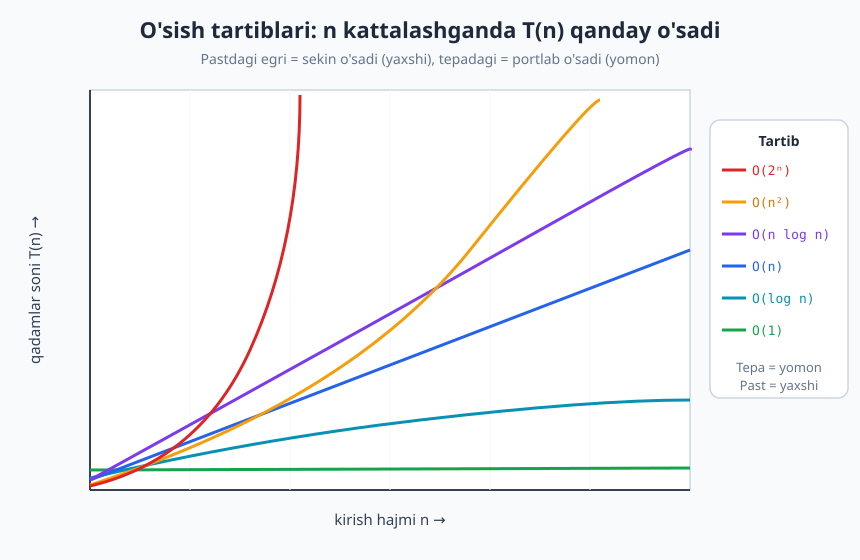
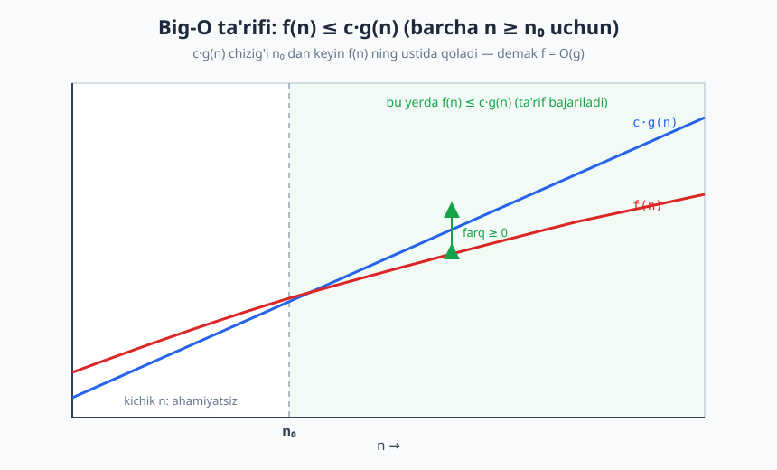
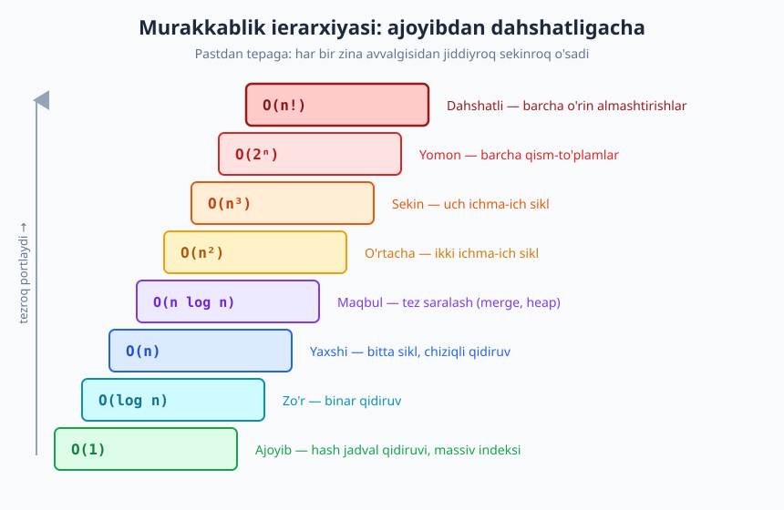

# 08 — Asimptotik notatsiya: Big-O, Ω, Θ

[⬅️ Oldingi: 07 — Algoritm samaradorligi va hisoblash modeli](./07-samaradorlik-hisoblash-modeli.md) · [🏠 README](./README.md) · [Keyingi: 09 — Murakkablikni hisoblash: vaqt va xotira ➡️](./09-murakkablikni-hisoblash.md)

---

> **Bu bobda:** algoritmlarning tezligini taqqoslashning umumiy tili — asimptotik notatsiya bilan tanishamiz. Big-O (yuqori chegara), Big-Omega (quyi chegara) va Big-Theta (aniq chegara) ta'riflarini matematik aniqlik bilan beramiz, ularni vizual va sodda isbotlar orqali tushuntiramiz, o'sish tartiblari katalogini quramiz va soddalashtirish qoidalarini chiqaramiz.
>
> **Halollik / Eslatma:** O, Ω, Θ ta'riflari bu yerda standart matematik shaklda (kvantorlar bilan) berilgan va isbotlar to'liq. "n=10⁶ da qancha vaqt" baholari taxminiy his uchun (1 milliard amal/sekund faraziga asoslangan). Barcha Python namunalari haqiqatan ishga tushirib, chiqishi tekshirilgan.

---

## Nega bizga umumiy til kerak

[Oldingi bobda](./07-samaradorlik-hisoblash-modeli.md) algoritmni qadamlar soni bilan o'lchashni o'rgandik. Lekin "bu algoritm 3n+2 qadam, anavisi 5n+10 qadam bajaradi" deyish noqulay: qadamlar soni kompyuterga, dasturlash tiliga, hatto kun isib ketishiga ham bog'liq. Bizga **mashinadan mustaqil**, **kichik tafsilotlardan ozod** til kerak — faqat "kirish kattalashganda algoritm qanchalik tez sekinlashadi" degan savolga javob beradigan til.

Aynan shu til — **asimptotik notatsiya**. "Asimptotik" so'zi "cheksizlikka intilganda xulq-atvor" degani. Biz `n → ∞` (n cheksizlikka intilganda) algoritmning **o'sish tezligini** o'rganamiz, aniq qiymatini emas.

> **Asosiy g'oya.** Katta n da algoritm qanchalik tez sekinlashishi muhim, kichik n dagi aniq qadamlar emas. n=5 da har qanday algoritm tez ishlaydi; farq n=1 000 000 da bilinadi.

Ikkita narsani tashlab yuboramiz:

1. **Konstanta koeffitsiyentlar.** `3n` va `100n` — ikkalasi ham "chiziqli" o'sadi. Konstanta (3 yoki 100) mashinaga, til tezligiga bog'liq; o'sish *shakli* esa bog'liq emas.
2. **Kichik (past tartibli) a'zolar.** `2n² + 100n + 5000` da katta n uchun faqat `n²` muhim. Buni ko'rib chiqaylik — pastdagi jadval `2n²` a'zosi butun ifodaning necha foizini tashkil qilishini ko'rsatadi:

```python
# 2n^2 + 100n + 5000 da hukmron a'zo qachon g'olib chiqadi?
def f(n):
    return 2*n**2 + 100*n + 5000

for n in [1, 10, 100, 1000, 100000]:
    butun = f(n)
    bosh = 2*n**2
    ulush = bosh / butun * 100
    print(f"n={n:>7}:  f(n)={butun:>16,}   2n^2 ulushi = {ulush:5.1f}%")
# -> n=      1:  f(n)=           5,102   2n^2 ulushi =   0.0%
# -> n=     10:  f(n)=           6,200   2n^2 ulushi =   3.2%
# -> n=    100:  f(n)=          35,000   2n^2 ulushi =  57.1%
# -> n=   1000:  f(n)=       2,105,000   2n^2 ulushi =  95.0%
# -> n= 100000:  f(n)=  20,010,005,000   2n^2 ulushi = 100.0%
```

n kichik bo'lganda `+5000` a'zosi hammasini bosadi. Lekin n o'sgani sayin `2n²` a'zosi hukmronlik qiladi — n=100 000 da u amalda butun ifodaning 100% ini tashkil etadi. Shuning uchun "katta n da xulq-atvor" haqida gapirganda boshqa a'zolarni tashlab, faqat `n²` ni saqlaymiz. Bu — asimptotik tahlilning yuragi.

---

## O'sish tartiblarini ko'z bilan ko'rish

Eng muhim funksiyalar (sekindan tezgacha o'sadi) bitta grafikda:



Diqqat qiling: kichik n da egrilar bir-biriga yaqin — bu yerda hammasi "tez" ishlaydi. Lekin n o'ngga siljigani sayin ular ajraladi. `O(2ⁿ)` deyarli vertikal ravishda yuqoriga otiladi, `O(1)` esa pastda yotib qoladi. Aynan shu **ajralish** asimptotik tahlilning ma'nosi: katta n da tartiblar orasidagi farq ulkan bo'ladi.

Endi har bir tartibni qat'iy ta'riflashga o'tamiz.

---

## Big-O (O) — yuqori chegara

**Intuitsiya.** `f(n) = O(g(n))` degani: "f, g dan tezroq o'smaydi" yoki "g — f uchun tepa shift". Bu kafolat: algoritm *ko'pi bilan* shuncha sekin ishlaydi, undan battar emas.

**Aniq matematik ta'rif.** `f(n) = O(g(n))` agar shunday musbat konstanta `c > 0` va boshlang'ich nuqta `n₀ ≥ 1` topilsaki:

```text
f(n) ≤ c · g(n)     barcha n ≥ n₀ uchun
```

Ya'ni biror joydan (n₀ dan) boshlab f egri chizig'i `c·g(n)` egri chizig'ining ostida (yoki ustida emas) qoladi. Buni vizual ko'ramiz:



E'tibor bering, ta'rifda ikkita "moslashuvchanlik" bor:

- **`c` ni xohlagancha katta tanlash mumkin.** Shuning uchun konstanta koeffitsiyentlar yo'qoladi: `100n = O(n)`, chunki `c = 100` ni olamiz.
- **Faqat `n ≥ n₀` muhim.** Kichik n da f, `c·g` dan oshib ketishi mumkin — bizga farqi yo'q. Aynan shu sababdan past tartibli a'zolar yo'qoladi.

> **Diqqat — keng tarqalgan tushunmovchilik.** `f(n) = O(g(n))` dagi "=" belgisi *tenglik emas*. To'g'rirog'i `f ∈ O(g)` ("f, O(g) to'plamiga tegishli") deb o'qish kerak: O(g) — g dan tez o'smaydigan barcha funksiyalar to'plami. An'ana bo'yicha "=" yoziladi, lekin bu chap-o'ngni almashtirish mumkin degani emas: `O(n) = n` deyish noto'g'ri.

### Isbot misoli 1: 3n + 2 = O(n)

`g(n) = n` deb olamiz. `c` va `n₀` topishimiz kerakki, `3n + 2 ≤ c·n` bo'lsin.

`n ≥ 1` da `2 ≤ 2n` (chunki `2n ≥ 2`). Demak:

```text
3n + 2 ≤ 3n + 2n = 5n
```

Shunday qilib `c = 5`, `n₀ = 1` ni tanlasak, barcha `n ≥ 1` uchun `3n + 2 ≤ 5n`. Ta'rif bajarildi, demak **3n + 2 = O(n)**. ∎

> **Isbot (eskiz) — texnika.** Past tartibli a'zoni (bu yerda `+2`) hukmron a'zoga "yutqazib yuborish" — eng oddiy usul. `2 ≤ 2n` deb `2` ni `n` koeffitsiyentiga aylantirdik, keyin koeffitsiyentlarni qo'shdik. `c` ning aniq qiymati muhim emas — uning *mavjudligi* muhim.

### Isbot misoli 2: 2n² + 3n + 1 = O(n²)

`g(n) = n²`. `n ≥ 1` da `n ≤ n²` va `1 ≤ n²`. Demak:

```text
2n² + 3n + 1 ≤ 2n² + 3n² + n² = 6n²
```

`c = 6`, `n₀ = 1` bilan `2n² + 3n + 1 ≤ 6n²` barcha `n ≥ 1` uchun. Demak **2n² + 3n + 1 = O(n²)**. ∎

Diqqat: `2n² + 3n + 1 = O(n³)` ham, `= O(n⁵)` ham to'g'ri (chunki O — yuqori chegara, undan kattaroq chegara ham haqiqiy). Lekin **eng aniq** (eng kichik) yuqori chegara `O(n²)`. Amalda biz har doim eng aniq chegarani aytamiz.

---

## Big-Omega (Ω) — quyi chegara

**Intuitsiya.** `f(n) = Ω(g(n))` degani: "f, g dan sekinroq o'smaydi" yoki "g — f uchun pol (eng past chegara)". Bu kafolat: algoritm *kamida* shuncha sekin ishlaydi.

**Aniq ta'rif.** `f(n) = Ω(g(n))` agar shunday `c > 0` va `n₀ ≥ 1` topilsaki:

```text
f(n) ≥ c · g(n)     barcha n ≥ n₀ uchun
```

Ω — O ning oynadagi aksi: tengsizlik yo'nalishi teskari (`≥`).

### Isbot misoli: 3n + 2 = Ω(n)

`g(n) = n`. Barcha `n ≥ 1` da `3n + 2 ≥ 3n` (chunki `+2 ≥ 0`). Demak `c = 3`, `n₀ = 1` bilan `3n + 2 ≥ 3·n`. Demak **3n + 2 = Ω(n)**. ∎

Mana muhim kuzatuv: `3n + 2` ham `O(n)`, ham `Ω(n)`. Pastdan ham, tepadan ham `n` bilan qisilgan. Bu bizni keyingi — eng aniq tushunchaga olib keladi.

---

## Big-Theta (Θ) — aniq chegara

**Intuitsiya.** `f(n) = Θ(g(n))` degani: "f xuddi g kabi tartibda o'sadi" — na tezroq, na sekinroq. g — f ni ikki tomondan (yuqoridan va pastdan) qisib turadi.

**Ta'rif.** `f(n) = Θ(g(n))` agar `f(n) = O(g(n))` **va** `f(n) = Ω(g(n))` bo'lsa. Ekvivalent shaklda: shunday `c₁ > 0`, `c₂ > 0` va `n₀` topilsaki:

```text
c₁ · g(n) ≤ f(n) ≤ c₂ · g(n)     barcha n ≥ n₀ uchun
```

Ya'ni f, `g` ning ikkita nusxasi (`c₁·g` va `c₂·g`) orasiga "sendvich" qilingan.

### Isbot misoli: 3n + 2 = Θ(n)

Yuqorida ikkita yarmini allaqachon isbotladik:

- **Yuqori chegara (O):** `3n + 2 ≤ 5n` (`c₂ = 5`).
- **Quyi chegara (Ω):** `3n + 2 ≥ 3n` (`c₁ = 3`).

Ikkalasini birlashtiramiz: barcha `n ≥ 1` uchun

```text
3·n ≤ 3n + 2 ≤ 5·n
```

`c₁ = 3`, `c₂ = 5`, `n₀ = 1`. Demak **3n + 2 = Θ(n)**. ∎

> **Eslatma — biz aslida ko'pincha Θ ni nazarda tutamiz.** Kundalik suhbatda "bu algoritm O(n)" deganda odatda "u aniq chiziqli, ya'ni Θ(n)" demoqchi bo'lamiz. O texnik jihatdan faqat yuqori chegarani kafolatlaydi, lekin amalda eng aniq chegarani aytadigan bo'lsak, u Θ ham bo'ladi. Θ — eng informativ tushuncha; uni ishlatish odatga aylansa yaxshi.

---

## O vs Ω vs Θ — farqni yodda saqlash

Bu uchtasini chalkashtirish — eng keng tarqalgan xato. Oddiy analogiya: yoshingiz haqida gapiramiz.

| Notatsiya | Ma'nosi | Analogiya | Tengsizlik |
|---|---|---|---|
| `O(g)` | g dan tez emas (yuqori chegara) | "Yoshim ≤ 30" | `f ≤ c·g` |
| `Ω(g)` | g dan sekin emas (quyi chegara) | "Yoshim ≥ 18" | `f ≥ c·g` |
| `Θ(g)` | aynan g tartibda (aniq) | "Yoshim aynan 25" | `c₁·g ≤ f ≤ c₂·g` |

"Yoshim ≤ 30" rost bo'lsa, "yoshim ≤ 100" ham rost — lekin foydasiz. Xuddi shunday, `f = O(n²)` rost bo'lsa, `f = O(n⁵)` ham rost, ammo aniqligi yo'qoladi. Shuning uchun **eng aniq** chegarani aytishga harakat qiling.

> **Diqqat — eng muhim nuance: "eng yomon holat" ≠ "Big-O".** Bu ikkitasi butunlay boshqa o'qlarda joylashgan, ko'pchilik ularni adashtiradi.
>
> - **Eng yaxshi / o'rtacha / eng yomon holat** — bir xil n uchun *qaysi kirish* berilganini tasniflaydi (masalan, allaqachon saralangan massivmi yoki teskari saralanganmi).
> - **O / Ω / Θ** — tanlangan holat funksiyasi *qanday o'sishini* tasniflaydi.
>
> Bu o'qlarni erkin birlashtirish mumkin: "tez saralashning **eng yomon** holati **Θ(n²)**", "**eng yaxshi** holati **Θ(n)**". Hatto bitta holatning o'zini ham pastdan O bilan, tepadan Ω bilan chegaralash mumkin. "Eng yomon Big-O" degan ibora ortiqcha — ikkita mustaqil tushunchani bitta so'zga tiqib yuboradi. Eng yomon holat tahliliga [09-bobda](./09-murakkablikni-hisoblash.md) qaytamiz.

---

## O'sish tartiblari katalogi (pastdan yuqoriga)

Endi asosiy tartiblarni eng sekin o'sadiganidan eng tez o'sadiganigacha tartiblaymiz. Har biriga real algoritm misoli va "n=10⁶ da his" beramiz.



| Tartib | Nomi | Misol algoritm | n=10⁶ da his |
|---|---|---|---|
| `O(1)` | konstant | hash jadval qidiruvi, massiv indeksi `a[i]` | bir lahzada, n ga bog'liq emas |
| `O(log n)` | logarifmik | binar qidiruv | ~20 qadam — deyarli tekin |
| `O(n)` | chiziqli | bitta sikl, chiziqli qidiruv | ~10⁶ qadam — bir lahzada |
| `O(n log n)` | lineorifmik | merge/heap saralash | ~2·10⁷ qadam — tez |
| `O(n²)` | kvadratik | ichma-ich ikki sikl (qabariq saralash) | ~10¹² qadam — daqiqalar |
| `O(n³)` | kubik | ichma-ich uch sikl (matritsa ko'paytmasi) | ~10¹⁸ — amalda imkonsiz |
| `O(2ⁿ)` | eksponensial | barcha qism-to'plamlarni sanab chiqish | n=100 da koinot yoshidan uzoq |
| `O(n!)` | faktorial | barcha o'rin almashtirishlar (sayohatchi sotuvchi, brute-force) | n=20 da allaqachon imkonsiz |

**O'sishni raqamlar bilan his qilamiz.** Quyidagi jadval to'rt funksiyaning turli n dagi qiymatini ko'rsatadi:

```python
import math

def big(x):
    # qisqa o'qiladigan ko'rinish
    if x < 1e6:
        return f"{x:,.0f}"
    return f"{x:.1e}"

ns = [10, 100, 1000, 10**6]
funcs = [
    ("log n",    lambda n: math.log2(n)),
    ("n",        lambda n: n),
    ("n log n",  lambda n: n * math.log2(n)),
    ("n^2",      lambda n: n**2),
]

print(f"{'n':>10} | " + " | ".join(f"{name:>12}" for name, _ in funcs))
print("-" * 70)
for n in ns:
    cells = " | ".join(f"{big(f(n)):>12}" for _, f in funcs)
    print(f"{big(n):>10} | {cells}")
# ->          n |        log n |            n |      n log n |          n^2
# -> ----------------------------------------------------------------------
# ->         10 |            3 |           10 |           33 |          100
# ->        100 |            7 |          100 |          664 |       10,000
# ->      1,000 |           10 |        1,000 |        9,966 |      1.0e+06
# ->    1.0e+06 |           20 |      1.0e+06 |      2.0e+07 |      1.0e+12
```

`log n` deyarli o'smaydi (n million baravar oshsa ham 20 dan oshmadi), `n²` esa portladi — n million bo'lganda `10¹²` ga yetdi. Aynan shuning uchun `O(n²)` algoritm katta ma'lumotlarda ishlamaydi.

**Eksponensial va faktorialning dahshatini** alohida ko'rsataylik. Faraz qilaylik kompyuter sekundiga 1 milliard (10⁹) amal bajaradi:

```python
import math

# 1 milliard amal/sekund deb faraz qilamiz
TEZLIK = 1e9

def vaqt_matni(amallar):
    sek = amallar / TEZLIK
    if sek < 1e-3:
        return "< 1 ms"
    if sek < 60:
        return f"{sek:.2g} s"
    if sek < 3600:
        return f"{sek/60:.2g} daqiqa"
    if sek < 86400 * 365:
        return f"{sek/86400:.2g} kun"
    return f"{sek/(86400*365):.1e} yil"

for n in [20, 40, 60]:
    print(f"n={n:>3}:  2^n = {vaqt_matni(2**n):>10}    n! = {vaqt_matni(math.factorial(n)):>10}")
# -> n= 20:  2^n =    0.001 s    n! = 7.7e+01 yil
# -> n= 40:  2^n =  18 daqiqa    n! = 2.6e+31 yil
# -> n= 60:  2^n = 3.7e+01 yil    n! = 2.6e+65 yil
```

Faqat n=20 da faktorial allaqachon 77 yil talab qiladi; n=60 da `2ⁿ` ham amalda foydasiz darajada uzoq (o'nlab yillar) vaqtga cho'ziladi. **Bu — nega `O(2ⁿ)` va `O(n!)` algoritmlarni faqat juda kichik n da ishlatsa bo'ladi:** ulardan qutulish uchun [dinamik dasturlash](./25-dinamik-dasturlash.md) yoki [bo'l-va-hukmron](./23-divide-and-conquer.md) kabi aqlliroq usullar kerak.

---

## Soddalashtirish qoidalari

Murakkablikni Big-O ga keltirishning amaliy qoidalari. Ular yuqoridagi ta'riflardan kelib chiqadi.

**1-qoida — konstanta koeffitsiyentlarni tashla.**
`5n = O(n)`, `100n² = O(n²)`. Sababi: ta'rifda `c` ni xohlagancha tanlaymiz.

**2-qoida — faqat hukmron (eng tez o'sadigan) a'zoni saqla.**
`n² + n + 100 = O(n²)`. Past tartibli a'zolar katta n da yo'qoladi (yuqoridagi 57% → 100% jadvalini eslang).

**3-qoida — yig'indida maksimumni ol.**
Ketma-ket bajariladigan ikki blokning narxi `O(f) + O(g) = O(max(f, g))`. Masalan, avval `O(n)` sikl, keyin `O(n²)` sikl bo'lsa: jami `O(n²)`.

**4-qoida — ko'paytmada koeffitsiyent saqlanadi.**
Ichma-ich sikllarning narxi ko'paytiriladi: `O(n) · O(n) = O(n²)`, `O(n) · O(log n) = O(n log n)`. Bunda hech narsa "yo'qolmaydi".

**5-qoida — logarifm asoslari O da ahamiyatsiz.**
`O(log₂ n) = O(log₁₀ n) = O(ln n)`. Sababi: asos almashtirish formulasi bo'yicha `log_a n = log_b n / log_b a`, va `1/log_b a` — shunchaki konstanta. Konstanta esa O da yo'qoladi. Shuning uchun "log n" deganda asosni umuman yozmaymiz.

> **Trade-off — soddalashtirish nimani yo'qotadi.** Big-O konstantani tashlaydi, lekin amalda konstanta muhim bo'lishi mumkin: ikki `O(n)` algoritmdan biri `2n`, ikkinchisi `100n` bo'lsa, kichik n da farq sezilarli. Big-O — *katta n* uchun qaror qabul qilish quroli; juda kichik yoki tezlikka o'ta sezgir holatlarda real o'lchov ham kerak.

---

## Keng tarqalgan xatolar (anti-patternlar)

> **Anti-pattern 1 — `O(2n)` yoki `O(n + 5)` yozish.** Bu xato emas, lekin ortiqcha: `O(2n) = O(n)`, `O(n + 5) = O(n)`. Big-O ichida konstanta va past a'zolarni qoldirmang — har doim soddalashtiring.

> **Anti-pattern 2 — "eng yomon Big-O" deyish.** Yuqorida ko'rdik: "eng yomon holat" va "Big-O" alohida tushunchalar. To'g'ri ibora — "eng yomon holatning murakkabligi Θ(n²)" yoki shunchaki "eng yomon holatda O(n²)".

> **Anti-pattern 3 — O ni "taxminan teng" deb tushunish.** `f = O(g)` tenglikni emas, *yuqori chegarani* bildiradi. `n = O(n²)` to'g'ri (n, n² dan tez o'smaydi), lekin `n² = O(n)` **noto'g'ri**. O bir tomonlama munosabat — yo'nalishni adashtirmang.

> **Anti-pattern 4 — eng aniq bo'lmagan chegarani ishlatish.** `O(n³)` deb aytish `O(n)` algoritm uchun texnik jihatdan to'g'ri, ammo chalg'ituvchi. Doim eng aniq (eng kichik) chegarani bering.

---

## Asosiy g'oyalar (bobni qisqacha)

- **Asimptotik tahlil** kirish cheksizlikka intilganda o'sish tezligini o'rganadi; konstanta koeffitsiyentlar va past tartibli a'zolar tashlanadi, chunki katta n da hukmron a'zo ustun keladi.
- **Big-O** — yuqori chegara: `f = O(g)` agar `f(n) ≤ c·g(n)` barcha `n ≥ n₀` uchun. "g dan tez emas".
- **Big-Omega (Ω)** — quyi chegara: `f(n) ≥ c·g(n)`. "g dan sekin emas".
- **Big-Theta (Θ)** — aniq chegara: ham O, ham Ω. `c₁·g(n) ≤ f(n) ≤ c₂·g(n)`. Eng informativ; ko'pincha biz aslida shuni nazarda tutamiz.
- "Eng yomon holat" ≠ "Big-O" — bular mustaqil o'qlar; ularni erkin birlashtirish mumkin.
- Tartiblar kataloga (sekindan tezgacha o'sadi): `O(1) < O(log n) < O(n) < O(n log n) < O(n²) < O(n³) < O(2ⁿ) < O(n!)`.
- Soddalashtirish: koeffitsiyentni tashla, hukmron a'zoni saqla, yig'indida max, ko'paytmada saqla, log asoslari ahamiyatsiz.

---

## Mashqlar

### Oson

**1-mashq.** Quyidagi ifodalarni eng aniq Big-O ga soddalashtiring:
(a) `7n + 3`  (b) `n² + 100n + 1000`  (c) `2ⁿ + n¹⁰⁰`  (d) `5`  (e) `log₂ n + 4`

**2-mashq.** Bu tartiblarni eng sekin o'sadiganidan eng tez o'sadiganigacha saralang:
`O(n²)`, `O(1)`, `O(2ⁿ)`, `O(log n)`, `O(n log n)`, `O(n)`, `O(n!)`.

**3-mashq.** `O(3n²) = O(n²)` rostmi? Bir jumlada sababini ayting.

### O'rta

**4-mashq.** `4n + 7 = O(n)` ekanini ta'rif bo'yicha isbotlang: aniq `c` va `n₀` tanlab ko'rsating.

**5-mashq.** `n² + 5n = O(n²)` ekanini isbotlang (aniq `c`, `n₀` bilan).

**6-mashq.** Ikki algoritm bor: A — `100n` qadam, B — `n²` qadam. Qaysi biri qaysi n dan boshlab sekinroq? Tenglik nuqtasini toping va xulosa chiqaring.

### Qiyin

**7-mashq.** `6n + 1 = Θ(n)` ekanini ikki tomondan to'liq isbotlang (O qismi va Ω qismini alohida ko'rsatib).

**8-mashq.** Quyidagi da'volarni rost yoki yolg'on deb baholang va har biriga bir jumla izoh bering:
(a) `n = O(n²)`  (b) `n² = O(n)`  (c) `n² = Ω(n)`  (d) `n = Θ(n²)`  (e) `2n = Θ(n)`

**9-mashq.** `O(log₂ n) = O(log₁₀ n)` ekanini isbotlang — ya'ni log asosi nega Big-O da ahamiyatsizligini matematik ko'rsating.

<details markdown="1">
<summary>Yechimlar</summary>

### 1-mashq yechimi
(a) `O(n)` — koeffitsiyent va `+3` tashlanadi.
(b) `O(n²)` — hukmron a'zo `n²`.
(c) `O(2ⁿ)` — eksponensial har qanday polinomdan (hatto `n¹⁰⁰` dan) tez o'sadi.
(d) `O(1)` — konstanta, n ga bog'liq emas.
(e) `O(log n)` — `+4` tashlanadi.

### 2-mashq yechimi
`O(1) < O(log n) < O(n) < O(n log n) < O(n²) < O(2ⁿ) < O(n!)`.

### 3-mashq yechimi
Rost. Big-O ta'rifida `c` ni xohlagancha katta tanlash mumkin, shuning uchun `3` koeffitsiyenti yo'qoladi: `3n² ≤ 3·n²` (`c = 3`), demak `3n² = O(n²)`.

### 4-mashq yechimi
`g(n) = n` olamiz. `n ≥ 1` da `7 ≤ 7n`, demak:
```text
4n + 7 ≤ 4n + 7n = 11n
```
`c = 11`, `n₀ = 1` bilan `4n + 7 ≤ 11n` barcha `n ≥ 1` uchun. Demak `4n + 7 = O(n)`. ∎
(Boshqa to'g'ri tanlovlar ham bor, masalan `n ≥ 7` da `7 ≤ n`, u holda `4n + 7 ≤ 5n`, `c = 5`, `n₀ = 7`.)

### 5-mashq yechimi
`g(n) = n²`. `n ≥ 1` da `5n ≤ 5n²` (chunki `n ≤ n²`). Demak:
```text
n² + 5n ≤ n² + 5n² = 6n²
```
`c = 6`, `n₀ = 1` bilan `n² + 5n ≤ 6n²` barcha `n ≥ 1` uchun. Demak `n² + 5n = O(n²)`. ∎

### 6-mashq yechimi
Tenglik nuqtasi: `100n = n²` → `n = 100`. Demak:
- `n < 100` da A (`100n`) sekinroq (ko'proq qadam).
- `n > 100` da B (`n²`) sekinroq.

Xulosa: kichik kirishlarda `O(n²)` algoritm `O(n)` dan tezroq bo'lishi mumkin (konstanta tufayli), lekin `n = 100` dan keyin chiziqli algoritm doim g'olib. Aynan shuning uchun Big-O *katta n* uchun to'g'ri qaror beradi.

### 7-mashq yechimi
**O qismi (yuqori chegara):** `n ≥ 1` da `1 ≤ n`, demak `6n + 1 ≤ 6n + n = 7n`. Olamiz `c₂ = 7`, `n₀ = 1`.

**Ω qismi (quyi chegara):** barcha `n ≥ 1` da `6n + 1 ≥ 6n` (chunki `+1 ≥ 0`). Olamiz `c₁ = 6`, `n₀ = 1`.

**Birlashtirish:** barcha `n ≥ 1` uchun
```text
6·n ≤ 6n + 1 ≤ 7·n
```
`c₁ = 6`, `c₂ = 7`, `n₀ = 1` bilan Θ ta'rifi bajariladi. Demak `6n + 1 = Θ(n)`. ∎

### 8-mashq yechimi
(a) **Rost** — `n`, `n²` dan tez o'smaydi; `n ≤ n²` (`n ≥ 1`), demak yuqori chegara to'g'ri.
(b) **Yolg'on** — `n²`, `n` dan tezroq o'sadi; hech qanday konstanta `c` uchun `n² ≤ c·n` barcha katta n da saqlanmaydi (`n > c` da buziladi).
(c) **Rost** — `n²` kamida `n` qadar o'sadi; `n² ≥ n` (`n ≥ 1`), quyi chegara to'g'ri.
(d) **Yolg'on** — Θ uchun ikkala tomon ham kerak, lekin `n = Ω(n²)` noto'g'ri (`n`, `n²` dan sekinroq o'sadi), shuning uchun `n ≠ Θ(n²)`.
(e) **Rost** — `2n = Θ(n)`: `2n ≤ 2n` (O, `c = 2`) va `2n ≥ 1·n` (Ω, `c = 1`), demak aniq chiziqli.

### 9-mashq yechimi
Asos almashtirish formulasidan:
```text
log₂ n = log₁₀ n / log₁₀ 2
```
Bu yerda `1 / log₁₀ 2 ≈ 3.32` — n ga bog'liq bo'lmagan **konstanta**. Uni `k` deb belgilaylik (`k > 0`). U holda `log₂ n = k · log₁₀ n`.

**O isboti:** `log₂ n = k · log₁₀ n ≤ k · log₁₀ n`, ya'ni `c = k`, `n₀ = 1` bilan `log₂ n = O(log₁₀ n)`. Teskari yo'nalishda ham `log₁₀ n = (1/k)·log₂ n`, demak `log₁₀ n = O(log₂ n)`. Ikkalasi birgalikda `log₂ n = Θ(log₁₀ n)`.

Xulosa: asos faqat konstanta ko'paytuvchini o'zgartiradi, Big-O esa konstantani e'tiborga olmaydi — shuning uchun "log n" da asosni yozish shart emas. ∎

</details>

---

[⬅️ Oldingi: 07 — Algoritm samaradorligi va hisoblash modeli](./07-samaradorlik-hisoblash-modeli.md) · [🏠 README](./README.md) · [Keyingi: 09 — Murakkablikni hisoblash: vaqt va xotira ➡️](./09-murakkablikni-hisoblash.md)
