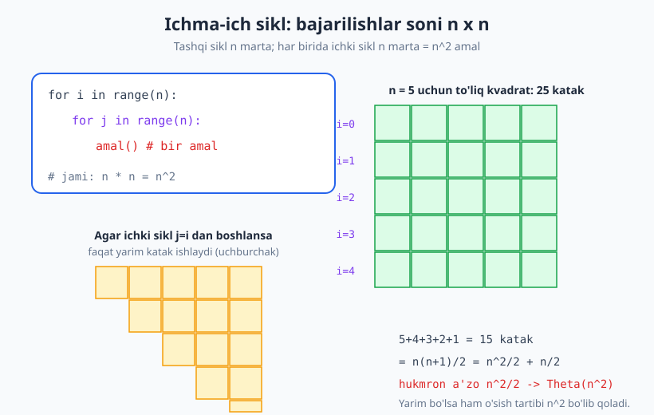
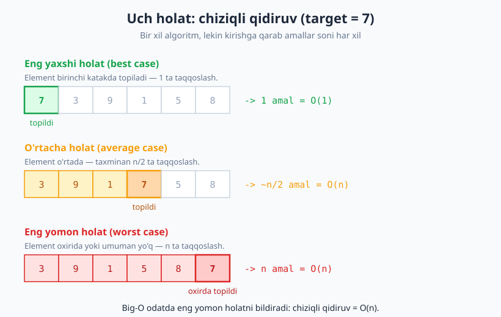
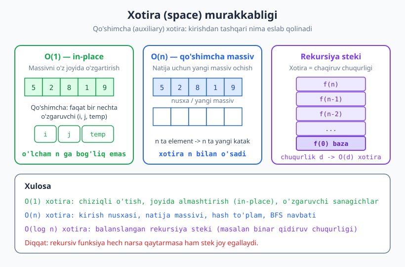

# 09 — Murakkablikni hisoblash: vaqt va xotira

[⬅️ Oldingi: 08 — Asimptotik notatsiya: Big-O, Ω, Θ](./08-asimptotik-notatsiya.md) · [🏠 README](./README.md) · [Keyingi: 10 — Rekurrent munosabatlar va Master teorema ➡️](./10-rekurrent-master-teorema.md)

---

> **Bu bobda:** Oldingi bobda Big-O notatsiyasini *ta'rifladik*; endi uni **amalda qo'llaymiz**. Tayyor koddan turib uning vaqt murakkabligini qanday topishni — amallarni sanash, hukmron a'zoni ajratish va Big-O ga o'tishni — qoidalar va misollar bilan o'rganamiz. So'ng bir algoritmning **eng yaxshi, o'rtacha va eng yomon** holatini farqlaymiz va nihoyat **xotira (space) murakkabligi**ga — in-place, qo'shimcha massiv va rekursiya steki chuqurligiga — o'tamiz.
>
> **Halollik / Eslatma:** Bu yerdagi barcha Big-O baholari matematik aniq va to'g'ri. O'rtacha holat tahlili soddalashtirilgan (to'liq ehtimollik hisobi emas — uni qisqacha ko'rsatamiz). Barcha Python namunalari haqiqatan ishga tushirib, chiqishi tekshirilgan.

---

## Kirish: koddan Big-O ga

[Oldingi bobda](./08-asimptotik-notatsiya.md) biz `O(n)`, `O(n²)`, `O(log n)` kabi belgilarning ma'nosini o'rgandik: ular algoritmning **o'sish tartibini** tasvirlaydi — kirish hajmi `n` kattalashganda ish vaqti qanchalik tez ko'payishini. Lekin u yerda murakkabliklar bizga tayyor berilgan edi. Bu bobning asosiy savoli:

> **Qo'limda kod bor. Uning Big-O sini qanday topaman?**

Javobi uch qadamli oddiy retsept:

```text
1-qadam:  Asosiy amallarni SANA — har bir qator necha marta bajariladi?
2-qadam:  Hammasini qo'shib, T(n) ifodasini yoz (masalan 3n + 4).
3-qadam:  HUKMRON a'zoni ol, konstantalarni tashla -> Big-O (masalan O(n)).
```

Bu retsept [7-bob](./07-samaradorlik-hisoblash-modeli.md)dagi "amallarni sanash" g'oyasiga tayanadi va [8-bobdagi](./08-asimptotik-notatsiya.md) "konstantani e'tiborsiz qoldirish" qoidasi bilan tugaydi. Keling, har bir qadamni amalda ko'raylik.

> **Eslatma:** Biz "amal" deganda doimiy vaqt (`O(1)`) oladigan oddiy ishni nazarda tutamiz: qo'shish, taqqoslash, massiv katagini o'qish/yozish, o'zgaruvchiga qiymat berish. Bu — [7-bobdagi](./07-samaradorlik-hisoblash-modeli.md) **RAM modeli**ning asosiy farazi.

---

## Asosiy qoidalar amalda

Murakkablikni qo'lda hisoblash uchun bir necha oddiy qoidani bilish kifoya. Ularni eslab qolsangiz, ko'pchilik kodning Big-O sini bir qarashda ayta olasiz.

### Qoida 1 — Ketma-ket bloklar: yig'indi, keyin maksimum

Agar kod ikkita bo'lakdan iborat bo'lsa va ular **birin-ketin** (biri tugagach, ikkinchisi) bajarilsa, ularning vaqtlari **qo'shiladi**. Ammo Big-O da yig'indining eng katta a'zosi (maksimum) hukmron bo'ladi:

```text
A bloki:  O(n)        }
                       }  -> jami O(n) + O(n^2) = O(n^2)
B bloki:  O(n^2)      }
```

Nega? Chunki `n` kattalashganda `n²` `n` dan ancha tez o'sadi, shuning uchun katta `n` larda umumiy vaqtni deyarli butunlay `B` bloki belgilaydi. Demak:

> **Qoida:** `O(f) + O(g) = O(max(f, g))`. Ketma-ket bloklarda eng "qimmat" qism g'olib chiqadi.

### Qoida 2 — Ichma-ich sikllar: ko'paytma

Bir sikl ichida ikkinchi sikl bo'lsa, ularning takrorlanish sonlari **ko'payadi**:

```text
for i in range(n):        # n marta
    for j in range(n):    #   har biri uchun n marta
        amal()            #     -> n * n = n^2 amal
```

Agar tashqi sikl `n`, ichki sikl `m` marta aylansa, jami `n · m`. Ikkalasi ham `n` bo'lsa, `n²`. Uchta ichma-ich sikl — `n³`, va hokazo. Bu eng ko'p uchraydigan murakkablik manbai.



### Qoida 3 — Har safar yarmiga bo'linish: logarifm

Agar har bir qadamda ishlanadigan **hajm ikki barobar kichraysa** (yoki sikl o'zgaruvchisi har safar 2 ga ko'paysa), takrorlar soni `log₂ n` ga teng bo'ladi:

```text
m = n
while m > 1:
    m = m // 2      # har safar yarmiga -> log2(n) marta
```

`n = 16` bo'lsa: `16 -> 8 -> 4 -> 2 -> 1`, ya'ni 4 qadam, chunki `log₂ 16 = 4`. Bu — [binar qidiruv](./28-qidiruv-algoritmlari.md)ning yuragidagi g'oya: qidiruv maydonini har qadamda yarmiga qisqartirib, `O(log n)` ga erishamiz.

> **Eslatma:** Big-O da logarifm asosi muhim emas: `log₂ n`, `log₁₀ n` va `ln n` bir-biridan faqat konstanta koeffitsienti bilan farq qiladi, u esa tashlanadi. Shuning uchun shunchaki `O(log n)` yozamiz.

### Qoida 4 — Sikl ichida logarifmik amal: n log n

Agar `n` marta aylanadigan sikl ichida har safar `log n` lik ish bajarilsa, jami `n · log n` bo'ladi:

```text
for x in massiv:          # n marta
    binar_qidiruv(...)    #   har biri O(log n)
                          #     -> n * log n = O(n log n)
```

`O(n log n)` — samarali [saralash](./27-saralash-algoritmlari.md) algoritmlari (merge sort, quicksort, heapsort)ning murakkabligidir va amalda juda yaxshi hisoblanadi: `n²` dan sezilarli tez, lekin chiziqlidan biroz sekin.

---

## Konkret misollar: kod + tahlil

Endi qoidalarni real kod ustida qo'llaymiz. Har bir misol uchun: kod -> amallarni sanaymiz -> Big-O.

### Misol 1 — Chiziqli qidiruv: O(n)

```python
def chiziqli_qidiruv(a, target):
    for i in range(len(a)):
        if a[i] == target:
            return i
    return -1

print(chiziqli_qidiruv([3, 9, 1, 7, 5, 8], 7))   # -> 3
print(chiziqli_qidiruv([3, 9, 1, 7, 5, 8], 42))  # -> -1
```

**Tahlil.** Sikl eng yomon holatda (element yo'q yoki oxirida) `n` marta aylanadi. Har aylanishda doimiy son amal: bitta indekslash `a[i]`, bitta taqqoslash `== target`. Demak `T(n) ≈ c · n`, hukmron a'zo `n`, natija **`O(n)`** — chiziqli.

### Misol 2 — Ikki ichma-ich sikl (barcha juftliklar): O(n²)

```python
def juftliklar(a):
    juft = []
    for i in range(len(a)):
        for j in range(i + 1, len(a)):
            juft.append((a[i], a[j]))
    return juft

print(juftliklar([1, 2, 3]))  # -> [(1, 2), (1, 3), (2, 3)]
```

**Tahlil.** Ikkita ichma-ich sikl bor (Qoida 2 -> ko'paytma). E'tibor bering: ichki sikl `j` ni `i+1` dan boshlaydi, ya'ni har safar **kamroq** aylanadi. Lekin baribir bu `O(n²)`. Nega aynan shunday — buni keyingi misolda aniq hisoblaymiz.

### Misol 3 — Uchburchak sikl: nega yarim bo'lsa ham O(n²)

Bu — boshlovchilar eng ko'p adashadigan joy. Ichki sikl har safar kamroq aylanadigi uchun "demak bu yarmi, ya'ni `O(n/2)` yoki yengilroq" deb o'ylash xato. Aniq sanab ko'raylik:

```python
def uchburchak_amallar(n):
    son = 0
    for i in range(n):
        for j in range(i, n):
            son += 1
    return son

print(uchburchak_amallar(5))   # -> 15
print(uchburchak_amallar(10))  # -> 55
```

**Tahlil.** Tashqi `i` ning har qiymati uchun ichki sikl `n − i` marta aylanadi:

| `i` | ichki sikl necha marta (`n − i`, `n = 5`) |
|---|---|
| 0 | 5 |
| 1 | 4 |
| 2 | 3 |
| 3 | 2 |
| 4 | 1 |
| **Jami** | **5 + 4 + 3 + 2 + 1 = 15** |

Bu — mashhur **arifmetik yig'indi**:

```text
n + (n-1) + (n-2) + ... + 2 + 1  =  n(n+1)/2  =  n^2/2 + n/2
```

Endi 3-qadamni qo'llaymiz: hukmron a'zo `n²/2`, konstanta `1/2` ni va kichik `n/2` ni tashlaymiz ->

> **`T(n) = n(n+1)/2 = Θ(n²)`.**

Ya'ni "yarim uchburchak" bo'lsa-da, o'sish tartibi **baribir `n²`**, faqat konstanta koeffitsienti `1/2`. `n` ikki barobar oshsa, ish 4 barobar oshadi — to'liq kvadrat sikldagidek. Big-O da `1/2` koeffitsienti yo'qoladi.

Yuqoridagi diagrammada to'liq kvadrat (`n²`) va uchburchak (`n²/2`) bir-biriga taqqoslangan — ikkalasi ham bir xil parabolik o'sishga ega.

> **Diqqat:** "Ish yarmiga kamaydi" — bu Big-O ni **o'zgartirmaydi**, faqat konstantani kamaytiradi. Big-O ni faqat **o'sish tartibi** o'zgargandagina o'zgartiramiz (masalan `n²` dan `n log n` ga). Yarmiga *bo'lish* (logarifm) bilan yarmini *qo'shmaslik* (konstanta) farqini chalkashtirmang.

### Misol 4 — Har safar yarmlash: O(log n)

```python
def necha_marta_yarmlash(n):
    qadam = 0
    while n > 1:
        n = n // 2
        qadam += 1
    return qadam

print(necha_marta_yarmlash(16))    # -> 4
print(necha_marta_yarmlash(1000))  # -> 9
```

**Trassirovka (`n = 16`):**

| qadam | sikl boshida `n` | `n // 2` dan keyin | `qadam` |
|---|---|---|---|
| 1 | 16 | 8 | 1 |
| 2 | 8 | 4 | 2 |
| 3 | 4 | 2 | 3 |
| 4 | 2 | 1 | 4 |
| — | 1 | sikl tugadi | 4 |

**Tahlil.** `n` har qadamda 2 ga bo'linadi, shuning uchun `1` ga yetguncha taxminan `log₂ n` qadam kerak (Qoida 3). `16 = 2⁴` uchun aynan 4 qadam; `1000` uchun `⌊log₂ 1000⌋ = 9`. Natija **`O(log n)`** — juda sekin o'sadigan, ajoyib murakkablik: `n` million bo'lsa ham atigi ~20 qadam.

### Misol 5 — Aralash: O(n log n)

```python
def n_log_n_ish(a):
    son = 0
    for x in a:            # n marta
        m = len(a)
        while m > 1:        # har biri log n marta
            m = m // 2
            son += 1
    return son

print(n_log_n_ish([0] * 8))  # -> 24
```

**Tahlil.** Tashqi sikl `n` marta aylanadi; har bir aylanishda ichki `while` `log₂ n` marta ishlaydi (Qoida 4 -> ko'paytma). `n = 8` uchun: `8 · log₂ 8 = 8 · 3 = 24`, kod ham aynan `24` chiqaradi. Natija **`O(n log n)`**.

> **Trade-off:** Bir xil masalani `O(n²)` da ham, `O(n log n)` da ham yechish mumkin (masalan saralash). `n = 1 000 000` da `n²` taxminan `10¹²` amal (daqiqalar), `n log n` esa taxminan `2·10⁷` amal (soniyaning ulushi). Mana shu uchun murakkablik **amaliyotda** muhim — bu shunchaki nazariy o'yin emas.

---

## Eng yaxshi, o'rtacha va eng yomon holat

Hozirgacha biz "sikl `n` marta aylanadi" deb keldik. Lekin Misol 1 dagi chiziqli qidiruvga diqqat qiling: agar element **birinchi** katakda bo'lsa, sikl darhol to'xtaydi — bor-yo'g'i 1 amal! Demak bir xil algoritmning ish vaqti **aynan qaysi kirish berilganiga** bog'liq. Shuning uchun uch xil holatni ajratamiz.

- **Eng yaxshi holat (best case):** algoritm uchun eng qulay kirishdagi ish vaqti — *eng kam* amal.
- **Eng yomon holat (worst case):** eng noqulay kirishdagi ish vaqti — *eng ko'p* amal.
- **O'rtacha holat (average case):** barcha mumkin kirishlar bo'yicha *o'rtacha* ish vaqti (ehtimollikni talab qiladi).

Chiziqli qidiruv misolida (massivda `n` ta element, `target` ni qidiramiz):

| Holat | Vaziyat | Taqqoslashlar | Big-O |
|---|---|---|---|
| Eng yaxshi | `target` birinchi katakda | 1 | `O(1)` |
| O'rtacha | `target` o'rtada (tasodifiy joyda) | ~`n/2` | `O(n)` |
| Eng yomon | `target` oxirda yoki umuman yo'q | `n` | `O(n)` |



### Big-O odatda eng yomon holatni bildiradi

Shartlashuv bo'yicha, "algoritm `O(f(n))`" deganda biz odatda **eng yomon holatni** nazarda tutamiz. Sababi amaliy: eng yomon holat — bu **kafolat**. "Bu algoritm hech qachon `O(n²)` dan sekin ishlamaydi" degani — har qanday kirishda ishonchli yuqori chegara. Eng yaxshi holat esa kamdan-kam foydali: u faqat omadli kirishda nima bo'lishini aytadi, lekin yomonida himoya bermaydi.

> **Diqqat:** "Eng yomon holat" va "Big-O" — **boshqa-boshqa** tushunchalar, garchi ko'pincha birga ishlatilsa ham. Big-O — yuqori chegara (har qanday holat uchun yozish mumkin: "eng yaxshi holat `O(1)`"). Eng yomon holat — *qaysi kirish* haqida gapirayotganimiz. Ikkalasini birga aytib: "chiziqli qidiruvning **eng yomon** holati **`Θ(n)`**" — eng aniq ifoda. Θ (theta) haqida [8-bobga](./08-asimptotik-notatsiya.md) qarang.

### O'rtacha holat — qisqacha (ehtimollik kerak)

O'rtacha holatni topish ehtimollik talab qiladi: barcha kirishlar bo'yicha ish vaqtining **kutilgan qiymati** (matematik o'rtachasi). Chiziqli qidiruvda, agar `target` massivda bo'lsa va uning har qanday pozitsiyada bo'lishi teng ehtimolli bo'lsa:

```text
O'rtacha taqqoslashlar = (1 + 2 + 3 + ... + n) / n  =  (n(n+1)/2) / n  =  (n+1)/2  ~  n/2
```

Demak o'rtacha ~`n/2`, ya'ni `O(n)` — eng yomon holat bilan **bir xil tartib**, faqat ikki marta kichik konstanta. Ko'p algoritmlarda o'rtacha va eng yomon holat bir xil tartibda bo'ladi, lekin ba'zilarida farq qiladi (klassik misol — **quicksort**: o'rtacha `O(n log n)`, eng yomon `O(n²)`; buni [saralash bobida](./27-saralash-algoritmlari.md) ko'rasiz).

> **Eslatma:** Aniq o'rtacha holat tahlili ko'pincha qiyin, chunki "tipik" kirishni matematik ta'riflash kerak. Shuning uchun amaliyotda dasturchilar asosan eng yomon holatga tayanadi — u har doim aniq va himoyalangan baho beradi.

---

## Xotira (space) murakkabligi

Vaqt — bu algoritm tahlilining yarmi xolos. Ikkinchi yarmi — **xotira**: algoritm ishlash uchun qancha xotira talab qiladi? Buni ham xuddi vaqtdek Big-O bilan o'lchaymiz, faqat amallar emas, **xotira katakchalari**ni sanaymiz.

### Qo'shimcha (auxiliary) xotira vs umumiy

Ikki xil o'lchov bor:

- **Umumiy xotira:** kirish + algoritm ishlatadigan hamma narsa.
- **Qo'shimcha (auxiliary) xotira:** kirishdan **tashqari** ishlatilgan xotira — algoritmning "ish stoli".

Odatda "xotira murakkabligi" deganda **qo'shimcha** xotira nazarda tutiladi, chunki kirishni baribir saqlashga majburmiz; bizni qiziqtiradigani — algoritm *qo'shimcha* qancha joy talab qilishi.



### O(1) xotira — in-place

Agar algoritm faqat bir nechta o'zgaruvchi (sanagichlar, vaqtinchalik qiymat) ishlatib, kirish hajmidan **mustaqil** joy egallasa, u **`O(1)` qo'shimcha xotira** ishlatadi. Massivni o'z joyida o'zgartiradigan algoritmlar **in-place** deyiladi:

```python
def teskari_inplace(a):
    chap, ong = 0, len(a) - 1
    while chap < ong:
        a[chap], a[ong] = a[ong], a[chap]
        chap += 1
        ong -= 1
    return a

print(teskari_inplace([1, 2, 3, 4, 5]))  # -> [5, 4, 3, 2, 1]
```

Bu yerda faqat `chap` va `ong` — ikki o'zgaruvchi. Massiv 5 ta yoki 5 million elementli bo'lsin, qo'shimcha xotira o'zgarmaydi -> **`O(1)`**.

### O(n) xotira — qo'shimcha massiv

Agar algoritm natija yoki nusxa uchun **kirishga mutanosib** yangi massiv/to'plam ochsa, qo'shimcha xotira `O(n)`:

```python
def teskari_yangi(a):
    natija = []
    for x in a:
        natija.insert(0, x)
    return natija

print(teskari_yangi([1, 2, 3, 4, 5]))  # -> [5, 4, 3, 2, 1]
```

Bu yerda `natija` ro'yxati `n` ta elementgacha o'sadi -> **`O(n)` qo'shimcha xotira**. Natija bir xil bo'lsa-da (`[5, 4, 3, 2, 1]`), bu versiya `teskari_inplace` dan ko'proq xotira talab qiladi. Hash to'plam (set), [BFS](./29-graf-algoritmlari-1.md) navbati va kirish nusxasi ham odatda `O(n)` xotira.

### Rekursiya steki — chuqurlik = xotira

Boshlovchilar tez-tez unutadigan narsa: **rekursiv chaqiruvlar ham xotira egallaydi**. Har bir hal qilinmagan chaqiruv chaqiruvlar stekida (call stack) bitta "ramka" (frame) saqlaydi — lokal o'zgaruvchilar va qaytish manzili bilan. Demak rekursiyaning xotira murakkabligi = **eng chuqur chaqiruv zanjiri uzunligi**. [Rekursiya stekini](./06-rekursiya-asoslari.md) eslang.

```python
def yigindi(a, i=0):
    if i == len(a):
        return 0
    return a[i] + yigindi(a, i + 1)

print(yigindi([1, 2, 3, 4, 5]))  # -> 15
```

**Tahlil.** Bu funksiya `yigindi(a, 0) -> yigindi(a, 1) -> ... -> yigindi(a, n)` zanjirini hosil qiladi — chuqurlik `n`. Hech qanday massiv ochmasa ham, stekda bir vaqtning o'zida `n + 1` ta ramka turadi -> **`O(n)` xotira**. (Bu kod hatto `O(1)` xotirali oddiy sikl bilan yozilishi mumkin edi — rekursiya bu yerda xotira jihatidan qimmatroq.)

Aksincha, **balanslangan** rekursiya (har qadamda muammoni yarmiga bo'lish — masalan [binar qidiruv](./28-qidiruv-algoritmlari.md) yoki [merge sort](./23-divide-and-conquer.md)) chuqurligi `log n` bo'ladi -> **`O(log n)` xotira**.

| Algoritm namunasi | Qo'shimcha xotira |
|---|---|
| In-place teskari aylantirish, sanagichli o'tish | `O(1)` |
| Balanslangan rekursiya steki (binar qidiruv) | `O(log n)` |
| Natija massivi, hash to'plam, BFS navbati | `O(n)` |
| Chiziqli rekursiya (chuqurlik `n`) | `O(n)` |
| `n × n` matritsa yaratish | `O(n²)` |

> **Diqqat:** `O(n)` *vaqt* va `O(n)` *xotira* — ikki **boshqa** narsa. Algoritm `O(n)` vaqtda ishlab, ammo `O(1)` xotira ishlatishi mumkin (in-place o'tish), yoki `O(n²)` vaqtda ishlab `O(n)` xotira ishlatishi mumkin. Har doim **ikkalasini alohida** baholang.

---

## Vaqt–xotira trade-off

Ko'pincha tezlik bilan xotira o'rtasida **savdolashuv** (trade-off) bor: ko'proq xotira sarflab, vaqtni tejash mumkin — yoki aksincha. Klassik vosita — **memoizatsiya**: hisoblangan natijalarni keshda saqlab, qayta hisoblashdan qutulamiz.

```python
def fib_memo(n, kesh=None):
    if kesh is None:
        kesh = {}
    if n < 2:
        return n
    if n in kesh:
        return kesh[n]
    kesh[n] = fib_memo(n - 1, kesh) + fib_memo(n - 2, kesh)
    return kesh[n]

print(fib_memo(30))  # -> 832040
```

Oddiy (memoizatsiyasiz) rekursiv Fibonachchi `O(2ⁿ)` vaqt talab qiladi — chunki bir xil qiymatlarni qayta-qayta hisoblaydi. Kesh qo'shsak, har bir `fib(k)` faqat **bir marta** hisoblanadi -> vaqt **`O(n)`** ga tushadi. Lekin buning evaziga `kesh` lug'ati `O(n)` xotira egallaydi. Mana shu — sof **vaqt–xotira trade-off**: `O(2ⁿ)` vaqtni `O(n)` vaqtga almashtirdik, narxi `O(n)` qo'shimcha xotira. Bu g'oya — [dinamik dasturlash](./25-dinamik-dasturlash.md)ning poydevori.

> **Trade-off:** Keshlash, oldindan hisoblangan jadvallar (lookup table), indekslar — bularning hammasi "xotira sarflab, tezlik ol" tamoyiliga asoslanadi. Doim savol bering: menda nima ko'proq cheklangan — vaqtmi yoki xotira? Javob arxitektura qaroringizni belgilaydi.

---

## Amaliy maslahat: nimaga e'tibor berish kerak

Murakkablik tahlili — kuchli qurol, lekin uni **to'g'ri vaqtda** ishlating:

1. **Avval o'sish tartibini ko'r.** Real loyihada `n` katta bo'lganda `O(n²)` va `O(n log n)` farqi hayotiy ahamiyatga ega. Konstantalar (2x, 3x tezlik) esa odatda keyingi tashvish.
2. **Vaqt va xotira — ikkalasini ham.** "Tez, lekin xotirani yeydi" yechim cheklangan qurilmada (telefon, mikrokontroller) yaroqsiz bo'lishi mumkin.
3. **Eng yomon holatni bilib tur.** Tizimingiz "odatda tez", lekin yiliga bir marta eng yomon kirishda qotib qolsa — bu jiddiy muammo.
4. **Lekin erta optimallashtirishdan ehtiyot bo'l.** Donald Knuth aytganidek: *"erta optimallashtirish — barcha yomonliklarning ildizi"* (ma'lum bir ma'noda). Avval **to'g'ri va o'qiladigan** kod yozing; haqiqiy "issiq nuqta" (bottleneck)ni o'lchov (profiling) bilan toping; faqat shu yerni optimallashtiring. `n` har doim 10 dan oshmaydigan joyni `O(n²)` dan `O(n log n)` ga ko'chirish — ko'pincha behuda mehnat.

> **Anti-pattern:** Har bir satrni "tezroq" qilishga urinib, kodni o'qib bo'lmas holga keltirish. Murakkablik — ko'lamlanadigan (scalable) qismlar uchun; qolgan joyda **aniqlik** muhimroq. To'g'ri Big-O ni tanlash > konstantani qisish.

---

## Asosiy g'oyalar (bobni qisqacha)

- Koddan Big-O ga uch qadam: **amallarni sana -> `T(n)` ifodasini yoz -> hukmron a'zoni ol**.
- **Ketma-ket bloklar qo'shiladi** (`O(max)`), **ichma-ich sikllar ko'payadi** (`n · m`).
- **Har safar yarmlash = `O(log n)`**; sikl ichida logarifmik amal = **`O(n log n)`**.
- **Uchburchak sikl** (ichki sikl `j = i..n`) `n(n+1)/2 = Θ(n²)`: yarim bo'lsa ham o'sish tartibi `n²`, faqat konstanta `1/2`. Yarmiga *bo'lish* (log) bilan yarmini *qo'shmaslik* (konstanta) — boshqa narsa.
- **Eng yaxshi / o'rtacha / eng yomon** holat farqlanadi. Big-O odatda **eng yomon** holatni bildiradi, chunki u kafolat beradi. O'rtacha holat ehtimollik talab qiladi.
- **Xotira murakkabligi** ham muhim: `O(1)` (**in-place**), `O(n)` (qo'shimcha massiv), `O(log n)` (balanslangan rekursiya steki). **Rekursiya chuqurligi = stek xotirasi.**
- Vaqt va xotira — **alohida** baholanadi va ko'pincha **trade-off** qilinadi (memoizatsiya: xotira evaziga tezlik).
- Avval **to'g'ri** kod, keyin o'lchov, oxirida — kerak bo'lsa — optimallashtirish. **Erta optimallashtirishdan saqlaning.**

---

## Mashqlar

### Oson

**1-mashq.** Quyidagi kod parchasining **vaqt** murakkabligini Big-O da ayting:

```text
yigindi = 0
for x in a:          # a da n ta element
    yigindi += x
return yigindi
```

**2-mashq.** Bu kodning vaqt murakkabligi qanday?

```text
for i in range(n):
    for j in range(n):
        print(i, j)
```

**3-mashq.** Quyidagi funksiyaning **qo'shimcha xotira** murakkabligini ayting (kirish massivini hisobga olmang):

```text
def maksimum(a):
    eng_katta = a[0]
    for x in a:
        if x > eng_katta:
            eng_katta = x
    return eng_katta
```

### O'rta

**4-mashq.** Quyidagi kodning vaqt murakkabligini toping va **nega** shunday ekanini tushuntiring:

```text
for i in range(n):       # tashqi: n marta
    m = n
    while m > 1:          # ichki:
        m = m // 2
```

**5-mashq.** `target` ni **saralangan** massivda chiziqli qidiruv bilan qidiramiz va element topilsa yoki `a[i] > target` bo'lsa to'xtaymiz. Bu algoritmning **eng yaxshi** va **eng yomon** holatini va ularning Big-O sini ayting.

**6-mashq.** Quyidagi kod ketma-ket ikki blokdan iborat. Umumiy vaqt murakkabligi qanday?

```text
# A bloki
for x in a:               # n marta
    print(x)

# B bloki
for i in range(n):
    for j in range(n):
        print(i * j)
```

### Qiyin

**7-mashq.** Quyidagi sikl aniq necha marta `son += 1` ni bajaradi (yopiq formula bilan), va Big-O si nima?

```text
son = 0
for i in range(n):
    for j in range(i + 1, n):
        son += 1
```

**8-mashq.** Quyidagi rekursiv funksiyaning **vaqt** va **xotira** murakkabligini alohida ayting. Xotira nega aynan shunday?

```text
def teskari_chop(a, i=0):
    if i == len(a):
        return
    teskari_chop(a, i + 1)
    print(a[i])
```

**9-mashq.** Sizga massiv berilgan. Ikki versiya bor: (a) ikki ichma-ich sikl bilan massivda **takrorlangan** element borligini tekshirish, (b) hash to'plam (set) bilan tekshirish. Har birining **vaqt** va **xotira** murakkabligini ayting va bu yerdagi **vaqt–xotira trade-off**ini izohlang.

<details markdown="1">
<summary>Yechimlar</summary>

### 1-mashq yechimi

Bitta sikl, `n` ta element bo'yicha bir marta aylanadi; har aylanishda doimiy ish (`+=`). Demak `T(n) = c · n`, murakkablik **`O(n)`** — chiziqli.

### 2-mashq yechimi

Ikkita ichma-ich sikl, ikkalasi ham `n` marta (Qoida 2 -> ko'paytma): `n · n = n²`. Murakkablik **`O(n²)`**.

### 3-mashq yechimi

Faqat bitta qo'shimcha o'zgaruvchi — `eng_katta` (va sikl o'zgaruvchisi `x`). Massiv qanchalik katta bo'lsa ham qo'shimcha joy o'zgarmaydi. Qo'shimcha xotira **`O(1)`** — in-place o'tish.

### 4-mashq yechimi

Tashqi sikl `n` marta aylanadi. Ichki `while` har safar `m` ni 2 ga bo'ladi, ya'ni `log₂ n` marta ishlaydi (Qoida 3). Ular ichma-ich, demak ko'payadi (Qoida 4): `n · log₂ n`. Murakkablik **`O(n log n)`**. Sababi: "yarmiga bo'lish" logarifm beradi, va u `n` martalik tashqi sikl ichida takrorlanadi.

### 5-mashq yechimi

- **Eng yaxshi holat:** `target` birinchi katakda (`a[0] == target`) yoki `a[0] > target` (darhol to'xtash) — **1 ta taqqoslash**, **`O(1)`**.
- **Eng yomon holat:** `target` massivning oxirgi elementidan katta yoki teng — sikl oxirigacha boradi, **`n` ta taqqoslash**, **`O(n)`**.

Saralanganlik o'rtacha holatda erta to'xtashga imkon beradi, lekin eng yomon holatni `O(n)` dan tushirmaydi. (Saralangan massivda haqiqiy tezlik uchun [binar qidiruv](./28-qidiruv-algoritmlari.md) — `O(log n)` — kerak.)

### 6-mashq yechimi

A bloki `O(n)`, B bloki ikki ichma-ich sikl `O(n²)`. Ular ketma-ket, demak qo'shiladi (Qoida 1): `O(n) + O(n²) = O(max(n, n²)) = O(n²)`. Umumiy murakkablik **`O(n²)`** — kattaroq blok hukmron.

### 7-mashq yechimi

Tashqi `i` uchun ichki sikl `j` ni `i + 1` dan `n − 1` gacha, ya'ni `n − 1 − i` marta aylanadi:

```text
(n-1) + (n-2) + ... + 2 + 1 + 0  =  n(n-1)/2
```

`n = 5` uchun: `4 + 3 + 2 + 1 + 0 = 10 = 5·4/2`. Yopiq formula **`n(n−1)/2`**. Hukmron a'zo `n²/2`, demak Big-O **`O(n²)`** (aniqrog'i `Θ(n²)`). (Bu — matnda ko'rilgan uchburchak siklning `j = i+1` dan boshlangan varianti.)

### 8-mashq yechimi

- **Vaqt:** funksiya har element uchun bir marta chaqiriladi va bir marta `print` qiladi — jami `n` ta chaqiruv, har biri `O(1)`. Vaqt **`O(n)`**.
- **Xotira:** rekursiya `teskari_chop(a, 0) -> ... -> teskari_chop(a, n)` zanjirini hosil qiladi, chuqurlik `n`. `print` lar bajarilmasdan **oldin** barcha chaqiruvlar stekka tushadi (chunki rekursiv chaqiruv `print` dan oldin), shuning uchun bir vaqtning o'zida `n + 1` ramka stekda turadi. Xotira **`O(n)`** — rekursiya steki chuqurligi tufayli, garchi hech qanday massiv ochmasa ham.

### 9-mashq yechimi

**(a) Ikki ichma-ich sikl:**

```text
for i in range(n):
    for j in range(i + 1, n):
        if a[i] == a[j]:
            return True
```

- Vaqt: `O(n²)` (har juftlikni tekshiradi, uchburchak sikl).
- Xotira: `O(1)` — faqat sanagichlar, qo'shimcha struktura yo'q.

**(b) Hash to'plam:**

```python
def birinchi_takror(a):
    korilgan = set()
    for x in a:
        if x in korilgan:
            return x
        korilgan.add(x)
    return None

print(birinchi_takror([2, 5, 1, 5, 3]))  # -> 5
```

- Vaqt: **`O(n)`** — har element bir marta, set ichida tekshirish o'rtacha `O(1)` ([hash jadval](./15-hash-jadval.md)).
- Xotira: **`O(n)`** — set eng yomon holatda `n` ta elementni saqlaydi.

**Trade-off:** (a) versiya xotira tejaydi (`O(1)`) lekin vaqt qimmat (`O(n²)`); (b) versiya `O(n)` xotira "sotib olib" vaqtni `O(n)` ga tushiradi. Bu — klassik vaqt–xotira savdolashuvi: agar `n` katta va xotira yetarli bo'lsa, (b) ancha tezroq; agar xotira juda cheklangan bo'lsa, (a) afzal. Aksariyat amaliy holatlarda (b) — to'g'ri tanlov.

</details>

---

[⬅️ Oldingi: 08 — Asimptotik notatsiya: Big-O, Ω, Θ](./08-asimptotik-notatsiya.md) · [🏠 README](./README.md) · [Keyingi: 10 — Rekurrent munosabatlar va Master teorema ➡️](./10-rekurrent-master-teorema.md)
