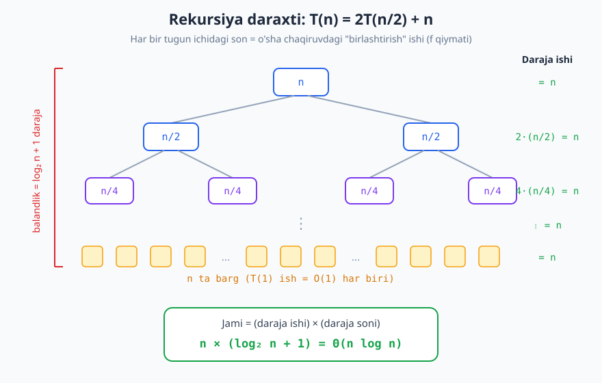
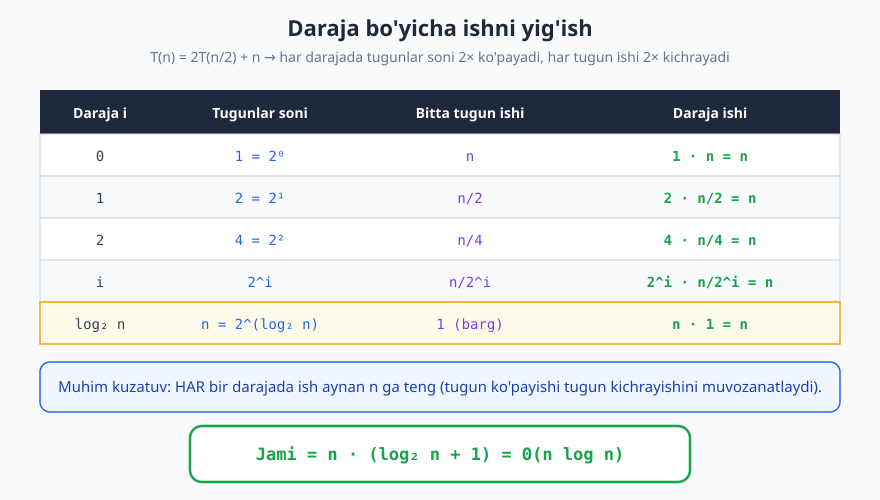
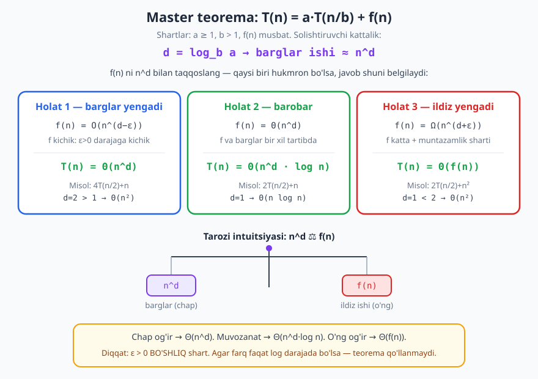

# 10 — Rekurrent munosabatlar va Master teorema

[⬅️ Oldingi: 09 — Murakkablikni hisoblash: vaqt va xotira](./09-murakkablikni-hisoblash.md) · [🏠 README](./README.md) · [Keyingi: 11 — Amortizatsiyalangan tahlil ➡️](./11-amortizatsiyalangan-tahlil.md)

---

> **Bu bobda:** rekursiv algoritm murakkabligini qanday hisoblashni o'rganamiz. Oddiy "sikllarni sanash" usuli rekursiyada ishlamaydi — buning o'rniga **rekurrent munosabat** (recurrence) yozamiz va uni uchta usul bilan yechamiz: **rozgortirish** (almashtirib ochish), **rekursiya daraxti** va eng kuchli quroli — **Master teorema**. Har bir usulni aniq misollarda ko'ramiz.
>
> **Halollik / Eslatma:** Master teorema bu yerda standart (CLRS) ko'rinishida, barcha shartlari (ε > 0 bo'shliq, muntazamlik sharti) bilan to'g'ri bayon qilingan. Murakkablik baholari matematik aniq. Python namunalari ish hajmini sanagich bilan o'lchaydi va haqiqatan ishga tushirib tekshirilgan.

---

## Nega sikl sanash yetmaydi

[09-bobda](./09-murakkablikni-hisoblash.md) sikllarni sanab murakkablik topishni o'rgandik: bitta sikl `n` marta aylansa — `O(n)`, ichma-ich ikki sikl — `O(n²)`. Bu usul **iterativ** kod uchun ajoyib. Ammo **rekursiv** algoritmga duch kelganda u to'satdan ishlamay qoladi.

Quyidagi koddagi qadamlar sonini sanang:

```python
def merge_sort(a):
    if len(a) <= 1:
        return a
    mid = len(a) // 2
    left = merge_sort(a[:mid])    # o'zini chaqiradi!
    right = merge_sort(a[mid:])   # yana o'zini chaqiradi!
    return merge(left, right)     # bu n ta amal
```

`merge` qismi `n` ta amal qiladi — buni sanash oson. Lekin `merge_sort(a[:mid])` necha amal? U **o'zini** chaqiradi, u esa yana o'zini... Funksiyaning narxi o'z ichida yana o'sha funksiyaning narxiga bog'liq. Bu **doiraviy**dek tuyuladi, lekin emas: har chaqiruvda masala **kichrayadi**, oxir-oqibat bazaga yetadi.

> **G'oya.** Rekursiya narxini bevosita sanay olmaymiz. Buning o'rniga uni **o'zi orqali** ifodalaymiz: "katta masala narxi = qism-masalalar narxi + birlashtirish narxi". Bu tenglama — **rekurrent munosabat**. Keyin uni *yechamiz* (yopiq, rekursiyasiz formulaga keltiramiz).

---

## Rekurrent munosabat nima

**Rekurrent munosabat** (yoki qisqacha *rekurrent*) — bu `T(n)` ni o'zidan kichikroq argumentdagi `T` qiymatlari orqali ifodalovchi tenglama. Bu yerda `T(n)` — kirish hajmi `n` bo'lganda algoritm bajaradigan **ish hajmi** (qadamlar soni, asimptotik ma'noda).

Rekurrent ikki qismdan iborat:

1. **Baza (boshlang'ich shart):** eng kichik holatda ish, masalan `T(1) = O(1)`. Busiz munosabat hech qachon to'xtamaydi.
2. **Rekursiv qism:** `T(n)` ni kichikroq `T` orqali yozish.

Mana eng muhim algoritmlarning rekurrentlari:

| Algoritm | Rekurrent munosabat | Tushuntirish |
|---|---|---|
| Faktorial (`n! = n·(n-1)!`) | `T(n) = T(n-1) + O(1)` | bitta kichik chaqiruv + bitta ko'paytirish |
| Binar qidiruv | `T(n) = T(n/2) + O(1)` | yarmini tashlab, bittasida davom etadi |
| Merge sort | `T(n) = 2T(n/2) + O(n)` | ikki yarim + `n` lik birlashtirish |
| Quicksort (eng yomon) | `T(n) = T(n-1) + O(n)` | nomutanosib bo'linish |
| Sodda Fibonachchi | `T(n) = T(n-1) + T(n-2) + O(1)` | ikki har xil hajmdagi chaqiruv |
| Ikkilik bo'linib o'tish | `T(n) = 2T(n/2) + O(1)` | har ikki yarimni butunlay aylanib chiqish |

Bu rekurrentlarni o'qish bir xil andoza bilan: nechta qism-masala (koeffitsiyent), ularning hajmi (argument), va "qism-masalalardan tashqari" qancha qo'shimcha ish (qo'shiluvchi).

> **Eslatma.** `T(n/2)` aslida `T(⌊n/2⌋)` (butun bo'lish) bo'lishi kerak, lekin asimptotik tahlilda pollar (floor/ceil) javobni o'zgartirmaydi, shuning uchun ularni soddalik uchun tushiramiz.

Endi rekurrentni **yechishning** uchta usulini ko'ramiz.

---

## 1-usul. Rozgortirish (almashtirib ochish)

Eng to'g'ridan-to'g'ri usul — rekurrentni **qo'lda bir necha marta ochib**, naqsh (pattern) topib, so'ng bazaga yetganda to'xtatish. Buni *substitution by unrolling* yoki *iteratsiya usuli* ham deyiladi.

### Misol A: `T(n) = T(n-1) + c`

`c` — qandaydir o'zgarmas ish (`O(1)`). Ochib boramiz:

```text
T(n) = T(n-1) + c
     = [T(n-2) + c] + c   = T(n-2) + 2c
     = [T(n-3) + c] + 2c  = T(n-3) + 3c
     ...
     = T(n-k) + k·c
```

`k` marta ochdik. Bazaga (`T(0)`) yetish uchun `n - k = 0`, ya'ni `k = n` bo'lishi kerak. O'rniga qo'yamiz:

```text
T(n) = T(0) + n·c = c·n + T(0)  →  Θ(n)
```

Demak faktorial yoki `T(n) = T(n-1) + O(1)` ko'rinishidagi har qanday rekursiya **chiziqli** — `Θ(n)`. Mantiqiy: har chaqiruvda `O(1)` ish, jami `n` ta chaqiruv.

### Misol B: `T(n) = 2T(n/2) + n`

Bu merge sort. Ochamiz (`n` har darajada chiqaveradi):

```text
T(n)  = 2T(n/2) + n
      = 2[2T(n/4) + n/2] + n        = 4T(n/4) + n + n
      = 4[2T(n/8) + n/4] + 2n       = 8T(n/8) + n + n + n
      ...
      = 2^k · T(n/2^k) + k·n
```

`k` darajadan keyin `2^k T(n/2^k) + k·n` bo'ladi. Bazaga (`T(1)`) yetish uchun `n/2^k = 1`, ya'ni `2^k = n`, demak `k = log₂ n`. O'rniga qo'yamiz:

```text
T(n) = 2^(log₂ n) · T(1) + (log₂ n)·n
     = n · T(1) + n·log₂ n
     = Θ(n log n)
```

Birinchi had `n·T(1) = Θ(n)`, ikkinchisi `n log n` — kattaroq had hukmron. Natija: **`Θ(n log n)`**. Bu merge sortning mashhur murakkabligi.

> **Diqqat.** Rozgortirish qodir, lekin xatoga moyil: koeffitsiyentlar (`2^k`), argumentlar (`n/2^k`) va qo'shiluvchini bir vaqtda kuzatish kerak. Murakkabroq rekurrentlarda osonroq vosita kerak — keyingi ikki usul shuning uchun.

---

## 2-usul. Rekursiya daraxti

Rozgortirishni **vizual** qilsak — rekursiya daraxti chiqadi. Har chaqiruv — daraxt tuguni; tugun ichida o'sha chaqiruvning **o'zining ishi** (qism-chaqiruvlardan tashqari, ya'ni `f(n)` qiymati) yoziladi. Bolalar — qism-chaqiruvlar.

Strategiya juda aniq:

1. Daraxtni chizib chiq: ildiz `n`, har tugun `b` ta bolaga bo'linadi, har bola `n/b` hajmda.
2. **Har darajadagi** umumiy ishni yig'.
3. **Darajalar soni** (daraxt balandligi) ni top.
4. Barchasini qo'sh: `Σ (har daraja ishi)`.

`T(n) = 2T(n/2) + n` ni daraxtga solamiz:



Endi daraja-daraja ishni jadvalga yig'amiz. Diqqat qiling: har darajada tugunlar soni `2×` ko'payadi, lekin har tugun ishi `2×` kichrayadi — ular bir-birini **muvozanatlaydi**.



Jadvalni o'qiymiz:

| Daraja `i` | Tugunlar soni | Bitta tugun ishi | Daraja ishi |
|---|---|---|---|
| 0 | `1 = 2⁰` | `n` | `1·n = n` |
| 1 | `2 = 2¹` | `n/2` | `2·(n/2) = n` |
| 2 | `4 = 2²` | `n/4` | `4·(n/4) = n` |
| ... | `2^i` | `n/2^i` | `2^i·(n/2^i) = n` |
| `log₂ n` | `n` | `1` (barg) | `n·1 = n` |

Har darajada ish aynan `n`. Daraxt balandligi — `n` ni nechta marta 2 ga bo'lib `1` ga yetishimiz, ya'ni `log₂ n + 1` daraja. Demak:

```text
T(n) = n · (log₂ n + 1) = Θ(n log n)
```

> **Isbot (eskiz).** Daraxt usuli rozgortirishning aynan o'zi — faqat vizual. "Har daraja ishi" qatori — bu rozgortirishda chiqqan `k·n` ning har bir `n` hadi. Ularni `i = 0` dan `log n` gacha yig'amiz.

### Daraxt har doim ham tekis emas

Hamma rekurrentda har daraja ishi bir xil bo'lavermaydi. Uch xil ssenariy bor — va aynan shu uch ssenariy bizni Master teoremaga olib keladi:

- **Tepa og'ir** (`T(n) = 2T(n/2) + n²`): ildizdagi ish (`n²`) shu qadar katta-ki, qolgan hamma daraja yig'indisi undan oshmaydi. Javob — **ildiz ishi**: `Θ(n²)`.
- **Pastki og'ir** (`T(n) = 4T(n/2) + n`): pastga tushgan sari ish ko'payadi, barglar (eng pastki daraja) hukmron. Javob — **barglar soni**: `Θ(n²)`.
- **Tekis** (`T(n) = 2T(n/2) + n`): har daraja teng, javob — `(daraja ishi) × (daraja soni)`: `Θ(n log n)`.

Bu uch holatni *har safar daraxt chizmasdan* tezda hal qiladigan formula bormi? Bor — bu Master teorema.

---

## 3-usul. Master teorema

Master teorema — `T(n) = a·T(n/b) + f(n)` **andozasidagi** rekurrentlarni darhol yechadigan "retsept". U daraxt tahlilini umumlashtiradi: `f(n)` ni "barglar ishi" bilan solishtirib, qaysi tomon og'irligini aniqlaydi.

### Aniq bayon

Quyidagi ko'rinishdagi rekurrent berilgan bo'lsin:

```text
T(n) = a·T(n/b) + f(n),   bunda  a ≥ 1,  b > 1,  f(n) > 0
```

Bu yerda:
- `a` — har qadamdagi qism-masalalar **soni**,
- `b` — har qism-masala **necha barobar kichik** ekanligi,
- `f(n)` — bo'lish va birlashtirishga ketadigan **qism-masalalardan tashqari** ish.

Solishtiruvchi kattalikni hisoblaymiz — bu **barglar darajasidagi ish**ning tartibi:

```text
d = log_b a      →      barglar ishi ≈ n^d = n^(log_b a)
```

Endi `f(n)` ni `n^d` bilan taqqoslab, uchta holatdan birini tanlaymiz:



**Holat 1 — barglar hukmron.**
Agar `f(n) = O(n^(d − ε))` biror `ε > 0` uchun (ya'ni `f` `n^d` dan *polinomial darajada kichik*), u holda:

```text
T(n) = Θ(n^d) = Θ(n^(log_b a))
```

**Holat 2 — muvozanat.**
Agar `f(n) = Θ(n^d)` (ya'ni `f` xuddi `n^d` tartibida), u holda:

```text
T(n) = Θ(n^d · log n)
```

**Holat 3 — ildiz (yuqori had) hukmron.**
Agar `f(n) = Ω(n^(d + ε))` biror `ε > 0` uchun (`f` `n^d` dan *polinomial darajada katta*) **VA muntazamlik (regularity) sharti** bajarilsa — ya'ni biror `c < 1` va katta `n` lar uchun `a·f(n/b) ≤ c·f(n)` — u holda:

```text
T(n) = Θ(f(n))
```

> **Eslatma — nega `ε` muhim.** Holat 1 va 3 da `f` va `n^d` orasida **polinomial bo'shliq** (`n^ε` ko'paytuvchi) shart. Agar farq faqat logarifmik bo'lsa (masalan `f(n) = n^d·log n`), hech bir holat to'g'ri kelmaydi — teorema bu yerda **jim**, boshqa usul kerak (pastda).

### Intuitsiya: tarozi

Master teoremani **tarozi** deb tasavvur qiling. Bir pallada `n^d` (barglarning umumiy ishi), ikkinchisida `f(n)` (ildizning ishi):

- `f(n)` yengilroq (kichikroq) → barglar bosadi → `Θ(n^d)` (Holat 1).
- ikkisi teng → muvozanat, lekin `log n` ta daraja borligi uchun `log n` koeffitsiyenti qo'shiladi → `Θ(n^d log n)` (Holat 2).
- `f(n)` og'irroq (kattaroq) → ildiz bosadi → `Θ(f(n))` (Holat 3).

---

## Master teorema — misollar

Har bir misolda bir xil tartib: `a`, `b`, `f(n)` ni ajratamiz → `d = log_b a` → `f` ni `n^d` bilan solishtiramiz → holat → javob.

### Misol 1: Merge sort — `T(n) = 2T(n/2) + n`

`a = 2`, `b = 2`, `f(n) = n`. Demak `d = log₂ 2 = 1`, ya'ni `n^d = n`.
`f(n) = n = Θ(n¹) = Θ(n^d)` → **Holat 2**.

```text
T(n) = Θ(n^1 · log n) = Θ(n log n)   ✓
```

### Misol 2: Binar qidiruv — `T(n) = T(n/2) + 1`

`a = 1`, `b = 2`, `f(n) = 1 = n⁰`. Demak `d = log₂ 1 = 0`, ya'ni `n^d = n⁰ = 1`.
`f(n) = 1 = Θ(n⁰) = Θ(n^d)` → **Holat 2**.

```text
T(n) = Θ(n^0 · log n) = Θ(log n)   ✓
```

Mantiqiy: binar qidiruv har qadamda yarmini tashlaydi, `log n` qadam — `O(log n)`.

### Misol 3: `T(n) = 2T(n/2) + n²` — ildiz hukmron

`a = 2`, `b = 2`, `f(n) = n²`. `d = log₂ 2 = 1`, `n^d = n`.
`f(n) = n²` — bu `n^(d+1) = n^(1+1)`, ya'ni `n^d` dan `ε = 1 > 0` ga katta: `f(n) = Ω(n^(1+ε))` → **Holat 3** (muntazamlik sharti bajariladi: `2·(n/2)² = n²/2 = 0.5·f(n)`, `c = 0.5 < 1` ✓).

```text
T(n) = Θ(f(n)) = Θ(n²)   ✓
```

### Misol 4: `T(n) = 4T(n/2) + n` — barglar hukmron

`a = 4`, `b = 2`, `f(n) = n`. `d = log₂ 4 = 2`, `n^d = n²`.
`f(n) = n = O(n^(2−ε))` (masalan `ε = 1`: `n = O(n¹)`) → **Holat 1**.

```text
T(n) = Θ(n^d) = Θ(n²)   ✓
```

### Misol 5: Karatsuba ko'paytirish — `T(n) = 3T(n/2) + n`

`a = 3`, `b = 2`, `f(n) = n`. `d = log₂ 3 ≈ 1.585`, `n^d ≈ n^1.585`.
`f(n) = n = O(n^(1.585−ε))` → **Holat 1**.

```text
T(n) = Θ(n^(log₂ 3)) ≈ Θ(n^1.585)
```

Bu — Karatsuba algoritmi maktab usulidagi `O(n²)` dan nega tezroq ekanligini ko'rsatadi. Bu g'oyani [23-bobda](./23-divide-and-conquer.md) batafsil ko'ramiz.

---

## Master teorema QO'LLANMAYDIGAN holatlar

Master teorema kuchli, lekin **universal emas**. U quyidagi vaziyatlarda ishlamaydi:

1. **Andoza mos kelmaydi.** `T(n) = T(n-1) + n` — bu yerda `n/b` emas, `n-1`. Qism-masala hajmi bo'linish bilan emas, ayirish bilan kichrayadi. Master andozasi `T(n/b)` ni talab qiladi → qo'llanmaydi. (Bunday holatda rozgortirish yoki daraxt ishlatamiz: `T(n) = T(n-1) + n → Θ(n²)`.)
2. **Qism-masalalar teng hajmda emas.** `T(n) = T(n/3) + T(2n/3) + n` — ikki har xil hajmdagi qism. Master `a` ta **bir xil** `n/b` qismni talab qiladi → qo'llanmaydi.
3. **Polinomial bo'shliq yo'q.** `T(n) = 2T(n/2) + n·log n`. Bu yerda `d = 1`, `f(n) = n log n`. `f` `n^d = n` dan kattaroq, lekin faqat `log n` koeffitsiyentga — `n^ε` bo'shliq yo'q. Holat 3 talab qiladigan `Ω(n^(1+ε))` bajarilmaydi → **standart Master jim**. (Bu yerda javob `Θ(n log² n`), lekin uni topish uchun kengaytirilgan teorema yoki daraxt kerak.)
4. **`f(n)` musbat yoki monoton emas** yoki muntazamlik sharti buziladi (kamdan-kam, lekin uchraydi).

> **Anti-pattern.** Master teoremani "ko'rinishi mos" deb har rekurrentga zo'rlab tatbiq etish. Avval `a ≥ 1`, `b > 1`, `f > 0` shartlarini va andoza `a·T(n/b) + f(n)` ekanligini tekshiring. Mos kelmasa — rozgortirish yoki daraxtga qayting.

---

## Python bilan tekshirish

Nazariyani ishonchli qilish uchun rekursiv ish hajmini **sanagich** bilan o'lchaymiz va formulaga taqqoslaymiz. Avval merge sort shaklidagi rekurrent ishini sanaymiz: har chaqiruvda `n` ta "birlashtirish" ishi qo'shiladi.

```python
import math

def t_merge(n):
    if n <= 1:
        return 1                 # baza: 1 birlik ish
    work = n                     # birlashtirish (merge) = n birlik
    work += t_merge(n // 2)      # chap yarim
    work += t_merge(n // 2)      # o'ng yarim
    return work

for n in [1, 2, 4, 8, 16, 32]:
    print(n, t_merge(n))
# -> 1 1
# -> 2 4
# -> 4 12
# -> 8 32
# -> 16 80
# -> 32 192
```

Endi nazariyani sinaymiz: agar `T(n) = Θ(n log n)` bo'lsa, `T(n) / (n·log₂ n)` nisbati `n` o'sganda **barqaror** (cheklangan) qolishi kerak — `O(n²)` bo'lganida bu nisbat cheksiz o'sardi.

```python
import math

def t_merge(n):
    if n <= 1:
        return 1
    return n + t_merge(n // 2) + t_merge(n // 2)

def ratio(n):
    return t_merge(n) / (n * math.log2(n))

for n in [256, 1024, 4096, 16384]:
    print(n, round(ratio(n), 3))
# -> 256 1.125
# -> 1024 1.1
# -> 4096 1.083
# -> 16384 1.071
```

Nisbat `1.0` atrofida turibdi (sekin pasaymoqda, lekin cheklangan) — bu `Θ(n log n)` ning amaliy tasdig'i.

Endi binar qidiruv chuqurligi — `T(n) = T(n/2) + 1` rekurrentining yechimi `log n` ekanini ko'ramiz:

```python
def depth(n):
    if n <= 1:
        return 1
    return 1 + depth(n // 2)     # har qadamda yarmini tashlaymiz

for n in [1, 8, 16, 1000, 1000000]:
    print(n, depth(n))
# -> 1 1
# -> 8 4
# -> 16 5
# -> 1000 10
# -> 1000000 20
```

`1000000` uchun atigi `20` qadam — `log₂(10⁶) ≈ 19.9`. Bu logarifmik o'sishning kuchi.

Nihoyat, Master teorema holatini **avtomatik** aniqlaydigan kichik yordamchi. `f(n) = n^c` deb beramiz va `d = log_b a` bilan solishtiramiz:

```python
import math

def master_case(a, b, c):
    # f(n) = n^c;  d = log_b(a)
    d = math.log(a, b)
    eps = 1e-9
    if c < d - eps:
        return f"Holat 1: Theta(n^{round(d, 3)})"
    elif abs(c - d) <= eps:
        return f"Holat 2: Theta(n^{round(d, 3)} log n)"
    else:
        return f"Holat 3: Theta(n^{c})"

print("merge sort   ", master_case(2, 2, 1))
print("binar qidiruv", master_case(1, 2, 0))
print("2T(n/2)+n^2  ", master_case(2, 2, 2))
print("4T(n/2)+n    ", master_case(4, 2, 1))
print("Karatsuba    ", master_case(3, 2, 1))
# -> merge sort    Holat 2: Theta(n^1.0 log n)
# -> binar qidiruv Holat 2: Theta(n^0.0 log n)
# -> 2T(n/2)+n^2   Holat 3: Theta(n^2)
# -> 4T(n/2)+n     Holat 1: Theta(n^2.0)
# -> Karatsuba     Holat 1: Theta(n^1.585)
```

Natijalar yuqoridagi qo'lda hisoblarimizning aynan o'zi — nazariya va kod kelishdi.

> **Diqqat.** Bu yordamchi faqat `f(n) = n^c` shaklidagi (sof daraja) qo'shiluvchilarni va polinomial bo'shliq bor holatlarni hal qiladi. `n log n` kabi qo'shiluvchilar yoki muntazamlik sharti buzilishini tekshirmaydi — ular uchun qo'lda tahlil kerak.

---

## Bog'liq mavzular

- Bu boldagi rekurrentlar [06 — Rekursiya asoslari](./06-rekursiya-asoslari.md) dagi chaqiruvlar steki tushunchasiga tayanadi.
- Merge sort va Karatsuba kabi `a·T(n/b) + f(n)` shaklidagi algoritmlar [23 — Divide and Conquer](./23-divide-and-conquer.md) paradigmasining yuragi.
- Merge sort, quicksort, heapsort murakkabliklari [27 — Saralash algoritmlari](./27-saralash-algoritmlari.md) da aynan shu usullar bilan chiqariladi.
- `Θ`, `O`, `Ω` belgilarining aniq matematik ta'rifi [08 — Asimptotik notatsiya](./08-asimptotik-notatsiya.md) da.

---

## Asosiy g'oyalar (bobni qisqacha)

- Rekursiv algoritm murakkabligini sikl sanab topib bo'lmaydi — **rekurrent munosabat** yozish kerak: `T(n)` ni kichikroq `T` orqali ifodalash (baza + rekursiv qism).
- **Rozgortirish:** rekurrentni bir necha marta ochib, naqsh topib, bazaga yetganda to'xtatish. `T(n)=T(n-1)+c → Θ(n)`; `T(n)=2T(n/2)+n → Θ(n log n)`.
- **Rekursiya daraxti:** har daraja ishini yig'ish va darajalar soniga ko'paytirish. Vizual, intuitiv; tepa-/pastki-og'ir/tekis holatlarni ko'rsatadi.
- **Master teorema** (`T(n)=a·T(n/b)+f(n)`, `a≥1`, `b>1`): `d = log_b a` ni hisoblab, `f(n)` ni `n^d` bilan solishtiring — Holat 1 (`Θ(n^d)`), Holat 2 (`Θ(n^d log n)`), Holat 3 (`Θ(f(n))`).
- Holat 1 va 3 da **polinomial bo'shliq** (`n^ε`, `ε>0`) shart; Holat 3 da yana **muntazamlik sharti**.
- Master teorema qo'llanmaydi: argument `n-1` bo'lsa, qism-masalalar teng hajmda bo'lmasa, yoki bo'shliq faqat logarifmik bo'lsa — bunday holatlarda daraxt/rozgortirishga qayting.

---

## Mashqlar

### Oson

**1-mashq.** Quyidagi funksiya uchun rekurrent munosabat yozing (baza bilan):

```python
def yigindi(a, n):
    if n == 0:
        return 0
    return a[n-1] + yigindi(a, n-1)
```

**2-mashq.** `T(n) = T(n-1) + 5`, `T(0) = 1` rekurrentini rozgortirish bilan yeching. Yopiq formula va `Θ` toping.

**3-mashq.** Quyidagi rekurrentlarning qaysi biri Master teorema **andozasiga** (`a·T(n/b)+f(n)`) mos keladi, qaysi biri mos kelmaydi? (a) `T(n)=2T(n/2)+n`  (b) `T(n)=T(n-1)+1`  (c) `T(n)=3T(n/4)+n²`  (d) `T(n)=T(n/3)+T(2n/3)+n`.

### O'rta

**4-mashq.** `T(n) = 2T(n/2) + n` rekurrentini **rekursiya daraxti** bilan yeching: har darajadagi ishni va darajalar sonini ko'rsatib, `Θ` ni chiqaring. (Bu merge sort.)

**5-mashq.** Quyidagi har bir rekurrent uchun `a`, `b`, `f(n)`, `d = log_b a` ni toping va **qaysi Master holati** ekanini aniqlang (javob `Θ` ni hozircha yozmang, faqat holat raqami):
(a) `T(n) = 8T(n/2) + n²`  (b) `T(n) = 2T(n/2) + n`  (c) `T(n) = 3T(n/3) + n`.

**6-mashq.** `T(n) = T(n/2) + 1` (binar qidiruv) rekurrentini ham daraxt, ham Master teorema bilan yechib, ikki natija mos kelishini ko'rsating.

### Qiyin

**7-mashq.** Master teorema yordamida quyidagilarning har biri uchun `Θ` toping:
(a) `T(n) = 9T(n/3) + n`  (b) `T(n) = T(2n/3) + 1`  (c) `T(n) = 4T(n/2) + n²·log n`?  (d) `T(n) = 2T(n/2) + n/log n`?
(Eslatma: (c) va (d) da ehtiyot bo'ling — balki Master qo'llanmas.)

**8-mashq.** `T(n) = 2T(n/2) + n·log n` rekurrentida nima uchun standart Master teorema **qo'llanmasligini** tushuntiring. (Faqat sababini ayting; aniq yechimni topish shart emas.)

**9-mashq.** `T(n) = 2T(n/2) + n` rekurrentining yechimi `T(n) ≤ c·n·log₂ n` (biror `c > 0` uchun, `n ≥ 2`) ekanligini **almashtirish (induksiya)** usuli bilan isbotlang. Baza `T(1) = 1` deb oling.

<details markdown="1">
<summary>Yechimlar</summary>

### 1-mashq yechimi

Funksiya `n` ta elementni qo'shadi: har chaqiruvda bitta qo'shish (`O(1)`) va `n-1` hajmdagi bitta rekursiv chaqiruv. Baza `n = 0` da `O(1)`.

```text
T(0) = O(1)
T(n) = T(n-1) + O(1)
```

Bu chiziqli: `T(n) = Θ(n)` (massivni bir marta aylanib chiqamiz).

### 2-mashq yechimi

Rozgortiramiz:

```text
T(n) = T(n-1) + 5
     = T(n-2) + 5 + 5  = T(n-2) + 2·5
     = T(n-k) + 5k
```

Bazaga (`T(0)`) yetish uchun `k = n`:

```text
T(n) = T(0) + 5n = 1 + 5n  →  Θ(n)
```

Yopiq formula `T(n) = 5n + 1`, tartibi **`Θ(n)`**. (Python tekshiruvi `t_linear` snippetidagi naqsh bilan bir xil: `T(n-1)+c` har doim chiziqli.)

### 3-mashq yechimi

- **(a)** `T(n)=2T(n/2)+n` — **mos keladi**: `a=2, b=2, f(n)=n`.
- **(b)** `T(n)=T(n-1)+1` — **mos kelmaydi**: argument `n/b` emas, `n-1` (ayirish). Master `T(n/b)` ni talab qiladi.
- **(c)** `T(n)=3T(n/4)+n²` — **mos keladi**: `a=3, b=4, f(n)=n²`.
- **(d)** `T(n)=T(n/3)+T(2n/3)+n` — **mos kelmaydi**: qism-masalalar har xil hajmda (`n/3` va `2n/3`), bir xil `a·T(n/b)` shaklida emas.

### 4-mashq yechimi

Daraxtni quramiz (rasmga qarang). Har darajada:

| Daraja `i` | Tugunlar | Tugun ishi | Daraja ishi |
|---|---|---|---|
| 0 | 1 | `n` | `n` |
| 1 | 2 | `n/2` | `n` |
| 2 | 4 | `n/4` | `n` |
| `i` | `2^i` | `n/2^i` | `n` |
| `log₂ n` | `n` | `1` | `n` |

Har darajada ish `n`. Darajalar soni `log₂ n + 1` (chunki `n/2^k = 1` da `k = log₂ n`). Jami:

```text
T(n) = n · (log₂ n + 1) = Θ(n log n)
```

### 5-mashq yechimi

- **(a)** `a=8, b=2, f(n)=n²`. `d = log₂ 8 = 3`, `n^d = n³`. `f(n)=n² = O(n^(3−ε))` (`ε=1`) → **Holat 1** (barglar hukmron).
- **(b)** `a=2, b=2, f(n)=n`. `d = log₂ 2 = 1`, `n^d = n`. `f(n)=n = Θ(n)` → **Holat 2** (muvozanat).
- **(c)** `a=3, b=3, f(n)=n`. `d = log₃ 3 = 1`, `n^d = n`. `f(n)=n = Θ(n)` → **Holat 2** (muvozanat).

### 6-mashq yechimi

**Daraxt bilan:** har tugun atigi **bitta** bolaga ega (`a=1`), har bola hajmi yarmi. Bu daraxt — uzun zanjir. Har darajada ish `1` (chunki `f(n)=1`), darajalar soni `log₂ n + 1`. Jami: `1 · (log₂ n + 1) = Θ(log n)`.

**Master bilan:** `a=1, b=2, f(n)=1=n⁰`. `d = log₂ 1 = 0`, `n^d = n⁰ = 1`. `f(n)=1 = Θ(n⁰)` → **Holat 2**. Javob: `Θ(n⁰ · log n) = Θ(log n)`.

Ikki usul ham **`Θ(log n)`** — mos keldi. (`depth` snippeti buni amalda ko'rsatdi: `n=10⁶` da `20 ≈ log₂ 10⁶`.)

### 7-mashq yechimi

- **(a)** `T(n)=9T(n/3)+n`: `a=9, b=3, f(n)=n`. `d=log₃ 9 = 2`, `n^d=n²`. `f(n)=n=O(n^(2−ε))` → **Holat 1** → `Θ(n²)`.
- **(b)** `T(n)=T(2n/3)+1`: `a=1, b=3/2, f(n)=1`. `d=log_(3/2) 1 = 0`, `n^d=1`. `f(n)=1=Θ(n⁰)` → **Holat 2** → `Θ(log n)`.
- **(c)** `T(n)=4T(n/2)+n²·log n`: `a=4, b=2, f(n)=n²log n`. `d=log₂ 4 = 2`, `n^d=n²`. `f(n)=n²log n` `n²` dan kattaroq, lekin faqat `log n` koeffitsiyentga — **polinomial bo'shliq yo'q** (`n^ε` topib bo'lmaydi). **Standart Master qo'llanmaydi.** (Kengaytirilgan teorema bilan javob `Θ(n²·log²n)`, lekin buni daraxt bilan topish kerak.)
- **(d)** `T(n)=2T(n/2)+n/log n`: `a=2, b=2`, `d=1`, `n^d=n`. `f(n)=n/log n` `n` dan **kichikroq**, lekin faqat `1/log n` koeffitsiyentga — bu yerda ham polinomial bo'shliq yo'q (`O(n^(1−ε))` topib bo'lmaydi). **Standart Master qo'llanmaydi.** (Aniq javob `Θ(n·log log n)`.)

### 8-mashq yechimi

`T(n)=2T(n/2)+n·log n`: bu yerda `a=2, b=2`, `d=log₂ 2 = 1`, demak `n^d = n`. Qo'shiluvchi `f(n) = n·log n`.

Master teoremaning Holat 3 si `f(n) = Ω(n^(d+ε)) = Ω(n^(1+ε))` ni biror `ε > 0` uchun talab qiladi. Lekin `n·log n` `n¹·log n` ga teng — u `n` dan faqat **logarifmik** koeffitsiyentga katta, hech qanday `n^ε` (`ε>0`) marta emas. Ya'ni har qanday `ε>0` uchun `n·log n < n^(1+ε)` katta `n` larda. Demak `f(n)` `n^(1+ε)` dan tez emas — **polinomial bo'shliq yo'q**, Holat 3 sharti bajarilmaydi. Holat 1 va 2 ham mos kelmaydi (`f` `n` ga teng emas va undan kichik ham emas). Shuning uchun **standart Master teorema bu rekurrentga umuman tatbiq etilmaydi**. (Daraxt usuli bilan javob `Θ(n·log²n`).)

### 9-mashq yechimi

**Da'vo:** biror `c > 0` uchun `T(n) ≤ c·n·log₂ n` (`n ≥ 2`), bunda `T(n) = 2T(n/2) + n`.

**Induksiya gipotezasi.** Faraz qilaylik, da'vo barcha `m < n` (`m ≥ 2`) uchun rost, xususan `m = n/2` uchun: `T(n/2) ≤ c·(n/2)·log₂(n/2)`.

**Induksiya qadami.** Rekurrentga qo'yamiz:

```text
T(n) = 2·T(n/2) + n
     ≤ 2·[ c·(n/2)·log₂(n/2) ] + n        (gipoteza)
     = c·n·log₂(n/2) + n
     = c·n·(log₂ n − 1) + n                (log₂(n/2)=log₂ n − 1)
     = c·n·log₂ n − c·n + n
     = c·n·log₂ n − (c − 1)·n
```

Agar `c ≥ 1` bo'lsa, `−(c−1)·n ≤ 0`, demak:

```text
T(n) ≤ c·n·log₂ n
```

— bu aynan isbotlamoqchi bo'lgan tengsizligimiz. Qadam yopildi.

**Baza.** `n = 2` da `T(2) = 2T(1) + 2 = 2·1 + 2 = 4`. Tengsizlik: `c·2·log₂ 2 = 2c`. `4 ≤ 2c` bo'lishi uchun `c ≥ 2` yetarli. `c = 2` (`≥ 1` ham) tanlasak, baza va qadam birga ishlaydi.

**Xulosa.** `c = 2` bilan `T(n) ≤ 2n·log₂ n` barcha `n ≥ 2` (2 darajalari) uchun, demak `T(n) = O(n log n)`. Pastdan ham (`Ω(n log n)`) shunga o'xshash isbotlanadi (har daraja kamida `n/2` ish), shuning uchun `T(n) = Θ(n log n)`. Bu daraxt va Master natijalari bilan mos.

</details>

---

[⬅️ Oldingi: 09 — Murakkablikni hisoblash: vaqt va xotira](./09-murakkablikni-hisoblash.md) · [🏠 README](./README.md) · [Keyingi: 11 — Amortizatsiyalangan tahlil ➡️](./11-amortizatsiyalangan-tahlil.md)
