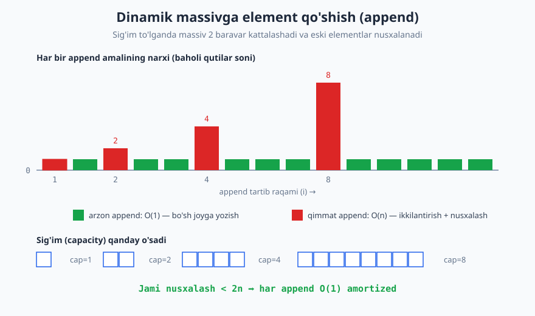
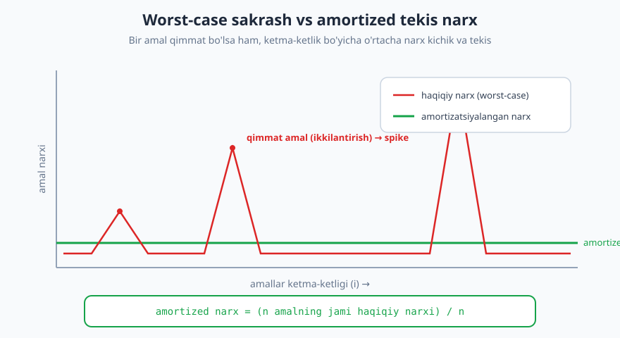
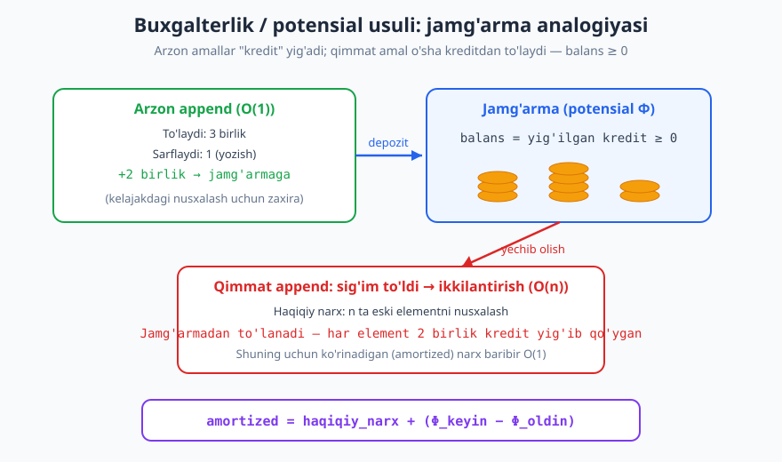

# 11 — Amortizatsiyalangan tahlil

[⬅️ Oldingi: 10 — Rekurrent munosabatlar va Master teorema](./10-rekurrent-master-teorema.md) · [🏠 README](./README.md) · [Keyingi: 12 — Massiv va dinamik massiv ➡️](./12-massiv-dinamik-massiv.md)

---

> **Bu bobda:** Ba'zi amallar gohida juda qimmat (masalan, dinamik massiv to'lganda uni ikkilantirib nusxalash — O(n)), lekin ko'p amaldan iborat ketma-ketlikda o'rtacha narx baribir arzon bo'lib qoladi. Shu hodisani aniq o'lchaydigan **amortizatsiyalangan tahlil**ni va uning uchta klassik usulini (aggregate, accounting, potensial) o'rganamiz. Asosiy misol — dinamik massivga `append` — ni uchala usulda ham yechib chiqamiz.
>
> **Halollik / Eslatma:** Bu yerdagi barcha chegaralar (geometrik yig'indi `1+2+4+…+n < 2n`, `append` amortized O(1), binar sanagich amortized O(1)) matematik aniq va isbotlangan. Amortizatsiyalangan tahlil **o'rtacha holat (average-case) emas** — ehtimollik ishlatilmaydi; bu eng yomon ketma-ketlik uchun ham beriladigan kafolat. Python namunalari haqiqatan ishga tushirib tekshirilgan: nusxalash va bit-flip sonlari kod chiqargan haqiqiy raqamlar.

---

## Muammo: bitta qimmat amal butun tahlilni "buzadi"

Tasavvur qiling, sizda massiv bor, lekin uning hajmi oldindan ma'lum emas — elementlar birma-bir kelib qoladi. Statik massivning sig'imi qat'iy, shuning uchun **dinamik massiv** ishlatiladi: u to'lib qolsa, kattaroq yangi massiv ajratiladi va eski elementlar unga ko'chiriladi.

Bitta `append` (oxiriga element qo'shish) amalini ko'raylik:

- **Ko'pincha** massivda bo'sh joy bor: shunchaki bo'sh katakka yozamiz — bu **O(1)**, juda arzon.
- **Ba'zan** massiv to'lib qoladi: yangi (ikki barobar katta) massiv ajratamiz va `n` ta eski elementni nusxalaymiz — bu **O(n)**, qimmat.

Endi savol: bitta `append`ning murakkabligi qancha?

Agar biz **eng yomon holat**ni (worst-case) to'g'ridan-to'g'ri qo'llasak, javob **O(n)** bo'ladi — chunki bitta `append` n ta nusxalashni talab qilishi mumkin. Demak `n` ta `append` qilsak, "eng yomon holat" mantig'i bilan jami `n × O(n) = O(n²)` deb baholaymiz.

> **Diqqat:** Bu baho **rost, lekin juda pessimistik**. U haqiqatdan ancha uzoq. Sababi: qimmat `append` *har safar* sodir bo'lmaydi — u faqat massiv to'lganda, ya'ni juda kam hollarda yuz beradi. Qimmat amalni "har bir amalga" yozib chiqish — bir kishining bir martalik katta xaridini butun yilga har kuni qaytarib hisoblashdek.

Haqiqiy savol — bitta ajratilgan `append` qancha turadi emas, balki: **`n` ta `append`ning hammasi birgalikda qancha turadi?** Mana shu yerda amortizatsiyalangan tahlil yordamga keladi.



Yuqoridagi diagrammada har bir `append`ning narxini ustun balandligi bilan ko'rsatdik: yashil ustunlar — arzon (O(1)) amallar, qizil baland ustunlar — sig'im to'lganda yuz beradigan qimmat (ikkilantirish + nusxalash) amallar. E'tibor bering: qizil sakrashlar (spike) tobora kamroq uchraydi, lekin har gal balandroq bo'ladi.

## Amortizatsiyalangan tahlil nima

> **Intuitsiya:** "Bitta amal eng yomon holatda qancha turadi?" emas, balki "**ketma-ketlikdagi har bir amalga to'g'ri keladigan o'rtacha haqiqiy narx qancha?**" degan savolga javob beradi.

Aniq ta'rif: `n` ta amal ketma-ketligi berilgan bo'lsin. Ularning **jami haqiqiy narxi** `T(n)` bo'lsin. U holda bir amalning **amortizatsiyalangan narxi** (amortized cost):

```text
amortized narx = T(n) / n
```

Ya'ni jami narxni amal soniga teng taqsimlaymiz. Agar `T(n) = O(n)` bo'lsa, har amalga `O(n)/n = O(1)` amortized narx tushadi — qimmat amallar bo'lsa-da!

**Eng muhim ikki nuqta:**

1. **Bu o'rtacha holat (average-case) EMAS.** Average-case tahlil kirishlar ustidan *ehtimollik* taqsimotini oladi va "kirishlar tasodifiy bo'lganda o'rtacha qancha?" deydi. Amortizatsiyalangan tahlilda ehtimollik **umuman yo'q**. Biz **eng yomon ketma-ketlik** uchun ham `T(n) = O(n)` ekanini *kafolatlaymiz*. Demak amortized chegara — qat'iy, dushman (adversary) qanday tartibda amal bersa ham buziladigan emas.

2. **Bu bitta amal har doim arzon degani emas.** Bitta `append` haqiqatan O(n) bo'lishi mumkin. Amortized faqat shuni aytadi: bunday qimmat amallar shu qadar **kam** ki, ularning narxi arzon amallar oralig'ida "yutib yuboriladi".



Diagrammada qizil chiziq — har bir amalning haqiqiy narxi (qimmat amallarda yuqoriga sakraydi), yashil tekis chiziq — amortizatsiyalangan narx. Yashil chiziq tekis va past: ketma-ketlik bo'yicha o'rtacha narx kichik.

> **Trade-off:** Amortizatsiyalangan tahlil bizga **soddalik** va **ko'p amal uchun aniq kafolat** beradi. Evaziga u **bitta** alohida amal haqida hech narsa va'da qilmaydi — agar real vaqtli (real-time) tizim qursangiz, bunda *har* amal qattiq vaqt chegarasiga sig'ishi shart bo'lsa, amortized O(1) yetarli bo'lmasligi mumkin (ba'zan bitta amal O(n) bo'ladi). Bunday holatda incremental rehashing kabi maxsus texnikalar kerak bo'ladi.

## Uch usul

Amortized narxni isbotlashning uch standart usuli bor. Ular bir xil natijani beradi, lekin turli vaziyatda biri qulayroq.

### 1-usul. Aggregate (yig'indi) usuli

Eng to'g'ridan-to'g'ri usul: **butun ketma-ketlikning jami narxini hisoblab, `n` ga bo'lamiz**. Hech qanday hiyla yo'q — faqat to'g'ri yig'indini topish kerak.

**Dinamik massiv uchun.** `n` ta `append` qilamiz (sodda qilib `n = 2^k` deylik, sig'im 1 dan boshlansin). Ikkilantirishlar `append` raqamlari 1, 2, 4, 8, …, ya'ni 2 ning darajalarida sodir bo'ladi. Har bir ikkilantirishda nusxalanadigan elementlar soni — o'sha paytdagi sig'im:

```text
nusxalashlar:  1 + 2 + 4 + 8 + ... + n/2 + n
```

Bu **geometrik qator**. Uning yig'indisi:

```text
1 + 2 + 4 + ... + n  =  2n - 1  <  2n
```

> **Isbot (eskiz):** Geometrik qator `1 + 2 + 4 + ... + 2^k = 2^(k+1) - 1`. Buni isbotlash uchun ikki tomonni 1 ga ko'paytirib ayirib ko'ring yoki teleskoplang: agar `S = 1+2+...+2^k` bo'lsa, `2S = 2+4+...+2^(k+1)`, demak `2S - S = 2^(k+1) - 1`, ya'ni `S = 2^(k+1) - 1`. Bizning holatda `2^k = n`, shuning uchun `S = 2n - 1`.

Demak `n` ta `append`ning **jami** narxi: `n` ta yozish (har biri O(1)) + `< 2n` ta nusxalash = **O(n)**. Bir `append`ga to'g'ri keladigan amortized narx:

```text
amortized = O(n) / n = O(1)
```

Mana shunday — gohida qimmat bo'lsa-da, `append` **amortized O(1)**.

Bu g'oyani Python kodida empirik tasdiqlaymiz — dinamik massivni qo'lda yasab, **jami nechta element nusxalanishini** sanaymiz:

```python
class DynArray:
    def __init__(self):
        self.cap = 1            # boshlang'ich sig'im
        self.n = 0              # band elementlar soni
        self.data = [None] * self.cap
        self.kopirovka = 0      # jami nechta element nusxalandi

    def append(self, x):
        if self.n == self.cap:          # sig'im to'ldi -> ikkilantiramiz
            self.cap *= 2
            yangi = [None] * self.cap
            for i in range(self.n):     # eski elementlarni nusxalash
                yangi[i] = self.data[i]
                self.kopirovka += 1
            self.data = yangi
        self.data[self.n] = x           # arzon qadam: bo'sh joyga yozish
        self.n += 1

for n in [1, 10, 100, 1000, 10000]:
    a = DynArray()
    for i in range(n):
        a.append(i)
    print(f"n={n:>5}: jami nusxalash={a.kopirovka:>5}, nisbat (nusxa/n)={a.kopirovka/n:.3f}")

# Chiqish:
# n=    1: jami nusxalash=    0, nisbat (nusxa/n)=0.000
# n=   10: jami nusxalash=   15, nisbat (nusxa/n)=1.500
# n=  100: jami nusxalash=  127, nisbat (nusxa/n)=1.270
# n= 1000: jami nusxalash= 1023, nisbat (nusxa/n)=1.023
# n=10000: jami nusxalash=16383, nisbat (nusxa/n)=1.638
```

E'tibor bering: "nusxa/n" nisbati hech qachon **2 dan oshmaydi**. U `n` qancha katta bo'lmasin chegaralangan bo'lib qoladi — bu aynan amortized O(1) ekanining empirik isboti. (Nisbat yuqoriga sakrasa-sakrasa, har gal ikkilantirishdan keyin pasayadi, lekin doim 2 dan kichik.)

> **Eslatma:** `n` 2 ning aniq darajasi bo'lganda (8, 16, 1024, ...) nusxalash soni `n - 1` ga teng bo'ladi (oxirgi `append`dan keyin to'lib qolish chetda); shuning uchun `n=1000` da nisbat `1.023` ga tushib qoladi, `n=10000` da esa `1.638` — bu `n` 2 ning darajasiga qanchalik yaqinligiga bog'liq, lekin har doim `< 2`.

### 2-usul. Accounting (buxgalterlik / kredit) usuli

Aggregate usuli sodda, lekin u butun ketma-ketlikning jami narxini bilishni talab qiladi. **Accounting usuli** boshqacha yondashadi: har bir amalga **"amortized narx"** (xayoliy to'lov) belgilaymiz va shu to'lov bilan kelajakdagi qimmat amallarni "oldindan to'lab qo'yamiz".

> **Intuitsiya — jamg'arma daftarchasi.** Har amalda biz haqiqiy narxidan **ko'proq** to'laymiz. Ortiqcha to'langan pul **kredit** (jamg'arma) sifatida saqlanadi, har bir element ustida "tanga" bo'lib yotadi. Qimmat amal kelganda, biz uni **yig'ilgan kredit** hisobiga to'laymiz. Asosiy shart: **balans hech qachon manfiy bo'lmasligi** kerak — aks holda kelajakdan qarz olgan bo'lardik, bu esa chegarani buzadi.

Agar belgilangan amortized to'lovlar bilan **balans doim ≥ 0** ekanini ko'rsata olsak, u holda:

```text
jami amortized to'lovlar  ≥  jami haqiqiy narx
```

(chunki manfiy bo'lmagan balans = to'langan, lekin hali sarflanmagan pul). Demak amortized to'lovlar yig'indisi jami haqiqiy narx uchun yuqori chegara bo'ladi — bu aynan bizga kerak narsa.

**Dinamik massiv uchun kredit sxemasi.** Har bir `append`ga **3 birlik** to'lov belgilaymiz:

- **1 birlik** — yangi elementni o'z katagiga yozish (haqiqiy, hozir sarflanadi).
- **2 birlik** — kreditga (jamg'armaga) qo'yiladi: shu **yangi element** ustiga 1 tanga, va oldingi yarmidagi "tangasiz" element ustiga 1 tanga.

Nega aynan 2 ta zaxira tanga yetarli? Quyidagicha o'ylang. Massiv `m` sig'imdan `2m` ga ikkilantirilganda, biz `m` ta eski elementni nusxalashimiz kerak (narxi `m`). Lekin oxirgi ikkilantirishdan beri biz aynan `m/2` ta yangi element qo'shdik (sig'im `m` ga yetishi uchun yarmidan to'ldik). Bu `m/2` ta element har biri **2 tanga** qo'ygan — jami `m` tanga. Mana shu `m` tanga keyingi `m` ta nusxalashning narxini to'liq qoplaydi!

```text
har append to'laydi:    3 birlik
har append sarflaydi:   1 birlik (yozish) hozir
                        + qoldiq 2 birlik -> kreditga
ikkilantirishda:        n ta nusxalash <- yig'ilgan kreditdan to'lanadi
balans:                 har doim >= 0  ✓
```

Har `append`ning amortized narxi **3 = O(1)**, va balans hech qachon manfiy bo'lmagani uchun bu rost yuqori chegara. Yana o'sha xulosa: **append amortized O(1)**.



### 3-usul. Potensial (potential) usuli

Accounting usulidagi "tangalarni" alohida-alohida kuzatish bezovta qiladigan bo'lishi mumkin. **Potensial usuli** — buning matematik, formal va ixcham shakli. "Tangalar" o'rniga butun strukturaning hozirgi holatiga bog'liq bitta son — **potensial funksiya** `Φ` (Fi) kiritiladi. U "jamg'armadagi umumiy pul"ni bir son bilan ifodalaydi.

Ta'rif. `i`-amaldan oldingi struktura holati `D_(i-1)`, undan keyingisi `D_i` bo'lsin. `i`-amalning **amortized narxi**:

```text
amortized_i = haqiqiy_narx_i + Φ(D_i) − Φ(D_(i-1))
            = haqiqiy_narx_i + ΔΦ
```

Ya'ni amortized = haqiqiy narx + potensial o'zgarishi. Arzon amal potensialni oshiradi (`ΔΦ > 0` — jamg'armaga qo'yamiz), qimmat amal potensialni kamaytiradi (`ΔΦ < 0` — jamg'armadan olamiz), shuning uchun qimmat amalning katta haqiqiy narxi `ΔΦ`ning katta manfiy qiymati bilan "yutib yuboriladi".

**Nega bu ishlaydi.** `n` ta amalning amortized narxlarini qo'shamiz — `Φ` hadlari **teleskoplanadi** (ketma-ket qisqaradi):

```text
Σ amortized_i = Σ haqiqiy_i + (Φ(D_1) − Φ(D_0)) + (Φ(D_2) − Φ(D_1)) + ...
              = Σ haqiqiy_i + Φ(D_n) − Φ(D_0)
```

Agar `Φ(D_0) = 0` (boshlang'ich potensial nol) va `Φ(D_i) ≥ 0` (potensial hech qachon manfiy emas) deb tanlasak, u holda:

```text
Σ amortized_i = Σ haqiqiy_i + Φ(D_n)  ≥  Σ haqiqiy_i
```

Demak amortized narxlar yig'indisi jami haqiqiy narx uchun yuqori chegara — accounting usulidagidek, faqat formalroq.

**Dinamik massiv uchun potensial funksiya.** Yaxshi `Φ` tanlash — usulning eng "ijodiy" qismi. Quyidagini tanlaymiz:

```text
Φ = 2 · n − cap
```

bu yerda `n` — band elementlar soni, `cap` — joriy sig'im. (Massiv kamida yarmi to'lganda `2n ≥ cap`, demak `Φ ≥ 0`; boshda `n = cap = 0`, `Φ = 0`.)

- **Arzon append** (joy bor, `cap` o'zgarmaydi): haqiqiy narx 1; `n` 1 ga ortadi, demak `ΔΦ = +2`. Amortized `= 1 + 2 = 3`.
- **Qimmat append** (massiv to'la edi: `n = cap = m`): haqiqiy narx `m + 1` (m ta nusxa + 1 yozish). Amaldan keyin `n = m+1`, `cap = 2m`. Potensial o'zgarishi:

```text
Φ_oldin = 2m − m = m
Φ_keyin = 2(m+1) − 2m = 2
ΔΦ = 2 − m
amortized = (m + 1) + (2 − m) = 3
```

Ikkala holatda ham amortized narx **3 = O(1)**. `m` (qimmat haqiqiy narx) `ΔΦ`ning `−m` qismi bilan to'liq qisqardi.

> **Eslatma:** Uchala usul ham xuddi shu **3** raqamini berdi — bu tasodif emas. Accounting usulidagi "har element 2 tanga" va potensialdagi `2n − cap` — bir g'oyaning ikki ifodasi. Potensial usuli ko'pincha eng ixchami, chunki har bir amalni alohida hikoya qilish o'rniga bitta funksiya barchasini hisobga oladi.

## Klassik misol: binar sanagichni 1 ga oshirish

Ikkinchi mumtoz misol — `k` bitli **binar sanagich**ni 0 dan boshlab `n` marta 1 ga oshirish (increment). Har incrementda nechta bit **almashadi** (flip qiladi)?

Bitta increment eng yomon holatda **barcha `k` ta bitni** o'zgartirishi mumkin: masalan `0111 + 1 = 1000` — 4 ta bit flip. Demak worst-case bir incrementga **O(k)**. Sodda baholash: `n × O(k) = O(nk)`.

Lekin amortized tahlil yaxshiroq javob beradi. **Aggregate usuli** bilan: nechta marta har bir bit flip qiladi?

- **0-bit** (eng past): *har* incrementda flip qiladi → `n` marta.
- **1-bit**: *har ikkinchi* incrementda → `n/2` marta.
- **2-bit**: *har to'rtinchi* incrementda → `n/4` marta.
- ... `i`-bit: `n / 2^i` marta.

Jami flip soni:

```text
n + n/2 + n/4 + n/8 + ...  <  2n
```

Yana o'sha geometrik qator! Jami flip `< 2n = O(n)`, demak bir incrementga amortized:

```text
amortized = O(n) / n = O(1)
```

Bir increment **amortized O(1)** bit-flip qiladi (k ga bog'liq emas!). Buni Python bilan tasdiqlaymiz:

```python
def jami_flip(n, bitlar=16):
    bit = [0] * bitlar
    flip = 0
    for _ in range(n):
        i = 0
        while i < bitlar and bit[i] == 1:   # 1 larni 0 ga aylantirib o'tamiz
            bit[i] = 0
            flip += 1
            i += 1
        if i < bitlar:                       # birinchi 0 ni 1 ga
            bit[i] = 1
            flip += 1
    return flip

for n in [1, 16, 256, 4096]:
    f = jami_flip(n)
    print(f"n={n:>5}: jami flip={f:>5}, flip/n={f/n:.3f}  (chegara: < 2)")

# Chiqish:
# n=    1: jami flip=    1, flip/n=1.000  (chegara: < 2)
# n=   16: jami flip=   31, flip/n=1.938  (chegara: < 2)
# n=  256: jami flip=  511, flip/n=1.996  (chegara: < 2)
# n= 4096: jami flip= 8191, flip/n=2.000  (chegara: < 2)
```

`flip/n` nisbati 2 ga yaqinlashadi, lekin **hech qachon 2 ga yetmaydi** (`n = 2^k` uchun jami flip aynan `2n − 1`). Bu — amortized O(1) ning aniq tasdig'i.

> **Potensial bilan ham (eskiz):** `Φ = sanagichdagi 1 bitlar soni` deb oling. Increment `c` ta oxirgi 1 ni 0 ga aylantiradi va bitta 0 ni 1 ga qiladi (agar to'lib ketmasa). Haqiqiy narx `= c + 1` flip. `ΔΦ = 1 − c` (bitta 1 qo'shildi, `c` ta 1 yo'qoldi). Amortized `= (c + 1) + (1 − c) = 2 = O(1)`. Yana ixcham va tartibli.

## Qisqa misol: stack multipop

Yana bir tez misol — stack (stek) ustida ikki amal: `push(x)` (bitta element qo'shish, O(1)) va `multipop(k)` (eng tepadagi `k` ta elementni chiqarib tashlash; agar stekda `k` dan kam bo'lsa, hammasini). Bitta `multipop` eng yomon holatda butun stekni bo'shatishi mumkin — O(n). Demak worst-case multipop O(n).

Lekin amortized: **har element stekka faqat bir marta `push` qilinadi va ko'pi bilan bir marta `pop` qilinadi**. Demak `n` ta amal (push/multipop aralash) ketma-ketligida jami `pop` (multipop ichidagilarni qo'shib) soni jami `push` sonidan oshmaydi, ya'ni `≤ n`. Jami narx `O(n)`, har amal amortized **O(1)**.

> **Asosiy g'oya:** "Stekdan chiqaza olmaysiz, avval qo'ymagan narsani." Bu accounting usulining bir ko'rinishi: har `push` o'ziga kelajakdagi `pop` uchun 1 tanga to'lab qo'yadi. Stack — [Stack, Queue va Deque](./14-stack-queue-deque.md) bobida batafsil.

Quyida bu uchta misol qanchalik farq qilishi (worst-case bir amal vs amortized) jadval ko'rinishida:

| Amal | Bitta amalning worst-case narxi | n amal uchun amortized narx |
|---|---|---|
| Dinamik massiv `append` | O(n) (ikkilantirish) | **O(1)** |
| Binar sanagich `increment` | O(k) (`0111→1000`) | **O(1)** |
| Stack `push` / `multipop` | O(n) (butun stekni bo'shatish) | **O(1)** |

## Nega bu muhim: strukturalarning yashirin kuchi

Amortizatsiyalangan tahlil shunchaki chiroyli matematika emas — u **eng ko'p ishlatiladigan ma'lumotlar strukturalarining** asoslarini tushuntiradi:

- **Dinamik massiv** (Python `list`, C++ `vector`, Java `ArrayList`, Go `slice`): `append` amortized O(1). Aynan shu sabab siz hajmi noma'lum ma'lumotlarni xotirjam massivga qo'shib boraverasiz — to'liq tahlilini [Massiv va dinamik massiv](./12-massiv-dinamik-massiv.md) bobida ko'rasiz.
- **Hash jadval** (`dict`, `HashMap`): elementlar ko'payganda jadval **rehashing** qilinadi — butun jadval qayta qurilib, hamma kalit ko'chiriladi (O(n)). Lekin xuddi dinamik massivdek, bu kamdan-kam yuz beradi, shuning uchun `insert`/`lookup` **amortized O(1)** bo'lib qoladi. Bu — [Hash jadval](./15-hash-jadval.md) bobining markaziy g'oyalaridan.
- **Disjoint Set (Union-Find)**, splay daraxtlari, Fibonacci heap kabi ilg'or strukturalarning samaradorligi **faqat** amortized tahlil orqali to'g'ri tushuniladi.

Boshqacha aytganda: agar siz biror struktura "amortized O(1)" deb yozilganini ko'rsangiz, demak u gohida sekin ishlaydi, lekin ko'p amal davomida o'rtacha tez — va bu sizning amaliyotingiz uchun deyarli har doim yetarli.

> **Eslatma:** Amortized chegaralar — bu Big-O ning kuchaytirilgan, "vaqt bo'yicha o'rtachalashtirilgan" qo'llanilishi. Asimptotik notatsiyani eslab qo'yish uchun [Asimptotik notatsiya](./08-asimptotik-notatsiya.md) bobiga qarang.

## Asosiy g'oyalar (bobni qisqacha)

- **Amortizatsiyalangan narx** = `n` ta amal ketma-ketligining jami haqiqiy narxi `/ n`. Bu bitta amalning eng yomon narxidan ancha aniqroq baho beradi.
- Bu **o'rtacha holat emas** — ehtimollik yo'q. Amortized chegara *eng yomon ketma-ketlik* uchun ham kafolatlanadi.
- **Aggregate usuli:** jami narxni hisoblab `n` ga bo'l. Dinamik massiv: `1+2+4+…+n < 2n` (geometrik qator) ⟹ append amortized O(1).
- **Accounting usuli:** har amalga belgilangan to'lov; arzon amallar kredit yig'adi, qimmat amal kreditdan to'laydi; **balans doim ≥ 0** bo'lishi shart. Dinamik massiv: har append 3 birlik to'laydi.
- **Potensial usuli:** potensial funksiya `Φ ≥ 0` (boshda 0); `amortized = haqiqiy + ΔΦ`; `Φ` hadlari teleskoplanadi. Dinamik massiv: `Φ = 2n − cap`, amortized = 3.
- Klassik misollar: dinamik massiv `append`, binar sanagich `increment`, stack `multipop` — barchasi **amortized O(1)**.
- Amortized tahlil dinamik massiv va hash jadval rehashing kabi strukturalarning O(1) kuchini tushuntiradi.

## Mashqlar

### Oson

**1-mashq.** O'z so'zlaringiz bilan tushuntiring: "dinamik massiv `append` amortized O(1)" jumlasi nimani anglatadi va u bilan "`append` worst-case O(1)" jumlasi orasidagi farq nima? Worst-case `append` qancha?

**2-mashq.** Geometrik yig'indini hisoblang: `1 + 2 + 4 + 8 + ... + 1024` nechaga teng? Umumiy formuladan (`2^(k+1) − 1`) foydalaning, keyin tekshirib ko'ring.

**3-mashq.** Agar dinamik massivga 16 ta element ketma-ket `append` qilinsa (sig'im 1 dan boshlanib, har to'lganda ikkilanadi), jami nechta element nusxalanadi? Ikkilantirishlar qaysi `append`larda yuz beradi?

### O'rta

**4-mashq.** Aggregate usuli bilan ko'rsating: massiv sig'imi 1 dan boshlansin, `n` ta `append` bo'lsin (`n = 2^k`). Jami nusxalashlar sonini geometrik qator orqali yozing va u `< 2n` ekanini isbotlang. Shundan amortized narxni chiqaring.

**5-mashq.** Binar sanagichni 0 dan 8 gacha (ya'ni 8 marta increment, natija `1000`) oshiring. Har incrementda nechta bit flip qilishini jadvalda yozing va jami flip sonini toping. Uni `2 × 8` bilan solishtiring.

**6-mashq.** Stack `push`/`multipop` misolida quyidagi ketma-ketlik bajariladi (bo'sh stekdan boshlab): `push, push, push, multipop(2), push, multipop(5)`. Har amalning haqiqiy narxini (bitta push = 1, multipop(k) = chiqarilgan elementlar soni) yozing, jami narxni toping va 6 amalga amortized narxni hisoblang.

### Qiyin

**7-mashq.** Accounting usuli uchun dinamik massivda **har append 3 birlik to'laydi** sxemasi to'g'ri ishlashini ko'rsating: massiv `m` dan `2m` ga ikkilantirilganda kerak bo'lgan `m` ta nusxalashni qoplash uchun yetarlicha kredit yig'ilganini isbotlang. Nega 2 emas, balki **3** birlik kerakligini tushuntiring (1 birlik nima uchun ketadi).

**8-mashq.** Binar sanagich uchun **potensial funksiya** taklif qiling va u bilan increment amortized O(1) ekanini ko'rsating. `Φ ≥ 0` va `Φ(boshlang'ich) = 0` shartlari bajarilishini tekshiring.

**9-mashq.** Ko'pchilik amaliy tizimlar massivni 2x emas, **1.5x** o'sish faktori bilan kattalashtiradi. (a) 1.5x faktor bilan ham `append` amortized O(1) bo'lib qolishini ko'rsating (geometrik qator `r = 1.5` da ham yaqinlashadi). (b) Nega 1.5x ni 2x dan afzal ko'rishlari mumkin — qaysi resurs tejaladi? (c) Agar o'sish faktori `r > 1` bo'lsa, amortized nusxalash narxi taxminan `r / (r − 1)` ekanini chiqaring va `r = 2` hamda `r = 1.5` uchun qiymatini toping.

<details markdown="1">
<summary>Yechimlar</summary>

### 1-mashq yechimi

"Amortized O(1)" — *bitta* `append` har doim O(1) degani **emas**. U shuni anglatadi: **`n` ta `append` ketma-ketligining jami narxi O(n)**, demak har biriga o'rtacha O(1) to'g'ri keladi. Bitta alohida `append` esa qimmat (massiv to'lganda O(n)) bo'lishi mumkin.

"Worst-case O(1)" esa *har bir* alohida `append` doim O(1) bo'lishini talab qilardi — bu dinamik massiv uchun **noto'g'ri**, chunki ikkilantirish paytidagi `append` O(n) ishlaydi. Demak `append`ning **worst-case narxi O(n)**, amortized narxi esa O(1).

### 2-mashq yechimi

Formula: `1 + 2 + 4 + ... + 2^k = 2^(k+1) − 1`. Bu yerda eng katta had `1024 = 2^10`, demak `k = 10`:

```text
1 + 2 + ... + 1024 = 2^11 − 1 = 2048 − 1 = 2047
```

Tekshirish: `1+2+4+8+16+32+64+128+256+512+1024 = 2047`. ✓ (Har keyingi had avvalgi barcha hadlar yig'indisidan 1 ga ko'p — geometrik qatorning chiroyli xossasi.)

### 3-mashq yechimi

Sig'im 1, 2, 4, 8, 16 bo'lib o'sadi. Ikkilantirish `append` to'lgan massivga element qo'shilganda yuz beradi — ya'ni 1-, 2-, 4-, 8-, 16-`append`larda... lekin 16-da to'xtaymiz (16 element qo'shildi, oxirgi ikkilantirish 9-`append`da sig'imni 16 ga ko'targan, 16-`append` hali to'ldirmaydi). Nusxalanadigan elementlar har ikkilantirishda:

```text
append #1: 0 ta nusxa (cap 1->2, lekin hali element yo'q edi... aslida 0->1, cap 1)
```

Aniqroq sanaymiz (kod mantig'i: `append` paytida `n == cap` bo'lsa nusxalash):

| append # | nusxa |
|---|---|
| 2 | 1 |
| 3 | 2 |
| 5 | 4 |
| 9 | 8 |

Jami nusxa = `1 + 2 + 4 + 8 = 15`. (Bu `2·16/2 − 1 = 15`, ya'ni `n − 1` bilan mos — Python kodimiz `n=10` da 15 chiqargani ham shuning bir qismi.) Ikkilantirishlar 2-, 3-, 5-, 9-`append`larda (ya'ni `2^i + 1` raqamlarda) yuz beradi.

### 4-mashq yechimi

`n = 2^k`. Sig'im 1 dan boshlanadi va to'lganda ikkilanadi: `1, 2, 4, ..., n`. Ikkilantirish paytida nusxalanadigan elementlar soni — o'sha paytdagi to'la sig'im: `1, 2, 4, ..., n/2`. Jami nusxalashlar:

```text
C = 1 + 2 + 4 + ... + n/2 = Σ_{i=0}^{k-1} 2^i = 2^k − 1 = n − 1
```

Jami narx = `n` ta yozish + `C` ta nusxalash = `n + (n − 1) = 2n − 1 < 2n`. Demak jami = O(n), amortized = `O(n)/n = O(1)`. ✓ (Geometrik qator `1+2+...+n/2`, `< n`, shuning uchun nusxalashning o'zi ham `< n`.)

### 5-mashq yechimi

| increment | oldin | keyin | flip soni |
|---|---|---|---|
| 1 | 000 | 001 | 1 |
| 2 | 001 | 010 | 2 |
| 3 | 010 | 011 | 1 |
| 4 | 011 | 100 | 3 |
| 5 | 100 | 101 | 1 |
| 6 | 101 | 110 | 2 |
| 7 | 110 | 111 | 1 |
| 8 | 111 | 1000 | 4 |

Jami flip = `1+2+1+3+1+2+1+4 = 15`. Solishtirish: `2 × 8 = 16`, va `15 < 16` — mos keladi (`2n − 1 = 15`). Amortized = `15 / 8 ≈ 1.875 = O(1)`. ✓

### 6-mashq yechimi

| amal | haqiqiy narx | stek (keyin) |
|---|---|---|
| push | 1 | [a] |
| push | 1 | [a, b] |
| push | 1 | [a, b, c] |
| multipop(2) | 2 | [a] |
| push | 1 | [a, d] |
| multipop(5) | 2 | [] (faqat 2 ta bor edi) |

Jami narx = `1+1+1+2+1+2 = 8`. Amortized = `8 / 6 ≈ 1.33 = O(1)`. E'tibor: oxirgi `multipop(5)` 5 emas, faqat **2** ta element chiqardi (stekda 2 ta bor edi), shuning uchun narxi 2. Umuman, jami `pop` ≤ jami `push` (4 ta push bo'ldi, jami pop = 2+2 = 4) — hech qachon qo'yilmagandan ko'p chiqarib bo'lmaydi.

### 7-mashq yechimi

Massiv `m` sig'imdan `2m` ga ikkilantirilishidan **oldin**, oxirgi ikkilantirishdan beri biz aynan `m/2` ta yangi `append` qildik (sig'im `m` edi, yarmidan `m` gacha to'ldirdik — chunki oldingi ikkilantirish sig'imni `m/2` dan `m` ga ko'targanda massivda `m/2` element bor edi). Bu `m/2` ta `append`ning har biri **2 birlik** kredit qo'ygan, demak jamg'armada `m/2 × 2 = m` birlik bor. Ikkilantirish narxi aynan `m` ta nusxalash = `m` birlik. Demak yig'ilgan kredit nusxalashni **to'liq qoplaydi**, balans 0 ga tushadi (manfiy emas). ✓

Nega 3 birlik (2 emas)? Har `append`da to'lovning: **1 birligi hozir sarflanadi** — yangi elementni o'z katagiga yozish (bu ikkilantirishdan alohida, har doim sodir bo'ladigan haqiqiy ish). Qolgan **2 birlik** kelajak nusxalashlar uchun zaxiraga (kreditga) qo'yiladi. Agar faqat 2 to'lasak, yozish uchun joy qolmaydi yoki kredit yetmaydi; 3 — eng kichik butun son bo'lib, ham yozishni, ham yetarli kreditni qoplaydi.

### 8-mashq yechimi

`Φ = sanagichdagi 1 bitlar soni` deb tanlaymiz. Tekshirish: 1 bitlar soni hech qachon manfiy emas, demak `Φ ≥ 0`; boshlang'ich sanagich `000...0`, demak `Φ(boshlang'ich) = 0`. ✓

Bitta increment `c` ta ketma-ket oxirgi 1 ni 0 ga aylantiradi, so'ng bitta 0 ni 1 ga (to'lib ketmasa). **Haqiqiy narx** = `c + 1` flip. **Potensial o'zgarishi**: `c` ta 1 yo'qoldi, 1 ta 1 paydo bo'ldi, demak `ΔΦ = 1 − c`. Amortized:

```text
amortized = (c + 1) + (1 − c) = 2 = O(1)
```

`c` (qimmat holatdagi katta narx) `ΔΦ` ning `−c` qismi bilan to'liq qisqardi. Demak har increment amortized O(1). ✓

### 9-mashq yechimi

**(a)** 1.5x faktor bilan sig'im `1, 1.5, 2.25, ...` (amalda yuqoriga yaxlitlanib) `1, 2, 3, 5, 8, 12, ...` kabi o'sadi — ya'ni geometrik, asos `r = 1.5`. `n` ta `append`dagi jami nusxalash hali ham geometrik qator: `... + n/1.5² + n/1.5 + n`, bu `n × Σ (1/1.5)^i = n × 1/(1 − 1/1.5) = n × 3 = 3n` ga yaqinlashadi (chekli yig'indi). Jami narx `O(n)`, amortized `O(1)`. ✓ Asosiy shart: `r > 1` bo'lsa, geometrik qator yaqinlashadi.

**(b)** 1.5x **xotirani** tejaydi: ikkilantirish (2x) massivni ortiqcha kattalashtiradi — eng yomon holatda massivning yarmi bo'sh qolishi mumkin. 1.5x da bo'sh joy kamroq (eng yomon holatda ~1/3). Bundan tashqari, kichikroq o'sish faktori ozod qilingan eski bloklarni keyingi ajratmalar uchun qayta ishlatish ehtimolini oshiradi (xotira fragmentatsiyasini kamaytiradi). Evaziga ikkilantirishlar tez-tezroq yuz beradi (ko'proq nusxalash), ya'ni vaqt biroz ko'proq.

**(c)** O'sish faktori `r > 1` bo'lsin. `n` ta `append`dagi jami nusxalash taxminan geometrik qator yig'indisi:

```text
C ≈ n · Σ_{i≥1} (1/r)^i = n · (1/r)/(1 − 1/r) = n · 1/(r − 1)
```

Demak amortized nusxalash narxi taxminan `1/(r − 1)`, va jami amortized narx (yozish + nusxalash) taxminan `1 + 1/(r − 1) = r/(r − 1)`.

- `r = 2`: `r/(r−1) = 2/1 = 2` — har `append` o'rtacha ~2 birlik (1 yozish + 1 nusxalash).
- `r = 1.5`: `r/(r−1) = 1.5/0.5 = 3` — har `append` o'rtacha ~3 birlik.

Ya'ni 1.5x **ko'proq vaqt** (ko'proq nusxalash, ~3 vs ~2) sarflaydi, lekin **kamroq xotira** ishlatadi — klassik **vaqt-xotira trade-off**i. Ikkala holatda ham narx `r` ga bog'liq doimiy son, ya'ni amortized **O(1)**.

</details>

---

[⬅️ Oldingi: 10 — Rekurrent munosabatlar va Master teorema](./10-rekurrent-master-teorema.md) · [🏠 README](./README.md) · [Keyingi: 12 — Massiv va dinamik massiv ➡️](./12-massiv-dinamik-massiv.md)
