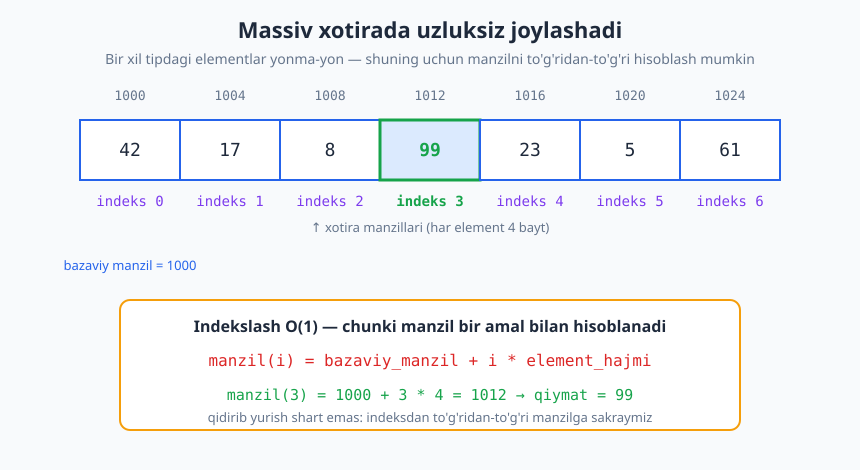
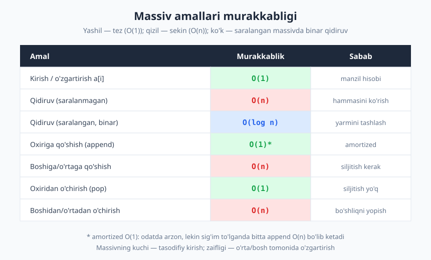
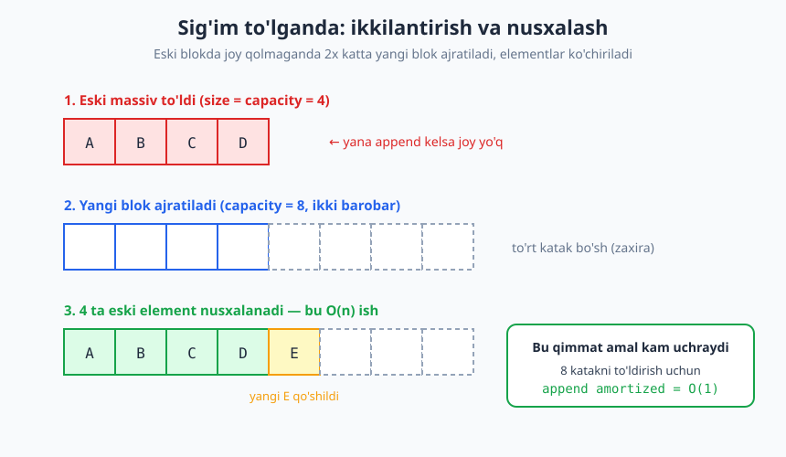

# 12 — Massiv va dinamik massiv

[⬅️ Oldingi: 11 — Amortizatsiyalangan tahlil](./11-amortizatsiyalangan-tahlil.md) · [🏠 README](./README.md) · [Keyingi: 13 — Bog'langan ro'yxatlar (linked list) ➡️](./13-boglangan-royxatlar.md)

---

> **Bu bobda:** Kitobning III qismi — ma'lumotlar strukturalari — boshlanadi. Eng asosiy va eng ko'p ishlatiladigan strukturadan, **massiv**dan, boshlaymiz. Massiv xotirada qanday yotishini, nega indekslash `O(1)` ekanini, qaysi amallar arzon va qaysilari `O(n)` ekanini ko'ramiz. So'ng o'lchami o'sib boradigan **dinamik massiv** (Python `list`, C++ `vector`, Java `ArrayList`) ichkarida qanday ishlashini — sig'im, ikkilantirish, nusxalash — ochib beramiz.
>
> **Halollik / Eslatma:** Bu yerdagi murakkablik chegaralari (indekslash `O(1)`, o'rtaga qo'shish `O(n)`, `append` amortized `O(1)`) matematik aniq; amortized `O(1)` isboti to'liq [11-bobda](./11-amortizatsiyalangan-tahlil.md) berilgan. Manzil hisobi (`baza + i*hajm`) past darajadagi (C kabi) tillar uchun to'g'ridan-to'g'ri, yuqori tillarda esa interpretator orqasidan ham shu g'oya ishlaydi. CPython `list` ichidagi aniq sig'im o'sish jadvali — implementatsiya tafsiloti va versiyaga qarab o'zgarishi mumkin; Python namunalari haqiqatan ishga tushirib tekshirilgan, chiqishlar haqiqiy.

---

## Ma'lumotlar strukturasi nima va nega kerak

Shu paytgacha biz algoritmlar — *amallar ketma-ketligi* — haqida gapirdik. Endi savol boshqacha: bu amallar qaysi **ma'lumot** ustida ishlaydi va u ma'lumot xotirada qanday **tashkillangan**?

**Ma'lumotlar strukturasi** — bu ma'lumotni saqlash va unga amal qilishni tashkillashtirishning usuli. U ikki narsani belgilaydi: (1) elementlar xotirada qanday yotadi, (2) qaysi amallar (qo'shish, o'chirish, qidirish, kirish) qanchalik tez bajariladi.

> **Intuitsiya:** Bir xil kitoblarni uyga olib kelsangiz, ularni qanday joylashtirsangiz — bir uyumga tashlaysizmi, alifbo bo'yicha javonga teraysizmi, indeksli kartoteka tuzasizmi — keyin "falon kitob qayerda?" degan savolga javob tezligi shunga bog'liq. Ma'lumot bir xil, lekin **tashkilot** amallar narxini belgilaydi.

Shuning uchun "qaysi struktura yaxshi?" degan savol ma'nosiz — to'g'ri savol: *qaysi amallar tez-tez kerak bo'ladi?* Struktura tanlash — shu amallarni arzonlashtirish uchun qilinadigan kelishuv (trade-off). Massiv bir amallarni juda tez, boshqalarini sekin bajaradi; [bog'langan ro'yxat](./13-boglangan-royxatlar.md) aksincha. Bu qismda har bir strukturani aynan shu nuqtai nazardan o'rganamiz.

## Massiv (array): uzluksiz xotira

**Massiv** — bu xotirada **uzluksiz** (contiguous) joylashgan, **bir xil tipdagi** elementlar to'plami. "Uzluksiz" degani — elementlar yonma-yon, oraliqsiz yotadi. "Bir xil tip" degani — har bir element bir xil bayt soni egallaydi (masalan, har bir 32-bitli butun son 4 bayt).



Aynan shu ikki xususiyat massivning eng kuchli tomonini beradi.

### Nega indekslash O(1)

Massivning birinchi elementi qaysidir **bazaviy manzil**da (base address) yotadi — uni `baza` deylik. Har bir element `hajm` bayt egallaydi. U holda `i`-elementning manzili oddiy arifmetika bilan topiladi:

```text
manzil(i) = baza + i * hajm
```

Bu — bitta ko'paytirish va bitta qo'shish. Kirish kattaligiga (`n`) **umuman bog'liq emas**: massivda million ta element bo'lsa ham, `a[999999]` ga `a[3]` bilan bir xil tezlikda yetib boramiz. Hech qayerda qidirib yurmaymiz — indeksdan to'g'ridan-to'g'ri manzilga **sakraymiz**. Shuning uchun:

> **Massivga indeks bo'yicha kirish va o'zgartirish — `O(1)` (doimiy vaqt).** Bu massivning belgilovchi xususiyati va "tasodifiy kirish" (random access) deb ataladi: istalgan elementga bir xil narxda yetiladi.

Diagrammadagi misolda `baza = 1000`, `hajm = 4`, demak `manzil(3) = 1000 + 3*4 = 1012` — va aynan o'sha manzildagi qiymat `99`.

### Statik massiv

Eng sof ko'rinishida massiv **statik** bo'ladi: o'lchami yaratilganda belgilanadi va keyin o'zgarmaydi. C da `int a[10];` — bu xotirada 10 ta butun son uchun aniq blok ajratadi, na ortiq, na kam. Statik massivning afzalligi — soddalik va tezlik; kamchiligi — oldindan nechta element kerakligini bilish shart. Agar 10 ta joy ajratib, 11-element kerak bo'lib qolsa — muammo. Aynan shu muammoni keyinroq **dinamik massiv** hal qiladi.

## Asosiy amallar va ularning murakkabligi

Massiv ustida tipik amallarni ko'rib chiqaylik. Har birining narxini aniq Big-O da beramiz.



**1. Kirish / o'zgartirish `a[i]` — `O(1)`.** Yuqorida ko'rdik: manzil hisobi bir amal.

**2. Qidiruv — joylashuviga bog'liq.**

- **Saralanmagan** massivda `x` ni qidirish: birma-bir tekshirib chiqishdan boshqa yo'l yo'q (chiziqli qidiruv) — eng yomon holatda hamma `n` ta elementni ko'ramiz, **`O(n)`**.
- **Saralangan** massivda esa har solishtirishda qidiruv oralig'ining yarmini tashlab yuborishimiz mumkin — **binar qidiruv**, **`O(log n)`**. Bu massivning yana bir ustunligi: uzluksiz joylashuv tufayli o'rtadagi elementga `O(1)` da yetib, "chap yarmidami yoki o'ng yarmida?" degan qarorni darrov beramiz. Binar qidiruvni [28-bobda](./28-qidiruv-algoritmlari.md) batafsil ko'ramiz.

**3. Oxiriga qo'shish — joy bo'lsa `O(1)`.** Agar massivda bo'sh katak qolgan bo'lsa, yangi elementni shunchaki keyingi bo'sh joyga yozamiz — bir amal. (Dinamik massivda joy tugaganda bu vaqti-vaqti bilan qimmatga tushadi — keyingi bo'limga qarang.)

**4. Boshiga yoki o'rtaga qo'shish — `O(n)`.** Mana bu yer massivning zaif tomoni. Agar `i`-pozitsiyaga yangi element qo'ymoqchi bo'lsak, undan keyingi **barcha** elementlarni bittadan o'ngga **siljitishimiz** kerak — aks holda yangi element uchun joy yo'q (uzluksizlikni buzolmaymiz). Eng yomon holatda (boshiga qo'shish) `n` ta element siljiydi — `O(n)`.

```text
[10, 20, 30, 40]  ga  1-pozitsiyaga 99 qo'shamiz:

bosqich:  40 ni o'ngga    -> [10, 20, 30, _, 40]
          30 ni o'ngga    -> [10, 20, _, 30, 40]
          20 ni o'ngga    -> [10, _, 20, 30, 40]
          99 ni joyiga    -> [10, 99, 20, 30, 40]
```

**5. Oxiridan o'chirish — `O(1)`.** Hech narsani siljitish shart emas, faqat o'lchamni bittaga kamaytiramiz.

**6. Boshidan yoki o'rtadan o'chirish — `O(n)`.** Element olib tashlangach hosil bo'lgan "teshik"ni yopish uchun undan keyingi hamma elementlarni bittadan **chapga** siljitamiz — yana `O(n)`.

> **Xulosa:** Massiv **kirish va oxirgi tomondagi amallar** uchun ajoyib (`O(1)`), lekin **bosh/o'rta tomonda qo'shish-o'chirish** uchun yomon (`O(n)`), chunki uzluksizlikni saqlash uchun siljitish kerak.

## Dinamik massiv (dynamic array)

Statik massivning muammosi — qat'iy o'lcham. Amalda biz ko'pincha nechta element kelishini oldindan bilmaymiz. **Dinamik massiv** shu muammoni hal qiladi: u o'sib boradi. Python `list`, C++ `std::vector`, Java `ArrayList`, JavaScript `Array` — hammasi dinamik massiv.

Sehr yo'q: ichkarida baribir statik (qat'iy o'lchamli) blok yotadi. Hiyla ikkita sonni alohida saqlashda:

- **sig'im** (capacity) — ajratilgan blokda jami nechta katak bor;
- **o'lcham** (size) — hozir nechta katak haqiqatan to'ldirilgan.

Doimo `size ≤ capacity`. Massivda hali bo'sh joy bor (`size < capacity`) ekan, `append` shunchaki keyingi bo'sh katakka yozadi — `O(1)`. Lekin `size == capacity` bo'lib qolsa (blok to'ldi), yangi, **kattaroq** blok ajratiladi, eski elementlar unga **nusxalanadi**, va eski blok tashlab yuboriladi.



Odatda yangi sig'im eskisining **2 baravari** qilib olinadi (ba'zi tizimlarda 1.5 baravar). Demak bitta `append` ikki xil narxga ega bo'lishi mumkin:

- ko'p hollarda — `O(1)` (bo'sh joyga yozish);
- vaqti-vaqti bilan, blok to'lganda — `O(n)` (yangi blok + `n` ta elementni nusxalash).

### Append nega amortized O(1)

To'g'ridan-to'g'ri qarasak qo'rqinchli: bitta `append` `O(n)` bo'lishi mumkin, demak `n` ta `append` `O(n²)` emasmi? **Yo'q.** Sababini [11-bobda](./11-amortizatsiyalangan-tahlil.md) to'liq isbotladik; bu yerda qisqa takror.

Sig'im `1, 2, 4, 8, …, n` tarzida ikkilanadi, shuning uchun nusxalashlar faqat shu chegaralarda sodir bo'ladi. `n` ta `append` davomida jami nusxalanadigan elementlar soni:

```text
1 + 2 + 4 + 8 + ... + n/2 + n  <  2n
```

Bu geometrik yig'indi — u `2n` dan kichik, ya'ni `O(n)`. Demak jami `n` ta `append`ning narxi `O(n)`, har bittasiga **`O(n)/n = O(1)`** amortized to'g'ri keladi. Qimmat amallar bor, lekin ular shu qadar kam-ki, narxi arzon amallar orasida "yutib yuboriladi".

> **Diqqat:** Amortized `O(1)` — bu *o'rtacha ketma-ketlik narxi* haqida kafolat, **bitta** alohida `append` haqida emas. Real vaqtli tizimda, har bir amal qattiq vaqt chegarasiga sig'ishi shart bo'lsa, "ba'zan bitta `append` `O(n)` bo'ladi" yetarli bo'lmasligi mumkin.

### Nega 2x (yoki 1.5x) — kelishuv

Nega aynan ikkilantirish? Nega har safar bittaga emas yoki uchtaga emas?

- Agar sig'imni har safar **konstantaga** (masalan, +1 yoki +10 ga) oshirsak, ikkilantirishlar tez-tez sodir bo'ladi va jami nusxalash `1 + 2 + 3 + … + n ≈ n²/2`, ya'ni `O(n²)` — `append` amortized `O(n)` bo'lib ketadi. Falokat.
- Agar **ko'paytma faktor** (2x, 1.5x) ishlatsak, nusxalashlar geometrik kamayadi, jami `O(n)` bo'ladi va amortized `O(1)` chiqadi.

Demak faktor 1 dan katta bo'lishi *shart*. Aniq qiymat — 2 yoki 1.5 — bu yana bir trade-off:

> **Trade-off:** Kattaroq faktor (2x) ikkilantirishlarni kamaytiradi (kamroq nusxalash, biroz tezroq), lekin ko'proq **sarflanmagan xotira** qoldiradi (eng yomon holatda massiv yarim bo'sh bo'lishi mumkin). Kichikroq faktor (1.5x) xotirani tejaydi, lekin tez-tez nusxalaydi va eski blokdan bo'shagan joyni qayta ishlatishga ko'proq imkon beradi. Ikkalasi ham amortized `O(1)`; tanlov xotira va vaqt o'rtasidagi muvozanat.

Quyida ikkala faktorni sonlar bilan taqqoslaymiz.

## Ko'p o'lchovli massiv (matritsa)

Ko'pincha bizga **jadval** (matritsa) kerak — qatorlar va ustunlar. Mantiqan bu ikki o'lchovli, lekin xotira **bir o'lchovli** (chiziqli). Shuning uchun 2D massiv ham bir o'lchovli blokga **yoyiladi**. Eng keng tarqalgan usul — **row-major** (qatorlab): avval birinchi qatorning hamma ustunlari, keyin ikkinchi qatorniki, va hokazo.

```text
Mantiqiy matritsa (2 qator, 3 ustun):
   [ 1  2  3 ]
   [ 4  5  6 ]

Xotirada (row-major) chiziqli:
   1  2  3  4  5  6
   ^qator0^    ^qator1^
```

`grid[q][u]` elementining chiziqli o'rni oddiy formula bilan topiladi (`U` — ustunlar soni):

```text
chiziqli_indeks = q * U + u
```

Masalan `grid[1][2]` uchun `1*3 + 2 = 5` — chiziqli blokdagi 5-o'rin (0-dan boshlab), ya'ni qiymat `6`. Bu yana `O(1)` kirish: ko'p o'lchov bo'lsa-da, manzil bitta arifmetik ifoda bilan hisoblanadi.

## Python `list` — aslida dinamik massiv

Muhim fakt: CPython da `list` — bu **dinamik massiv** (bog'langan ro'yxat EMAS, nomiga qaramay). Ichkarida u elementlarga ko'rsatkichlardan iborat uzluksiz blokni saqlaydi va to'lganda sig'imini oshiradi. Shuning uchun `list` amallarining murakkabligi aynan yuqorida ko'rganimizdek:

| Amal | Murakkablik | Izoh |
|---|---|---|
| `a[i]` (kirish/o'zgartirish) | `O(1)` | tasodifiy kirish |
| `a.append(x)` | `O(1)` amortized | oxiriga, ba'zan ikkilantirish |
| `a.pop()` (oxiridan) | `O(1)` | siljitish yo'q |
| `a.insert(0, x)` (boshiga) | `O(n)` | hamma element o'ngga siljiydi |
| `a.pop(0)` (boshidan) | `O(n)` | hamma element chapga siljiydi |
| `x in a` (qidiruv) | `O(n)` | chiziqli qidiruv |
| `len(a)` | `O(1)` | o'lcham alohida saqlanadi |

> **Anti-pattern:** `a.pop(0)` yoki `a.insert(0, x)` ni siklda ishlatish — bu har gal `O(n)`, demak butun sikl `O(n²)`. Agar ikkala uchdan ham tez qo'shib-o'chirish kerak bo'lsa, `list` o'rniga `collections.deque` ishlating ([14-bob](./14-stack-queue-deque.md)) — uning ikkala uchi ham `O(1)`.

## Massiv qachon to'g'ri tanlov, qachon emas

**Massivni tanlang, agar:**

- indeks bo'yicha tez-tez kirish kerak bo'lsa (`a[i]` — `O(1)`);
- elementlar asosan oxiridan qo'shilib-o'chirilsa (stek kabi);
- xotira zichligi va kesh-do'stlik muhim bo'lsa (uzluksiz blok protsessor keshida yaxshi yotadi).

**Massivdan qoching, agar:**

- ko'p marta **boshiga yoki o'rtaga** qo'shish-o'chirish kerak bo'lsa (har biri `O(n)` siljitish);
- ma'lumot o'lchami juda katta va kutilmaganda o'zgarsa-yu, qayta-nusxalash qimmatga tushsa.

Aynan shu "o'rtaga qo'shish qimmat" muammosini keyingi struktura — **bog'langan ro'yxat** — hal qiladi: u elementlarni uzluksiz saqlamaydi, balki har biri keyingisiga ko'rsatkich bilan bog'lanadi, shuning uchun o'rtaga qo'shish `O(1)` bo'ladi (lekin indekslash `O(n)` bo'lib qoladi — qarama-qarshi kelishuv). Buni [13-bobda](./13-boglangan-royxatlar.md) ko'ramiz.

## Python misollar

Avval — eng oddiy: indekslash va o'zgartirish `O(1)`.

```python
# 1. Indekslash O(1)
xs = [42, 17, 8, 99, 23, 5, 61]
print(xs[3])        # -> 99
xs[3] = 100
print(xs[3])        # -> 100
print(len(xs))      # -> 7
```

Endi dinamik o'sishni o'z ko'zimiz bilan ko'ramiz. `sys.getsizeof` `list` obyekti egallagan baytlarni qaytaradi; `append` qilgan sayin kuzatib borsak, sig'im qachon "sakrashini" sezamiz.

```python
import sys

# CPython listi to'lganda ichki sig'imni oshiradi.
# getsizeof bilan baytlardagi o'sishni kuzatamiz.
xs = []
prev = sys.getsizeof(xs)
print("boshlang'ich:", prev, "bayt")
for i in range(17):
    xs.append(i)
    cur = sys.getsizeof(xs)
    if cur != prev:               # sig'im sakradi
        print(f"n={len(xs):2d} -> {cur} bayt (sig'im oshdi)")
        prev = cur

# Mumkin chiqish (aniq raqamlar platforma/versiyaga bog'liq):
# boshlang'ich: 56 bayt
# n= 1 -> 88 bayt (sig'im oshdi)
# n= 5 -> 120 bayt (sig'im oshdi)
# n= 9 -> 184 bayt (sig'im oshdi)
# n=17 -> 248 bayt (sig'im oshdi)
```

E'tibor bering: sig'im sakrashlari tobora **kamroq** uchraydi (n=1, 5, 9, 17 da). Aynan shu siyraklik `append`ni amortized `O(1)` qiladi.

> **Eslatma:** Yuqoridagi aniq bayt raqamlari CPython versiyasi va platformaga bog'liq — shuning uchun ularni "mumkin chiqish" deb berdik. Muhimi — *naqsh*: sakrashlar siyraklashib boradi. Quyidagi o'z implementatsiyamiz esa har doim aynan bir xil, bashorat qilinadigan natija beradi.

Endi dinamik massivni **0 dan o'zimiz** yozamiz — sig'im, o'lcham va nusxalash sanagichi bilan. Bu mexanizmni butunlay ochib beradi.

```python
# Dinamik massivni 0 dan implement qilamiz.
# Ichkarida statik blok bo'lib, size va capacity ni o'zimiz boshqaramiz.
class DinamikMassiv:
    def __init__(self):
        self._cap = 1
        self._n = 0
        self._data = [None] * self._cap
        self.kochirishlar = 0      # jami nechta element nusxalandi

    def __len__(self):
        return self._n

    def __getitem__(self, i):
        if not 0 <= i < self._n:
            raise IndexError("indeks chegaradan tashqarida")
        return self._data[i]

    def _resize(self, yangi_cap):
        yangi = [None] * yangi_cap
        for i in range(self._n):       # eski elementlarni nusxalash — O(n)
            yangi[i] = self._data[i]
            self.kochirishlar += 1
        self._data = yangi
        self._cap = yangi_cap

    def append(self, x):
        if self._n == self._cap:       # to'ldi -> ikkilantirish
            self._resize(2 * self._cap)
        self._data[self._n] = x
        self._n += 1

m = DinamikMassiv()
for i in range(16):
    m.append(i)
print("size =", len(m))                 # -> size = 16
print("kochirishlar =", m.kochirishlar) # -> kochirishlar = 15
print("element[10] =", m[10])           # -> element[10] = 10
```

16 ta `append` uchun jami atigi **15** ta nusxalash bo'ldi (1+2+4+8). Bu `2*16 = 32` dan kichik — geometrik yig'indi `< 2n` chegarasini o'z ko'zimiz bilan tasdiqladik. Massiv kattalashganda ham bu nisbat saqlanadi, shuning uchun `append` amortized `O(1)`.

Nihoyat, siljitishni va 2D indekslashni ko'rsatuvchi qisqa misol:

```python
# insert va delete o'rtaga: nechta element siljiydi
xs = [10, 20, 30, 40, 50]
xs.insert(1, 99)        # 1-indeksga qo'shamiz: 20,30,40,50 (4 ta) siljiydi
print(xs)               # -> [10, 99, 20, 30, 40, 50]
del xs[1]               # qaytarib o'chiramiz
print(xs)               # -> [10, 20, 30, 40, 50]

# 2D massiv (matritsa) row-major
grid = [[1, 2, 3],
        [4, 5, 6]]
print(grid[1][2])         # -> 6
# row-major: chiziqli indeks = qator*ustunlar_soni + ustun
qator, ustun, U = 1, 2, 3
print(qator * U + ustun)  # -> 5  (0-dan boshlangan chiziqli o'rin)
```

## Asosiy g'oyalar (bobni qisqacha)

- **Massiv** — uzluksiz xotirada yotgan, bir xil tipdagi elementlar. Indekslash `manzil(i) = baza + i*hajm` formulasi bilan **`O(1)`** (tasodifiy kirish).
- Kirish/o'zgartirish `O(1)`; saralanmagan qidiruv `O(n)`, saralangan binar qidiruv `O(log n)`.
- Oxirga qo'shish/o'chirish `O(1)`; **bosh/o'rtaga qo'shish-o'chirish `O(n)`** — uzluksizlikni saqlash uchun siljitish kerak.
- **Dinamik massiv** o'sib boradi: `size` va `capacity` farqlanadi; to'lganda kattaroq (odatda **2x**) blok ajratilib, elementlar nusxalanadi.
- `append` bitta amalda `O(n)` bo'lishi mumkin, lekin geometrik o'sish tufayli **amortized `O(1)`** (jami nusxalash `< 2n`).
- Faktor 1 dan katta bo'lishi shart; 2x vs 1.5x — vaqt va sarflanmagan xotira o'rtasidagi kelishuv.
- Python `list` — aynan dinamik massiv. `append`/`pop()` `O(1)`, `insert(0)`/`pop(0)` `O(n)`.

## Mashqlar

### Oson

**1-mashq.** Bazaviy manzili `2000`, har bir element `8` bayt bo'lgan massiv berilgan. `manzil = baza + i*hajm` formulasidan foydalanib, `a[0]`, `a[5]` va `a[9]` elementlarining xotira manzilini hisoblang.

**2-mashq.** Quyidagi har bir amal uchun massivdagi murakkablikni Big-O da ayting va bir jumlada sababini izohlang: (a) `a[7]` ni o'qish; (b) saralanmagan massivdan `x` ni qidirish; (c) dinamik massiv oxiriga `append`; (d) massiv boshiga element qo'shish.

### O'rta

**3-mashq.** `7` elementli massivga `2`-indeks (0-dan boshlab) pozitsiyasiga yangi element `insert` qilinmoqda. Nechta mavjud element o'ngga siljishi kerak? Umumiy formula bilan ayting: `n` elementli massivga `i`-pozitsiyaga qo'shsak, nechta siljish bo'ladi?

**4-mashq.** `4` qator, `5` ustunli matritsa row-major tartibda chiziqli blokda yotibdi. `grid[2][3]` elementi chiziqli blokda nechinchi o'rinda (0-dan boshlab)? Formulani yozing va qiymatni hisoblang.

**5-mashq.** Dasturchi `n` ta elementni `list` boshiga birma-bir `a.insert(0, x)` bilan qo'shmoqda. Butun sikl qaysi murakkablikda ishlaydi? Nega? Qanday qilib uni `O(n)` ga tushirish mumkin?

### Qiyin

**6-mashq.** Dinamik massivni 0 dan implement qiling: `append` metodi bilan, sig'im to'lganda **2 baravar** o'sadigan. Qo'shimcha `kochirishlar` sanagichi bilan, `n = 16` element qo'shilganda jami nechta nusxalash bo'lganini chiqaring.

**7-mashq.** O'sish faktorini taqqoslang: `n = 1000` element qo'shilganda **2x** va **1.5x** strategiyalari jami nechta element nusxalaydi va oxirida qancha sarflanmagan (isrof) katak qoladi? Qaysi biri kamroq nusxalaydi, qaysi biri kamroq xotira isrof qiladi? Natijani izohlang.

**8-mashq.** Massivni **joyida** (in-place, `O(1)` qo'shimcha xotira) teskari o'giradigan funksiya yozing. Toq va juft uzunlikdagi massivlarda ishlashini tekshiring. Murakkabligi qancha?

<details markdown="1">
<summary>Yechimlar</summary>

### 1-mashq yechimi

`manzil(i) = 2000 + i*8`:

- `a[0]` → `2000 + 0*8 = 2000`
- `a[5]` → `2000 + 5*8 = 2040`
- `a[9]` → `2000 + 9*8 = 2072`

```python
baza, hajm = 2000, 8
for i in (0, 5, 9):
    print(f"manzil({i}) = {baza + i*hajm}")
# manzil(0) = 2000
# manzil(5) = 2040
# manzil(9) = 2072
```

Har bir manzil bitta ko'paytirish va qo'shish bilan topiladi — shuning uchun kirish `O(1)`.

### 2-mashq yechimi

- **(a) `a[7]` ni o'qish — `O(1)`.** Manzil bevosita formula bilan hisoblanadi, `n` ga bog'liq emas.
- **(b) Saralanmagan qidiruv — `O(n)`.** Tartib yo'q, shuning uchun eng yomon holatda hamma `n` ta elementni ko'rib chiqamiz.
- **(c) `append` — `O(1)` amortized.** Odatda bo'sh joyga yozish (`O(1)`); ba'zan sig'im to'lib, ikkilantirish + nusxalash (`O(n)`), lekin u shu qadar kam-ki, o'rtacha `O(1)`.
- **(d) Boshiga qo'shish — `O(n)`.** Mavjud `n` ta elementning hammasi bittadan o'ngga siljishi kerak.

### 3-mashq yechimi

`2`-pozitsiyaga qo'yganimizda, `2, 3, 4, 5, 6` indeksdagi elementlar (jami `5` ta) o'ngga siljiydi. Umumiy formula: `n` elementli massivga `i`-pozitsiyaga qo'shsak, `i` dan keyingi (`i` ham kiradi) hamma element siljiydi, ya'ni **`n - i`** ta.

Bu yerda `n - i = 7 - 2 = 5`. Eng yomon holat — boshiga qo'shish (`i = 0`), `n` ta siljish, `O(n)`.

```python
n, poz = 7, 2
print(n - poz)   # -> 5
```

### 4-mashq yechimi

Row-major formulasi: `chiziqli = q * U + u`, bu yerda `U` — ustunlar soni (`5`).

`grid[2][3]` → `2 * 5 + 3 = 13`.

Demak element chiziqli blokda 13-o'rinda (0-dan boshlab) yotadi.

```python
q, u, U = 2, 3, 5
print(q * U + u)   # -> 13
```

### 5-mashq yechimi

Har bir `a.insert(0, x)` — `O(n)`, chunki mavjud elementlarning hammasi o'ngga siljiydi. Buni `n` marta takrorlasak, jami `0 + 1 + 2 + … + (n-1) ≈ n²/2 = O(n²)`.

Yechim: ikki uchi ham `O(1)` bo'lgan `collections.deque` ishlatish va `appendleft` qilish — butun jarayon `O(n)`. Yoki elementlarni oxiriga `append` qilib (`O(n)` jami), so'ng bir marta teskari o'girish.

```python
from collections import deque
d = deque()
for x in range(5):
    d.appendleft(x)      # har biri O(1)
print(list(d))           # -> [4, 3, 2, 1, 0]
```

### 6-mashq yechimi

```python
class DinamikMassiv:
    def __init__(self):
        self._cap = 1
        self._n = 0
        self._data = [None] * self._cap
        self.kochirishlar = 0

    def __len__(self):
        return self._n

    def _resize(self, yangi_cap):
        yangi = [None] * yangi_cap
        for i in range(self._n):
            yangi[i] = self._data[i]
            self.kochirishlar += 1
        self._data = yangi
        self._cap = yangi_cap

    def append(self, x):
        if self._n == self._cap:
            self._resize(2 * self._cap)
        self._data[self._n] = x
        self._n += 1

m = DinamikMassiv()
for i in range(16):
    m.append(i)
print("size =", len(m))                 # -> size = 16
print("kochirishlar =", m.kochirishlar) # -> kochirishlar = 15
```

Sig'im `1 → 2 → 4 → 8 → 16` o'sadi, har o'tishda mos ravishda `1, 2, 4, 8` element nusxalanadi — jami `15`. Bu `2n = 32` dan kichik, geometrik yig'indi chegarasini tasdiqlaydi. Demak `append` amortized `O(1)`.

### 7-mashq yechimi

```python
def jami_kochirish(faktor, n):
    cap, size, kochirildi = 1, 0, 0
    for _ in range(n):
        if size == cap:
            yangi = max(cap + 1, int(cap * faktor))
            kochirildi += size          # size ta element nusxalanadi
            cap = yangi
        size += 1
    return kochirildi, cap

n = 1000
for f in (2.0, 1.5):
    k, c = jami_kochirish(f, n)
    print(f"faktor={f}: jami_kochirish={k}, isrof={c-n} katak")
# faktor=2.0: jami_kochirish=1023, isrof=24 katak
# faktor=1.5: jami_kochirish=2137, isrof=66 katak
```

Natija: **2x** kamroq nusxalaydi (1023 vs 2137), chunki ikkilantirishlar siyrakroq. Lekin **2x** ko'proq xotira "isrof" qilishi mumkin (oxirgi sig'im 1024, kerakli 1000 — bu holatda 24 katak), 1.5x esa odatda zichroq joylashadi (lekin ko'proq nusxalaydi). Ikkalasi ham amortized `O(1)`; tanlov — *tezlik (kamroq nusxalash)* yoki *xotira tejash* o'rtasidagi kelishuv. Aynan shu sababdan turli kutubxonalar turli faktor tanlaydi.

### 8-mashq yechimi

Ikki ko'rsatkich (`chap`, `ong`) qarama-qarshi tomondan markazga yurib, har qadamda almashtiradi. Qo'shimcha massiv ishlatilmaydi — `O(1)` xotira; har element bir marta tegiladi — `O(n)` vaqt.

```python
def teskari(a):
    chap, ong = 0, len(a) - 1
    while chap < ong:
        a[chap], a[ong] = a[ong], a[chap]
        chap += 1
        ong -= 1
    return a

print(teskari([1, 2, 3, 4, 5]))   # -> [5, 4, 3, 2, 1]
print(teskari([1, 2, 3, 4]))      # -> [4, 3, 2, 1]
```

Toq uzunlikda o'rtadagi element joyida qoladi (`chap == ong` da sikl to'xtaydi); juft uzunlikda hamma juftlar almashadi. Murakkablik: vaqt **`O(n)`**, qo'shimcha xotira **`O(1)`**.

</details>

---

[⬅️ Oldingi: 11 — Amortizatsiyalangan tahlil](./11-amortizatsiyalangan-tahlil.md) · [🏠 README](./README.md) · [Keyingi: 13 — Bog'langan ro'yxatlar (linked list) ➡️](./13-boglangan-royxatlar.md)
