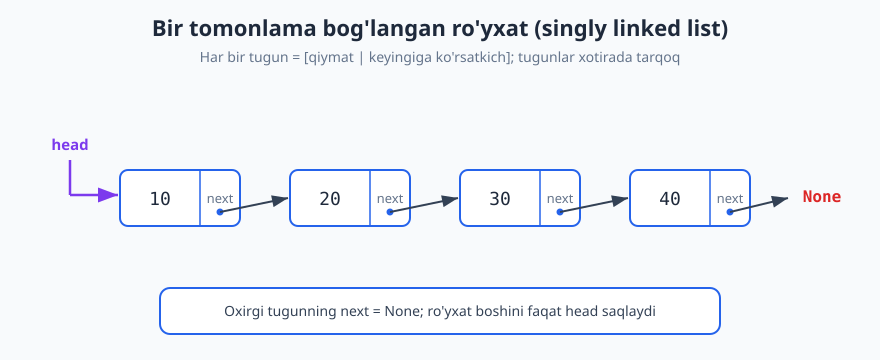
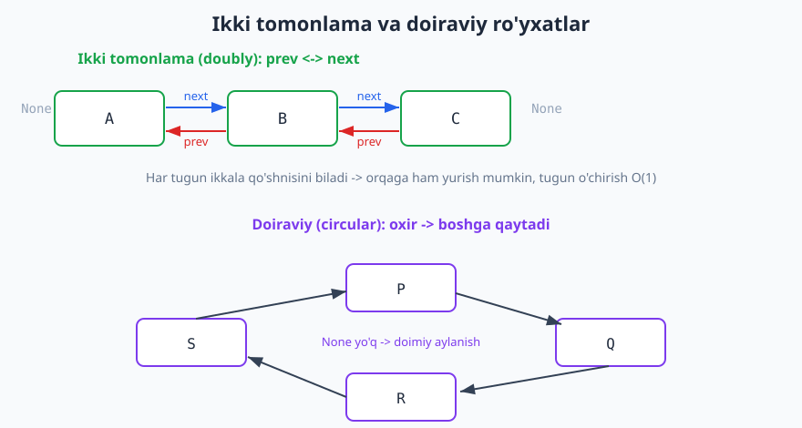
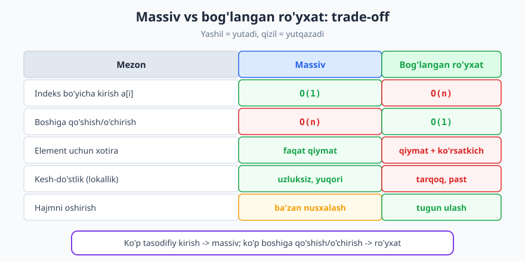

# 13 — Bog'langan ro'yxatlar (linked list)

[⬅️ Oldingi: 12 — Massiv va dinamik massiv](./12-massiv-dinamik-massiv.md) · [🏠 README](./README.md) · [Keyingi: 14 — Stack, Queue va Deque ➡️](./14-stack-queue-deque.md)

---

> **Bu bobda:** Massiv elementlarni xotirada yonma-yon, uzluksiz saqlaydi. Bog'langan ro'yxat esa butunlay boshqa g'oya: elementlar xotirada tarqoq turadi, har biri qiymatdan tashqari "keyingi element qayerda?" degan ko'rsatkichni (pointer/reference) saqlaydi. Shu kichik o'zgarish murakkablik jadvalini ag'darib yuboradi — boshiga qo'shish `O(1)` ga tushadi, lekin indeks bo'yicha kirish `O(n)` ga ko'tariladi. Biz tugun strukturasini, bir/ikki tomonlama va doiraviy turlarni, asosiy amallarning aniq narxini, ro'yxatni teskari o'girish va Floyd sikl-aniqlash kabi klassik usullarni o'rganamiz.
>
> **Halollik / Eslatma:** Bu yerdagi barcha murakkablik chegaralari (`push_front` `O(1)`, indeks-kirish `O(n)`, Floyd algoritmi `O(n)` vaqt / `O(1)` xotira) aniq va to'g'ri. "Bog'langan ro'yxat har doim massivdan yaxshi" degan keng tarqalgan da'vo **noto'g'ri** — kesh-lokallik tufayli amalda massiv ko'pincha tezroq; buni jadvalda halol ko'rsatamiz. Barcha Python namunalari haqiqatan ishga tushirib tekshirilgan; chiqishlar — kod chiqargan haqiqiy natijalar.

---

## G'oya: zanjir, qutilar emas

[Massiv](./12-massiv-dinamik-massiv.md) — bu xotiradagi uzluksiz, yonma-yon joylashgan kataklar to'plami. Aynan shu uzluksizlik tufayli `a[i]` ga `O(1)` da kirish mumkin: manzil oddiy `boshlanish + i × element_hajmi` formulasi bilan hisoblanadi.

Bog'langan ro'yxat bu shartni butunlay tashlab yuboradi. Tasavvur qiling, sizda bir nechta odam bor va ularni navbatda turg'azish kerak, lekin ular bir xonada yonma-yon turmaydi — har biri shaharning turli joyida. Tartibni saqlash uchun har bir odamga kichik qog'oz beramiz: "sendan keyingi odam falon manzilda". Birinchi odamning manzilini esa alohida yozib qo'yamiz. Mana shu — bog'langan ro'yxat.

- **Element o'rniga — tugun (node).** Har bir tugun ikki narsani saqlaydi: qiymat (`value`) va keyingi tugunga **ko'rsatkich** (`next`).
- **Boshlanish — head.** Ro'yxatning birinchi tuguniga ko'rsatkich. Bu yo'qolsa, butun ro'yxat yo'qoladi.
- **Oxiri — None.** Oxirgi tugunning `next` qiymati `None` (yoki `null`). Bu "zanjir tugadi" degani.



Diagrammada `head` birinchi tugunga ko'rsatadi, har bir tugun `[qiymat | next]` ko'rinishida, va `next` ko'rsatkichlar zanjirni keyingi tuguniga ulaydi. Oxirgi tugun `None` ga "ko'rsatadi". Eng muhim farq: tugunlar xotirada **istalgan joyda** bo'lishi mumkin — strelka ularni mantiqan bog'laydi, fizik qo'shnilik shart emas.

> **Eslatma:** "Ko'rsatkich" (pointer) va "reference" amalda bir narsani anglatadi — boshqa obyektning qayerda turganini bildiruvchi qiymat. C/C++ da bu xotira manzili, Python/Java da bu obyektga havola. Biz Python ishlatamiz, shuning uchun `node.next` shunchaki boshqa `Node` obyektiga havola (yoki `None`).

## Tugun strukturasi

Python'da tugunni oddiy klass bilan ifodalaymiz:

```python
class Node:
    def __init__(self, value, next=None):
        self.value = value    # saqlanadigan ma'lumot
        self.next = next      # keyingi tugun (yoki None)
```

Endi uchta tugunni qo'lda ulaymiz:

```python
a = Node(10)
b = Node(20)
c = Node(30)
a.next = b      # 10 -> 20
b.next = c      # 20 -> 30
# c.next allaqachon None: zanjir oxiri

head = a        # ro'yxat boshini eslab qolamiz
```

Ro'yxat bo'ylab yurish (traversal) — har doim `head` dan boshlab, `next` orqali oldinga siljiymiz, `None` ga yetguncha:

```python
cur = head
while cur is not None:
    print(cur.value, end=" ")   # 10 20 30
    cur = cur.next              # keyingiga o't
# chiqish: 10 20 30
```

Bu — eng asosiy naqsh. Deyarli har bir amalda shu `while cur is not None: ... cur = cur.next` shabloni qaytariladi.

> **Diqqat:** `cur = cur.next` — bu tugunni nusxalamaydi, faqat **havolani** ko'chiradi. `cur` endi keyingi tugunga ishora qiladi, asl tugunlar joyida qoladi. Bu farqni anglamaslik bog'langan ro'yxatdagi eng katta xatolar manbai.

## Turlari: singly, doubly, circular

Bog'langan ro'yxatning uchta asosiy ko'rinishi bor.

**1. Bir tomonlama (singly linked).** Har tugun faqat `next` ni saqlaydi. Faqat oldinga yurish mumkin. Eng kam xotira ishlatadi. Yuqoridagi diagramma aynan shu.

**2. Ikki tomonlama (doubly linked).** Har tugun ham `next`, ham `prev` (oldingi tugun) ni saqlaydi. Endi **orqaga ham** yurish mumkin, va agar sizda tugunning o'ziga havola bo'lsa, uni `O(1)` da o'chirish mumkin (chunki oldingisini `prev` orqali topasiz — singly da bunday emas).

**3. Doiraviy (circular).** Oxirgi tugunning `next` qiymati `None` emas, balki **birinchi tugunga** qaytadi. Zanjir halqa hosil qiladi. Navbat (round-robin) algoritmlarida, bufer ringlarida qulay.



Diagrammaning yuqori qismida ikki tomonlama ro'yxat: ko'k `next` strelkalar oldinga, qizil `prev` strelkalar orqaga ishora qiladi, ikki uchi `None`. Pastki qismida doiraviy ro'yxat: `None` umuman yo'q, strelkalar halqa bo'ylab `P -> Q -> R -> S -> P` aylanadi.

> **Trade-off:** Doubly ro'yxat moslashuvchanroq (ikki yo'nalish, oson o'chirish), lekin har tugunda **qo'shimcha ko'rsatkich** xotirasi sarflanadi va har bir amalda **ikkita** havolani (`next` va `prev`) izchil yangilash kerak — bu xatolik ehtimolini oshiradi. Aniq nima kerak bo'lsa, shuni tanlang.

## Asosiy amallar va ularning narxi

Bog'langan ro'yxatning butun mohiyati murakkablik jadvalida yashiringan. Har bir amalni alohida ko'rib chiqamiz.

### Boshiga qo'shish — O(1)

Bu — bog'langan ro'yxatning **bosh ustunligi**. Yangi tugun yaratamiz, uning `next` ini eski `head` ga ulaymiz, va `head` ni yangisiga ko'chiramiz. Hech narsa surilmaydi.

```python
class LinkedList:
    def __init__(self):
        self.head = None

    def push_front(self, value):        # boshiga qo'shish - O(1)
        self.head = Node(value, self.head)

    def to_list(self):                   # tekshirish uchun yordamchi
        result = []
        cur = self.head
        while cur is not None:
            result.append(cur.value)
            cur = cur.next
        return result

lst = LinkedList()
for x in [30, 20, 10]:
    lst.push_front(x)
print(lst.to_list())   # -> [10, 20, 30]
```

E'tibor bering: biz `30, 20, 10` tartibida qo'shdik, lekin ro'yxat `[10, 20, 30]` bo'ldi — chunki har yangi element **boshga** qo'yiladi, ya'ni tartib teskari bo'ladi.

> **Solishtiring:** [Massivda](./12-massiv-dinamik-massiv.md) boshiga element qo'shish `O(n)` — chunki barcha mavjud elementlarni bir katakka o'ngga surish kerak. Bog'langan ro'yxatda hech narsa surilmaydi, faqat ikkita havola o'zgaradi. Mana shu `O(n) -> O(1)` o'tish — ro'yxatning yashash sababi.

### Oxiriga qo'shish — tail bo'lsa O(1), bo'lmasa O(n)

Agar faqat `head` bo'lsa, oxiriga qo'shish uchun butun zanjir bo'ylab oxirgi tugunga yetib borish kerak — bu `O(n)`. Lekin agar `tail` (oxirgi tugunga ko'rsatkich) ni ham saqlasak, `O(1)` bo'ladi:

```python
class LinkedList2:
    def __init__(self):
        self.head = None
        self.tail = None
        self.size = 0

    def push_back(self, value):         # tail bilan O(1)
        node = Node(value)
        if self.head is None:           # ro'yxat bo'sh edi
            self.head = self.tail = node
        else:
            self.tail.next = node       # eski oxirni yangisiga ula
            self.tail = node            # tail ni yangila
        self.size += 1

    def __len__(self):
        return self.size

    def find(self, value):              # qidiruv - O(n)
        cur = self.head
        idx = 0
        while cur is not None:
            if cur.value == value:
                return idx
            cur = cur.next
            idx += 1
        return -1                        # topilmadi

    def to_list(self):
        out, cur = [], self.head
        while cur:
            out.append(cur.value); cur = cur.next
        return out

l2 = LinkedList2()
for x in [10, 20, 30, 40]:
    l2.push_back(x)
print(l2.to_list(), len(l2), l2.find(30), l2.find(99))
# -> [10, 20, 30, 40] 4 2 -1
```

> **Diqqat:** `tail` ni saqlash `push_back` ni tezlashtiradi, lekin har bir o'chirish/qo'shishda uni **izchil yangilashni** unutmaslik kerak. Masalan, oxirgi tugunni o'chirsangiz, `tail` ni oldingisiga ko'chirishingiz shart — aks holda u "osilgan" (dangling) havolaga aylanadi.

### Indeks bo'yicha kirish — O(n)

Mana asosiy **kamchilik**. Massivda `a[i]` bir qadam (`O(1)`). Bog'langan ro'yxatda `i`-elementni topish uchun `head` dan boshlab `i` marta `next` ga sakrash kerak:

```text
get(i):
    cur = head
    takrorla i marta:
        cur = cur.next
    qaytar cur.value
```

Bu `O(i)`, eng yomon holatda `O(n)`. **Tasodifiy kirish (random access) yo'q** — manzilni hisoblab bo'lmaydi, har doim boshidan yurish kerak. Shuning uchun bog'langan ro'yxatda binar qidiruv qilib bo'lmaydi (u tasodifiy kirishga tayanadi), garchi elementlar saralangan bo'lsa ham.

### Tugun havolasi bo'lsa o'chirish/qo'shish — O(1)

Agar sizda biror tugunga **havola bo'lsa**, undan keyin element qo'shish yoki keyingisini o'chirish — bir necha havola o'zgartirish, ya'ni `O(1)`:

```python
# tugun 'node' dan keyin yangi qiymat qo'shish - O(1)
def insert_after(node, value):
    node.next = Node(value, node.next)

# 'prev' dan keyingi tugunni o'chirish - O(1)
def delete_after(prev):
    if prev is None or prev.next is None:
        return
    prev.next = prev.next.next        # o'rtadagini o'tkazib yubor
```

Bu massivdagi `O(n)` o'chirishdan (teshikni yopish uchun surish kerak) keskin farq qiladi. **Lekin** muhim nozik nuqta bor: bu `O(1)` faqat sizda **kerakli joyga havola bo'lsa** amal qiladi. Agar avval qiymat bo'yicha o'sha tugunni qidirish kerak bo'lsa, qidiruv `O(n)` — demak jami baribir `O(n)`.

### Qidiruv — O(n)

Saralangan bo'lsa ham, bog'langan ro'yxatda qiymat qidirish `O(n)`: har doim chiziqli yurish (yuqoridagi `find`). Bu massivdagi saralangan-binar-qidiruv `O(log n)` dan yomon.

Quyidagi jadval barcha asosiy amallarni jamlaydi:

| Amal | Bog'langan ro'yxat | Massiv (dinamik) |
| --- | --- | --- |
| Boshiga qo'shish | **O(1)** | O(n) |
| Oxiriga qo'shish | O(1) (tail bilan) | O(1) amortized |
| Indeks bo'yicha kirish `[i]` | O(n) | **O(1)** |
| Qiymat bo'yicha qidiruv | O(n) | O(n) (saralangan: O(log n)) |
| Havola bo'lsa o'chirish | **O(1)** | O(n) |

## Ro'yxatni teskari o'girish (reverse) — klassik

Bog'langan ro'yxatni teskari o'girish — eng mashhur intervyu masalasi va ko'rsatkichlar bilan ishlashning klassik mashqi. G'oya: har bir tugunning `next` strelkasini **orqaga** burib chiqamiz. Faqat bitta nozik joy bor — strelkani burishdan oldin keyingi tugunni yo'qotmaslik uchun uni vaqtincha saqlab qolish kerak.

```python
def reverse(head):
    prev = None
    cur = head
    while cur is not None:
        nxt = cur.next     # 1) keyingini saqlab qol (yo'qotmaslik uchun)
        cur.next = prev    # 2) strelkani teskari bur
        prev = cur         # 3) prev ni oldinga sur
        cur = nxt          # 4) cur ni oldinga sur
    return prev            # prev - yangi head (eski oxir)
```

`[1, 2, 3, 4, 5]` uchun trassirovka — har iteratsiyadan **keyingi** holat (`cur`/`prev` qaysi tugunni ko'rsatadi):

| Iteratsiya | nxt | bajarilgan ulanish | prev (yangi bosh) | cur |
| --- | --- | --- | --- | --- |
| boshlang'ich | — | — | None | 1 |
| 1 | 2 | 1 -> None | 1 | 2 |
| 2 | 3 | 2 -> 1 | 2 | 3 |
| 3 | 4 | 3 -> 2 | 3 | 4 |
| 4 | 5 | 4 -> 3 | 4 | 5 |
| 5 | None | 5 -> 4 | 5 | None |

`cur` `None` bo'lganda sikl to'xtaydi, `prev` esa `5` — yangi bosh. Endi zanjir `5 -> 4 -> 3 -> 2 -> 1 -> None`.

```python
def build(values):
    head = None
    for v in reversed(values):
        head = Node(v, head)
    return head

def dump(head):
    out = []
    while head:
        out.append(head.value); head = head.next
    return out

print(dump(reverse(build([1, 2, 3, 4, 5]))))   # -> [5, 4, 3, 2, 1]
```

> **Isbot (eskiz):** Sikl invarianti: har iteratsiya boshida `prev` allaqachon teskari o'girilgan qismning boshi, `cur` esa hali tegilmagan qismning boshi. Bitta qadam `cur` ni teskari qismga qo'shadi (`cur.next = prev`) va ikkala ko'rsatkichni bir tugun oldinga suradi — invariant saqlanadi. Sikl `cur = None` da tugaydi: butun ro'yxat teskari qismga o'tgan, `prev` uning boshi. Bu `O(n)` vaqt, `O(1)` qo'shimcha xotira (rekursiyasiz, joyida).

> **Eslatma:** Reverse ni [rekursiya](./06-rekursiya-asoslari.md) bilan ham yozish mumkin, lekin u chaqiruvlar steki uchun `O(n)` xotira oladi — yuqoridagi iterativ versiya esa `O(1)`. Uzun ro'yxatlarda rekursiv variant stek-to'lib-ketishiga (stack overflow) olib kelishi mumkin.

## Keng tarqalgan xatolar

Bog'langan ro'yxatlar — ko'rsatkichlar bilan ishlash, shuning uchun xatolar ham aynan ko'rsatkichlar bilan bog'liq.

> **Anti-pattern: head ni yangilashni unutish.** Boshiga qo'shgan yoki birinchi tugunni o'chirgan paytda `head` o'zgaradi. Agar uni yangilamasangiz, ro'yxat boshi yo'qoladi yoki o'chirilgan tugunga ishora qilib qoladi.

> **Anti-pattern: None ni tekshirmaslik.** `cur.next.value` deb yozishdan oldin `cur` va `cur.next` `None` emasligiga ishonch hosil qiling — aks holda `AttributeError` (yoki C da segfault). Bo'sh ro'yxat (`head is None`) va bitta-elementli ro'yxat — eng ko'p unutiladigan chegara holatlari.

> **Anti-pattern: tasodifan sikl yaratish.** Havolalarni noto'g'ri ulasangiz (masalan, tugunning `next` ini o'ziga yoki orqadagi tugunga ulasangiz), zanjir halqaga aylanadi. Shunda oddiy `while cur` yurish **abadiy aylanadi** (cheksiz sikl).

### Floyd "tez-sekin ko'rsatkich" bilan sikl aniqlash

Ro'yxatda sikl bormi-yo'qmi tekshirishning eng nafis usuli — **Floyd algoritmi** (yana "toshbaqa va quyon" deyiladi). Ikki ko'rsatkich: `slow` har qadamda **1** tugun, `fast` har qadamda **2** tugun oldinga siljiydi. Agar sikl bo'lsa, `fast` halqa ichida `slow` ni ortdan quvib **albatta** yetib oladi (ular bir tugunga teng bo'ladi). Sikl bo'lmasa, `fast` `None` ga yetadi va to'xtaydi.

```python
def has_cycle(head):
    slow = fast = head
    while fast is not None and fast.next is not None:
        slow = slow.next            # 1 qadam
        fast = fast.next.next       # 2 qadam
        if slow is fast:            # uchrashdi -> sikl bor
            return True
    return False                     # fast None ga yetdi -> sikl yo'q

a = Node(1); b = Node(2); c = Node(3); d = Node(4)
a.next = b; b.next = c; c.next = d
print(has_cycle(a))     # -> False
d.next = b              # sikl yaratamiz: 4 -> 2
print(has_cycle(a))     # -> True
```

> **Isbot (eskiz):** Nega `fast` `slow` ni yetib oladi? Sikl ichida ikkalasi ham aylanadi. Har qadamda `fast` `slow` ga nisbatan masofani aynan **1 ga** qisqartiradi (fast 2, slow 1 yuradi). Manfiy bo'lmagan masofa har qadam 1 ga kamayib, oxir-oqibat 0 ga yetadi — ya'ni uchrashadi. Bu `O(n)` vaqt va atigi `O(1)` xotira (faqat ikki ko'rsatkich). Bu — ro'yxatni hash-to'plamga solib tekshirishning `O(n)` xotirali variantidan ancha tejamli.

## Massiv vs bog'langan ro'yxat: to'liq trade-off

Endi eng muhim savol: qachon qaysisini tanlash kerak? Ko'pchilik bog'langan ro'yxatni "ilg'orroq" deb o'ylaydi, lekin haqiqat nozikroq.



- **Tasodifiy kirish — massiv yutadi.** `a[i]` `O(1)` vs `O(n)`. Agar siz tez-tez ixtiyoriy indeksdagi elementga murojaat qilsangiz yoki binar qidiruv kerak bo'lsa — massiv.
- **Boshiga (yoki o'rtaga, havola bo'lsa) qo'shish/o'chirish — ro'yxat yutadi.** `O(1)` vs `O(n)`. Agar ko'p qo'shish/o'chirish, ayniqsa boshida bo'lsa — ro'yxat.
- **Xotira — massiv yutadi.** Har bir tugun qiymatdan tashqari ko'rsatkich(lar) uchun ham joy oladi (singly da 1, doubly da 2 ta qo'shimcha havola). Mayda elementlar (masalan, butun sonlar) uchun bu ortiqcha xarajat juda sezilarli — bir butun son uchun yana bir-ikki ko'rsatkich.
- **Kesh-do'stlik (lokallik) — massiv yutadi, va bu katta gap.** Massiv elementlari xotirada **uzluksiz** yotadi, shuning uchun protsessor keshiga to'plab o'qiladi (bir o'qishda bir nechta qo'shni element). Bog'langan ro'yxat tugunlari xotirada **tarqoq** — har bir `next` sakrashi kesh-mising (cache miss) bo'lishi mumkin. Shu sababli amalda massiv bo'ylab yurish bir xil `O(n)` bo'lsa ham, bog'langan ro'yxatdan **bir necha barobar tezroq** ishlaydi.

> **Diqqat — keng tarqalgan noto'g'ri tushuncha:** "Bog'langan ro'yxat o'rtaga qo'shishda `O(1)` bo'lgani uchun massivdan yaxshi". Bu yarim haqiqat. O'rtaga qo'shishdan **oldin** o'sha joyni qidirib topish `O(n)`, va bu qidiruv kesh-do'stsiz, sekin. Amaliyotda kichik/o'rta hajmda dinamik massiv ko'pincha har jihatdan tezroq. Bog'langan ro'yxatni faqat sizda **tugunga havola allaqachon bo'lsa** (masalan, LRU keshda) yoki barqaror havolalar kerak bo'lganda tanlang.

## Qo'llanmalar

Bog'langan ro'yxat ko'plab strukturalarning ichki dvigateli:

- **Stack va Queue.** [Keyingi bobda](./14-stack-queue-deque.md) ko'ramiz — stack ni boshiga `push`/`pop` (`O(1)`), queue ni esa head'dan olib tail'ga qo'shib (ikkalasi `O(1)`) bog'langan ro'yxat bilan tabiiy quriladi. Surish (massivdagi kabi) kerak emas.
- **LRU kesh.** "Eng kam ishlatilgan"ni siqib chiqaradigan kesh odatda ikki tomonlama bog'langan ro'yxat + hash-jadval kombinatsiyasi: ro'yxat tartibni saqlaydi, hash istalgan tugunni `O(1)` topadi, shu tugunni `O(1)` ko'chirish/o'chirish mumkin (doubly bo'lgani uchun `prev` orqali). Mana bu yerda ro'yxatning `O(1)` o'chirishi haqiqatan porlaydi.
- **Tilning asosiy strukturasi.** Ba'zi tillarda ro'yxat tipi (masalan, Lisp/Scheme) aynan bog'langan ro'yxat ustiga qurilgan; funksional tillardagi o'zgarmas (immutable) ro'yxatlar ham shunday.

## Asosiy g'oyalar (bobni qisqacha)

- Bog'langan ro'yxat — tugunlar zanjiri; har tugun qiymat + keyingiga ko'rsatkich saqlaydi. Massivdan farqi: xotirada **uzluksiz emas**, tarqoq.
- `head` boshni, ixtiyoriy `tail` oxirni saqlaydi; oxirgi tugunning `next` = `None`.
- Turlari: singly (faqat `next`), doubly (`next` + `prev`, orqaga yurish va `O(1)` o'chirish), circular (oxir boshga qaytadi).
- **Boshiga qo'shish `O(1)`** — asosiy ustunlik (massivda `O(n)`). **Indeks bo'yicha kirish `O(n)`** — asosiy kamchilik (massivda `O(1)`); tasodifiy kirish yo'q.
- Tugunga havola bo'lsa, undan keyin qo'shish/o'chirish `O(1)`. Qidiruv `O(n)`.
- Reverse — `prev`/`cur`/`nxt` uchligi bilan strelkalarni teskari burib chiqish, `O(n)` vaqt, `O(1)` xotira.
- Floyd "tez-sekin ko'rsatkich" siklni `O(n)` vaqt, `O(1)` xotirada aniqlaydi.
- **Trade-off:** massiv tasodifiy kirish, xotira va kesh-lokallikda yutadi; ro'yxat boshiga/havola-bo'lsa qo'shish-o'chirishda yutadi. Amalda kesh tufayli massiv ko'pincha tezroq — "ro'yxat har doim yaxshi" degan da'voga ishonmang.

## Mashqlar

### Oson

**1-mashq.** Quyidagi tugunlar berilgan: `Node(5)`, `Node(8)`, `Node(2)`. Ularni `5 -> 8 -> 2 -> None` ro'yxatiga ulaydigan Python kodini yozing va `head` ni belgilang. Keyin zanjirni rasm (chizma) sifatida `[5|·] -> [8|·] -> [2|None]` ko'rinishida ifodalang.

**2-mashq.** Quyidagi har bir amal uchun bir tomonlama bog'langan ro'yxatdagi murakkablikni (Big-O) ayting va bir jumlada sababini yozing: (a) boshiga qo'shish, (b) indeks `i` dagi elementga kirish, (c) qiymat bo'yicha qidiruv, (d) `tail` saqlanganda oxiriga qo'shish.

**3-mashq.** Nega saralangan bog'langan ro'yxatda binar qidiruvni `O(log n)` da bajarib bo'lmaydi, lekin saralangan massivda bo'ladi? Bir-ikki jumlada tushuntiring.

### O'rta

**4-mashq.** `Node` klassidan foydalanib, `push_back(head, value)` funksiyasini yozing (`tail` saqlanmaydi, faqat `head` bor): yangi qiymatni ro'yxat oxiriga qo'shsin va yangi `head` ni qaytarsin (bo'sh ro'yxat holatini ham hisobga oling). Murakkabligi qancha?

**5-mashq.** Ro'yxat uzunligini sanaydigan `length(head)` funksiyasini yozing. Murakkabligi qancha? Bo'sh ro'yxat uchun nima qaytaradi?

**6-mashq.** Ro'yxatni joyida (`O(1)` qo'shimcha xotira bilan) teskari o'giradigan `reverse(head)` ni yozing va `[1, 2, 3]` da qadamma-qadam `prev`/`cur` qiymatlarini trassirovka qiling.

### Qiyin

**7-mashq.** Floyd algoritmi bilan `has_cycle(head)` ni yozing va nega `fast` `slow` ni doim yetib olishini (sikl bor bo'lsa) tushuntiring. Nega bu `O(1)` xotira ishlatadi?

**8-mashq.** Ro'yxatning **o'rta tugunini bir o'tishda** (ro'yxatni ikki marta yurmasdan, uzunlikni oldindan bilmasdan) topadigan `middle(head)` ni yozing. Juft uzunlikda ikkinchi o'rtani qaytarsin. Qaysi texnikaga asoslangan?

**9-mashq.** Ikki **saralangan** bog'langan ro'yxatni bitta saralangan ro'yxatga birlashtiradigan `merge_sorted(a, b)` ni yozing. Sentinel (dummy) tugundan foydalaning. Murakkabligi qancha (vaqt va qo'shimcha xotira)?

<details markdown="1">
<summary>Yechimlar</summary>

### 1-mashq yechimi

```python
a = Node(5)
b = Node(8)
c = Node(2)
a.next = b      # 5 -> 8
b.next = c      # 8 -> 2
# c.next = None (avtomatik)
head = a
```

Chizma: `head -> [5|·] -> [8|·] -> [2|None]`. Bu yerda `·` keyingi tugunga ko'rsatkich, oxirgi tugunda `None`. `head` faqat birinchi tuguniga ishora qiladi.

### 2-mashq yechimi

- **(a) Boshiga qo'shish — O(1).** Yangi tugun yaratib, `next` ini eski `head` ga ulab, `head` ni yangilash — qat'iy son amal, ro'yxat hajmiga bog'liq emas.
- **(b) Indeks `i` ga kirish — O(n).** Tasodifiy kirish yo'q; `head` dan `i` marta `next` ga sakrash kerak, eng yomonda `n` qadam.
- **(c) Qidiruv — O(n).** Saralangan bo'lsa ham, faqat chiziqli yurish mumkin; eng yomonda barcha `n` tugunni tekshirish.
- **(d) Oxiriga qo'shish (`tail` bilan) — O(1).** `tail.next` ga yangi tugun ulanadi va `tail` yangilanadi — qat'iy son amal. `tail` bo'lmasa, oxirni topish uchun yurish kerak bo'lardi va `O(n)` bo'lardi.

### 3-mashq yechimi

Binar qidiruv **tasodifiy kirishga** (`O(1)` da o'rtadagi elementni olishga) tayanadi: har qadamda massivning o'rta indeksiga sakrab, qidiruv oralig'ini yarmiga qisqartiradi. Massivda o'rta element manzili hisoblanadi — `O(1)`. Bog'langan ro'yxatda esa o'rtaga yetish uchun yarmini yurish kerak — `O(n)`. Demak har "yarmiga bo'lish" qadami `O(n)` bo'lib, butun afzallik yo'qoladi; bog'langan ro'yxatda binar qidiruv chiziqli qidiruvdan tez bo'lmaydi.

### 4-mashq yechimi

```python
def push_back(head, value):
    node = Node(value)
    if head is None:            # bo'sh ro'yxat -> yangi tugun head bo'ladi
        return node
    cur = head
    while cur.next is not None: # oxirgi tugunga yetib bor
        cur = cur.next
    cur.next = node
    return head

print(dump(push_back(build([1, 2, 3]), 4)))   # -> [1, 2, 3, 4]
print(dump(push_back(None, 7)))                # -> [7]
```

Murakkabligi **O(n)** — `tail` saqlanmagani uchun har safar oxirni topish kerak. Aynan shuning uchun ko'p `push_back` qilinadigan joyda `tail` ko'rsatkichini saqlash tavsiya etiladi (`O(1)` ga tushadi).

### 5-mashq yechimi

```python
def length(head):
    n = 0
    while head is not None:
        n += 1
        head = head.next
    return n

print(length(build([1, 2, 3, 4, 5])))   # -> 5
print(length(None))                       # -> 0
```

Murakkabligi **O(n)** — har bir tugunni bir marta sanaymiz. Bo'sh ro'yxat (`head is None`) uchun sikl umuman bajarilmaydi va **0** qaytadi.

### 6-mashq yechimi

```python
def reverse(head):
    prev = None
    cur = head
    while cur is not None:
        nxt = cur.next     # keyingini saqla
        cur.next = prev    # strelkani teskari bur
        prev = cur         # prev ni sur
        cur = nxt          # cur ni sur
    return prev

print(dump(reverse(build([1, 2, 3]))))   # -> [3, 2, 1]
```

`[1, 2, 3]` uchun trassirovka (har qator iteratsiyadan keyingi holat):

| Iteratsiya | nxt | ulanish | prev | cur |
| --- | --- | --- | --- | --- |
| boshlang'ich | — | — | None | 1 |
| 1 | 2 | 1 -> None | 1 | 2 |
| 2 | 3 | 2 -> 1 | 2 | 3 |
| 3 | None | 3 -> 2 | 3 | None |

`cur = None` da to'xtaydi, `prev = 3` yangi bosh, zanjir `3 -> 2 -> 1 -> None`. `O(n)` vaqt, `O(1)` xotira.

### 7-mashq yechimi

```python
def has_cycle(head):
    slow = fast = head
    while fast is not None and fast.next is not None:
        slow = slow.next            # 1 qadam
        fast = fast.next.next       # 2 qadam
        if slow is fast:
            return True
    return False
```

**Nega yetib oladi:** sikl bor bo'lsa, ikkala ko'rsatkich ham halqa ichida abadiy aylanadi va undan chiqmaydi. Har qadamda `fast` 2, `slow` 1 tugun yuradi, ya'ni ular orasidagi (halqa bo'ylab o'lchangan) masofa har qadam **aynan 1 ga** kamayadi. Manfiy bo'lmagan butun masofa har qadam 1 ga kamayib, muqarrar 0 ga yetadi — bu uchrashuv, demak `slow is fast` rost bo'ladi. Sikl bo'lmasa, `fast` `None` ga yetib sikl tugaydi va `False` qaytadi.

**Nega O(1) xotira:** faqat ikkita ko'rsatkich (`slow`, `fast`) saqlanadi — ro'yxat hajmidan qat'i nazar qat'iy. (Taqqoslang: tugunlarni hash-to'plamga to'plab tekshirish ham ishlaydi, lekin `O(n)` xotira oladi.) Vaqti `O(n)`.

### 8-mashq yechimi

```python
def middle(head):
    slow = fast = head
    while fast is not None and fast.next is not None:
        slow = slow.next            # 1 qadam
        fast = fast.next.next       # 2 qadam
    return slow.value if slow is not None else None

print(middle(build([1, 2, 3, 4, 5])))      # -> 3
print(middle(build([1, 2, 3, 4, 5, 6])))   # -> 4
```

Bu xuddi Floyd kabi **tez-sekin ko'rsatkich** texnikasi. `fast` `slow` dan ikki barobar tez yuradi, shuning uchun `fast` oxirga yetganda `slow` aynan o'rtada bo'ladi. Toq uzunlikda (`5`) `slow` aniq markazga (`3`) tushadi; juft uzunlikda (`6`) `slow` ikkinchi o'rtaga (`4`) tushadi — chunki sikl `fast.next is not None` shartida `slow` yana bir qadam yuradi. Faqat **bitta o'tish**, uzunlik oldindan kerak emas. `O(n)` vaqt, `O(1)` xotira.

### 9-mashq yechimi

```python
def merge_sorted(a, b):
    dummy = Node(0)        # sentinel: natija boshini boshqarishni soddalashtiradi
    tail = dummy
    while a is not None and b is not None:
        if a.value <= b.value:
            tail.next = a; a = a.next
        else:
            tail.next = b; b = b.next
        tail = tail.next
    tail.next = a if a is not None else b   # qolgan quyruqni ulab qo'y
    return dummy.next

print(dump(merge_sorted(build([1, 3, 5, 7]), build([2, 4, 6]))))
# -> [1, 2, 3, 4, 5, 6, 7]
```

Har qadamda ikki ro'yxat boshidagi kichikrog'ini tanlab, natija quyrug'iga ulaymiz. **Sentinel (dummy) tugun** "natija hali bo'shmi?" tekshiruvini yo'q qiladi — har doim `tail.next` ga ulayveramiz, oxirida `dummy.next` ni qaytaramiz. Bitta ro'yxat tugaganda, ikkinchisining qolgan **saralangan** quyrug'ini to'g'ridan-to'g'ri ulaymiz (u allaqachon tartibda). Vaqti **O(n + m)** (har tugunni bir marta ko'ramiz), qo'shimcha xotira **O(1)** — yangi tugun yaratilmaydi, faqat mavjudlari qayta ulanadi (`dummy` dan tashqari).

</details>

---

[⬅️ Oldingi: 12 — Massiv va dinamik massiv](./12-massiv-dinamik-massiv.md) · [🏠 README](./README.md) · [Keyingi: 14 — Stack, Queue va Deque ➡️](./14-stack-queue-deque.md)
