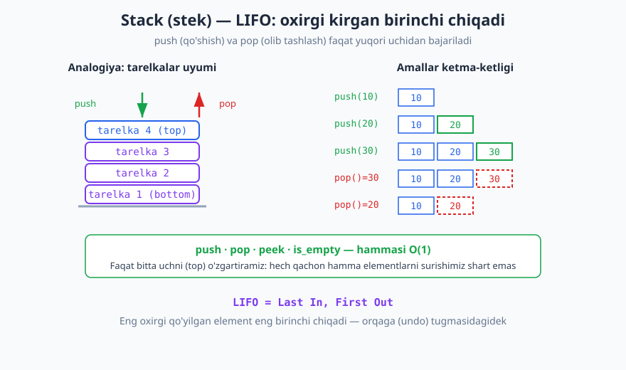
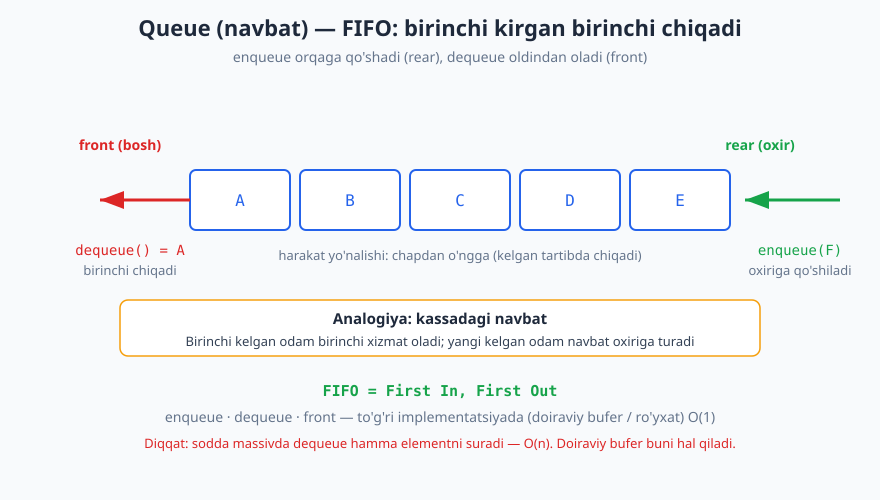
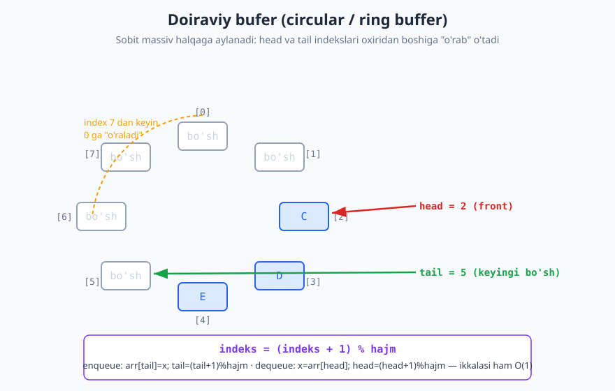

# 14 — Stack, Queue va Deque

[⬅️ Oldingi: 13 — Bog'langan ro'yxatlar (linked list)](./13-boglangan-royxatlar.md) · [🏠 README](./README.md) · [Keyingi: 15 — Hash jadval (hash table) ➡️](./15-hash-jadval.md)

---

> **Bu bobda:** Uchta eng ko'p ishlatiladigan **chiziqli ma'lumot strukturasi** — stack (stek), queue (navbat) va deque (ikki uchli navbat) bilan tanishamiz. Avval **abstrakt ma'lumot turi (ADT)** tushunchasini — "qanday amallar" ni "qanday qurilgan" dan ajratishni — o'rganamiz. Keyin har birining ish tartibini (LIFO va FIFO), implementatsiyasini (massiv, bog'langan ro'yxat, doiraviy bufer), murakkabligini va real qo'llanmalarini ko'rib chiqamiz. Oxirida priority queue ni qisqacha eslatib o'tamiz.
>
> **Halollik / Eslatma:** Bu yerda keltirilgan barcha murakkablik chegaralari (push/pop/enqueue/dequeue uchun O(1), sodda massivli dequeue uchun O(n)) aniq va isbotlangan. "O(1)" deganda biz Python ro'yxatining amortizatsiyalangan O(1) `append`/`pop` xulqiga tayanamiz — bu [11-bobda](./11-amortizatsiyalangan-tahlil.md) isbotlangan. Barcha Python namunalari haqiqatan ishga tushirib tekshirildi; ko'rsatilgan chiqishlar kod chiqargan haqiqiy natijalar.

---

## Abstrakt ma'lumot turi (ADT) nima

Tasavvur qiling, do'kondan televizor sotib oldingiz. Sizga **pultning tugmalari** muhim: "ovozni baland qil", "kanalni almashtir", "o'chir". Bu tugmalar — televizor *nima qila olishi*. Ichida qanday tranzistorlar borligi, signal qanday qayta ishlanishini bilishingiz **shart emas**. Pult — bu **interfeys**, ichkarisi — bu **implementatsiya**.

**Abstrakt ma'lumot turi (ADT)** — aynan shu g'oya ma'lumot strukturalariga tatbiq etilgani. ADT ikki narsani belgilaydi:

1. **Qanday qiymatlarni saqlaydi** (masalan, butun sonlar to'plami).
2. **Qanday amallarni qo'llab-quvvatlaydi** va har bir amal nima qiladi (masalan, `push(x)` — yuqoriga element qo'yadi).

ADT **qanday qurilganini aytmaydi**. Stack ADT'sini massiv bilan ham, bog'langan ro'yxat bilan ham qurish mumkin — foydalanuvchi uchun ikkalasi ham bir xil ko'rinadi, chunki amallar to'plami bir xil.

> **Intuitsiya:** ADT — bu "shartnoma" (kontrakt). Shartnomada "push, pop, peek bo'ladi va ular shunday ishlaydi" deyiladi. Implementatsiya — shartnomani bajaruvchi konkret kod. Bitta shartnomani ko'p xil usulda bajarish mumkin.

Nega bu muhim? Chunki dasturni yozayotganda biz **amal nomlari** bilan fikrlaymiz ("stekka qo'shaman, stekdan olaman"), implementatsiya tafsilotlari bilan emas. Bu kodimizni soddalashtiradi va keyinchalik implementatsiyani (masalan, tezligi uchun) almashtirsak ham, qolgan kod o'zgarmaydi.

Bu bobdagi uchala struktura — stack, queue, deque — bular **ADT'lar**. Quyida har birining shartnomasini, so'ng konkret implementatsiyalarini ko'ramiz.

---

## Stack (stek) — LIFO

**Stack** — bu shunday to'plamki, unga element faqat **bir uchidan** (yuqoridan, "top") qo'shiladi va faqat **o'sha uchidan** olib tashlanadi. Eng oxirgi qo'shilgan element eng birinchi chiqadi. Bu tartibni **LIFO** deb atashadi: *Last In, First Out* — "oxirgi kirgan birinchi chiqadi".

> **Analogiya:** Oshxonadagi **tarelkalar uyumi**. Yangi tarelkani faqat eng ustiga qo'yasiz, va olganingizda ham eng ustidagisini olasiz. O'rtadagi tarelkaga teginib bo'lmaydi.



### Amallar va murakkablik

| Amal | Ma'nosi | Murakkablik |
|---|---|---|
| `push(x)` | `x` ni yuqoriga qo'shadi | O(1) |
| `pop()` | yuqoridagi elementni olib, qaytaradi | O(1) |
| `peek()` / `top()` | yuqoridagini ko'radi, lekin olmaydi | O(1) |
| `is_empty()` | stek bo'shmi? | O(1) |

Diqqat qiling: **hamma amal O(1)**. Sababi oddiy — biz hech qachon hamma elementlarni surishimiz, joyini almashtirishimiz shart emas. Faqat bitta uchni (top) o'zgartiramiz.

### Implementatsiya — massiv (Python ro'yxati) bilan

Eng tabiiy yo'l: dinamik massivning **oxirini** stekning "top" i deb belgilaymiz. `append` — push, `pop` — pop. Python ro'yxatida ikkalasi ham amortizatsiyalangan O(1) ([11-bob](./11-amortizatsiyalangan-tahlil.md)).

```python
class Stack:
    def __init__(self):
        self._items = []
    def push(self, x):
        self._items.append(x)
    def pop(self):
        if self.is_empty():
            raise IndexError("bo'sh stekdan pop")
        return self._items.pop()
    def peek(self):
        if self.is_empty():
            raise IndexError("bo'sh stek")
        return self._items[-1]
    def is_empty(self):
        return len(self._items) == 0
    def __len__(self):
        return len(self._items)

s = Stack()
s.push(10); s.push(20); s.push(30)
print(s.peek())        # -> 30
print(s.pop())         # -> 30
print(s.pop())         # -> 20
print(len(s))          # -> 1
print(s.is_empty())    # -> False
```

> **Nega oxirini "top" deb tanladik, boshini emas?** Agar massivning **boshini** top qilsak, har `push`/`pop` da qolgan hamma elementni bir katakka surishimiz kerak bo'lardi — O(n). Oxirni tanlash bilan suvrish kerak emas — O(1). Tafsilot: ADT bir xil, lekin implementatsiya tanlovi tezlikni hal qiladi.

### Implementatsiya — bog'langan ro'yxat bilan

Stekni [bir tomonlama bog'langan ro'yxat](./13-boglangan-royxatlar.md) bilan ham qurish mumkin: **boshini** ("head") top deb belgilaymiz. Boshiga tugun qo'shish va boshidagi tugunni o'chirish — ro'yxatda O(1) (oxiriga emas, **boshiga**!). Massivdan farqi: bu yerda hech qanday "ikkilantirib nusxalash" yo'q, har amal qat'iy O(1) (amortized emas). Evaziga har element qo'shimcha ko'rsatkich uchun xotira oladi va kesh-do'stligi pasayadi.

> **Trade-off:** Massivli stek — kesh-do'st, kam xotira, lekin amortized O(1) (gohida resize). Ro'yxatli stek — qat'iy O(1), lekin ko'proq xotira va sekinroq kesh. Amaliyotda massivli (Python `list`) versiya deyarli har doim afzal.

### Stack qayerda ishlatiladi

- **Funksiya chaqiruvlar steki (call stack).** Dastur funksiyani chaqirganda, uning qaytish manzili va lokal o'zgaruvchilari stekka **push** qilinadi; funksiya tugaganda **pop** qilinadi. Bu LIFO — eng oxirgi chaqirilgan funksiya birinchi tugaydi. [Rekursiya](./06-rekursiya-asoslari.md) aynan shu stekka tayanadi.
- **Qavslar balansini tekshirish.** Ochiq qavsni stekka qo'yamiz, yopiq qavsda mosini tekshiramiz (quyida kod bor).
- **Ifoda hisoblash.** Infiksdan (`3 + 4`) postfiksga (`3 4 +`) o'tkazish va postfiksni baholash stek bilan qilinadi (quyida).
- **Orqaga qaytarish (undo).** Matn muharririda har amal stekka qo'yiladi; "undo" bosilganda eng oxirgisi pop qilinadi. Brauzerdagi "orqaga" tugmasi ham — sahifalar steki.
- **DFS (chuqurlikka qidiruv).** Grafni aylanishda ([29-bob](./29-graf-algoritmlari-1.md)) keyingi tashrif buyuriladigan tugunlar stekda saqlanadi (yoki rekursiya steki orqali).

### Qo'llanma: qavslar balansi

Matnda qavslar to'g'ri joylashtirilganmi? `(a[b]{c})` — to'g'ri; `([)]` — noto'g'ri (qavslar kesishgan). G'oya: har ochiq qavsni stekka qo'yamiz; yopiq qavs kelganda stek tepasida aynan unga mos ochiq qavs bo'lishi shart.

```python
def qavs_balansli(matn):
    juft = {')': '(', ']': '[', '}': '{'}
    stek = []
    for ch in matn:
        if ch in '([{':
            stek.append(ch)
        elif ch in ')]}':
            if not stek or stek.pop() != juft[ch]:
                return False
    return not stek   # oxirida stek bo'sh bo'lishi shart

print(qavs_balansli("(a[b]{c})"))   # -> True
print(qavs_balansli("([)]"))        # -> False
print(qavs_balansli("(("))          # -> False
print(qavs_balansli(""))            # -> True
```

> **Nega ishlaydi (to'g'rilik eskizi):** Stek tepasi — hozircha hali yopilmagan **eng yaqin** ochiq qavs. Yopiq qavs aynan shu eng yaqin ochiqqa mos kelishi kerak (qavslar uyalangan, kesishmaydi). Agar mos kelmasa yoki stek bo'sh bo'lsa — xato. Oxirida stek bo'sh bo'lsa, hamma ochiq qavs yopilgan demakdir. LIFO tartibi qavslarning uyalanish (nesting) tabiatiga aynan mos keladi.

### Qo'llanma: postfiks (Polsha teskari) ifodani baholash

Odatdagi yozuv — **infiks**: amal operandlar **orasida** (`3 + 4`). **Postfiks** (RPN) da amal operandlardan **keyin** keladi: `3 4 +`. Postfiksda qavs umuman kerak emas va uni stek bilan bir o'tishda baholash mumkin:

```text
token postfiks: token operand bo'lsa -> stekka push
                token amal bo'lsa     -> 2 operandni pop, hisobla, natijani push
oxirida stekda bitta qiymat qoladi — bu javob
```

```python
def postfix_baholash(ifoda):
    stek = []
    amallar = {'+', '-', '*', '/'}
    for token in ifoda.split():
        if token in amallar:
            b = stek.pop()         # ikkinchi operand
            a = stek.pop()         # birinchi operand
            if token == '+': stek.append(a + b)
            elif token == '-': stek.append(a - b)
            elif token == '*': stek.append(a * b)
            elif token == '/': stek.append(a / b)
        else:
            stek.append(float(token))
    return stek.pop()

print(postfix_baholash("3 4 +"))             # -> 7.0
print(postfix_baholash("5 1 2 + 4 * + 3 -")) # -> 14.0
print(postfix_baholash("2 3 4 * +"))         # -> 14.0
```

**Trassirovka:** `5 1 2 + 4 * + 3 -` ifodasi uchun stek holati har bir tokenda:

| token | amal | stek (keyin) |
|---|---|---|
| `5` | push 5 | `[5]` |
| `1` | push 1 | `[5, 1]` |
| `2` | push 2 | `[5, 1, 2]` |
| `+` | 1+2=3 | `[5, 3]` |
| `4` | push 4 | `[5, 3, 4]` |
| `*` | 3*4=12 | `[5, 12]` |
| `+` | 5+12=17 | `[17]` |
| `3` | push 3 | `[17, 3]` |
| `-` | 17-3=14 | `[14]` |

Oxirgi natija: **14.0**. Operandlar tartibiga e'tibor bering: `a - b` da `a` avval pop qilingan ikkinchi operand emas, **birinchi** push qilingani — shuning uchun `b` ni avval, `a` ni keyin pop qilamiz.

---

## Queue (navbat) — FIFO

**Queue** — bu shunday to'plamki, element bir uchidan (orqadan, "rear") qo'shiladi, lekin **boshqa** uchidan (oldindan, "front") olinadi. Birinchi kelgan element birinchi chiqadi. Bu tartib — **FIFO**: *First In, First Out* — "birinchi kirgan birinchi chiqadi".

> **Analogiya:** Kassadagi yoki bankdagi **navbat**. Birinchi kelgan odam birinchi xizmat oladi (front); yangi kelgan odam navbat oxiriga turadi (rear). Adolatli tartib.



### Amallar

| Amal | Ma'nosi | Murakkablik (to'g'ri impl.) |
|---|---|---|
| `enqueue(x)` | `x` ni oxiriga (rear) qo'shadi | O(1) |
| `dequeue()` | boshidagi (front) elementni olib qaytaradi | O(1) |
| `front()` | boshidagini ko'radi, olmaydi | O(1) |
| `is_empty()` | navbat bo'shmi? | O(1) |

### Sodda massivli yondashuvning muammosi

Stekni biz massiv oxiri bilan osongina yasagandik. Queue bilan muammo bor. Aytaylik, massivning **boshi** front bo'lsin. `dequeue` boshidan element olib tashlaydi — lekin endi **qolgan hamma element bir katakka chapga surilishi** kerak! Bu **O(n)**. n ta dequeue qilsak — O(n²). Bu juda sekin.

```text
[A, B, C, D]   dequeue() -> A olindi
[B, C, D]      <- B, C, D hammasi chapga surildi: O(n)
```

Bu muammoning **uchta yechimi** bor:

1. **Doiraviy bufer (circular / ring buffer)** — eng nafis yechim. Quyida.
2. **Ikki ko'rsatkich** — alohida `head` va `tail` indekslarini saqlaymiz, surmaymiz; lekin massiv tugab qoladi (yoki ortib ketadi), shuning uchun ko'pincha baribir doiraviy qilamiz.
3. **Bog'langan ro'yxat** — boshiga ham, oxiriga ham ko'rsatkich (`head`, `tail`) saqlasak, ikkalasidan ham O(1) ([13-bob](./13-boglangan-royxatlar.md)). Python'da bu `collections.deque` ichida tayyor.

### Doiraviy bufer (ring buffer)

G'oya: sobit hajmli massivni **halqaga** aylantiramiz — oxirgi katakdan keyin yana birinchi katakka "o'raladi". Ikki indeks saqlaymiz: `head` (front qayerda) va `tail` (keyingi bo'sh joy). Har ikkalasi ham `% hajm` orqali aylanadi. Hech narsa surilmaydi — har amal **O(1)**.



Kalit formula — indeksni aylantirish:

```text
keyingi_indeks = (indeks + 1) % hajm
```

`% hajm` (modul) tufayli indeks `hajm - 1` dan keyin `0` ga qaytadi — aynan halqaning "o'ralishi".

```python
class Queue:
    def __init__(self, hajm):
        self._buf = [None] * hajm
        self._hajm = hajm
        self._head = 0     # front shu yerda
        self._tail = 0     # keyingi bo'sh joy
        self._soni = 0     # nechta element bor
    def enqueue(self, x):
        if self._soni == self._hajm:
            raise OverflowError("navbat to'la")
        self._buf[self._tail] = x
        self._tail = (self._tail + 1) % self._hajm
        self._soni += 1
    def dequeue(self):
        if self._soni == 0:
            raise IndexError("navbat bo'sh")
        x = self._buf[self._head]
        self._buf[self._head] = None
        self._head = (self._head + 1) % self._hajm
        self._soni -= 1
        return x
    def front(self):
        if self._soni == 0:
            raise IndexError("navbat bo'sh")
        return self._buf[self._head]
    def __len__(self):
        return self._soni

q = Queue(3)
q.enqueue('A'); q.enqueue('B')
print(q.dequeue())   # -> A
q.enqueue('C'); q.enqueue('D')   # tail 0 ga o'raladi
print(q.front())     # -> B
print(q.dequeue())   # -> B
print(q.dequeue())   # -> C
print(q.dequeue())   # -> D
print(len(q))        # -> 0
```

> **Nega alohida `_soni` saqlaymiz?** Faqat `head` va `tail` bilan "bo'sh" va "to'la" holatlarni ajratib bo'lmaydi: ikkalasida ham `head == tail` bo'lishi mumkin. Element sonini alohida hisoblash bu noaniqlikni yo'qotadi. (Muqobil yo'l — bitta katakni doim bo'sh qoldirish.)

**Trassirovka** (hajm = 3): `head`, `tail`, `soni` qiymatlari amallar bo'yicha (boshlang'ich hammasi 0):

| amal | buf | head | tail | soni |
|---|---|---|---|---|
| enqueue A | `[A,_,_]` | 0 | 1 | 1 |
| enqueue B | `[A,B,_]` | 0 | 2 | 2 |
| dequeue→A | `[_,B,_]` | 1 | 2 | 1 |
| enqueue C | `[_,B,C]` | 1 | 0 | 2 |
| enqueue D | `[D,B,C]` | 1 | 1 | 3 |

E'tibor bering: `enqueue C` da `tail` `2`→`0` ga **o'raldi** (`(2+1)%3 = 0`), va `D` massivning `[0]` katagiga, ya'ni eng boshiga yozildi — bu halqaning butun mohiyati.

### Queue qayerda ishlatiladi

- **BFS (kenglikka qidiruv).** Grafni qatlam-qatlam aylanishda ([29-bob](./29-graf-algoritmlari-1.md)) keyingi tugunlar navbatda saqlanadi — bu DFS'dan (stek) asosiy farqi.
- **Vazifa navbati (task queue).** Server so'rovlari, printer ishlari, fon vazifalari kelgan tartibda bajariladi.
- **Bufer (buffering).** Klaviatura bosishlari, tarmoq paketlari, audio/video oqimi — ishlab chiqaruvchi (producer) va iste'molchi (consumer) tezligi farq qilganda doiraviy bufer ma'lumotni vaqtincha ushlab turadi.

---

## Deque (ikki uchli navbat)

**Deque** (*double-ended queue*, "dek" deb o'qiladi) — ikkala uchidan ham qo'shish va o'chirishga ruxsat beradigan struktura. To'rt asosiy amal, hammasi **O(1)**:

| Amal | Ma'nosi |
|---|---|
| `append(x)` | o'ng (orqa) uchga qo'shadi |
| `appendleft(x)` | chap (old) uchga qo'shadi |
| `pop()` | o'ng uchdan oladi |
| `popleft()` | chap uchdan oladi |

Deque — **eng moslashuvchan** struktura: u **stek ham, queue ham** bo'la oladi. Faqat o'ng uchni ishlatsangiz (`append`/`pop`) — bu stek. Bir uchdan qo'shib (`append`), boshqasidan olsangiz (`popleft`) — bu queue.

Python'da deque tayyor — `collections.deque`. U ichkarida ikki tomonlama bog'langan bloklar bilan qurilgan, shuning uchun ikkala uchdan ham qat'iy O(1):

```python
from collections import deque
d = deque()
d.append(1)        # o'ngga: [1]
d.append(2)        # o'ngga: [1, 2]
d.appendleft(0)    # chapga: [0, 1, 2]
print(list(d))     # -> [0, 1, 2]
print(d.pop())     # -> 2   (o'ngdan)
print(d.popleft()) # -> 0   (chapdan)
print(list(d))     # -> [1]
```

> **Eslatma:** Python'da navbat (queue) kerak bo'lsa, oddiy `list` ni `pop(0)` bilan ishlatmang — u O(n)! Buning o'rniga `collections.deque` ni ishlating: `popleft()` O(1). Stek uchun esa oddiy `list` (`append`/`pop`) yetarli va tez.

---

## Priority queue — qisqacha eslatma

Oddiy queue'da tartib qat'iy FIFO: kim avval kelsa, o'sha avval chiqadi. Lekin ba'zan bizga **muhimlik (prioritet)** bo'yicha tartib kerak: navbatdagi tartibdan qat'i nazar, **eng yuqori prioritetli** element birinchi chiqsin.

Buni **priority queue (prioritetli navbat)** beradi. Masalan, kasalxonadagi tez yordam — kelish tartibida emas, og'irlik darajasi bo'yicha qabul qiladi. Yoki Dijkstra algoritmida ([30-bob](./30-graf-algoritmlari-2.md)) eng kichik masofali tugun birinchi olinadi.

Priority queue'ni samarali (har amal `O(log n)`) qilib **heap (uyum)** bilan quramiz — bu [19-bobning](./19-heap-priority-queue.md) mavzusi. Hozir shuni eslab qoling: **priority queue oddiy queue emas** — undagi "birinchi chiqadigan" element kelish vaqti bilan emas, prioritet bilan aniqlanadi.

---

## Asosiy g'oyalar (bobni qisqacha)

- **ADT** — amallar to'plamini (shartnoma) implementatsiyadan (qanday qurilgani) ajratadi. Bir ADT'ni ko'p xil usulda qurish mumkin.
- **Stack — LIFO**, hamma uchidan (top): `push`, `pop`, `peek` — hammasi O(1). Qo'llanmalar: call stack, qavs balansi, postfiks baholash, undo, DFS.
- **Queue — FIFO**, bir uchdan qo'shib (rear), boshqasidan olamiz (front): `enqueue`, `dequeue` — to'g'ri impl.da O(1).
- **Sodda massivli queue'da `dequeue` O(n)** (surish kerak). Yechim: **doiraviy bufer** (`% hajm` bilan aylanish), ikki ko'rsatkich yoki bog'langan ro'yxat.
- **Deque** — ikkala uchidan ham O(1); stek ham, queue ham bo'la oladi. Python'da `collections.deque`.
- **Priority queue** — prioritet bo'yicha chiqaradi (FIFO emas); heap bilan O(log n) ([19-bob](./19-heap-priority-queue.md)).

---

## Mashqlar

### Oson

**1-mashq.** Bo'sh stekka quyidagi amallar qo'llanildi: `push(1)`, `push(2)`, `push(3)`, `pop()`, `push(4)`, `pop()`, `pop()`. Har `pop()` qanday qiymat qaytaradi va oxirida stekda nima qoladi?

**2-mashq.** Bo'sh queue'ga: `enqueue(1)`, `enqueue(2)`, `enqueue(3)`, `dequeue()`, `enqueue(4)`, `dequeue()`. Har `dequeue()` nima qaytaradi va oxirida navbatda nima qoladi?

**3-mashq.** Quyidagi qaysi vazifalarga **stack**, qaysiga **queue** mos keladi? (a) brauzerdagi "orqaga" tugmasi; (b) printerga yuborilgan hujjatlar; (c) matn muharriridagi "undo"; (d) tezligi bir xil bo'lmagan tarmoqdan kelayotgan paketlarni bufer qilish.

### O'rta

**4-mashq.** `qavs_balansli` funksiyasini qo'lda kuzating: `"{[()]}"` va `"{[(])}"` uchun stek qanday o'zgaradi va natija nima?

**5-mashq.** Faqat **stek** strukturasidan foydalanib (massivni indeks bilan teskari aylantirmasdan), ro'yxatni teskari qiluvchi funksiya yozing. Nega LIFO bu vazifaga tabiiy mos keladi?

**6-mashq.** Ikkita **stek** yordamida **queue** (FIFO) yasang: `enqueue` va `dequeue` amallarini implement qiling. Nega bu ishlaydi va `dequeue` ning amortizatsiyalangan murakkabligi nima?

### Qiyin

**7-mashq.** Postfiks ifoda `"6 2 / 3 -"` ni qo'lda baholang — har tokenda stek holatini yozing. Natija nima?

**8-mashq.** Sobit hajmli **doiraviy bufer**ni `head`, `tail` va `soni` bilan implement qiling (yuqoridagi `Queue` klassiga o'xshash), va `hajm = 3` bilan `enqueue('A')`, `enqueue('B')`, `enqueue('C')`, `dequeue()`, `enqueue('D')` ketma-ketligida `head`/`tail`/`soni` qiymatlarini trassirovka jadvalida ko'rsating. `D` qaysi indeksga tushadi?

**9-mashq.** **Min-stack** yarating: oddiy stek amallaridan tashqari `get_min()` — stekdagi eng kichik elementni **O(1)** da qaytaradi. (Maslahat: ikkinchi yordamchi stek ishlating.) Nega bu O(1) ishlaydi?

<details markdown="1">
<summary>Yechimlar</summary>

### 1-mashq yechimi

Stek (chapdan o'ngga, o'ng uchi top):

| amal | stek (keyin) | qaytdi |
|---|---|---|
| push(1) | `[1]` | — |
| push(2) | `[1, 2]` | — |
| push(3) | `[1, 2, 3]` | — |
| pop() | `[1, 2]` | **3** |
| push(4) | `[1, 2, 4]` | — |
| pop() | `[1, 2]` | **4** |
| pop() | `[1]` | **2** |

`pop()` lar mos ravishda **3, 4, 2** qaytaradi. Oxirida stekda **`[1]`** qoladi. LIFO: har gal eng oxirgi qo'yilgan chiqadi.

### 2-mashq yechimi

Queue (chap — front, o'ng — rear):

| amal | navbat (keyin) | qaytdi |
|---|---|---|
| enqueue(1) | `[1]` | — |
| enqueue(2) | `[1, 2]` | — |
| enqueue(3) | `[1, 2, 3]` | — |
| dequeue() | `[2, 3]` | **1** |
| enqueue(4) | `[2, 3, 4]` | — |
| dequeue() | `[3, 4]` | **2** |

`dequeue()` lar mos ravishda **1, 2** qaytaradi. Oxirida navbatda **`[3, 4]`** qoladi. FIFO: har gal eng birinchi kelgan chiqadi — stek (1-mashq) bilan tartibi tamoman teskari.

### 3-mashq yechimi

- **(a) brauzer "orqaga"** — **stack** (LIFO). Eng oxirgi tashrif buyurilgan sahifaga birinchi qaytasiz.
- **(b) printer hujjatlari** — **queue** (FIFO). Birinchi yuborilgan birinchi chop etiladi (adolatli tartib).
- **(c) "undo"** — **stack** (LIFO). Eng oxirgi amal birinchi bekor qilinadi.
- **(d) paketlarni bufer qilish** — **queue** (FIFO). Kelgan tartibni saqlash kerak; odatda doiraviy bufer bilan.

### 4-mashq yechimi

**`"{[()]}"`** (to'g'ri uyalangan):

| ch | amal | stek |
|---|---|---|
| `{` | push | `['{']` |
| `[` | push | `['{','[']` |
| `(` | push | `['{','[','(']` |
| `)` | pop `(` mos ✓ | `['{','[']` |
| `]` | pop `[` mos ✓ | `['{']` |
| `}` | pop `{` mos ✓ | `[]` |

Oxirida stek bo'sh → **True**.

**`"{[(])}"`**:

| ch | amal | stek |
|---|---|---|
| `{` | push | `['{']` |
| `[` | push | `['{','[']` |
| `(` | push | `['{','[','(']` |
| `]` | pop → `(` chiqadi, lekin `]` ga `[` kerak ✗ | — |

`]` kelganda stek tepasi `(`, mos emas → darhol **False**. Qavslar kesishgan (`[` `(` ichida ochilib, `]` `)` dan oldin yopilmoqchi) — bu noto'g'ri uyalanish.

### 5-mashq yechimi

```python
def teskari(ketma):
    stek = list(ketma)   # hamma elementni stekka push qildik
    natija = []
    while stek:
        natija.append(stek.pop())   # LIFO: oxirgisidan boshlab chiqaradi
    return natija

print(teskari([1, 2, 3, 4]))   # -> [4, 3, 2, 1]
```

LIFO tartibi tabiiy mos keladi, chunki stek elementlarni **kirish tartibiga teskari** chiqaradi: birinchi push qilingan (`1`) oxirgi pop qilinadi, oxirgi push qilingan (`4`) birinchi pop qilinadi. Demak pop'lar ketma-ketligi — aynan teskari tartib. Murakkablik O(n).

### 6-mashq yechimi

Ikki stek: `kirish` (enqueue shu yerga) va `chiqish` (dequeue shu yerdan). `dequeue` da `chiqish` bo'sh bo'lsa, `kirish`dagi hammasini `chiqish`ga ag'daramiz — bu tartibni teskari qiladi, ya'ni eng eski element `chiqish` tepasiga keladi.

```python
class TwoStackQueue:
    def __init__(self):
        self._kirish = []
        self._chiqish = []
    def enqueue(self, x):
        self._kirish.append(x)
    def dequeue(self):
        if not self._chiqish:                 # chiqish bo'sh bo'lsa
            while self._kirish:                # kirishni teskari ag'daramiz
                self._chiqish.append(self._kirish.pop())
        return self._chiqish.pop()

tq = TwoStackQueue()
tq.enqueue(1); tq.enqueue(2); tq.enqueue(3)
print(tq.dequeue())  # -> 1
tq.enqueue(4)
print(tq.dequeue())  # -> 2
print(tq.dequeue())  # -> 3
print(tq.dequeue())  # -> 4
```

**Nega ishlaydi:** `kirish` LIFO bilan to'planadi (`[1,2,3]`, top — 3). Uni `chiqish`ga bittalab ag'darganda tartib teskari bo'ladi (`[3,2,1]`, top — 1), shuning uchun `chiqish` pop'i eng eski elementni (1) beradi — FIFO. **Amortizatsiyalangan murakkablik:** har element umrida aniq bir marta `kirish`ga push, bir marta pop, bir marta `chiqish`ga push, bir marta pop bo'ladi — jami 4 ta O(1) amal. Demak n ta amalga jami O(n), ya'ni **amortized O(1)** har `dequeue` uchun, ag'darish gohida qimmat ko'rinsa-da.

### 7-mashq yechimi

`"6 2 / 3 -"`:

| token | amal | stek (keyin) |
|---|---|---|
| `6` | push 6 | `[6.0]` |
| `2` | push 2 | `[6.0, 2.0]` |
| `/` | 6/2 = 3 | `[3.0]` |
| `3` | push 3 | `[3.0, 3.0]` |
| `-` | 3−3 = 0 | `[0.0]` |

Natija: **0.0**. Diqqat: `/` da `a=6` (birinchi pop qilingan ikkinchi operand emas — biz `b`ni avval, `a`ni keyin pop qilamiz), `b=2`, demak `a/b = 6/2 = 3`. Xuddi shunday `-` da `3 − 3 = 0`.

### 8-mashq yechimi

```python
class DoiraviyBufer:
    def __init__(self, hajm):
        self._buf = [None] * hajm
        self._hajm = hajm
        self._head = 0
        self._tail = 0
        self._soni = 0
    def enqueue(self, x):
        if self._soni == self._hajm:
            raise OverflowError("to'la")
        self._buf[self._tail] = x
        self._tail = (self._tail + 1) % self._hajm
        self._soni += 1
    def dequeue(self):
        if self._soni == 0:
            raise IndexError("bo'sh")
        x = self._buf[self._head]
        self._head = (self._head + 1) % self._hajm
        self._soni -= 1
        return x
```

Trassirovka (`hajm = 3`):

| amal | buf | head | tail | soni |
|---|---|---|---|---|
| enqueue A | `[A,_,_]` | 0 | 1 | 1 |
| enqueue B | `[A,B,_]` | 0 | 2 | 2 |
| enqueue C | `[A,B,C]` | 0 | 0 | 3 |
| dequeue→A | `[A,B,C]` | 1 | 0 | 2 |
| enqueue D | `[D,B,C]` | 1 | 1 | 3 |

`enqueue C` da `tail` `2`→`0` ga o'raldi. `enqueue D` `tail = 0` ga, ya'ni massivning **`[0]`** indeksiga yozdi (eski `A` ustiga — u allaqachon dequeue qilingan, bo'sh hisoblanadi). Demak **`D` indeks 0 ga tushadi**. Bu halqaning butun afzalligi: massiv to'lib qolmasa, hech narsa surilmaydi, bo'shagan boshidagi joy qayta ishlatiladi.

### 9-mashq yechimi

Ikkinchi stek `minlar` saqlaymiz: har bosqichda `minlar` tepasida — asosiy stekning shu paytdagi eng kichik elementi. `push`da yangi element joriy mindan kichik yoki teng bo'lsa, uni `minlar`ga qo'yamiz; aks holda joriy minni **takror** qo'yamiz. Shunda ikkala stek doim bir xil balandlikda bo'ladi va `pop`da ikkalasidan ham olamiz.

```python
class MinStack:
    def __init__(self):
        self._asosiy = []
        self._minlar = []
    def push(self, x):
        self._asosiy.append(x)
        if not self._minlar or x <= self._minlar[-1]:
            self._minlar.append(x)
        else:
            self._minlar.append(self._minlar[-1])
    def pop(self):
        self._minlar.pop()
        return self._asosiy.pop()
    def get_min(self):
        return self._minlar[-1]

ms = MinStack()
ms.push(5); ms.push(3); ms.push(7); ms.push(2)
print(ms.get_min())  # -> 2
ms.pop()             # 2 chiqdi
print(ms.get_min())  # -> 3
ms.pop()             # 7 chiqdi
print(ms.get_min())  # -> 3
```

**Nega O(1):** `get_min` shunchaki `minlar[-1]` ni o'qiydi — qidiruv yo'q, O(1). `push`/`pop` ham bittadan element qo'shadi/oladi — O(1). Sir shundaki, biz minimumni har holat uchun **oldindan hisoblab**, `minlar` stekining mos balandligida saqlaymiz; `pop` qilinganda oldingi holatning minimumi `minlar` tepasida tayyor turadi. Evaziga 2x xotira ishlatamiz — klassik vaqt-xotira trade-off.

</details>

---

[⬅️ Oldingi: 13 — Bog'langan ro'yxatlar (linked list)](./13-boglangan-royxatlar.md) · [🏠 README](./README.md) · [Keyingi: 15 — Hash jadval (hash table) ➡️](./15-hash-jadval.md)
