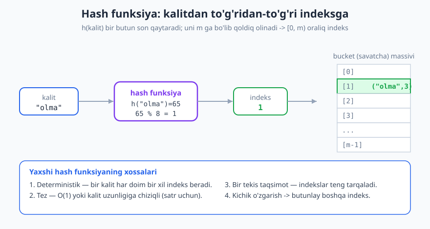
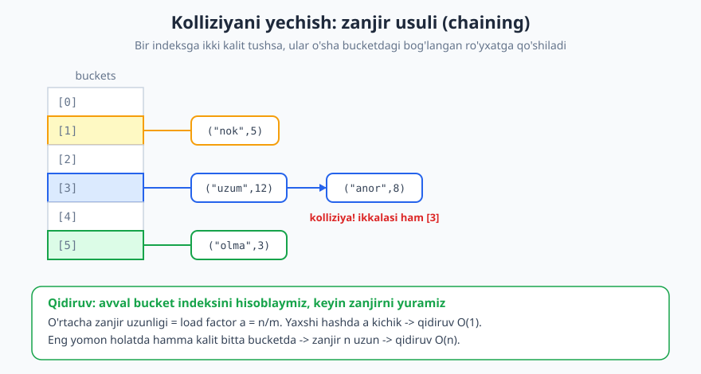
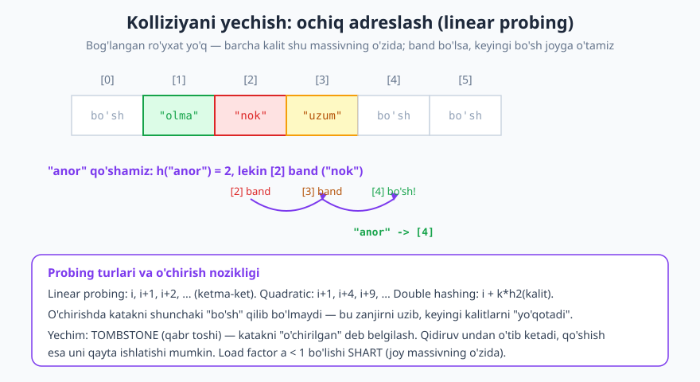

# 15 — Hash jadval (hash table)

[⬅️ Oldingi: 14 — Stack, Queue va Deque](./14-stack-queue-deque.md) · [🏠 README](./README.md) · [Keyingi: 16 — Daraxtlar va traversal ➡️](./16-daraxtlar-traversal.md)

---

> **Bu bobda:** Hash jadval — qidirish, qo'shish va o'chirishni **o'rtacha O(1)** da bajaradigan ma'lumotlar strukturasi. Asosiy g'oya bilan tanishamiz: kalitni **hash funksiya** orqali to'g'ridan-to'g'ri massiv indeksiga aylantirish. Kolliziya (turli kalitlar bir indeksga tushishi) muqarrarligini ko'ramiz va uni yechishning ikki klassik usulini — **zanjir (chaining)** va **ochiq adreslash (open addressing)** ni — o'rganamiz. Load factor, rehashing va eng yomon holatning nega O(n) ekanini tahlil qilamiz; Python `dict`/`set` aslida shu strukturadir.
>
> **Halollik / Eslatma:** "O(1)" bu yerda **amortizatsiyalangan o'rtacha** baho — yaxshi hash funksiya va past load factor sharti bilan. Bu **kafolat emas**: eng yomon holatda bitta amal O(n) bo'ladi. Buni bobda ataylab ochib beramiz. Barcha Python namunalari haqiqatan ishga tushirib tekshirilgan — chiqishlar kod bergan haqiqiy natijalar.

---

## Muammo: qidiruvni qanchalik tezlashtirsa bo'ladi?

Sizda kalit-qiymat juftlari bor deylik — masalan, mahsulot nomi va uning narxi. Yangi kalitni qo'shish, kalit bo'yicha qiymatni topish, va kalitni o'chirish kerak. Bu uchta amalni qanchalik tez bajarsa bo'ladi?

Avvalgi boblardan bilamiz:

| Struktura | Qidirish | Qo'shish | O'chirish |
|---|---|---|---|
| Tartibsiz massiv | O(n) | O(1) oxiriga | O(n) |
| Saralangan massiv | O(log n) binar qidiruv | O(n) | O(n) |
| Bog'langan ro'yxat | O(n) | O(1) boshiga | O(n) topib o'chirish |

Saralangan massivdagi [binar qidiruv](./09-murakkablikni-hisoblash.md) ancha tez — O(log n) — lekin qo'shish/o'chirish baribir O(n), chunki saralanishni saqlash kerak. Hammasi `n` ga bog'liq.

Endi jasur savol: **qidiruvni `n` ga umuman bog'liq bo'lmaydigan qilib bo'ladimi?** Ya'ni million element bo'lsin yoki o'n element — qidiruv bir xil tez bo'lsin. Bu "sehrli" tezlikka o'xshaydi, lekin hash jadval aynan shuni — **o'rtacha O(1)** ni — beradi.

## Asosiy g'oya: kalitni indeksga aylantirish

Sehrning siri oddiy. Massivda elementga indeks bo'yicha murojaat O(1) (`a[5]` — bir qadam). Demak, agar biz **kalitdan to'g'ridan-to'g'ri indeksni hisoblay olsak**, qidiruv ham O(1) bo'ladi — qidirishning hojati yo'q, to'g'ri katakka boramiz.

Buni qiladigan funksiya — **hash funksiya** `h`:

```text
h(kalit) -> [0, m) oralig'idagi butun son
```

Bu yerda `m` — massivning sig'imi (bucket'lar soni). Massivning har bir katagi **bucket** (savatcha) deb ataladi.



Eng oddiy misol — **modulo hash** (butun son kalit uchun):

```python
def h(kalit, m):
    return kalit % m

m = 10
kalitlar = [25, 35, 17, 9, 45, 7]
for k in kalitlar:
    print(k, "->", h(k, m))
# 25 -> 5
# 35 -> 5     <- 25 bilan kolliziya!
# 17 -> 7
# 9  -> 9
# 45 -> 5     <- yana 5
# 7  -> 7     <- 17 bilan kolliziya!
```

`kalit % m` har doim `[0, m)` oralig'ida bo'ladi — aynan bizga kerak indeks. E'tibor bering: 25, 35, 45 — uchalasi ham 5 ga tushdi. Bu **kolliziya** (collision) — keyin ko'ramiz.

Kalit satr bo'lsa-chi? Satrni avval songa aylantirib, keyin modulo olamiz. Klassik usul — **polinomial hash**: har bir belgini `p` ning darajalariga ko'paytirib qo'shamiz (Horner sxemasi bilan):

```python
def satr_hash(s, m, p=31):
    h = 0
    for ch in s:
        h = (h * p + ord(ch)) % m
    return h

m = 1000
for s in ["it", "ot", "uy", "olma"]:
    print(s, "->", satr_hash(s, m))
# it   -> 371
# ot   -> 557
# uy   -> 748
# olma -> 65
```

> **Eslatma:** `p` odatda alifbo hajmidan kattaroq tub son (31, 53, 257...) tanlanadi — bu belgilar bir tekisroq aralashishiga yordam beradi. `m` ham ko'pincha tub son qilinadi, chunki tub bo'lmagan `m` ba'zi kalitlar uchun yomon (notekis) taqsimot berishi mumkin.

### Yaxshi hash funksiyaning xossalari

Hash funksiya yaxshi bo'lishi uchun to'rt xossa kerak:

1. **Deterministik** — bir kalit *har doim* bir xil indeks beradi. Aks holda qo'ygan joyimizni topa olmaymiz.
2. **Tez** — hash hisoblashning o'zi O(1) (yoki satr uchun uning uzunligiga chiziqli) bo'lishi kerak, aks holda butun foyda yo'qoladi.
3. **Bir tekis taqsimot (uniform)** — kalitlar bucket'lar bo'ylab teng tarqalsin. Agar hamma 5-bucketga tushsa, struktura oddiy ro'yxatdan farq qilmaydi.
4. **Kichik o'zgarish -> katta farq** — "olma" va "olmacha" butunlay boshqa indeksga tushishi yaxshi (lavina effekti).

## Kolliziya: muqarrar haqiqat

Yuqorida 25 va 35 ikkalasi ham 5 ga tushdi. Bu tasodif emas — **kolliziya muqarrar**. Buning sababini matematik aniq ayta olamiz.

> **Kaptarxona (pigeonhole) printsipi:** Agar `k` ta kaptarni `m` ta uyaga joylasangiz va `k > m` bo'lsa, kamida bitta uyada **ikki yoki undan ortiq** kaptar bo'ladi.

Bizning holatda kalitlar — kaptarlar, bucket'lar — uyalar. Kalitlar koinoti odatda bucket'lardan **juda katta**: masalan, barcha mumkin bo'lgan satrlar cheksiz ko'p, lekin `m` chekli. Demak ikki turli kalit bir indeksga tushishi **muqarrar**.

Xulosa: kolliziyani **oldini olib bo'lmaydi**, uni **boshqarish** kerak. Buning ikki asosiy yechimi bor.

## 1-yechim: zanjir usuli (separate chaining)

Eng tabiiy g'oya: har bir bucket bitta element emas, balki **elementlar ro'yxati** (zanjir) bo'lsin. Bir indeksga tushgan barcha kalitlar o'sha bucketdagi [bog'langan ro'yxatga](./13-boglangan-royxatlar.md) qo'shiladi.



Amallar shunday ishlaydi:

- **Qo'shish:** `i = h(kalit)` ni hisoblaymiz, `buckets[i]` ro'yxatiga juftni qo'shamiz (kalit bor bo'lsa — yangilaymiz).
- **Qidirish:** `i = h(kalit)`, keyin `buckets[i]` zanjirini boshidan oxirigacha yurib, kalitni qidiramiz.
- **O'chirish:** `i = h(kalit)`, zanjirdan kalitni topib o'chiramiz.

Mana to'liq amalga oshirilgan hash jadval (chaining bilan, noldan):

```python
class HashJadval:
    def __init__(self, sigim=8):
        self.m = sigim
        self.n = 0
        self.buckets = [[] for _ in range(self.m)]

    def _indeks(self, kalit):
        return hash(kalit) % self.m

    def _rehash(self):
        eski = self.buckets
        self.m *= 2
        self.buckets = [[] for _ in range(self.m)]
        self.n = 0
        for bucket in eski:
            for k, v in bucket:
                self.put(k, v)

    def put(self, kalit, qiymat):
        i = self._indeks(kalit)
        for j, (k, v) in enumerate(self.buckets[i]):
            if k == kalit:
                self.buckets[i][j] = (kalit, qiymat)  # yangilash
                return
        self.buckets[i].append((kalit, qiymat))
        self.n += 1
        if self.n / self.m > 0.75:   # load factor chegarasi
            self._rehash()

    def get(self, kalit):
        i = self._indeks(kalit)
        for k, v in self.buckets[i]:
            if k == kalit:
                return v
        raise KeyError(kalit)

    def remove(self, kalit):
        i = self._indeks(kalit)
        for j, (k, v) in enumerate(self.buckets[i]):
            if k == kalit:
                self.buckets[i].pop(j)
                self.n -= 1
                return
        raise KeyError(kalit)


hj = HashJadval()
hj.put("olma", 3)
hj.put("nok", 5)
hj.put("uzum", 12)
print(hj.get("nok"))        # -> 5
hj.put("nok", 9)            # yangilash
print(hj.get("nok"))        # -> 9
hj.remove("olma")
print(hj.n, "ta element")   # -> 2 ta element
```

> **Eslatma:** Bu yerda Python'ning o'rnatilgan `hash()` funksiyasidan foydalandik (u har xil tip uchun yaxshi hash beradi), keyin `% self.m` bilan indeksga aylantirdik. Haqiqiy `dict` ham shu g'oyaga asoslangan, lekin C tilida ancha optimallashtirilgan.

**Afzalligi:** sodda, o'chirish oson, load factor 1 dan oshsa ham ishlay beradi (zanjir uzayadi, xolos). **Kamchiligi:** har bir tugun uchun qo'shimcha xotira (pointer'lar), va keshda yomonroq joylashish.

## 2-yechim: ochiq adreslash (open addressing)

Boshqa g'oya: hech qanday tashqi ro'yxat yo'q — **barcha kalitlar massivning o'zida** saqlanadi. Agar `h(kalit)` katagi band bo'lsa, biror qoida bo'yicha **keyingi bo'sh katakni** qidiramiz. Bu jarayon **probing** deyiladi.



Probing turlari:

- **Linear probing (chiziqli):** `i, i+1, i+2, ...` — ketma-ket keyingi kataklarni sinab ko'ramiz. Sodda, kesh-do'st, lekin **klasterlanish** (kalitlar to'planib qolishi) muammosi bor.
- **Quadratic probing (kvadratik):** `i+1, i+4, i+9, ...` — sakrashlar kattalashadi, klasterlanish kamayadi.
- **Double hashing (ikkilamchi hash):** `i + k·h₂(kalit)` — qadamning o'zi ikkinchi hash funksiyaga bog'liq. Eng yaxshi taqsimot.

### O'chirishning nozikligi: tombstone

Ochiq adreslashda o'chirish — **eng noziq qism**. Katakni shunchaki "bo'sh" qilib bo'lmaydi! Sababini ko'raylik:

`"nok"` [2] da, `"anor"` esa [2] band bo'lgani uchun [3] da turibdi (linear probing). Endi `"nok"` ni o'chirib, [2] ni "bo'sh" qilsak — keyin `"anor"` ni qidirsak, [2] ga kelamiz, "bo'sh" ko'ramiz va "yo'q ekan" deb to'xtaymiz. Lekin `"anor"` bor — biz uni **yo'qotib qo'ydik**, chunki qidiruv "bo'sh" katakda to'xtaydi.

Yechim — **tombstone** (qabr toshi): o'chirilgan katakni "bo'sh" emas, balki maxsus "o'chirilgan" belgisi bilan belgilaymiz. Qidiruv tombstone'dan **o'tib ketadi** (to'xtamaydi), qo'shish esa uni qayta ishlatishi mumkin.

Mana linear probing'ni tombstone bilan amalga oshirish:

```python
_BOSH = object()        # hech qachon ishlatilmagan katak
_OCHIRILGAN = object()  # tombstone

class OchiqHash:
    def __init__(self, sigim=8):
        self.m = sigim
        self.n = 0
        self.kalitlar = [_BOSH] * self.m
        self.qiymatlar = [None] * self.m

    def _rehash(self):
        eski_k, eski_v = self.kalitlar, self.qiymatlar
        self.m *= 2
        self.kalitlar = [_BOSH] * self.m
        self.qiymatlar = [None] * self.m
        self.n = 0
        for k, v in zip(eski_k, eski_v):
            if k is not _BOSH and k is not _OCHIRILGAN:
                self.put(k, v)

    def put(self, kalit, qiymat):
        if (self.n + 1) / self.m > 0.5:   # ochiq adreslashda a < 1 SHART
            self._rehash()
        i = hash(kalit) % self.m
        birinchi_tombstone = -1
        while self.kalitlar[i] is not _BOSH:
            if self.kalitlar[i] == kalit:
                self.qiymatlar[i] = qiymat
                return
            if self.kalitlar[i] is _OCHIRILGAN and birinchi_tombstone == -1:
                birinchi_tombstone = i
            i = (i + 1) % self.m          # linear probing
        joy = birinchi_tombstone if birinchi_tombstone != -1 else i
        self.kalitlar[joy] = kalit
        self.qiymatlar[joy] = qiymat
        self.n += 1

    def get(self, kalit):
        i = hash(kalit) % self.m
        while self.kalitlar[i] is not _BOSH:
            if self.kalitlar[i] == kalit:
                return self.qiymatlar[i]
            i = (i + 1) % self.m          # tombstone'dan o'tib ketadi
        raise KeyError(kalit)

    def remove(self, kalit):
        i = hash(kalit) % self.m
        while self.kalitlar[i] is not _BOSH:
            if self.kalitlar[i] == kalit:
                self.kalitlar[i] = _OCHIRILGAN   # tombstone qo'yamiz
                self.qiymatlar[i] = None
                self.n -= 1
                return
            i = (i + 1) % self.m
        raise KeyError(kalit)


oh = OchiqHash()
oh.put("a", 1); oh.put("b", 2); oh.put("c", 3)
print(oh.get("b"))      # -> 2
oh.remove("b")
oh.put("d", 4)
print(oh.get("d"))      # -> 4
print(oh.n, "element")  # -> 3 element
try:
    oh.get("b")
except KeyError:
    print("b yo'q")     # -> b yo'q
```

> **Trade-off:** Ochiq adreslash xotirani tejaydi (pointer yo'q) va kesh-do'st, lekin load factor `α < 1` bo'lishi **shart** (joy massivning o'zida) va `α` 0.7 dan oshsa keskin sekinlashadi. Chaining esa `α > 1` ga ham toqat qiladi, lekin qo'shimcha xotira oladi.

## Load factor va rehashing

**Load factor** (to'lganlik darajasi):

```text
α = n / m   (n — elementlar soni, m — bucket'lar soni)
```

Bu — o'rtacha bitta bucketga nechta element to'g'ri kelishini bildiradi. `α` qancha katta bo'lsa, kolliziya shuncha ko'p, qidiruv shuncha sekin:

- Chaining'da o'rtacha zanjir uzunligi aynan `α` — demak qidiruv o'rtacha `O(1 + α)`.
- Ochiq adreslashda `α` 1 ga yaqinlashganda probing juda uzayadi.

Yechim — **rehashing**: `α` belgilangan chegaradan (masalan 0.75) oshganda, massivni **kattalashtirib** (odatda 2 barobar) barcha elementlarni qayta joylashtiramiz. Yangi `m` bilan har bir kalit qaytadan hash qilinadi (chunki indeks `% m` ga bog'liq).

Quyida rehash qachon ishga tushishini kuzatamiz (chegara 0.75, boshlang'ich `m = 4`):

```python
class HJ:
    def __init__(self, sigim=4):
        self.m = sigim; self.n = 0
        self.buckets = [[] for _ in range(self.m)]
    def _i(self, k): return hash(k) % self.m
    def _rehash(self):
        eski = self.buckets; self.m *= 2
        self.buckets = [[] for _ in range(self.m)]; self.n = 0
        for b in eski:
            for k, v in b: self.put(k, v)
    def put(self, k, v):
        i = self._i(k)
        for j, (kk, vv) in enumerate(self.buckets[i]):
            if kk == k: self.buckets[i][j] = (k, v); return
        self.buckets[i].append((k, v)); self.n += 1
        if self.n / self.m > 0.75: self._rehash()

hj = HJ(4)
for x in range(10):
    hj.put(x, x * x)
    print("n =", hj.n, " m =", hj.m, " load =", round(hj.n / hj.m, 2))
# n = 1  m = 4   load = 0.25
# n = 2  m = 4   load = 0.5
# n = 3  m = 4   load = 0.75
# n = 4  m = 8   load = 0.5     <- rehash! m 4->8
# n = 5  m = 8   load = 0.62
# n = 6  m = 8   load = 0.75
# n = 7  m = 16  load = 0.44    <- rehash! m 8->16
# n = 8  m = 16  load = 0.5
# n = 9  m = 16  load = 0.56
# n = 10 m = 16  load = 0.62
```

E'tibor bering: rehash `m` ikki barobar oshganda yuz beradi va `α` ni yana pasaytiradi. Bitta rehash O(n) — barcha elementni ko'chirish kerak. Lekin u **kamdan-kam** sodir bo'ladi (har 2x o'sishda bir marta), shuning uchun [amortizatsiyalangan tahlil](./11-amortizatsiyalangan-tahlil.md) bo'yicha bitta `put` baribir **amortized O(1)** — xuddi dinamik massivga `append` kabi.

## Murakkablik: O(1) — lekin qaysi ma'noda?

Bu — bobning eng muhim nuance'i. Hash jadvalning murakkabligini bir so'z bilan "O(1)" deyish **noto'g'ri va xavfli**. Aniq jadval:

| Amal | O'rtacha (yaxshi hash, past α) | Eng yomon holat |
|---|---|---|
| Qidirish (`get`) | **O(1)** | **O(n)** |
| Qo'shish (`put`) | **O(1)** amortized | **O(n)** |
| O'chirish (`remove`) | **O(1)** | **O(n)** |

**Nega o'rtacha O(1)?** Agar hash bir tekis taqsimlasa va `α` kichik (chegaralangan) bo'lsa, o'rtacha zanjir uzunligi `O(1)`, demak qidiruv `O(1)`.

**Nega eng yomon holat O(n)?** Agar hash funksiya yomon bo'lsa (yoki dushman ataylab kalitlarni tanlasa) va **hamma kalit bitta bucketga** tushsa, struktura oddiy bog'langan ro'yxatga aylanadi — qidiruv `O(n)`. Buni ko'rsataylik:

```python
def yomon_hash(k, m):
    return 0   # har doim 0 — barcha kalit bitta bucketda!

m = 8
buckets = [[] for _ in range(m)]
for k in [10, 20, 30, 40, 50]:
    buckets[yomon_hash(k, m)].append(k)
print(buckets[0])               # -> [10, 20, 30, 40, 50]
print("0-bucket uzunligi:", len(buckets[0]))  # -> 5
# qidiruv endi O(n): bitta uzun zanjirni yurish kerak
```

> **Diqqat:** "Hash jadval O(1)" deganda, doimo *o'rtacha* va *amortized* nazarda tutiladi — bu kafolat emas, taxmin (ekspektatsiya). Real-time tizimda, har bir amal qattiq vaqt chegarasiga sig'ishi shart bo'lsa, hash jadval (rehash sababli bitta amal O(n) bo'lishi mumkinligi uchun) ehtiyotkorlik talab qiladi.

**Xotira:** struktura `O(n + m)` joy oladi. `α` ni past ushlash uchun `m` ni `n` ga taqqoslanadigan qilib saqlaymiz, demak xotira `O(n)`.

## Qo'llanmalar: ko'p masala O(n) ga tushadi

Hash jadval shunchaki "kalit-qiymat saqlash" emas — u **algoritmik qurol**. Avvalgi boblarda O(n²) yoki O(n log n) bo'lgan ko'p masala hash bilan **O(n)** ga tushadi.

**1. Lug'at / map** — kalitdan qiymatga moslik (Python `dict`).

**2. To'plam (set)** — faqat kalitlar, takrorsiz (Python `set`).

**3. Sanash (frequency)** — har element necha marta uchraganini sanash:

```python
matn = "olma nok olma uzum nok olma"
sanoq = {}
for soz in matn.split():
    sanoq[soz] = sanoq.get(soz, 0) + 1
print(sanoq)   # -> {'olma': 3, 'nok': 2, 'uzum': 1}

from collections import Counter
print(Counter(matn.split()))  # -> Counter({'olma': 3, 'nok': 2, 'uzum': 1})
```

**4. Takroriy element bormi (O(n))** — set bilan bir o'tishda:

```python
def takror_bormi(a):
    korilgan = set()
    for x in a:
        if x in korilgan:
            return True
        korilgan.add(x)
    return False

print(takror_bormi([3, 1, 4, 1, 5]))  # -> True
print(takror_bormi([3, 1, 4, 5]))     # -> False
```

Saralash bilan bu O(n log n) bo'lardi; hash bilan **O(n)**.

**5. Ikki ro'yxat kesishmasi (O(n+m))** — bittasini set qilib, ikkinchisini bir o'tishda tekshiramiz:

```python
a = [1, 2, 3, 4, 5]
b = [4, 5, 6, 7]
s = set(a)
kesishma = [x for x in b if x in s]
print(kesishma)  # -> [4, 5]
```

Ikki ichma-ich sikl bilan bu O(n·m) bo'lardi; hash bilan **O(n+m)**.

**6. Keshlash (memoization)** — hisoblangan natijalarni kalit bo'yicha saqlash (rekursiyada takror hisoblashning oldini olish).

## Python `dict` va `set` — aslida hash jadval

Python'ning `dict` va `set` ichida aynan hash jadval ishlaydi (CPython'da ochiq adreslash + maxsus optimizatsiyalar). Shuning uchun:

| Amal | `dict` / `set` o'rtacha |
|---|---|
| `d[k]` (qidirish) | O(1) |
| `d[k] = v` (qo'shish) | O(1) amortized |
| `del d[k]` (o'chirish) | O(1) |
| `k in d` (bor-yo'qligi) | O(1) |

Shuning uchun `x in lst` (ro'yxatda) O(n), lekin `x in s` (set/dict'da) O(1) — katta ma'lumotda farq ulkan.

> **Eslatma:** `dict`/`set`ga faqat **hashlanadigan (hashable)** obyektlarni qo'yish mumkin: son, satr, tuple (o'zgarmaslar). `list` yoki `dict` kalit bo'la olmaydi — chunki ular o'zgaruvchan, demak hash'i barqaror emas.

## Xavfsizlik: hash kolliziya hujumi

Qisqacha bir xavf haqida. Agar hash funksiya **oldindan ma'lum va o'zgarmas** bo'lsa, hujumchi bir bucketga tushadigan minglab kalitlarni ataylab tanlashi mumkin — bunda har bir amal `O(n)` ga aylanadi va server "muzlab" qoladi (DoS hujumi, "hash flooding").

Himoya — **hash randomizatsiyasi**: har bir dastur ishga tushganda hash funksiyaga tasodifiy "tuz" (seed) qo'shiladi, shuning uchun hujumchi qaysi kalitlar kolliziya berishini oldindan bilolmaydi. Python `str`/`bytes` hash'i 3.3 versiyadan beri shunday randomizatsiyalangan (`PYTHONHASHSEED`).

## Asosiy g'oyalar (bobni qisqacha)

- **Hash jadval** kalitni **hash funksiya** orqali massiv indeksiga aylantirib, qidirish/qo'shish/o'chirishni **o'rtacha O(1)** da bajaradi.
- Yaxshi hash funksiya: deterministik, tez, bir tekis taqsimot, kichik o'zgarishga sezgir.
- **Kolliziya muqarrar** (kaptarxona printsipi: kalitlar bucket'lardan ko'p). Ikki yechim: **zanjir (chaining)** — bucketda bog'langan ro'yxat; **ochiq adreslash** — keyingi bo'sh katakni probing bilan qidirish.
- Ochiq adreslashda o'chirish **tombstone** talab qiladi, aks holda zanjir uzilib, kalitlar yo'qoladi.
- **Load factor** `α = n/m` — to'lganlik. Katta `α` -> ko'p kolliziya. **Rehashing** (2x kattalashtirish) `α` ni past ushlaydi; bitta `put` shu sababli **amortized O(1)**.
- Eng yomon holat **O(n)** — hamma kalit bir bucketga tushsa. "O(1)" — o'rtacha/amortized, kafolat emas.
- Python `dict`/`set` — hash jadval; `in` tekshiruv O(1). Ko'p masala (sanash, takror topish, kesishma) hash bilan **O(n)** ga tushadi.

## Mashqlar

### Oson

**1-mashq.** `m = 7` bo'lsin. Quyidagi kalitlar uchun `h(k) = k mod m` ni hisoblang: `14, 8, 21, 9, 2`. Qaysilari kolliziya beradi?

**2-mashq.** `h(k) = k mod 6` bilan `12, 18, 7, 25` kalitlari qaysi bucket'larga tushadi? Bo'sh qoladigan bucket'lar qaysilar?

**3-mashq.** Load factor ta'rifini ayting. `n = 12` element, `m = 16` bucket bo'lsa, `α` nechaga teng? Bu "salomat" (sog'lom) qiymatmi?

### O'rta

**4-mashq.** Bo'sh chaining-jadval, `m = 5`, `h(k) = k mod 5`. Quyidagi kalitlarni shu tartibda qo'shing: `10, 15, 7, 22, 12, 17`. Har bir bucketning oxirgi holatini (zanjirlar bilan) chizib bering.

**5-mashq.** 4-mashqdagi yakuniy jadval uchun load factor `α` ni hisoblang. Eng uzun zanjir qancha?

**6-mashq.** `[4, 2, 7, 2, 9, 4, 4, 7]` ro'yxatida har bir son necha marta uchraganini hash jadval (`dict`) yordamida sanaydigan g'oyani so'z bilan tushuntiring va murakkabligini ayting.

### Qiyin

**7-mashq.** Linear probing'li hash jadval, `m = 7`, `h(k) = k mod 7`. Kalitlar shu tartibda qo'shiladi: `10, 17, 24, 3, 31`. Har bir kalit qaysi indeksga tushishini probing qadamlari bilan ko'rsating (`10 -> 3`, ...).

**8-mashq.** Ikkita ro'yxat `a` va `b` berilgan. Ularning umumiy elementlarini (kesishmasini) **O(n + m)** da topadigan algoritmni yozing va nega ichma-ich sikldan (O(n·m)) tez ekanini tushuntiring.

**9-mashq.** Rehashing tahlili: `m = 1` dan boshlab, har 2x kattalashtirsh bilan `n` ta element qo'shamiz. Barcha rehash'larning **jami** narxi O(n) ekanini geometrik qator orqali isbotlang. Demak bitta `put` amortized qancha?

**10-mashq.** Hash jadvalning eng yomon holat qidiruvi **nega** O(n) ekanini tushuntiring. Bu qaysi vaziyatda yuz beradi va undan qanday himoyalanish mumkin (ikki usul ayting)?

<details markdown="1">
<summary>Yechimlar</summary>

### 1-mashq yechimi

`h(k) = k mod 7`:
- `14 mod 7 = 0`
- `8 mod 7 = 1`
- `21 mod 7 = 0`  ← 14 bilan **kolliziya** (ikkalasi 0)
- `9 mod 7 = 2`
- `2 mod 7 = 2`  ← 9 bilan **kolliziya** (ikkalasi 2)

Kolliziyalar: `{14, 21}` indeks 0 da, `{9, 2}` indeks 2 da.

### 2-mashq yechimi

`h(k) = k mod 6`:
- `12 mod 6 = 0`
- `18 mod 6 = 0`  ← 12 bilan kolliziya
- `7 mod 6 = 1`
- `25 mod 6 = 1`  ← 7 bilan kolliziya

Band bucket'lar: 0 (`{12,18}`), 1 (`{7,25}`). **Bo'sh qoladigan bucket'lar: 2, 3, 4, 5.**

### 3-mashq yechimi

Load factor `α = n / m` — o'rtacha bitta bucketga to'g'ri keladigan elementlar soni.

`α = 12 / 16 = 0.75`. Ha, bu **sog'lom** qiymat — ko'p amalga oshirishlar aynan 0.75 ni rehash chegarasi qilib oladi. `α` 0.75 dan oshsa, kolliziya ko'payadi va rehash kerak bo'ladi.

### 4-mashq yechimi

`h(k) = k mod 5`:
- `10 -> 0`, `15 -> 0`, `7 -> 2`, `22 -> 2`, `12 -> 2`, `17 -> 2`

Qo'shilish tartibida (yangilari zanjir oxiriga):

```text
[0]: 10 -> 15
[1]: (bo'sh)
[2]: 7 -> 22 -> 12 -> 17
[3]: (bo'sh)
[4]: (bo'sh)
```

### 5-mashq yechimi

`n = 6` element, `m = 5` bucket. `α = 6 / 5 = 1.2`.

Eng uzun zanjir — bucket [2] da: `7 -> 22 -> 12 -> 17`, ya'ni **4 ta element**. E'tibor: `α = 1.2 > 1` — chaining'da bu mumkin (ochiq adreslashda mumkin emas bo'lardi), lekin zanjir [2] juda uzun, demak rehash foydali bo'lardi.

### 6-mashq yechimi

G'oya: bo'sh `dict` ochamiz. Ro'yxatni **bir marta** aylanib chiqamiz; har bir son uchun `sanoq[son] = sanoq.get(son, 0) + 1`. `dict`ga murojaat o'rtacha O(1), umumiy **O(n)**.

```python
a = [4, 2, 7, 2, 9, 4, 4, 7]
sanoq = {}
for x in a:
    sanoq[x] = sanoq.get(x, 0) + 1
print(sanoq)   # -> {4: 3, 2: 2, 7: 2, 9: 1}
```

Murakkablik: **O(n)** vaqt, **O(k)** xotira (`k` — turli qiymatlar soni).

### 7-mashq yechimi

`h(k) = k mod 7`, linear probing (band bo'lsa `i+1`):

- `10 mod 7 = 3` -> [3] bo'sh -> **[3]**
- `17 mod 7 = 3` -> [3] band -> [4] bo'sh -> **[4]**
- `24 mod 7 = 3` -> [3] band -> [4] band -> [5] bo'sh -> **[5]**
- `3 mod 7 = 3` -> [3],[4],[5] band -> [6] bo'sh -> **[6]**
- `31 mod 7 = 3` -> [3]..[6] band -> [0] (aylanib) bo'sh -> **[0]**

Yakuniy massiv:

```text
[0]: 31   [1]: -   [2]: -   [3]: 10   [4]: 17   [5]: 24   [6]: 3
```

Bu klasterlanishning yorqin misoli: hammasi 3 ga tushgani uchun uzun blok hosil bo'ldi.

### 8-mashq yechimi

```python
def kesishma(a, b):
    s = set(a)                    # O(n): a ni set qilamiz
    return [x for x in b if x in s]  # O(m): har bir b elementini O(1) tekshiramiz

print(kesishma([1, 2, 3, 4, 5], [4, 5, 6, 7]))  # -> [4, 5]
```

Murakkablik **O(n + m)**: `set(a)` O(n), keyin `b` bo'yicha bir o'tish, har bir `in s` tekshiruvi o'rtacha O(1).

Ichma-ich sikl (har `a` uchun butun `b` ni tekshirish) **O(n·m)** bo'lardi. Hash `in` tekshiruvini O(m) qidiruvdan O(1) ga tushirgani uchun tezroq.

### 9-mashq yechimi

`m` 1, 2, 4, 8, ..., n bo'lib o'sadi. Har rehash o'sha paytdagi barcha elementni ko'chiradi, ya'ni `1 + 2 + 4 + ... + n/2 + n` ta ko'chirish. Bu **geometrik qator**:

```text
1 + 2 + 4 + ... + n  =  2n - 1  <  2n  =  O(n)
```

(Isbot: `S = 1+2+...+2^k` bo'lsa, `2S - S = 2^(k+1) - 1`, ya'ni `S = 2^(k+1) - 1 = 2n - 1`.)

Demak `n` ta `put`ning jami narxi = `n` ta oddiy qo'shish (O(n)) + `< 2n` ta ko'chirish (O(n)) = **O(n)**. Bitta `put`ga: `O(n) / n = ` **amortized O(1)**. (Batafsil: [11-bob](./11-amortizatsiyalangan-tahlil.md).)

### 10-mashq yechimi

Eng yomon holat qidiruvi **O(n)** bo'ladi, agar **hamma `n` ta kalit bitta bucketga** tushsa (chaining'da) yoki bitta uzun probing klasteriga to'planib qolsa (ochiq adreslashda). Bunda struktura oddiy bog'langan ro'yxatga aylanadi: kalitni topish uchun n ta elementni ketma-ket tekshirish kerak.

Bu yuz beradi, agar: (a) hash funksiya yomon (bir tekis taqsimlamaydi), yoki (b) dushman kolliziya beradigan kalitlarni ataylab tanlasa.

Himoya ikki usul:
1. **Yaxshi, bir tekis taqsimlaydigan hash funksiya** tanlash (tub `p`, tub `m`, lavina effekti) — bu o'rtacha holatni O(1) saqlaydi.
2. **Hash randomizatsiyasi** (tasodifiy seed) — hujumchi qaysi kalitlar kolliziya berishini oldindan bilolmaydi, demak ataylab eng yomon holatni keltirib chiqara olmaydi.

(Qo'shimcha: ba'zi tillar bucketdagi zanjir uzaysa, uni qizil-qora daraxtga aylantiradi — bu eng yomon holatni O(n) dan O(log n) ga tushiradi. Java HashMap shunday qiladi.)

</details>

---

[⬅️ Oldingi: 14 — Stack, Queue va Deque](./14-stack-queue-deque.md) · [🏠 README](./README.md) · [Keyingi: 16 — Daraxtlar va traversal ➡️](./16-daraxtlar-traversal.md)
