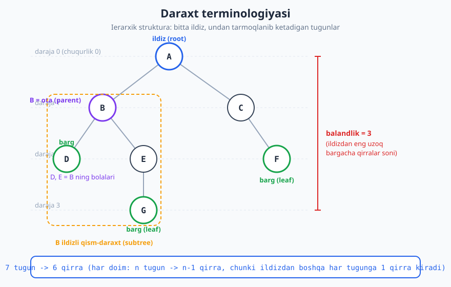
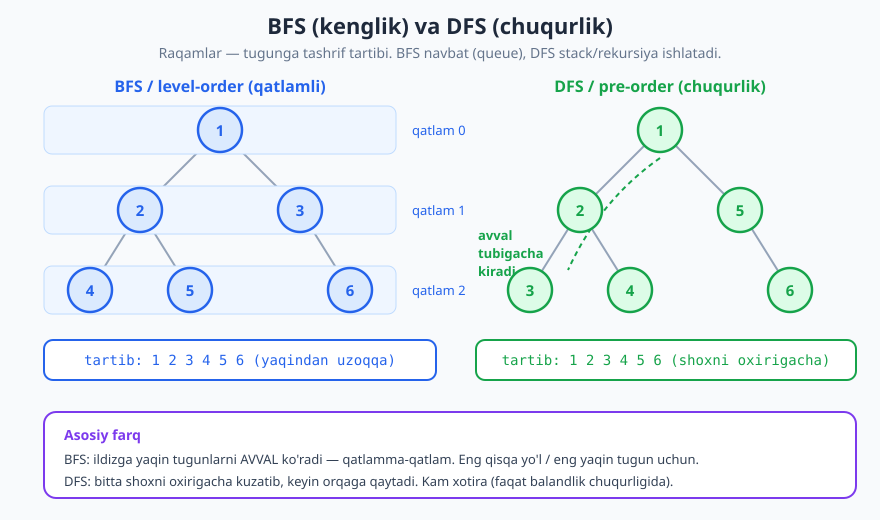
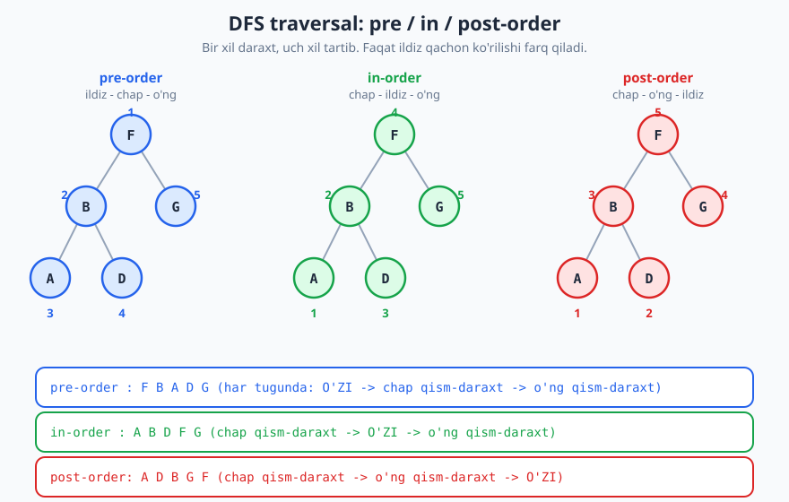

# 16 — Daraxtlar va traversal

[⬅️ Oldingi: 15 — Hash jadval (hash table)](./15-hash-jadval.md) · [🏠 README](./README.md) · [Keyingi: 17 — Binar qidiruv daraxti (BST) ➡️](./17-binar-qidiruv-daraxti.md)

---

> **Bu bobda:** Hozirgacha ko'rgan strukturalarimiz (massiv, ro'yxat, stack, queue) **chiziqli** edi — elementlar bir tekis ketma-ketlikda. Endi birinchi **ierarxik** strukturani — **daraxt**ni — o'rganamiz. Daraxt nima ekanini, uning aniq atamalarini (ildiz, ota, bola, barg, balandlik, chuqurlik), **binar daraxt**ning xossalarini va daraxtni **aylanib chiqish** (traversal) usullarini — chuqurlik bo'yicha (pre/in/post-order) va kenglik bo'yicha (BFS / level-order) — to'liq o'rganamiz, hammasini ishlaydigan Python bilan.
>
> **Halollik / Eslatma:** Bu yerdagi barcha tasdiqlar (n tugun -> n-1 qirra, mukammal daraxtda balandlik h -> 2^(h+1)-1 tugun, balanslangan daraxt balandligi O(log n), traversal vaqti O(n)) matematik aniq va isbotlanadi. Python namunalari **haqiqatan ishga tushirib tekshirilgan** — barcha chiqishlar kod chiqargan haqiqiy natijalar. Bu bobda **binar qidiruv tartibi** (BST) chuqur emas — u keyingi [17-bob](./17-binar-qidiruv-daraxti.md)da; bu yerda daraxt **strukturasi** va **aylanib chiqish** asoslari.

---

## Daraxt nima: chiziqdan ierarxiyaga

Massivda har elementning aniq bitta "keyingisi" bor — bu **chiziqli** tartib. Lekin dunyodagi ko'p munosabatlar chiziqli emas, **ierarxik**: bitta narsadan bir nechta narsa "tarmoqlanadi".

Atrofingizga qarang — ierarxiya hamma yerda:

- **Fayl tizimi:** bitta papka ichida bir nechta papka va fayl; har papka yana ichkariga tarmoqlanadi.
- **HTML DOM:** `<html>` ichida `<body>`, uning ichida `<div>`, undan keyin yana elementlar — sahifa bitta daraxt.
- **Tashkilot tuzilmasi:** direktor -> bo'lim boshliqlari -> xodimlar.
- **Oila daraxti:** ota-ona -> bolalar -> nevaralar.
- **Ifoda daraxti:** `(2 + 3) * 4` ifodasi `*` ildizli daraxt sifatida saqlanadi — kompilyatorlar shunday ishlaydi.

Bularning hammasida umumiy naqsh bor: **bitta yuqori nuqta** (eng tepa) va undan **pastga tarmoqlanish**, lekin **siklsiz** (orqaga aylanib qaytib kelmaydi). Mana shu — **daraxt**.

> **Intuitsiya:** Daraxtni teskari ag'darilgan haqiqiy daraxt deb tasavvur qiling: **ildiz tepada**, shoxlar pastga ketadi, eng pastdagi shoxlar — **barglar**. Informatikada daraxtni odatda shunday — ildiz tepada — chizamiz.

**Aniq ta'rif (grafik tilida):** daraxt — bu **bog'langan** (har tugunga yetib borish mumkin) va **siklsiz** (hech qanday halqa yo'q) graf. Bunday grafda har doim:

```text
n ta tugun  ->  aniq n-1 ta qirra
```

Nega? Ildizdan boshqa **har bir** tugunga aynan **bitta** qirra "yuqoridan" kiradi (uni otasi bilan bog'laydi). Ildizga hech qirra kirmaydi. Demak qirralar soni = (ildizdan boshqa tugunlar soni) = n - 1. Bu kichik, ammo juda foydali fakt: agar sizga "graf" berilsa va u n tugun, n-1 qirradan iborat hamda bog'langan bo'lsa — u albatta daraxt.

## Terminologiya — aniq lug'at

Daraxt bilan ishlash uchun atamalarni aniq bilish shart. Quyidagi rasm hammasini bitta misolda ko'rsatadi.



- **Tugun (node):** daraxtning bir elementi (rasmda doira). U qiymat saqlaydi.
- **Qirra (edge):** ikki tugunni bog'lovchi chiziq (ota–bola aloqasi).
- **Ildiz (root):** eng tepadagi, otasi yo'q yagona tugun (rasmda `A`). Daraxtning "kirish nuqtasi".
- **Ota (parent) va bola (child):** agar `A` dan pastga `B` ga qirra ketsa, `A` — `B` ning **otasi**, `B` — `A` ning **bolasi**. Har tugunning **ko'pi bilan bitta otasi** bor (ildizning otasi yo'q).
- **Aka-uka (sibling):** bir xil otaga ega tugunlar (rasmda `D` va `E`).
- **Barg (leaf):** bolasi yo'q tugun (rasmda `D`, `F`, `G`). "Yaproq" — shox shu yerda tugaydi.
- **Ichki tugun (internal node):** kamida bitta bolasi bor tugun (barg emas).
- **Ajdod (ancestor) / avlod (descendant):** `A` dan `G` ga pastga yo'l bo'lsa, `A` — `G` ning ajdodi, `G` — `A` ning avlodi.
- **Qism-daraxt (subtree):** biror tugunni va uning barcha avlodlarini olsak — bu o'zicha mustaqil daraxt (rasmda `B` ildizli qism-daraxt sariq ramkada). **Bu g'oya rekursiyaning kaliti**: daraxt = ildiz + chap qism-daraxt + o'ng qism-daraxt.

Endi ikki "o'lcham" atamasi — ularni adashtirmaslik muhim:

- **Chuqurlik (depth):** **ildizdan** shu tugungacha bo'lgan qirralar soni. Ildiz chuqurligi = 0. (Rasmda `D` chuqurligi = 2.)
- **Balandlik (height):** shu tugundan **eng uzoq bargacha** bo'lgan qirralar soni. Bargning balandligi = 0. Daraxt balandligi = ildiz balandligi (rasmda 3).
- **Daraja (level):** ko'pincha chuqurlik bilan bir xil ishlatiladi — ildiz darajasi 0, undan pastdagilar 1, va hokazo.

> **Diqqat — chuqurlik vs balandlik:** Chuqurlik **yuqoridan pastga** o'lchanadi (ildizdan tugungacha), balandlik **pastdan yuqoriga** (tugundan eng chuqur bargacha). Bo'sh daraxtning balandligi odatda **-1** deb olinadi (toki bitta tugunli daraxt balandligi 0 chiqsin) — kodimizda ham shunday qilamiz.

## Binar daraxt (binary tree)

Eng muhim va eng ko'p ishlatiladigan tur — **binar daraxt**: har tugunda **ko'pi bilan ikkita bola** bo'ladi, ular **chap (left)** va **o'ng (right)** deb ataladi. Tartib muhim: chap bola va o'ng bola bir xil emas.

Binar daraxtning bir nechta maxsus turi bor:

| Tur | Ta'rif |
|---|---|
| **To'liq (full)** | Har tugunda **0 yoki 2** bola (hech tugunning aynan 1 bolasi bo'lmaydi). |
| **Mukammal (perfect)** | Barcha ichki tugunlarda 2 bola va **barcha barglar bir darajada**. |
| **Complete** | Oxirgi darajadan tashqari barchasi to'liq, oxirgi daraja **chapdan** to'ladi. (Heap shunday — [19-bob](./19-heap-priority-queue.md).) |
| **Balanslangan** | Har tugunda chap va o'ng qism-daraxt balandliklari farqi kichik (chegaralangan); balandlik O(log n). ([18-bob](./18-balanslangan-daraxtlar.md).) |

### Nega balandlik shunchalik muhim

Daraxtdagi ko'p amal (qidiruv, qo'shish) **ildizdan pastga bitta yo'l bo'ylab** yuradi. Demak amal narxi — **balandlikka** proporsional. Shuning uchun "qancha past?" degan savol hal qiluvchi.

**Mukammal binar daraxt** uchun aniq formula bor. Balandligi `h` bo'lsa, tugunlar soni:

```text
1 + 2 + 4 + ... + 2^h  =  2^(h+1) - 1
```

Chunki 0-darajada 1 tugun, 1-darajada 2, 2-darajada 4, ... h-darajada 2^h tugun. Tekshiramiz:

```python
# mukammal daraxt: balandlik h -> 2^(h+1)-1 tugun
for h in range(4):
    print(f"h={h}: tugunlar = {2**(h+1)-1}")
# -> h=0: tugunlar = 1
# -> h=1: tugunlar = 3
# -> h=2: tugunlar = 7
# -> h=3: tugunlar = 15
```

Bu formulani teskari o'qing: agar `n` ta tugun bo'lsa, `n = 2^(h+1) - 1`, demak `h ≈ log2(n)`. Ya'ni **n tugunli daraxtning balandligi kamida `log2 n` atrofida** bo'lishi mumkin. Bu — daraxtlarning sehri:

> **Balanslangan daraxtda balandlik `O(log n)`.** Million tugun bo'lsa ham balandlik ~20. Demak ildizdan pastga bitta yo'l atigi ~20 qadam — bu nega qidiruvni juda tezlashtiradi. Buni to'liq [17-bobda BST](./17-binar-qidiruv-daraxti.md) ko'rasiz.

> **Diqqat — eng yomon holat.** Daraxt **balanslanmagan** bo'lsa, balandlik `O(n)` ga yetishi mumkin. Masalan, har tugunda faqat o'ng bola bo'lsa, daraxt **bog'langan ro'yxatga aylanib qoladi** (balandlik = n-1). Shuning uchun balanslash texnikalari kerak ([18-bob](./18-balanslangan-daraxtlar.md)).

## Daraxtni tasvirlash

Ikki asosiy usul bor.

**1) Tugun klassi (ko'rsatkichlar bilan)** — eng tabiiy va eng ko'p ishlatiladigan. Har tugun qiymat va ikki havoladan (chap, o'ng) iborat:

```python
class Node:
    def __init__(self, value, left=None, right=None):
        self.value = value
        self.left = left      # chap bola (Node yoki None)
        self.right = right    # o'ng bola (Node yoki None)

#        F
#       / \
#      B   G
#     / \
#    A   D
root = Node('F',
            Node('B', Node('A'), Node('D')),
            Node('G'))
```

Bu xuddi [bog'langan ro'yxatdagi](./13-boglangan-royxatlar.md) tugunga o'xshaydi, faqat bitta `next` o'rniga ikkita havola (`left`, `right`) bor. `None` — "bola yo'q" degani.

**2) Massiv tasviri** — faqat **complete** daraxtlar uchun ixcham va juda foydali. Tugunlarni qatlamma-qatlam, chapdan o'ngga massivga joylaymiz. U holda **havolalarsiz**, faqat indeks arifmetikasi bilan ota-bolani topamiz:

```text
indeks i tugun uchun:
  chap bola  -> 2*i + 1
  o'ng bola  -> 2*i + 2
  otasi      -> (i - 1) // 2
```

```python
arr = [10, 20, 30, 40, 50, 60]
def children(i, arr):
    n = len(arr)
    l, r = 2 * i + 1, 2 * i + 2
    lv = arr[l] if l < n else None
    rv = arr[r] if r < n else None
    return lv, rv

print("0 ning bolalari:", children(0, arr))  # -> (20, 30)
print("1 ning bolalari:", children(1, arr))  # -> (40, 50)
print("2 ning bolalari:", children(2, arr))  # -> (60, None)
```

Bu indeks fokusi **heap** (priority queue) ning asosidir — [19-bobda](./19-heap-priority-queue.md) shu massiv tasviri ustiga butun struktura quriladi.

## Traversal — daraxtni aylanib chiqish

Massivni bir `for` sikl bilan boshdan-oxir o'qiymiz. Lekin daraxt tarmoqlangan — uni "boshdan-oxir" o'qishning **yagona** to'g'ri yo'li yo'q; bir nechta tartib mavjud. **Traversal** — har tugunga aynan bir marta tashrif buyurib chiqish. Ikki katta oila bor:

- **Chuqurlik bo'yicha (DFS — Depth-First Search):** bitta shoxni iloji boricha **tubigacha** kuzatib, keyin orqaga qaytib boshqa shoxga o'tish.
- **Kenglik bo'yicha (BFS — Breadth-First Search / level-order):** **qatlamma-qatlam** — avval ildiz, keyin uning bolalari, keyin nevaralari.



### DFS: pre-order, in-order, post-order

DFS rekursiv tabiatga ega — uni [rekursiya](./06-rekursiya-asoslari.md) bilan yozish eng tabiiy. "Daraxt = ildiz + chap qism-daraxt + o'ng qism-daraxt" g'oyasini eslang. Savol faqat shu: **ildizga qachon tashrif buyuramiz** — chap va o'ng qism-daraxtlardan oldinmi, orasidami, keyinmi? Uch javob — uch tartib:

- **pre-order** (oldindan): **ildiz** -> chap -> o'ng
- **in-order** (orasida): chap -> **ildiz** -> o'ng
- **post-order** (keyin): chap -> o'ng -> **ildiz**

E'tibor bering: uchchalasida ham **chap doim o'ngdan oldin**; faqat ildizning o'rni siljiydi.



```python
def pre_order(node, out):
    if node is None:
        return
    out.append(node.value)      # avval o'zi (ildiz)
    pre_order(node.left, out)   # keyin chap qism-daraxt
    pre_order(node.right, out)  # keyin o'ng qism-daraxt

def in_order(node, out):
    if node is None:
        return
    in_order(node.left, out)
    out.append(node.value)      # ildiz o'rtada
    in_order(node.right, out)

def post_order(node, out):
    if node is None:
        return
    post_order(node.left, out)
    post_order(node.right, out)
    out.append(node.value)      # ildiz oxirida
```

Yuqoridagi `root` (F-B-G-A-D) daraxtida ishlatsak:

```python
pre, ino, post = [], [], []
pre_order(root, pre)
in_order(root, ino)
post_order(root, post)
print("pre :", pre)   # -> ['F', 'B', 'A', 'D', 'G']
print("in  :", ino)   # -> ['A', 'B', 'D', 'F', 'G']
print("post:", post)  # -> ['A', 'D', 'B', 'G', 'F']
```

> **Isbot (eskiz) — nega `O(n)`:** Har bir traversal har tugunni **aynan bir marta** ziyorat qiladi va har tugunda doimiy (O(1)) ish bajaradi (`append` + ikki rekursiv chaqiruv). `None` lar uchun ham qo'shimcha aynan n+1 ta bo'sh chaqiruv bo'ladi (har bir bo'sh havola uchun). Jami — `O(n)` vaqt. Xotira: rekursiya stegi balandlikcha chuqur, ya'ni `O(h)`; balanslangan daraxtda `O(log n)`, eng yomon holatda `O(n)`.

**Har tartibning amaliy ma'nosi:**

| Tartib | Qachon ishlatiladi |
|---|---|
| **pre-order** | Daraxtning **nusxasini** olish, ifodani prefiks (Polish) shaklida yozish, struktura serializatsiyasi. |
| **in-order** | **BST**da elementlar aynan **saralangan** tartibda chiqadi ([17-bob](./17-binar-qidiruv-daraxti.md)) — bu in-order'ning eng mashhur xossasi. |
| **post-order** | Daraxtni **o'chirish** (avval bolalarni, keyin otani), qism-daraxt qiymatini hisoblash (masalan, balandlik, ifoda daraxtini hisoblash). |

### DFS'ni stack bilan (rekursiyasiz)

Rekursiya — bu yashirin **stack** ([14-bob](./14-stack-queue-deque.md)). Demak DFS'ni o'z stegimiz bilan iterativ ham yozsa bo'ladi. Pre-order uchun ayniqsa oddiy — faqat o'ng bolani **avval** push qilamiz, toki chap birinchi chiqsin:

```python
def pre_order_iter(root):
    if root is None:
        return []
    out, stack = [], [root]
    while stack:
        node = stack.pop()
        out.append(node.value)
        if node.right:   # o'ngni avval push -> chap birinchi pop bo'ladi
            stack.append(node.right)
        if node.left:
            stack.append(node.left)
    return out

print("iterativ pre:", pre_order_iter(root))  # -> ['F', 'B', 'A', 'D', 'G']
```

### BFS / level-order — navbat bilan

Kenglik bo'yicha aylanish **queue** ([14-bob](./14-stack-queue-deque.md)) talab qiladi: ildizni navbatga qo'yamiz; navbatdan tugun olib, uni ko'ramiz va **bolalarini navbat oxiriga** qo'shamiz. Shunda doimo ildizga yaqin tugunlar oldin chiqadi — qatlamma-qatlam.

```python
from collections import deque

def level_order(root):
    out = []
    if root is None:
        return out
    q = deque([root])
    while q:
        node = q.popleft()          # navbat boshidan ol
        out.append(node.value)
        if node.left:
            q.append(node.left)     # bolalarni oxiriga qo'sh
        if node.right:
            q.append(node.right)
    return out

print("bfs:", level_order(root))  # -> ['F', 'B', 'G', 'A', 'D']
```

Ko'pincha har qatlamni **alohida ro'yxat** sifatida olish kerak bo'ladi (masalan, daraxtni darajalab chop etish). Buning uchun har iteratsiya boshida navbatdagi tugunlar sonini eslab qolamiz — bu aynan joriy qatlam hajmi:

```python
def levels(root):
    res = []
    if root is None:
        return res
    q = deque([root])
    while q:
        size = len(q)               # joriy qatlamdagi tugunlar soni
        layer = []
        for _ in range(size):
            node = q.popleft()
            layer.append(node.value)
            if node.left:
                q.append(node.left)
            if node.right:
                q.append(node.right)
        res.append(layer)
    return res

print("qatlamlar:", levels(root))  # -> [['F'], ['B', 'G'], ['A', 'D']]
```

> **Trade-off — DFS vs BFS xotirasi.** DFS xotirasi balandlikka (`O(h)`) bog'liq — chuqur, lekin tor daraxtlarda arzon. BFS xotirasi esa eng keng qatlamga (`O(w)`) bog'liq — mukammal daraxtda eng pastki qatlamda ~n/2 tugun bo'lishi mumkin, ya'ni `O(n)`. BFS — "eng yaqin tugun / eng qisqa yo'l" masalalarida, DFS — "to'liq aylanib chiqish / chuqur tahlil"da qulay.

## Trassirovka: in-order qadamba-qadam

`root` daraxtida `in_order` qanday ishlashini stek (rekursiya) holati bilan kuzataylik. Daraxt:

```text
        F
       / \
      B   G
     / \
    A   D
```

| Qadam | Joriy tugun | Amal | `out` |
|---|---|---|---|
| 1 | F | F ning chapiga (B) tushamiz | `[]` |
| 2 | B | B ning chapiga (A) tushamiz | `[]` |
| 3 | A | A ning chapi yo'q -> A ni yozamiz | `[A]` |
| 4 | A | A ning o'ngi yo'q -> B ga qaytamiz | `[A]` |
| 5 | B | B ni yozamiz | `[A, B]` |
| 6 | B | B ning o'ngiga (D) tushamiz | `[A, B]` |
| 7 | D | chapi yo'q -> D ni yozamiz -> o'ngi yo'q | `[A, B, D]` |
| 8 | F | F ga qaytdik, F ni yozamiz | `[A, B, D, F]` |
| 9 | G | F ning o'ngiga (G) tushamiz, G ni yozamiz | `[A, B, D, F, G]` |

Natija: `[A, B, D, F, G]` — yuqoridagi kod chiqishiga to'liq mos.

## Daraxt ustidagi muhim amallar (hammasi rekursiv)

Daraxt rekursiv struktura bo'lgani uchun ko'p amal bir xil naqshda yoziladi: **"bo'sh bo'lsa — bazaviy javob; aks holda bolalardan natija olib, ildiz uchun birlashtirish"**.

```python
def height(node):
    if node is None:
        return -1                                 # bo'sh daraxt -> -1
    return 1 + max(height(node.left), height(node.right))

def count_nodes(node):
    if node is None:
        return 0
    return 1 + count_nodes(node.left) + count_nodes(node.right)

def count_leaves(node):
    if node is None:
        return 0
    if node.left is None and node.right is None:  # barg
        return 1
    return count_leaves(node.left) + count_leaves(node.right)

print("balandlik:", height(root))      # -> 2
print("tugunlar :", count_nodes(root)) # -> 5
print("barglar  :", count_leaves(root))# -> 3
```

**Ko'zgu (mirror)** — daraxtni gorizontal aks ettirish: har tugunning chap va o'ng bolasini almashtiramiz, so'ng rekursiv ravishda ichkariga kiramiz:

```python
def mirror(node):
    if node is None:
        return
    node.left, node.right = node.right, node.left  # almashtir
    mirror(node.left)
    mirror(node.right)
```

`root` ni ko'zgulagandan keyin pre-order `['F', 'G', 'B', 'D', 'A']` bo'ladi (chap-o'ng teskari) — verifikatsiyada tasdiqlangan. Bu naqsh "ikki daraxt bir-birining ko'zgusimi?" kabi savollarga ham asos bo'ladi.

## Asosiy g'oyalar (bobni qisqacha)

- **Daraxt** — ierarxik, chiziqsiz struktura: bog'langan, siklsiz graf. `n` tugun -> aniq `n-1` qirra.
- Atamalar: **ildiz** (tepa, otasiz), **ota/bola**, **barg** (bolasiz), **chuqurlik** (ildizdan pastga), **balandlik** (tugundan eng chuqur bargacha), **qism-daraxt** (rekursiyaning kaliti).
- **Binar daraxt**: har tugunda ko'pi bilan 2 bola (chap, o'ng). Mukammal daraxtda balandlik `h` -> `2^(h+1)-1` tugun; balanslangan daraxt balandligi `O(log n)`, eng yomon holatda `O(n)`.
- Tasvirlash: tugun klassi (`left`/`right` havolalar) yoki complete daraxt uchun **massiv** (chap `2i+1`, o'ng `2i+2`) — heap'ning asosi.
- **DFS traversal** (rekursiv, `O(n)` vaqt, `O(h)` xotira): **pre** (ildiz-chap-o'ng, nusxa), **in** (chap-ildiz-o'ng, BSTda saralangan), **post** (chap-o'ng-ildiz, o'chirish/hisoblash).
- **BFS / level-order** (navbat bilan, `O(n)` vaqt, eng keng qatlam `O(w)` xotira): qatlamma-qatlam, eng yaqin tugundan boshlab.

## Mashqlar

### Oson

**1-mashq.** Quyidagi daraxtda har bir atamani aniqlang: ildiz, barglar ro'yxati, daraxt balandligi, `E` tugunining chuqurligi.

```text
        A
       / \
      B   C
     /   / \
    D   E   F
```

**2-mashq.** Yuqoridagi (1-mashq) daraxti uchun **pre-order** va **post-order** tashrif tartiblarini qo'lda yozing.

**3-mashq.** 5 ta tugunli daraxtda nechta qirra bo'ladi? Umumiy qoidani ham ayting.

### O'rta

**4-mashq.** Quyidagi daraxt uchun **uchala** DFS tartibini (pre, in, post) va **BFS** (level-order) ni qo'lda chiqaring:

```text
        5
       / \
      3   8
       \    \
        4    9
```

**5-mashq.** `count_nodes` va `height` funksiyalari `O(n)` vaqt va `O(h)` xotira talab qilishini tushuntiring (rekursiya stegi orqali).

**6-mashq.** `arr = [50, 30, 70, 20, 40]` massiv tasviridagi complete binar daraxt berilgan. Indeks `0` (ildiz) va indeks `1` ning bolalarini indeks arifmetikasi bilan toping. Daraxtni chizib ko'rsating.

### Qiyin

**7-mashq.** `pre = ['F', 'B', 'A', 'D', 'G']` va `in = ['A', 'B', 'D', 'F', 'G']` traversal natijalaridan **daraxtni qayta tiklang**. Funksiyani yozing va qayta tiklangan daraxtning post-order natijasi `['A', 'D', 'B', 'G', 'F']` chiqishini tekshiring. Nega faqat shu ikki traversal yetarli ekanini tushuntiring.

**8-mashq.** Daraxtning **diametri** — ixtiyoriy ikki tugun orasidagi eng uzun yo'l (qirralarda). Uni **bitta** post-order o'tishda `O(n)` vaqtda hisoblovchi funksiya yozing.

**9-mashq.** Ikki daraxt **bir-birining ko'zgusi** ekanini tekshiruvchi `is_mirror(a, b)` funksiyasini yozing (a ning chapi b ning o'ngiga mos kelishi kerak).

<details markdown="1">
<summary>Yechimlar</summary>

### 1-mashq yechimi

- **Ildiz:** `A` (tepada, otasi yo'q).
- **Barglar:** `D`, `E`, `F` (bolasi yo'q tugunlar). `B` ning bolasi `D` bor, `C` ning bolalari `E`, `F` bor — ular barg emas.
- **Balandlik:** ildizdan eng uzoq bargacha qirralar soni = `A -> C -> E` = **2**.
- **`E` chuqurligi:** ildizdan `E` gacha = `A -> C -> E` = **2** qirra.

### 2-mashq yechimi

- **pre-order** (ildiz-chap-o'ng): A, B, D, C, E, F -> `A B D C E F`.
- **post-order** (chap-o'ng-ildiz): D, B, E, F, C, A -> `D B E F C A`.

### 3-mashq yechimi

**4 ta qirra.** Umumiy qoida: `n` tugunli daraxtda aynan `n-1` qirra bo'ladi, chunki ildizdan boshqa har bir tugunga "yuqoridan" aynan bitta qirra kiradi (uni otasiga bog'laydi), ildizga esa hech qaysi qirra kirmaydi.

### 4-mashq yechimi

Daraxt: `5` ildiz; chap `3` (chapi yo'q, o'ngi `4`); o'ng `8` (chapi yo'q, o'ngi `9`).

- **pre** (ildiz-chap-o'ng): 5, 3, 4, 8, 9 -> `5 3 4 8 9`
- **in** (chap-ildiz-o'ng): 3, 4, 5, 8, 9 -> `3 4 5 8 9` (e'tibor bering — bu BST, shuning uchun saralangan)
- **post** (chap-o'ng-ildiz): 4, 3, 9, 8, 5 -> `4 3 9 8 5`
- **BFS** (qatlamli): 5, 3, 8, 4, 9 -> `5 3 8 4 9`

### 5-mashq yechimi

**Vaqt `O(n)`:** ikkala funksiya ham har tugunni aynan bir marta ziyorat qiladi va har tugunda doimiy ish (`max`, qo'shish, ikki rekursiv chaqiruv) bajaradi. Jami n ta tugun -> `O(n)`.

**Xotira `O(h)`:** funksiyalar qo'shimcha struktura yaratmaydi, lekin rekursiya **chaqiruvlar stegi**ni ishlatadi. Ayni paytda stekda faol chaqiruvlar — bu ildizdan joriy tugungacha bo'lgan yo'l, ya'ni chuqurligicha. Eng chuqur yo'l = balandlik `h`. Demak stek `O(h)`: balanslangan daraxtda `O(log n)`, eng yomon (zanjir) holatda `O(n)`.

### 6-mashq yechimi

`arr = [50, 30, 70, 20, 40]`, indekslar 0..4.

- Indeks 0 (50): chap = `2*0+1 = 1` -> `30`, o'ng = `2*0+2 = 2` -> `70`.
- Indeks 1 (30): chap = `2*1+1 = 3` -> `20`, o'ng = `2*1+2 = 4` -> `40`.

Daraxt:

```text
        50
       /  \
      30    70
     /  \
    20   40
```

### 7-mashq yechimi

**G'oya:** pre-order'ning **birinchi** elementi har doim ildiz. Shu ildizni in-order ichidan topamiz: undan **chapdagi** hamma element — chap qism-daraxt, **o'ngdagi** hamma element — o'ng qism-daraxt. Endi pre-order'ni ham shu o'lchamda bo'lib, rekursiya qilamiz.

```python
class Node:
    def __init__(self, value):
        self.value, self.left, self.right = value, None, None

def build(preorder, inorder):
    if not preorder:
        return None
    root_val = preorder[0]            # pre-order boshi = ildiz
    node = Node(root_val)
    k = inorder.index(root_val)       # ildiz in-order'da qayerda
    node.left = build(preorder[1:1+k], inorder[:k])
    node.right = build(preorder[1+k:], inorder[k+1:])
    return node

def post_order(node, out):
    if node is None:
        return
    post_order(node.left, out)
    post_order(node.right, out)
    out.append(node.value)

tree = build(['F', 'B', 'A', 'D', 'G'], ['A', 'B', 'D', 'F', 'G'])
out = []
post_order(tree, out)
print(out)   # -> ['A', 'D', 'B', 'G', 'F']
```

**Nega yetarli:** pre-order bizga **har qism-daraxtning ildizini** beradi (birinchi element), in-order esa shu ildiz atrofida **chap/o'ng bo'linishni** beradi. Ikkalasi birgalikda strukturani bir qiymatli aniqlaydi. (Eslatma: faqat qiymatlar takrorlanmasa. Yana: pre+post **yetarli emas** — ular to'liq daraxtni bir qiymatli tiklamaydi.)

### 8-mashq yechimi

**G'oya:** har tugunda u orqali o'tuvchi eng uzun yo'l = (chap balandligi) + (o'ng balandligi). Diametr — shu qiymatlarning maksimumi. Balandlikni hisoblash paytida (post-order) yo'l-yo'lakay maksimumni yangilab boramiz, shunda bitta o'tishda `O(n)`.

```python
def diameter(node):
    best = 0
    def depth(n):                     # qirralarda balandlik
        nonlocal best
        if n is None:
            return 0
        lh = depth(n.left)
        rh = depth(n.right)
        best = max(best, lh + rh)     # n orqali o'tuvchi yo'l
        return 1 + max(lh, rh)
    depth(node)
    return best

# F-B-G-A-D daraxti uchun: A-B-D yo'li = 2, lekin A-B-F-G = 3
class Node:
    def __init__(self, v, l=None, r=None):
        self.value, self.left, self.right = v, l, r
root = Node('F', Node('B', Node('A'), Node('D')), Node('G'))
print(diameter(root))   # -> 3
```

Naiv yondashuv (har tugunda alohida balandlik hisoblash) `O(n^2)` bo'lardi; yuqoridagi usul balandlikni faqat bir marta hisoblab `O(n)` ga tushiradi.

### 9-mashq yechimi

Ikki daraxt ko'zgu bo'lishi uchun: ildizlari teng, va `a` ning **chapi** `b` ning **o'ngi**ga, `a` ning **o'ngi** `b` ning **chapi**ga ko'zgu bo'lishi kerak.

```python
def is_mirror(a, b):
    if a is None and b is None:
        return True
    if a is None or b is None:
        return False
    return (a.value == b.value
            and is_mirror(a.left, b.right)
            and is_mirror(a.right, b.left))

class Node:
    def __init__(self, v, l=None, r=None):
        self.value, self.left, self.right = v, l, r

# bir daraxt o'z-o'ziga simmetrikmi?
t = Node(1, Node(2, Node(3), None), Node(2, None, Node(3)))
print(is_mirror(t.left, t.right))   # -> True
```

Bu `O(n)` vaqt va `O(h)` xotira (rekursiya stegi). Bitta daraxt **simmetrik**ligini tekshirish — aynan `is_mirror(root.left, root.right)`.

</details>

---

[⬅️ Oldingi: 15 — Hash jadval (hash table)](./15-hash-jadval.md) · [🏠 README](./README.md) · [Keyingi: 17 — Binar qidiruv daraxti (BST) ➡️](./17-binar-qidiruv-daraxti.md)
