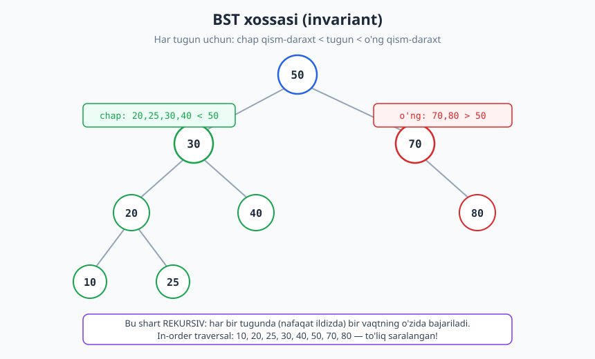
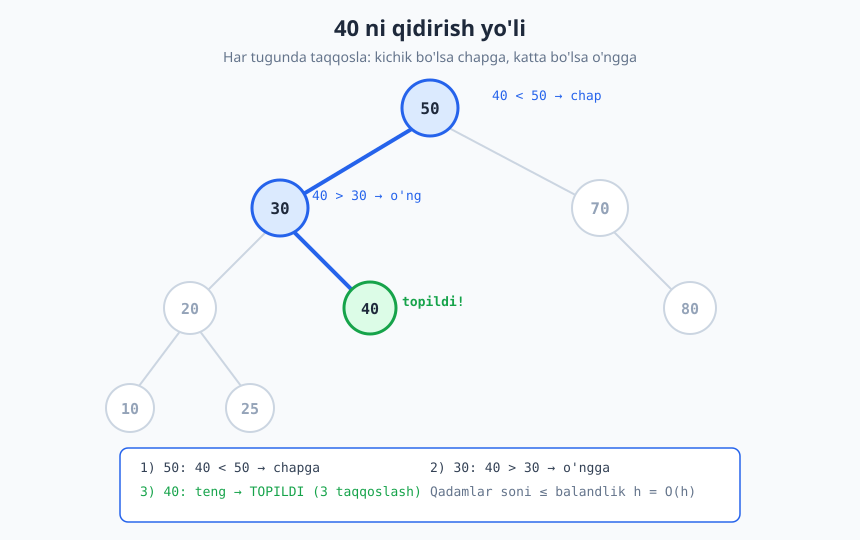
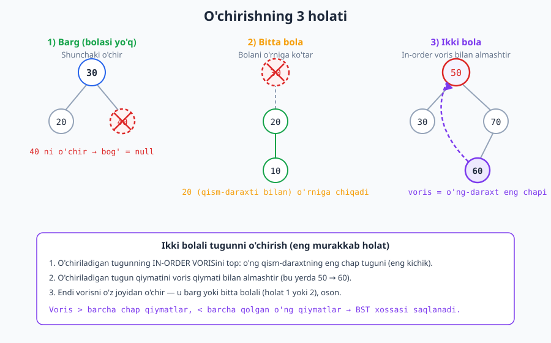

# 17 — Binar qidiruv daraxti (BST)

[⬅️ Oldingi: 16 — Daraxtlar va traversal](./16-daraxtlar-traversal.md) · [🏠 README](./README.md) · [Keyingi: 18 — Balanslangan daraxtlar (AVL, Red-Black, B-tree) ➡️](./18-balanslangan-daraxtlar.md)

---

> **Bu bobda:** Tartiblangan ma'lumotda ham tez qidiruv, ham tez qo'shish/o'chirishni bir vaqtda ta'minlaydigan **binar qidiruv daraxti** (Binary Search Tree, BST) bilan tanishamiz. Uning markaziy invariantini (chap < tugun < o'ng), qidiruv/qo'shish/o'chirish amallarini (o'chirishning uchta holatini batafsil), in-order traversal saralangan ketma-ketlik berishini, va eng muhim zaif tomonini — balanslanmaslikni — o'rganamiz. Oxirida BST ni Python'da 0 dan yozamiz.
>
> **Halollik / Eslatma:** Bu yerdagi murakkablik chegaralari aniq: barcha amal **O(h)**, bunda `h` — daraxt balandligi. O'rtacha (tasodifiy kirishda) `h ≈ log n`, lekin eng yomon holatda `h = n` — bu kafolat emas, statistik kutilma. "Balanslangan" daraxtlar (keyingi bob) `h = O(log n)` ni *kafolatlaydi*. Barcha Python namunalari haqiqatan ishga tushirilib tekshirilgan — in-order chiqishlari va balandliklar kod bergan haqiqiy natijalar.

---

## Muammo: ikki dunyoning eng yaxshisi

Tasavvur qiling, sizda butun davomida o'sib boradigan sonlar to'plami bor va siz uchta amalni tez bajarmoqchisiz: **qidirish** (shu son bormi?), **qo'shish** (yangi son), **o'chirish**. Mavjud ikki strukturani ko'raylik:

- **Saralangan massiv.** Qidiruv ajoyib — binar qidiruv `O(log n)` ([qidiruv algoritmlari](./28-qidiruv-algoritmlari.md)). Ammo qo'shish dahshatli: yangi elementni to'g'ri joyga qo'yish uchun undan keyingi barcha elementlarni surishimiz kerak — `O(n)`.
- **Bog'langan ro'yxat** ([bog'langan ro'yxatlar](./13-boglangan-royxatlar.md)). Ma'lum joyga qo'shish `O(1)`. Ammo qidiruv dahshatli — indeksga sakrash yo'q, boshidan yurib chiqishga to'g'ri keladi, `O(n)`.

Ikkalasida ham bitta amal tez, ikkinchisi sekin. **Hash-jadval** ([hash-jadval](./15-hash-jadval.md)) ikkalasini ham o'rtacha `O(1)` qiladi — lekin u **tartibni yo'qotadi**: "eng kichik element", "30 dan 50 gacha bo'lgan sonlar", "saralangan ro'yxat ber" kabi savollarga javob bera olmaydi.

> **Intuitsiya:** BST bu muammoni "ikkiga bo'lib qidirish" g'oyasini *strukturaga* aylantirib hal qiladi. Binar qidiruvda biz har qadamda massivning yarmini tashlaymiz. BST esa bu "yarmiga bo'lish"ni daraxt shaklida muzlatib qo'yadi: har bir tugun "bundan kichiklar chapda, kattalar o'ngda" deydi. Shunday qilib qidiruv ham, qo'shish ham, o'chirish ham bir xil yo'l — ildizdan pastga — bo'ylab `O(balandlik)` da bajariladi.

| Struktura | Qidirish | Qo'shish | O'chirish | Tartib saqlanadi? |
|---|---|---|---|---|
| Saralangan massiv | O(log n) | O(n) | O(n) | Ha |
| Bog'langan ro'yxat | O(n) | O(1)* | O(1)* | Ha |
| Hash-jadval | O(1) o'rtacha | O(1) o'rtacha | O(1) o'rtacha | **Yo'q** |
| **BST (balanslangan)** | **O(log n)** | **O(log n)** | **O(log n)** | **Ha** |

\* joy allaqachon ma'lum bo'lsa. Aks holda topish uchun `O(n)`.

So'nggi qator — bizning maqsadimiz. BST tartibni ham saqlaydi, uch amalni ham (balanslangan bo'lsa) `O(log n)` qiladi.

## BST xossasi — markaziy invariant

BST oddiy binar daraxt ([daraxtlar va traversal](./16-daraxtlar-traversal.md)), lekin uning qiymatlari maxsus shartga bo'ysunadi:

> **Ta'rif (BST xossasi).** Daraxtdagi **har bir** tugun `x` uchun:
> - `x` ning **chap** qism-daraxtidagi BARCHA qiymatlar `< x.qiymat`,
> - `x` ning **o'ng** qism-daraxtidagi BARCHA qiymatlar `> x.qiymat`.

E'tibor bering — bu shart **rekursiv** va **global**. U faqat to'g'ridan-to'g'ri bolalarga emas, balki butun qism-daraxtga taalluqli. Va u har bir tugunda bir vaqtning o'zida bajarilishi shart, nafaqat ildizda.



Yuqoridagi daraxtda ildiz `50`. Uning chap qism-daraxtidagi hamma narsa (20, 25, 30, 40) — `50` dan kichik; o'ng qism-daraxtidagi hamma narsa (70, 80) — `50` dan katta. Va bu har bir ichki tugunda takrorlanadi: masalan `30` uchun chapda 20, 25, 10 (hammasi `< 30`), o'ngda 40 (`> 30`).

> **Diqqat — keng tarqalgan xato.** "Faqat bevosita bola tekshirilsa yetarli" deb o'ylash noto'g'ri. Tasavvur qiling, ildiz 10, uning o'ng bolasi 15, va 15 ning chap bolasi 6. Mahalliy qaraganda hammasi joyida ko'rinadi (6 < 15). Lekin 6 ildiz 10 ning **o'ng** qism-daraxtida — demak u 10 dan katta bo'lishi shart edi. BST buzilgan! To'g'ri tekshiruv har bir tugunni ruxsat etilgan **oraliq** (past, baland) ichida bo'lishini talab qiladi — buni mashqlarda ko'ramiz.

Misol daraxtimizda tugunlar shunday tuzilgan (ushbu butun bob davomida shu daraxtni misol qilamiz):

```text
            50
          /    \
        30      70
       /  \       \
     20    40      80
    /  \
  10    25
```

## Qidiruv — daraxt bo'ylab pastga

Qidiruv BST xossasidan to'g'ridan-to'g'ri kelib chiqadi. Ildizdan boshlaymiz va har bir tugunda atigi bitta taqqoslash qilamiz:

```text
qidir(ildiz, maqsad):
    tugun = ildiz
    while tugun != null:
        if maqsad == tugun.qiymat:  return TOPILDI
        elif maqsad < tugun.qiymat: tugun = tugun.chap   # kichik -> chapga
        else:                       tugun = tugun.ong     # katta -> o'ngga
    return YO'Q
```

Har qadamda qolgan daraxtning **butun bir yarmini** (bir qism-daraxtni) tashlaymiz — chunki BST xossasi maqsadning qaysi tomonda bo'lishini kafolatlaydi. Bu xuddi saralangan massivdagi binar qidiruvga o'xshaydi, faqat "o'rta indeks" o'rniga "joriy tugun".



`40` ni qidiraylik. Trassirovka:

| Qadam | Joriy tugun | Taqqoslash | Harakat |
|---|---|---|---|
| 1 | 50 | 40 < 50 | chapga |
| 2 | 30 | 40 > 30 | o'ngga |
| 3 | 40 | 40 = 40 | **TOPILDI** |

Atigi 3 taqqoslash, garchi daraxtda 9 ta tugun bo'lsa ham. Eng ko'p qancha qadam? Eng uzun yo'l — ildizdan eng chuqur bargacha, ya'ni **daraxt balandligi `h`**. Demak qidiruv **O(h)**.

> **Nega to'g'ri ishlaydi (invariant).** Sikl invarianti: *agar maqsad daraxtda umuman bo'lsa, u doimo `tugun` ildiz qilgan qism-daraxtda yotadi.* Boshida `tugun = ildiz`, demak butun daraxt — to'g'ri. Har qadamda: `maqsad < tugun.qiymat` bo'lsa, BST xossasiga ko'ra maqsad faqat chap qism-daraxtda bo'lishi mumkin (o'ngdagilar hammasi kattaroq) — invariant chapga o'tganda saqlanadi. Simmetrik tarzda o'ngga ham. Demak sikl tugaganda yo maqsadni topamiz, yo `null` ga yetamiz (qism-daraxt bo'sh = maqsad yo'q edi).

## Qo'shish — qidiruv yo'lining oxiriga "osib qo'yamiz"

Qo'shish ham xuddi qidiruv yo'lini bosib o'tadi. Farqi: maqsadni topa olmasdan `null` ga yetganimizda — **aynan o'sha bo'sh joy** yangi elementning to'g'ri o'rni. U yerga yangi barg ulaymiz.

```text
qoshish(tugun, q):
    if tugun == null:           return yangi_tugun(q)   # bo'sh joy topildi
    if q < tugun.qiymat:        tugun.chap = qoshish(tugun.chap, q)
    elif q > tugun.qiymat:      tugun.ong  = qoshish(tugun.ong, q)
    # q == tugun.qiymat bo'lsa: takror, hech narsa qilmaymiz
    return tugun
```

Yangi element **doimo barg sifatida** qo'shiladi — mavjud tugunlar o'rni o'zgarmaydi. Bu qidiruv yo'lining uzunligi qadar ish, ya'ni yana **O(h)**. Va muhimi: qo'shilgandan keyin ham BST xossasi buzilmaydi, chunki biz elementni aynan u tegishli bo'lgan oraliqqa qo'ydik.

Bo'sh daraxtga `50, 30, 70, 20, 40, 60, 80, 10, 25` ni shu tartibda qo'shsak, yuqoridagi misol daraxt hosil bo'ladi.

## Min va max — eng chap va eng o'ng

BST xossasi minimum va maksimumni topishni bemalol qiladi:

- **Eng kichik** element — toki `chap` bola bor ekan, chapga yur. Eng chap tugun. Undan kichigi bo'lolmaydi.
- **Eng katta** element — toki `ong` bola bor ekan, o'ngga yur. Eng o'ng tugun.

```text
eng_kichik(ildiz):  tugun = ildiz; while tugun.chap != null: tugun = tugun.chap; return tugun
```

Ikkalasi ham `O(h)`. Bizning misol daraxtda eng chap — 10, eng o'ng — 80.

## O'chirish — uchta holat

O'chirish — BST ning eng nozik amali, chunki tugunni olib tashlagandan keyin ham daraxt BST bo'lib qolishi shart. O'chiriladigan tugunni avval qidiruv bilan topamiz (`O(h)`), keyin uning bolalari soniga qarab **uch holat**dan birini qo'llaymiz.



**Holat 1 — barg (bolasi yo'q).** Eng oson. Shunchaki tugunni o'chiramiz — ota-onasining tegishli bog'lamasini `null` qilamiz. Misol: `40` ni o'chirish (u barg) — `30` ning o'ng bog'lami `null` bo'ladi.

**Holat 2 — bitta bola.** Tugunni o'chirib, uning **yagona bolasini** (qism-daraxti bilan birga) o'rniga ko'taramiz. Bog'lamni qayta ulaganimizda BST xossasi saqlanadi, chunki butun qism-daraxt o'sha oraliqda qoladi. Misol: chap bolasi 20 (uning ostida 10), o'ng bolasi yo'q bo'lgan `30` ni o'chirsak — `20` (qism-daraxti bilan) `30` ning o'rnini egallaydi.

**Holat 3 — ikki bola.** Eng murakkabi. Tugunni shunchaki olib tashlasak, ikkita "yetim" qism-daraxt qoladi — qaysi birini o'rniga qo'yish noaniq. Yechim: o'chiriladigan tugunni **in-order voris** bilan almashtirish.

> **In-order voris** — o'chiriladigan tugundan kattaroq qiymatlar orasida eng kichigi. U **o'ng qism-daraxtning eng chap tuguni**. Nega aynan u? Chunki u o'chiriladigan tugun o'rniga turganda: o'zidan chapdagi barcha qiymatlardan katta (chunki ular asl tugunning chap qismida edi), va o'zidan o'ngdagi qolgan barcha qiymatlardan kichik (chunki u o'ng qism-daraxtning *eng kichigi*). Demak BST xossasi tiklanadi.

Algoritm:

1. O'chiriladigan tugunning o'ng qism-daraxtidagi **eng chap tugunni** (voris) top.
2. Tugun qiymatini voris qiymati bilan almashtir.
3. Endi vorisni o'z eski joyidan o'chir. Muhim kuzatuv: voris **hech qachon chap bolaga ega bo'lmaydi** (u eng chap tugun!) — demak u barg yoki bitta (o'ng) bolali. Ya'ni 3-qadam doimo Holat 1 yoki Holat 2 ga qaytadi — oson.

Misol: ildiz `50` ni o'chirish. O'ng qism-daraxti `{70, 80}` (yoki bizning to'liq misolda `{60, 70, 80}`); uning eng chap tuguni — voris. Vorisni `50` o'rniga ko'chiramiz, so'ng vorisni eski joyidan olib tashlaymiz.

> **Eslatma — salaf ham bo'ladi.** Voris (successor) o'rniga **salaf** (predecessor) — chap qism-daraxtning eng o'ng tugunini — ishlatsa ham bo'ladi. Ikkalasi ham to'g'ri. Amalda ko'pchilik kutubxonalar daraxtning bir tomoniga og'ib qolmaslik uchun ikkisini galma-gal tanlaydi; biz soddalik uchun doimo vorisni ishlatamiz.

O'chirish ham `O(h)` — qidiruv yo'li + vorisni topish (yana bir marta pastga yurish), ikkalasi ham balandlik bilan chegaralangan.

## In-order traversal = saralangan ketma-ketlik

BST ning eng nafis xossasi: uni **in-order** (chap → tugun → o'ng) tartibda aylanib chiqsangiz ([traversallar](./16-daraxtlar-traversal.md)), qiymatlar **o'sish tartibida** chiqadi.

Bizning misol daraxt uchun in-order natija: `10, 20, 25, 30, 40, 50, 60, 70, 80` — to'liq saralangan!

> **Isbot (eskiz, induksiya).** Tugun soni bo'yicha induksiya. **Baza:** bo'sh daraxt — bo'sh ketma-ketlik, saralangan. **Qadam:** ildiz `x` bo'lsin. In-order ta'rifi bo'yicha: avval butun chap qism-daraxt in-order, keyin `x`, keyin butun o'ng qism-daraxt in-order chiqadi. Induktiv farazga ko'ra chap qism-daraxt in-order natijasi saralangan, va BST xossasi bo'yicha uning barcha elementlari `< x`. Xuddi shunday o'ng qism-daraxt natijasi saralangan va barchasi `> x`. Demak: `[chap: hammasi < x]`, so'ng `x`, so'ng `[o'ng: hammasi > x]` — uchta bo'lak ulanganda butun ketma-ketlik saralangan bo'lib chiqadi. ∎

Bu xossa amaliy: BST ni "doimo saralangan ko'rinishda turadigan to'plam" deb qarash mumkin. Saralangan chiqish, oraliq so'rovlar, "keyingi/oldingi element" — hammasi tabiiy.

## Muammo: balanslanmaslik

Hozircha har joyda `O(h)` deb yozdik, `O(log n)` emas. Sababi muhim. `O(log n)` faqat **balandlik kichik** bo'lganda haqiqat — `h ≈ log n` bo'lganda. Lekin BST balandligi qo'shish **tartibiga** bog'liq, va u juda yomon bo'lishi mumkin.

**Halokatli holat:** bo'sh daraxtga sonlarni **allaqachon saralangan tartibda** qo'shing — masalan `1, 2, 3, 4, 5, 6, 7`. Har bir yangi element avvalgilarning hammasidan katta, demak doimo **o'ngga** ketadi:

```text
1
 \
  2
   \
    3
     \
      4
       \
        5  ...
```

Bu daraxt emas — bu amalda **bog'langan ro'yxat**! Balandlik `n`, barcha tugunlar bir ustunda. Endi qidiruv, qo'shish, o'chirish — hammasi `O(n)`. BST ning butun afzalligi yo'qoldi.

| Holat | Balandlik `h` | Amal narxi |
|---|---|---|
| O'rtacha (tasodifiy kirish) | ≈ `log n` | O(log n) |
| Eng yaxshi (mukammal muvozanat) | `⌊log₂ n⌋ + 1` | O(log n) |
| **Eng yomon (saralangan kirish)** | `n` | **O(n)** |

> **Trade-off / asosiy saboq.** BST ning o'zi balandlikni nazorat qilmaydi — u faqat BST xossasini saqlaydi. Yaxshi ishlash *kirish tasodifiyligiga umid* qiladi, kafolat bermaydi. Bu yetarli emas: real tizimda ma'lumot ko'pincha saralangan yoki yarim saralangan keladi (vaqt belgilari, IDlar, alifbo bo'yicha). Demak bizga balandlikni **majburan** `O(log n)` da ushlab turadigan mexanizm kerak.

Mana shu yerda [balanslangan daraxtlar](./18-balanslangan-daraxtlar.md) — AVL, Red-Black, B-tree — kirib keladi. Ular har bir qo'shish/o'chirishdan keyin daraxtni **avtomatik qayta muvozanatlaydi** (rotatsiya orqali), shu bilan `h = O(log n)` ni kafolatlaydi. Ularning hammasi BST xossasini saqlaydi — ya'ni bu bobdagi qidiruv/in-order mantig'i o'sha-o'sha qoladi, ustiga faqat muvozanat qatlami qo'shiladi.

## Murakkablik — yakuniy jadval

| Amal | O'rtacha | Eng yomon |
|---|---|---|
| Qidirish | O(log n) | O(n) |
| Qo'shish | O(log n) | O(n) |
| O'chirish | O(log n) | O(n) |
| Min / Max | O(log n) | O(n) |
| In-order (saralangan ro'yxat) | O(n) | O(n) |
| Xotira | O(n) | O(n) |

Barcha qidiruv-tipidagi amallar aslida **O(h)**; jadvaldagi farq shunchaki `h` ning o'rtacha (`log n`) va eng yomon (`n`) qiymatlari. In-order har bir tugunga bir marta tashrif buyuradi, demak balandlikdan qat'i nazar `O(n)`.

## Python: BST ni 0 dan yozamiz

Endi to'liq BST ni yozamiz: qo'shish, qidirish, min/max, o'chirish (uch holat), in-order. Quyidagi kod haqiqatan ishga tushirilib tekshirilgan.

```python
class Tugun:
    def __init__(self, qiymat):
        self.qiymat = qiymat
        self.chap = None
        self.ong = None

class BST:
    def __init__(self):
        self.ildiz = None

    def qoshish(self, qiymat):
        self.ildiz = self._qoshish(self.ildiz, qiymat)

    def _qoshish(self, tugun, qiymat):
        if tugun is None:
            return Tugun(qiymat)                 # bo'sh joy -> yangi barg
        if qiymat < tugun.qiymat:
            tugun.chap = self._qoshish(tugun.chap, qiymat)
        elif qiymat > tugun.qiymat:
            tugun.ong = self._qoshish(tugun.ong, qiymat)
        # teng bo'lsa: takror, e'tiborsiz qoldiramiz
        return tugun

    def qidirish(self, qiymat):
        tugun = self.ildiz
        while tugun is not None:
            if qiymat == tugun.qiymat:
                return True
            elif qiymat < tugun.qiymat:
                tugun = tugun.chap              # kichik -> chapga
            else:
                tugun = tugun.ong               # katta -> o'ngga
        return False

    def eng_kichik(self):
        tugun = self.ildiz
        if tugun is None:
            return None
        while tugun.chap is not None:           # toki chap bor ekan, chapga
            tugun = tugun.chap
        return tugun.qiymat

    def eng_katta(self):
        tugun = self.ildiz
        if tugun is None:
            return None
        while tugun.ong is not None:            # toki o'ng bor ekan, o'ngga
            tugun = tugun.ong
        return tugun.qiymat

    def ochirish(self, qiymat):
        self.ildiz = self._ochirish(self.ildiz, qiymat)

    def _ochirish(self, tugun, qiymat):
        if tugun is None:
            return None
        if qiymat < tugun.qiymat:
            tugun.chap = self._ochirish(tugun.chap, qiymat)
        elif qiymat > tugun.qiymat:
            tugun.ong = self._ochirish(tugun.ong, qiymat)
        else:
            # topildi
            if tugun.chap is None:
                return tugun.ong                # holat 1/2: chap yo'q
            if tugun.ong is None:
                return tugun.chap               # holat 2: o'ng yo'q
            # holat 3: ikki bola -> in-order voris (o'ng-daraxt eng chapi)
            voris = tugun.ong
            while voris.chap is not None:
                voris = voris.chap
            tugun.qiymat = voris.qiymat         # qiymatni ko'chir
            tugun.ong = self._ochirish(tugun.ong, voris.qiymat)  # vorisni o'chir
        return tugun

    def in_order(self):
        natija = []
        self._in_order(self.ildiz, natija)
        return natija

    def _in_order(self, tugun, natija):
        if tugun is None:
            return
        self._in_order(tugun.chap, natija)      # chap
        natija.append(tugun.qiymat)             # tugun
        self._in_order(tugun.ong, natija)       # o'ng


t = BST()
for x in [50, 30, 70, 20, 40, 60, 80, 10, 25]:
    t.qoshish(x)

print(t.in_order())                       # -> [10, 20, 25, 30, 40, 50, 60, 70, 80]
print(t.qidirish(40), t.qidirish(45))     # -> True False
print(t.eng_kichik(), t.eng_katta())      # -> 10 80

t.ochirish(40)                            # holat 1: barg
print(t.in_order())                       # -> [10, 20, 25, 30, 50, 60, 70, 80]
t.ochirish(30)                            # holat 2: bitta bola (chap=20)
print(t.in_order())                       # -> [10, 20, 25, 50, 60, 70, 80]
t.ochirish(50)                            # holat 3: ildiz, ikki bola
print(t.in_order())                       # -> [10, 20, 25, 60, 70, 80]
```

Diqqat qiling: **har bir o'chirishdan keyin in-order baribir saralangan bo'lib qolmoqda** — bu BST xossasi buzilmaganining isboti. `50` ni o'chirganda uning o'rnini in-order voris `60` egalladi (o'ng qism-daraxtning eng kichigi), va saralanganlik saqlandi.

## Asosiy g'oyalar (bobni qisqacha)

- **BST xossasi:** har tugunda chap qism-daraxt `<` tugun `<` o'ng qism-daraxt. Rekursiv va global shart — faqat bevosita bola emas, butun qism-daraxt.
- **Qidirish/qo'shish:** ildizdan pastga, har qadamda yarmini tashlab — `O(h)`. Qo'shilgan element doimo barg.
- **O'chirish uch holat:** barg (o'chir), bitta bola (bolani ko'tar), ikki bola (in-order voris bilan almashtirib, vorisni o'chir).
- **In-order = saralangan.** BST ni "doimo saralangan to'plam" deb qarang; isboti induksiya bilan.
- **Zaif tomon:** balandlik kirish tartibiga bog'liq. Saralangan kirish daraxtni ro'yxatga aylantiradi (`h = n`, amallar `O(n)`).
- **Yechim — kelasi bob:** [balanslangan daraxtlar](./18-balanslangan-daraxtlar.md) `h = O(log n)` ni kafolatlaydi, BST xossasini saqlagan holda.

## Mashqlar

### Oson

**1-mashq.** Bo'sh daraxtga shu tartibda qo'shing: `8, 3, 10, 1, 6, 14, 4, 7, 13`. Hosil bo'lgan daraxtni chizing (yoki struktura sifatida yozing).

**2-mashq.** 1-mashqdagi daraxtda `7` ni qidirish yo'lini yozing: qaysi tugunlar bilan taqqoslanadi va har birida chapga yoki o'ngga ketamizmi?

### O'rta

**3-mashq.** Bo'sh daraxtga `5, 2, 8, 1, 3, 7, 9` qo'shilsa, in-order traversal natijasi qanday bo'ladi? Daraxtning balandligi nechi? Eng kichik va eng katta elementlari-chi?

**4-mashq.** Bir xil sonlar to'plamini `{1, 2, 3, 4, 5}` ikki xil tartibda qo'shamiz: (a) `3, 1, 5, 2, 4` va (b) `1, 2, 3, 4, 5`. Ikkala holatda hosil bo'lgan daraxt balandligini toping. Ikkalasining in-order natijasi bir xilmi?

**5-mashq.** Bir xil 5 ta sonni qo'shadigan, lekin (a) ga qaraganda *kichikroq* balandlik bera oladigan boshqa qo'shish tartibi bormi? Mumkin bo'lgan eng kichik balandlik nechi?

### Qiyin

**6-mashq.** Quyidagi daraxtdan `50` ni qo'lda o'chiring (ikki bolali holat). In-order vorisni aniqlang, almashtirilgandan keyingi daraxtni yozing va in-order baribir saralanganligini tekshiring.

```text
        50
       /  \
     30    70
    /  \   /  \
  20   40 60   80
```

**7-mashq.** Bir tugun "BST mi yoki yo'q"ligini aytib bo'lmasligini ko'rsatuvchi misol o'ylab toping: har bir tugun bevosita bolalaridan to'g'ri (chap kichik, o'ng katta), lekin daraxt baribir BST emas. Keyin to'g'ri tekshiruv algoritmini (oraliq usulida) yozing.

**8-mashq.** `k`-eng kichik elementni topadigan algoritm yozing (in-order yordamida). 3-mashqdagi daraxtda 1-, 4-, 7-eng kichik elementlar nima?

**9-mashq.** `1, 2, 3, ..., n` ni shu tartibda BST ga qo'shsangiz, balandlik nechi bo'ladi va nima uchun bu BST emas, balki bog'langan ro'yxatga aylanadi? Bu holatda qidiruv murakkabligi qanday? Bu nima uchun balanslangan daraxtlarga ehtiyoj tug'diradi?

<details markdown="1">
<summary>Yechimlar</summary>

### 1-mashq yechimi

`8` ildiz bo'ladi. `3 < 8` chapga; `10 > 8` o'ngga; `1 < 8 < 3` ... ketma-ket:

```text
          8
        /   \
       3      10
      / \       \
     1   6      14
        / \    /
       4   7  13
```

Tekshirish (har bir qo'shish qaysi yo'lni bosadi): `1`: 8→3→chap. `6`: 8→3→o'ng. `14`: 8→10→o'ng. `4`: 8→3→6→chap. `7`: 8→3→6→o'ng. `13`: 8→10→14→chap.

### 2-mashq yechimi

`7` ni qidirish:

| Qadam | Tugun | Taqqoslash | Harakat |
|---|---|---|---|
| 1 | 8 | 7 < 8 | chapga |
| 2 | 3 | 7 > 3 | o'ngga |
| 3 | 6 | 7 > 6 | o'ngga |
| 4 | 7 | 7 = 7 | **TOPILDI** |

4 ta taqqoslash.

### 3-mashq yechimi

Daraxt:

```text
       5
      / \
     2   8
    / \ / \
   1  3 7  9
```

In-order: `1, 2, 3, 5, 7, 8, 9` (saralangan, har doimgidek). Balandlik = **3** (3 ta qator: 5 → {2,8} → {1,3,7,9}). Eng kichik = **1** (eng chap), eng katta = **9** (eng o'ng).

### 4-mashq yechimi

**(a) `3, 1, 5, 2, 4`:**

```text
     3
    / \
   1   5
    \  /
     2 4
```
Balandlik = **3**.

**(b) `1, 2, 3, 4, 5`** — har biri avvalgisidan katta, hammasi o'ngga ketadi:

```text
1
 \
  2
   \
    3
     \
      4
       \
        5
```
Balandlik = **5** (cho'zilgan, ro'yxatga o'xshash).

In-order natijasi **ikkalasida ham bir xil**: `1, 2, 3, 4, 5`. BST ning in-order natijasi faqat to'plamga bog'liq, qo'shish tartibiga emas — u doimo saralangan ketma-ketlik. Tartib esa faqat **struktura/balandlikka** ta'sir qiladi.

### 5-mashq yechimi

Ha. Mukammal muvozanatli BST `n=5` uchun balandlik **3** bera oladi, lekin (a) ham 3 chiqdi. Undan kamini olish uchun ildizni median (3) qilib, balanced qo'shamiz: masalan `3, 2, 4, 1, 5`:

```text
     3
    / \
   2   4
  /     \
 1       5
```
Balandlik = **3**. `n=5` uchun mumkin bo'lgan eng kichik balandlik `⌊log₂ 5⌋ + 1 = 2 + 1 = 3`. Demak 3 — minimal; undan kichigi bo'lmaydi (3 qatorga 5 tugun sig'maydi: 1+2+... max 1+2+4=7, lekin 2 qatorga atigi 1+2=3 tugun sig'adi, 5 dan kam). Demak minimal balandlik = 3.

### 6-mashq yechimi

`50` ning ikki bolasi bor → holat 3. **In-order voris** = o'ng qism-daraxtning (`{70, 60, 80}`) eng chap tuguni = **60**.

`50` o'rniga `60` ni qo'yamiz, so'ng eski `60` (u barg edi) ni o'chiramiz:

```text
        60
       /  \
     30    70
    /  \     \
  20   40    80
```

In-order: `20, 30, 40, 60, 70, 80` — saralangan, BST xossasi saqlandi. ✓ (`60` o'zidan chapdagilarning hammasidan — 20,30,40 — katta, qolgan o'ngdagilardan — 70,80 — kichik, demak to'g'ri o'ringa tushdi.)

### 7-mashq yechimi

**Misol:** ildiz `10`, o'ng bola `15`, `15` ning chap bolasi `6`.

```text
   10
     \
      15
     /
    6
```

Har bir tugun *bevosita* bolalaridan to'g'ri: `15 > 10` ✓, `6 < 15` ✓. Lekin `6` ildiz `10` ning **o'ng** qism-daraxtida — demak u `10` dan katta bo'lishi shart edi. `6 < 10`, BST **buzilgan**. Mahalliy tekshiruv yetarli emas.

**To'g'ri tekshiruv (oraliq usuli):** har bir tugun ruxsat etilgan `(past, baland)` oraliqda yotishi shart. Ildiz uchun oraliq `(-∞, +∞)`; chapga tushganda yuqori chegara joriy tugun qiymatiga, o'ngga tushganda pastki chegara joriy tugun qiymatiga tortiladi.

```python
class T:
    def __init__(self, q, chap=None, ong=None):
        self.q = q; self.chap = chap; self.ong = ong

def bst_mi(t, past=float('-inf'), baland=float('inf')):
    if t is None:
        return True
    if not (past < t.q < baland):
        return False
    return bst_mi(t.chap, past, t.q) and bst_mi(t.ong, t.q, baland)

# buzilgan misol: 6, 10 ning o'ng-daraxtida bo'lsa-da, 10 dan kichik
buzuq = T(10, ong=T(15, chap=T(6)))
print(bst_mi(buzuq))                # -> False
# to'g'ri daraxt
yaxshi = T(10, chap=T(5), ong=T(15, chap=T(12)))
print(bst_mi(yaxshi))               # -> True
```

Ishga tushirilganda chiqishi: `False` keyin `True`. Murakkablik `O(n)` (har tugunga bir tashrif).

### 8-mashq yechimi

In-order natija saralangan bo'lgani uchun, `k`-eng kichik element = in-order ketma-ketligining `k`-elementi (1-indeksli). Samarali yechim: in-order yurib, `k` ta element to'plagach to'xtaymiz.

```python
class T:
    def __init__(self, q, chap=None, ong=None):
        self.q = q; self.chap = chap; self.ong = ong

def k_eng_kichik(t, k):
    yigindi = []
    def yur(n):
        if n is None or len(yigindi) >= k:
            return
        yur(n.chap)
        if len(yigindi) < k:
            yigindi.append(n.q)
        yur(n.ong)
    yur(t)
    return yigindi[k-1] if len(yigindi) >= k else None

# 3-mashqdagi daraxt: 1,2,3,5,7,8,9
agac = T(5, T(2, T(1), T(3)), T(8, T(7), T(9)))
print(k_eng_kichik(agac, 1))   # -> 1
print(k_eng_kichik(agac, 4))   # -> 5
print(k_eng_kichik(agac, 7))   # -> 9
```

Ishga tushirilganda: `1`, `5`, `9`. 1-eng kichik = **1**, 4-eng kichik = **5** (median), 7-eng kichik = **9** (maksimum). Murakkablik `O(h + k)` — ildizdan eng chapga tushish + `k` ta element.

### 9-mashq yechimi

`1, 2, ..., n` tartibida har bir yangi son avvalgilarning hammasidan katta, demak doimo **o'ngga** ketadi. Hech qachon chap shox tug'ilmaydi — natijada har bir tugunning faqat bitta (o'ng) bolasi bo'ladi:

```text
1 -> 2 -> 3 -> ... -> n   (hammasi o'ngga cho'zilgan)
```

Bu strukturada balandlik **`h = n`** — bu aslida bog'langan ro'yxat (har tugunda bitta bog'lam). Qidiruv `n` ni topish uchun butun zanjirni bosib o'tadi → **O(n)**, xuddi tartiblanmagan ro'yxatdagidek. BST ning `O(log n)` va'dasi `h ≈ log n` bo'lgandagina amal qiladi; bu yerda `h = n`, demak va'da buziladi.

Buni Python'da tasdiqlaymiz:

```python
class T:
    def __init__(self, q):
        self.q = q; self.chap = None; self.ong = None

def qoshish(ildiz, q):
    if ildiz is None:
        return T(q)
    if q < ildiz.q:
        ildiz.chap = qoshish(ildiz.chap, q)
    else:
        ildiz.ong = qoshish(ildiz.ong, q)
    return ildiz

def balandlik(t):
    return 0 if t is None else 1 + max(balandlik(t.chap), balandlik(t.ong))

ild = None
for x in [1, 2, 3, 4, 5, 6, 7]:
    ild = qoshish(ild, x)
print(balandlik(ild))     # -> 7  (saralangan kirish -> ro'yxat)

ild2 = None
for x in [4, 2, 6, 1, 3, 5, 7]:
    ild2 = qoshish(ild2, x)
print(balandlik(ild2))    # -> 3  (muvozanatli kirish)
```

Ishga tushirilganda: `7` keyin `3`. Bir xil 7 ta son, lekin balandlik 7 dan 3 ga tushdi — farq faqat kirish tartibida.

Bu nima uchun **balanslangan daraxtlar** kerakligini ko'rsatadi: kirish tartibiga ishonib bo'lmaydi (real dunyoda ma'lumot ko'pincha saralangan keladi). [Balanslangan daraxtlar](./18-balanslangan-daraxtlar.md) (AVL, Red-Black) har qo'shish/o'chirishdan keyin rotatsiya bilan daraxtni qayta muvozanatlab, `h = O(log n)` ni **kafolatlaydi** — kirish qanday tartibda kelishidan qat'i nazar.

</details>

---

[⬅️ Oldingi: 16 — Daraxtlar va traversal](./16-daraxtlar-traversal.md) · [🏠 README](./README.md) · [Keyingi: 18 — Balanslangan daraxtlar (AVL, Red-Black, B-tree) ➡️](./18-balanslangan-daraxtlar.md)
